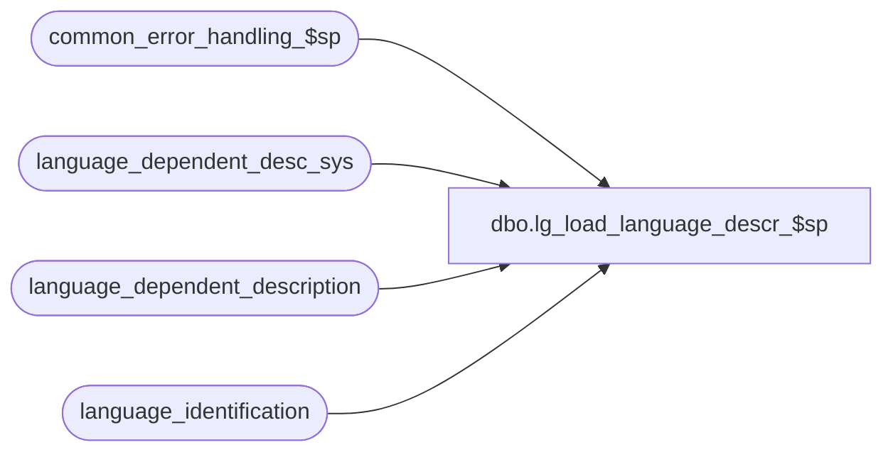

# dbo.lg_load_language_descr_$sp

**Database:** auditworks  
**Server:** bedrockdb01  

## Architecture Diagram



## Table Dependencies

| Referenced Table |
|---|
| common_error_handling_$sp |
| language_dependent_desc_sys |
| language_dependent_description |
| language_identification |

## Stored Procedure Code

```sql
create proc dbo.lg_load_language_descr_$sp @language_id smallint = NULL
AS
/* 
PROC NAME:   lg_load_language_descr_$sp
PROC DESC:   To insert the language_dependent_description table based on the descriptions
             loaded into language_dependent_description_sys.  
             Called by release_no_$upgr.
             Note:  user changes made to system entries are lost if the language has been deactivated.

HISTORY

Note:  unicode compliant version

Date     Name              Def# Desc
Mar12,18 Nova Lee	 DAOM-3160 Fix error that occurred during cascade of new system supplied language translation entries for other 			 			active related languages
Mar11,14 Vicci           150527 Add support for Chinese -People's Republic of China (2052).
Feb27,13 Vicci           142092 Add support for Mexican Spanish (2058).
Jun16/11 Vicci           127716 Replace usage of language_dependent_desc_eng, _fre, _uk with language_dependent_desc_sys.
				Apply Eng/Fre updates to other related languages as well.
sep09/04 Maryam   DV-1120/31230 add UKENG support
Oct15/03 Vicci            16590 author
*/

DECLARE @errmsg 			nvarchar(255),
	@errno				int,
	@log_error_flag			tinyint,
	@message_id			int,
	@object_name			nvarchar(255),
	@operation_name     		nvarchar(100),
	@process_no			int,
	@process_name			nvarchar(100)

SELECT @log_error_flag = 1, -- called by smartload
       @process_no = 0, -- Table Maintenance
       @process_name = 'lg_load_language_descr_$sp',
       @message_id = 201068,
       @errno = 0

--Remove system-defined resource_ids which no longer exist for the languages for which translations are provided
DELETE language_dependent_description
  FROM (SELECT ldd.resource_id, ldd.language_id
          FROM language_dependent_description ldd 
               LEFT OUTER JOIN language_dependent_desc_sys sys
                 ON ldd.resource_id = sys.resource_id
                AND ldd.language_id = sys.language_id
         WHERE ldd.resource_id < 10000000
           AND sys.resource_id IS NULL
           AND ldd.language_id in (1033, 3084, 2057, 2058, 2052)) d
 WHERE language_dependent_description.resource_id < 10000000
   AND language_dependent_description.resource_id = d.resource_id
   AND language_dependent_description.language_id = d.language_id


--Correct translations, preserve any language translation modifications made by the user
UPDATE language_dependent_description
   SET display_description = sys.display_description
  FROM language_dependent_desc_sys sys
 WHERE sys.display_description IS NOT NULL
   AND sys.language_id in (1033, 3084, 2057, 2058, 2052)
   AND (language_dependent_description.display_description = language_dependent_description.system_description --preserve any language translation modifications made by the user
        OR language_dependent_description.display_description IS NULL
        OR LTRIM(RTRIM(language_dependent_description.display_description)) = '')
   AND language_dependent_description.resource_id < 10000000
   AND sys.resource_id = language_dependent_description.resource_id 
   AND sys.language_id = language_dependent_description.language_id 
   AND (sys.display_description <> language_dependent_description.display_description OR language_dependent_description.display_description IS NULL OR LTRIM(RTRIM(language_dependent_description.display_description)) = '')
SELECT @errno = @@error
IF @errno <> 0
BEGIN
  SELECT @errmsg = 'Correct translations, preserve any language translation modifications made by the user',
         @object_name = 'language_dependent_description',
         @operation_name = 'UPDATE'      
  GOTO error
END

--Cascade translation corrections to other related languages, preserving any language translation modifications made by the user
UPDATE language_dependent_description
   SET display_description = sys.display_description
  FROM language_identification i
       INNER JOIN language_dependent_desc_sys sys
          ON i.root_language_id = sys.language_id
 WHERE i.active_flag = 1
   AND i.language_id not in (1033, 3084, 2057, 2058, 2052)
   AND i.root_language_id in (1033, 3084, 2057, 2058, 2052)
   AND sys.display_description IS NOT NULL
   AND (language_dependent_description.display_description = language_dependent_description.system_description --preserve any language translation modifications made by the user
        OR language_dependent_description.display_description IS NULL
        OR LTRIM(RTRIM(language_dependent_description.display_description)) = '')
   AND language_dependent_description.resource_id < 10000000
   AND language_dependent_description.language_id = i.language_id
   AND sys.resource_id = language_dependent_description.resource_id 
   AND (sys.display_description <> language_dependent_description.display_description OR language_dependent_description.display_description IS NULL OR LTRIM(RTRIM(language_dependent_description.display_description)) = '')
SELECT @errno = @@error
IF @errno <> 0
BEGIN
  SELECT @errmsg = 'Cascade translations corrections, preserve any language translation modifications made by the user',
         @object_name = 'language_dependent_description',
         @operation_name = 'UPDATE'      
  GOTO error
END

--Correct system display description (for use is user wishes to "reset" descriptions previously overridden to system supplied defaults).
UPDATE language_dependent_description
   SET system_description = sys.system_description
  FROM language_dependent_desc_sys sys
 WHERE language_dependent_description.resource_id < 10000000
   AND sys.resource_id = language_dependent_description.resource_id 
   AND sys.language_id = language_dependent_description.language_id 
   AND (sys.system_description <> language_dependent_description.system_description OR language_dependent_description.system_description IS NULL OR LTRIM(RTRIM(language_dependent_description.system_description)) = '')
SELECT @errno = @@error
IF @errno <> 0
BEGIN
  SELECT @errmsg = 'Correct system translations to support UI option to reset display description to system description',
         @object_name = 'language_dependent_description',
         @operation_name = 'UPDATE'      
  GOTO error
END

--Cascade system display description corrections to other languages (for use is user wishes to "reset" descriptions previously overridden to system supplied defaults).
UPDATE language_dependent_description
   SET system_description = sys.system_description
  FROM language_identification i
       INNER JOIN language_dependent_desc_sys sys
          ON i.root_language_id = sys.language_id
 WHERE i.active_flag = 1
   AND i.language_id not in (1033, 3084, 2057, 2058, 2052)
   AND i.root_language_id in (1033, 3084, 2057, 2058, 2052)
   AND language_dependent_description.resource_id < 10000000
   AND sys.resource_id = language_dependent_description.resource_id 
   AND i.language_id = language_dependent_description.language_id 
   AND (sys.system_description <> language_dependent_description.system_description OR language_dependent_description.system_description IS NULL OR LTRIM(RTRIM(language_dependent_description.system_description)) = '')
SELECT @errno = @@error
IF @errno <> 0
BEGIN
  SELECT @errmsg = 'Cascade system translation corrections to support UI option to reset display description to system description',
         @object_name = 'language_dependent_description',
         @operation_name = 'UPDATE'      
  GOTO error
END

IF EXISTS (SELECT 1 
             FROM language_identification l
            WHERE l.language_id <> 1033
              AND l.active_flag = 1)
BEGIN
  INSERT into language_dependent_description(
         resource_id,
         language_id,
         display_description,
         system_description)
  SELECT sys.resource_id,
         sys.language_id,
         sys.display_description,
         sys.system_description
    FROM language_identification l
         INNER JOIN language_dependent_desc_sys sys
            ON l.language_id = sys.language_id
           AND sys.resource_id < 10000000
   LEFT OUTER JOIN language_dependent_description ldd
           ON sys.language_id = ldd.language_id
          AND sys.resource_id = ldd.resource_id
   WHERE l.language_id in (1033, 3084, 2057, 2058, 2052)
     AND (l.active_flag = 1 OR l.language_id = 1033)
     AND ldd.resource_id IS NULL
  SELECT @errno = @@error
  IF @errno <> 0
  BEGIN
    SELECT @errmsg = 'Add new system supplied language translation entries for active languages',
           @object_name = 'language_dependent_description',
           @operation_name = 'INSERT'      
    GOTO error
  END

  INSERT into language_dependent_description(
         resource_id,
         language_id,
         display_description,
         system_description)
  SELECT sys.resource_id,
         l.language_id,
         sys.display_description,
         sys.system_description
    FROM language_identification l
         INNER JOIN language_dependent_desc_sys sys
            ON l.root_language_id = sys.language_id
           AND sys.resource_id < 10000000
         LEFT OUTER JOIN language_dependent_description ldd
           ON l.language_id = ldd.language_id
          AND sys.resource_id = ldd.resource_id
   WHERE l.language_id NOT IN (1033, 3084, 2057, 2058, 2052)
     AND l.root_language_id IN (1033, 3084, 2057, 2058, 2052)
     AND l.active_flag = 1
     AND ldd.resource_id IS NULL
  SELECT @errno = @@error
  IF @errno <> 0
  BEGIN
    SELECT @errmsg = 'Cascade addition of new system supplied language translation entries for other active related languages',
           @object_name = 'language_dependent_description',
           @operation_name = 'INSERT'      
    GOTO error
  END

END  --IF multi-language active

RETURN

error:   /* Common error handler. */
  EXEC common_error_handling_$sp @process_no, @errno, @errmsg, 0, @message_id, 
       @process_name, @object_name, @operation_name, @log_error_flag 
  RETURN
```

