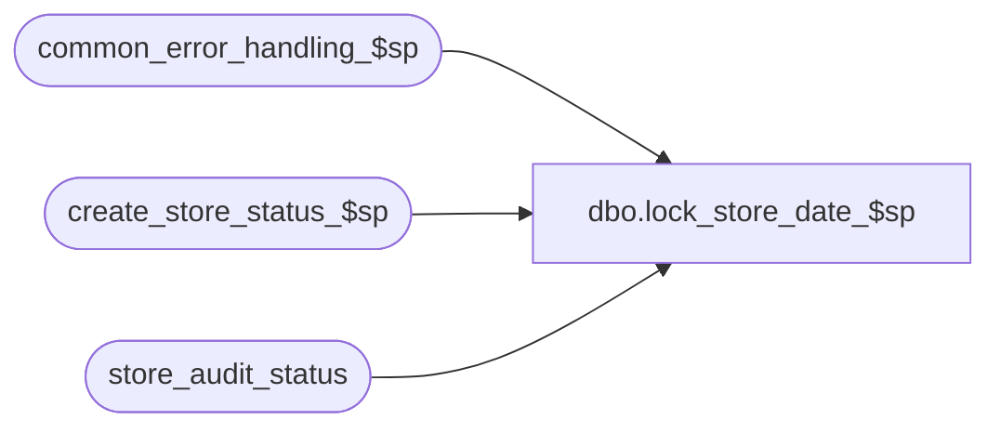

# dbo.lock_store_date_$sp

**Database:** auditworks  
**Server:** bedrockdb01  

## Architecture Diagram



## Table Dependencies

| Referenced Table |
|---|
| common_error_handling_$sp |
| create_store_status_$sp |
| store_audit_status |

## Stored Procedure Code

```sql
create proc dbo.lock_store_date_$sp @process_id 		binary(16), 
@user_id                int,
@store_no		int,
@sales_date		smalldatetime,
@date_reject_id		tinyint,
@update_in_progress	smallint,    -- function_no
@error_code		int	    OUTPUT /* 0 indicates successful */


AS
/* Proc Name: lock_store_date_$sp   --  5.0/5.1
   Desc: to lock a store-date by setting the update_in_progress column.
         Will raise error and set return status if unable to lock.
   Called by front-end, move, add, modify, mass corrects.
   Note that UI does not look at @error_code output variable.  It expects a raise-error.

HISTORY
Date     Name             Def#  Desc
Feb19,16 Vicci           DAOM-1 Allow Mass Delete (function 40) to lock store/date already locked by Mass Delete Request (function 33).
Jun23,15 Vicci      TFS-127504  Add function 89 (Mass Correct Tax) to list of those locking multiple store/dates in a loop.
May05,15 Vicci      TFS-119660  If create_store_status_$sp fails, report failure.  
                                If attempt to lock non-existent store/date made, report failure instead of looping.
Apr30,15 Vicci      TFS-118970  Add function 82 (Mass Correct Line Object) to list of those locking multiple store/dates in a loop.
Apr09,15 Vicci      TFS-114314  Return "lock is successful" if the store/date was already locked by the same process_id/function 
                                that is making the request.  Add function 78 (C/L Reval) to list of those locking multiple store/dates in a loop.
Nov13,14 Vicci       TFS-92326  Log process holding lock to memo1 instead of word store_audit_status so improve UI display of message.
                                Relocate the raising of business rule error 201550 to after the TRY/CATCH to avoid it being raised twice.
Aug23,13 Paul           145958  use try .. catch so that calling procs will not see trigger raise error (support SQL 2012),
				capture store_no in memo2 and sales_date for process_error_log.
Jan20,11 Vicci          124247  Added process no which already had the lock held to the error message to facilitate
				trouble-shooting.  Log the process error under the calling function, not under function
				36=Unknown.  Log process error under the calling process_id not under the process_id originally
				had created the lock.  Raise "already locked" error even when the process_id holding the lock
				is not known (for example in the case of dayend populate holding the lock  --it doesn't set
				the process ID because it is called with a different spid than the rest of the dayend).
Feb22,10 Paul           115428  If called by accept function, then do not retry when store-date is already locked
Sep17,04 Maryam         DV-1146 Use user_id
Apr21,04 Maryam         DV-1071 This proc will no longer output the user name
Nov05,03 Maryam         DV-1010 In case of error set @error_code to @errno before going to error
                                The real error no is replaced with 266.
May16,02 Henry		1-CD0IX Add R3.5 standardized common error handling
Sep24,01 Vicci		8775	create store_status for update_in_progress 154 (arch tran mod)
Feb16,00 Daphna		5904	treat update_in_progress 109 same as 9
Nov18,99 Paul		5642	Avoid raise error during retry cycle to avoid PB problems
Jan21,98 Deepa

*/

DECLARE @errmsg			nvarchar(2000),
	@errno			int,
	@existing_status		smallint,
	@lock_counter		tinyint,
	@max_retries		tinyint,
	@log_flag		tinyint,
	@object_name		nvarchar(255),
	@process_name		nvarchar(100),
	@operation_name		nvarchar(100),
	@message_id		int,
	@memo1 			nvarchar(50),
	@memo2 			nvarchar(50),
	@existing_process_id 	binary(16),
	@status_reject_reason   tinyint 


SELECT @process_name = 'lock_store_date_$sp',
       @message_id = 201068,
       @log_flag = 0,  -- not called from smartload
       @errno = 0,
       @operation_name = 'SELECT',
       @object_name = 'store_audit_status',
       @status_reject_reason = 0;

BEGIN TRY
SELECT @lock_counter = 1,
	@max_retries = 25; /* re-try up to 24 times */

 /* allow up to 90 retries for media rec/modify/add to reduce the chance
     of losing manually entered data in the front-end */

IF @update_in_progress IN (70,100,150, 154)
  SELECT @max_retries = 91;

WHILE @lock_counter < @max_retries
  BEGIN
   SELECT @existing_status = NULL;

  SELECT @existing_status = update_in_progress,
         @existing_process_id = process_id
    FROM  store_audit_status
   WHERE store_no = @store_no
     AND sales_date = @sales_date
     AND date_reject_id = @date_reject_id;
     
  IF @existing_status = @update_in_progress AND @existing_process_id = @process_id
  BEGIN
    SELECT @lock_counter = 255;
    BREAK;
  END;

    /* If already locked, then avoid retry when calling function could be processing many store-dates inside a loop */
  IF @existing_status > 0 AND @update_in_progress IN (75,76,77,78,82,89,140,223,224)
	BREAK; /* while */

  IF @existing_status IS NULL 
  BEGIN
    IF @update_in_progress IN (9,109, 154) /* move, archive trans modify */
    BEGIN
      SELECT @errmsg = 'Failed to execute create_store_status_$sp.  ',
  	     @object_name = 'create_store_status_$sp',
	     @operation_name = 'EXEC';
      EXEC create_store_status_$sp @process_id, @user_id, @store_no, @sales_date, 0, @status_reject_reason OUTPUT, @errmsg OUTPUT, 0, @update_in_progress;

      IF @status_reject_reason IN (0, 99)
        SELECT @lock_counter = 255;
    END;
      
    BREAK;  /* while */

  END; --If record for which lock has been requested does not exist

  /* do not retry if edit or move in progress */
  IF @existing_status IN (1,4,9,109)
  BREAK; /* while */

  IF @existing_status = 0
  OR (@existing_status = 33 and @update_in_progress = 40) --(locked by mass-delete request and current function is mass delete)
    BEGIN
      SELECT @errno = 0;
      BEGIN TRY /* Use a nested try catch here to avoid going to system error trap */
     UPDATE store_audit_status
       SET update_in_progress = @update_in_progress,
	  process_id = @process_id,
	   store_status_date = getdate()
      WHERE sales_date = @sales_date
        AND store_no = @store_no
        AND date_reject_id = @date_reject_id;
      END TRY
      BEGIN CATCH;
        /* For this proc, any reason for this update failing will be treated as 201550 for return code purposes, i.e. a failure to lock.
           It is not necessary to log a specific system error here because the calling procs will detect most system errors.
           A system error scenario here will be identifiable by existing_status = 0 in process error message. */
        SELECT @errno = 201550;
        IF @lock_counter > 1 /* retry only once if an error occurs when @existing_status = 0 (handle timing scenarios) */
          BREAK;
      END CATCH;

     IF @errno = 0
       BEGIN
        SELECT @lock_counter = 255;  
        BREAK; /* while loop */
       END;

 END; -- If @existing_status = 0

  /* try again */
  SELECT @lock_counter = @lock_counter + 1;
 WAITFOR DELAY '0:0:01';

END; /* While */


IF @lock_counter = 255
  BEGIN
    SELECT @error_code = 0; -- success
    RETURN;
  END;

END TRY

BEGIN CATCH; -- trap system errors
    /* common error handling. Appending proc name here because a rollback could occur if called within a transaction. */

        SELECT @errno = ERROR_NUMBER(),
		@errmsg = 'lock_store_date_$sp:' + COALESCE(@errmsg, ' ') + ERROR_MESSAGE();

 	IF @update_in_progress IS NULL
 	  SELECT @update_in_progress = 36;

	SELECT @error_code = @errno,
               @memo1 = CONVERT(nvarchar, COALESCE(@existing_status, 0)),
	       @memo2 = CONVERT(nvarchar, COALESCE(@store_no, 0));
	
	EXEC common_error_handling_$sp @update_in_progress, @errno, @errmsg, 0, @message_id, 
	@process_name, @object_name, @operation_name, @log_flag, 1, 0, null, 0, @memo1, 
   @memo2, null, @sales_date, null, null, 0, @process_id, @user_id;


	RETURN;
END CATCH;


--NOTE:  placed after the END TRY/CATCH to avoid the same error being raised twice
/* Unable to lock the store-date */

IF @existing_status > 0 OR @errno = 201550
 BEGIN
      SELECT @errmsg = 'Store ' + CONVERT(nvarchar, @store_no) + ' for date ' + convert(nvarchar, @sales_date) + ' is already in use by process ' + CONVERT(nvarchar, COALESCE(@existing_status, 0)),
	     @errno = 201550,
	     @message_id = 201550,
	     @object_name = 'store_audit_status',
	     @memo1 = CONVERT(nvarchar, COALESCE(@existing_status, 0)),
	     @memo2 = CONVERT(nvarchar, @store_no),
	     @operation_name = 'UPDATE',
	     @error_code = 201550; -- this value gets returned
     
      EXEC common_error_handling_$sp @update_in_progress, @errno, @errmsg, 0, @message_id, 
		@process_name, @object_name, @operation_name, @log_flag, 1, 0, NULL, 0, @memo1,
		@memo2, null, @sales_date, null, null, 0, @process_id, @user_id;

 END;

IF (COALESCE(@status_reject_reason, 0) != 0 AND COALESCE(@status_reject_reason, 0) != 99 ) OR @existing_status IS NULL
BEGIN
  SELECT @errmsg = CASE WHEN @existing_status IS NULL THEN 'Store/Date has no status record' ELSE 'Store/Date has invalid status ' + convert(nvarchar, @existing_status) END,
         @errno = 201519; -- default error message
  IF (@status_reject_reason = 2)
    SELECT @errmsg = 'Period closed',
           @errno = 201507;
  IF (@status_reject_reason = 3)
    SELECT @errmsg = 'Transaction date is a future date with respect to store timezone',
           @errno = 201508;
  IF (@status_reject_reason = 4)
    SELECT @errmsg = 'Store/Date has already been completed',
           @errno = 201519;
  IF (@status_reject_reason = 7)
    SELECT @errmsg = 'Store does not exist',
           @errno = 201509;
  IF (@status_reject_reason = 8)
    SELECT @errmsg = 'Invalid Register. Store/Register does not exist in the Register_table',
	   @errno = 201516;
  IF (@status_reject_reason = 11)
    SELECT @errmsg = 'Transaction date has already been accepted',
           @errno = 201522;
  
  SELECT @message_id = @errno,
         @error_code = @errno,
         @object_name = 'store_audit_status',
         @operation_name = 'INSERT',
         @errmsg = @errmsg + ', store/ date /date-reject:  ' + convert(nvarchar, @store_no) + '/ ' + convert(nvarchar, @sales_date) + ' /' + convert(nvarchar,@date_reject_id) ;      
  EXEC common_error_handling_$sp @update_in_progress, @errno, @errmsg, 0, @message_id, 
		                 @process_name, @object_name, @operation_name, @log_flag, 1, 0, NULL, 0, @memo1,
		                 @memo2, null, @sales_date, null, null, 0, @process_id, @user_id;
END;


RETURN;
```

