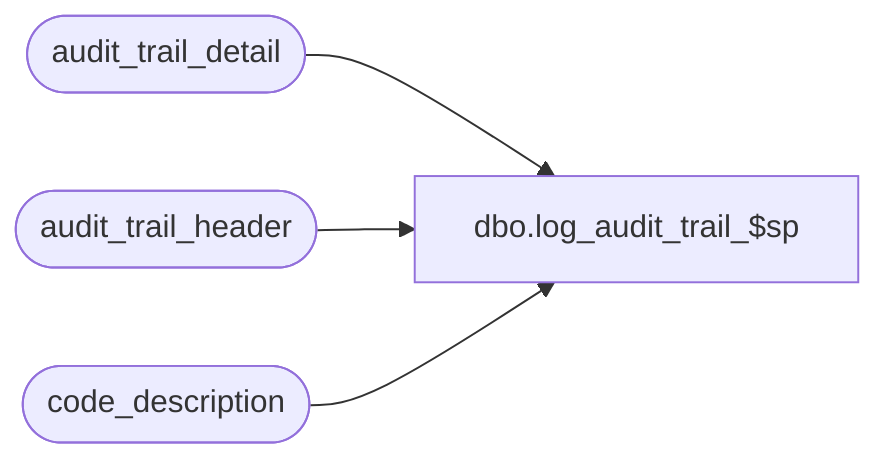

# dbo.log_audit_trail_$sp

**Database:** auditworks  
**Server:** bedrockdb01  

## Architecture Diagram



## Table Dependencies

| Referenced Table |
|---|
| audit_trail_detail |
| audit_trail_header |
| code_description |

## Stored Procedure Code

```sql
create proc dbo.log_audit_trail_$sp 
@user_name  varchar(30),
@key_descr  varchar(30),
@key_value  varchar(255),
@topic_id   smallint = 4 -- SA, 7=LP, 11=Flash

AS

/* 

  Proc Name : log_audit_trail_$sp
       Desc : create a SA4.1 audit trail entry when called by SmartView (defect 103296)

  HISTORY
  Date     Name		Def# Desc
07/21/08   Paul       103329 author. set function_no based on topic_id

*/

DECLARE @action_exists		tinyint,
	@errmsg			varchar(255),
	@errno			int,
	@entry_id            	numeric(12,0),
        @function_no		tinyint

select @function_no = 175, -- Viewed Sensitive Data - SA
	@action_exists = 0

IF @topic_id = 7
  SELECT @function_no = 176 -- Viewed Sensitive Data - LP

IF @topic_id = 11
  SELECT @function_no = 177 -- Viewed Sensitive Data - Flash

--Ensure that action definition exists in SA db. If not then default to tm since it will always exist in the db.
SELECT @action_exists = 1
FROM code_description
WHERE code_type = 31
AND code = @function_no

IF @action_exists = 0
  SELECT @function_no = 0 -- tm

BEGIN TRANSACTION

insert audit_trail_header
       (entry_date, table_name, table_key, table_key_descr, user_name, action, function_no)
values (
       getdate(), COALESCE(@key_descr,'reference number'), @key_value, @key_value, @user_name, 6, @function_no
)

SELECT @errno = @@error, @entry_id =  @@identity
IF @errno <> 0
BEGIN
  SELECT @errmsg = 'Failed to insert audit_trail_detail'
  GOTO error
END

INSERT INTO audit_trail_detail
       (entry_id, column_name, after_value, after_description)
VALUES (@entry_id, COALESCE(@key_descr,'reference number'), @key_value, @key_value )

SELECT @errno = @@error
IF @errno <> 0
BEGIN
  SELECT @errmsg = 'Failed to insert audit_trail_detail'
  GOTO error
END

COMMIT TRANSACTION

RETURN

error:		/* error handling routine */

	ROLLBACK TRANSACTION

	IF @errno < 20000
		SELECT @errmsg = 'log_audit_trail_$sp: ' + @errmsg,
			@errno = @errno + 100000

	RAISERROR @errno @errmsg
	RETURN
```

