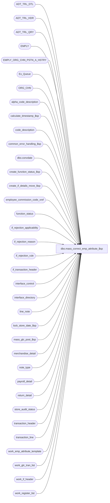

# dbo.mass_correct_emp_attribute_$sp

**Database:** auditworks  
**Server:** bedrockdb01  

## Architecture Diagram



## Table Dependencies

| Referenced Table |
|---|
| ADT_TRL_DTL |
| ADT_TRL_HDR |
| ADT_TRL_QRY |
| EMPLY |
| EMPLY_ORG_CHN_PSTN_A_HSTRY |
| Ex_Queue |
| ORG_CHN |
| alpha_code_description |
| calculate_timestamp_$sp |
| code_description |
| common_error_handling_$sp |
| dbo.convdate |
| create_function_status_$sp |
| create_if_details_move_$sp |
| employee_commission_code_xref |
| function_status |
| if_rejection_applicability |
| if_rejection_reason |
| if_rejection_rule |
| if_transaction_header |
| interface_control |
| interface_directory |
| line_note |
| lock_store_date_$sp |
| mass_glc_post_$sp |
| merchandise_detail |
| note_type |
| payroll_detail |
| return_detail |
| store_audit_status |
| transaction_header |
| transaction_line |
| work_emp_attribute_template |
| work_glc_tran_list |
| work_if_header |
| work_register_list |

## Stored Procedure Code

```sql
create proc dbo.mass_correct_emp_attribute_$sp ( @process_id               binary(16),
  @user_id                  int,
  @revalidate_spid          int = NULL
)

AS

/*
Proc Name: mass_correct_emp_attribute_$sp
     Desc: To re-evaluate Employee Attribute I/F reject reasons 21 to 41 for all store/dates. Uses new function_no = 113.
           Called from Front-end.

 HISTORY:
Date     Name        Defect# Description
Jan25,17 Kiri      DAOM-2026 Added missing resource string in audit trail for Mass Correction - Employee attribute I/F rejects
Nov14,14 Vicci     TFS-92326 Take into account the fact that the value of the output parameter of a proc called with a TRY/CATCH is not returned 
                             to the calling proc when a raise-error occurs, when calling lock_store_date_$sp.  Do not report individual 201571 errors
                             since individual pre-verified 201550 errors have already been reported by the lock_store_date_$sp proc.
Oct07,14 Vicci     TFS-87723 Correct to look at EMPLY_ORG_CHN_PSTN_A_HSTRY table (not just current assignment table) and to take into account
                             the fact that current assignments have a NULL expiration date and the expiration date is EXCLUSIVE not inclusive.
                             Correct selling area validation to look at selling area not store location.
Jun20,14 Vicci     TFS-75681 Avoid error 2627 Failed to insert into ADT_TRL_HDR.
Jan19,12 Vicci        132481 Remove usage of data length function for substring extraction from unicode strings since it returns a length
                             of double that corresponding to the character positions within the string in the case of nvarchar and nchar data types.
Jan18,12 Vicci        132439 Remove references to CRDM user-defined string datatypes from S/A since CRDM is not changing them to support unicode.
Jan21,11 Vicci        124247 Correct error handling following call to lock_store_date_$sp to recognize the fact that it
                             is normal to receive an @@error of 266 along with a return code of 201550 given the common
                             error handling rollback with will already have occurred and the proc is being called within
                             a begin tran.
Jan15,10 Vicci      1-44G2XS Use CONVERT instead of STR to avoid loss of precision (invalid check)
Aug08,08 Paul          87777 Uplift 101197 to SA5
May14,08 Vicci        101197 Support effective date in commission code assigment.
Oct04,07 Paul          91935 updated comments
Sep27,07 Phu         DV-1365 Apply 92840 to SA5. Fix invalid column name original_salesperson, log cashier_no for all rejects.
Aug31,07 Phu         DV-1364 Apply 85598, 87372 to SA5. Initial development.
Sep27,07 Phu           92840 Log cashier_no when validating payroll employee attributes.
Aug31,07 Vicci         87372 Fix join to payroll detail (was missing line-id)
Jul12,07 Phu           87372 Validate I/F rejects 38-41 for original_salesperson/2 in return_detail.
Apr11,07 Phu           85598 Initial development.
*/


DECLARE
  @all_rejects_fixed              int,
  @all_selected_flag              tinyint,
  @base                           numeric(21,0),
  @cursor_open                    tinyint,
  @emp_attr_count                 int,
  @emp_attr_need_validation       nchar(21), -- for 21 validations
  @edit_timestamp                 float,
  @ENTRY_ID                       binary(16),
  @entry_date_time                datetime,
  @errmsg                         nvarchar(255),
  @errno                          int,
  @function_no                    tinyint,
  @glc_rows                       int,
  @if_rejection_description       nvarchar(2100),
  @if_reject_reason               smallint,
  @if_reject_reason_codes         nvarchar(255),
  @message_id                     int,
  @object_name                    nvarchar(255),
  @operation_name                 nvarchar(100),
  @post_audit_fixed               tinyint,
  @process_name                   nvarchar(100),
  @reject_diff				      tinyint,
  @reject_index                   tinyint,
  @ret                            int,
  @rows                           int,
  @sep                            nchar(1),
  @store_name                     nvarchar(30),
  @store_no                       int,
  @transaction_date               smalldatetime,
  @ORG_CHN_NAME                   nvarchar(50),
  @some_skipped                   int,
  @all_selected_descr             nvarchar(255)


SET CONCAT_NULL_YIELDS_NULL OFF

SELECT
  @all_selected_flag = 0,
  @sep = NCHAR(12), -- audit trail seperator
  @emp_attr_count = 0,
  @function_no = 113,
  @cursor_open = 0,
  @emp_attr_count = 0,
  @entry_date_time = getdate(),
  @process_name = 'mass_correct_emp_attribute_$sp',
  @message_id = 201068,
  @rows = 0,
  @base = 10, @reject_diff = 20, -- do not change values
  @some_skipped = 0

IF @revalidate_spid IS NULL --
  SELECT @all_selected_flag = 1  --all transactions
	
-- See if_rejection_rule table for description of I/F reject 21 to 41.
-- If I/F reject 21 need to validate then the first byte in @emp_attr_need_validation is set to 1, otherwise 0.
-- If I/F reject 22 need to validate then the second byte in @emp_attr_need_validation is set to 1, otherwise 0, and so on.

SELECT @emp_attr_need_validation = REVERSE(RIGHT('000000000000000000000' + LTRIM(CONVERT(nvarchar, SUM(POWER(@base, CONVERT(numeric(21,0), ISNULL(ir.if_rejection_reason - @reject_diff, 1)) - 1)))), 21))
FROM if_rejection_rule ir
WHERE ir.if_rejection_reason >= 21
AND ir.if_rejection_reason <= 41
AND ISNULL(ir.active_rejection_rule,1) = 1
AND EXISTS (SELECT 1 FROM if_rejection_applicability ia, interface_directory id
            WHERE ir.if_rejection_reason = ia.if_reject_reason
            AND ia.interface_id = id.interface_id
            AND id.update_timing > 0)

IF CONVERT(numeric(21,0), @emp_attr_need_validation) = 0
  RETURN

SELECT transaction_id, line_id, if_reject_reason, store_no, transaction_date, register_no, transaction_no,
       transaction_series, entry_date_time, date_reject_id, cashier_no, cashier_on_file, employee_no, employee_on_file,
       salesperson, salesperson_on_file, salesperson2, salesperson2_on_file, note_type, line_note,
       user_defined_emp_on_file, PRMY_ORG_CHN_NUM, PRMY_ORG_CHN_NUM_2
INTO #emp_attr_all_trans
FROM work_emp_attribute_template

SELECT @errno = @@error
IF @errno != 0
BEGIN
  SELECT @errmsg = 'Unable to create table #emp_attr_all_trans',
         @object_name = '#emp_attr_all_trans',
         @operation_name = 'SELECT_INTO'
  GOTO error
END

-- Retrieve all trans that need to validate
-- user-defined employee role validation.
IF CONVERT(numeric(5,0), SUBSTRING(@emp_attr_need_validation, 1, 5)) > 0
BEGIN
  INSERT INTO #emp_attr_all_trans (
    transaction_id, line_id, if_reject_reason, store_no, transaction_date, register_no, transaction_no,
    transaction_series, entry_date_time, date_reject_id, cashier_no,
    note_type, line_note, user_defined_emp_on_file, PRMY_ORG_CHN_NUM)
  SELECT
    ir.transaction_id, ir.line_id, ir.if_reject_reason, h.store_no, h.transaction_date, h.register_no, h.transaction_no,
    h.transaction_series, h.entry_date_time, h.date_reject_id, h.cashier_no,
    ln.note_type, ln.line_note, SIGN(ISNULL(e.EMPLY_NUM, 0)), e.PRMY_ORG_CHN_NUM
  FROM if_rejection_reason ir
       INNER JOIN transaction_header h ON (ir.transaction_id = h.transaction_id)
       INNER JOIN line_note ln WITH (NOLOCK) ON (ir.transaction_id = ln.transaction_id AND ir.line_id = ln.line_id)
       INNER JOIN note_type nt WITH (NOLOCK) ON (ln.note_type = nt.note_type AND nt.employee_validation = 1)
       LEFT JOIN EMPLY e WITH (NOLOCK) ON (ISNUMERIC(ln.line_note) = 1 AND CONVERT(INT, ln.line_note) = e.EMPLY_NUM AND e.ACTV = 1)
  WHERE ir.if_reject_reason >= 21
  AND ir.if_reject_reason <= 25
  AND (ir.process_id = @revalidate_spid OR @revalidate_spid IS NULL)

  SELECT @errno = @@error, @rows = @rows + @@rowcount
  IF @errno != 0
  BEGIN
    SELECT @errmsg = 'Unable to insert for user-defined employee role validation',
           @object_name = '#emp_attr_all_trans',
           @operation_name = 'INSERT'
    GOTO error
  END
END -- IF CONVERT(numeric(5,0), SUBSTRING(@emp_attr_need_validation, 1, 5)) > 0


-- salesperson validation
IF CONVERT(numeric(4,0), SUBSTRING(@emp_attr_need_validation, 6, 4)) > 0
BEGIN
  INSERT INTO #emp_attr_all_trans (
    transaction_id, line_id, if_reject_reason, store_no, transaction_date, register_no, transaction_no,
    transaction_series, entry_date_time, date_reject_id, cashier_no,
    salesperson, salesperson_on_file, salesperson2, salesperson2_on_file,
    PRMY_ORG_CHN_NUM, PRMY_ORG_CHN_NUM_2)
  SELECT
    ir.transaction_id, ir.line_id, ir.if_reject_reason, h.store_no, h.transaction_date, h.register_no, h.transaction_no,
    h.transaction_series, h.entry_date_time, h.date_reject_id, h.cashier_no,
    m.salesperson, SIGN(ISNULL(e1.EMPLY_NUM, 0)), m.salesperson2, SIGN(ISNULL(e2.EMPLY_NUM, 0)),
    e1.PRMY_ORG_CHN_NUM, e2.PRMY_ORG_CHN_NUM
  FROM if_rejection_reason ir
       INNER JOIN transaction_header h ON (ir.transaction_id = h.transaction_id)
       INNER JOIN merchandise_detail m WITH (NOLOCK) ON (ir.transaction_id = m.transaction_id AND ir.line_id = m.line_id)
       LEFT JOIN EMPLY e1 WITH (NOLOCK) ON (m.salesperson = e1.EMPLY_NUM AND e1.ACTV = 1)
       LEFT JOIN EMPLY e2 WITH (NOLOCK) ON (m.salesperson2 = e2.EMPLY_NUM AND e2.ACTV = 1)
  WHERE ir.if_reject_reason >= 26
  AND ir.if_reject_reason <= 29
  AND (ir.process_id = @revalidate_spid OR @revalidate_spid IS NULL)

  SELECT @errno = @@error, @rows = @rows + @@rowcount
  IF @errno != 0
  BEGIN
    SELECT @errmsg = 'Unable to insert for salesperson validation',
           @object_name = '#emp_attr_all_trans',
           @operation_name = 'INSERT'
    GOTO error
 END
END -- IF CONVERT(numeric(4,0), SUBSTRING(@emp_attr_need_validation, 6, 4)) > 0


-- payroll employee validation
IF CONVERT(numeric(4,0), SUBSTRING(@emp_attr_need_validation, 10, 4)) > 0
BEGIN
  INSERT INTO #emp_attr_all_trans (
    transaction_id, line_id, if_reject_reason, store_no, transaction_date, register_no, transaction_no,
    transaction_series, entry_date_time, date_reject_id, cashier_no,
    employee_no, employee_on_file, PRMY_ORG_CHN_NUM)
  SELECT
    ir.transaction_id, ir.line_id, ir.if_reject_reason, h.store_no, h.transaction_date, h.register_no, h.transaction_no,
    h.transaction_series, h.entry_date_time, h.date_reject_id, h.cashier_no,
    p.employee_no, SIGN(ISNULL(e.EMPLY_NUM, 0)), e.PRMY_ORG_CHN_NUM
  FROM if_rejection_reason ir
       INNER JOIN transaction_header h ON (ir.transaction_id = h.transaction_id)
       INNER JOIN payroll_detail p ON (ir.transaction_id = p.transaction_id AND ir.line_id = p.line_id)
       LEFT JOIN EMPLY e WITH (NOLOCK) ON (p.employee_no = e.EMPLY_NUM AND e.ACTV = 1)
  WHERE ir.if_reject_reason >= 30
  AND ir.if_reject_reason <= 33
  AND (ir.process_id = @revalidate_spid OR @revalidate_spid IS NULL)

  SELECT @errno = @@error, @rows = @rows + @@rowcount
  IF @errno != 0
  BEGIN
    SELECT @errmsg = 'Unable to insert for payroll employee validation',
           @object_name = '#emp_attr_all_trans',
           @operation_name = 'INSERT'
    GOTO error
  END
END -- IF CONVERT(numeric(4,0), SUBSTRING(@emp_attr_need_validation, 10, 4)) > 0


-- cashier validation
IF CONVERT(numeric(4,0), SUBSTRING(@emp_attr_need_validation, 14, 4)) > 0
BEGIN
  INSERT INTO #emp_attr_all_trans (
    transaction_id, line_id, if_reject_reason, store_no, transaction_date, register_no, transaction_no,
    transaction_series, entry_date_time, date_reject_id,
    cashier_no, cashier_on_file, PRMY_ORG_CHN_NUM)
  SELECT
    ir.transaction_id, ir.line_id, ir.if_reject_reason, h.store_no, h.transaction_date, h.register_no, h.transaction_no,
    h.transaction_series, h.entry_date_time, h.date_reject_id,
    h.cashier_no, SIGN(ISNULL(e.EMPLY_NUM, 0)), e.PRMY_ORG_CHN_NUM
  FROM if_rejection_reason ir
       INNER JOIN transaction_header h ON (ir.transaction_id = h.transaction_id)
       LEFT JOIN EMPLY e WITH (NOLOCK) ON (h.cashier_no = e.EMPLY_NUM AND e.ACTV = 1)
  WHERE ir.if_reject_reason >= 34
  AND ir.if_reject_reason <= 37
  AND (ir.process_id = @revalidate_spid OR @revalidate_spid IS NULL)

  SELECT @errno = @@error, @rows = @rows + @@rowcount
  IF @errno != 0
  BEGIN
SELECT @errmsg = 'Unable to insert for cashier validation',
           @object_name = '#emp_attr_all_trans',
           @operation_name = 'INSERT'
    GOTO error
  END
END -- IF CONVERT(numeric(4,0), SUBSTRING(@emp_attr_need_validation, 14, 4)) > 0


-- original salesperson validation from return_detail
IF CONVERT(numeric(4,0), SUBSTRING(@emp_attr_need_validation, 18, 4)) > 0
BEGIN
  INSERT INTO #emp_attr_all_trans (
    transaction_id, line_id, if_reject_reason, store_no, transaction_date, register_no, transaction_no,
    transaction_series, entry_date_time, date_reject_id, cashier_no,
    salesperson, salesperson_on_file, salesperson2, salesperson2_on_file,
    PRMY_ORG_CHN_NUM, PRMY_ORG_CHN_NUM_2)
  SELECT
  ir.transaction_id, ir.line_id, ir.if_reject_reason, h.store_no, h.transaction_date, h.register_no, h.transaction_no,
    h.transaction_series, h.entry_date_time, h.date_reject_id, h.cashier_no,
    rt.original_salesperson, SIGN(ISNULL(e1.EMPLY_NUM, 0)), rt.original_salesperson2, SIGN(ISNULL(e2.EMPLY_NUM, 0)),
    e1.PRMY_ORG_CHN_NUM, e2.PRMY_ORG_CHN_NUM
  FROM if_rejection_reason ir
       INNER JOIN transaction_header h ON (ir.transaction_id = h.transaction_id)
       INNER JOIN return_detail rt WITH (NOLOCK) ON (ir.transaction_id = rt.transaction_id AND ir.line_id = rt.line_id)
       LEFT JOIN EMPLY e1 WITH (NOLOCK) ON (rt.original_salesperson = e1.EMPLY_NUM AND e1.ACTV = 1)
       LEFT JOIN EMPLY e2 WITH (NOLOCK) ON (rt.original_salesperson2 = e2.EMPLY_NUM AND e2.ACTV = 1)
  WHERE ir.if_reject_reason >= 38
  AND ir.if_reject_reason <= 41
  AND (ir.process_id = @revalidate_spid OR @revalidate_spid IS NULL)

  SELECT @errno = @@error, @rows = @rows + @@rowcount
  IF @errno != 0
  BEGIN
    SELECT @errmsg = 'Unable to insert for original salesperson validation',
           @object_name = '#emp_attr_all_trans',
           @operation_name = 'INSERT'
    GOTO error
  END
END -- IF CONVERT(numeric(4,0), SUBSTRING(@emp_attr_need_validation, 18, 4)) > 0


IF @rows = 0
BEGIN
  DROP TABLE #emp_attr_all_trans
  RETURN
END

SELECT transaction_id, line_id, if_reject_reason, store_no, transaction_date, register_no, transaction_no,
       transaction_series, entry_date_time, date_reject_id, cashier_no, employee_no,
       salesperson, salesperson2, note_type, line_note,
       interface_id, interface_status_flag, all_rejects_fixed
INTO #emp_attr_trans_verified
FROM work_emp_attribute_template

SELECT @errno = @@error
IF @errno != 0
BEGIN
  SELECT @errmsg = 'Unable to select into #emp_attr_trans_verified',
         @object_name = '#emp_attr_trans_verified',
         @operation_name = 'SELECT'
  GOTO error
END

SELECT transaction_id, line_id, if_reject_reason, store_no, transaction_date, register_no, transaction_no,
       transaction_series, entry_date_time, date_reject_id, cashier_no, employee_no,
       salesperson, salesperson2, note_type, line_note,
       interface_id, interface_status_flag, all_rejects_fixed
INTO #emp_attr_reject_verified
FROM work_emp_attribute_template

SELECT @errno = @@error
IF @errno != 0
BEGIN
  SELECT @errmsg = 'Unable to select into #emp_attr_reject_verified',
         @object_name = '#emp_attr_reject_verified',
    @operation_name = 'SELECT'
  GOTO error
END

CREATE TABLE #emp_attr_reject_ver_count (
	interface_id			tinyint not null,
	transaction_id			numeric(14,0) not null, -- tran_id_datatype
	count_reject_reason		int not null,
	all_rejects_fixed		tinyint not null)

SELECT @errno = @@error
IF @errno != 0
BEGIN
  SELECT @errmsg = 'Unable to create temp table #emp_attr_reject_ver_count',
         @object_name = '#emp_attr_reject_ver_count',
         @operation_name = 'CREATE'
  GOTO error
END

CREATE TABLE #emp_attr_reject_count (
	interface_id			tinyint not null,
	transaction_id			numeric(14,0) not null, -- tran_id_datatype
	count_reject_reason		int not null )

SELECT @errno = @@error
IF @errno != 0
BEGIN
  SELECT @errmsg = 'Unable to create temp table #emp_attr_reject_count',
         @object_name = '#emp_attr_reject_count',
         @operation_name = 'CREATE'
  GOTO error
END

SELECT @reject_index = 0
WHILE @reject_index < 21
BEGIN
  SELECT @reject_index = @reject_index + 1
  IF SUBSTRING(@emp_attr_need_validation, @reject_index, 1) = '0'
    CONTINUE  

  SELECT @if_reject_reason = @reject_diff + @reject_index

  -- Invalid employee for user-defined employee role
  IF @if_reject_reason = 21
  BEGIN
    INSERT INTO #emp_attr_trans_verified (
      transaction_id, line_id, if_reject_reason, store_no, transaction_date, register_no, transaction_no,
       transaction_series, entry_date_time, date_reject_id, cashier_no,
      note_type, line_note )
    SELECT
      t.transaction_id, t.line_id, t.if_reject_reason, t.store_no, t.transaction_date, t.register_no, t.transaction_no,
      t.transaction_series, t.entry_date_time, t.date_reject_id, t.cashier_no,
      t.note_type, t.line_note
    FROM #emp_attr_all_trans t
    WHERE t.if_reject_reason = @if_reject_reason
    AND t.user_defined_emp_on_file = 1

    SELECT @errno = @@error, @rows = @@rowcount,
           @emp_attr_count = @emp_attr_count + @@rowcount
    IF @errno != 0
    BEGIN
   SELECT @errmsg = 'Unable to insert for invalid employee for user-defined employee role',
 @object_name = '#emp_attr_trans_verified',
       @operation_name = 'INSERT'
      GOTO error
    END

    -- SA5 only - Build a series of reject reason codes for audit trail.
    IF @rows > 0
      SELECT @if_reject_reason_codes = @if_reject_reason_codes + ', ' + CONVERT(nvarchar, @if_reject_reason)

  END -- IF @if_reject_reason = 21


  -- Invalid commission code for user-defined employee role
  ELSE IF @if_reject_reason = 22
  BEGIN
    INSERT INTO #emp_attr_trans_verified (
      transaction_id, line_id, if_reject_reason, store_no, transaction_date, register_no, transaction_no,
      transaction_series, entry_date_time, date_reject_id, cashier_no,
      note_type, line_note )
    SELECT
      t.transaction_id, t.line_id, t.if_reject_reason, t.store_no, t.transaction_date, t.register_no, t.transaction_no,
      t.transaction_series, t.entry_date_time, t.date_reject_id, t.cashier_no,
      t.note_type, t.line_note
    FROM #emp_attr_all_trans t, employee_commission_code_xref x, alpha_code_description a
    WHERE t.if_reject_reason = @if_reject_reason
    AND t.user_defined_emp_on_file = 1
    AND CONVERT(INT, t.line_note) = x.employee_no
    AND t.transaction_date >= x.effective_from_date
    AND (t.transaction_date <= x.effective_to_date OR x.effective_to_date IS NULL)
    AND x.employee_commission_code = a.code
    AND a.code_type = 15
    AND a.code_status = 'U'
    AND a.code >= '-1'

    SELECT @errno = @@error, @rows = @@rowcount,
           @emp_attr_count = @emp_attr_count + @@rowcount
    IF @errno != 0
    BEGIN
      SELECT @errmsg = 'Unable to insert for invalid commission code for user-defined employee role',
             @object_name = '#emp_attr_trans_verified',
             @operation_name = 'INSERT'
      GOTO error
    END

    -- SA5 only - Build a series of reject reason codes for audit trail.
    IF @rows > 0
      SELECT @if_reject_reason_codes = @if_reject_reason_codes + ', ' + CONVERT(nvarchar, @if_reject_reason)

  END -- IF @if_reject_reason = 22


  -- Invalid primary position for user-defined employee role
  ELSE IF @if_reject_reason = 23
  BEGIN
    INSERT INTO #emp_attr_trans_verified (
      transaction_id, line_id, if_reject_reason, store_no, transaction_date, register_no, transaction_no,
      transaction_series, entry_date_time, date_reject_id, cashier_no,
      note_type, line_note )
    SELECT DISTINCT
      t.transaction_id, t.line_id, t.if_reject_reason, t.store_no, t.transaction_date, t.register_no, t.transaction_no,
      t.transaction_series, t.entry_date_time, t.date_reject_id, t.cashier_no,
      t.note_type, t.line_note
    FROM #emp_attr_all_trans t, EMPLY_ORG_CHN_PSTN_A_HSTRY a
    WHERE t.if_reject_reason = @if_reject_reason
    AND t.user_defined_emp_on_file = 1
    AND CONVERT(INT, t.line_note) = a.EMPLY_NUM
    AND t.transaction_date >= a.EFCTV_DATE
    AND (t.transaction_date < a.EXPRTN_DATE OR a.EXPRTN_DATE IS NULL)
    AND a.PRMRY_LOC_A = 1

    SELECT @errno = @@error, @rows = @@rowcount,
           @emp_attr_count = @emp_attr_count + @@rowcount
    IF @errno != 0
    BEGIN
      SELECT @errmsg = 'Unable to insert for invalid primary position for user-defined employee role',
             @object_name = '#emp_attr_trans_verified',
             @operation_name = 'INSERT'
      GOTO error
 END

    -- SA5 only - Build a series of reject reason codes for audit trail.
    IF @rows > 0
      SELECT @if_reject_reason_codes = @if_reject_reason_codes + ', ' + CONVERT(nvarchar, @if_reject_reason)

  END -- IF @if_reject_reason = 23


  -- Invalid primary selling area for user-defined employee role
  ELSE IF @if_reject_reason = 24
  BEGIN
    INSERT INTO #emp_attr_trans_verified (
      transaction_id, line_id, if_reject_reason, store_no, transaction_date, register_no, transaction_no,
      transaction_series, entry_date_time, date_reject_id, cashier_no,
      note_type, line_note )
    SELECT DISTINCT
      t.transaction_id, t.line_id, t.if_reject_reason, t.store_no, t.transaction_date, t.register_no, t.transaction_no,
      t.transaction_series, t.entry_date_time, t.date_reject_id, t.cashier_no,
      t.note_type, t.line_note
    FROM #emp_attr_all_trans t, EMPLY_ORG_CHN_PSTN_A_HSTRY a
    WHERE t.if_reject_reason = @if_reject_reason
    AND t.user_defined_emp_on_file = 1
    AND CONVERT(INT, t.line_note) = a.EMPLY_NUM
    AND t.transaction_date >= a.EFCTV_DATE
    AND (t.transaction_date < a.EXPRTN_DATE OR a.EXPRTN_DATE IS NULL)
    AND a.PRMRY_DISP_FNCTN_NUM IS NOT NULL --
    AND a.PRMRY_LOC_A = 1

    SELECT @errno = @@error, @rows = @@rowcount,
           @emp_attr_count = @emp_attr_count + @@rowcount
    IF @errno != 0
    BEGIN
      SELECT @errmsg = 'Unable to insert for invalid primary selling area for user-defined employee role',
             @object_name = '#emp_attr_trans_verified',
             @operation_name = 'INSERT'
      GOTO error
    END

    -- SA5 only - Build a series of reject reason codes for audit trail.
    IF @rows > 0
      SELECT @if_reject_reason_codes = @if_reject_reason_codes + ', ' + CONVERT(nvarchar, @if_reject_reason)

  END -- IF @if_reject_reason = 24


  -- Invalid home store for user-defined employee role
  ELSE IF @if_reject_reason = 25
  BEGIN
    INSERT INTO #emp_attr_trans_verified (
      transaction_id, line_id, if_reject_reason, store_no, transaction_date, register_no, transaction_no,
      transaction_series, entry_date_time, date_reject_id, cashier_no,
      note_type, line_note )
    SELECT DISTINCT
      t.transaction_id, t.line_id, t.if_reject_reason, t.store_no, t.transaction_date, t.register_no, t.transaction_no,
      t.transaction_series, t.entry_date_time, t.date_reject_id, t.cashier_no,
      t.note_type, t.line_note
    FROM #emp_attr_all_trans t, ORG_CHN s
    WHERE t.if_reject_reason = @if_reject_reason
    AND t.user_defined_emp_on_file = 1
    AND t.PRMY_ORG_CHN_NUM = s.ORG_CHN_NUM

    SELECT @errno = @@error, @rows = @@rowcount,
           @emp_attr_count = @emp_attr_count + @@rowcount
    IF @errno != 0
    BEGIN
      SELECT @errmsg = 'Unable to insert for invalid home store for user-defined employee role',
             @object_name = '#emp_attr_trans_verified',
             @operation_name = 'INSERT'
      GOTO error
    END

    -- SA5 only - Build a series of reject reason codes for audit trail.
    IF @rows > 0
      SELECT @if_reject_reason_codes = @if_reject_reason_codes + ', ' + CONVERT(nvarchar, @if_reject_reason)

  END -- IF @if_reject_reason = 25


  -- Invalid commission code for salesperson
  ELSE IF @if_reject_reason = 26
  BEGIN
    INSERT INTO #emp_attr_trans_verified (
      transaction_id, line_id, if_reject_reason, store_no, transaction_date, register_no, transaction_no,
      transaction_series, entry_date_time, date_reject_id, cashier_no,
      salesperson, salesperson2 )
    SELECT
      t.transaction_id, t.line_id, t.if_reject_reason, t.store_no, t.transaction_date, t.register_no, t.transaction_no,
      t.transaction_series, t.entry_date_time, t.date_reject_id, t.cashier_no,
      t.salesperson, t.salesperson2
    FROM #emp_attr_all_trans t
    WHERE t.if_reject_reason = @if_reject_reason
    AND t.salesperson_on_file = 1
    AND t.salesperson IN (SELECT x.employee_no
                               FROM employee_commission_code_xref x, alpha_code_description a
                               WHERE t.transaction_date >= x.effective_from_date
                      AND (t.transaction_date <= x.effective_to_date OR x.effective_to_date IS NULL)
                               AND x.employee_commission_code = a.code
                               AND a.code_type = 15
                               AND a.code_status = 'U'
                               AND a.code >= '-1')
    AND (t.salesperson2 IS NULL --
         OR (t.salesperson2_on_file = 1
             AND t.salesperson2 IN (SELECT x2.employee_no
         FROM employee_commission_code_xref x2, alpha_code_description a2
                                    WHERE t.transaction_date >= x2.effective_from_date
                                    AND (t.transaction_date <= x2.effective_to_date OR x2.effective_to_date IS NULL)
                                    AND x2.employee_commission_code = a2.code
                                    AND a2.code_type = 15
                                    AND a2.code_status = 'U'
                                    AND a2.code >= '-1'
                                   )))

    SELECT @errno = @@error, @rows = @@rowcount,
     @emp_attr_count = @emp_attr_count + @@rowcount
    IF @errno != 0
    BEGIN
      SELECT @errmsg = 'Unable to insert for invalid commission code for salesperson',
             @object_name = '#emp_attr_trans_verified',
             @operation_name = 'INSERT'
      GOTO error
    END

    -- SA5 only - Build a series of reject reason codes for audit trail.
    IF @rows > 0
      SELECT @if_reject_reason_codes = @if_reject_reason_codes + ', ' + CONVERT(nvarchar, @if_reject_reason)

  END -- IF @if_reject_reason = 26


  -- Invalid primary position for salesperson
  ELSE IF @if_reject_reason = 27
  BEGIN
    INSERT INTO #emp_attr_trans_verified (
      transaction_id, line_id, if_reject_reason, store_no, transaction_date, register_no, transaction_no,
      transaction_series, entry_date_time, date_reject_id, cashier_no,
      salesperson, salesperson2 )
    SELECT
      t.transaction_id, t.line_id, t.if_reject_reason, t.store_no, t.transaction_date, t.register_no, t.transaction_no,
      t.transaction_series, t.entry_date_time, t.date_reject_id, t.cashier_no,
      t.salesperson, t.salesperson2
    FROM #emp_attr_all_trans t
    WHERE t.if_reject_reason = @if_reject_reason
    AND t.salesperson_on_file = 1
    AND t.salesperson IN (SELECT a.EMPLY_NUM
                          FROM EMPLY_ORG_CHN_PSTN_A_HSTRY a
                          WHERE t.salesperson = a.EMPLY_NUM
                AND t.transaction_date >= a.EFCTV_DATE
    			  AND (t.transaction_date < a.EXPRTN_DATE OR a.EXPRTN_DATE IS NULL)
    			  AND a.PRMRY_LOC_A = 1
                          -- no need to check a.PSTN_CODE because it's not null and has constraint referencing ORG_CHN_PSTN.PSTN_CODE
                         )    
    AND (t.salesperson2 IS NULL --
         OR (t.salesperson2_on_file = 1
             AND t.salesperson2 IN (SELECT a2.EMPLY_NUM
           FROM EMPLY_ORG_CHN_PSTN_A_HSTRY a2
                                    WHERE t.salesperson2 = a2.EMPLY_NUM
                                    AND t.transaction_date >= a2.EFCTV_DATE
			            AND (t.transaction_date < a2.EXPRTN_DATE OR a2.EXPRTN_DATE IS NULL)
			            AND a2.PRMRY_LOC_A = 1
                                   )))

    SELECT @errno = @@error, @rows = @@rowcount,
           @emp_attr_count = @emp_attr_count + @@rowcount
    IF @errno != 0
    BEGIN
      SELECT @errmsg = 'Unable to insert for invalid primary position for salesperson',
             @object_name = '#emp_attr_trans_verified',
             @operation_name = 'INSERT'
      GOTO error
    END

    -- SA5 only - Build a series of reject reason codes for audit trail.
    IF @rows > 0
      SELECT @if_reject_reason_codes = @if_reject_reason_codes + ', ' + CONVERT(nvarchar, @if_reject_reason)

  END -- IF @if_reject_reason = 27


  -- Invalid primary selling area for salesperson
  ELSE IF @if_reject_reason = 28
  BEGIN
    INSERT INTO #emp_attr_trans_verified (
      transaction_id, line_id, if_reject_reason, store_no, transaction_date, register_no, transaction_no,
      transaction_series, entry_date_time, date_reject_id, cashier_no,
      salesperson, salesperson2 )
    SELECT
      t.transaction_id, t.line_id, t.if_reject_reason, t.store_no, t.transaction_date, t.register_no, t.transaction_no,
      t.transaction_series, t.entry_date_time, t.date_reject_id, t.cashier_no,
      t.salesperson, t.salesperson2
    FROM #emp_attr_all_trans t
    WHERE t.if_reject_reason = @if_reject_reason
    AND t.salesperson_on_file = 1
    AND t.salesperson IN (SELECT a.EMPLY_NUM
                          FROM EMPLY_ORG_CHN_PSTN_A_HSTRY a
                          WHERE t.salesperson = a.EMPLY_NUM
                          AND t.transaction_date >= a.EFCTV_DATE
                          AND (t.transaction_date < a.EXPRTN_DATE OR a.EXPRTN_DATE IS NULL)
                          AND a.PRMRY_LOC_A = 1
                          AND a.PRMRY_DISP_FNCTN_NUM IS NOT NULL -- 
                          -- only need to check a.PRMRY_LOC_ID for 'not null' because it has constraint referencing ORG_CHN_LOC.LOC_ID
                         )    
    AND (t.salesperson2 IS NULL --
         OR (t.salesperson2_on_file = 1
              AND t.salesperson2 IN (SELECT a2.EMPLY_NUM
                         FROM EMPLY_ORG_CHN_PSTN_A_HSTRY a2
                         WHERE t.salesperson2 = a2.EMPLY_NUM
                          AND t.transaction_date >= a2.EFCTV_DATE
                         AND (t.transaction_date < a2.EXPRTN_DATE OR a2.EXPRTN_DATE IS NULL)
                         AND a2.PRMRY_LOC_A = 1
                         AND a2.PRMRY_DISP_FNCTN_NUM IS NOT NULL --
                                   )))

    SELECT @errno = @@error, @rows = @@rowcount,
           @emp_attr_count = @emp_attr_count + @@rowcount
    IF @errno != 0
    BEGIN
      SELECT @errmsg = 'Unable to insert for invalid primary selling area for salesperson',
             @object_name = '#emp_attr_trans_verified',
             @operation_name = 'INSERT'
      GOTO error
    END

    -- SA5 only - Build a series of reject reason codes for audit trail.
    IF @rows > 0
      SELECT @if_reject_reason_codes = @if_reject_reason_codes + ', ' + CONVERT(nvarchar, @if_reject_reason)

  END -- IF @if_reject_reason = 28


  -- Invalid home store for salesperson
  ELSE IF @if_reject_reason = 29
  BEGIN
    INSERT INTO #emp_attr_trans_verified (
      transaction_id, line_id, if_reject_reason, store_no, transaction_date, register_no, transaction_no,
      transaction_series, entry_date_time, date_reject_id, cashier_no,
      salesperson, salesperson2 )
    SELECT
      t.transaction_id, t.line_id, t.if_reject_reason, t.store_no, t.transaction_date, t.register_no, t.transaction_no,
      t.transaction_series, t.entry_date_time, t.date_reject_id, t.cashier_no,
      t.salesperson, t.salesperson2
    FROM #emp_attr_all_trans t
    WHERE t.if_reject_reason = @if_reject_reason
    AND t.salesperson_on_file = 1
    AND EXISTS (SELECT 1
                FROM ORG_CHN s
                WHERE t.PRMY_ORG_CHN_NUM = s.ORG_CHN_NUM
               )
    AND (t.salesperson2 IS NULL --
         OR (t.salesperson2_on_file = 1
             AND EXISTS (SELECT 1
                         FROM ORG_CHN s2
                         WHERE t.PRMY_ORG_CHN_NUM_2 = s2.ORG_CHN_NUM
                        )))

    SELECT @errno = @@error, @rows = @@rowcount,
           @emp_attr_count = @emp_attr_count + @@rowcount
    IF @errno != 0
    BEGIN
      SELECT @errmsg = 'Unable to insert for invalid home store for salesperson',
             @object_name = '#emp_attr_trans_verified',
             @operation_name = 'INSERT'
      GOTO error
    END

    -- SA5 only - Build a series of reject reason codes for audit trail.
    IF @rows > 0
      SELECT @if_reject_reason_codes = @if_reject_reason_codes + ', ' + CONVERT(nvarchar, @if_reject_reason)

  END -- IF @if_reject_reason = 29


  -- Invalid commission code for payroll employee
  ELSE IF @if_reject_reason = 30
  BEGIN
    INSERT INTO #emp_attr_trans_verified (
      transaction_id, line_id, if_reject_reason, store_no, transaction_date, register_no, transaction_no,
      transaction_series, entry_date_time, date_reject_id, cashier_no,
      employee_no )
    SELECT
      t.transaction_id, t.line_id, t.if_reject_reason, t.store_no, t.transaction_date, t.register_no, t.transaction_no,
      t.transaction_series, t.entry_date_time, t.date_reject_id, t.cashier_no,
      t.employee_no
    FROM #emp_attr_all_trans t, employee_commission_code_xref x, alpha_code_description a
    WHERE t.if_reject_reason = @if_reject_reason
    AND t.employee_on_file = 1
    AND t.employee_no = x.employee_no
    AND t.transaction_date >= x.effective_from_date
AND (t.transaction_date <= x.effective_to_date OR x.effective_to_date IS NULL)
    AND x.employee_commission_code = a.code
    AND a.code_type = 15
    AND a.code_status = 'U'
    AND a.code >= '-1'

    SELECT @errno = @@error, @rows = @@rowcount,
           @emp_attr_count = @emp_attr_count + @@rowcount
    IF @errno != 0
    BEGIN
      SELECT @errmsg = 'Unable to insert for invalid commission code for payroll employee',
             @object_name = '#emp_attr_trans_verified',
             @operation_name = 'INSERT'
      GOTO error
    END

    -- SA5 only - Build a series of reject reason codes for audit trail.
    IF @rows > 0
      SELECT @if_reject_reason_codes = @if_reject_reason_codes + ', ' + CONVERT(nvarchar, @if_reject_reason)

  END -- IF @if_reject_reason = 30


  -- Invalid primary position for payroll employee
  ELSE IF @if_reject_reason = 31
  BEGIN
    INSERT INTO #emp_attr_trans_verified (
      transaction_id, line_id, if_reject_reason, store_no, transaction_date, register_no, transaction_no,
      transaction_series, entry_date_time, date_reject_id, cashier_no,
      employee_no )
    SELECT DISTINCT
      t.transaction_id, t.line_id, t.if_reject_reason, t.store_no, t.transaction_date, t.register_no, t.transaction_no,
      t.transaction_series, t.entry_date_time, t.date_reject_id, t.cashier_no,
      t.employee_no
    FROM #emp_attr_all_trans t, EMPLY_ORG_CHN_PSTN_A_HSTRY a
    WHERE t.if_reject_reason = @if_reject_reason
    AND t.employee_on_file = 1
    AND t.employee_no = a.EMPLY_NUM
    AND t.transaction_date >= a.EFCTV_DATE
    AND (t.transaction_date < a.EXPRTN_DATE OR a.EXPRTN_DATE IS NULL)
    AND a.PRMRY_LOC_A = 1

    SELECT @errno = @@error, @rows = @@rowcount,
           @emp_attr_count = @emp_attr_count + @@rowcount
    IF @errno != 0
    BEGIN
      SELECT @errmsg = 'Unable to insert for invalid primary position for payroll employee',
             @object_name = '#emp_attr_trans_verified',
             @operation_name = 'INSERT'
      GOTO error
    END

    -- SA5 only - Build a series of reject reason codes for audit trail.
    IF @rows > 0
      SELECT @if_reject_reason_codes = @if_reject_reason_codes + ', ' + CONVERT(nvarchar, @if_reject_reason)

  END -- IF @if_reject_reason = 31


  -- Invalid primary selling area for payroll employee
  ELSE IF @if_reject_reason = 32
  BEGIN
    INSERT INTO #emp_attr_trans_verified (
      transaction_id, line_id, if_reject_reason, store_no, transaction_date, register_no, transaction_no,
      transaction_series, entry_date_time, date_reject_id, cashier_no,
      employee_no )
    SELECT DISTINCT
      t.transaction_id, t.line_id, t.if_reject_reason, t.store_no, t.transaction_date, t.register_no, t.transaction_no,
      t.transaction_series, t.entry_date_time, t.date_reject_id, t.cashier_no,
      t.employee_no
    FROM #emp_attr_all_trans t, EMPLY_ORG_CHN_PSTN_A_HSTRY a
    WHERE t.if_reject_reason = @if_reject_reason
    AND t.employee_on_file = 1
    AND t.employee_no = a.EMPLY_NUM
    AND t.transaction_date >= a.EFCTV_DATE
    AND (t.transaction_date < a.EXPRTN_DATE OR a.EXPRTN_DATE IS NULL)
    AND a.PRMRY_LOC_A = 1
    AND a.PRMRY_DISP_FNCTN_NUM IS NOT NULL --
    -- only need to check a.PRMRY_LOC_ID for 'not null' because it has constraint referencing ORG_CHN_LOC.LOC_ID

    SELECT @errno = @@error, @rows = @@rowcount,
        @emp_attr_count = @emp_attr_count + @@rowcount
    IF @errno != 0
    BEGIN
      SELECT @errmsg = 'Unable to insert for invalid primary selling area for payroll employee',
             @object_name = '#emp_attr_trans_verified',
             @operation_name = 'INSERT'
      GOTO error
    END

    -- SA5 only - Build a series of reject reason codes for audit trail.
    IF @rows > 0
      SELECT @if_reject_reason_codes = @if_reject_reason_codes + ', ' + CONVERT(nvarchar, @if_reject_reason)

  END -- IF @if_reject_reason = 32


  -- Invalid home store for payroll employee
  ELSE IF @if_reject_reason = 33
  BEGIN
    INSERT INTO #emp_attr_trans_verified (
      transaction_id, line_id, if_reject_reason, store_no, transaction_date, register_no, transaction_no,
      transaction_series, entry_date_time, date_reject_id, cashier_no,
      employee_no )
    SELECT
      t.transaction_id, t.line_id, t.if_reject_reason, t.store_no, t.transaction_date, t.register_no, t.transaction_no,
      t.transaction_series, t.entry_date_time, t.date_reject_id, t.cashier_no,
      t.employee_no
    FROM #emp_attr_all_trans t, ORG_CHN s
    WHERE t.if_reject_reason = @if_reject_reason
    AND t.employee_on_file = 1
    AND t.PRMY_ORG_CHN_NUM = s.ORG_CHN_NUM

    SELECT @errno = @@error, @rows = @@rowcount,
           @emp_attr_count = @emp_attr_count + @@rowcount
    IF @errno != 0
    BEGIN
      SELECT @errmsg = 'Unable to insert for invalid home store for payroll employee',
             @object_name = '#emp_attr_trans_verified',
             @operation_name = 'INSERT'
      GOTO error
    END

    -- SA5 only - Build a series of reject reason codes for audit trail.
    IF @rows > 0
      SELECT @if_reject_reason_codes = @if_reject_reason_codes + ', ' + CONVERT(nvarchar, @if_reject_reason)

  END -- IF @if_reject_reason = 33


  -- Invalid commission code for associate
  ELSE IF @if_reject_reason = 34
  BEGIN
    INSERT INTO #emp_attr_trans_verified (
      transaction_id, line_id, if_reject_reason, store_no, transaction_date, register_no, transaction_no,
      transaction_series, entry_date_time, date_reject_id, cashier_no )
    SELECT
      t.transaction_id, t.line_id, t.if_reject_reason, t.store_no, t.transaction_date, t.register_no, t.transaction_no,
      t.transaction_series, t.entry_date_time, t.date_reject_id, t.cashier_no
    FROM #emp_attr_all_trans t, employee_commission_code_xref x, alpha_code_description a
    WHERE t.if_reject_reason = @if_reject_reason
    AND t.cashier_on_file = 1
    AND t.cashier_no = x.employee_no
    AND t.transaction_date >= x.effective_from_date
    AND (t.transaction_date <= x.effective_to_date OR x.effective_to_date IS NULL) 
    AND x.employee_commission_code = a.code
    AND a.code_type = 15
    AND a.code_status = 'U'
    AND a.code >= '-1'

    SELECT @errno = @@error, @rows = @@rowcount,
           @emp_attr_count = @emp_attr_count + @@rowcount
    IF @errno != 0
    BEGIN
      SELECT @errmsg = 'Unable to insert for invalid commission code for associate',
             @object_name = '#emp_attr_trans_verified',
             @operation_name = 'INSERT'
      GOTO error
    END

    -- SA5 only - Build a series of reject reason codes for audit trail.
    IF @rows > 0
      SELECT @if_reject_reason_codes = @if_reject_reason_codes + ', ' + CONVERT(nvarchar, @if_reject_reason)

  END -- IF @if_reject_reason = 34


  -- Invalid primary position for cashier
  ELSE IF @if_reject_reason = 35
  BEGIN
    INSERT INTO #emp_attr_trans_verified (
      transaction_id, line_id, if_reject_reason, store_no, transaction_date, register_no, transaction_no,
      transaction_series, entry_date_time, date_reject_id, cashier_no )
    SELECT DISTINCT
      t.transaction_id, t.line_id, t.if_reject_reason, t.store_no, t.transaction_date, t.register_no, t.transaction_no,
      t.transaction_series, t.entry_date_time, t.date_reject_id, t.cashier_no
    FROM #emp_attr_all_trans t, EMPLY_ORG_CHN_PSTN_A_HSTRY a
    WHERE t.if_reject_reason = @if_reject_reason
    AND t.cashier_on_file = 1
    AND t.cashier_no = a.EMPLY_NUM
    AND t.transaction_date >= a.EFCTV_DATE
    AND (t.transaction_date < a.EXPRTN_DATE OR a.EXPRTN_DATE IS NULL)
    AND a.PRMRY_LOC_A = 1

    SELECT @errno = @@error, @rows = @@rowcount,
           @emp_attr_count = @emp_attr_count + @@rowcount
    IF @errno != 0
    BEGIN
      SELECT @errmsg = 'Unable to insert for invalid primary position for cashier',
             @object_name = '#emp_attr_trans_verified',
             @operation_name = 'INSERT'
      GOTO error
    END

    -- SA5 only - Build a series of reject reason codes for audit trail.
    IF @rows > 0
      SELECT @if_reject_reason_codes = @if_reject_reason_codes + ', ' + CONVERT(nvarchar, @if_reject_reason)

  END -- IF @if_reject_reason = 35


  -- Invalid primary selling area for cashier
  ELSE IF @if_reject_reason = 36
  BEGIN
    INSERT INTO #emp_attr_trans_verified (
      transaction_id, line_id, if_reject_reason, store_no, transaction_date, register_no, transaction_no,
      transaction_series, entry_date_time, date_reject_id,
      cashier_no )
    SELECT DISTINCT
      t.transaction_id, t.line_id, t.if_reject_reason, t.store_no, t.transaction_date, t.register_no, t.transaction_no,
      t.transaction_series, t.entry_date_time, t.date_reject_id,
      t.cashier_no
    FROM #emp_attr_all_trans t, EMPLY_ORG_CHN_PSTN_A_HSTRY a
    WHERE t.if_reject_reason = @if_reject_reason
    AND t.cashier_on_file = 1
    AND t.cashier_no = a.EMPLY_NUM
    AND t.transaction_date >= a.EFCTV_DATE
    AND (t.transaction_date < a.EXPRTN_DATE OR a.EXPRTN_DATE IS NULL)
    AND a.PRMRY_LOC_A = 1
    AND a.PRMRY_DISP_FNCTN_NUM IS NOT NULL --
    -- only need to check a.PRMRY_LOC_ID for 'not null' because it has constraint referencing ORG_CHN_LOC.LOC_ID

    SELECT @errno = @@error, @rows = @@rowcount,
           @emp_attr_count = @emp_attr_count + @@rowcount
    IF @errno != 0
    BEGIN
      SELECT @errmsg = 'Unable to insert for invalid primary selling area for cashier',
             @object_name = '#emp_attr_trans_verified',
             @operation_name = 'INSERT'
      GOTO error
    END

    -- SA5 only - Build a series of reject reason codes for audit trail.
    IF @rows > 0
      SELECT @if_reject_reason_codes = @if_reject_reason_codes + ', ' + CONVERT(nvarchar, @if_reject_reason)

  END -- IF @if_reject_reason = 36


  -- Invalid home store for cashier
  ELSE IF @if_reject_reason = 37
  BEGIN
    INSERT INTO #emp_attr_trans_verified (
      transaction_id, line_id, if_reject_reason, store_no, transaction_date, register_no, transaction_no,
      transaction_series, entry_date_time, date_reject_id, cashier_no )
    SELECT DISTINCT
      t.transaction_id, t.line_id, t.if_reject_reason, t.store_no, t.transaction_date, t.register_no, t.transaction_no,
      t.transaction_series, t.entry_date_time, t.date_reject_id, t.cashier_no
    FROM #emp_attr_all_trans t, ORG_CHN s
    WHERE t.if_reject_reason = @if_reject_reason
    AND t.cashier_on_file = 1
    AND t.PRMY_ORG_CHN_NUM = s.ORG_CHN_NUM

    SELECT @errno = @@error, @rows = @@rowcount,
           @emp_attr_count = @emp_attr_count + @@rowcount
    IF @errno != 0
    BEGIN
      SELECT @errmsg = 'Unable to insert for invalid home store for cashier',
             @object_name = '#emp_attr_trans_verified',
             @operation_name = 'INSERT'
      GOTO error
    END

    -- SA5 only - Build a series of reject reason codes for audit trail.
    IF @rows > 0
      SELECT @if_reject_reason_codes = @if_reject_reason_codes + ', ' + CONVERT(nvarchar, @if_reject_reason)

  END -- IF @if_reject_reason = 37


  -- Code for validating I/F rejects 38-41 (original salesperson) is very similiar to 26-29 (salesperson).
  -- @if_reject_reason will identify whether it's original salesperson or salesperson
  -- Invalid commission code for original salesperson
  ELSE IF @if_reject_reason = 38
  BEGIN
    INSERT INTO #emp_attr_trans_verified (
      transaction_id, line_id, if_reject_reason, store_no, transaction_date, register_no, transaction_no,
      transaction_series, entry_date_time, date_reject_id, cashier_no,
      salesperson, salesperson2 )
    SELECT
      t.transaction_id, t.line_id, t.if_reject_reason, t.store_no, t.transaction_date, t.register_no, t.transaction_no,
      t.transaction_series, t.entry_date_time, t.date_reject_id, t.cashier_no,
      t.salesperson, t.salesperson2
    FROM #emp_attr_all_trans t
    WHERE t.if_reject_reason = @if_reject_reason
    AND t.salesperson_on_file = 1
    AND t.salesperson IN (SELECT x.employee_no
                          FROM employee_commission_code_xref x, alpha_code_description a
                          WHERE t.transaction_date >= x.effective_from_date
                                AND (t.transaction_date <= x.effective_to_date OR x.effective_to_date IS NULL)
                                AND x.employee_commission_code = a.code
                          AND a.code_type = 15
                          AND a.code_status = 'U'
                          AND a.code >= '-1')
    AND (t.salesperson2 IS NULL --
         OR (t.salesperson2_on_file = 1
             AND t.salesperson2 IN (SELECT x2.employee_no
                                    FROM employee_commission_code_xref x2, alpha_code_description a2
                                    WHERE t.transaction_date >= x2.effective_from_date
                                      AND (t.transaction_date <= x2.effective_to_date OR x2.effective_to_date IS NULL)
                                    AND x2.employee_commission_code = a2.code
                                    AND a2.code_type = 15
                                    AND a2.code_status = 'U'
                 AND a2.code >= '-1'
)))

    SELECT @errno = @@error, @rows = @@rowcount,
           @emp_attr_count = @emp_attr_count + @@rowcount
    IF @errno != 0
    BEGIN
      SELECT @errmsg = 'Unable to insert for invalid commission code for original salesperson',
             @object_name = '#emp_attr_trans_verified',
             @operation_name = 'INSERT'
      GOTO error
    END

    -- SA5 only - Build a series of reject reason codes for audit trail.
    IF @rows > 0
      SELECT @if_reject_reason_codes = @if_reject_reason_codes + ', ' + CONVERT(nvarchar, @if_reject_reason)

  END -- IF @if_reject_reason = 38


  -- Invalid primary position for original salesperson
  ELSE IF @if_reject_reason = 39
  BEGIN
    INSERT INTO #emp_attr_trans_verified (
      transaction_id, line_id, if_reject_reason, store_no, transaction_date, register_no, transaction_no,
      transaction_series, entry_date_time, date_reject_id, cashier_no,
      salesperson, salesperson2 )
    SELECT
      t.transaction_id, t.line_id, t.if_reject_reason, t.store_no, t.transaction_date, t.register_no, t.transaction_no,
      t.transaction_series, t.entry_date_time, t.date_reject_id, t.cashier_no,
      t.salesperson, t.salesperson2
    FROM #emp_attr_all_trans t
    WHERE t.if_reject_reason = @if_reject_reason
    AND t.salesperson_on_file = 1
    AND t.salesperson IN (SELECT a.EMPLY_NUM
                          FROM EMPLY_ORG_CHN_PSTN_A_HSTRY a
                          WHERE t.salesperson = a.EMPLY_NUM
                          AND t.transaction_date >= a.EFCTV_DATE
                          AND (t.transaction_date < a.EXPRTN_DATE OR a.EXPRTN_DATE IS NULL)
                          AND a.PRMRY_LOC_A = 1
                          -- no need to check a.PSTN_CODE because it's not null and has constraint referencing ORG_CHN_PSTN.PSTN_CODE
                         )    
    AND (t.salesperson2 IS NULL --
         OR (t.salesperson2_on_file = 1
          AND t.salesperson2 IN (SELECT a2.EMPLY_NUM
                                    FROM EMPLY_ORG_CHN_PSTN_A_HSTRY a2
                                    WHERE t.salesperson2 = a2.EMPLY_NUM
                                      AND t.transaction_date >= a2.EFCTV_DATE
                                    AND (t.transaction_date < a2.EXPRTN_DATE OR a2.EXPRTN_DATE IS NULL)
                                    AND a2.PRMRY_LOC_A = 1
    )))

    SELECT @errno = @@error, @rows = @@rowcount,
           @emp_attr_count = @emp_attr_count + @@rowcount
    IF @errno != 0
  BEGIN
      SELECT @errmsg = 'Unable to insert for invalid primary position for original salesperson',
             @object_name = '#emp_attr_trans_verified',
             @operation_name = 'INSERT'
      GOTO error
    END

    -- SA5 only - Build a series of reject reason codes for audit trail.
    IF @rows > 0
      SELECT @if_reject_reason_codes = @if_reject_reason_codes + ', ' + CONVERT(nvarchar, @if_reject_reason)

  END -- IF @if_reject_reason = 39


  -- Invalid primary selling area for original salesperson
  ELSE IF @if_reject_reason = 40
  BEGIN
    INSERT INTO #emp_attr_trans_verified (
      transaction_id, line_id, if_reject_reason, store_no, transaction_date, register_no, transaction_no,
      transaction_series, entry_date_time, date_reject_id, cashier_no,
      salesperson, salesperson2 )
    SELECT
      t.transaction_id, t.line_id, t.if_reject_reason, t.store_no, t.transaction_date, t.register_no, t.transaction_no,
      t.transaction_series, t.entry_date_time, t.date_reject_id, t.cashier_no,
      t.salesperson, t.salesperson2
    FROM #emp_attr_all_trans t
    WHERE t.if_reject_reason = @if_reject_reason
    AND t.salesperson_on_file = 1
    AND t.salesperson IN (SELECT a.EMPLY_NUM
                          FROM EMPLY_ORG_CHN_PSTN_A_HSTRY a
                          WHERE t.salesperson = a.EMPLY_NUM
                          AND t.transaction_date >= a.EFCTV_DATE
                          AND (t.transaction_date < a.EXPRTN_DATE OR a.EXPRTN_DATE IS NULL)
 AND a.PRMRY_DISP_FNCTN_NUM IS NOT NULL -- 
                          AND a.PRMRY_LOC_A = 1
                          -- only need to check a.PRMRY_LOC_ID for 'not null' because it has constraint referencing ORG_CHN_LOC.LOC_ID
                         )    
    AND (t.salesperson2 IS NULL --
         OR (t.salesperson2_on_file = 1
     AND t.salesperson2 IN (SELECT a2.EMPLY_NUM
                                    FROM EMPLY_ORG_CHN_PSTN_A_HSTRY a2
                                    WHERE t.salesperson2 = a2.EMPLY_NUM
                                    AND t.transaction_date >= a2.EFCTV_DATE
                                    AND (t.transaction_date < a2.EXPRTN_DATE OR a2.EXPRTN_DATE IS NULL)
                                    AND a2.PRMRY_DISP_FNCTN_NUM IS NOT NULL --
                                    AND a2.PRMRY_LOC_A = 1
                                   )))

    SELECT @errno = @@error, @rows = @@rowcount,
           @emp_attr_count = @emp_attr_count + @@rowcount
    IF @errno != 0
    BEGIN
      SELECT @errmsg = 'Unable to insert for invalid primary selling area for original salesperson',
             @object_name = '#emp_attr_trans_verified',
             @operation_name = 'INSERT'
      GOTO error
    END

    -- SA5 only - Build a series of reject reason codes for audit trail.
    IF @rows > 0
      SELECT @if_reject_reason_codes = @if_reject_reason_codes + ', ' + CONVERT(nvarchar, @if_reject_reason)

  END -- IF @if_reject_reason = 40


  -- Invalid home store for original salesperson
  ELSE IF @if_reject_reason = 41
  BEGIN
    INSERT INTO #emp_attr_trans_verified (
      transaction_id, line_id, if_reject_reason, store_no, transaction_date, register_no, transaction_no,
      transaction_series, entry_date_time, date_reject_id, cashier_no,
      salesperson, salesperson2 )
    SELECT
      t.transaction_id, t.line_id, t.if_reject_reason, t.store_no, t.transaction_date, t.register_no, t.transaction_no,
      t.transaction_series, t.entry_date_time, t.date_reject_id, t.cashier_no,
      t.salesperson, t.salesperson2
    FROM #emp_attr_all_trans t
    WHERE t.if_reject_reason = @if_reject_reason
    AND t.salesperson_on_file = 1
    AND EXISTS (SELECT 1
                FROM ORG_CHN s
          WHERE t.PRMY_ORG_CHN_NUM = s.ORG_CHN_NUM
            )
    AND (t.salesperson2 IS NULL --
         OR (t.salesperson2_on_file = 1
             AND EXISTS (SELECT 1
                         FROM ORG_CHN s2
                         WHERE t.PRMY_ORG_CHN_NUM_2 = s2.ORG_CHN_NUM
                        )))

    SELECT @errno = @@error, @rows = @@rowcount,
           @emp_attr_count = @emp_attr_count + @@rowcount
    IF @errno != 0
    BEGIN
      SELECT @errmsg = 'Unable to insert for invalid home store for original salesperson',
             @object_name = '#emp_attr_trans_verified',
             @operation_name = 'INSERT'
      GOTO error
    END

    -- SA5 only - Build a series of reject reason codes for audit trail.
    IF @rows > 0
      SELECT @if_reject_reason_codes = @if_reject_reason_codes + ', ' + CONVERT(nvarchar, @if_reject_reason)

  END -- IF @if_reject_reason = 41

END -- while @reject_index < 21

  
IF @emp_attr_count = 0
BEGIN
  DELETE function_status
  WHERE user_id = @user_id
  AND function_no = @function_no
  AND process_id = @process_id

  SELECT @errno = @@error
  IF @errno != 0
  BEGIN
    SELECT @errmsg = 'Unable to delete function_no = ' + CONVERT(nvarchar, @function_no) + ' from function_status',
           @object_name = 'function_status',
           @operation_name = 'DELETE'
    GOTO error
  END

  IF @revalidate_spid IS NOT NULL --
  BEGIN
    UPDATE if_rejection_reason
    SET process_id = NULL --
    FROM #emp_attr_all_trans t, if_rejection_reason ir
    WHERE t.transaction_id = ir.transaction_id
    AND t.line_id = ir.line_id
    AND t.if_reject_reason = ir.if_reject_reason

    SELECT @errno = @@error
    IF @errno != 0
    BEGIN
      SELECT @errmsg = 'Unable to set process_id to null in if_rejection_reason (1)',
             @object_name = 'if_rejection_reason',
             @operation_name = 'UPDATE'
      GOTO error
    END
  END
  RETURN
END

-- if the string begins with ', ', then remove it.
IF (LEFT(@if_reject_reason_codes, 2) = ', ')
  SELECT @if_reject_reason_codes = SUBSTRING(@if_reject_reason_codes, 3, LEN(@if_reject_reason_codes) - 2)

EXEC calculate_timestamp_$sp @edit_timestamp OUTPUT
SELECT @errno = @@error
IF @errno != 0
BEGIN
  SELECT @errmsg = 'Failed to execute stored procedure calculate_timestamp_$sp',
         @object_name = 'calculate_timestamp_$sp',
         @operation_name = 'EXEC'
  GOTO error
END

INSERT INTO #emp_attr_reject_verified (
  transaction_id, line_id, if_reject_reason, store_no, transaction_date,
  register_no, transaction_no, transaction_series, entry_date_time, date_reject_id,
  cashier_no, employee_no, salesperson, salesperson2, note_type, line_note,
  interface_id, interface_status_flag, all_rejects_fixed )
SELECT
  t.transaction_id, t.line_id, t.if_reject_reason, t.store_no, t.transaction_date,
  t.register_no, t.transaction_no, t.transaction_series, t.entry_date_time, t.date_reject_id,
  t.cashier_no, t.employee_no, t.salesperson, t.salesperson2, t.note_type, t.line_note,
  ic.interface_id, id.update_timing, 0
FROM #emp_attr_trans_verified t, if_rejection_applicability ir,
     interface_control ic, interface_directory id
WHERE t.transaction_id = ic.transaction_id
AND t.if_reject_reason = ir.if_reject_reason
AND ic.interface_id = ir.interface_id
AND ic.interface_id = id.interface_id
AND ic.interface_status_flag = 99
AND id.update_timing >= 1

SELECT @errno = @@error
IF @errno != 0
BEGIN
  SELECT @errmsg = 'Unable to insert #emp_attr_reject_verified from #emp_attr_trans_verified',
         @object_name = '#emp_attr_reject_verified',
         @operation_name = 'INSERT'
  GOTO error
END

INSERT #emp_attr_reject_ver_count (
  interface_id,
  transaction_id,
  all_rejects_fixed,
  count_reject_reason )
SELECT
  interface_id,
  transaction_id,
  all_rejects_fixed,
  COUNT(if_reject_reason)
FROM #emp_attr_reject_verified
GROUP BY interface_id, transaction_id, all_rejects_fixed

SELECT @errno = @@error
IF @errno != 0
BEGIN
  SELECT @errmsg = 'Unable to insert #emp_attr_reject_ver_count from #emp_attr_reject_verified',
         @object_name = '#emp_attr_reject_ver_count',
         @operation_name = 'INSERT'
  GOTO error
END

INSERT #emp_attr_reject_count (
	interface_id,
	transaction_id,
	count_reject_reason )
SELECT t.interface_id,
	t.transaction_id,
	COUNT(ir.if_reject_reason)
 FROM #emp_attr_reject_ver_count t, if_rejection_reason ir, if_rejection_applicability ia
WHERE t.transaction_id = ir.transaction_id
  AND t.interface_id = ia.interface_id
  AND ir.if_reject_reason = ia.if_reject_reason
GROUP BY t.interface_id, t.transaction_id

SELECT @errno = @@error
IF @errno != 0
BEGIN
  SELECT @errmsg = 'Unable to insert #emp_attr_reject_count from #emp_attr_reject_ver_count',
         @object_name = '#emp_attr_reject_count',
     @operation_name = 'INSERT'
  GOTO error
END

UPDATE #emp_attr_reject_ver_count
   SET all_rejects_fixed = 1
  FROM #emp_attr_reject_ver_count t1, #emp_attr_reject_count t2
 WHERE t1.interface_id = t2.interface_id
   AND t1.transaction_id = t2.transaction_id
   AND t1.count_reject_reason = t2.count_reject_reason

SELECT @errno = @@error
IF @errno != 0
BEGIN
  SELECT @errmsg = 'Unable to set all_rejects_fixed = 1 in #emp_attr_reject_ver_count',
         @object_name = '#emp_attr_reject_ver_count',
         @operation_name = 'UPDATE'
  GOTO error
END

UPDATE #emp_attr_reject_verified
   SET all_rejects_fixed = 1
  FROM #emp_attr_reject_verified t1, #emp_attr_reject_ver_count t2 
 WHERE t1.interface_id = t2.interface_id
   AND t1.transaction_id = t2.transaction_id
   AND t2.all_rejects_fixed = 1

SELECT @errno = @@error
IF @errno != 0
BEGIN
  SELECT @errmsg = 'Unable to set all_rejects_fixed = 1 in #emp_attr_reject_verified',
         @object_name = '#emp_attr_reject_verified',
         @operation_name = 'UPDATE'
  GOTO error
END

  -- A maximum of 100 chars per if_rejection_description
SELECT @if_reject_reason = 21
WHILE @if_reject_reason <= 41
BEGIN
  SELECT @if_rejection_description = @if_rejection_description + LEFT(if_rejection_description + SPACE(100), 100)
  FROM if_rejection_rule
  WHERE if_rejection_reason = @if_reject_reason

  SELECT @if_reject_reason = @if_reject_reason + 1
END -- while @if_reject_reason <= 41

-- re-evaluate if_rejections for one store-date at a time

DECLARE mass_correct_emp_attr_crsr cursor
FOR
SELECT DISTINCT
	u.store_no,
	u.transaction_date
 FROM #emp_attr_reject_verified u, store_audit_status s
 WHERE u.store_no = s.store_no
  AND u.transaction_date = s.sales_date
  AND s.date_reject_id = 0
  AND s.update_in_progress not in (1,4)  --don't revalidate if trickle-edit has date locked
ORDER BY u.transaction_date, u.store_no
FOR READ ONLY

OPEN mass_correct_emp_attr_crsr

SELECT @errno = @@error
IF @errno != 0
BEGIN
  SELECT @errmsg = 'Failed to open cursor mass_correct_emp_attr_crsr',
         @object_name = 'mass_correct_emp_attr_crsr',
         @operation_name = 'OPEN'
  GOTO error
END

SELECT @cursor_open = 1

WHILE 1 = 1
BEGIN

  FETCH mass_correct_emp_attr_crsr INTO
    @store_no,
    @transaction_date

  IF @@fetch_status <> 0
    BREAK

  DELETE work_glc_tran_list
  WHERE process_id = @process_id

  SELECT @errno = @@error
  IF @errno != 0
  BEGIN
    SELECT @errmsg = 'Failed to delete work_glc_tran_list',
           @object_name = 'work_glc_tran_list',
           @operation_name = 'DELETE'
    GOTO error
  END

  DELETE work_register_list
  WHERE process_id = @process_id

  SELECT @errno = @@error
  IF @errno != 0
  BEGIN
    SELECT @errmsg = 'Failed to delete work_register_list',
           @object_name = 'work_register_list',
           @operation_name = 'DELETE'
    GOTO error
  END

  DELETE work_if_header
  WHERE process_id = @process_id

  SELECT @errno = @@error
  IF @errno != 0
  BEGIN
    SELECT @errmsg = 'Failed to delete rows from table work_if_header',
           @object_name = 'work_if_header',
    @operation_name = 'DELETE'
    GOTO error
  END

  TRUNCATE TABLE #emp_attr_trans_verified

  SELECT @errno = @@error
  IF @errno != 0
  BEGIN
    SELECT @errmsg = 'Failed to truncate table #emp_attr_trans_verified',
     @object_name = '#emp_attr_trans_verified',
           @operation_name = 'TRUNCATE'
    GOTO error
  END

  -- Lock store-date

  BEGIN TRAN

  SELECT @ret = NULL;
  BEGIN TRY 
    EXEC lock_store_date_$sp @process_id, @user_id, @store_no, @transaction_date, 0, @function_no, @ret OUTPUT;
  END TRY
  BEGIN CATCH
  SELECT @errno = ERROR_NUMBER();
  IF @ret IS NULL OR @ret = 0
    SELECT @ret = @errno;
  END CATCH;          
  IF @errno != 0 AND @ret <> 201550 AND @errno <> 201550
  BEGIN
    SELECT @errmsg = 'Failed to execute lock_store_date_$sp',
           @object_name = 'lock_store_date_$sp',
           @operation_name = 'EXEC'
    GOTO error
  END

  IF @ret = 0
  BEGIN
    EXEC create_function_status_$sp @process_id, @user_id, @function_no, 0,
      @errmsg OUTPUT, @store_no, @transaction_date, 0

    SELECT @errno = @@error
    IF @errno != 0
    BEGIN
      IF @errmsg IS NULL --
        SELECT @errmsg = 'Failed to execute stored proc create_function_status_$sp'
      SELECT @object_name = 'create_function_status_$sp',
             @operation_name = 'EXEC'
      GOTO error
    END
    COMMIT TRANSACTION
  END
  ELSE /* unable to lock, skip all transactions for store-date */
  BEGIN
    SELECT @some_skipped = 1
    CONTINUE
  END

  INSERT INTO #emp_attr_trans_verified (
  transaction_id, line_id, if_reject_reason, store_no, transaction_date,
   register_no, transaction_no, transaction_series, entry_date_time, date_reject_id,
    cashier_no, employee_no, salesperson, salesperson2, note_type, line_note,
    interface_id, interface_status_flag, all_rejects_fixed )
  SELECT
    t.transaction_id, t.line_id, t.if_reject_reason, t.store_no, t.transaction_date,
    t.register_no, t.transaction_no, t.transaction_series, t.entry_date_time, t.date_reject_id,
    t.cashier_no, t.employee_no, t.salesperson, t.salesperson2, t.note_type, t.line_note,
    t.interface_id, t.interface_status_flag, t.all_rejects_fixed
  FROM #emp_attr_reject_verified t, transaction_header th
  WHERE t.store_no = @store_no
  AND t.transaction_date = @transaction_date
  AND t.transaction_id = th.transaction_id
  AND th.if_rejection_flag = 1  -- ensure hasn't changed since populating work table

  SELECT @errno = @@error
  IF @errno != 0
  BEGIN
    SELECT @errmsg = 'Unable to insert from #emp_attr_reject_verified',
           @object_name = '#emp_attr_trans_verified',
           @operation_name = 'INSERT'
    GOTO error
  END

  -- save list of store-reg-dates affected
  INSERT work_register_list (
    process_id,
    store_no,
    transaction_date,
    date_reject_id,
    register_no,
    function_no )
  SELECT DISTINCT
    @process_id,
    store_no,
    transaction_date,
    date_reject_id,
    register_no,
    @function_no
  FROM #emp_attr_trans_verified

  SELECT @errno = @@error
  IF @errno != 0
  BEGIN
    SELECT @errmsg = 'Failed to insert work_register_list',
           @object_name = 'work_register_list',
           @operation_name = 'INSERT'
    GOTO error
  END

  -- get list of corrected tran which apply to glc

  INSERT work_glc_tran_list (
    process_id,
   transaction_id )
  SELECT DISTINCT
    @process_id, transaction_id
  FROM #emp_attr_trans_verified
  WHERE interface_id = 28 -- new c/l

  SELECT @glc_rows = @@rowcount,
         @errno = @@error
  IF @errno != 0
  BEGIN
   SELECT @errmsg = 'Failed to insert work_glc_tran_list',
           @object_name = 'work_glc_tran_list',
           @operation_name = 'INSERT'
    GOTO error
  END

  UPDATE function_status
  SET status = 2
  WHERE user_id = @user_id
  AND process_id = @process_id
  AND function_no = @function_no

  SELECT @errno = @@error
  IF @errno != 0
  BEGIN
    SELECT @errmsg = 'Failed to update function_status (status=2)',
           @object_name = 'function_status',
           @operation_name = 'UPDATE'
    GOTO error
  END

  INSERT work_if_header (
    process_id,
    transaction_id,
    effective_date,
    entry_date_time )
  SELECT DISTINCT
    @process_id,
    transaction_id,
    transaction_date,
    entry_date_time
  FROM #emp_attr_trans_verified
  WHERE all_rejects_fixed = 1
  AND interface_status_flag = 1

  SELECT @errno = @@error,
         @all_rejects_fixed = @@rowcount
  IF @errno != 0
  BEGIN
    SELECT @errmsg = 'Failed to insert work_if_header',
           @object_name = 'work_if_header',
           @operation_name = 'INSERT'
    GOTO error
  END

  BEGIN TRANSACTION

  IF @all_rejects_fixed >= 1  -- (1)
  BEGIN
    INSERT if_transaction_header (
      store_no,
      register_no,
      transaction_date,
      date_reject_id,
      transaction_series,
      transaction_no,
      entry_date_time,
      cashier_no,
      transaction_category,
      tender_total,
      transaction_void_flag,
      customer_info_exists,
      exception_flag,
      deposit_declaration_flag,
      closeout_flag,
      media_count_flag,
      customer_modified_flag,
      tax_override_flag,
      pos_tax_jurisdiction,
      edit_timestamp,
      employee_no,
      transaction_remark,
      source_process_no,
      last_modified_date_time,
      in_use_timestamp,
      updated_by_user_id,
      transaction_id,
      till_no )	
    SELECT
      store_no,
      register_no,
      transaction_date,
      date_reject_id,
      transaction_series,
      transaction_no,
      th.entry_date_time,
      cashier_no,
      transaction_category,
      tender_total,
      transaction_void_flag,
 customer_info_exists,
      exception_flag,
      deposit_declaration_flag,
      closeout_flag,
      media_count_flag,
      customer_modified_flag,
      tax_override_flag,
      pos_tax_jurisdiction,
      @edit_timestamp,
      employee_no,
      transaction_remark,
      @function_no,
      last_modified_date_time,
      in_use_timestamp,
      updated_by_user_id,
      th.transaction_id,
      th.till_no
    FROM work_if_header wh WITH (NOLOCK), transaction_header th WITH (NOLOCK)
    WHERE process_id = @process_id
    AND wh.transaction_id = th.transaction_id

    SELECT @errno = @@error
    IF @errno != 0
    BEGIN
      SELECT @errmsg = 'Failed to insert if_transaction_header',
             @object_name = 'if_transaction_header',
             @operation_name = 'INSERT'
      GOTO error
    END

    UPDATE work_if_header
    SET if_entry_no = ih.if_entry_no
    FROM work_if_header wh, transaction_header th WITH (NOLOCK), if_transaction_header ih WITH (NOLOCK)
    WHERE wh.process_id = @process_id
    AND wh.transaction_id = th.transaction_id
    AND ih.store_no = th.store_no
    AND ih.transaction_date = th.transaction_date
    AND ih.entry_date_time = th.entry_date_time
    AND ih.register_no = th.register_no
    AND ih.transaction_no = th.transaction_no
    AND ih.transaction_series = th.transaction_series
    AND ih.edit_timestamp = @edit_timestamp

    SELECT @errno = @@error
    IF @errno != 0
    BEGIN
      SELECT @errmsg = 'Failed to update work_if_header',
             @object_name = 'work_if_header',
             @operation_name = 'UPDATE'
      GOTO error
    END
  END  -- if @all_rejects_fixed >= 1  (1)

  COMMIT TRANSACTION

  -- Call sub-procedure to create entries in the if detail tables
 
  EXEC create_if_details_move_$sp @process_id, @user_id, 1, @errmsg OUTPUT
  SELECT @errno = @@error
  IF @errno != 0
  BEGIN
    IF @errmsg IS NULL -- then
     SELECT @errmsg = 'Failed to execute stored procedure create_if_details_move_$sp'
    SELECT @object_name = 'create_if_details_move_$sp',
           @operation_name = 'EXEC'
    GOTO error
  END

  UPDATE transaction_header
  SET last_modified_date_time = @entry_date_time
  FROM #emp_attr_trans_verified t, transaction_header h
  WHERE t.transaction_id = h.transaction_id

  SELECT @errno = @@error
  IF @errno != 0
  BEGIN
    SELECT @errmsg = 'Unable to set last_modified_date_time in transaction_header',
           @object_name = 'transaction_header',
           @operation_name = 'UPDATE'
    GOTO error
  END

  SELECT @post_audit_fixed = 0

  SELECT @post_audit_fixed = COUNT(transaction_id)
  FROM #emp_attr_trans_verified
  WHERE all_rejects_fixed = 1
  AND interface_status_flag = 2

  SELECT @errno = @@error
  IF @errno != 0
  BEGIN
    SELECT @errmsg = 'Failed to get count for @post_audit_fixed',
           @object_name = '#emp_attr_trans_verified',
           @operation_name = 'SELECT'
    GOTO error
  END

  BEGIN TRAN

  IF @all_rejects_fixed >= 1 OR @post_audit_fixed > 0 -- (2)
  BEGIN
    UPDATE interface_control
    SET interface_status_flag = tr.interface_status_flag
    FROM #emp_attr_trans_verified tr, interface_control ic
    WHERE tr.all_rejects_fixed = 1
    AND tr.transaction_id = ic.transaction_id
    AND tr.interface_id = ic.interface_id

    SELECT @errno = @@error
    IF @errno != 0
    BEGIN
      SELECT @errmsg = 'Failed to update interface_control',
             @object_name = 'interface_control',
             @operation_name = 'UPDATE'
      GOTO error
    END

    INSERT Ex_Queue (
      queue_id, -- interface_id
      key_1,    -- if_entry_no
      key_2,    -- interface_control_flag
      key_9,    -- effective_date
      key_10,   -- interface_posting_date
      key_11)   -- entry_date_time
    SELECT DISTINCT
      tr.interface_id,
      wh.if_entry_no,
      10,
      tr.transaction_date,
      @entry_date_time,
      wh.entry_date_time
    FROM #emp_attr_trans_verified tr, work_if_header wh WITH (NOLOCK)
    WHERE tr.all_rejects_fixed = 1
    AND tr.transaction_id = wh.transaction_id
    AND wh.process_id = @process_id
    AND tr.interface_status_flag = 1

    SELECT @errno = @@error
    IF @errno != 0
    BEGIN
      SELECT @errmsg = 'Failed to insert if_interface_control',
             @object_name = 'if_interface_control',
             @operation_name = 'INSERT'
      GOTO error
    END
  END  -- if @all_rejects_fixed >= 1  (2)

  -- Log to audit trail
  SELECT @ORG_CHN_NAME = ORG_CHN_NAME
  FROM ORG_CHN
  WHERE ORG_CHN_NUM = @store_no

  SELECT @errno = @@error
  IF @errno != 0
  BEGIN
    SELECT @errmsg = 'Failed to select store name',
           @object_name = 'ORG_CHN',
           @operation_name = 'SELECT'
    GOTO error
  END

  SELECT @ENTRY_ID = NEWID()
  
  SELECT @all_selected_descr = code_display_descr
     FROM code_description
    WHERE code_type = 203
      AND code = @all_selected_flag

  SELECT @errno = @@error
  IF @errno != 0
  BEGIN
    SELECT @errmsg = 'Failed to select the description for code_type = 203',
  	       @object_name = 'code_description',
	       @operation_name = 'SELECT'
    GOTO error
  END   

  INSERT INTO ADT_TRL_HDR(
       ENTRY_ID,
       ENTRY_DATE_TIME,
       USER_ID,
       APP_ID,
       ROOT_TBL_NAME,
       ROOT_TBL_KEY,
       ROOT_TBL_KEY_RSRC_NAME,
       ROOT_TBL_KEY_RSRC_PRMS,
       FNCTN_NUM)
  VALUES (@ENTRY_ID,
        @entry_date_time,
        @user_id,
        300,
        'TRANSACTION',
        @if_reject_reason_codes + @sep + CONVERT(nvarchar, @all_selected_flag),
        'TK_IF_REJE_REAS_ALL_SELE_FLAG',
        'Re-validate Employee Attribute interface rejects' + @sep + @all_selected_descr,
        @function_no)

  SELECT @errno = @@error
  IF @errno != 0
  BEGIN
    SELECT @errmsg = 'Failed to insert into ADT_TRL_HDR',
           @object_name = 'ADT_TRL_HDR',
           @operation_name = 'INSERT'
    GOTO error
  END

  INSERT INTO ADT_TRL_DTL(
       ENTRY_ID,
       TBL_NAME,
       TBL_KEY,
       TBL_KEY_RSRC_NAME,
       TBL_KEY_RSRC_PRMS,
       ACTN_CODE,
       CLMN_NAME,
       OLD_VAL)
  SELECT DISTINCT
        @ENTRY_ID,
       'if_rejection_reason',
        CONVERT(nvarchar, transaction_id) + @sep + CONVERT(nvarchar, line_id),
       'TK_STOR_TRAN_DATE_REGI_DATE_REJE_ID_TRAN_NO_TRAN_SERI_ENTR_DATE_TIME_LINE_ID',
        CONVERT(nvarchar, store_no)+ '-' + @ORG_CHN_NAME
        + @sep + dbo.convdate(transaction_date)
        + @sep + CONVERT(nvarchar, register_no)
        + @sep + CONVERT(nvarchar, date_reject_id)
        + @sep + CONVERT(nvarchar, transaction_no)
        + @sep + CONVERT(nvarchar, transaction_series)
        + @sep + dbo.convdate(entry_date_time)
        + @sep + CONVERT(nvarchar, line_id),
        'M',

        CASE if_reject_reason
          WHEN 21 THEN 'line_note'
          WHEN 22 THEN 'line_note'
          WHEN 23 THEN 'line_note'
          WHEN 24 THEN 'line_note'
          WHEN 25 THEN 'line_note'
          WHEN 26 THEN 'salesperson'
          WHEN 27 THEN 'salesperson'
          WHEN 28 THEN 'salesperson'
          WHEN 29 THEN 'salesperson'
          WHEN 30 THEN 'employee_no'
          WHEN 31 THEN 'employee_no'
          WHEN 32 THEN 'employee_no'
          WHEN 33 THEN 'employee_no'
          WHEN 34 THEN 'cashier_no'
          WHEN 35 THEN 'cashier_no'
          WHEN 36 THEN 'cashier_no'
          WHEN 37 THEN 'cashier_no'
          WHEN 38 THEN 'original_salesperson'
          WHEN 39 THEN 'original_salesperson'
          WHEN 40 THEN 'original_salesperson'
          WHEN 41 THEN 'original_salesperson'
        END,

        CASE if_reject_reason
          WHEN 21 THEN ISNULL(line_note,' ')
          WHEN 22 THEN ISNULL(line_note,' ')
          WHEN 23 THEN ISNULL(line_note,' ')
          WHEN 24 THEN ISNULL(line_note,' ')
          WHEN 25 THEN ISNULL(line_note,' ')
          WHEN 26 THEN ISNULL(CONVERT(nvarchar, salesperson), ' ')
          WHEN 27 THEN ISNULL(CONVERT(nvarchar, salesperson), ' ')
          WHEN 28 THEN ISNULL(CONVERT(nvarchar, salesperson), ' ')
          WHEN 29 THEN ISNULL(CONVERT(nvarchar, salesperson), ' ')
          WHEN 30 THEN ISNULL(CONVERT(nvarchar, employee_no), ' ')
          WHEN 31 THEN ISNULL(CONVERT(nvarchar, employee_no), ' ')
          WHEN 32 THEN ISNULL(CONVERT(nvarchar, employee_no), ' ')
          WHEN 33 THEN ISNULL(CONVERT(nvarchar, employee_no), ' ')
          WHEN 34 THEN ISNULL(CONVERT(nvarchar, cashier_no), ' ')
          WHEN 35 THEN ISNULL(CONVERT(nvarchar, cashier_no), ' ')
          WHEN 36 THEN ISNULL(CONVERT(nvarchar, cashier_no), ' ')
          WHEN 37 THEN ISNULL(CONVERT(nvarchar, cashier_no), ' ')
          WHEN 38 THEN ISNULL(CONVERT(nvarchar, salesperson), ' ') -- for original_salesperson
          WHEN 39 THEN ISNULL(CONVERT(nvarchar, salesperson), ' ') -- for original_salesperson
          WHEN 40 THEN ISNULL(CONVERT(nvarchar, salesperson), ' ') -- for original_salesperson
          WHEN 41 THEN ISNULL(CONVERT(nvarchar, salesperson), ' ') -- for original_salesperson
        END
  FROM #emp_attr_trans_verified

  SELECT @errno = @@error
  IF @errno != 0
  BEGIN
    SELECT @errmsg = 'Failed to insert into ADT_TRL_DTL.',
           @object_name = 'ADT_TRL_DTL',
           @operation_name = 'INSERT'
    GOTO error
  END

  INSERT INTO ADT_TRL_QRY(
       ENTRY_ID,
       QRY_KEY_NUM,
       KEY_PART_VAL_1,
       KEY_PART_VAL_2,
       KEY_PART_VAL_3,
       KEY_PART_VAL_4,
       KEY_PART_VAL_5,
       KEY_PART_VAL_6,
       KEY_PART_VAL_7,
       KEY_PART_VAL_8,
       KEY_PART_VAL_9,
       KEY_PART_VAL_10)
  SELECT DISTINCT
       @ENTRY_ID,
       301,
       CONVERT(nvarchar, t.store_no),
       CONVERT(nvarchar, t.register_no),
       dbo.convdate(t.transaction_date),
       CONVERT(nvarchar, th.till_no),
       CONVERT(nvarchar, t.transaction_no),
       CONVERT(nvarchar, t.transaction_series),
       CONVERT(nvarchar, t.cashier_no),
       CONVERT(nvarchar, t.transaction_id),
       NULL,
       NULL
  FROM #emp_attr_trans_verified t, transaction_header th WITH (NOLOCK)
  WHERE t.transaction_id = th.transaction_id

  SELECT @errno = @@error
  IF @errno != 0
  BEGIN
    SELECT @errmsg = 'Failed to insert into ADT_TRL_QRY for QRY_KEY_NUM = 301',
           @object_name = 'ADT_TRL_QRY',
           @operation_name = 'INSERT'
    GOTO error
  END

  -- Delete rejections where all rejects are fixed

  DELETE if_rejection_reason
  FROM #emp_attr_trans_verified tr, if_rejection_reason ir
  WHERE tr.transaction_id = ir.transaction_id
  AND tr.line_id = ir.line_id
  AND tr.if_reject_reason = ir.if_reject_reason

  SELECT @errno = @@error
 IF @errno != 0
  BEGIN
    SELECT @errmsg = 'Failed to delete if_rejection_reason',
           @object_name = 'if_rejection_reason',
           @operation_name = 'DELETE'
    GOTO error
  END

-- Reset process_id to null for remaining unvalidate trans
  IF @revalidate_spid IS NOT NULL --
  BEGIN
    UPDATE if_rejection_reason
    SET process_id = NULL --
    FROM #emp_attr_all_trans t, if_rejection_reason ir
    WHERE t.store_no = @store_no
    AND t.transaction_date = @transaction_date
    AND t.transaction_id = ir.transaction_id
    AND t.line_id = ir.line_id
    AND t.if_reject_reason = ir.if_reject_reason

    SELECT @errno = @@error
    IF @errno != 0
    BEGIN
      SELECT @errmsg = 'Unable to set process_id to null in if_rejection_reason (2)',
             @object_name = 'if_rejection_reason',
             @operation_name = 'UPDATE'
      GOTO error
    END
  END

  -- Exclude trans that still have other if rejects for the same line_id
  DELETE #emp_attr_trans_verified
  FROM #emp_attr_trans_verified tr, if_rejection_reason ir WITH (NOLOCK)
  WHERE tr.transaction_id = ir.transaction_id
  AND tr.line_id = ir.line_id

  SELECT @errno = @@error
  IF @errno != 0
  BEGIN
    SELECT @errmsg = 'Failed to delete #emp_attr_trans_verified from if_rejection_reason (1)',
 @object_name = 'if_rejection_reason',
           @operation_name = 'DELETE'
    GOTO error
  END

  -- Clean up transaction lines with no more i/f rejections for the same line_id
  UPDATE transaction_line
  SET interface_rejection_flag = 0
  FROM #emp_attr_trans_verified tr, transaction_line tl
  WHERE tr.transaction_id = tl.transaction_id
  AND tr.line_id = tl.line_id

  SELECT @errno = @@error
  IF @errno != 0
  BEGIN
    SELECT @errmsg = 'Failed to update transaction_line',
           @object_name = 'transaction_line',
           @operation_name = 'UPDATE'
    GOTO error
  END

  -- Exclude trans that still have other if rejects

  DELETE #emp_attr_trans_verified
  FROM #emp_attr_trans_verified tr, if_rejection_reason ir WITH (NOLOCK)
  WHERE tr.transaction_id = ir.transaction_id

  SELECT @errno = @@error
  IF @errno != 0
  BEGIN
    SELECT @errmsg = 'Failed to delete #emp_attr_trans_verified from if_rejection_reason (2)',
           @object_name = '#emp_attr_trans_verified',
           @operation_name = 'DELETE'
    GOTO error
  END

  --Clean up transaction headers where no more i/f rejections exist
  UPDATE transaction_header
  SET if_rejection_flag = 0
  FROM #emp_attr_trans_verified tr, transaction_header th
  WHERE tr.transaction_id = th.transaction_id

  SELECT @errno = @@error
  IF @errno != 0
  BEGIN
    SELECT @errmsg = 'Failed to update transaction_header',
           @object_name = 'transaction_header',
           @operation_name = 'UPDATE'
    GOTO error
  END

  UPDATE function_status
  SET status = 3
  WHERE user_id = @user_id
  AND process_id = @process_id
  AND function_no = @function_no

  SELECT @errno = @@error
  IF @errno != 0
  BEGIN
    SELECT @errmsg = 'Failed to update function_status (status=3)',
           @object_name = 'function_status',
           @operation_name = 'UPDATE'
    GOTO error
  END

  COMMIT TRANSACTION /* interfaces and tran details */


  EXEC mass_glc_post_$sp @function_no, @process_id, @user_id, @glc_rows, @errmsg OUTPUT

  SELECT @errno = @@error
  IF @errno != 0
  BEGIN
    IF @errmsg IS NULL --
      SELECT @errmsg = 'Failed to execute stored procedure mass_glc_post_$sp'
    SELECT @object_name = 'mass_glc_post_$sp',
           @operation_name = 'EXEC'
    GOTO error
  END

  UPDATE store_audit_status
  SET update_in_progress = 0
  WHERE store_no = @store_no
  AND sales_date = @transaction_date
  AND date_reject_id = 0

  SELECT @errno = @@error
  IF @errno !=0
  BEGIN
    SELECT @errmsg = 'Failed to unlock (update) store_audit_status',
           @object_name = 'store_audit_status',
           @operation_name = 'UPDATE'
    GOTO error
  END

  DELETE function_status
  WHERE user_id = @user_id
  AND function_no = @function_no
  AND process_id = @process_id

  SELECT @errno = @@error
  IF @errno !=0
  BEGIN
    SELECT @errmsg = 'Failed to delete function_status where function_no = ' + CONVERT(nvarchar, @function_no),
           @object_name = 'function_status',
           @operation_name = 'DELETE'
    GOTO error
  END

END -- while 1=1

CLOSE mass_correct_emp_attr_crsr
SELECT @errno = @@error
IF @errno != 0
BEGIN
  SELECT @errmsg = 'Failed to CLOSE cursor mass_correct_emp_attr_crsr',
         @object_name = 'mass_correct_emp_attr_crsr',
         @operation_name = 'CLOSE'
  GOTO error
END

DEALLOCATE mass_correct_emp_attr_crsr

-- Remove rollforward flag previously inserted by Front end
DELETE function_status
WHERE user_id = @user_id
AND function_no = @function_no
AND process_id = @process_id

SELECT @errno = @@error
IF @errno !=0
BEGIN
  SELECT @errmsg = 'Failed to delete function_status where function_no = ' + CONVERT(nvarchar, @function_no),
         @object_name = 'function_status',
         @operation_name = 'DELETE'
  GOTO error
END

IF @some_skipped = 1
BEGIN
  SELECT @errno = 201571,
	 @errmsg = 'Could not process all data. Some store-dates were in use.',
	 @object_name = 'lock_store_date_$sp',
	 @operation_name = 'EXEC',
	 @message_id = 201571
  EXEC common_error_handling_$sp @function_no, @errno, @errmsg, 3, @message_id, @process_name, @object_name, @operation_name, 
                                 0, 1, 0, null, 0, null, null, null, null, null, null, 0, @process_id, @user_id
END

RETURN


error:

  IF @cursor_open = 1
  BEGIN
    CLOSE mass_correct_emp_attr_crsr
    DEALLOCATE mass_correct_emp_attr_crsr
  END

  EXEC common_error_handling_$sp @function_no, @errno, @errmsg, 0, @message_id, 
       @process_name, @object_name, @operation_name, 0, 1, 0, null, 0, null, 
       null, null, null, null, null, 0, @process_id, @user_id

  RETURN
```

