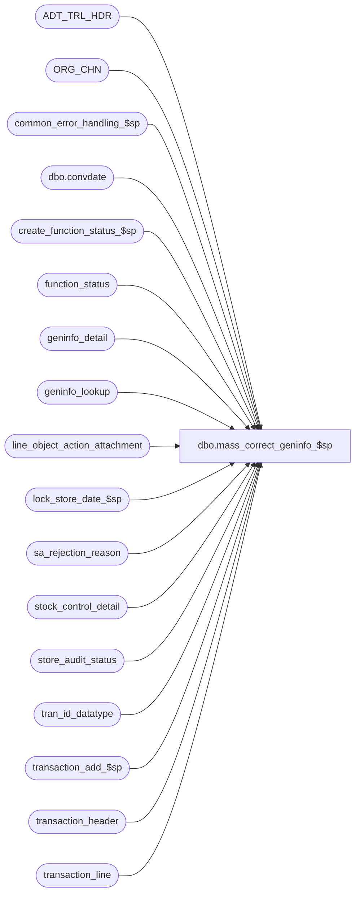

# dbo.mass_correct_geninfo_$sp

**Database:** auditworks  
**Server:** bedrockdb01  

## Architecture Diagram



## Table Dependencies

| Referenced Table |
|---|
| ADT_TRL_HDR |
| ORG_CHN |
| common_error_handling_$sp |
| dbo.convdate |
| create_function_status_$sp |
| function_status |
| geninfo_detail |
| geninfo_lookup |
| line_object_action_attachment |
| lock_store_date_$sp |
| sa_rejection_reason |
| stock_control_detail |
| store_audit_status |
| tran_id_datatype |
| transaction_add_$sp |
| transaction_header |
| transaction_line |

## Stored Procedure Code

```sql
create proc dbo.mass_correct_geninfo_$sp (
 @process_id               binary(16),
 @user_id                  int
)

AS

/* Proc Name: mass_correct_geninfo_$sp
   Desc: Revalidate type 18 S/A rejections - Display definition auto-config pending approval.
         Called by mass_auto_revalidate_$sp.  
         DECLARE @process_id binary(16) SELECT @process_id = newid() EXEC mass_correct_geninfo_$sp @process_id, -1 

HISTORY
Date     Name        Defect# Desc
Feb05,16 Vicci    TFS-139985 Correct #work_geninfo_detail unit datatype to match stock_control_detail.units
Nov14,14 Vicci     TFS-92326 Since this proc is called from mass_auto_revalidate_$sp within a try/catch @@error can't be checked.
 			     Take into account the fact that the value of the output parameter of a proc called with a TRY/CATCH is not returned 
                             to the calling proc when a raise-error occurs, when calling lock_store_date_$sp.  Do not report individual 201571 errors
                             since individual pre-verified 201550 errors have already been reported by the lock_store_date_$sp proc.
Sep23,13 Vicci        146826 Expand @errmsg since expanded in transaction_add_$sp
Mar06,13 Vicci        142294 Add missing COMMIT for case when other S/A rejections exist.
Nov22,12 Vicci        139911 Don't delete sa_rejection_reason without also removing geninfo detail.  
                             Since changing the stock_control_detail attachment may affect mandatory attachment
                             rejections, reverify them too.  Add audit-trail logging.
Jan21,11 Vicci        124247 Correct error handling following call to lock_store_date_$sp to recognize the fact that it
                             is normal to receive an @@error of 266 along with a return code of 201550 given the common
                             error handling rollback with will already have occurred and the proc is being called within
                             a begin tran.
Nov21,05 David       DV-1319 Pass @function_no to transaction_add_$sp otherwise function_status does not get cleaned up.
Aug03,05 Paul        DV-1295 fix error recovery logic
Jun28,05 David       DV-1285 Make sure initiated_by_host column is not null. Cleanup function_status.
Apr28,05 David       DV-1202 Author.

*/

DECLARE @cursor_open		tinyint,
	@date_reject_id 	tinyint,
	@ENTRY_ID               binary(16),
	@errno			int,
	@errmsg			nvarchar(2000),
	@function_no		tinyint,
	@line_id 		numeric(5,0),
	@old_display_def_id 	smallint,
        @prev_store_no          int,
        @prev_transaction_date  smalldatetime,
	@prev_date_reject_id 	tinyint,
	@rows                   int,
        @inlock                 int,
        @ret                    int,
        @sep			nchar(1),
        @skipstore              int,
	@store_no               int,
        @transaction_date       smalldatetime,
        @transaction_id         tran_id_datatype,
-- used for common error handling.
	@object_name		nvarchar(255),
	@process_name		nvarchar(100),
	@operation_name		nvarchar(100),
	@message_id		int,
	@some_skipped           int

SELECT 	@function_no = 124,
	@process_name = 'mass_correct_geninfo_$sp',
       	@message_id = 201068,
       	@sep = NCHAR(12),
       	@some_skipped = 0

CREATE TABLE #corr_lines (
       transaction_id numeric(14,0) NOT NULL, -- tran_id_datatype
       line_id numeric(5,0) NOT NULL )
SELECT @errno = @@error
IF @errno != 0
BEGIN
  SELECT @errmsg = 'Failed to create temp table #corr_lines',
         @object_name = '#corr_lines',
         @operation_name = 'CREATE'
  GOTO error
END

CREATE TABLE #work_geninfo_detail (
       transaction_id numeric(14,0) NOT NULL, -- tran_id_datatype
       line_id numeric(5,0) NOT NULL,
       form_name nvarchar(255) NOT NULL,
       field_name nvarchar(255) NOT NULL,
       old_display_def_id smallint NOT NULL,
       new_display_def_id smallint NOT NULL,
   count_date datetime null,
       initiated_by_host tinyint null,
       location_no int null,
       merchandise_key numeric(14,0) null,
       originating_store_no int null,
       other_store_no int null,
       pos_deptclass int null,
       units numeric(15,4) null,
       upc_no numeric(14,0) null,
       imrd nvarchar(1500) null,
       pos_identifier nvarchar(1500) null,
       reason nvarchar(1500) null,
       vendor_no nvarchar(1500) null)
SELECT @errno = @@error
IF @errno != 0
BEGIN
  SELECT @errmsg = 'Failed to create temp table #work_geninfo_detail',
         @object_name = '#work_geninfo_detail',
         @operation_name = 'CREATE'
  GOTO error
END

INSERT #corr_lines
SELECT gd.transaction_id,	
       gd.line_id
  FROM sa_rejection_reason rr,
       geninfo_detail gd,
       geninfo_lookup gl
 WHERE rr.violated_sareject_rule = 18
   AND rr.transaction_id = gd.transaction_id
   AND rr.line_id        = gd.line_id
   AND gd.form_name  = gl.form_name
   AND gd.field_name = gl.field_name
 GROUP BY gd.transaction_id, gd.line_id
HAVING MIN(gl.auto_config_verified) > 0 -- i.e. all display defs for a tran_id/line_id have been reviewed.
SELECT @errno = @@error,
       @rows = @@rowcount
IF @errno != 0
BEGIN
  SELECT @errmsg = 'Failed to insert into temp table #corr_lines.',
         @object_name = '#corr_lines',
         @operation_name = 'INSERT'
  GOTO error
END

IF @rows = 0
  RETURN

INSERT #work_geninfo_detail
SELECT gd.transaction_id,
       gd.line_id,
       gd.form_name,
       gd.field_name,
       gd.display_def_id, -- old
       gl.display_def_id, -- new
       dateadd(dd, gl.count_date_flag - 1, gd.field_data_date), 
       IsNull(gd.field_data_num * gl.initiated_by_host_flag, 0),
       gd.field_data_num * gl.location_no_flag,
       gd.field_data_num * gl.merchandise_key_flag,
       gd.field_data_num * gl.originating_store_no_flag,
       gd.field_data_num * gl.other_store_no_flag,
       gd.field_data_num * gl.pos_deptclass_flag,
       gd.field_data_num * gl.units_flag,
       gd.field_data_num * gl.upc_no_flag,
       LEFT(gd.field_data_string, 1500 * gl.imrd_flag),
       LEFT(gd.field_data_string, 1500 * gl.pos_identifier_flag),
       LEFT(gd.field_data_string, 1500 * gl.reason_flag),
       LEFT(gd.field_data_string, 1500 * gl.vendor_no_flag)
  FROM #corr_lines cl,
       geninfo_detail gd,
       geninfo_lookup gl
 WHERE cl.transaction_id = gd.transaction_id
   AND cl.line_id        = gd.line_id
   AND gd.form_name  = gl.form_name
   AND gd.field_name = gl.field_name
   AND gl.auto_config_verified > 0
SELECT @errno = @@error
IF @errno != 0
BEGIN
  SELECT @errmsg = 'Failed to insert into temp table #work_geninfo_detail.',
         @object_name = '#work_geninfo_detail',
         @operation_name = 'INSERT'
  GOTO error
END

DECLARE reject_crsr CURSOR FAST_FORWARD
    FOR
 SELECT DISTINCT th.transaction_date, 
        th.store_no, 
        th.date_reject_id,
        th.transaction_id
   FROM #corr_lines cl, transaction_header th WITH (NOLOCK)
  WHERE cl.transaction_id = th.transaction_id
  ORDER BY th.transaction_date, th.store_no, th.date_reject_id, th.transaction_id

OPEN reject_crsr
SELECT @errno = @@error
IF @errno != 0
BEGIN
  SELECT @errmsg='Failed to open cursor reject_crsr',
	 @object_name = 'reject_crsr',
	 @operation_name = 'OPEN'
  GOTO error
END

SELECT @cursor_open = 1,
       @inlock = 0,
       @skipstore = 0, 
       @prev_store_no = -1,
       @prev_transaction_date = NULL --

WHILE 1 = 1
BEGIN

  FETCH reject_crsr 
   INTO @transaction_date,
        @store_no,
        @date_reject_id,
        @transaction_id
       
  IF @@fetch_status <> 0
    SELECT @store_no = -1

  IF @store_no <> @prev_store_no 
    OR @transaction_date <> @prev_transaction_date
    OR @prev_transaction_date IS NULL -- 
  BEGIN

    IF @inlock <> 0
    BEGIN 
      UPDATE store_audit_status
     SET update_in_progress = 0
       WHERE store_no = @prev_store_no
         AND sales_date = @prev_transaction_date
         AND date_reject_id = @prev_date_reject_id
      SELECT @errno = @@error
      IF @errno !=0
      BEGIN
        SELECT @errmsg = 'Failed to unlock (update) store_audit_status',
               @object_name = 'store_audit_status',
               @operation_name = 'UPDATE'
	GOTO error
      END
	  
      DELETE function_status
       WHERE user_id = @user_id
         AND function_no = 182
         AND process_id = @process_id
      SELECT @errno = @@error
      IF @errno !=0
      BEGIN
        SELECT @errmsg = 'Failed to cleanup function_status.',
	  @object_name = 'function_status',
	       @operation_name = 'DELETE'
	GOTO error
      END
    END -- inlock <> 0 

    SELECT @inlock = 0
                
    IF @store_no >= 0
    BEGIN -- lock new store/date 
      BEGIN TRANSACTION

        SELECT @ret = NULL;
        BEGIN TRY 
           EXEC lock_store_date_$sp @process_id, @user_id, @store_no, @transaction_date, @date_reject_id, @function_no, @ret OUTPUT;
        END TRY
        BEGIN CATCH
          SELECT @errno = ERROR_NUMBER();
          IF @ret IS NULL OR @ret = 0
            SELECT @ret = @errno;
        END CATCH;          
        IF @errno != 0 AND @ret <> 201550 AND @errno <> 201550
          BEGIN
           SELECT @errmsg = 'Failed to execute lock_store_date_$sp',
		  @object_name = 'lock_store_date_$sp',
		  @operation_name = 'EXEC'
           GOTO error
          END

        IF @ret = 0
        BEGIN
          SELECT @inlock = 1,
	 	 @skipstore = 0,
		 @prev_store_no = @store_no,
		 @prev_transaction_date = @transaction_date,
		 @prev_date_reject_id = @date_reject_id
          
          EXEC create_function_status_$sp @process_id, @user_id, 182, @transaction_id,
	       @errmsg OUTPUT 
          SELECT @errno = @@error
          IF @errno != 0
          BEGIN
            IF @errmsg IS NULL -- 
              SELECT @errmsg = 'Failed to execute stored proc create_function_status_$sp'
	    SELECT @object_name = 'create_function_status_$sp',
		   @operation_name = 'EXEC'
            GOTO error
          END

          COMMIT TRANSACTION
        END -- IF @ret = 0
        ELSE -- unable to lock, skip all transactions for store-date 
        BEGIN
          SELECT @skipstore = 1, @some_skipped = 1
          
          IF @@trancount > 0
            COMMIT TRANSACTION
          
          CONTINUE
        END -- ELSE @ret != 0

    END -- IF @store_no >= 0  
  END -- change of store/date 

  IF @store_no < 0 
    BREAK

  IF @skipstore = 0
  BEGIN
    BEGIN TRANSACTION

    -- delete old entries
    DELETE stock_control_detail
      FROM stock_control_detail sc, #work_geninfo_detail gd
     WHERE sc.transaction_id = @transaction_id
       AND sc.transaction_id = gd.transaction_id
       AND sc.line_id        = gd.line_id
       AND sc.display_def_id = gd.old_display_def_id
    SELECT @errno = @@error
    IF @errno != 0
    BEGIN
      SELECT @errmsg = 'Failed to remove old entries from  stock_control_detail.',
             @object_name = 'stock_control_detail',
             @operation_name = 'DELETE'
      GOTO error
    END
        
    INSERT INTO stock_control_detail(
           transaction_id,
           line_id,
           display_def_id,
           upc_no,
           merchandise_key,
           initiated_by_host,
           units,
           other_store_no,
           location_no,
           vendor_no,
           count_date,
           pos_deptclass,
           pos_identifier,
           originating_store_no,
           reason,
           imrd)
    SELECT transaction_id,
           line_id, 
           new_display_def_id, 
           MAX(upc_no), 
           MAX(merchandise_key),
           MAX(initiated_by_host),
           MAX(units),
   MAX(other_store_no),
           MAX(location_no),
           MAX(vendor_no),
           MAX(count_date),
     MAX(pos_deptclass),
           MAX(pos_identifier),
           MAX(originating_store_no),
           MAX(reason),
           MAX(imrd) 
      FROM #work_geninfo_detail
     WHERE transaction_id = @transaction_id
     GROUP BY transaction_id, line_id, new_display_def_id
    SELECT @errno = @@error
    IF @errno != 0
    BEGIN
      SELECT @errmsg = 'Failed to populate stock_control_detail.',
             @object_name = 'stock_control_detail',
             @operation_name = 'INSERT'
      GOTO error
    END

    DELETE sa_rejection_reason
      FROM sa_rejection_reason rr, #corr_lines gd
     WHERE rr.transaction_id = @transaction_id
       AND rr.violated_sareject_rule = 18
       AND rr.transaction_id = gd.transaction_id
       AND rr.line_id = gd.line_id
    SELECT @errno = @@error
    IF @errno != 0
    BEGIN
      SELECT @errmsg = 'Failed to remove S/A reject reason 18.',
             @object_name = 'sa_rejection_reason',
             @operation_name = 'DELETE'
      GOTO error
    END

    -- Remove rejections for mandatory info set attachments which are no longer mandatory or no longer missing
    DELETE sa_rejection_reason
      FROM sa_rejection_reason rr, #corr_lines gd
     WHERE rr.transaction_id = @transaction_id
       AND rr.violated_sareject_rule = 23
       AND rr.transaction_id = gd.transaction_id
       AND rr.line_id = gd.line_id
       AND rr.line_id NOT IN (SELECT q.line_id
       		                FROM (SELECT tl.transaction_id,
     	     				     tl.line_id,
     	     				     la.attachment_type,
     	     		                     la.note_type
				        FROM transaction_header th WITH (NOLOCK), transaction_line tl WITH (NOLOCK), line_object_action_attachment la
				       WHERE th.transaction_void_flag IN (0,8)
				         AND th.transaction_id = @transaction_id
			                 AND th.transaction_id = tl.transaction_id
	          		         AND tl.line_void_flag = 0
				         AND th.transaction_category = ISNULL(la.transaction_category, th.transaction_category)
				         AND tl.line_object = la.line_object
				         AND tl.line_action = la.line_action
				         AND la.attachment_mandatory = 1
				         AND la.attachment_type = 3
				       UNION
				      SELECT th.transaction_id,				       
			                     0 as line_id,
				             la.attachment_type, 
				             la.note_type
			     	        FROM transaction_header th WITH (NOLOCK), line_object_action_attachment la
				       WHERE th.transaction_void_flag IN (0,8)
				         AND th.transaction_id = @transaction_id
				         AND th.transaction_category = ISNULL(la.transaction_category, th.transaction_category)
				         AND la.line_object = -1
				         AND la.attachment_mandatory = 1
				         AND la.attachment_type >= 1
				         AND la.attachment_type = 3
				           ) q
			      WHERE NOT EXISTS (SELECT 1 FROM stock_control_detail a 
			                         WHERE a.transaction_id = @transaction_id 
			                           AND a.transaction_id = q.transaction_id 
			                           AND a.line_id = q.line_id 
			                           AND a.display_def_id = q.note_type)
                              )
    SELECT @errno = @@error
    IF @errno != 0
    BEGIN
      SELECT @errmsg = 'Failed to delete sa_rejection_reason for mandatory attachments which are no longer mandatory or no longer missing',
	     @object_name = 'sa_rejection_reason',
	     @operation_name = 'DELETE'
      GOTO error
    END

    DELETE geninfo_detail		
      FROM #corr_lines gd
     WHERE geninfo_detail.transaction_id = @transaction_id
       AND geninfo_detail.transaction_id = gd.transaction_id
       AND geninfo_detail.line_id = gd.line_id
    SELECT @errno = @@error
    IF @errno != 0
BEGIN
    SELECT @errmsg = 'Failed to clean up geninfo_detail.',
             @object_name = 'geninfo_detail',
             @operation_name = 'DELETE'
      GOTO error
    END

    -- Check if there any other S/A rejects. If not, then post the trnx.
    IF NOT EXISTS (SELECT 1 
                     FROM sa_rejection_reason
                    WHERE transaction_id = @transaction_id)
    BEGIN

      -- create function_status with status = 5 (rollforward)
      EXEC create_function_status_$sp @process_id, @user_id, @function_no, @transaction_id, @errmsg OUTPUT,
           0, null, 0, 0, 5
      SELECT @errno = @@error
      IF @errno != 0
      BEGIN
        IF @errmsg IS NULL /* then */
          SELECT @errmsg = 'Failed to execute stored proc create_function_status_$sp'
        SELECT @object_name = 'create_function_status_$sp',
               @operation_name = 'EXECUTE'
        GOTO error
      END
      
      SELECT @ENTRY_ID = newid()
      
      UPDATE function_status
         SET ENTRY_ID = @ENTRY_ID
       WHERE process_id = @process_id
         AND function_no = @function_no 
      SELECT @errno = @@error
      IF @errno != 0
      BEGIN
        SELECT @errmsg = 'Failed to record mass-correct-geninfo audit trail entry-id in function status',
               @object_name = 'function_status',
	       @operation_name = 'UPDATE'
        GOTO error
      END

      INSERT INTO ADT_TRL_HDR(
             ENTRY_ID,
             ENTRY_DATE_TIME,
             USER_ID,
             APP_ID,
             ROOT_TBL_NAME,
             ROOT_TBL_KEY,
             ROOT_TBL_KEY_RSRC_NAME,
             ROOT_TBL_KEY_RSRC_PRMS,
             FNCTN_NUM)
      SELECT @ENTRY_ID,
             getdate(),
             @user_id,
             300,
             'TRANSACTION',
             CONVERT(nvarchar, h.store_no) + @sep + dbo.convdate(h.transaction_date) + @sep + 
		      CONVERT (nvarchar, h.register_no) + @sep + CONVERT(nvarchar, h.date_reject_id)
		      + @sep + CONVERT(nvarchar, h.transaction_no) + @sep + h.transaction_series 
		      + @sep + dbo.convdate(h.entry_date_time),
             'TK_STOR_TRAN_DATE_REGI_DATE_REJE_ID_TRAN_NO_TRAN_SERI_ENTR_DATE_TIME',
             CONVERT(nvarchar, h.store_no)  + ' - ' + ISNULL(o.ORG_CHN_NAME, CONVERT(nvarchar, h.store_no)) + @sep + dbo.convdate(h.transaction_date) + @sep + 
		      CONVERT (nvarchar, h.register_no) + @sep + CONVERT(nvarchar, h.date_reject_id)
		      + @sep + CONVERT(nvarchar, h.transaction_no) + @sep + h.transaction_series 
		      + @sep + dbo.convdate(h.entry_date_time),
             @function_no
        FROM transaction_header h
             LEFT OUTER JOIN ORG_CHN o
               ON h.store_no = o.ORG_CHN_NUM
       WHERE h.transaction_id = @transaction_id
      SELECT @errno = @@error
      IF @errno != 0
      BEGIN
        SELECT @errmsg = 'Failed to insert mass revalidation of Geninfo S/A Rejection into ADT_TRL_HDR',
  	       @object_name = 'ADT_TRL_HDR',
	       @operation_name = 'INSERT'
        GOTO error
      END

      COMMIT TRANSACTION

      EXEC transaction_add_$sp @process_id, @user_id, @transaction_id, @errmsg OUTPUT, @ENTRY_ID, @function_no, 5
      SELECT @errno = @@error
      IF @errno != 0
      BEGIN
        IF @errmsg IS NULL -- 
          SELECT @errmsg = 'Failed to execute transaction_add_$sp'
        SELECT @object_name = 'transaction_add_$sp',
               @operation_name = 'EXEC'
        GOTO error
      END
    END -- no more S/A rejects for this transaction
    ELSE
      COMMIT TRANSACTION
  END -- @skipstore = 0 
END -- While 1=1 

CLOSE reject_crsr
DEALLOCATE reject_crsr
SELECT @cursor_open = 0

IF @some_skipped = 1
BEGIN
  SELECT @errno = 201571,
	 @errmsg = 'Could not process all data. Some store-dates were in use.',
	 @object_name = 'lock_store_date_$sp',
	 @operation_name = 'EXEC',
	 @message_id = 201571
  EXEC common_error_handling_$sp @function_no, @errno, @errmsg, 3, @message_id, @process_name, @object_name, @operation_name, 
               0, 1, 0, null, 0, null, null, null, null, null, null, 0, @process_id, @user_id
END

DROP TABLE #corr_lines 
SELECT @errno = @@error
IF @errno != 0
  BEGIN
   SELECT @errmsg = 'Failed to DROP #corr_lines table',
	  @object_name = '#corr_lines',
	  @operation_name = 'DROP'
   GOTO error
  END

DROP TABLE #work_geninfo_detail 
SELECT @errno = @@error
IF @errno != 0
  BEGIN
   SELECT @errmsg = 'Failed to DROP #work_geninfo_detail table',
	  @object_name = '#work_geninfo_detail',
	  @operation_name = 'DROP'
   GOTO error
  END


RETURN

error:

	IF @cursor_open = 1
	  BEGIN
	   CLOSE reject_crsr
	   DEALLOCATE reject_crsr
	  END

	EXEC common_error_handling_$sp @function_no, @errno, @errmsg, 0, @message_id, 
		@process_name, @object_name, @operation_name, 0, 1, 0, null, 0, null, 
		null, null, null, null, null, 0, @process_id, @user_id

	RETURN
```

