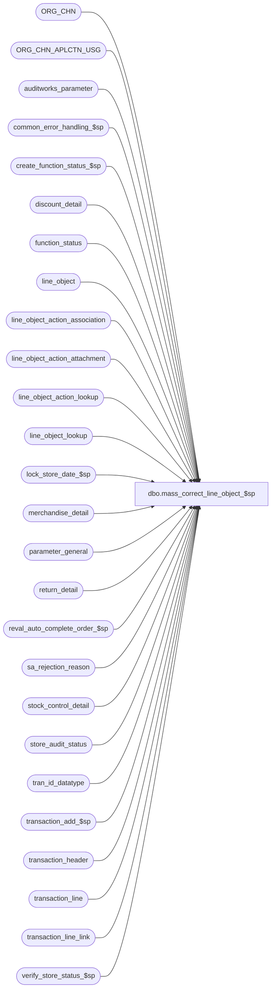

# dbo.mass_correct_line_object_$sp

**Database:** auditworks  
**Server:** bedrockdb01  

## Architecture Diagram



## Table Dependencies

| Referenced Table |
|---|
| ORG_CHN |
| ORG_CHN_APLCTN_USG |
| auditworks_parameter |
| common_error_handling_$sp |
| create_function_status_$sp |
| discount_detail |
| function_status |
| line_object |
| line_object_action_association |
| line_object_action_attachment |
| line_object_action_lookup |
| line_object_lookup |
| lock_store_date_$sp |
| merchandise_detail |
| parameter_general |
| return_detail |
| reval_auto_complete_order_$sp |
| sa_rejection_reason |
| stock_control_detail |
| store_audit_status |
| tran_id_datatype |
| transaction_add_$sp |
| transaction_header |
| transaction_line |
| transaction_line_link |
| verify_store_status_$sp |

## Stored Procedure Code

```sql
create proc dbo.mass_correct_line_object_$sp (@process_id               binary(16),
 @user_id                  int,
 @purpose tinyint = 1,  --1=Revalidate all invalid object/action rejections, 2=Revalidate auto-order-completion requests
 @called_by_function_no tinyint = 82)  --set to 1 when called by edit to avoid locking rows already locked.
AS

/* Proc Name: mass_correct_line_object_$sp
   Desc: Revalidate sa rejections of type 6						
    ( Invalid line_object-action-tran_category ). Also re-evaluate			
    balance of the corrected transactions.
    Also Re-evaluate reject type 19 - auto config pending approval.
    Also Re-evaluate reject type 21-31, 33 - missing mandatory attachments and 9 -missing mandatory reference-number
    If no other reasons for rejection then post to interfaces and glc.
    Uses function_no 182 (to lock store/date)
    and 82 (created by transaction_add_$sp for rollforward of trans_add) 
   Calls transaction_add_$sp. 
   Called by mass_auto_revalidate_$sp, cust_liability_revalidate_$sp when not called by Edit, edit_phase2_$sp.

   Note: Any change in logic for line object lookup should be reflected in edit_lines_$sp.
   Since TM does not allow an non-existent LOA assoc to be remapped, the only time a LOA will
   be replaced by a lookup is when the LOAA has been auto-configured. In that case, the LOAA 
   will exist in the table but considered invalid because auto_config_verified = 0, 
   but the user is still allowed to go in TM and remapped this assoc to another LOA.

HISTORY
Date     Name		Def# Desc
Sep30,15 Vicci    TFS-143102 Avoid losing error message when calling transaction add (since it is called in a try/catch but does not do try/catch itself);
                             When determining if the store/date needs locking or not check if the store/date is already locked, not the date for ANY store (typo in join correction);
                             If another process has already fixed the transaction we had on our work list before we got our lock, don't call transaction add;
                             If called by the edit and one store/date is being skipped since locked by something else 
                             then don't skip the add for all the rest of the store/dates that are already locked by the edit and don't need locking, just skip the locking part.
                             If purpse = 2 (Revalidate auto-order-completion requests) but none have been successfully auto-completed then don't continue on with the lock/add posting part.
May01,15 Vicci    TFS-118970 Do not revalidate transactions that are in the Edit batch that is in midst of trickling in.  
                             Verify store status only once done with store/date (not after each transaction add performed).
Apr08,15 Vicci    TFS-114314 Release the mass-correct-line-object function status entry for cleanup if transaction add for function 82 fails.
Nov14,14 Vicci     TFS-92326 Take into account the fact that the value of the output parameter of a proc called with a TRY/CATCH is not returned 
                             to the calling proc when a raise-error occurs, when calling lock_store_date_$sp.  Do not report individual 201571 errors
                             since individual pre-verified 201550 errors have already been reported by the lock_store_date_$sp proc.
Sep11,14 Vicci        139695 Log unit of measure.
Aug27,14 Vicci     TFS-82676 Treat NULL lookup_pos_code as blank.
Jan29,14 Vicci        149617 Add try/catch around lock store date execution in order to trap and skip store/date instead of crashing.
Sep23,13 Vicci        146826 Expand @errmsg since expanded in transaction_add_$sp
May30,13 Paul         144393 Add date_reject_id to control-break logic for store_audit_status since this mass correct could correct
				sa rejected transactions that also have date_reject_id > 0; avoids leaving locked store_audit_status.
Sep26,11 Vicci        130028 In the case where tender auto-config requests with partial information were received (-4) without
                             corresonding requests for with full info (-3) and invalid obj/act rejects resulted, 
                             these need to be revalidated by first re-looking up the -3/-4 in the line-object table since the problem 
                             could have since be rectified.  Also, when the revalidation's lookups result in change
                             to the transaction line table's object/action, these must also be reflected in the S/A Reject
                             table in order for the subsequent Add to recognize them!!
                             Remove the "safety check" of tl.line_object = 0 in the transaction line update, since in the case of
                             rejections for a reason of "pending review" the line_object isn't zero.
Sep19,11 Vicci        129999 In the case of a Pending Revalidation reject for a Lookup POS Code that has since been remapped
   in the line_object_action_lookup table, take into account that it is not the pending-validation 
                             line-object but rather line_object -3 or -4 must must be looked up.  Take object_action_lookup_first 
             parameter introduced back in 2008 on 1-3XLBPR into account.
Jan21,11 Vicci        124247 Correct error handling following call to lock_store_date_$sp to recognize the fact that it
                             is normal to receive an @@error of 266 along with a return code of 201550 given the common
                             error handling rollback with will already have occurred and the proc is being called within
                             a begin tran.
Nov19,09 Vicci        122171 Correct lookup of type UPC to also function when product ID is found in POS Identifier field.
Aug26,09 Vicci     109078 Don't lock store-date if called by edit and store/date already locked by edit.
Jul21,09 Vicci        109078 Call reval_auto_complete_order_$sp
Mar13,09 Vicci        106158 Support mass revalidation of missing mandatory attachments and reference numbers.
Sep06,05 Paul     DV-1312 apply 45032 to SA5
Aug03,05 Paul DV-1295 fix error recovery logic by moving deletion of sa_rejection_reason to transaction_add_$sp
Jul04,05 David       DV-1285 Fix join to L_O_A_Attachment. Only call transaction_add_$sp when no more S/A rejects.
Jun01,05 David       DV-1263 Do line_object lookup prior to revalidating. Re-lookup upc_lookup_division from L_O_A_Attachment.
Apr28,05 David       DV-1202 Revalidate reject type 19 - auto config pending approval,expand transaction_id to use tran_id_datatype
Sep17,04 Maryam      DV-1146 Use user_id.
Apr21,04 Maryam      DV-1071 receive @process_id and pass it to the sub procs.
			     modify the call to lock_store_date_$sp as it no longer outputs the user name
Nov26,04 Daphna 1-12DPFQ/45032 Cleanup sa_rejection_reason when lineobj and lineact <> 0

Jul08,03 David 11140/1-LPS2T Cleanup sa_rejection_reason entries only for selected rows.
Jun11,02 ShuZ        1-9LWE6 Allow only some S/A rejections for revalidation,
                             take out pass in parameters @from_transaction_id,@to_transaction_id
                             make the population logic for #corr_lines same as Oracle.
May16,02 Henry	     1-CD0IX Add R3.5 standardized common error handling
Apr04,01 Phu		7501 Use system function to retrieve user name
Feb27,01 Phu		7336 Validate sa reject 5, 6 even though there are other sa rejects
Sep08,00 Paul		6661 refix to 5516 for trans which are still rejected
Mar09,00 Paul		6067 remove reject reason even if tran is still rejected,
				improve error handling.
Mar01,00 Phu		5900 Change @@fetch_status > 0 to @@fetch_status <> 0 for MS SQL compatibility
Oct08,99 Paul		5516 Ensure that line_object=0 and line_action=0 remains rejected.
Aug20,99 John G.	     Specify NULL/NOT NULL for columns in #corr_lines
Nov17,97 Paul
Nov12,96 Paul		author

*/

DECLARE @cursor_open		tinyint,
	@date_reject_id 	tinyint,
	@errno			int,
	@errmsg			nvarchar(2000),
	@function_no		tinyint,
        @prev_store_no          int,
        @prev_transaction_date  smalldatetime,
	@prev_date_reject_id 	tinyint,
	@rows                   int,
        @inlock                 int,
        @ret                    int,
        @skipstore              int,
	@store_no               int,
	@tinyint_filler		tinyint,
	@trace_msg		nvarchar(255),
        @transaction_date       smalldatetime,
        @transaction_id         tran_id_datatype,
-- used for common error handling.
	@object_name		nvarchar(255),
	@process_name		nvarchar(100),
	@operation_name		nvarchar(100),
	@message_id		int,
        @object_action_lookup_first smallint,
        @some_skipped           int
	

SELECT 	@function_no = 82,
	@tinyint_filler = 0,
	@process_name = 'mass_correct_line_object_$sp',
       	@message_id = 201068,
       	@some_skipped = 0
  
IF @called_by_function_no IS NULL
  SELECT @called_by_function_no = 82
  
IF EXISTS (SELECT 1
             FROM auditworks_parameter
            WHERE par_name = 'object_action_lookup_first'
              AND par_value = '1')
  SELECT @object_action_lookup_first = 1
ELSE
  SELECT @object_action_lookup_first = 0

IF EXISTS (SELECT 1 FROM sa_rejection_reason rr
            WHERE rr.violated_sareject_rule = 6
              AND rr.line_object = -5)
BEGIN
  IF @called_by_function_no = 1
  BEGIN
    SELECT @trace_msg = NCHAR(13) + NCHAR(10) + ':LOG &&: Edit phase 2 - Re-attempt previously failed order auto-completions if any : ' + CONVERT(nchar, getdate(), 8)
    PRINT @trace_msg
  END

  EXEC reval_auto_complete_order_$sp
  SELECT @errno = @@error
  IF @errno != 0
  BEGIN
    SELECT @errmsg = 'Failed to re-attempt order auto-completion',
  	   @object_name = 'reval_auto_complete_order_$sp',
	   @operation_name = 'EXECUTE'
    GOTO error
  END
  IF @purpose = 2 --Revalidate auto-order-completion requests
  BEGIN
    IF NOT EXISTS (SELECT 1 FROM sa_rejection_reason WHERE line_object = 9066 AND line_action = 38 AND violated_sareject_rule = 6)
    BEGIN
      RETURN  --If nothing has been auto-completed successfully then we don't want to continue on.
    END
  END
END
ELSE  --Note:  we want to continue on with the out-of-balance revalidation after the revalidation has been done...
BEGIN
  IF @purpose = 2 --Revalidate auto-order-completion requests
  BEGIN
    IF NOT EXISTS (SELECT 1 FROM sa_rejection_reason WHERE line_object = 9066 AND line_action = 38 AND violated_sareject_rule = 6)
    BEGIN
      RETURN  --If nothing new needed auto-completing and there are no previously successful auto-completions that had not yet been posted we don't want to continue on.
    END
  END
END

CREATE TABLE #corr_lines(
	transaction_id		numeric(14,0) NOT NULL, -- tran_id_datatype
	line_id			numeric(5,0) NOT NULL,
	line_object		smallint NULL,
	line_action		tinyint NULL,
	transaction_category	tinyint NULL,
	store_no		int NOT NULL,
	transaction_date	smalldatetime,
	date_reject_id		tinyint NOT NULL,
	db_cr_none		smallint NULL,
	line_object_type	tinyint NULL,
	reference_type		tinyint NULL,
	discountable_group	smallint NULL,
	lookup_store		int NOT NULL,		
	employee_no		int NULL,
	discount_reversal_flag	tinyint NULL,
	lookup_pos_code		nvarchar(500) NULL,		--note:  this comes from the transl_transaction_line table and is not set for reject types other than 6 and 19.
	sa_reject_process_id    int NULL,
	unit_of_measure         smallint NULL)
SELECT @errno = @@error
IF @errno != 0
  BEGIN
    SELECT @errmsg = 'Failed to create temp table #corr_lines',
	   @object_name = '#corr_lines',
	   @operation_name = 'CREATE'
    GOTO error
  END

-- get list of rejected transaction lines
INSERT #corr_lines (
	transaction_id,
	line_id,
	line_object,
	line_action,
	transaction_category,
	store_no,
	transaction_date,
	date_reject_id,
	lookup_store,
	employee_no,
	lookup_pos_code,
	sa_reject_process_id)
 SELECT DISTINCT rr.transaction_id,
	rr.line_id,
	COALESCE(rr.line_object, tl.line_object), 
	COALESCE(rr.line_action, tl.line_action), 
	COALESCE(rr.transaction_category, th.transaction_category), 
	th.store_no,
	th.transaction_date,
	th.date_reject_id,
	th.store_no, -- lookup store
	th.employee_no, 
	CASE WHEN rr.violated_sareject_rule in (6, 19) THEN COALESCE(rr.lookup_pos_code, ' ') ELSE rr.lookup_pos_code END,
	rr.process_id
   FROM sa_rejection_reason rr,
        transaction_header th,
        transaction_line tl,
        store_audit_status sas
  WHERE rr.violated_sareject_rule IN (6, 19, 5, 9, 21, 22, 23, 24, 25, 26, 27, 28, 29, 30, 31, 33)
    AND rr.transaction_id = th.transaction_id
    AND rr.transaction_id = tl.transaction_id
    AND (rr.line_id = tl.line_id OR rr.line_id = 0)
    AND (rr.process_id = @process_id OR rr.process_id IS NULL)
    AND th.edit_progress_flag = 0
    AND th.store_no = sas.store_no
    AND th.transaction_date = sas.sales_date
    AND th.date_reject_id = sas.date_reject_id
    AND (sas.update_in_progress <> 1 OR @called_by_function_no = 1) 
  SELECT @errno = @@error,
	 @rows = @@rowcount
  IF @errno != 0
  BEGIN
    SELECT @errmsg = 'Failed to insert into temp table #corr_lines (1)',
           @object_name = '#corr_lines',
           @operation_name = 'INSERT'
    GOTO error
  END

IF @rows = 0
  BEGIN
   DROP TABLE #corr_lines
   RETURN
  END

--1-9LWE6
IF EXISTS (SELECT 1
             FROM #corr_lines
            WHERE sa_reject_process_id = @process_id)
BEGIN      
  DELETE #corr_lines
   WHERE sa_reject_process_id IS NULL 
   
  SELECT @errno = @@error
  IF @errno != 0
  BEGIN
    SELECT @errmsg         = 'Failed to DELETE #corr_lines ',
           @object_name    = '#corr_lines',
 @operation_name = 'DELETE'
    GOTO error
  END       
END

-- START Replace line object/action based on lookup

UPDATE #corr_lines
   SET lookup_store = return_from_store
  FROM return_detail rd, 
       ORG_CHN_APLCTN_USG ss, 
       ORG_CHN c, 
  #corr_lines tl
 WHERE rd.return_from_store IS NOT NULL  
   AND rd.return_from_store = ss.ORG_CHN_NUM 
   AND ss.APLCTN_ID = 300
   AND ss.VLDTY = 1
   AND ss.ORG_CHN_NUM = c.ORG_CHN_NUM
   AND c.ACTV = 1
   AND rd.transaction_id = tl.transaction_id
   AND (rd.line_id = tl.line_id OR rd.line_id = 0)

  SELECT @errno = @@error
  IF @errno != 0
  BEGIN
    SELECT @errmsg = 'Failed to update lookup_store',
           @object_name = '#corr_lines',
           @operation_name = 'UPDATE'    
    GOTO error
  END

UPDATE #corr_lines
   SET lookup_store = return_from_store
  FROM return_detail rd,
       transaction_line_link k,
       ORG_CHN_APLCTN_USG ss,
       ORG_CHN c,
       #corr_lines tl
 WHERE rd.return_from_store IS NOT NULL  
   AND rd.return_from_store = ss.ORG_CHN_NUM 
   AND ss.APLCTN_ID = 300
   AND ss.VLDTY = 1
   AND ss.ORG_CHN_NUM = c.ORG_CHN_NUM
   AND c.ACTV = 1
   AND k.transaction_id = rd.transaction_id
   AND k.linked_line_id = rd.line_id   
   AND k.transaction_id = tl.transaction_id
   AND k.line_id = tl.line_id
SELECT @errno = @@error
IF @errno != 0
BEGIN
  SELECT @errmsg = 'Failed to update lookup_store via transaction line link',
         @object_name = '#corr_lines',
         @operation_name = 'UPDATE'    
  GOTO error
END

UPDATE #corr_lines
   SET line_object = lo.line_object
  FROM #corr_lines tl, line_object lo
 WHERE (tl.line_object = -3 AND tl.lookup_pos_code = lo.lookup_pos_code)
    OR (tl.line_object = -4 AND tl.lookup_pos_code = lo.lookup_partial_pos_code)
SELECT @errno = @@error
IF @errno != 0
BEGIN
  SELECT @errmsg = 'Failed to determine if lookup pos code in question has since been auto-configured.',
         @object_name = '#corr_lines',
         @operation_name = 'UPDATE'    
  GOTO error
END

IF @object_action_lookup_first = 0
BEGIN
  UPDATE #corr_lines
     SET line_object = lol.line_object
    FROM #corr_lines tl, line_object_lookup lol
   WHERE tl.line_object  = lol.lookup_line_object
     AND tl.lookup_store = lol.store_no
  SELECT @errno = @@error
  IF @errno != 0
  BEGIN
    SELECT @errmsg = 'Failed to update #corr_lines (line_object_lookup)',
           @object_name = '#corr_lines',
           @operation_name = 'UPDATE'    
    GOTO error
  END
END

-- If parameter object_action_lookup_flag is on, updates line_object and 
-- line_action in #corr_lines with those found in line_object_action_lookup table 
IF (SELECT object_action_lookup_flag 
   FROM parameter_general) != 0 
BEGIN

  UPDATE #corr_lines
     SET line_object = loal.line_object,
         line_action = loal.line_action,
         discount_reversal_flag = loal.discount_reversal_flag
    FROM #corr_lines cl,
         line_object_action_lookup loal   
   WHERE cl.lookup_pos_code IS NOT NULL	--note:  this comes from the transl_transaction_line table and is not set for reject types other than 6 and 19.
     AND cl.line_object not in (-3, -4) --since this will already be done as part of the regular lookup happenning in a step below
     AND cl.line_action = loal.lookup_line_action
     AND loal.lookup_line_object = -4
     AND cl.lookup_pos_code = loal.lookup_pos_code
     AND loal.lookup_code_type = 0 -- for pos lookup
     AND EXISTS (SELECT 1 FROM line_object o WHERE o.line_object < 9000 AND o.lookup_partial_pos_code = cl.lookup_pos_code)
  SELECT @errno = @@error
  IF @errno != 0
  BEGIN
    SELECT @errmsg = 'Failed to update #corr_lines by looking up the line object originally given by the translate (-4) before the auto-config switched it in the line_object_action_lookup table',
           @object_name = '#corr_lines',
           @operation_name = 'UPDATE'              
    GOTO error
  END

  UPDATE #corr_lines
     SET line_object = loal.line_object,
         line_action = loal.line_action,
         discount_reversal_flag = loal.discount_reversal_flag
    FROM #corr_lines cl,
         line_object_action_lookup loal   
   WHERE cl.lookup_pos_code IS NOT NULL	--note:  this comes from the transl_transaction_line table and is not set for reject types other than 6 and 19.
     AND cl.line_object not in (-3, -4) --since this will already be done as part of the regular lookup happening in a step below
     AND cl.line_action = loal.lookup_line_action
     AND loal.lookup_line_object = -3
     AND cl.lookup_pos_code = loal.lookup_pos_code
     AND loal.lookup_code_type = 0 -- for pos lookup
     AND EXISTS (SELECT 1 FROM line_object o WHERE o.line_object < 9000 AND o.lookup_pos_code = cl.lookup_pos_code)
  SELECT @errno = @@error
  IF @errno != 0
  BEGIN
    SELECT @errmsg = 'Failed to update #corr_lines by looking up the line object originally given by the translate (-3) before the auto-config switched it in the line_object_action_lookup table',
           @object_name = '#corr_lines',
           @operation_name = 'UPDATE'                          
    GOTO error
  END


  UPDATE #corr_lines
     SET line_object = loal.line_object,
         line_action = loal.line_action,
         discount_reversal_flag = loal.discount_reversal_flag
    FROM #corr_lines cl,
         line_object_action_lookup loal   
   WHERE cl.line_action = loal.lookup_line_action
     AND cl.line_object = loal.lookup_line_object
     AND cl.lookup_pos_code = loal.lookup_pos_code
     AND loal.lookup_code_type = 0 -- for pos lookup
  SELECT @errno = @@error
  IF @errno != 0
  BEGIN
    SELECT @errmsg = 'Failed to update #corr_lines via line_object_action_lookup table',
           @object_name = '#corr_lines',
           @operation_name = 'UPDATE'   
    GOTO error
  END

  IF EXISTS (SELECT lookup_code_type 
               FROM line_object_action_lookup
              WHERE lookup_code_type = 1)  -- for upc lookup
  BEGIN
    UPDATE #corr_lines
       SET line_object = loal.line_object,
           line_action = loal.line_action,
           discount_reversal_flag = loal.discount_reversal_flag
      FROM merchandise_detail ml,
           #corr_lines tl,
           line_object_action_lookup loal
     WHERE tl.transaction_id = ml.transaction_id
       AND tl.line_id = ml.line_id
       AND tl.line_action = loal.lookup_line_action
       AND tl.line_object = loal.lookup_line_object
       AND loal.lookup_pos_code = CASE WHEN ml.upc_no <> 0 THEN CONVERT(nvarchar(20), ml.upc_no) ELSE ml.pos_identifier END 
       AND loal.lookup_code_type = 1       
    SELECT @errno = @@error
    IF @errno != 0
    BEGIN
      SELECT @errmsg = 'Failed to update #corr_lines (lookup_code_type 1, merchandise_detail)',
             @object_name = '#corr_lines',
             @operation_name = 'UPDATE'                          
      GOTO error
    END

    UPDATE #corr_lines
       SET line_object = loal.line_object,
         line_action = loal.line_action,
           discount_reversal_flag = loal.discount_reversal_flag
      FROM stock_control_detail sl,
           #corr_lines tl,
           line_object_action_lookup loal
     WHERE tl.transaction_id = sl.transaction_id
       AND tl.line_id = sl.line_id
       AND sl.upc_lookup_division > 0
       AND tl.line_action = loal.lookup_line_action
       AND tl.line_object = loal.lookup_line_object
       AND loal.lookup_pos_code = CASE WHEN sl.upc_no <> 0 THEN CONVERT(nvarchar(20), sl.upc_no) ELSE sl.pos_identifier END 
       AND loal.lookup_code_type = 1         
    SELECT @errno = @@error
    IF @errno != 0
    BEGIN
      SELECT @errmsg = 'Failed to update #corr_lines (lookup_code_type 1, stock_control_detail)',
             @object_name = '#corr_lines',
             @operation_name = 'UPDATE'        
      GOTO error
    END
        
    UPDATE #corr_lines
       SET line_object = loal.line_object,
           line_action = loal.line_action,
           discount_reversal_flag = loal.discount_reversal_flag
      FROM stock_control_detail sl,
          transaction_line_link k,
           #corr_lines tl,
           line_object_action_lookup loal
     WHERE tl.transaction_id = k.transaction_id
       AND tl.line_id = k.line_id
       AND k.transaction_id = sl.transaction_id
       AND k.linked_line_id = sl.line_id
       AND sl.upc_lookup_division > 0
       AND tl.line_action = loal.lookup_line_action
       AND tl.line_object = loal.lookup_line_object
       AND loal.lookup_pos_code = CASE WHEN sl.upc_no <> 0 THEN CONVERT(nvarchar(20), sl.upc_no) ELSE sl.pos_identifier END 
       AND loal.lookup_code_type = 1
    SELECT @errno = @@error
    IF @errno != 0
  BEGIN
      SELECT @errmsg = 'Failed to update #corr_lines (lookup_code_type 1, stock_control_detail link)',
             @object_name = '#corr_lines',
             @operation_name = 'UPDATE'      
      GOTO error
    END
  END -- lookup_code_type = 1 for upc lookup

  IF EXISTS (SELECT lookup_code_type 
               FROM line_object_action_lookup
              WHERE lookup_code_type = 2)  -- for pos_deptclass lookup
  BEGIN
    UPDATE #corr_lines
       SET line_object = loal.line_object,
           line_action = loal.line_action,
           discount_reversal_flag = loal.discount_reversal_flag
      FROM merchandise_detail ml,
           #corr_lines tl,
           line_object_action_lookup loal
     WHERE tl.transaction_id = ml.transaction_id
       AND tl.line_id = ml.line_id
       AND tl.line_action = loal.lookup_line_action
       AND tl.line_object = loal.lookup_line_object
       AND loal.lookup_pos_code = CONVERT(nvarchar(20), ml.pos_deptclass)
       AND loal.lookup_code_type = 2

        SELECT @errno = @@error
        IF @errno != 0
        BEGIN
          SELECT @errmsg = 'Failed to update #corr_lines (lookup_code_type 2, merchandise_detail)',
                 @object_name = '#corr_lines',
                 @operation_name = 'UPDATE'
          GOTO error
        END

    UPDATE #corr_lines
       SET line_object = loal.line_object,
           line_action = loal.line_action,
           discount_reversal_flag = loal.discount_reversal_flag
      FROM stock_control_detail sl,
           #corr_lines tl,
           line_object_action_lookup loal
     WHERE tl.transaction_id = sl.transaction_id
       AND tl.line_id = sl.line_id
       AND sl.upc_lookup_division > 0
       AND tl.line_action = loal.lookup_line_action
       AND tl.line_object = loal.lookup_line_object
       AND loal.lookup_pos_code = CONVERT(nvarchar(20), sl.pos_deptclass)
       AND loal.lookup_code_type = 2

        SELECT @errno = @@error
        IF @errno != 0
        BEGIN
          SELECT @errmsg = 'Failed to update #corr_lines (lookup_code_type 2, stock_control_detail)',
                 @object_name = '#corr_lines',
                 @operation_name = 'UPDATE'
          GOTO error
        END
          
    UPDATE #corr_lines
       SET line_object = loal.line_object,
           line_action = loal.line_action,
           discount_reversal_flag = loal.discount_reversal_flag
   FROM stock_control_detail sl,
           transaction_line_link k,
           #corr_lines tl,
           line_object_action_lookup loal
     WHERE tl.transaction_id = k.transaction_id
       AND tl.line_id = k.line_id
       AND k.transaction_id = sl.transaction_id
       AND k.linked_line_id = sl.line_id
       AND sl.upc_lookup_division > 0
       AND tl.line_action = loal.lookup_line_action
       AND tl.line_object = loal.lookup_line_object
       AND loal.lookup_pos_code = CONVERT(nvarchar(20), sl.pos_deptclass)
       AND loal.lookup_code_type = 2

        SELECT @errno = @@error
        IF @errno != 0
        BEGIN
   SELECT @errmsg = 'Failed to update #corr_lines (lookup_code_type 2, stock_control_detail link)',
                 @object_name = '#corr_lines',
                 @operation_name = 'UPDATE'
          GOTO error
        END
  END -- lookup_code_type = 2 for pos_deptclass lookup

  UPDATE #corr_lines
     SET line_object = loal.line_object,
         line_action = loal.line_action,
         discount_reversal_flag = loal.discount_reversal_flag
    FROM #corr_lines tl,
         line_object_action_lookup loal   
   WHERE loal.lookup_code_type = 3 -- employee purchase
     AND tl.line_action = loal.lookup_line_action
     AND tl.line_object = loal.lookup_line_object
     AND tl.employee_no >= 0

    SELECT @errno = @@error
    IF @errno != 0
    BEGIN
      SELECT @errmsg = 'Failed to update #corr_lines (employee purchase)',
             @object_name = '#corr_lines',
@operation_name = 'UPDATE'                          
 GOTO error
    END
END --object_action_lookup_flag != 0

-- END line object/action lookup

IF @object_action_lookup_first = 1
BEGIN
  UPDATE #corr_lines
     SET line_object = lol.line_object
    FROM #corr_lines tl, line_object_lookup lol
   WHERE tl.line_object  = lol.lookup_line_object
     AND tl.lookup_store = lol.store_no
  SELECT @errno = @@error
  IF @errno != 0
  BEGIN
    SELECT @errmsg = 'Failed to update #corr_lines (line_object_lookup after line_object_action lookup)',
        @object_name = '#corr_lines',
           @operation_name = 'UPDATE'    
    GOTO error
  END
END

-- Start checking if line object/action is valid.

UPDATE #corr_lines
   SET db_cr_none         = loa.db_cr_none,
       line_object_type  = loa.line_object_type,
       reference_type     = loa.reference_type,
       discountable_group = loa.discountable_group,
       unit_of_measure	  = loa.unit_of_measure
  FROM #corr_lines t, line_object_action_association loa
 WHERE t.line_object = loa.line_object
   AND t.line_action = loa.line_action
   AND t.transaction_category = loa.transaction_category
  AND loa.auto_config_verified > 0
   AND loa.active_flag = 1
  SELECT @errno = @@error
  IF @errno != 0
  BEGIN
    SELECT @errmsg = 'Failed to check if LOA is valid.',
           @object_name = '#corr_lines',
           @operation_name = 'UPDATE'
    GOTO error
  END

DELETE #corr_lines
 WHERE (line_object_type IS NULL OR line_object_type = 0)

  SELECT @errno = @@error
  IF @errno != 0
  BEGIN
    SELECT @errmsg = 'Failed to cleanup rows that are still invalid.',
           @object_name = '#corr_lines',
           @operation_name = 'DELETE'
    GOTO error
  END
	
SELECT DISTINCT transaction_id, 
       store_no, 
       transaction_date, 
       date_reject_id
  INTO #corr_transactions
  FROM #corr_lines

SELECT @errno = @@error,
	@rows = @@rowcount
IF @errno != 0
  BEGIN
   SELECT @errmsg = 'Failed to build temp table #corr_transactions',
	   @object_name = '#corr_transactions',
	   @operation_name = 'SELECT'
   GOTO error
  END

IF @rows = 0
  BEGIN
   DROP TABLE #corr_lines
   DROP TABLE #corr_transactions
   RETURN
  END

-- reverse discount_amount_sign if discount_reversal_flag is set in line_object_action_lookup table 
IF (SELECT object_action_lookup_flag 
      FROM parameter_general) != 0 
BEGIN
  UPDATE discount_detail
     SET pos_discount_amount = pos_discount_amount * -1
  FROM discount_detail td, #corr_lines tl
   WHERE tl.transaction_id = td.transaction_id
     AND tl.line_id = td.line_id
     AND IsNull(tl.discount_reversal_flag, 0) = 1

    SELECT @errno = @@error
    IF @errno != 0
      BEGIN
        SELECT @errmsg = 'Failed to update discount_detail (discount_amount_sign)',
               @object_name = 'discount_detail',
               @operation_name = 'UPDATE'      
        GOTO error
      END
END -- object_action_lookup_flag <> 0

-- update transaction line with corrected values 
UPDATE transaction_line
   SET line_object = cl.line_object,
	line_action = cl.line_action,
	line_object_type = cl.line_object_type,
	reference_type = cl.reference_type,
	db_cr_none = cl.db_cr_none,
	discountable_group = cl.discountable_group,
	unit_of_measure = cl.unit_of_measure
  FROM #corr_lines cl, transaction_line tl
 WHERE cl.transaction_id = tl.transaction_id
   AND cl.line_id = tl.line_id
SELECT @errno = @@error
IF @errno != 0
  BEGIN
   SELECT @errmsg = 'Failed to update transaction_line table',
	  @object_name = 'transaction_line',
	  @operation_name = 'UPDATE'
   GOTO error
  END

-- update merchandise_detail with corrected values 
UPDATE merchandise_detail
   SET merchandise_category = lt.merchandise_category,
       upc_lookup_division  = lt.upc_lookup_division
  FROM merchandise_detail md, #corr_lines cl, line_object_action_attachment lt
 WHERE cl.transaction_id = md.transaction_id
   AND cl.line_id = md.line_id
   AND cl.line_object = lt.line_object
   AND cl.line_action = lt.line_action
   AND cl.transaction_category = IsNull(lt.transaction_category, cl.transaction_category)
   AND lt.attachment_type = 1
   AND lt.auto_config_verified > 0

SELECT @errno = @@error
IF @errno != 0
  BEGIN
   SELECT @errmsg = 'Failed to re-set merchandise_category, upc_lookup_division',
	  @object_name = 'merchandise_detail',
	  @operation_name = 'UPDATE'
   GOTO error
  END

-- update stock_control_detail with corrected values 
UPDATE stock_control_detail
   SET upc_lookup_division = lt.upc_lookup_division
  FROM stock_control_detail sc, #corr_lines cl, line_object_action_attachment lt
 WHERE cl.transaction_id = sc.transaction_id
   AND cl.line_id = sc.line_id
   AND cl.line_object = lt.line_object
 AND cl.line_action = lt.line_action
   AND cl.transaction_category = IsNull(lt.transaction_category, cl.transaction_category)
   AND lt.note_type = sc.display_def_id 
   AND lt.attachment_type = 3
   AND lt.auto_config_verified > 0

SELECT @errno = @@error
IF @errno != 0
  BEGIN
   SELECT @errmsg = 'Failed to re-set display_def_id, upc_lookup_division',
	  @object_name = 'stock_control_detail',
	  @operation_name = 'UPDATE'
   GOTO error
  END

-- update sa_rejection_reason with revised object/actions since transaction add only looks at 
-- the sa_rejection_reason table, not the revised transaction_line entries, 
-- for its deletion of corrected rejections of type 6 and 19 !!
UPDATE sa_rejection_reason
   SET line_object = cl.line_object,
       line_action = cl.line_action
  FROM #corr_lines cl
 WHERE cl.transaction_id = sa_rejection_reason.transaction_id
   AND cl.line_id = sa_rejection_reason.line_id
   AND sa_rejection_reason.violated_sareject_rule IN (6, 19)
   AND (sa_rejection_reason.line_object <> cl.line_object OR sa_rejection_reason.line_action <> cl.line_action)
SELECT @errno = @@error
IF @errno != 0
  BEGIN
   SELECT @errmsg = 'Failed to make sa_rejection_reason table match transaction_line table',
	  @object_name = 'sa_rejection_reason',
	  @operation_name = 'UPDATE'
   GOTO error
  END

/* post corrected transactions */
DECLARE reject_crsr CURSOR FAST_FORWARD
FOR
SELECT store_no,
	transaction_date,
	transaction_id,
	date_reject_id
FROM #corr_transactions
ORDER BY transaction_date, store_no, date_reject_id, transaction_id

OPEN reject_crsr

SELECT @errno = @@error
IF @errno != 0
  BEGIN
   SELECT @errmsg='Failed to open cursor reject_crsr',
	  @object_name = 'reject_crsr',
	  @operation_name = 'OPEN'
   GOTO error
  END

SELECT @cursor_open = 1,
       @inlock = 0,
       @skipstore = 0, 
       @prev_store_no = -1,
       @prev_transaction_date = NULL,
       @prev_date_reject_id = 0 /* can't set to -1 due to tinyint but initializing the columns above is sufficient */


WHILE 1=1
BEGIN

  FETCH reject_crsr INTO
                @store_no,
                @transaction_date,
		@transaction_id,
		@date_reject_id

 IF @@fetch_status <> 0
    SELECT @store_no = -1

  IF @store_no <> @prev_store_no 
   OR @transaction_date <> @prev_transaction_date
   OR @prev_transaction_date IS NULL
   OR @date_reject_id <> @prev_date_reject_id  
  BEGIN
    IF @inlock <> 0
      BEGIN /* unlock previous store/date by passing 3 to verify*/
        EXEC verify_store_status_$sp @process_id, NULL, @prev_store_no, @prev_transaction_date, @prev_date_reject_id, @errmsg OUTPUT, 3
        SELECT @errno = @@error
        IF @errno <> 0
        BEGIN
          IF @errmsg IS NULL /* then */
          SELECT @errmsg = 'Unable to exec verify_store_status_$sp'
          SELECT @object_name = 'verify_store_status_$sp',
                 @operation_name = 'EXECUTE'      
          GOTO error
        END				

        DELETE function_status
         WHERE user_id = @user_id
           AND function_no = 182
           AND process_id = @process_id
	SELECT @errno = @@error
	IF @errno !=0
        BEGIN
	  SELECT @errmsg = 'Failed to delete function 182 from function status.  ',
		 @object_name = 'function_status',
		 @operation_name = 'DELETE'
	  GOTO error
	END

    END /* inlock <> 0 */
    SELECT @inlock = 0
    
    IF @store_no >= 0 
    AND (@called_by_function_no <> 1 
            OR (@called_by_function_no = 1 
                AND NOT EXISTS (SELECT 1 
                                  FROM store_audit_status 
                                 WHERE store_no = @store_no
           			   AND sales_date = @transaction_date
           			   AND date_reject_id = @date_reject_id
   			           AND update_in_progress = 1)))
    BEGIN /* lock new store/date */
      BEGIN TRANSACTION

      SELECT @ret = NULL;
      BEGIN TRY 
         EXEC lock_store_date_$sp @process_id, @user_id, @store_no, @transaction_date, @date_reject_id, @function_no, @ret OUTPUT;
      END TRY
      BEGIN CATCH
        SELECT @errno = ERROR_NUMBER();
        IF @ret IS NULL OR @ret = 0
          SELECT @ret = @errno;
      END CATCH;          
      IF @errno != 0 AND @ret <> 201550 AND @errno <> 201550
      BEGIN
        SELECT @errmsg = 'Failed to execute lock_store_date_$sp',
               @object_name = 'lock_store_date_$sp',
               @operation_name = 'EXEC'
        GOTO error
      END

      IF @ret = 0
      BEGIN
        SELECT @inlock = 1,
	       @skipstore = 0,
	       @prev_store_no = @store_no,
	       @prev_transaction_date = @transaction_date,
	       @prev_date_reject_id = @date_reject_id

        EXEC create_function_status_$sp @process_id, @user_id, 182, @transaction_id,
	     @errmsg OUTPUT /* record for cleanup of locked store_audit_status */
        SELECT @errno = @@error
        IF @errno != 0
        BEGIN
          IF @errmsg IS NULL -- 
            SELECT @errmsg = 'Failed to execute stored proc create_function_status_$sp'
	  SELECT @object_name = 'create_function_status_$sp',
		 @operation_name = 'EXEC'
          GOTO error
        END

        COMMIT TRANSACTION
      END  --IF @ret = 0
      ELSE /* unable to lock, skip all transactions for store-date */
      BEGIN
        SELECT @skipstore = 1, @some_skipped = 1
        IF @@trancount > 0
          COMMIT TRANSACTION
      END
    END -- IF @store_no >= 0 and needs to be locked
    ELSE
    BEGIN
      IF @store_no >= 0
      BEGIN
        SELECT @skipstore = 0,
               @prev_store_no = @store_no,
	       @prev_transaction_date = @transaction_date,
	       @prev_date_reject_id = @date_reject_id
      END  --IF @store_no >= 0 but didn't need lock because I'm called by the edit and it was already locked by the edit.
    END
  END /* change of store/date */

  IF @store_no < 0 /* no more data */
    BREAK

  IF @skipstore = 0
  BEGIN -- will return (skip transaction) if any other sa rejects still exist
    IF EXISTS (SELECT 1 FROM sa_rejection_reason rr
                WHERE rr.violated_sareject_rule IN (6, 19, 5, 9, 21, 22, 23, 24, 25, 26, 27, 28, 29, 30, 31, 33)
                  AND transaction_id = @transaction_id)
    BEGIN  --This condition is just a safety precaution in case another process has already fixed the issue before we got our lock
      BEGIN TRY 
        EXEC transaction_add_$sp @process_id, @user_id, @transaction_id, @errmsg OUTPUT, 0, @function_no;
      END TRY
      BEGIN CATCH
        SELECT @errno = ERROR_NUMBER(), @errmsg = COALESCE(ERROR_MESSAGE(), '') + COALESCE(@errmsg, '') ;
      	  UPDATE function_status
	     SET released_to_cleanup = 1
	   WHERE function_no = @function_no
	     AND process_id = @process_id
	     AND user_id = @user_id
	     AND transaction_id = @transaction_id;
	  --Note the function_status entry for 182 is not released for cleanup since the cleanup for this one (for 82) will unlock the store
      END CATCH;
      IF @errno != 0
      BEGIN
        SELECT @errmsg = @errmsg + ' Failed to execute transaction_add_$sp.  ',
  	       @object_name = 'transaction_add_$sp',
               @operation_name = 'EXEC';
        GOTO error;
      END;
    END --IF EXISTS (SELECT 1 FROM sa_rejection_reason rr... i.e. still a reject)
  END /* @skipstore = 0 */
  
END /* While 1=1 */

CLOSE reject_crsr
SELECT @errno = @@error
IF @errno != 0
  BEGIN
   SELECT @errmsg='Failed to CLOSE cursor reject_crsr',
	  @object_name = 'reject_crsr',
	  @operation_name = 'CLOSE'
   GOTO error
  END

DEALLOCATE reject_crsr

SELECT @cursor_open = 0

IF @some_skipped = 1 
BEGIN
  SELECT @errno = 201571,
	 @errmsg = 'Could not process all data. Some store-dates were in use.',
	 @object_name = 'lock_store_date_$sp',
	 @operation_name = 'EXEC',
	 @message_id = 201571
  EXEC common_error_handling_$sp @function_no, @errno, @errmsg, 3, @message_id, @process_name, @object_name, @operation_name, 
                                 0, 1, 0, null, 0, null, null, null, null, null, null, 0, @process_id, @user_id
END

SELECT @errmsg = 'Failed to DROP temp tables',
	  @object_name = '#corr',
	  @operation_name = 'DROP'
-- removed error trap for 5.0 since not essential (will add to general try..catch later)
DROP TABLE #corr_lines 
DROP TABLE #corr_transactions 


RETURN

error:

	IF @cursor_open = 1
	  BEGIN
	   CLOSE reject_crsr
	   DEALLOCATE reject_crsr
	  END

	EXEC common_error_handling_$sp @function_no, @errno, @errmsg, 0, @message_id, 
		@process_name, @object_name, @operation_name, 0, 1, 0, null, 0, null, 
		null, null, null, null, null, 0, @process_id, @user_id

	RETURN
```

