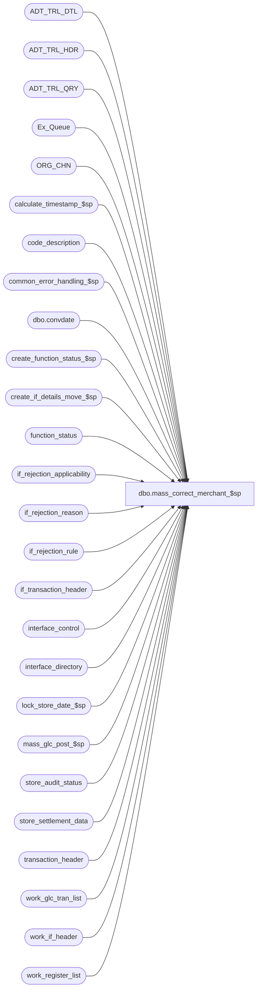

# dbo.mass_correct_merchant_$sp

**Database:** auditworks  
**Server:** bedrockdb01  

## Architecture Diagram



## Table Dependencies

| Referenced Table |
|---|
| ADT_TRL_DTL |
| ADT_TRL_HDR |
| ADT_TRL_QRY |
| Ex_Queue |
| ORG_CHN |
| calculate_timestamp_$sp |
| code_description |
| common_error_handling_$sp |
| dbo.convdate |
| create_function_status_$sp |
| create_if_details_move_$sp |
| function_status |
| if_rejection_applicability |
| if_rejection_reason |
| if_rejection_rule |
| if_transaction_header |
| interface_control |
| interface_directory |
| lock_store_date_$sp |
| mass_glc_post_$sp |
| store_audit_status |
| store_settlement_data |
| transaction_header |
| work_glc_tran_list |
| work_if_header |
| work_register_list |

## Stored Procedure Code

```sql
create proc dbo.mass_correct_merchant_$sp 
(@process_id               binary(16),
 @user_id                  int
)

AS

/*
Proc Name : mass_correct_merchant_$sp
Desc :  Re-evaluates type 112 (Invalid Merchant ID) interface rejections. 
	For each store, if the merchant_id is now on file for every applicable (live) settlement interface, then the store
	is now considered valid and the reject reason 112 can be removed for all transactions for that store. If there are
	no other i/f reject reasons for those settlement interfaces, then transactions will be fed to those interfaces.
	Note: the i/f reject 112 will not be removed until all settlement interfaces are correctly configured for that store.
	Called by mass_auto_revalidate_$sp.

HISTORY:
Date     Name        Def#    Action
Nov14,14 Vicci     TFS-92326 Take into account the fact that the value of the output parameter of a proc called with a TRY/CATCH is not returned 
                             to the calling proc when a raise-error occurs, when calling lock_store_date_$sp.  Do not report individual 201571 errors
                             since individual pre-verified 201550 errors have already been reported by the lock_store_date_$sp proc.
Jan18,12 Vicci        132439 Remove references to CRDM user-defined string datatypes from S/A since CRDM is not changing them to support unicode.
Jan21,11 Vicci        124247 Correct error handling following call to lock_store_date_$sp to recognize the fact that it
                             is normal to receive an @@error of 266 along with a return code of 201550 given the common
                             error handling rollback with will already have occurred and the proc is being called within
                             a begin tran.
Nov09,05 Paul        DV-1321 corrected bugs, don't log audit trail unless there is work to do, added nolock hints
Jul05,05 Paul        DV-1239 remove unused variables
Apr22,05 Sab         DV-1254 new
*/

DECLARE @all_rejects_fixed	tinyint,
	@all_selected_descr     nvarchar(255),
	@all_selected_flag      tinyint,
	@cursor_open		tinyint,
	@edit_timestamp		float,
	@ENTRY_ID               binary(16),
	@errmsg			nvarchar(255),
	@errno			int,
	@function_no		tinyint,
	@glc_rows		int,
        @if_reject_descr        nvarchar(255),
	@message_id		int,
	@object_name		nvarchar(255),
	@operation_name		nvarchar(100),
        @ORG_CHN_NAME           nvarchar(50),
	@post_audit_fixed	tinyint,
	@process_name		nvarchar(100),
	@ret			int,
	@rows			int,
	@sep			nchar(1),
	@store_no		int,
	@transaction_date	smalldatetime,
	@some_skipped           int

SELECT 	@function_no = 96,
	@cursor_open = 0,
	@process_name = 'mass_correct_merchant_$sp',
	@message_id = 201068,
	@sep = NCHAR(12), -- audit trail seperator
	@all_selected_flag = 1,  --all transactions
	@some_skipped = 0


CREATE TABLE #settle_tran_list (
	if_reject_reason		smallint not null,
	transaction_id			numeric(14,0) not null,
	store_no			int not null,
	transaction_date		smalldatetime not null,
	register_no			smallint not null,
	date_reject_id			tinyint null,
	transaction_no			int null,
	transaction_series		nchar(1) null,
	entry_date_time			datetime null,
	till_no                         smallint null)

SELECT @errno = @@error
IF @errno != 0
 BEGIN
   SELECT @errmsg = 'Failed to create temp table #settle_tran_list',
	  @object_name = '#settle_tran_list',
	  @operation_name = 'CREATE TABLE'
   GOTO error
 END

/* fill temp table with type 112 rejected transactions. */

INSERT #settle_tran_list (
	if_reject_reason,
	transaction_id,
	store_no,
	transaction_date,
	register_no,
	date_reject_id,
	transaction_no,
	transaction_series,
	entry_date_time,
	till_no)
SELECT  ir.if_reject_reason,
	ir.transaction_id,
	h.store_no,
	h.transaction_date,
	h.register_no,
	h.date_reject_id,
	h.transaction_no,
	h.transaction_series,
	h.entry_date_time,
	h.till_no
  FROM if_rejection_reason ir, transaction_header h WITH (NOLOCK)
 WHERE ir.if_reject_reason = 112
   AND ir.transaction_id = h.transaction_id

SELECT @errno = @@error, @rows = @@rowcount
IF @errno != 0
  BEGIN
   SELECT @errmsg = 'Failed to insert type 112 rejection lines into #settle_tran_list',
	  @object_name = '#settle_tran_list',
	  @operation_name = 'INSERT'
   GOTO error
  END

IF @rows > 0
BEGIN -- exclude any transactions that still have an invalid merchant id for any live settlement interface

  DELETE #settle_tran_list
    FROM #settle_tran_list sv, store_settlement_data sd WITH (NOLOCK), interface_control ic WITH (NOLOCK)
   WHERE sv.transaction_id = ic.transaction_id
     AND sv.store_no = sd.store_no
     AND ic.interface_id = sd.interface_id
     AND sd.store_live_flag > 0 -- live for settlement
     AND sd.store_merchant_id = '0' -- invalid merchant id
     AND (sv.transaction_date >= sd.store_live_date OR sd.store_live_date IS NULL)

  SELECT @errno = @@error
  IF @errno != 0
    BEGIN
     SELECT @errmsg = 'Failed to delete from #settle_tran_list',
	  @object_name = '#settle_tran_list',
	  @operation_name = 'DELETE'
     GOTO error
    END

  SELECT @rows = COUNT(*)
    FROM #settle_tran_list

END -- If @rows > 0

IF @rows = 0
 BEGIN
   DROP TABLE #settle_tran_list
   RETURN
 END


/* The remaining transactions in #settle_tran_list will be revalidated */

CREATE TABLE #tran_interface_list (
	if_reject_reason		smallint not null,
	transaction_id			numeric(14,0) not null,
	store_no			int null,
	transaction_date		smalldatetime null,
	register_no			smallint null,
	date_reject_id			tinyint null,
	transaction_no			int null,
	transaction_series		nchar(1) null,
	entry_date_time			datetime null,
	interface_id			tinyint null,
	interface_status_flag		smallint null,
	all_rejects_fixed		tinyint null)

SELECT @errno = @@error
IF @errno != 0
  BEGIN
   SELECT @errmsg = 'Failed to create temp table #tran_interface_list',
	  @object_name = '#tran_interface_list',
	  @operation_name = 'CREATE TABLE'
   GOTO error
  END

EXEC calculate_timestamp_$sp @edit_timestamp OUTPUT

SELECT @errno = @@error
IF @errno != 0
  BEGIN
    SELECT @errmsg = 'Failed to execute stored procedure calculate_timestamp_$sp',
	   @object_name = 'calculate_timestamp_$sp',
	   @operation_name = 'EXEC'
    GOTO error
  END

SELECT @ENTRY_ID = newid()

SELECT @if_reject_descr = if_rejection_description
  FROM if_rejection_rule
 WHERE if_rejection_reason = 112

SELECT @all_selected_descr = code_display_descr
  FROM code_description
 WHERE code_type = 203
   AND code = @all_selected_flag

SELECT @errno = @@error
IF @errno != 0
  BEGIN
   SELECT @errmsg = 'Failed to select the description for code_type = 203',
	  @object_name = 'code_description',
	  @operation_name = 'SELECT'
   GOTO error
  END

INSERT INTO ADT_TRL_HDR(
	ENTRY_ID,
	ENTRY_DATE_TIME,
	USER_ID,
	APP_ID,
	ROOT_TBL_NAME,
	ROOT_TBL_KEY,
	ROOT_TBL_KEY_RSRC_NAME,
	ROOT_TBL_KEY_RSRC_PRMS,
	FNCTN_NUM)
VALUES (@ENTRY_ID,
	getdate(),
	@user_id,
	300,
	'TRANSACTION',
	'112' +@sep+ CONVERT(nvarchar, @all_selected_flag),
	'TK_IF_REJE_REAS_ALL_SELE_FLAG',
	@if_reject_descr +@sep+@all_selected_descr,
	@function_no)

SELECT @errno = @@error
IF @errno != 0
  BEGIN
   SELECT @errmsg = 'Failed to insert into ADT_TRL_HDR',
	  @object_name = 'ADT_TRL_HDR',
	  @operation_name = 'INSERT'
   GOTO error
  END

/* re-evaluate if_rejections for one store-date at a time */
DECLARE mass_correct_crsr CURSOR FAST_FORWARD
FOR
SELECT DISTINCT
	store_no,
	transaction_date
FROM #settle_tran_list WITH (NOLOCK)
ORDER BY transaction_date, store_no

OPEN mass_correct_crsr

SELECT @errno = @@error
IF @errno != 0
  BEGIN
   SELECT @errmsg = 'Failed to open cursor mass_correct_crsr',
	  @object_name = 'mass_correct_crsr',
	  @operation_name = 'OPEN CURSOR'
   GOTO error
  END

SELECT @cursor_open = 1

WHILE 1=1
BEGIN

FETCH mass_correct_crsr INTO
	@store_no,
	@transaction_date

IF @@fetch_status <> 0
  BREAK

DELETE work_glc_tran_list
 WHERE process_id = @process_id

SELECT @errno = @@error
IF @errno != 0
  BEGIN
   SELECT @errmsg = 'Failed to delete work_glc_tran_list',
	  @object_name = 'work_glc_tran_list',
	  @operation_name = 'DELETE'
   GOTO error
  END

DELETE work_register_list
  WHERE process_id = @process_id

SELECT @errno = @@error
IF @errno != 0
BEGIN
   SELECT @errmsg = 'Failed to delete work_register_list',
	  @object_name = 'work_register_list',
	  @operation_name = 'DELETE'
   GOTO error
  END

DELETE work_if_header
 WHERE process_id = @process_id

SELECT @errno = @@error
IF @errno != 0
  BEGIN
   SELECT @errmsg = 'Failed to delete rows from table work_if_header',
	  @object_name = 'work_if_header',
	  @operation_name = 'DELETE'
   GOTO error
  END

TRUNCATE TABLE #tran_interface_list
SELECT @errno = @@error
IF @errno != 0
  BEGIN
   SELECT @errmsg = 'Failed to truncate table #settle_tran_list',
	  @object_name = '#settle_tran_list',
	  @operation_name = 'DELETE'
   GOTO error
  END

/* Lock store-date */

BEGIN TRAN
  SELECT @ret = NULL;
  BEGIN TRY 
    EXEC lock_store_date_$sp @process_id, @user_id, @store_no, @transaction_date, 0, @function_no, @ret OUTPUT;
  END TRY
  BEGIN CATCH
  SELECT @errno = ERROR_NUMBER();
  IF @ret IS NULL OR @ret = 0
    SELECT @ret = @errno;
  END CATCH;          
  IF @errno != 0 AND @ret <> 201550 AND @errno <> 201550
  BEGIN
    SELECT @errmsg = 'Failed to execute lock_store_date_$sp',
           @object_name = 'lock_store_date_$sp',
           @operation_name = 'EXEC'
    GOTO error
  END

IF @ret = 0
  BEGIN
   EXEC create_function_status_$sp @process_id, @user_id, @function_no, 0,
	@errmsg OUTPUT, @store_no, @transaction_date, 0
   SELECT @errno = @@error
   IF @errno != 0
     BEGIN
      IF @errmsg IS NULL /* then */
	SELECT @errmsg = 'Failed to execute stored proc create_function_status_$sp'
      SELECT @object_name = 'create_function_status_$sp',
	     @operation_name = 'EXEC'
      GOTO error
     END
   COMMIT TRANSACTION
  END
 ELSE /* unable to lock, skip all transactions for store-date */
  BEGIN
   SELECT @some_skipped = 1

   IF @@trancount > 0
     COMMIT TRANSACTION
     
   CONTINUE
  END

SELECT @ORG_CHN_NAME = ORG_CHN_NAME
  FROM ORG_CHN
 WHERE ORG_CHN_NUM = @store_no

SELECT @errno = @@error
IF @errno != 0
  BEGIN
   SELECT @errmsg = 'Failed to select ORG_CHN name.',
	  @object_name = 'ORG_CHN',
	  @operation_name = 'SELECT'
   GOTO error
  END

-- get a list of affected transactions and interfaces for those I/F rejects using applicability_method IN (0,1)
INSERT #tran_interface_list (
	if_reject_reason,
	transaction_id,
	interface_id,
	store_no,
	transaction_date,
	register_no,
	date_reject_id,
	transaction_no,
	transaction_series,
	entry_date_time,
	interface_status_flag,
	all_rejects_fixed)
SELECT	t.if_reject_reason,
	t.transaction_id,
	ic.interface_id,
	t.store_no,
	t.transaction_date,
	t.register_no,
	t.date_reject_id,
	t.transaction_no,
	t.transaction_series,
	t.entry_date_time,
	id.update_timing, -- interface_status_flag
	1
   FROM #settle_tran_list t, interface_control ic WITH (NOLOCK),
	 interface_directory id WITH (NOLOCK), if_rejection_applicability ia WITH (NOLOCK)
  WHERE t.store_no = @store_no
    AND t.transaction_date = @transaction_date
    AND t.transaction_id = ic.transaction_id
    AND ic.interface_status_flag = 99
    AND ic.interface_id = ia.interface_id
    AND ia.if_reject_reason = 112
    AND ic.interface_id = id.interface_id
    AND id.update_timing >= 1
    AND id.applicability_method < 2

SELECT @errno = @@error
IF @errno != 0
  BEGIN
   SELECT @errmsg = 'Unable to insert #tran_interface_list',
	  @object_name = '#tran_interface_list',
	  @operation_name = 'INSERT'
GOTO error
 END

/* check for any other i/f rejects that affect the same transactions and interfaces */

UPDATE #tran_interface_list
  SET all_rejects_fixed = 0
  FROM #tran_interface_list ti, if_rejection_reason ir WITH (NOLOCK), if_rejection_applicability ia WITH (NOLOCK)
 WHERE ti.transaction_id = ir.transaction_id
   AND ir.if_reject_reason != 112
   AND ir.if_reject_reason = ia.if_reject_reason
   AND ti.interface_id = ia.interface_id

SELECT @errno = @@error
IF @errno != 0
  BEGIN
   SELECT @errmsg = 'Unable to update #tran_interface_list',
	  @object_name = '#tran_interface_list',
	  @operation_name = 'UPDATE'
   GOTO error
  END

/* save list of store-reg-dates affected */   -- OK  trans has at least one reject fixed
INSERT work_register_list (
	process_id,
	store_no,
	transaction_date,
	date_reject_id,
	register_no,
	function_no )
SELECT DISTINCT
	@process_id,
	store_no,
	transaction_date,
	0,
	register_no,
	@function_no
  FROM #tran_interface_list

SELECT @errno = @@error
IF @errno != 0
  BEGIN
   SELECT @errmsg = 'Failed to insert work_register_list',
	  @object_name = 'work_register_list',
	  @operation_name = 'INSERT'
   GOTO error
  END

/* get list of corrected tran which apply to glc */
INSERT work_glc_tran_list (
	process_id,
	transaction_id )
SELECT DISTINCT @process_id, transaction_id
  FROM #tran_interface_list
 WHERE interface_id IN (7,8,9,10,11,25,28)

SELECT @glc_rows = @@rowcount, @errno = @@error
IF @errno != 0
 BEGIN
   SELECT @errmsg = 'Failed to insert work_glc_tran_list',
	  @object_name = 'work_glc_tran_list',
	  @operation_name = 'INSERT'
   GOTO error
 END

UPDATE function_status
   SET status = 2
 WHERE user_id = @user_id
   AND process_id = @process_id
   AND function_no = @function_no

SELECT @errno = @@error
IF @errno != 0
  BEGIN
   SELECT @errmsg = 'Failed to update function_status (status=2)',
	  @object_name = 'function_status',
	  @operation_name = 'UPDATE'
   GOTO error
  END

INSERT work_if_header (
	process_id,
	transaction_id,
	effective_date,
	entry_date_time)
SELECT DISTINCT @process_id,
	transaction_id,
	transaction_date,
	entry_date_time
  FROM #tran_interface_list
 WHERE all_rejects_fixed = 1
   AND interface_status_flag = 1

SELECT @errno = @@error, @all_rejects_fixed = @@rowcount
IF @errno != 0
  BEGIN
   SELECT @errmsg = 'Failed to insert work_if_header',
	  @object_name = 'work_if_header',
	  @operation_name = 'INSERT'
   GOTO error
  END

BEGIN TRANSACTION

INSERT if_transaction_header (
	store_no,
	register_no,
	transaction_date,
	date_reject_id,
	transaction_series,
	transaction_no,
	entry_date_time,
	cashier_no,
	transaction_category,
	tender_total,
	transaction_void_flag,
	customer_info_exists,
	exception_flag,
	deposit_declaration_flag,
	closeout_flag,
	media_count_flag,
	customer_modified_flag,
	tax_override_flag,
	pos_tax_jurisdiction,
	edit_timestamp,
	employee_no,
	transaction_remark,
	source_process_no,
	last_modified_date_time,
	in_use_timestamp,
	updated_by_user_id,
	transaction_id,
	till_no )
SELECT	store_no,
	register_no,
	transaction_date,
	date_reject_id,
	transaction_series,
	transaction_no,
	th.entry_date_time,
	cashier_no,
	transaction_category,
	tender_total,
	transaction_void_flag,
	customer_info_exists,
	exception_flag,
	deposit_declaration_flag,
	closeout_flag,
	media_count_flag,
	customer_modified_flag,
	tax_override_flag,
	pos_tax_jurisdiction,
	@edit_timestamp,
	employee_no,
	transaction_remark,
	@function_no,
	last_modified_date_time,
	in_use_timestamp,
	updated_by_user_id,
	th.transaction_id,
	th.till_no
   FROM work_if_header wh WITH (NOLOCK), transaction_header th WITH (NOLOCK)
  WHERE process_id = @process_id
    AND wh.transaction_id = th.transaction_id

SELECT @errno = @@error
IF @errno != 0
  BEGIN
   SELECT @errmsg = 'Failed to insert if_transaction_header',
	  @object_name = 'if_transaction_header',
	  @operation_name = 'INSERT'
 GOTO error
  END

UPDATE work_if_header
   SET if_entry_no = ih.if_entry_no
  FROM work_if_header wh, transaction_header th WITH (NOLOCK), if_transaction_header ih WITH (NOLOCK)
 WHERE wh.process_id = @process_id
   AND wh.transaction_id = th.transaction_id
   AND ih.store_no = th.store_no
   AND ih.transaction_date = th.transaction_date
   AND ih.entry_date_time = th.entry_date_time
   AND ih.register_no = th.register_no
   AND ih.transaction_no = th.transaction_no
   AND ih.transaction_series = th.transaction_series
   AND ih.edit_timestamp = @edit_timestamp

SELECT @errno = @@error
IF @errno != 0
  BEGIN
   SELECT @errmsg = 'Failed to update work_if_header',
	  @object_name = 'work_if_header',
	  @operation_name = 'UPDATE'
   GOTO error
  END

COMMIT TRANSACTION

/* Call sub-procedure to create entries in the if detail tables */

EXEC create_if_details_move_$sp @process_id, @user_id, 1, @errmsg OUTPUT

SELECT @errno = @@error
IF @errno != 0
  BEGIN
   SELECT @errmsg = 'Failed to execute stored procedure create_if_details_move_$sp',
	  @object_name = 'create_if_details_move_$sp',
	  @operation_name = 'EXEC'
   GOTO error
  END

BEGIN TRANSACTION

  UPDATE interface_control
     SET interface_status_flag = tr.interface_status_flag
    FROM #tran_interface_list tr, interface_control ic
   WHERE tr.all_rejects_fixed = 1
     AND tr.transaction_id = ic.transaction_id
     AND tr.interface_id = ic.interface_id

  SELECT @errno = @@error
  IF @errno != 0
    BEGIN
     SELECT @errmsg = 'Failed to update interface_control',
	    @object_name = 'interface_control',
	    @operation_name = 'UPDATE'
     GOTO error
    END

  INSERT Ex_Queue (
	 queue_id, -- interface_id
	 key_1, -- if_entry_no
	 key_2, -- interface_control_flag
	 key_9, -- effective_date
	 key_10, -- interface_posting_date
	 key_11) -- entry_date_time
  SELECT DISTINCT tr.interface_id,
	 wh.if_entry_no,
	 10,
	  tr.transaction_date,
	 getdate(),
	 wh.entry_date_time
    FROM #tran_interface_list tr, work_if_header wh WITH (NOLOCK)
   WHERE tr.all_rejects_fixed = 1
     AND tr.transaction_id = wh.transaction_id
     AND wh.process_id = @process_id
     AND tr.interface_status_flag = 1

  SELECT @errno = @@error
  IF @errno != 0
   BEGIN
     SELECT @errmsg = 'Failed to insert Ex_Queue',
	    @object_name = 'Ex_Queue',
	    @operation_name = 'INSERT'
     GOTO error
    END

-- Log to audit trail

INSERT INTO ADT_TRL_DTL(
	ENTRY_ID,
	TBL_NAME,
	TBL_KEY,
	TBL_KEY_RSRC_NAME,
	TBL_KEY_RSRC_PRMS,
	ACTN_CODE,
	CLMN_NAME,
	OLD_VAL)
 SELECT DISTINCT
	@ENTRY_ID,
	'IF_REJECTION_REASON',
	CONVERT(nvarchar, if_reject_reason)
	+@sep+ CONVERT(nvarchar, transaction_id)
	+@sep+ '0',
	'TK_IF_REJE_REAS_STOR_TRAN_DATE_REGI_DATE_REJE_ID_TRAN_NO_TRAN_SERI_ENTR_DATE_TIME_LINE_ID',
	@if_reject_descr
	+@sep+ CONVERT(nvarchar, store_no)+ '-' + @ORG_CHN_NAME
	+@sep+ dbo.convdate(transaction_date)
	+@sep+ CONVERT(nvarchar, register_no)
	+@sep+ CONVERT(nvarchar, date_reject_id)
	+@sep+ CONVERT(nvarchar, transaction_no)
	+@sep+ CONVERT(nvarchar, transaction_series)
	+@sep+ dbo.convdate(entry_date_time)
	+@sep+ '0',
	'D',
	'STORE_NO',
	CONVERT(nvarchar,store_no)
   FROM #settle_tran_list
  WHERE store_no = @store_no
    AND transaction_date = @transaction_date

SELECT @errno = @@error
IF @errno != 0
  BEGIN
   SELECT @errmsg = 'Failed to insert into ADT_TRL_DTL',
	  @object_name = 'ADT_TRL_DTL',
	  @operation_name = 'INSERT'
   GOTO error
  END

INSERT INTO ADT_TRL_QRY(
       ENTRY_ID,
       QRY_KEY_NUM,
       KEY_PART_VAL_1,
       KEY_PART_VAL_2,
       KEY_PART_VAL_3,
       KEY_PART_VAL_4,
       KEY_PART_VAL_5,
       KEY_PART_VAL_6,
       KEY_PART_VAL_7,
       KEY_PART_VAL_8,
       KEY_PART_VAL_9,
       KEY_PART_VAL_10)
SELECT DISTINCT
       @ENTRY_ID,
       301,
       CONVERT(nvarchar,store_no),
     CONVERT(nvarchar,register_no),
       dbo.convdate(transaction_date),
       CONVERT(nvarchar, till_no),
       CONVERT(nvarchar,transaction_no),
      CONVERT(nvarchar,transaction_series),
       NULL,
       CONVERT(nvarchar,transaction_id),
       NULL,
       NULL
  FROM #settle_tran_list
  WHERE store_no = @store_no
    AND transaction_date = @transaction_date

SELECT @errno = @@error
IF @errno != 0
  BEGIN
    SELECT @errmsg = 'Failed to insert into ADT_TRL_QRY',
	   @object_name = 'ADT_TRL_QRY',
	   @operation_name = 'INSERT'
    GOTO error
  END

-- Delete rejections where all merchant_id's are now on file
DELETE if_rejection_reason
  FROM #settle_tran_list tr, if_rejection_reason ir
 WHERE tr.store_no = @store_no
 AND tr.transaction_date = @transaction_date
   AND tr.transaction_id = ir.transaction_id
   AND ir.if_reject_reason = 112

SELECT @errno = @@error
IF @errno != 0
  BEGIN
   SELECT @errmsg = 'Failed to delete if_rejection_reason',
	  @object_name = 'if_rejection_reason',
	  @operation_name = 'DELETE'
   GOTO error
  END

-- Exclude trans that still have other i/f rejects
DELETE #settle_tran_list
  FROM #settle_tran_list tr, if_rejection_reason ir WITH (NOLOCK)
 WHERE tr.store_no = @store_no
   AND tr.transaction_date = @transaction_date
   AND tr.transaction_id = ir.transaction_id

SELECT @errno = @@error
IF @errno != 0
  BEGIN
   SELECT @errmsg = 'Failed to delete #settle_tran_list from if_rejection_reason (2)',
	  @object_name = '#settle_tran_list',
	  @operation_name = 'DELETE'
   GOTO error
  END

--Clean up transaction headers where no more i/f rejections exist
UPDATE transaction_header
  SET if_rejection_flag = 0
  FROM #settle_tran_list tr, transaction_header th
 WHERE tr.store_no = @store_no
   AND tr.transaction_date = @transaction_date
   AND tr.transaction_id = th.transaction_id

SELECT @errno = @@error
IF @errno != 0
 BEGIN
   SELECT @errmsg = 'Failed to update transaction_header',
	  @object_name = 'transaction_header',
	  @operation_name = 'UPDATE'
   GOTO error
 END

UPDATE function_status
   SET status = 3
 WHERE user_id = @user_id
 AND process_id = @process_id
   AND function_no = @function_no

SELECT @errno = @@error
IF @errno != 0
  BEGIN
   SELECT @errmsg = 'Failed to update function_status (status=3)',
	  @object_name = 'function_status',
	  @operation_name = 'UPDATE'
   GOTO error
  END

COMMIT TRANSACTION /* interfaces and tran details */

EXEC mass_glc_post_$sp @function_no, @process_id, @user_id, @glc_rows, @errmsg OUTPUT

SELECT @errno = @@error
IF @errno != 0
  BEGIN
   IF @errmsg IS NULL /* then */
	SELECT @errmsg = 'Failed to execute stored procedure mass_glc_post_$sp'
   SELECT @object_name = 'mass_glc_post_$sp',
	  @operation_name = 'EXEC'
   GOTO error
  END

UPDATE store_audit_status
   SET update_in_progress = 0
 WHERE store_no = @store_no
   AND sales_date = @transaction_date
   AND date_reject_id = 0

SELECT @errno = @@error
IF @errno !=0
  BEGIN
   SELECT @errmsg = 'Failed to unlock (update) store_audit_status',
	  @object_name = 'store_audit_status',
	  @operation_name = 'UPDATE'
   GOTO error
  END

DELETE function_status
 WHERE user_id = @user_id
   AND function_no = @function_no
   AND process_id = @process_id

SELECT @errno = @@error
IF @errno !=0
  BEGIN
   SELECT @errmsg = 'Failed to delete function_status',
	  @object_name = 'function_status',
	  @operation_name = 'DELETE'
   GOTO error
  END
END -- while 1=1

CLOSE mass_correct_crsr
DEALLOCATE mass_correct_crsr

IF @some_skipped = 1
BEGIN
  SELECT @errno = 201571,
	 @errmsg = 'Could not process all data. Some store-dates were in use.',
	 @object_name = 'lock_store_date_$sp',
	 @operation_name = 'EXEC',
	 @message_id = 201571
  EXEC common_error_handling_$sp @function_no, @errno, @errmsg, 3, @message_id, @process_name, @object_name, @operation_name, 
       0, 1, 0, null, 0, null, null, null, null, null, null, 0, @process_id, @user_id
END

DROP TABLE #settle_tran_list
DROP TABLE #tran_interface_list

RETURN

error:
	IF @cursor_open = 1
	 BEGIN
	   CLOSE mass_correct_crsr
	   DEALLOCATE mass_correct_crsr
	 END

	EXEC common_error_handling_$sp @function_no, @errno, @errmsg, 0, @message_id, 
		@process_name, @object_name, @operation_name, 0, 1, 0, null, 0, null, null, null,
		null, null, null, 0, @process_id, @user_id

	RETURN
```

