# dbo.mass_correct_tax_$sp

**Database:** auditworks  
**Server:** bedrockdb01  

## Architecture Diagram

```mermaid
flowchart LR
    SP["dbo.mass_correct_tax_$sp"]
    ADT_TRL_DTL(["ADT_TRL_DTL"]) --> SP
    ADT_TRL_HDR(["ADT_TRL_HDR"]) --> SP
    ADT_TRL_QRY(["ADT_TRL_QRY"]) --> SP
    Ex_Queue(["Ex_Queue"]) --> SP
    ORG_CHN(["ORG_CHN"]) --> SP
    auditworks_system_flag(["auditworks_system_flag"]) --> SP
    calculate_timestamp__sp(["calculate_timestamp_$sp"]) --> SP
    code_description(["code_description"]) --> SP
    common_error_handling__sp(["common_error_handling_$sp"]) --> SP
    dbo_convdate(["dbo.convdate"]) --> SP
    create_function_status__sp(["create_function_status_$sp"]) --> SP
    create_if_details_move__sp(["create_if_details_move_$sp"]) --> SP
    delete_if_details__sp(["delete_if_details_$sp"]) --> SP
    function_status(["function_status"]) --> SP
    if_entry_datatype(["if_entry_datatype"]) --> SP
    if_merchandise_detail(["if_merchandise_detail"]) --> SP
    if_rejection_applicability(["if_rejection_applicability"]) --> SP
    if_rejection_reason(["if_rejection_reason"]) --> SP
    if_rejection_rule(["if_rejection_rule"]) --> SP
    if_tax_detail(["if_tax_detail"]) --> SP
    if_transaction_header(["if_transaction_header"]) --> SP
    interface_applicability(["interface_applicability"]) --> SP
    interface_control(["interface_control"]) --> SP
    interface_directory(["interface_directory"]) --> SP
    interface_reject_move(["interface_reject_move"]) --> SP
    issue_list(["issue_list"]) --> SP
    lock_store_date__sp(["lock_store_date_$sp"]) --> SP
    mass_glc_post__sp(["mass_glc_post_$sp"]) --> SP
    parameter_general(["parameter_general"]) --> SP
    pre_audit_tax__sp(["pre_audit_tax_$sp"]) --> SP
    rebuild_request_detail(["rebuild_request_detail"]) --> SP
    store_audit_status(["store_audit_status"]) --> SP
    tax_detail(["tax_detail"]) --> SP
    tax_exception_transaction(["tax_exception_transaction"]) --> SP
    transaction_header(["transaction_header"]) --> SP
    transaction_line(["transaction_line"]) --> SP
    verify_tax_jurisdiction__sp(["verify_tax_jurisdiction_$sp"]) --> SP
    work_delete_detail(["work_delete_detail"]) --> SP
    work_glc_tran_list(["work_glc_tran_list"]) --> SP
    work_if_header(["work_if_header"]) --> SP
    work_impacted_interfaces(["work_impacted_interfaces"]) --> SP
    work_register_list(["work_register_list"]) --> SP
    work_tax_detail_bkp(["work_tax_detail_bkp"]) --> SP
    work_tax_tran_list(["work_tax_tran_list"]) --> SP
    work_transaction_move(["work_transaction_move"]) --> SP
```



## Table Dependencies

| Referenced Table |
|---|
| ADT_TRL_DTL |
| ADT_TRL_HDR |
| ADT_TRL_QRY |
| Ex_Queue |
| ORG_CHN |
| auditworks_system_flag |
| calculate_timestamp_$sp |
| code_description |
| common_error_handling_$sp |
| dbo.convdate |
| create_function_status_$sp |
| create_if_details_move_$sp |
| delete_if_details_$sp |
| function_status |
| if_entry_datatype |
| if_merchandise_detail |
| if_rejection_applicability |
| if_rejection_reason |
| if_rejection_rule |
| if_tax_detail |
| if_transaction_header |
| interface_applicability |
| interface_control |
| interface_directory |
| interface_reject_move |
| issue_list |
| lock_store_date_$sp |
| mass_glc_post_$sp |
| parameter_general |
| pre_audit_tax_$sp |
| rebuild_request_detail |
| store_audit_status |
| tax_detail |
| tax_exception_transaction |
| transaction_header |
| transaction_line |
| verify_tax_jurisdiction_$sp |
| work_delete_detail |
| work_glc_tran_list |
| work_if_header |
| work_impacted_interfaces |
| work_register_list |
| work_tax_detail_bkp |
| work_tax_tran_list |
| work_transaction_move |

## Stored Procedure Code

```sql
create proc dbo.mass_correct_tax_$sp (@process_id               binary(16),
 @user_id                  int,
 @revalidate_spid          binary(16) = NULL,  --process_id used by the UI to identify which if_rejection_reason rows to revalidate;  NULL = ALL.
 @revalidation_type	   tinyint = 1, --1=Revalidate I/F rejection reasons 7 and 8, 2=Revalidate DayEnd Tax Issues, 3=Revalidate both I/F Rejects and DayEnd Issues, 4=Rebuild tax-detail for store/dates requested, 5=called by mass correct upc
 @function_status	   tinyint = NULL  --must only be passed by function cleanup.  Non-null indicates recovery mode.
)
AS

/*
Proc Name : mass_correct_tax_$sp
Desc : To re-evaluate the following interface rejection types (if revalidation type is 1 or 3):
		 7  --  Invalid Jurisdiction or Remittance
		 8  --  Invalid Jur/Object/Level combination (not in tax_default)

       
       ...as well as tax expected vs collected variances (if revalidation type is 2 or 3).
       
       ...as well as transactions for rebuild-request type 4 store/dates (if revalidation type is 4).
       
       Called by mass_auto_revalidate_$sp and function_cleanup_$sp.
    
NOTE:  interface control is only populated for interfaces that are based on interface applicability 
       or ALL transactions methods:  for the "controlled by program" methods, only interfaces with 
       validations on and that have a reject are posted.

History:
Date     Name           Def# Action
Jan20,16 Vicci    TFS-142941 Handle being called by upc reassignment/revalidation (@revalidation_type = 5)
Jun23,15 Vicci    TFS-127504 When attempt to just log warning and skip store/date that is already locked, use @abort_flag 3 otherwise an error
                             is raised by the common error handling with the result that the proc exits instead of trap-and-skipping, leaving behind
                             any prior locks that were successful.
Aug28,14 Paul      TFS-82836 expand 2 flag variables to avoid overflow error when many rejected transactions exist
Mar06,14 Vicci         61711 Add tax_detail.applied_by_line_id.
Nov07,13 Vicci        147833 Revalidate the first date with tax issues too, not just subsequent ones.
Aug23,12 Vicci        137820 Handle case where more than 1 mass_correct_tax_$sp are run simultenously (by mass revalidate and function cleanup) or
                             the mass_correct_tax_$sp loops around again after doing a recovery pass
                             by limiting retrieval from if_transaction_header to rows just inserted by ensuring timestamp is set AFTER lock and if_entry_no
                             starting point is set.
Jan18,12 Vicci        132439 Remove references to CRDM user-defined string datatypes from S/A since CRDM is not changing them to support unicode.
Jan04,12 Vicci      1-47GP4M Support tax-rebuild-requests issued manually (only applies in Pre-Audit Tax environments) for current transactions not yet dayended. 
Mar31,11 Vicci	       64852 Author

*/

DECLARE @exception_jurisdiction_check tinyint,
	@tax_default_check 	tinyint, 
	@rows_to_revalidate	int,
        @tax_update_timing	smallint,
        @last_modified_date_time datetime,
	@all_rejects_fixed	tinyint,
	@cursor_open		tinyint,
	@edit_timestamp		float,
	@entry_date_time	datetime,
	@errmsg			nvarchar(2000),
	@errmsg2		nvarchar(2000),
	@errno			int,
	@function_no		tinyint,
	@glc_rows		int,
	@message_id		int,
	@ret			int,
	@sep			nchar(1),
	@store_no		int,
	@transaction_date	smalldatetime,
	@operation_name		nvarchar(100),
	@object_name		nvarchar(255),
	@process_name		nvarchar(100),
	@ENTRY_ID               binary(16),
	@all_selected_descr     nvarchar(255),
	@all_selected_flag      tinyint,
        @if_reject_descr        nvarchar(255),
        @ORG_CHN_NAME           nvarchar(50),
        @recovery_outstanding	tinyint,
        @main_pass_outstanding	tinyint,
        @new_reject_count	int,
@corrected_reject_count int,
        @max_prior_if_entry_no	if_entry_datatype,
        @out_flag		int,
        @in_flag		int,
        @cutoff_date		smalldatetime,
        @if_count		int,
        @lock_by_spid		binary(16); 

SELECT 	@function_no = 89,  
	@cursor_open = 0,
	@process_name = 'mass_correct_tax_$sp',
	@message_id = 201068,
	@all_selected_flag = 0, -- selected transactions
	@sep = NCHAR(12), -- audit trail separator,
	@recovery_outstanding = CASE WHEN @function_status IS NULL THEN 0 ELSE 1 END,
	@main_pass_outstanding = 1,
	@operation_name = 'SELECT',
	@lock_by_spid = @process_id; --only used by revalidation type 5

BEGIN TRY

--Determine if Tax Tracking is being updated pre-audit (update_timing 6), since if so the tax_detail table entries will have to be rebuilt.
SELECT @errmsg = 'Failed to read update_timing from interface_directory. ',
       @object_name = 'interface_directory';
SELECT @tax_update_timing = update_timing
  FROM interface_directory
 WHERE interface_id = 12;

IF @tax_update_timing IS NULL 
  SELECT @tax_update_timing = 0;

IF @tax_update_timing NOT IN (0,3,6)
  SELECT @tax_update_timing = 3;

SELECT @errmsg = 'Failed to determine date of first unverified tax issue. ',
       @object_name = 'auditworks_system_flag';
SELECT @cutoff_date = flag_datetime_value 
  FROM auditworks_system_flag
 WHERE flag_name = 'min_tax_issue_date';
 
IF @cutoff_date IS NOT NULL --i.e. tax issues exist
BEGIN
  SELECT @errmsg = 'Failed to determine if last date closed is later than first tax issue date. ',
         @object_name = 'parameter_general';
  SELECT @cutoff_date = dateadd(dd, 1, last_date_closed)
    FROM parameter_general        
   WHERE dateadd(dd, 1, last_date_closed) > @cutoff_date;
END;

WHILE @main_pass_outstanding = 1 OR @recovery_outstanding = 1
BEGIN

SELECT 	@ENTRY_ID = newid(),
	@entry_date_time = getdate();

SELECT @errmsg = 'Failed to create transactions to be revalidated.',
       @object_name = '#rejects_to_reval',
       @operation_name = 'CREATE TABLE';
CREATE TABLE #rejects_to_reval(
       transaction_id numeric(14,0) not null, --tran_id_datatype
       store_no int not null, 
       transaction_date smalldatetime not null, 
       line_id numeric(5,0) not null, 
       if_reject_reason tinyint not null,
       transaction_category tinyint not null,
       register_no smallint not null);

SELECT @errmsg = 'Failed to create table to record impact of revalidation on I/F Rejection Reasons. ',
       @object_name = '#affected_rejects',
       @operation_name = 'CREATE TABLE';
CREATE TABLE #affected_rejects(
       transaction_id numeric(14,0) not null, --tran_id_datatype
       store_no int not null, 
       transaction_date smalldatetime not null, 
       line_id numeric(5,0) not null, 
       if_reject_reason tinyint not null,
       corrected_flag tinyint not null,
       memo1_old nvarchar(255) null, 
       memo2_old nvarchar(255) null, 
       memo3_old nvarchar(255) null,
       memo1_new nvarchar(255) null, 
       memo2_new nvarchar(255) null, 
       memo3_new nvarchar(255) null );

SELECT @errmsg = 'Failed to create table to hold list of transaction lines with tax-details which may have been modified. ',
       @object_name = '#lines_modified',
       @operation_name = 'CREATE TABLE';
CREATE TABLE #lines_modified(
       transaction_id numeric(14,0) not null, --tran_id_datatype
       line_id numeric(5,0) not null, 
       tax_level tinyint not null,
       transaction_category tinyint not null,
       store_no int not null, 
       transaction_date smalldatetime not null);

SELECT @operation_name = 'SELECT';

IF @tax_update_timing <> 6  --if not pre-audit then any dayend issues would require a rebuild not just a revalidate since they are already dayended.
BEGIN
  IF @revalidation_type in (2, 4)  --i.e. invalid calling parameters passed in.
  OR @revalidation_type = 5  --i.e. upc revalidation cannot have had impact on tax detail because it won't be evaludated until dayend.     
    RETURN;
  ELSE
    IF @revalidation_type = 3
      SELECT @revalidation_type = 1;
END;

IF @revalidation_type IN (1, 3)
BEGIN 
  SELECT @errmsg = 'Failed to obtain description of I/F rejection rules being revalidated. ',
  	 @object_name = 'if_rejection_rule';
  SELECT @if_reject_descr = jur.if_rejection_description + ', ' + dflt.if_rejection_description
    FROM if_rejection_rule jur
         INNER JOIN if_rejection_rule dflt
            ON dflt.if_rejection_reason = 8
   WHERE jur.if_rejection_reason = 7;
END;
ELSE
BEGIN
  IF @revalidation_type = 5
  BEGIN 
    SELECT @errmsg = 'Failed to obtain description of I/F rejection rules being revalidated. ',
    	   @object_name = 'if_rejection_rule';
    SELECT @if_reject_descr = tax.code_display_descr + ':  ' +  upc.if_rejection_description + ', ' + posid.if_rejection_description + ', ' + posdept.if_rejection_description
      FROM if_rejection_rule posid
           INNER JOIN if_rejection_rule upc
              ON upc.if_rejection_reason = 1
           INNER JOIN if_rejection_rule posdept
              ON posdept.if_rejection_reason = 88
           INNER JOIN code_description tax
              ON tax.code_type = 23 AND tax.code = 12
     WHERE posid.if_rejection_reason = 87;
  END;
END;  
  
SELECT @object_name = 'code_description';

IF @revalidation_type IN (2, 3)
BEGIN 
  SELECT @errmsg = 'Failed to obtain description of dayend issue being revalidated. ';
  SELECT @if_reject_descr = CASE WHEN @revalidation_type = 3 THEN @if_reject_descr + ', ' + i.code_display_descr ELSE i.code_display_descr END  + ' (' + x.code_display_descr + ')'
    FROM code_description i		--tax
         INNER JOIN code_description x	--exception
            ON x.code_type = 216
           AND x.code = 66
   WHERE i.code_type = 209
     AND i.code = 1;
END;

IF @revalidation_type = 4
BEGIN 
  SELECT @errmsg = 'Failed to obtain description of tax rebuild request being executed. ';
  SELECT @if_reject_descr = i.code_display_descr + ' (' + x.code_display_descr + ')'
    FROM code_description i		--Rebuild type
         INNER JOIN code_description x	--Current Transaction Tax
            ON x.code_type = 210
           AND x.code = 4
   WHERE i.code_type = 0
     AND i.code = 210;
END;

IF @revalidate_spid IS NULL
  SELECT @all_selected_flag = 1  --all transactions

SELECT @errmsg = 'Failed to select the description for code_type = 203. ';
SELECT @all_selected_descr = code_display_descr
  FROM code_description
 WHERE code_type = 203
   AND code = @all_selected_flag;


IF @function_status IS NOT NULL  --recovery mode
BEGIN
  SELECT @errmsg = 'Failed to store/date being processed by mass_correct_tax function at time of failure. ',
  	 @object_name = 'function_status';
  SELECT @store_no = store_no,
         @transaction_date = transaction_date,
         @ENTRY_ID = ENTRY_ID,
         @max_prior_if_entry_no = transaction_id,  --only applies when status is 4
         @revalidation_type = move_flag
    FROM function_status
   WHERE process_id = @process_id
     AND function_no = @function_no;
  
  IF @function_status = 1  
  BEGIN
    SELECT @errmsg = 'Failed to unlock (update) store_audit_status. ',
    	   @object_name = 'store_audit_status',
	   @operation_name = 'UPDATE';
    UPDATE store_audit_status
       SET update_in_progress = 0
     WHERE store_no = @store_no
       AND sales_date = @transaction_date
       AND date_reject_id = 0
       AND process_id = @process_id 
       AND update_in_progress = @function_no;
    
    SELECT @function_status = 0;
  END;  --IF @function_status = 1 
  
  IF @function_status = 0
    GOTO cleanup;

  IF @function_status in (3, 4)
  BEGIN
    SELECT @errmsg = 'Failed to delete work_delete_detail (i/f mass). ',
           @object_name = 'work_delete_detail',
           @operation_name = 'DELETE';
    DELETE work_delete_detail
     WHERE process_id = @process_id;

    SELECT @errmsg = 'Failed to populate work_delete_detail (i/f mass). ',
           @object_name = 'work_delete_detail',
           @operation_name = 'SELECT';
    INSERT work_delete_detail (process_id ,transaction_id)
    SELECT @process_id, if_entry_no
      FROM work_if_header
     WHERE process_id = @process_id;

    SELECT @errmsg = 'Failed to execute delete_if_details_$sp (i/f mass). ',
           @object_name = 'delete_if_details_$sp',
           @operation_name = 'EXECUTE';
    EXEC delete_if_details_$sp @process_id, @user_id;

    SELECT @errmsg = 'Failed to delete work_if_header (i/f mass). ',
           @object_name = 'work_if_header',
           @operation_name = 'DELETE';
    DELETE work_if_header
     WHERE process_id = @process_id
  END;  --IF @function_status in (3, 4)
END;  --recovery mode (IF @function_status IS NOT NULL)
ELSE  --normal mode  
BEGIN
  SELECT @function_status = 0;
  
  IF @revalidation_type = 5
  BEGIN
    SELECT @process_id = newid();  --since mass correct upc calls mass correct tax and they use the same work tables.
  END
  
  BEGIN TRAN

  SELECT @errmsg = 'Failed to execute stored proc create_function_status_$sp. ',
         @object_name = 'create_function_status_$sp',
         @operation_name = 'EXECUTE';
  EXEC create_function_status_$sp @process_id, @user_id, @function_no, 
       NULL, --transaction_id
       @errmsg OUTPUT, 
       0, null, 0, 0, --store_no, transaction_date, date_reject_id, register_no
       @function_status;
  
  SELECT @errmsg = 'Failed to record audit trail entry-id in function status. ',
         @object_name = 'function_status',
	 @operation_name = 'UPDATE';
  UPDATE function_status
     SET ENTRY_ID = @ENTRY_ID,
         move_flag = @revalidation_type,
         lock_by_spid = CASE WHEN @revalidation_type = 5 THEN @lock_by_spid ELSE NULL END
   WHERE process_id = @process_id
     AND function_no = @function_no;

  SELECT @errmsg = 'Failed to insert mass revalidation of Tax I/F Reject execution into ADT_TRL_HDR. ',
         @object_name = 'ADT_TRL_HDR',
	 @operation_name = 'INSERT';
  INSERT INTO ADT_TRL_HDR(
         ENTRY_ID,
         ENTRY_DATE_TIME,
         USER_ID,
         APP_ID,
         ROOT_TBL_NAME,
         ROOT_TBL_KEY,
         ROOT_TBL_KEY_RSRC_NAME,
         ROOT_TBL_KEY_RSRC_PRMS,
         FNCTN_NUM)
  VALUES (@ENTRY_ID,
          getdate(),
          @user_id,
          300,
          'TRANSACTION',
          CASE @revalidation_type WHEN 1 THEN '7, 8' 
                                  WHEN 3 THEN '7, 8, 0'
                                  WHEN 5 THEN '1, 87, 88'
                                  ELSE '0' 
		END  
          	+ @sep + CONVERT(nvarchar, @all_selected_flag),
          'TK_IF_REJE_REAS_ALL_SELE_FLAG',
          @if_reject_descr + @sep + @all_selected_descr,
          @function_no);

  COMMIT TRANSACTION;

  IF @revalidation_type NOT IN (4, 5)
  BEGIN
    SELECT @errmsg = 'Failed to build a list of transactions to be revalidated. ',
           @object_name = '#rejects_to_reval',
           @operation_name = 'INSERT';
    INSERT #rejects_to_reval(transaction_id, store_no, transaction_date, 
           line_id, if_reject_reason, transaction_category, register_no)
    SELECT ir.transaction_id,
           h.store_no,
           h.transaction_date,
           ir.line_id,
           ir.if_reject_reason,
           h.transaction_category,
           h.register_no 
      FROM if_rejection_reason ir
           INNER JOIN transaction_header h
              ON ir.transaction_id = h.transaction_id 
             AND h.edit_progress_flag = 0			--skip transactions in the midst of trickling in
     WHERE ir.if_reject_reason in (7, 8)
       AND (ir.process_id = @revalidate_spid OR @revalidate_spid IS NULL)
       AND @revalidation_type IN (1, 3)
     UNION 
    SELECT DISTINCT x.av_transaction_id,
           h.store_no,
           h.transaction_date,
           0,  --line_id
           0,  --if_reject_reason
           h.transaction_category,
           h.register_no 
      FROM issue_list i
           INNER JOIN tax_exception_transaction x
              ON i.store_no = x.store_no
             AND i.transaction_date = x.transaction_date
             AND x.discrepancy_flag = 1
           INNER JOIN transaction_header h
              ON x.av_transaction_id = h.transaction_id 
             AND h.edit_progress_flag = 0			--skip transactions in the midst of trickling in
     WHERE i.transaction_date >= @cutoff_date
       AND i.verified = 0
       AND i.issue_type = 1 
       AND @revalidation_type IN (2, 3);
    SELECT @rows_to_revalidate = @@rowcount;
  END;
  ELSE  --ELSE of IF @revalidation_type not in (4, 5)
  BEGIN 
    IF @revalidation_type = 5
    BEGIN
      SELECT @errmsg = 'Failed to build a list of upc revalidation transactions to be revalidated. ',
             @object_name = '#rejects_to_reval',
             @operation_name = 'INSERT';
      INSERT #rejects_to_reval(transaction_id, store_no, transaction_date, 
             line_id, if_reject_reason, transaction_category, register_no)
      SELECT ir.transaction_id,
             h.store_no,
             h.transaction_date,
             ir.line_id,		--WIPWIPWIP maybe this and the if_reject_reason should just be set to 0????
             ir.if_reject_reason,
             h.transaction_category,
             h.register_no 
        FROM work_tax_tran_list ir  --Populated/cleaned up by mass_correct_upc_$sp with the mass correct upc process id.  Already excludes transactions in the midst of trickling in
             INNER JOIN transaction_header h
                ON ir.transaction_id = h.transaction_id 
       WHERE ir.process_id = @lock_by_spid --i.e. process_id of mass_correct_upc_$sp that populated it.
      SELECT @rows_to_revalidate = @@rowcount;
    END
    ELSE --ELSE of IF @revalidation_type = 5 within ELSE of IF @revalidation_type not in (4, 5)
    BEGIN
      SELECT @errmsg = 'Failed to reject rebuild requests fr current transaction tax-detail for which no current transactions exist. ', 
             @object_name = 'rebuild_request_detail',
             @operation_name = 'UPDATE'; 
      UPDATE rebuild_request_detail
         SET request_status = 30  --request rejected
       WHERE rebuild_type = 4     --current transaction tax-detail
         AND request_status < 20  --not yet executed
         AND NOT EXISTS (SELECT 1 
                           FROM transaction_header h
                          WHERE h.store_no = rebuild_request_detail.store_no
                            AND h.transaction_date = rebuild_request_detail.transaction_date 
                            AND h.date_reject_id = 0);
       
      SELECT @errmsg = 'Failed to build a list of transactions to be rebuilt for tax purposes. ', 
             @object_name = '#rejects_to_reval',
             @operation_name = 'INSERT'; 
      INSERT #rejects_to_reval(transaction_id, store_no, transaction_date, 
             line_id, if_reject_reason, transaction_category, register_no)
      SELECT DISTINCT h.transaction_id, 
             h.store_no,
             h.transaction_date,
             0,  --line_id
             0,  --if_reject_reason
             h.transaction_category,
             h.register_no 
        FROM rebuild_request_detail rd
             INNER JOIN transaction_header h
                ON h.store_no = rd.store_no
               AND h.transaction_date = rd.transaction_date
               AND h.date_reject_id = 0
               AND h.transaction_void_flag in (0,8)
               AND h.sa_rejection_flag = 0
               AND h.edit_progress_flag = 0			--skip transactions in the midst of trickling in
       WHERE rd.rebuild_type = 4  --current transaction tax
AND rd.request_status = 10
         AND @revalidation_type = 4;
      SELECT @rows_to_revalidate = @@rowcount;
    END;  ----ELSE of IF @revalidation_type = 5 within ELSE of IF @revalidation_type not in (4, 5)
  END  --ELSE of IF @revalidation_type not in (4, 5)
  
  IF @rows_to_revalidate < 1  
    GOTO cleanup;

END;  --normal mode (ELSE of IF @function_status IS NOT NULL)

SELECT @operation_name = 'DELETE';

IF @function_status < 2 
BEGIN
  SELECT @errmsg = 'Unable to clean up list of transactions re-evaluated, since it will be re-populated one store/date at a time from #corrected_rejects. ',
         @object_name = 'work_transaction_move';
  DELETE work_transaction_move
   WHERE process_id = @process_id;
  
  SELECT @errmsg = 'Failed to delete interface_reject_move in preparation for next store/date. ',
         @object_name = 'interface_reject_move'; 
  DELETE interface_reject_move
   WHERE process_id = @process_id;

  SELECT @errmsg = 'Failed to delete tax_detail backup in preparation for next store/date. ',
         @object_name = 'work_tax_detail_bkp';
  DELETE work_tax_detail_bkp
   WHERE process_id = @process_id;
END; --IF @function_status < 2

IF @function_status < 3
BEGIN
  SELECT @errmsg = 'Failed to cleanup up interfaces impacted by the revalidated in preparation for next store/date. ',
         @object_name = 'work_impacted_interfaces';
  DELETE work_impacted_interfaces
   WHERE process_id = @process_id;
END;  --IF @function_status < 3 

IF @function_status < 4
BEGIN
  SELECT @errmsg = 'Failed to delete work_if_header. ',
   	 @object_name = 'work_if_header';
  DELETE work_if_header  
   WHERE process_id = @process_id;
END;  --IF @function_status < 4

IF @function_status < 7
BEGIN
  SELECT @errmsg = 'Failed to delete work_glc_tran_list. ',
  	 @object_name = 'work_glc_tran_list';
  DELETE work_glc_tran_list
   WHERE process_id = @process_id;

  SELECT @errmsg = 'Failed to delete work_register_list. ',
  	 @object_name = 'work_register_list';
  DELETE work_register_list
   WHERE process_id = @process_id
END;

SELECT @errmsg = 'Unable to determine if Invalid Tax Jur or Tax Jur Remittance check is active. ',
       @object_name = 'if_rejection_rule',
       @operation_name ='SELECT'; 
IF EXISTS (SELECT 1
             FROM if_rejection_rule ir
            WHERE ir.if_rejection_reason  = 7
              AND COALESCE(ir.active_rejection_rule,1) = 1
              AND EXISTS (SELECT 1 FROM if_rejection_applicability ia, interface_directory id
		           WHERE ir.if_rejection_reason = ia.if_reject_reason
		             AND ia.interface_id = id.interface_id
			     AND id.update_timing > 0))
  SELECT @exception_jurisdiction_check = 1;
ELSE
  SELECT @exception_jurisdiction_check = 0;

SELECT @errmsg = 'Unable to determine if Jur/Obj/Level not in Tax Default check is active. ',
     @object_name = 'if_rejection_rule',
       @operation_name ='SELECT'; 
IF EXISTS (SELECT 1
             FROM if_rejection_rule ir
            WHERE ir.if_rejection_reason  = 8
              AND COALESCE(ir.active_rejection_rule,1) = 1
              AND EXISTS (SELECT 1 FROM if_rejection_applicability ia, interface_directory id
		           WHERE ir.if_rejection_reason = ia.if_reject_reason
		             AND ia.interface_id = id.interface_id
			     AND id.update_timing > 0))
  SELECT @tax_default_check = 1;
ELSE
  SELECT @tax_default_check = 0;
       
-- Re-evaluate if_rejections for one store-date at a time 
SELECT @errmsg = 'Failed to define cursor to mass-correct one store/date at a time. ',
       @object_name = 'mass_correct_crsr',
       @operation_name ='DECLARE';
DECLARE mass_correct_crsr CURSOR FAST_FORWARD
FOR
SELECT DISTINCT w.store_no store_no, w.transaction_date transaction_date
  FROM #rejects_to_reval w
       INNER JOIN store_audit_status sas
          ON w.store_no = sas.store_no
	 AND w.transaction_date = sas.sales_date
  	 AND sas.date_reject_id = 0
  	 AND sas.store_audit_status <= 300
  	 AND sas.update_in_progress NOT IN (1,4)  --don't revalidate if edit has date locked
UNION
SELECT @store_no store_no, @transaction_date transaction_date --recovery mode
 WHERE @store_no IS NOT NULL
   AND @transaction_date IS NOT NULL
   AND @function_status > 0 
 ORDER BY transaction_date, store_no;

SELECT @operation_name ='OPEN';
OPEN mass_correct_crsr;

SELECT @cursor_open = 1;

SELECT @operation_name ='FETCH';
FETCH mass_correct_crsr INTO
      @store_no,
      @transaction_date;

WHILE @@fetch_status = 0
BEGIN

  SELECT @last_modified_date_time = getdate(),
  	 @if_count = 0;
  
  IF @function_status = 0
  BEGIN
    BEGIN TRAN;
 
    IF @revalidation_type <> 5  --if not called by mass_correct_upc_$sp (which will already have locked the store/date)
    BEGIN  --Lock store-date
      BEGIN TRY   
        SELECT @errmsg = 'Failed to execute lock_store_date_$sp. ',
    	       @object_name = 'lock_store_date_$sp',
  	       @operation_name = 'EXEC'; 
        EXEC lock_store_date_$sp @process_id, @user_id, @store_no, @transaction_date, 0, @function_no, @ret OUTPUT;
      END TRY
      BEGIN CATCH
        SELECT @errno = ERROR_NUMBER();
      
        IF @errno = 201550 OR @ret = 201550
          SELECT @ret = 1;
        ELSE
        BEGIN
          GOTO general_error;
        END;
      END CATCH;
    END
    ELSE --ELSE of IF @revalidation_type <> 5 
    BEGIN
      SELECT @ret = 0;
    END;

    IF @ret = 0
    BEGIN
      SELECT @function_status = 1;
      
      SELECT @errmsg = 'Failed to record start of new store/date in function status. ',
             @object_name = 'function_status',
	     @operation_name = 'UPDATE';
      UPDATE function_status
         SET store_no = @store_no,
             transaction_date = @transaction_date,
             status = @function_status,
             transaction_id = NULL
       WHERE process_id = @process_id
         AND function_no = @function_no ;
    
      COMMIT TRANSACTION;
    END;
    ELSE --unable to lock, skip all transactions for store-date 
    BEGIN
      SELECT @errno = 201571,
  	     @errmsg = 'Store ' + CONVERT(nvarchar,@store_no) + ',Date ' + CONVERT(nvarchar(11),@transaction_date) + ' is currently locked. Please verify.',
	     @object_name = 'lock_store_date_$sp',
    	     @operation_name = 'EXEC',
             @message_id = 201571;
      
      EXEC common_error_handling_$sp @function_no, @errno, @errmsg, 3, @message_id, @process_name, @object_name, @operation_name, 
	                             0, 1, 0, null, 0, null, null, null, null, null, null, 0, @process_id, @user_id;
      IF @@trancount > 0
        COMMIT TRANSACTION;

      SELECT @errno = 0,
             @errmsg = 'Failed to fetch next mass_correct_crsr data. ',
             @object_name = 'mass_correct_crsr',
	     @operation_name = 'FETCH';
      FETCH mass_correct_crsr INTO
            @store_no,
            @transaction_date;

      CONTINUE;  --skip to next store/date in while
    END;
  END; --IF @function_status = 0
 
  --137820:  only get timestamp once store/date locked, otherwise we risk having same timestamp as another function (since locks retries waiting for unlock)
  SELECT @errmsg = 'Failed to execute stored procedure calculate_timestamp_$sp. ',
  	 @object_name = 'calculate_timestamp_$sp',
	 @operation_name = 'EXEC';
  EXEC calculate_timestamp_$sp @edit_timestamp OUTPUT;

  IF @function_status < 3
  BEGIN
    SELECT @errmsg = 'Unable to build list of transactions to be marked as corrected for one store/date at a time. ',
           @object_name = 'work_transaction_move',
           @operation_name ='INSERT';
    INSERT into work_transaction_move(
           process_id,
           transaction_id,
           cashier_no,
           transaction_date,
           store_no,
           transaction_category,
   register_no,
           orig_sa_reject_flag,
           other_store_flag)  --used to mark revalidation_type which cause transaction to be placed on the list
    SELECT @process_id,
           ar.transaction_id,
           0,
           ar.transaction_date,
           ar.store_no,
           ar.transaction_category,
           ar.register_no,
           0,
           CASE WHEN @revalidation_type IN (4, 5) THEN @revalidation_type 
                ELSE CASE WHEN MAX(ar.if_reject_reason) = 0 THEN 2 
                          ELSE 1 END 
                END  --used to mark revalidation_type which caused transaction to be placed on the list
      FROM #rejects_to_reval ar		--note:  in recovery mode wtm is already populated and #rtr is empty
     WHERE ar.store_no = @store_no
       AND ar.transaction_date = @transaction_date
     GROUP BY ar.transaction_id,
           ar.transaction_date,
           ar.store_no,
           ar.transaction_category,
           ar.register_no;
 
    IF @tax_update_timing = 6 AND @function_status = 1 --tax is pre-audit and therefore tax-detail needs re-evaluating
    BEGIN
      BEGIN TRAN;
     
      --make backup of tax_detail so that "out" can be done if necessary using old tax_detail values,
      --and in the case of a tax-discrepancy-issue revalidation so that the Audit Trail can be updated (even if no pre-audit interfaces applied).
      SELECT @errmsg = 'Unable to back up tax_detail before calling pre-audit-tax. ',
             @object_name = 'work_tax_detail_bkp',
             @operation_name ='INSERT';
      INSERT into work_tax_detail_bkp(
             process_id,
             transaction_id,
             line_id,
             tax_level,
             tax_jurisdiction,
             tax_category,
             tax_rate_code,
             taxable_amount,
             tax_amount,
             combined_rate,
             nontaxable_amount,
             tax_amount_expected,
             tax_on_tax_level,
             tax_on_combined_rate,
             line_object_type,
             tax_strip_flag,
             gl_effect,
             max_applied_by_line_id,
             track_tax,
             tax_item_group_id,
             fulfillment_store_no,
             originating_date,
             above_threshold_flag,
             applied_by_line_id)
      SELECT DISTINCT @process_id,
             w.transaction_id,
             t.line_id,
             t.tax_level,
             t.tax_jurisdiction,
             t.tax_category,
             t.tax_rate_code,
             t.taxable_amount,
             t.tax_amount,
             t.combined_rate,
             t.nontaxable_amount,
             t.tax_amount_expected,
             t.tax_on_tax_level,
             t.tax_on_combined_rate,
             t.line_object_type,
             t.tax_strip_flag,
             t.gl_effect,
             t.max_applied_by_line_id,
             t.track_tax,
             t.tax_item_group_id,
             t.fulfillment_store_no,
             t.originating_date,
             t.above_threshold_flag,
             t.applied_by_line_id
        FROM work_transaction_move w 
             INNER JOIN tax_detail t
                ON w.transaction_id = t.transaction_id
       WHERE w.process_id = @process_id
         AND (w.other_store_flag in (2, 4) --revalidation_type
              OR EXISTS (SELECT 1
                           FROM interface_control ic
	                 WHERE w.transaction_id = ic.transaction_id
	       AND ic.interface_status_flag = 1 ));  --pre-audit
    
      --This proc re-evaluates tax-detail and populates interface_reject_move (via sales_tax_populate_$sp call to verify_tax_jurisdiction_$sp) with I/F Rejections of type 7 or 8 which remain an issue.
      SELECT @errmsg = 'Failed to execute stored proc pre_audit_tax_$sp. ',
             @object_name = 'pre_audit_tax_$sp',
             @operation_name ='EXECUTE';    
      EXEC @ret = pre_audit_tax_$sp @process_id, @user_id, @function_no, NULL, @errmsg OUTPUT;
    
      SELECT @function_status = 2;
        
      SELECT @errmsg = 'Failed to set function status to 2. ',
             @object_name = 'function_status',
	     @operation_name = 'UPDATE';
      UPDATE function_status
         SET status = @function_status
       WHERE process_id = @process_id
         AND function_no = @function_no;
    
      COMMIT TRANSACTION;
    END;  --IF @update_timing = 6 AND @function_status = 1
    ELSE
    BEGIN
      IF @tax_update_timing <> 6  --not pre-audit, regardless of status since best to reval when possible
      BEGIN
        --This proc populates interface_reject_move with I/F Rejections of type 7 or 8 which remain an issue.
        SELECT @errmsg = 'Failed to obtain list of which I/F Rejections remain an issue. ',
               @object_name = 'verify_tax_jurisdiction_$sp',
               @operation_name = 'EXECUTE';
        EXEC verify_tax_jurisdiction_$sp @process_id, @user_id, NULL, @exception_jurisdiction_check, @tax_default_check, 
             @function_no,  @errmsg OUTPUT;
      END;  --IF @update_timing <> 6
    END;  --ELSE of IF @update_timing = 6 AND @function_status = 1

    --build list of newly created issues (hopefully none!) or issues with changed descriptive details
    SELECT @errmsg = 'Unable to build list of new or changed rejects. ',
           @object_name = '#affected_rejects',
           @operation_name ='INSERT'; 
    INSERT #affected_rejects(transaction_id, store_no, transaction_date, line_id, if_reject_reason, corrected_flag, memo1_old, memo2_old, memo3_old, memo1_new, memo2_new, memo3_new)
    SELECT w.transaction_id, w.store_no, w.transaction_date, m.line_id, m.if_reject_reason, 0 corrected_flag, r.memo1, r.memo2, r.memo3, m.memo1, m.memo2, m.memo3
      FROM work_transaction_move w
           INNER JOIN interface_reject_move m  --rejects of type 7 or 8 only		
              ON w.process_id = m.process_id
             AND w.transaction_id = m.transaction_id
            LEFT OUTER JOIN if_rejection_reason r
              ON m.transaction_id = r.transaction_id
             AND m.line_id = r.line_id
             AND m.if_reject_reason = r.if_reject_reason
             AND (m.memo1 = r.memo1 OR (m.memo1 IS NULL and r.memo1 IS NULL))
             AND (m.memo2 = r.memo2 OR (m.memo2 IS NULL and r.memo2 IS NULL))
             AND (m.memo3 = r.memo3 OR (m.memo3 IS NULL and r.memo3 IS NULL))
     WHERE w.process_id = @process_id 
       AND r.transaction_id IS NULL;
    SELECT @new_reject_count = @@rowcount;

    --build list of corrected rejects
    SELECT @errmsg = 'Unable to build list of corrected rejects. ',
           @object_name = '#affected_rejects',
           @operation_name ='INSERT'; 
    INSERT #affected_rejects(transaction_id, store_no, transaction_date, line_id, if_reject_reason, corrected_flag, memo1_old, memo2_old, memo3_old)
    SELECT w.transaction_id, w.store_no, w.transaction_date, r.line_id, r.if_reject_reason, 1 corrected_flag, r.memo1, r.memo2, r.memo3
      FROM work_transaction_move w
           INNER JOIN if_rejection_reason r
              ON w.transaction_id = r.transaction_id
             AND r.if_reject_reason in (7, 8)
            LEFT OUTER JOIN interface_reject_move m		
              ON r.transaction_id = m.transaction_id
             AND r.line_id = m.line_id
             AND r.if_reject_reason = m.if_reject_reason
             AND w.process_id = m.process_id
     WHERE w.process_id = @process_id 
       AND m.transaction_id IS NULL; 
    SELECT @corrected_reject_count = @@rowcount;

    --WARNING:  in the case of revalidation type 5 (called by mass_correct_upc_$sp), nothing will be posted by mass_correct_tax_$sp to the I/F tables 
    --          unless Tax I/F reject was also corrected along the way.  
    --          The interface posting is left up to the mass_correct_upc_$sp (which currently i.e. Jan2016 only does 'in' of fixed upc rejects not in/out of changed transactions).
    IF @new_reject_count > 0 OR @corrected_reject_count > 0 OR @revalidation_type in (2, 3) 
    BEGIN
      SELECT @errmsg = 'Remove transactions for which I/F rejections have not changed from list of those requiring further processing. ',
             @object_name = 'work_transaction_move',
             @operation_name ='DELETE';
      DELETE work_transaction_move
       WHERE process_id = @process_id
         AND other_store_flag = 1  --revalidation_type;  leave behind those which were not rejected in the first place and whose tax discrepancy issues were just being revalidated.
         AND transaction_id NOT IN (SELECT transaction_id
                                      FROM #affected_rejects); 
  
      IF @tax_update_timing = 6 AND @function_status = 2
      --find tax details that were changed and any pre-audit interface which subscribed to those lines modifications but not to the tax validation
      BEGIN

        --Find changed lines for transactions which have fed a pre-audit interface or for those whose tax-issues are being revalidated.
        --Note that lines other that those I/F rejected may have had their tax-detail updated as a result of the pre-audit-tax posting
        SELECT @errmsg = 'Failed to build list of transaction lines with tax-details which may have been modified. ',
               @object_name = '#lines_modified',
               @operation_name ='INSERT';
        INSERT INTO #lines_modified(transaction_id, line_id, tax_level, transaction_category, store_no, transaction_date)
        SELECT DISTINCT w.transaction_id, t.line_id, t.tax_level, w.transaction_category, w.store_no, w.transaction_date
          FROM work_transaction_move w
               INNER JOIN work_tax_detail_bkp t
                  ON w.process_id = t.process_id
                 AND w.transaction_id = t.transaction_id
         WHERE w.process_id = @process_id
        UNION
        SELECT DISTINCT w.transaction_id, t.line_id, t.tax_level, w.transaction_category, w.store_no, w.transaction_date
          FROM work_transaction_move w
               INNER JOIN tax_detail t
                 ON w.transaction_id = t.transaction_id
         WHERE w.process_id = @process_id
           AND (w.other_store_flag in (2,4)  --revalidation_type
                OR EXISTS (SELECT 1
                             FROM interface_control ic
	                    WHERE w.transaction_id = ic.transaction_id
	                      AND ic.interface_status_flag = 1)); --pre-audit

        SELECT @errmsg = 'Failed to delete from the list of transaction lines with tax-details those which did not change. ',
               @object_name = '#lines_modified',
               @operation_name ='DELETE';  
        DELETE #lines_modified 
         WHERE EXISTS (SELECT 1
                        FROM work_tax_detail_bkp o
                       INNER JOIN tax_detail n
                          ON o.transaction_id = n.transaction_id
                         AND o.line_id = n.line_id
                         AND o.tax_level = n.tax_level
                         AND o.tax_jurisdiction = n.tax_jurisdiction
                         AND o.tax_category = n.tax_category
                         AND o.tax_rate_code = n.tax_rate_code
                         AND o.taxable_amount = n.taxable_amount
                         AND o.tax_amount = n.tax_amount
                         AND o.combined_rate = n.combined_rate
                         AND o.nontaxable_amount = n.nontaxable_amount
                         AND o.tax_amount_expected = n.tax_amount_expected
                         AND o.tax_on_tax_level = n.tax_on_tax_level
                         AND o.tax_on_combined_rate = n.tax_on_combined_rate
                         AND o.line_object_type = n.line_object_type
                         AND (o.tax_strip_flag = n.tax_strip_flag OR (o.tax_strip_flag IS NULL AND n.tax_strip_flag IS NULL))
                         AND (o.gl_effect = n.gl_effect OR (o.gl_effect IS NULL AND n.gl_effect IS NULL))
                         AND (o.max_applied_by_line_id = n.max_applied_by_line_id OR (o.max_applied_by_line_id IS NULL AND n.max_applied_by_line_id IS NULL))
                         AND o.track_tax = n.track_tax
                         AND (o.fulfillment_store_no = n.fulfillment_store_no OR (o.fulfillment_store_no IS NULL AND n.fulfillment_store_no IS NULL))
                         AND (o.tax_item_group_id = n.tax_item_group_id OR (o.tax_item_group_id IS NULL AND n.tax_item_group_id IS NULL))
                         AND (o.originating_date = n.originating_date OR (o.originating_date IS NULL AND n.originating_date IS NULL))
                         AND (o.above_threshold_flag = n.above_threshold_flag OR (o.above_threshold_flag IS NULL AND n.above_threshold_flag IS NULL))
                       WHERE #lines_modified.transaction_id = o.transaction_id
                         AND #lines_modified.line_id = o.line_id
                         AND #lines_modified.tax_level = o.tax_level
                         AND o.process_id = @process_id); 
      
        SELECT @errmsg = 'Failed to build list of pre-audit interfaces from which the trans was NOT I/F rejected (at least 1 of 2 validations off) and still is not but which subscribes to all modifications or to the lines whose tax-detail was modified. ',
               @object_name = 'work_impacted_interfaces',
               @operation_name = 'INSERT';
        INSERT work_impacted_interfaces(process_id, transaction_id, store_no, transaction_date, interface_id, old_interface_status_flag, new_interface_status_flag)
        SELECT @process_id, w.transaction_id, w.store_no, w.transaction_date, ic.interface_id, ic.interface_status_flag old_interface_status_flag, ic.interface_status_flag new_interface_status_flag
          FROM (SELECT DISTINCT transaction_id, store_no, transaction_date
                  FROM #lines_modified) w
               INNER JOIN interface_control ic
                  ON w.transaction_id = ic.transaction_id
                 AND ic.interface_status_flag = 1  --pre-audit
               INNER JOIN interface_directory d
                  ON ic.interface_id = d.interface_id
                 AND d.applicability_method in (0, 1)  --based on interface_applicability or ALL
                 AND (d.all_modifications_relevant = 1
                      OR EXISTS (SELECT 1
                                   FROM #lines_modified lm
                                        INNER JOIN transaction_line l
                                           ON lm.transaction_id = l.transaction_id
                                          AND lm.line_id = l.line_id
                                        INNER JOIN interface_applicability ia
                                           ON d.interface_id = ia.interface_id
                                          AND lm.transaction_category = ia.transaction_category
                                          AND l.line_object = ia.line_object
                                          AND l.line_action = ia.line_action
                                  WHERE w.transaction_id = lm.transaction_id))
         WHERE NOT EXISTS (SELECT 1
                             FROM interface_reject_move ir
                                  INNER JOIN if_rejection_applicability ira
                                    ON ir.if_reject_reason = ira.if_reject_reason
                                   AND ic.interface_id = ira.interface_id
                            WHERE ir.process_id = @process_id
                              AND w.transaction_id = ir.transaction_id);			--Note:  if now rejected, insert done further down.
        SELECT @if_count = @@rowcount;
        
        IF @revalidation_type IN (2, 3, 4)
        BEGIN
      SELECT @errmsg = 'Remove transactions for which tax details of tax-discrepancy issues being revalidated have not changed from list of those requiring further processing. ',
                 @object_name = 'work_transaction_move',
                 @operation_name ='DELETE';
          DELETE work_transaction_move
           WHERE process_id = @process_id
             AND other_store_flag in (2, 4)  --revalidation_type;  remove those that were left behind just whose tax discrepancy issues were being revalidated but where no modified lines were found.
             AND transaction_id NOT IN (SELECT transaction_id
                                          FROM #affected_rejects)
             AND transaction_id NOT IN (SELECT transaction_id
                                          FROM #lines_modified);
        END;  --IF @revalidation_type IN (2, 3, 4)

      END; --IF @tax_update_timing = 6 AND @function_status = 2

      IF @new_reject_count > 0 --note:  rare case where config is now worse than it was or is only partially corrected.
      BEGIN 
        SELECT @errmsg = 'Failed to build list of interfaces with the tax validations on for which transaction was previously valid but is no longer or remains invalid but for different reason details. ',
               @object_name = 'work_impacted_interfaces',
               @operation_name = 'INSERT';
        INSERT work_impacted_interfaces(process_id, transaction_id, store_no, transaction_date, interface_id, 
               old_interface_status_flag, new_interface_status_flag)
        SELECT @process_id, nr.transaction_id, nr.store_no, nr.transaction_date, ira.interface_id, 
               MAX(COALESCE(ic.interface_status_flag, id.update_timing)) old_interface_status_flag, 99 new_interface_status_flag
          FROM #affected_rejects nr
               INNER JOIN if_rejection_applicability ira
                  ON nr.if_reject_reason = ira.if_reject_reason
               INNER JOIN interface_directory id
                  ON ira.interface_id = id.interface_id
                 AND id.update_timing > 0
                LEFT OUTER JOIN interface_control ic
                  ON ira.interface_id = ic.interface_id
                 AND nr.transaction_id = ic.transaction_id
         WHERE nr.corrected_flag = 0
           AND (ic.interface_id IS NOT NULL OR id.applicability_method > 1)  --if applicability_method is in (0,1) based on if applic / all then would already be in interface control 
         GROUP BY nr.transaction_id, nr.store_no, nr.transaction_date, ira.interface_id;
        SELECT @if_count = @if_count + @@rowcount;
      END; --IF @new_reject_count > 0 

      --build list of interfaces which were previously marked as rejected, indicating whether any applicable I/F rejects of any kind remain
      SELECT @errmsg = 'Failed to build list of interfaces which were previously marked as rejected. ',
             @object_name = 'work_impacted_interfaces',
             @operation_name ='INSERT';
      INSERT work_impacted_interfaces(process_id, transaction_id, store_no, transaction_date, interface_id, old_interface_status_flag, new_interface_status_flag)
      SELECT @process_id, w.transaction_id, w.store_no, w.transaction_date, ic.interface_id, MAX(ic.interface_status_flag) old_interface_status_flag, 
             MAX(CASE WHEN cr.if_reject_reason IS NULL AND ira.interface_id IS NOT NULL THEN 99 ELSE i.update_timing END) new_interface_status_flag
        FROM work_transaction_move w
             INNER JOIN interface_control ic			
                ON w.transaction_id = ic.transaction_id
               AND ic.interface_status_flag = 99         
             INNER JOIN interface_directory i
                ON ic.interface_id = i.interface_id
             INNER JOIN if_rejection_reason ir  			
                ON w.transaction_id = ir.transaction_id
              LEFT OUTER JOIN if_rejection_applicability ira
                ON ic.interface_id = ira.interface_id
               AND ir.if_reject_reason = ira.if_reject_reason
              LEFT OUTER JOIN #affected_rejects cr
                ON ir.transaction_id = cr.transaction_id
               AND ir.line_id = cr.line_id
               AND ir.if_reject_reason = cr.if_reject_reason
               AND cr.corrected_flag = 1
       WHERE w.process_id = @process_id
         AND NOT EXISTS (SELECT 1 FROM work_impacted_interfaces i 
                       WHERE i.process_id = @process_id AND i.transaction_id = w.transaction_id AND i.interface_id = ic.interface_id )
       GROUP BY w.transaction_id, w.store_no, w.transaction_date, ic.interface_id;
      SELECT @if_count = @if_count + @@rowcount

      -- Log to audit trail
      SELECT @errmsg = 'Failed to select ORG_CHN name. ',
  	     @object_name = 'ORG_CHN',
	     @operation_name = 'SELECT'; 
      SELECT @ORG_CHN_NAME = ORG_CHN_NAME
        FROM ORG_CHN
       WHERE ORG_CHN_NUM = @store_no;

      BEGIN TRAN;
    
      SELECT @errmsg = 'Failed to insert into ADT_TRL_DTL. ',
   	     @object_name = 'ADT_TRL_DTL',
	     @operation_name = 'INSERT';
      INSERT INTO ADT_TRL_DTL(
             ENTRY_ID,
             TBL_NAME,
             TBL_KEY,
             TBL_KEY_RSRC_NAME,
             TBL_KEY_RSRC_PRMS,
             ACTN_CODE,
             CLMN_NAME,
             OLD_VAL,
             NEW_VAL)
      SELECT DISTINCT
             @ENTRY_ID,
             'IF_REJECTION_REASON',
             CONVERT(nvarchar, w.if_reject_reason)
            	+@sep+ CONVERT(nvarchar, w.transaction_id)
            	+@sep+ CONVERT(nvarchar, w.line_id),
             'TK_IF_REJE_REAS_STOR_TRAN_DATE_REGI_DATE_REJE_ID_TRAN_NO_TRAN_SERI_ENTR_DATE_TIME_LINE_ID',
              i.if_rejection_description
            	+@sep+ CONVERT(nvarchar, w.store_no)+ '-' + @ORG_CHN_NAME
      		+@sep+ dbo.convdate(w.transaction_date)
            	+@sep+ CONVERT(nvarchar, h.register_no)
            	+@sep+ CONVERT(nvarchar, h.date_reject_id)
            	+@sep+ CONVERT(nvarchar, h.transaction_no)
            	+@sep+ CONVERT(nvarchar, h.transaction_series)
            	+@sep+ dbo.convdate(h.entry_date_time)
            	+@sep+ CONVERT(nvarchar, w.line_id),
              CASE WHEN w.corrected_flag = 1 THEN 'D' ELSE 'M' END,
              c.column_name,
              CASE c.column_name 
                 WHEN 'TAX_JURISCTION' THEN w.memo1_old 
                 WHEN 'TAX_LEVEL' THEN w.memo2_old
                 ELSE w.memo3_old END,
              CASE c.column_name 
                 WHEN 'TAX_JURISCTION' THEN w.memo1_new
                 WHEN 'TAX_LEVEL' THEN w.memo2_new
                 ELSE w.memo3_new END               
        FROM #affected_rejects w
             INNER JOIN (SELECT 7 if_reject_reason, 'TAX_JURISCTION' column_name
                         UNION
                         SELECT 7 if_reject_reason, 'TAX_LEVEL' column_name
                         UNION
                         SELECT 8 if_reject_reason, 'TAX_JURISCTION' column_name
                         UNION
                         SELECT 8 if_reject_reason, 'TAX_LEVEL' column_name
                         UNION
                         SELECT 8 if_reject_reason, 'LINE_OBJECT' column_name) c
                ON w.if_reject_reason = c.if_reject_reason
             INNER JOIN if_rejection_rule i
                ON w.if_reject_reason = i.if_rejection_reason
             INNER JOIN transaction_header h
                ON w.transaction_id = h.transaction_id;

--AssemblyHelper.Resources.GetText("TK_STOR_BUSI_DATE_DETE_DATE_TAX_LEVE_TAX_AMOU_COLL_TAX_AMOU_EXPE");
--AssemblyHelper.Resources.GetText("TK_STOR_TRAN_DATE_REGI_DATE_REJE_ID_TRAN_NO_TRAN_SERI_ENTR_DATE_TIME_LINE_ID");
      IF @revalidation_type IN (2, 3, 4)
      BEGIN
        SELECT @errmsg = 'Failed to insert into ADT_TRL_DTL tax-discrepancy issue revalidation results. ',
  	       @object_name = 'ADT_TRL_DTL',
	       @operation_name = 'INSERT';
        INSERT INTO ADT_TRL_DTL(
               ENTRY_ID,
               TBL_NAME,
               TBL_KEY,
               TBL_KEY_RSRC_NAME,
               TBL_KEY_RSRC_PRMS,
               ACTN_CODE,
               CLMN_NAME,
               OLD_VAL,
               NEW_VAL)
        SELECT DISTINCT
               @ENTRY_ID,
             'TAX_DETAIL',
               CONVERT(nvarchar, w.transaction_id)
            	+@sep+ CONVERT(nvarchar, w.line_id)
            	+@sep+ CONVERT(nvarchar, w.tax_level),
               'TK_STOR_TRAN_DATE_REGI_DATE_REJE_ID_TRAN_NO_TRAN_SERI_ENTR_DATE_TIME_LINE_ID_TAX_LEVE',
                CONVERT(nvarchar, w.store_no)+ '-' + @ORG_CHN_NAME
      		+@sep+ dbo.convdate(w.transaction_date)
            	+@sep+ CONVERT(nvarchar, h.register_no)
            	+@sep+ CONVERT(nvarchar, h.date_reject_id)
            	+@sep+ CONVERT(nvarchar, h.transaction_no)
            	+@sep+ CONVERT(nvarchar, h.transaction_series)
            	+@sep+ dbo.convdate(h.entry_date_time)
            	+@sep+ CONVERT(nvarchar, w.line_id)
            	+@sep+ COALESCE(ctl.code_display_descr, CONVERT(nvarchar, w.tax_level)),
                CASE WHEN o.line_id IS NULL 
                     THEN 'A' 
                     ELSE CASE WHEN n.line_id IS NULL 
                               THEN 'D' 
                               ELSE 'M' 
                          END
                END,
                c.column_name,
                CASE c.column_name 
                   WHEN 'TAX_JURISCTION' THEN o.tax_jurisdiction
                   WHEN 'TAX_RATE_CODE' THEN CONVERT(nvarchar, o.tax_rate_code)
                   WHEN 'TAX_AMOUNT_EXPECTED' THEN CONVERT(nvarchar, o.tax_amount_expected)
                   WHEN 'TAX_AMOUNT' THEN CONVERT(nvarchar, o.tax_amount)
                   ELSE '?' END,
                CASE c.column_name 
                   WHEN 'TAX_JURISCTION' THEN n.tax_jurisdiction
                   WHEN 'TAX_RATE_CODE' THEN CONVERT(nvarchar, n.tax_rate_code)
                   WHEN 'TAX_AMOUNT_EXPECTED' THEN CONVERT(nvarchar, n.tax_amount_expected)
                   WHEN 'TAX_AMOUNT' THEN CONVERT(nvarchar, n.tax_amount)
                   ELSE '?' END
           FROM #lines_modified w 
                INNER JOIN transaction_header h
                   ON w.transaction_id = h.transaction_id
                LEFT OUTER JOIN work_tax_detail_bkp o
                  ON o.process_id = @process_id
                 AND w.transaction_id = o.transaction_id
                 AND w.line_id = o.line_id
                 AND w.tax_level = o.tax_level
                LEFT OUTER JOIN tax_detail n
                  ON w.transaction_id = n.transaction_id
                 AND w.line_id = n.line_id
                 AND w.tax_level = n.tax_level
                INNER JOIN (SELECT 'TAX_JURISCTION' column_name
                            UNION
                            SELECT 'TAX_RATE_CODE' column_name
                            UNION
                            SELECT 'TAX_AMOUNT_EXPECTED' column_name
                            UNION
                            SELECT 'TAX_AMOUNT' column_name) c
                   ON 1=1
                LEFT OUTER JOIN code_description ctl
                  ON w.tax_level = ctl.code
                 AND ctl.code_type = 41
         WHERE (c.column_name = 'TAX_JURISCTION' AND (COALESCE(o.tax_jurisdiction, '?') <> COALESCE(n.tax_jurisdiction, '?')))
            OR (c.column_name = 'TAX_RATE_CODE' AND (o.tax_rate_code <> n.tax_rate_code OR o.tax_rate_code IS NULL OR n.tax_rate_code IS NULL))
            OR (c.column_name = 'TAX_AMOUNT_EXPECTED' AND (o.tax_amount_expected <> n.tax_amount_expected OR o.tax_amount_expected IS NULL OR n.tax_amount_expected IS NULL))
            OR (c.column_name = 'TAX_AMOUNT' AND (o.tax_amount <> n.tax_amount OR o.tax_amount IS NULL OR n.tax_amount IS NULL));
END; --IF @revalidation_type IN (2, 3, 4)  
        
      SELECT @errmsg = 'Failed to insert into ADT_TRL_QRY. ',
             @object_name = 'ADT_TRL_QRY',
             @operation_name = 'INSERT';
      INSERT INTO ADT_TRL_QRY(
             ENTRY_ID,
             QRY_KEY_NUM,
             KEY_PART_VAL_1,
             KEY_PART_VAL_2,
             KEY_PART_VAL_3,
             KEY_PART_VAL_4,
             KEY_PART_VAL_5,
             KEY_PART_VAL_6,
             KEY_PART_VAL_7,
             KEY_PART_VAL_8,
             KEY_PART_VAL_9,
             KEY_PART_VAL_10)
      SELECT DISTINCT
             @ENTRY_ID,
             301,
             CONVERT(nvarchar, w.store_no),
             CONVERT(nvarchar, w.register_no),
             dbo.convdate( w.transaction_date),
             CONVERT(nvarchar, h.till_no),
             CONVERT(nvarchar, h.transaction_no),
             CONVERT(nvarchar, h.transaction_series),
             CONVERT(nvarchar, h.cashier_no),
             CONVERT(nvarchar, w.transaction_id),
             NULL,
             NULL
        FROM work_transaction_move w
             INNER JOIN transaction_header h
                ON w.transaction_id = h.transaction_id
       WHERE w.process_id = @process_id;

      IF @if_count > 0
        SELECT @function_status = 3;
      ELSE
        SELECT @function_status = 5;
        
      SELECT @errmsg = 'Failed to set function status to 3. ',
             @object_name = 'function_status',
  	     @operation_name = 'UPDATE';
      UPDATE function_status
         SET status = @function_status
       WHERE process_id = @process_id
         AND function_no = @function_no;
    
      COMMIT TRANSACTION;
    END;  --IF @new_reject_count > 0 OR @corrected_reject_count > 0 OR @revalidation_type in (2, 3)    
    ELSE
    BEGIN
      IF @revalidate_spid IS NOT NULL --
      BEGIN
        SELECT @errmsg = 'Unable to set process_id to null in if_rejection_reason when no results have changed as a result of the revalidation. ',
               @object_name = 'if_rejection_reason',
               @operation_name = 'UPDATE';
        UPDATE if_rejection_reason
           SET process_id = NULL --
          FROM work_transaction_move w			
         WHERE w.process_id = @process_id
           AND w.transaction_id = if_rejection_reason.transaction_id
           AND if_rejection_reason.if_reject_reason in (7, 8)
           AND if_rejection_reason.process_id IS NOT NULL;
      END;
    END;  --ELSE of IF @new_reject_count > 0 OR @corrected_reject_count > 0 OR @revalidation_type in (2, 3) 
    
  END; --IF @function_status < 3


  IF @function_status = 3  --i.e. the revalidation found corrections to be made and has logged them in the work tables
  BEGIN
    --Post reversals
    SELECT @errmsg = 'Failed to insert if_transaction_header with reversals of old transaction version. ',
           @object_name = 'if_transaction_header',
           @operation_name = 'INSERT';
    INSERT if_transaction_header ( 
	   store_no,
	   register_no,
	   transaction_date,
	   date_reject_id,
	   transaction_series,
	   transaction_no,
	   entry_date_time,
	   cashier_no,
	   transaction_category,
	   tender_total,
	   transaction_void_flag,
	   customer_info_exists,
	   exception_flag,
	   deposit_declaration_flag,
	   closeout_flag,
	   media_count_flag,
	   customer_modified_flag,
	   tax_override_flag,
	   pos_tax_jurisdiction,
	   edit_timestamp,
	   employee_no,
	   transaction_remark,
	   source_process_no,
	   last_modified_date_time,
	   in_use_timestamp,
	   updated_by_user_id,
	   transaction_id,
	   till_no )
    SELECT DISTINCT h.store_no,
	   h.register_no,
	   h.transaction_date,
	   h.date_reject_id,
	   h.transaction_series,
	   h.transaction_no,
	   h.entry_date_time,
	   h.cashier_no,
	   h.transaction_category,
	   h.tender_total * -1.00,
	   h.transaction_void_flag,
	   h.customer_info_exists,
	   h.exception_flag,
	   h.deposit_declaration_flag,
	   h.closeout_flag,
	   h.media_count_flag,
	   h.customer_modified_flag,
	   h.tax_override_flag,
	   h.pos_tax_jurisdiction,
	   @edit_timestamp,
	   h.employee_no,
	   h.transaction_remark,
	   @function_no,
	   h.last_modified_date_time,
	   h.in_use_timestamp,
	   h.updated_by_user_id,
	   h.transaction_id,
	   h.till_no
      FROM work_impacted_interfaces w WITH (NOLOCK)
           INNER JOIN transaction_header h WITH (NOLOCK)
              ON w.transaction_id = h.transaction_id
     WHERE w.process_id = @process_id
       AND w.old_interface_status_flag = 1;
    SELECT @out_flag = @@rowcount;

    IF @out_flag > 0
    BEGIN 
      SELECT @errmsg = 'Failed to insert work_if_header for reversals of old transaction version. ',
	     @object_name = 'work_if_header',
	     @operation_name = 'INSERT';
      INSERT work_if_header (
     	     process_id,
	     transaction_id,
	     effective_date,
	     entry_date_time,
	     if_entry_no)
      SELECT DISTINCT @process_id,
	     ih.transaction_id,
	     ih.transaction_date,
	     ih.entry_date_time,
	     ih.if_entry_no
        FROM work_impacted_interfaces w
             INNER JOIN if_transaction_header ih
                ON w.transaction_id = ih.transaction_id
               AND ih.edit_timestamp = @edit_timestamp
               AND ih.source_process_no = @function_no
               AND (@max_prior_if_entry_no IS NULL OR ih.if_entry_no > @max_prior_if_entry_no)  --just in case we are looping around within same timestamp
       WHERE w.process_id = @process_id
         AND w.old_interface_status_flag = 1;

      --Call sub-procedure to create entries in the if detail tables 
      SELECT @errmsg = 'Failed to execute stored procedure create_if_details_move_$sp. ',
   	     @object_name = 'create_if_details_move_$sp',
	     @operation_name = 'EXEC';
      EXEC create_if_details_move_$sp @process_id, @user_id, -1, @errmsg OUTPUT;
      
      IF @revalidation_type = 5 --mass_correct_upc_$sp
      --Correct reversal to have the old merch detail that originally posted, not the one revised by the mass_correct_upc_$sp
      BEGIN
        SELECT @errmsg = 'Failed to correct if_merchandise_detail reversal not to reflect unposted mass_correct_upc_$sp changes).  ',
  	       @object_name = 'if_merchandise_detail',
	       @operation_name = 'UPDATE';
        UPDATE if_merchandise_detail
           SET upc_no = q.upc_no,
               sku_id = q.sku_id,
               style_reference_id = q.style_reference_id,
               class_code = q.class_code,
               subclass_code = q.subclass_code,
               upc_on_file_flag = q.upc_on_file_flag,
               upc_lookup_division = q.upc_lookup_division,
               cost = q.cost
          FROM (SELECT wh.if_entry_no, wt.line_id, 
                       MAX(wt.old_upc_no) upc_no, MAX(wt.old_sku_id)sku_id,
                       MAX(wt.old_style_reference_id) style_reference_id, MAX(wt.old_class_code) class_code,
                       MAX(wt.old_subclass_code) subclass_code, MAX(wt.old_upc_on_file_flag) upc_on_file_flag,
                       MAX(wt.old_upc_lookup_division) upc_lookup_division, MAX(wt.old_cost) cost
                  FROM work_if_header wh
                       INNER JOIN work_tax_tran_list wt  --may have multiple rows if there are multiple I/F rejects for same line, but they will all have same item info
                          ON wt.process_id = @lock_by_spid
                         AND wh.transaction_id = wt.transaction_id
                 WHERE wh.process_id = @process_id
                 GROUP BY wh.if_entry_no, wt.line_id) q
         WHERE if_merchandise_detail.if_entry_no = q.if_entry_no
           AND if_merchandise_detail.line_id = q.line_id
      END  --IF @revalidation_type = 5
     
      IF @tax_update_timing  = 6 --pre-audit
      BEGIN
        SELECT @errmsg = 'Failed to clean up in preparation for reset of tax detail to values from prior to pre_audit_tax_$sp execution changes. ',
  	       @object_name = 'if_tax_detail',
	       @operation_name = 'DELETE';
        DELETE if_tax_detail
          FROM work_if_header w
         WHERE w.process_id = @process_id
           AND w.if_entry_no = if_tax_detail.if_entry_no;
        
        SELECT @errmsg = 'Failed to reset tax detail to values from prior to pre_audit_tax_$sp execution changes. ',
    	       @object_name = 'if_tax_detail', 
	       @operation_name = 'INSERT';
        INSERT into if_tax_detail(
               if_entry_no,
               line_id,
               tax_level,
               tax_jurisdiction,
               tax_category,
               tax_rate_code,
               taxable_amount,
               tax_amount,
               combined_rate,
               nontaxable_amount,
               tax_amount_expected,
               tax_on_tax_level,
               tax_on_combined_rate,
               line_object_type,
               tax_strip_flag,
               gl_effect,
               track_tax,
               tax_item_group_id,
               fulfillment_store_no,
               originating_date,
               above_threshold_flag,
               applied_by_line_id,
               max_applied_by_line_id)
        SELECT w.if_entry_no,
               t.line_id,
               t.tax_level,
               t.tax_jurisdiction,
               t.tax_category,
               t.tax_rate_code,
               t.taxable_amount * -1.00,
               t.tax_amount * -1.00,
               t.combined_rate,
               t.nontaxable_amount * -1.00,
               t.tax_amount_expected * -1.00,
               t.tax_on_tax_level,
               t.tax_on_combined_rate,
               t.line_object_type,
               t.tax_strip_flag,
               t.gl_effect,
               t.track_tax,
               t.tax_item_group_id,
               t.fulfillment_store_no,
               t.originating_date,
               t.above_threshold_flag,
               t.applied_by_line_id,
               t.max_applied_by_line_id
          FROM work_if_header w
               INNER JOIN work_tax_detail_bkp t
                  ON w.process_id = t.process_id
                 AND w.transaction_id = t.transaction_id
         WHERE w.process_id = @process_id;
      END;  --IF @tax_update_timing  = 6 --pre-audit
      
      SELECT @errmsg = 'Failed to determine cut-off between out and in if-entry numbers. ',
   	     @object_name = 'work_if_header',
	     @operation_name = 'SELECT';
      SELECT @max_prior_if_entry_no = MAX(if_entry_no) 
        FROM work_if_header w
       WHERE w.process_id = @process_id;
      
      BEGIN TRAN;
       
      SELECT @errmsg = 'Failed to insert reversals into Ex_Queue. ',
	     @object_name = 'Ex_Queue',
	     @operation_name = 'INSERT';  
      INSERT Ex_Queue (
	     queue_id, -- interface_id
	     key_1, -- if_entry_no
	     key_2, -- interface_control_flag
	     key_9, -- effective_date
	     key_10, -- interface_posting_date
	     key_11) -- entry_date_time
      SELECT DISTINCT w.interface_id,
             wh.if_entry_no,
	     20,
	     w.transaction_date,
	     getdate(),
	     wh.entry_date_time
        FROM work_impacted_interfaces w  
             INNER JOIN work_if_header wh WITH (NOLOCK)
                ON w.transaction_id = wh.transaction_id
               AND wh.process_id = @process_id
       WHERE w.process_id = @process_id
         AND w.old_interface_status_flag = 1;
      
      SELECT @errmsg = 'Failed to clean up work_if_header in preparations for correction-in inserts. ',
   	     @object_name = 'work_if_header',
	     @operation_name = 'DELETE';
      DELETE work_if_header
       WHERE process_id = @process_id;
      
      SELECT @function_status = 4;
      
      SELECT @errmsg = 'Failed to set function status to 4. ',
   @object_name = 'function_status',
	     @operation_name = 'UPDATE'; 
      UPDATE function_status
         SET transaction_id = @max_prior_if_entry_no,
             status = @function_status
       WHERE process_id = @process_id
         AND function_no = @function_no;
      
      COMMIT TRANSACTION;
    END; --IF @out_flag > 0     
    ELSE
    BEGIN
      SELECT @function_status = 4;
      
      SELECT @errmsg = 'Failed to set function status to 4. ',
             @object_name = 'function_status',
	     @operation_name = 'UPDATE';
      UPDATE function_status
         SET status = @function_status	--just to avoid repeat the check on if outs are needed in the event of recovery.
       WHERE process_id = @process_id
         AND function_no = @function_no;

    END; --ELSE of IF @out_flag > 0  

  END;  --IF @function_status = 3    

  IF @function_status = 4  --i.e. the revalidation found corrections to be made, logged them in the work tables and posted the 'outs' to the interface tables.
  BEGIN
    --Post new version
    SELECT @errmsg = 'Failed to insert if_transaction_header with new version of tax transaction. ',
           @object_name = 'if_transaction_header',
           @operation_name = 'INSERT';
    INSERT if_transaction_header (
	   store_no,
	   register_no,
	   transaction_date,
	   date_reject_id,
	   transaction_series,
	   transaction_no,
	   entry_date_time,
	   cashier_no,
	   transaction_category,
	   tender_total,
	   transaction_void_flag,
	   customer_info_exists,
	   exception_flag,
	   deposit_declaration_flag,
	   closeout_flag,
	   media_count_flag,
	   customer_modified_flag,
	   tax_override_flag,
	   pos_tax_jurisdiction,
	   edit_timestamp,
	   employee_no,
	   transaction_remark,
	   source_process_no,
	   last_modified_date_time,
	   in_use_timestamp,
	   updated_by_user_id,
	   transaction_id,
	   till_no )
    SELECT DISTINCT h.store_no,
	   h.register_no,
	   h.transaction_date,
	   h.date_reject_id,
	   h.transaction_series,
	   h.transaction_no,
	   h.entry_date_time,
	   h.cashier_no,
	   h.transaction_category,
	   h.tender_total,
	   h.transaction_void_flag,
	   h.customer_info_exists,
	   h.exception_flag,
	   h.deposit_declaration_flag,
	   h.closeout_flag,
	   h.media_count_flag,
	   h.customer_modified_flag,
	   h.tax_override_flag,
	   h.pos_tax_jurisdiction,
	   @edit_timestamp,
	   h.employee_no,
	   h.transaction_remark,
	   @function_no,
	   @last_modified_date_time,
	   h.in_use_timestamp,
	   @user_id,
	   h.transaction_id,
	   h.till_no
      FROM work_impacted_interfaces w WITH (NOLOCK)
           INNER JOIN transaction_header h WITH (NOLOCK)
              ON w.transaction_id = h.transaction_id
     WHERE w.process_id = @process_id
       AND w.new_interface_status_flag = 1;
    SELECT @in_flag = @@rowcount; 

    IF @in_flag > 0
    BEGIN 
      SELECT @errmsg = 'Failed to insert work_if_header for new version of tax transactions. ',
	     @object_name = 'work_if_header',
	     @operation_name = 'INSERT';
      INSERT work_if_header (
     	     process_id,
	     transaction_id,
	     effective_date,
	     entry_date_time,
	     if_entry_no)
      SELECT DISTINCT @process_id,
	     ih.transaction_id,
	     ih.transaction_date,
	     ih.entry_date_time,
	     ih.if_entry_no
        FROM work_impacted_interfaces w
             INNER JOIN if_transaction_header ih
                ON w.transaction_id = ih.transaction_id
               AND ih.edit_timestamp = @edit_timestamp
               AND ih.source_process_no = @function_no
               AND (@max_prior_if_entry_no IS NULL OR ih.if_entry_no > @max_prior_if_entry_no)
       WHERE w.process_id = @process_id
         AND w.new_interface_status_flag = 1;

      --Call sub-procedure to create entries in the if detail tables 
      SELECT @errmsg = 'Failed to log transaction lines and attachments for new version of tax transactions. ',
  	     @object_name = 'create_if_details_move_$sp',
  	     @operation_name = 'EXEC';
      EXEC create_if_details_move_$sp @process_id, @user_id, 1, @errmsg OUTPUT;

      IF @recovery_outstanding = 1
      BEGIN
        SELECT @errmsg = 'Failed to determine cut-off between in if-entry numbers and next loop for main pass that will happen once recovery is complete. ',
   	       @object_name = 'work_if_header',
	       @operation_name = 'SELECT';
        SELECT @max_prior_if_entry_no = MAX(if_entry_no) 
          FROM work_if_header w
         WHERE w.process_id = @process_id;
      END;

      BEGIN TRAN;

      SELECT @errmsg = 'Failed to insert correction-ins into Ex_Queue. ',
	     @object_name = 'Ex_Queue',
	     @operation_name = 'INSERT'; 
      INSERT Ex_Queue (
	     queue_id, -- interface_id
	     key_1, -- if_entry_no
	     key_2, -- interface_control_flag
	     key_9, -- effective_date
	     key_10, -- interface_posting_date
	     key_11) -- entry_date_time
      SELECT DISTINCT w.interface_id,
             wh.if_entry_no,
	     CASE WHEN w.old_interface_status_flag = 1 THEN 30 ELSE 10 END,
	     w.transaction_date,
	     getdate(),
	     wh.entry_date_time
        FROM work_impacted_interfaces w
             INNER JOIN work_if_header wh WITH (NOLOCK)
                ON w.transaction_id = wh.transaction_id
               AND wh.process_id = @process_id
       WHERE w.process_id = @process_id
         AND w.new_interface_status_flag = 1;

      SELECT @errmsg = 'Failed to clean up work_if_header following correction-in inserts. ',
   	     @object_name = 'work_if_header',
	     @operation_name = 'DELETE';  
      DELETE work_if_header
       WHERE process_id = @process_id;
      
    END; --IF @in_flag > 0     
    
    SELECT @function_status = 5;
      
    SELECT @errmsg = 'Failed to set function status to 5. ',
           @object_name = 'function_status',
	   @operation_name = 'UPDATE';
    UPDATE function_status
       SET status = @function_status, transaction_id = @max_prior_if_entry_no
     WHERE process_id = @process_id
       AND function_no = @function_no;
      
    IF @@trancount > 0		--only true if an "in" was posted
      COMMIT TRANSACTION;

  END; --IF @function_status = 4             

  IF @function_status = 5  --i.e. the revalidation found corrections to be made, logged them in the work tables, posted the 'outs' and posted the 'ins' to the interface tables.
  BEGIN
    BEGIN TRAN;
    
    SELECT @errmsg = 'Failed to update interface_control. ',
	   @object_name = 'interface_control',
	   @operation_name = 'UPDATE';
    UPDATE interface_control
       SET interface_status_flag = w.new_interface_status_flag
      FROM work_impacted_interfaces w
     WHERE w.process_id = @process_id
       AND w.transaction_id = interface_control.transaction_id
       AND w.interface_id = interface_control.interface_id
       AND w.new_interface_status_flag <> interface_control.interface_status_flag;
   
    SELECT @errmsg = 'Unable to clean up if_rejection_reason in preparation for new insert. ',
           @object_name = 'if_rejection_reason',
           @operation_name ='DELETE';
    DELETE if_rejection_reason		
      FROM work_transaction_move w 
     WHERE w.process_id = @process_id
       AND w.transaction_id = if_rejection_reason.transaction_id
       AND if_rejection_reason.if_reject_reason in (7,8);

    SELECT @errmsg = 'Unable to repopulate if_rejection_reason with result of tax revalidation. ',
           @object_name = 'if_rejection_reason',
           @operation_name ='INSERT';
    INSERT if_rejection_reason (
	   transaction_id,
	   line_id,
	   if_reject_reason,
	   memo1,
	   memo2,
	   memo3)
    SELECT transaction_id,
	   line_id,
	   if_reject_reason,
	   memo1,
	   memo2,
	   memo3
      FROM interface_reject_move w
 WHERE w.process_id = @process_id;
    
    SELECT @errmsg = 'Unable to clean up interface_rejection_flag in transaction_line in preparation for revaluation. ',
           @object_name = 'transaction_line',
           @operation_name ='UPDATE';
    UPDATE transaction_line 
       SET interface_rejection_flag = 0			
      FROM work_transaction_move w 
     WHERE w.process_id = @process_id
       AND w.transaction_id = transaction_line.transaction_id 
       AND transaction_line.interface_rejection_flag <> 0;

    SELECT @errmsg = 'Unable to set interface_rejection_flag in transaction_line following revaluation. ',
           @object_name = 'transaction_line',
           @operation_name ='UPDATE';
    UPDATE transaction_line 
       SET interface_rejection_flag = 1			
      FROM work_transaction_move w 
     WHERE w.process_id = @process_id
       AND w.transaction_id = transaction_line.transaction_id 
       AND EXISTS (SELECT 1 
       		     FROM if_rejection_reason r
       		    WHERE transaction_line.transaction_id = r.transaction_id
       		      AND transaction_line.line_id = r.line_id);

    SELECT @errmsg = 'Unable to set interface_rejection_flag in transaction_header following revaluation. ',
           @object_name = 'transaction_header',
           @operation_name ='UPDATE';
    UPDATE transaction_header
       SET if_rejection_flag = w.if_rejection_flag,
           last_modified_date_time = @last_modified_date_time,
           updated_by_user_id = @user_id 
      FROM (SELECT h.transaction_id, SIGN(MAX(COALESCE(r.if_reject_reason, 0))) if_rejection_flag 
              FROM work_transaction_move h
                   LEFT OUTER JOIN if_rejection_reason r
       		      ON h.transaction_id = r.transaction_id
    	     WHERE h.process_id = @process_id
    	     GROUP BY h.transaction_id) w
     WHERE w.transaction_id = transaction_header.transaction_id;
    
    SELECT @function_status = 6;
      
    SELECT @errmsg = 'Failed to set function status to 6. ',
           @object_name = 'function_status',
	   @operation_name = 'UPDATE';  
    UPDATE function_status
       SET status = @function_status	
    WHERE process_id = @process_id
       AND function_no = @function_no;
    
    COMMIT TRANSACTION;
    
  END;  --IF @function_status = 5  
  
  IF @function_status = 6  ----i.e. the revalidation found corrections to be made, logged them in the work tables, posted the 'outs' and the 'ins' to the interface tables and updated the transaction rejections and interface flags
  BEGIN
    SELECT @errmsg = 'Failed to insert work_register_list. ',
           @object_name = 'work_register_list',
           @operation_name = 'INSERT';
    INSERT work_register_list (  --cleaned up by mass_glc_post_$sp
	   process_id,
	   store_no,
	   transaction_date,
	   date_reject_id,
	   register_no,
	   function_no )
    SELECT DISTINCT
	   w.process_id,
	   w.store_no,
	   w.transaction_date,
	   0,
	   w.register_no,
	   @function_no
      FROM work_transaction_move w
     WHERE process_id = @process_id;
  
    SELECT @errmsg = 'Failed to insert work_glc_tran_list. ',
	   @object_name = 'work_glc_tran_list',
	   @operation_name = 'INSERT';
    INSERT work_glc_tran_list (  --cleaned up by mass_glc_post_$sp
	   process_id,
	   transaction_id )
    SELECT DISTINCT @process_id, 
    	   transaction_id
      FROM work_impacted_interfaces w
     WHERE process_id = @process_id
       AND w.interface_id = 28
       AND (w.old_interface_status_flag = 1 OR w.new_interface_status_flag = 1);
    SELECT @glc_rows = @@rowcount;

    --reset audit status IF reject count, post C/L, verify audit_status.
    --watch out:  this proc does delete work_if_header
    SELECT @errmsg = 'Failed to execute stored procedure mass_glc_post_$sp. ',
           @object_name = 'mass_glc_post_$sp',
           @operation_name = 'EXEC';
    EXEC mass_glc_post_$sp @function_no, @process_id, @user_id, @glc_rows, @errmsg OUTPUT;

    SELECT @function_status = 7
      
    SELECT @errmsg = 'Failed to set function status to 7. ',
           @object_name = 'function_status',
	   @operation_name = 'UPDATE';
    UPDATE function_status
       SET status = @function_status	
     WHERE process_id = @process_id
       AND function_no = @function_no;
       
  END;  --IF @function_status = 6

  SELECT @errmsg = 'Unable to clean up list of transactions re-evaluated in preparation for next store/date. ',
         @object_name = 'work_transaction_move',
         @operation_name ='DELETE';
  DELETE work_transaction_move
   WHERE process_id = @process_id;

  SELECT @errmsg = 'Failed to cleanup up results of revalidation in preparation for next store/date. ',
         @object_name = 'interface_reject_move',
         @operation_name = 'DELETE';
  DELETE interface_reject_move
   WHERE process_id = @process_id;

  SELECT @errmsg = 'Failed to cleanup up interfaces impacted by the revalidated in preparation for next store/date. ',
         @object_name = 'work_impacted_interfaces',
         @operation_name = 'DELETE';
  DELETE work_impacted_interfaces
   WHERE process_id = @process_id;

  SELECT @errmsg = 'Failed to delete tax_detail backup in preparation for next store/date. ',
         @object_name = 'work_tax_detail_bkp',
         @operation_name = 'DELETE';
  DELETE work_tax_detail_bkp
   WHERE process_id = @process_id;

  SELECT @errmsg = 'Failed to delete work_glc_tran_list. ',
	 @object_name = 'work_glc_tran_list',
	 @operation_name = 'DELETE';
  DELETE work_glc_tran_list
   WHERE process_id = @process_id;

  SELECT @errmsg = 'Failed to delete work_register_list. ',
 	 @object_name = 'work_register_list',
	 @operation_name = 'DELETE';
  DELETE work_register_list
   WHERE process_id = @process_id;

  SELECT @errmsg = 'Failed to mark current transaction tax detail rebuild requests as complete. ',
 	 @object_name = 'rebuild_request_detail',
	 @operation_name = 'UPDATE';
  UPDATE rebuild_request_detail
     SET request_status = 20  	--complete
   WHERE rebuild_type = 4	--current transaction tax rebuild
     AND store_no = @store_no
     AND transaction_date = @transaction_date
     AND request_status = 10;  --pending
     
  BEGIN TRAN;
  
  IF @revalidation_type <> 5  --otherwise the mass correct upc lock must be retained
  BEGIN
    SELECT @errmsg = 'Failed to unlock (update) store_audit_status. ',
   	   @object_name = 'store_audit_status',
	   @operation_name = 'UPDATE';
    UPDATE store_audit_status
       SET update_in_progress = 0
     WHERE store_no = @store_no
       AND sales_date = @transaction_date
       AND date_reject_id = 0;
  END;

  SELECT @function_status = 0;
  
  SELECT @errmsg = 'Failed to mark function as complete for the store/date processed. ',
	 @object_name = 'function_status',
	 @operation_name = 'UPDATE';
  UPDATE function_status
     SET store_no = NULL,
         transaction_date = NULL,
         transaction_id = NULL,
         status = @function_status
   WHERE process_id = @process_id
     AND user_id = @user_id
     AND  function_no = @function_no;

  COMMIT TRANSACTION;
    
  SELECT @errmsg = 'Failed to clean up list of affected rejects in preparatino for next store/date. ',
	 @object_name = '#affected_rejects',
	 @operation_name = 'TRUNCATE';
  TRUNCATE table #affected_rejects;

  SELECT @errmsg = 'Failed to clean up list of transaction lines with tax-details which may have been modified. ',
	 @object_name = '#lines_modified', 
	 @operation_name = 'TRUNCATE';
  TRUNCATE table #lines_modified;
  
  SELECT @errmsg = 'Failed to fetch next mass_correct_crsr data. ',
	 @object_name = 'mass_correct_crsr', 
	 @operation_name = 'FETCH';
  FETCH mass_correct_crsr INTO
        @store_no,
        @transaction_date;

END; --while not end of mass_correct_crsr

SELECT @errmsg = 'Failed to close and deallocate mass_correct_crsr data. ',
       @object_name = 'mass_correct_crsr', 
       @operation_name = 'CLOSE';
CLOSE mass_correct_crsr
SELECT @operation_name = 'DEALLOCATE';
DEALLOCATE mass_correct_crsr              
SELECT @cursor_open = 0;

cleanup:

  SELECT @errmsg = 'Failed to drop list of transactions to be revalidated. ',
         @object_name = '#rejects_to_reval',
         @operation_name = 'DROP TABLE';
  DROP TABLE #rejects_to_reval;

  SELECT @errmsg = 'Failed to drop list of transactions affected by revalidation. ',
         @object_name = '#affected_rejects';
  DROP TABLE #affected_rejects;

  SELECT @errmsg = 'Failed to drop list of transaction lines with tax-details which may have been modified. ',
         @object_name = '#lines_modified';
  DROP TABLE #lines_modified;

  SELECT @errmsg = 'Unable to clean up list of transactions re-evaluated, since it will be re-populated one store/date at a time from #corrected_rejects. ',
         @object_name = 'work_transaction_move',
         @operation_name ='DELETE';
  DELETE work_transaction_move
   WHERE process_id = @process_id;
  
  SELECT @errmsg = 'Failed to delete interface_reject_move in preparation for next store/date. ',
         @object_name = 'interface_reject_move';
  DELETE interface_reject_move
   WHERE process_id = @process_id;

  SELECT @errmsg = 'Failed to delete tax_detail backup in preparation for next store/date. ',
         @object_name = 'work_tax_detail_bkp';
  DELETE work_tax_detail_bkp
   WHERE process_id = @process_id;

  SELECT @errmsg = 'Failed to cleanup up interfaces impacted by the revalidated in preparation for next store/date. ',
         @object_name = 'work_impacted_interfaces';
  DELETE work_impacted_interfaces
   WHERE process_id = @process_id;

  SELECT @errmsg = 'Failed to delete work_glc_tran_list. ',
   	 @object_name = 'work_glc_tran_list';
  DELETE work_glc_tran_list
   WHERE process_id = @process_id;

  --Note:  work_tax_tran_list is cleaned up by mass_correct_upc_$sp

  SELECT @errmsg = 'Failed to delete work_register_list. ',
   	 @object_name = 'work_register_list';
  DELETE work_register_list
   WHERE process_id = @process_id;

  SELECT @errmsg = 'Failed to delete work_if_header. ',
   	 @object_name = 'work_if_header';
  DELETE work_if_header
   WHERE process_id = @process_id;

  SELECT @errmsg = 'Failed to delete function_status in recovery mode. ',
	 @object_name = 'function_status';
  DELETE function_status
   WHERE process_id = @process_id
     AND function_no = @function_no;

  IF @recovery_outstanding = 1
  BEGIN
    SELECT @recovery_outstanding = 0,
           @ENTRY_ID = newid(),
           @function_status = NULL;
  END;
  ELSE
    SELECT @main_pass_outstanding = 0;

END; --WHILE @main_pass_outstanding = 1 OR @recovery_outstanding = 1

RETURN;

general_error:
  SELECT @errno = ERROR_NUMBER(),
         @errmsg2 = @process_name + ':  ' + COALESCE(@errmsg, '') + ' Line: ' + CONVERT(nvarchar, ERROR_LINE()) + ', ' + ERROR_MESSAGE() ;
  EXEC common_error_handling_$sp @function_no, @errno, @errmsg2, 0, @message_id, @process_name, @object_name, @operation_name, 
                                 0, 1, 0, null, 0, null, null, null, null, null, null, 0, @process_id, @user_id;
  RETURN;

END TRY

BEGIN CATCH
  SELECT @errno = ERROR_NUMBER();
  IF @errmsg2 IS NULL
  BEGIN
    SELECT @errmsg2 = @process_name + ':  ' + COALESCE(@errmsg, '') + ' Line: ' + CONVERT(nvarchar, ERROR_LINE()) + ', ' + ERROR_MESSAGE();
  END;
  SELECT @errmsg = @errmsg2;  
  
  DROP TABLE #rejects_to_reval;

  DROP TABLE #affected_rejects;
        
  DROP TABLE #lines_modified;

  IF @cursor_open = 1
  BEGIN
    CLOSE mass_correct_crsr;
    DEALLOCATE mass_correct_crsr;
  END;

  EXEC common_error_handling_$sp @function_no, @errno, @errmsg2, 0, @message_id, @process_name, @object_name, @operation_name, 
0, 1, 0, null, 0, null, null, null, null, null, null, 0, @process_id, @user_id;
  RETURN;
END CATCH;
```

