# dbo.mass_correct_upc_$sp

**Database:** auditworks  
**Server:** bedrockdb01  

## Architecture Diagram

```mermaid
flowchart LR
    SP["dbo.mass_correct_upc_$sp"]
    ADT_TRL_DTL(["ADT_TRL_DTL"]) --> SP
    ADT_TRL_HDR(["ADT_TRL_HDR"]) --> SP
    ADT_TRL_QRY(["ADT_TRL_QRY"]) --> SP
    Ex_Queue(["Ex_Queue"]) --> SP
    ORG_CHN(["ORG_CHN"]) --> SP
    calculate_timestamp__sp(["calculate_timestamp_$sp"]) --> SP
    code_description(["code_description"]) --> SP
    common_error_handling__sp(["common_error_handling_$sp"]) --> SP
    dbo_convdate(["dbo.convdate"]) --> SP
    corrected_upc_detail(["corrected_upc_detail"]) --> SP
    create_function_status__sp(["create_function_status_$sp"]) --> SP
    create_if_details_move__sp(["create_if_details_move_$sp"]) --> SP
    function_status(["function_status"]) --> SP
    if_rejection_applicability(["if_rejection_applicability"]) --> SP
    if_rejection_reason(["if_rejection_reason"]) --> SP
    if_rejection_rule(["if_rejection_rule"]) --> SP
    if_transaction_header(["if_transaction_header"]) --> SP
    interface_control(["interface_control"]) --> SP
    interface_directory(["interface_directory"]) --> SP
    line_object_action_attachment(["line_object_action_attachment"]) --> SP
    lock_store_date__sp(["lock_store_date_$sp"]) --> SP
    mass_correct_tax__sp(["mass_correct_tax_$sp"]) --> SP
    mass_glc_post__sp(["mass_glc_post_$sp"]) --> SP
    merchandise_detail(["merchandise_detail"]) --> SP
    parameter_general(["parameter_general"]) --> SP
    pos_deptclass(["pos_deptclass"]) --> SP
    sku_sa(["sku_sa"]) --> SP
    stock_control_detail(["stock_control_detail"]) --> SP
    stock_control_display_def(["stock_control_display_def"]) --> SP
    store_audit_status(["store_audit_status"]) --> SP
    transaction_header(["transaction_header"]) --> SP
    transaction_line(["transaction_line"]) --> SP
    upc_sa(["upc_sa"]) --> SP
    work_glc_tran_list(["work_glc_tran_list"]) --> SP
    work_if_header(["work_if_header"]) --> SP
    work_register_list(["work_register_list"]) --> SP
    work_tax_tran_list(["work_tax_tran_list"]) --> SP
    work_upc_template(["work_upc_template"]) --> SP
```



## Table Dependencies

| Referenced Table |
|---|
| ADT_TRL_DTL |
| ADT_TRL_HDR |
| ADT_TRL_QRY |
| Ex_Queue |
| ORG_CHN |
| calculate_timestamp_$sp |
| code_description |
| common_error_handling_$sp |
| dbo.convdate |
| corrected_upc_detail |
| create_function_status_$sp |
| create_if_details_move_$sp |
| function_status |
| if_rejection_applicability |
| if_rejection_reason |
| if_rejection_rule |
| if_transaction_header |
| interface_control |
| interface_directory |
| line_object_action_attachment |
| lock_store_date_$sp |
| mass_correct_tax_$sp |
| mass_glc_post_$sp |
| merchandise_detail |
| parameter_general |
| pos_deptclass |
| sku_sa |
| stock_control_detail |
| stock_control_display_def |
| store_audit_status |
| transaction_header |
| transaction_line |
| upc_sa |
| work_glc_tran_list |
| work_if_header |
| work_register_list |
| work_tax_tran_list |
| work_upc_template |

## Stored Procedure Code

```sql
CREATE proc dbo.mass_correct_upc_$sp ( @process_id               binary(16),
  @user_id                  int,
  @replace_upc_flag         tinyint = 0,
  @revalidate_spid          binary(16) = NULL
)
AS

/*
PROCNAME: mass_correct_upc_$sp
    DESC: To re-evaluate type 1, 5, 87, 88, 89, 90 (upc not on file) and 116 (cost unknown) interface rejections.
          If any of the missing upc's are now on file then remove interface reject reasons.
          If all upc's in a transaction are now on file then update any applicable interfaces
          and update the if_reject_qty. If @replace_upc_flag = 1 (reassign) then replace upc_no in 
          merchandise_detail with replace_upc_no from if_rejection_reason (dummy upc) before starting
          the mass correction of upc rejects.
          Called by mass_auto_revalidate_$sp (revalidate), gui/n-tier (reassign).
          
          WARNING:  No out/in to reflect the merchandise changes is sent to pre-audit interfaces for which upc validation is not active.
                    Only an "in" is sent for pre-audit interfaces from which the transaction was previously withheld as a result of upc validation being active for them.

 HISTORY:
Date     Name		Def# Desc
Sep28,17 Kiri      DAOM-2903 Mass correct UPC was not validating reject reason 5 properly when Information set UPC not on file
Jan29,16 Vicci    TFS-142941 Don't bother calling mass correct tax if @tax_rows = 0.
Jan20,16 Vicci    TFS-142941 Handle tax and exclude transactions in the midst of trickling in.
Nov07,14 Vicci     TFS-81700 Avoid "Unable to populate #upc_trans_verified (8). The conversion of the nvarchar value '408130041281' overflowed an int column" error
                             by using pos_deptclass not memo1 for lookup since reason 116 has upc not pos_deptclass in memo1.
Oct22,14 Vicci     TFS-81700 When the UPC is not being reassigned but has simply become valid since the last validation, preserve the cost sent by POS if any.
Jul18,14 Vicci     TFS-74694 Log cost once UPC is found;  handle I/F reject reason 116 (cost unknown).
			     Remove references to non-unicode CRDM user-defined datatypes.
                             Correct interface control handling to take into account possibility if I/F Reject validations being active for interfaces
                             with update timings other than pre or post audit.
Sep24,13 Vicci        146826 Take pos_identifier_type into account when more than 1 has been defined, and support SQL 2012.
Apr30,13 Paul                avoid overflow error when many rejected transactions exist
Jan27,11 Paul         123556 treat upc_no = 0 existing in upc_sa as being not on file.
Jan21,11 Vicci        124247 Correct error handling following call to lock_store_date_$sp to recognize the fact that it
                             is normal to receive an @@error of 266 along with a return code of 201550 given the common
                             error handling rollback with will already have occurred and the proc is being called within
                             a begin tran.
Oct19,10 Vicci        121854 Look up UPC lookup division again since configuration may have
			     been modified since the I/F rejections were first reported, make mode 90 compatible.
Feb27,09 Vicci         87707 Expand UPC reassignment audit trail to include stock control UPC reassignments.
Mar14,08 Phu           96766 Remove references to interface directory lookup table. Separate merch and stock upc validations.
Apr20,07 PaulS       DV-1356 uplift 73592 to SA5
Oct20,05 Paul        DV-1325 don't log audit trail unless there is some work to do, added nolock hints
Aug02,05 Paul        DV-1295 log Upc Reassign as function 123 for audit trail purposes
Apr29,05 Paul        DV-1234 expand transaction_id to use tran_id_datatype
Mar22,05 Paul        DV-1218 change audit trail seperator, comments
Dec02,04 David       DV-1181 Simplify audit trail code.
Sep17,04 Maryam      DV-1146 Use user_id.
Aug30,04 Maryam      DV-1120 Insert ADT_TRL_HDR when the proc is called even if there is nothing to be re-evaluated. 
May20,04 David       DV-1071 Use ORG_CHN table as new the Store table.
Apr21,04 Maryam      DV-1071 receive @process_id and pass it to the sub procs.
			     modify the call to lock_store_date_$sp as it no longer outputs the user name
Jun15,06 Vicci         73592 Skip store/dates locked by the Edit since lock will be held all day
Feb16,04 Phu           21459 Remove unnecessary transaction id ranges in the where clause
Feb02,04 Phu           21723 Rejects not fixed when called directly from FE
Dec24,03 Phu           15801 Validate all or specific transactions, set sku_id, style_reference_id
Dec23,03 David         20918 Only delete #upc_trans_verified after updating interface_control.
Nov26,03 David         19417 Make sure interface_status_flag is set.
Nov07,03 ShuZ          17564 Drop _check columns in interface_directory and replace it
                             with interface_directory_lookup, fixed cursor name in error routine
Apr24,03 Paul        1-KO2HY populate till_no
Jul26,02 Paul        1-E7L7M populate key_11 in Ex_Queue with entry_date_time
Jun11,02 ShuZ        1-9LWE6 Allow only some interface rejections for revalidation
May16,02 Henry	     1-CD0IX Add R3.5 standardized common error handling
Nov29,01 Phu		8960 retrofit 8951 to 2.46.25 except for cashier_no
Nov29,01 Phu/Paul       8951 Log upc replacement for reporting purpose, update cashier_no
				column in corrected_upc_detail
Sep12,01 David C        8720 R3 C/L - Include interface_id 28 in work_glc_tran_list
Jul25,01 David C        8413 Add transaction_id to if_transaction_header
Jul18,01 Paul		8361 add distinct on audit trail insert
Jul11,01 Paul		8267 correct error recovery logic
Jun06,01 Phu		7214 Validate new if_reject_reason 87, 88, 89, 90 upc not on file.
				New method to validate upc not on file.
May04,01 Henry		7369 Allows user-defined IF rejection reasons.
Jan24,01 Maryam  	7257 Only remove entries from the #tran_interface_list if they were
                               rejected to begin with.  Avoids issue of merchandise_detail
  attached to an inappropriate transaction line. Also changed the
                               where clause when inserting to work_glc_tran_list to pick up the right
                               interfaces.
Dec21,00 Winnie		6791 Audit trail enchancements.
Jun01,00 John G 	5678 Break down employee_no_check into component parts.
May17,00 Louise		6294 Added join on upc_lookup_division
Mar01,00 Phu		5900 Change @@fetch_status > 0 to @@fetch_status <> 0 for MS SQL compatibility
Jun14,99 Daphna F	4873 not required in Sybase
Feb18,99 Paul S		last modified
Jan16,97 Paul S	n/a 	author version 1.20
*/

DECLARE @pre_audit_fixed		int,
	@audit_trail_function_no	tinyint,
	@cursor_open			tinyint,
	@edit_timestamp			float,
	@entry_date_time			datetime,
	@errmsg				nvarchar(2000),
	@errmsg2			nvarchar(2000),
	@errno				int,
	@function_no			tinyint,
	@glc_rows			int,
	@tax_rows			int,
	@merch_upc_count			int,
	@non_pre_audit_fixed			int,
	@ret				int,
	@rows				int,
	@stock_upc_count			int,
	@ORG_CHN_NAME			nvarchar(50),
	@sep				nchar(1),
	@store_no			int,
	@transaction_date		smalldatetime,
	@object_name			nvarchar(255),
	@process_name			nvarchar(100),
	@operation_name			nvarchar(100),
	@message_id			int,
	@ENTRY_ID                       binary(16),
	@all_selected_descr             nvarchar(255),
	@all_selected_flag              tinyint,
	@count                          tinyint,
	@if_rejection_reason            smallint,
        @if_reject_descr                nvarchar(255),
	@validation_check		nchar(2),
	@base				numeric(2,0),
	@upc_check			tinyint,
	@multiple_pos_id_types_exist	tinyint,
	@cost_check			tinyint,
	@sku_lookup_method		tinyint,
	@if_reject_chng_rows		int

SELECT  @function_no = 80,
	@cursor_open = 0,
	@count = 0,
	@merch_upc_count = 0,
	@stock_upc_count = 0,
	@entry_date_time = getdate(),
	@process_name = 'mass_correct_upc_$sp',
	@message_id = 201068,
	@operation_name ='SELECT',
	@base = 10,
	@cost_check = 0

BEGIN TRY

SELECT @errmsg = 'Failed to SELECT from parameter_general. ',
       @object_name = 'parameter_general';
SELECT @sku_lookup_method = sku_lookup_method
  FROM parameter_general;

SELECT @errmsg = 'Failed to determine if multiple POS Identifier Types have been defined. ',
       @object_name = 'code_description';
SELECT @multiple_pos_id_types_exist = CASE WHEN COUNT(1) > 1 THEN 1 ELSE 0 END
  FROM code_description
 WHERE code_type = 68
   AND code > 0  --(don't count the 'please log what has been given in the pos_identifier field to the upc_no field instead' request)
   AND code <> 100  --(C/L ref# reassignment)
   AND active_flag = 1;

SELECT @errmsg = 'Failed to retrieve from if_rejection_rule, if_rejection_applicability, interface_directory for if_rejection_reason. ',
       @object_name = 'if_rejection_rule';
SELECT @validation_check = REVERSE(RIGHT('00' + LTRIM(STR(SUM(FLOOR(POWER(@base, CONVERT(numeric(2,0),
                             COALESCE((((1 - SIGN(ABS(ir.if_rejection_reason - 1))) * 1) +
                                       ((1 - SIGN(ABS(ir.if_rejection_reason - 5))) * 2) +
                                       ((1 - SIGN(ABS(ir.if_rejection_reason - 87))) * 1) +
                                       ((1 - SIGN(ABS(ir.if_rejection_reason - 88))) * 1) +
                                       ((1 - SIGN(ABS(ir.if_rejection_reason - 89))) * 2) +
                                       ((1 - SIGN(ABS(ir.if_rejection_reason - 90))) * 2)), 0)) - 1))), 2, 0)), 2))
  FROM if_rejection_rule ir
 WHERE ir.if_rejection_reason IN (1, 5, 87, 88, 89, 90)
   AND COALESCE(ir.active_rejection_rule,1) = 1
   AND EXISTS (SELECT 1 FROM if_rejection_applicability ia, interface_directory id
                WHERE ir.if_rejection_reason = ia.if_reject_reason
                  AND ia.interface_id = id.interface_id
                  AND id.update_timing > 0);

-- @upc_check will have the value of 0:no validation, 1:validate merchandise upc, 2:stock_control_detail upc, 3:both
SELECT @upc_check = SIGN(CONVERT(tinyint, SUBSTRING(@validation_check, 1, 1))) + SIGN(CONVERT(tinyint, SUBSTRING(@validation_check, 2, 1))) * 2;

SELECT @errmsg = 'Failed to determine if cost validation is active. ',
       @object_name = 'if_rejection_applicability';
IF EXISTS (SELECT 1
  FROM if_rejection_rule ir
 WHERE ir.if_rejection_reason  = 116
   AND COALESCE(ir.active_rejection_rule,1) = 1
   AND EXISTS (SELECT 1 FROM if_rejection_applicability ia, interface_directory id
                WHERE ir.if_rejection_reason = ia.if_reject_reason
                  AND ia.interface_id = id.interface_id
                  AND id.update_timing > 0))
BEGIN
  SELECT @cost_check = 1;
END;

SELECT @errmsg = 'Unable to select into #upc_all_trans. ',
       @object_name = '#upc_all_trans',
       @operation_name = 'CREATE';
SELECT ir.transaction_id, ir.line_id, ir.if_reject_reason, h.store_no, h.transaction_date,
       h.register_no, h.transaction_no, h.transaction_series, h.entry_date_time,
       h.cashier_no, h.till_no, h.date_reject_id, ir.memo1, ir.replace_upc_no, h.transaction_category, CONVERT(tinyint, NULL) upc_lookup_division 
  INTO #upc_all_trans
  FROM if_rejection_reason ir, transaction_header h WITH (NOLOCK)
 WHERE ir.if_reject_reason IN (1, 5, 87, 88, 89, 90, 116)
   AND (ir.process_id = @revalidate_spid OR @revalidate_spid IS NULL)
   AND ir.transaction_id = h.transaction_id
   AND h.edit_progress_flag = 0	--skip transactions in the midst of trickling in;
SELECT @rows = @@rowcount;

IF @rows = 0
BEGIN
  SELECT @errmsg = 'Failed to drop #upc_all_trans. ',
         @object_name = '#upc_all_trans',
         @operation_name = 'DROP';
  DROP TABLE #upc_all_trans;
  
  IF @revalidate_spid IS NOT NULL --
  BEGIN
    SELECT @errmsg = 'Unable to set process_id to null in if_rejection_reason (0). ',
           @object_name = 'if_rejection_reason',
           @operation_name = 'UPDATE';
    UPDATE if_rejection_reason
       SET process_id = NULL --
     WHERE if_reject_reason IN (1, 5, 87, 88, 89, 90, 116)
       AND process_id = @revalidate_spid;
  END;

  RETURN;
END;

SELECT @errmsg = 'Unable to verify merchandise detail attachment configuration for UPC lookup division. ',
       @object_name = '#upc_all_trans',
       @operation_name = 'UPDATE';
UPDATE #upc_all_trans
   SET upc_lookup_division = loaa.upc_lookup_division
  FROM #upc_all_trans h, transaction_line l, line_object_action_attachment loaa
 WHERE h.if_reject_reason IN (1, 87, 88, 116)
   AND h.transaction_id = l.transaction_id
   AND h.line_id = l.line_id
   AND loaa.attachment_type = 1
   AND (h.transaction_category = loaa.transaction_category OR loaa.transaction_category IS NULL)
   AND l.line_object = loaa.line_object
   AND l.line_action = loaa.line_action;

/* must create temp table from empty permanent table because of style_ref_id_datatype */

SELECT @errmsg = 'Unable to select into #upc_trans_verified. ',
       @object_name = '#upc_trans_verified',
       @operation_name = 'CREATE';
SELECT transaction_id, line_id, if_reject_reason, upc_no, replace_upc_no, replace_upc_flag,
       stock_merch_flag, store_no, register_no, transaction_date, sku_id, style_reference_id,
       class_code, subclass_code, transaction_no, transaction_series, entry_date_time,
       date_reject_id, cashier_no, till_no, interface_id, interface_status_flag, all_rejects_fixed,
       salesperson, ticket_price, sold_at_price, pos_identifier, pos_identifier_type,pos_deptclass, display_def_id, upc_lookup_division, cost, CONVERT(smallint, NULL) as if_reject_reason_new
  INTO #upc_trans_verified
  FROM work_upc_template;

SELECT @errmsg = 'Unable to select into #upc_verify_reject. ',
       @object_name = '#upc_verify_reject',
       @operation_name = 'CREATE';
SELECT transaction_id, line_id, if_reject_reason, upc_no, replace_upc_no, replace_upc_flag,
       stock_merch_flag, store_no, register_no, transaction_date, sku_id, style_reference_id,
       class_code, subclass_code, transaction_no, transaction_series, entry_date_time,
       date_reject_id, cashier_no, till_no, interface_id, interface_status_flag, all_rejects_fixed,
       salesperson, ticket_price, sold_at_price, pos_identifier, pos_identifier_type, pos_deptclass, display_def_id, upc_lookup_division, cost, CONVERT(smallint, NULL) as if_reject_reason_new
  INTO #upc_verify_reject
  FROM work_upc_template;

SELECT @errmsg = 'Unable to create #upc_count_ver_reject temp table. ',
       @object_name = '#upc_count_ver_reject',
       @operation_name = 'CREATE';
CREATE TABLE #upc_count_ver_reject (
	interface_id			tinyint not null,
	transaction_id			numeric(14,0) not null, -- tran_id_datatype
	count_reject_reason		int not null,
	all_rejects_fixed		tinyint not null);

SELECT @errmsg = 'Unable to create #upc_count_reject temp table. ',
       @object_name = '#upc_count_reject',
       @operation_name = 'CREATE';
CREATE TABLE #upc_count_reject (
	interface_id			tinyint not null,
	transaction_id			numeric(14,0) not null, -- tran_id_datatype
	count_reject_reason		int not null );

-- Build temp table of rejected lines - Look for Stock if_rejections
SELECT @object_name = '#upc_trans_verified',
       @operation_name = 'INSERT';
IF @upc_check IN (2, 3)
BEGIN
  IF @replace_upc_flag = 1  -- (1)
  BEGIN
    SELECT @errmsg = 'Unable to populate #upc_trans_verified (1). ';
    INSERT INTO #upc_trans_verified (
	   transaction_id, line_id, if_reject_reason, upc_no,
	   replace_upc_no, replace_upc_flag, stock_merch_flag, store_no,
	   register_no, transaction_date, transaction_no, transaction_series,
	   entry_date_time, date_reject_id, cashier_no, till_no, sku_id, style_reference_id,
	   pos_identifier, pos_identifier_type, pos_deptclass, display_def_id,
	   ticket_price, sold_at_price, --87707
	   upc_lookup_division)
SELECT ir.transaction_id, ir.line_id, ir.if_reject_reason, sc.upc_no,
	   ir.replace_upc_no, 1, 1, ir.store_no,
	   ir.register_no, ir.transaction_date, ir.transaction_no, ir.transaction_series,
	   ir.entry_date_time, ir.date_reject_id, ir.cashier_no, ir.till_no, us.sku_id, us.style_reference_id, 
	   sc.pos_identifier, sc.pos_identifier_type, sc.pos_deptclass, sc.display_def_id,
	   IsNull(ROUND(l.gross_line_amount/CASE WHEN sc.units = 0 THEN 1 ELSE sc.units END, 2), 0), --87707
	   IsNull(ROUND((l.gross_line_amount - l.pos_discount_amount)/CASE WHEN sc.units = 0 THEN 1 ELSE sc.units END, 2), 0), --87707
	   COALESCE(loaa.upc_lookup_division, sc.upc_lookup_division)
      FROM #upc_all_trans ir
           INNER JOIN stock_control_detail sc WITH (NOLOCK)
              ON ir.transaction_id = sc.transaction_id
             AND ir.line_id = sc.line_id
           LEFT OUTER JOIN transaction_line l WITH (NOLOCK) --87707
           ON sc.transaction_id = l.transaction_id
            AND sc.line_id = l.line_id
           LEFT OUTER JOIN line_object_action_attachment loaa WITH (NOLOCK) 
             ON (ir.transaction_category = loaa.transaction_category OR loaa.transaction_category IS NULL)
            AND l.line_object = loaa.line_object
            AND l.line_action = loaa.line_action
            AND loaa.attachment_type = 3
            AND loaa.note_type = sc.display_def_id
           INNER JOIN upc_sa us WITH (NOLOCK)
              ON ir.replace_upc_no = us.upc_no
             AND COALESCE(loaa.upc_lookup_division, sc.upc_lookup_division) = us.upc_lookup_division
             AND us.upc_no > 0
     WHERE ir.if_reject_reason IN (5, 89, 90);
    SELECT @stock_upc_count = @stock_upc_count + @@rowcount;
  END;  -- of if @replace_upc_flag = 1  -- (1)
  ELSE
  BEGIN
    SELECT @errmsg = 'Unable to populate #upc_trans_verified (2). ';
    INSERT INTO #upc_trans_verified (
	   transaction_id, line_id, if_reject_reason, upc_no,
	   replace_upc_no, replace_upc_flag, stock_merch_flag, store_no,
	   register_no, transaction_date, transaction_no, transaction_series,
	   entry_date_time, date_reject_id, cashier_no, till_no, sku_id, style_reference_id,
	   pos_identifier, pos_identifier_type, pos_deptclass,display_def_id,
	   ticket_price, sold_at_price, --87707
	   upc_lookup_division)
    SELECT ir.transaction_id, ir.line_id, ir.if_reject_reason, sc.upc_no,
	   us.upc_no, 0, 1, ir.store_no,
	   ir.register_no, ir.transaction_date, ir.transaction_no, ir.transaction_series,
	   ir.entry_date_time, ir.date_reject_id, ir.cashier_no, ir.till_no, us.sku_id, us.style_reference_id,
	   sc.pos_identifier, sc.pos_identifier_type, sc.pos_deptclass, sc.display_def_id,
	   IsNull(ROUND(l.gross_line_amount/CASE WHEN sc.units = 0 THEN 1 ELSE sc.units END, 2), 0), --87707
	   IsNull(ROUND((l.gross_line_amount - l.pos_discount_amount)/CASE WHEN sc.units = 0 THEN 1 ELSE sc.units END, 2), 0), --87707
	   COALESCE(loaa.upc_lookup_division, sc.upc_lookup_division)
      FROM #upc_all_trans ir
           INNER JOIN stock_control_detail sc WITH (NOLOCK)
              ON ir.transaction_id = sc.transaction_id
      	     AND ir.line_id = sc.line_id
           LEFT OUTER JOIN transaction_line l WITH (NOLOCK) --87707
             ON sc.transaction_id = l.transaction_id
	    AND sc.line_id = l.line_id
           LEFT OUTER JOIN line_object_action_attachment loaa WITH (NOLOCK) 
             ON (ir.transaction_category = loaa.transaction_category OR loaa.transaction_category IS NULL)
            AND l.line_object = loaa.line_object
            AND l.line_action = loaa.line_action
            AND loaa.attachment_type = 3
            AND loaa.note_type = sc.display_def_id
           INNER JOIN upc_sa us WITH (NOLOCK)
              ON CONVERT(numeric(14,0), ir.memo1) = us.upc_no
             AND COALESCE(loaa.upc_lookup_division, sc.upc_lookup_division) = us.upc_lookup_division
             AND us.upc_no > 0   
     WHERE ir.if_reject_reason = 5;
    SELECT @stock_upc_count = @stock_upc_count + @@rowcount;

    SELECT @errmsg = 'Unable to populate #upc_trans_verified (3). ';
    INSERT INTO #upc_trans_verified (
	   transaction_id, line_id, if_reject_reason, upc_no,
	   replace_upc_no, replace_upc_flag, stock_merch_flag, store_no,
	   register_no, transaction_date, transaction_no, transaction_series,
	   entry_date_time, date_reject_id, cashier_no, till_no, sku_id, style_reference_id,
	   pos_identifier, pos_identifier_type, pos_deptclass,display_def_id,
	   ticket_price, sold_at_price, --87707
	   upc_lookup_division)
    SELECT ir.transaction_id, ir.line_id, ir.if_reject_reason, sc.upc_no,
           us.upc_no, 0, 1, ir.store_no,
           ir.register_no, ir.transaction_date, ir.transaction_no, ir.transaction_series,
           ir.entry_date_time, ir.date_reject_id, ir.cashier_no, ir.till_no, us.sku_id, us.style_reference_id,
  sc.pos_identifier, sc.pos_identifier_type, sc.pos_deptclass, sc.display_def_id,
           IsNull(ROUND(l.gross_line_amount/CASE WHEN sc.units = 0 THEN 1 ELSE sc.units END, 2), 0), --87707
           IsNull(ROUND((l.gross_line_amount - l.pos_discount_amount)/CASE WHEN sc.units = 0 THEN 1 ELSE sc.units END, 2), 0), --87707
           COALESCE(loaa.upc_lookup_division, sc.upc_lookup_division)
     FROM #upc_all_trans ir
          INNER JOIN stock_control_detail sc WITH (NOLOCK)
             ON ir.transaction_id = sc.transaction_id
            AND ir.line_id = sc.line_id
          LEFT OUTER JOIN transaction_line l WITH (NOLOCK) --87707
             ON sc.transaction_id = l.transaction_id
            AND sc.line_id = l.line_id
          LEFT OUTER JOIN line_object_action_attachment loaa WITH (NOLOCK) 
             ON (ir.transaction_category = loaa.transaction_category OR loaa.transaction_category IS NULL)
            AND l.line_object = loaa.line_object
            AND l.line_action = loaa.line_action
            AND loaa.attachment_type = 3
            AND loaa.note_type = sc.display_def_id
          INNER JOIN sku_sa ss WITH (NOLOCK)
             ON ir.memo1 = ss.sku
            AND (sc.pos_identifier_type = ss.pos_identifier_type OR @multiple_pos_id_types_exist = 0) 
            AND COALESCE(loaa.upc_lookup_division, sc.upc_lookup_division) = ss.upc_lookup_division
          INNER JOIN upc_sa us WITH (NOLOCK)
             ON ss.upc_lookup_division = us.upc_lookup_division
            AND ss.upc_no = us.upc_no
            AND us.upc_no > 0
    WHERE ir.if_reject_reason = 89;
    SELECT @stock_upc_count = @stock_upc_count + @@rowcount;

    SELECT @errmsg = 'Unable to populate #upc_trans_verified (4). ';
    INSERT INTO #upc_trans_verified (
	   transaction_id, line_id, if_reject_reason, upc_no,
	   replace_upc_no, replace_upc_flag, stock_merch_flag, store_no,
	   register_no, transaction_date, transaction_no, transaction_series,
	   entry_date_time, date_reject_id, cashier_no, till_no, sku_id, style_reference_id,
	   pos_identifier, pos_identifier_type, pos_deptclass, display_def_id,
	   ticket_price, sold_at_price, --87707
	   upc_lookup_division)
    SELECT ir.transaction_id, ir.line_id, ir.if_reject_reason, sc.upc_no,
	   us.upc_no, 0, 1, ir.store_no,
	   ir.register_no, ir.transaction_date, ir.transaction_no, ir.transaction_series,
	   ir.entry_date_time, ir.date_reject_id, ir.cashier_no, ir.till_no, us.sku_id, us.style_reference_id,
	   sc.pos_identifier, sc.pos_identifier_type, sc.pos_deptclass, sc.display_def_id,
	   IsNull(ROUND(l.gross_line_amount/CASE WHEN sc.units = 0 THEN 1 ELSE sc.units END, 2), 0), --87707
	   IsNull(ROUND((l.gross_line_amount - l.pos_discount_amount)/CASE WHEN sc.units = 0 THEN 1 ELSE sc.units END, 2), 0), --87707
	   COALESCE(loaa.upc_lookup_division, sc.upc_lookup_division)
      FROM #upc_all_trans ir
           INNER JOIN stock_control_detail sc WITH (NOLOCK)
              ON ir.transaction_id = sc.transaction_id
AND ir.line_id = sc.line_id
           LEFT OUTER JOIN transaction_line l WITH (NOLOCK) --87707
             ON sc.transaction_id = l.transaction_id
            AND sc.line_id = l.line_id
           LEFT OUTER JOIN line_object_action_attachment loaa WITH (NOLOCK) 
             ON (ir.transaction_category = loaa.transaction_category OR loaa.transaction_category IS NULL)
            AND l.line_object = loaa.line_object
            AND l.line_action = loaa.line_action
            AND loaa.attachment_type = 3
            AND loaa.note_type = sc.display_def_id
          INNER JOIN pos_deptclass dc WITH (NOLOCK)
             ON CONVERT(int, ir.memo1) = dc.pos_deptclass
            AND COALESCE(loaa.upc_lookup_division, sc.upc_lookup_division) = dc.upc_lookup_division
          INNER JOIN upc_sa us WITH (NOLOCK)
             ON dc.upc_lookup_division = us.upc_lookup_division
            AND dc.replace_upc_no = us.upc_no
            AND us.upc_no > 0
     WHERE ir.if_reject_reason = 90;
    SELECT @stock_upc_count = @stock_upc_count + @@rowcount; 
  END;  -- end of else if @replace_upc_flag = 1  -- (1)
END;  -- if @upc_check IN (2, 3)

-- Build temp table of rejected lines - Look for Merch if_rejections

IF @upc_check IN (1, 3) OR @cost_check = 1
BEGIN
  IF @replace_upc_flag = 1  -- (2)
  BEGIN
    SELECT @errmsg = 'Unable to populate #upc_trans_verified (5). ';
    INSERT INTO #upc_trans_verified (
           transaction_id, line_id, if_reject_reason, upc_no,
           replace_upc_no, replace_upc_flag, stock_merch_flag, store_no, register_no, transaction_date,
     sku_id, style_reference_id, class_code, subclass_code,
           transaction_no, transaction_series, entry_date_time, date_reject_id,
           cashier_no, till_no, salesperson, ticket_price, sold_at_price, pos_identifier, pos_identifier_type,pos_deptclass, upc_lookup_division, cost)
    SELECT ir.transaction_id, ir.line_id, ir.if_reject_reason, md.upc_no,
           ir.replace_upc_no, 1, 2, ir.store_no, ir.register_no, ir.transaction_date,
           us.sku_id, us.style_reference_id, us.class_code, us.subclass_code, 
           ir.transaction_no, ir.transaction_series, ir.entry_date_time, ir.date_reject_id,
           ir.cashier_no, ir.till_no, md.salesperson, md.ticket_price, md.sold_at_price, md.pos_identifier, md.pos_identifier_type, md.pos_deptclass,
           COALESCE(ir.upc_lookup_division, md.upc_lookup_division), us.cost
      FROM #upc_all_trans ir, merchandise_detail md WITH (NOLOCK), upc_sa us WITH (NOLOCK)
     WHERE ir.if_reject_reason IN (1, 87, 88, 116)
       AND ir.transaction_id = md.transaction_id
       AND ir.line_id = md.line_id
       AND ir.replace_upc_no = us.upc_no
       AND COALESCE(ir.upc_lookup_division, md.upc_lookup_division) = us.upc_lookup_division
       AND us.upc_no > 0
       AND (ir.if_reject_reason <> 116 OR us.cost IS NOT NULL);
    SELECT @merch_upc_count = @merch_upc_count + @@rowcount;
  END;  -- of if @replace_upc_flag = 1  -- (2)
  ELSE
  BEGIN
    --Note:  Unless at least 1 interface has 116 on but 1, 87, 88 off (bad config),  for the reject reason to be 116 the UPC must first have been found (even if it was found via as POS ID or DDCC lookup), since otherwise we don't log both 116 and UPC not on file.
    
    SELECT @errmsg = 'Unable to populate #upc_trans_verified (6). ';
    INSERT INTO #upc_trans_verified (
           transaction_id, line_id, if_reject_reason, upc_no,
           replace_upc_no, replace_upc_flag, stock_merch_flag, store_no, register_no, transaction_date,
           sku_id, style_reference_id, class_code, subclass_code,
           transaction_no, transaction_series, entry_date_time, date_reject_id,
           cashier_no, till_no, salesperson, ticket_price, sold_at_price, pos_identifier, pos_identifier_type, pos_deptclass, 
           upc_lookup_division, cost )
    SELECT ir.transaction_id, ir.line_id, ir.if_reject_reason, md.upc_no,
      us.upc_no, 0, 2, ir.store_no, ir.register_no, ir.transaction_date,
           us.sku_id, us.style_reference_id, us.class_code, us.subclass_code, 
           ir.transaction_no, ir.transaction_series, ir.entry_date_time, ir.date_reject_id,
           ir.cashier_no, ir.till_no, md.salesperson, md.ticket_price, md.sold_at_price, md.pos_identifier, md.pos_identifier_type, md.pos_deptclass,
           COALESCE(ir.upc_lookup_division, md.upc_lookup_division), COALESCE(md.cost, us.cost)
      FROM #upc_all_trans ir, merchandise_detail md WITH (NOLOCK), upc_sa us WITH (NOLOCK)
     WHERE ir.if_reject_reason IN (1, 116)  
       AND ir.transaction_id = md.transaction_id
       AND ir.line_id = md.line_id
       AND md.upc_no = us.upc_no
       AND COALESCE(ir.upc_lookup_division, md.upc_lookup_division) = us.upc_lookup_division
       AND us.upc_no > 0
       AND (ir.if_reject_reason <> 116 OR COALESCE(md.cost, us.cost) IS NOT NULL);
    SELECT @merch_upc_count = @merch_upc_count + @@rowcount;

    SELECT @errmsg = 'Unable to populate #upc_trans_verified (7). ';
    INSERT INTO #upc_trans_verified (
           transaction_id, line_id, if_reject_reason, upc_no,
           replace_upc_no, replace_upc_flag, stock_merch_flag, store_no, register_no, transaction_date,
           sku_id, style_reference_id, class_code, subclass_code,
           transaction_no, transaction_series, entry_date_time, date_reject_id,
           cashier_no, till_no, salesperson, ticket_price, sold_at_price, pos_identifier, pos_identifier_type, pos_deptclass,
           upc_lookup_division, cost )
    SELECT ir.transaction_id, ir.line_id, ir.if_reject_reason, md.upc_no,
           us.upc_no, 0, 2, ir.store_no, ir.register_no, ir.transaction_date,
           us.sku_id, us.style_reference_id, us.class_code, us.subclass_code, 
           ir.transaction_no, ir.transaction_series, ir.entry_date_time, ir.date_reject_id,
           ir.cashier_no, till_no, md.salesperson, md.ticket_price, md.sold_at_price, md.pos_identifier, md.pos_identifier_type, md.pos_deptclass, 
           COALESCE(ir.upc_lookup_division, md.upc_lookup_division), COALESCE(md.cost, us.cost)
      FROM #upc_all_trans ir, merchandise_detail md WITH (NOLOCK), sku_sa ss WITH (NOLOCK), upc_sa us WITH (NOLOCK)
     WHERE ir.if_reject_reason IN (87, 116)  
       AND (ir.if_reject_reason <> 116 OR @sku_lookup_method IN (1, 2))
       AND ir.transaction_id = md.transaction_id
       AND ir.line_id = md.line_id
       AND md.pos_identifier = ss.sku
       AND (md.pos_identifier_type = ss.pos_identifier_type OR @multiple_pos_id_types_exist = 0)
       AND COALESCE(ir.upc_lookup_division, md.upc_lookup_division) = ss.upc_lookup_division
       AND ss.upc_lookup_division = us.upc_lookup_division
       AND ss.upc_no = us.upc_no
       AND us.upc_no > 0
       AND (ir.if_reject_reason <> 116 OR (COALESCE(md.cost, us.cost) IS NOT NULL AND md.upc_no = 0));
    SELECT @merch_upc_count = @merch_upc_count + @@rowcount;

    SELECT @errmsg = 'Unable to populate #upc_trans_verified (8). ';
    INSERT INTO #upc_trans_verified (
           transaction_id, line_id, if_reject_reason, upc_no,
           replace_upc_no, replace_upc_flag, stock_merch_flag, store_no, register_no, transaction_date,
           sku_id, style_reference_id, class_code, subclass_code,
           transaction_no, transaction_series, entry_date_time, date_reject_id,
           cashier_no, till_no, salesperson, ticket_price, sold_at_price, pos_identifier, pos_identifier_type,pos_deptclass,
           upc_lookup_division, cost )
    SELECT ir.transaction_id, ir.line_id, ir.if_reject_reason, md.upc_no,
           us.upc_no, 0, 2, ir.store_no, ir.register_no, ir.transaction_date,
           us.sku_id, us.style_reference_id, us.class_code, us.subclass_code, 
           ir.transaction_no, ir.transaction_series, ir.entry_date_time, ir.date_reject_id,
           ir.cashier_no, ir.till_no, md.salesperson, md.ticket_price, md.sold_at_price, md.pos_identifier, md.pos_identifier_type, md.pos_deptclass,
           COALESCE(ir.upc_lookup_division, md.upc_lookup_division), COALESCE(md.cost, us.cost)
      FROM #upc_all_trans ir, merchandise_detail md WITH (NOLOCK), pos_deptclass dc WITH (NOLOCK), upc_sa us WITH (NOLOCK)
     WHERE ir.if_reject_reason IN (88, 116)
       AND (ir.if_reject_reason <> 116 OR @sku_lookup_method = 2)
       AND ir.transaction_id = md.transaction_id
       AND ir.line_id = md.line_id
       AND md.pos_deptclass = dc.pos_deptclass
       AND COALESCE(ir.upc_lookup_division, md.upc_lookup_division) = dc.upc_lookup_division
       AND dc.upc_lookup_division = us.upc_lookup_division
       AND dc.replace_upc_no = us.upc_no
       AND us.upc_no > 0
       AND (ir.if_reject_reason <> 116 OR (COALESCE(md.cost, us.cost) IS NOT NULL AND md.upc_no = 0 AND md.pos_identifier = '0'));
    SELECT @merch_upc_count = @merch_upc_count + @@rowcount;
  END;  -- else of if @replace_upc_flag = 1  -- (2)  
END; -- if @upc_check IN (1, 3) OR @cost_check = 1

IF @stock_upc_count = 0 AND @merch_upc_count = 0
BEGIN
  SELECT @errmsg = 'Unable to delete function_no = ' + CONVERT(nvarchar, @function_no) + ' from function_status. ',
         @object_name = 'function_status',
         @operation_name = 'DELETE';
  DELETE function_status
   WHERE user_id = @user_id
     AND function_no = @function_no
     AND process_id = @process_id;

  IF @revalidate_spid IS NOT NULL --
  BEGIN
    SELECT @errmsg = 'Unable to set process_id to null in if_rejection_reason (1). ',
           @object_name = 'if_rejection_reason',
           @operation_name = 'UPDATE';
    UPDATE if_rejection_reason
       SET process_id = NULL --
      FROM #upc_all_trans t, if_rejection_reason ir
     WHERE t.transaction_id = ir.transaction_id
       AND t.line_id = ir.line_id
       AND t.if_reject_reason = ir.if_reject_reason;
  END;
  RETURN;
END;

SELECT @errmsg = 'Failed to execute stored procedure calculate_timestamp_$sp. ',
       @object_name = 'calculate_timestamp_$sp',
       @operation_name = 'EXEC';
EXEC calculate_timestamp_$sp @edit_timestamp OUTPUT;

SELECT @all_selected_flag = 0, -- selected trnasactions
       @sep = NCHAR(12), -- audit trail seperator
       @audit_trail_function_no = 80, 
       @ENTRY_ID = NEWID();

IF @revalidate_spid IS NULL
  SELECT @all_selected_flag = 1;  --all transactions

IF @replace_upc_flag = 1
  SELECT @audit_trail_function_no = 123;

SELECT @errmsg = 'Failed to select the description for code_type = 203. ',
       @object_name = 'code_description',
       @operation_name = 'SELECT';
SELECT @all_selected_descr = code_display_descr
  FROM code_description
 WHERE code_type = 203
   AND code = @all_selected_flag;

SELECT @errmsg = 'Unable to declare a cursor on if_rejection_rule. ',
       @object_name = 'if_reject_desc_crsr',
       @operation_name = 'DECLARE CURSOR';
DECLARE if_reject_desc_crsr CURSOR FAST_FORWARD
    FOR
 SELECT if_rejection_reason
   FROM if_rejection_rule
  WHERE if_rejection_reason IN (1, 5, 87, 88, 89, 90, @cost_check * 116)
  ORDER BY if_rejection_reason;

SELECT @errmsg = 'Unable to open cursor on if_rejection_rule. ',
       @object_name = 'if_reject_desc_crsr',
       @operation_name = 'OPEN';
OPEN if_reject_desc_crsr;

SELECT @cursor_open = 2;

WHILE 1 = 1
BEGIN
  SELECT @errmsg = 'Unable to fetch cursor on if_rejection_rule. ',
         @object_name = 'if_reject_desc_crsr',
         @operation_name = 'FETCH';
  FETCH if_reject_desc_crsr 
   INTO @if_rejection_reason;

  IF @@fetch_status <> 0
    BREAK;
    
  SELECT @count = @count + 1;
  
  IF @count = 1
  BEGIN
    SELECT @errmsg = 'Unable to select the description of the if_reject. ',
           @object_name = 'if_rejection_rule',
           @operation_name = 'SELECT';
    SELECT @if_reject_descr = if_rejection_description
      FROM if_rejection_rule
WHERE if_rejection_reason = @if_rejection_reason;  
  END;
  ELSE
  BEGIN    
    SELECT @errmsg = 'Unable to append the description of the if_reject. ',
           @object_name = 'if_rejection_rule',
           @operation_name = 'SELECT';
    SELECT @if_reject_descr = @if_reject_descr + ', ' + if_rejection_description
      FROM if_rejection_rule
     WHERE if_rejection_reason = @if_rejection_reason;
  END;
END;

SELECT @errmsg = 'Unable to close cursor on if_rejection_rule. ',
       @object_name = 'if_reject_desc_crsr',
       @operation_name = 'CLOSE';
CLOSE if_reject_desc_crsr;

SELECT @errmsg = 'Unable to deallocate cursor on if_rejection_rule. ',
       @object_name = 'if_reject_desc_crsr',
       @operation_name = 'DEALLOCATE';
DEALLOCATE if_reject_desc_crsr;
SELECT @cursor_open = 0;

SELECT @errmsg = 'Failed to insert into ADT_TRL_HDR. ',
       @object_name = 'ADT_TRL_HDR',
       @operation_name = 'INSERT';
INSERT INTO ADT_TRL_HDR(
       ENTRY_ID,
       ENTRY_DATE_TIME,
       USER_ID,
       APP_ID,
       ROOT_TBL_NAME,
       ROOT_TBL_KEY,
       ROOT_TBL_KEY_RSRC_NAME,
       ROOT_TBL_KEY_RSRC_PRMS,
       FNCTN_NUM)
VALUES (@ENTRY_ID,
        getdate(),
        @user_id,
        300,
        'TRANSACTION',
        '1, 5, 87, 88, 89, 90' + CASE WHEN @cost_check = 1 THEN ', 116' ELSE '' END +@sep+ CONVERT(nvarchar, @all_selected_flag),
        'TK_IF_REJE_REAS_ALL_SELE_FLAG',
        @if_reject_descr +@sep+@all_selected_descr,
        @audit_trail_function_no);

SELECT @errmsg = 'Unable to insert #upc_verify_reject from #upc_trans_verified. ',
       @object_name = '#upc_verify_reject',
       @operation_name = 'INSERT';
INSERT INTO #upc_verify_reject (
	transaction_id, line_id, if_reject_reason, upc_no,
	replace_upc_no, replace_upc_flag, stock_merch_flag, store_no, register_no, transaction_date,
	sku_id, style_reference_id, class_code, subclass_code,
	transaction_no, transaction_series, entry_date_time, date_reject_id,
	cashier_no, till_no, salesperson, ticket_price, sold_at_price, pos_identifier, pos_identifier_type,
	interface_id, interface_status_flag, all_rejects_fixed, pos_deptclass, upc_lookup_division, cost )
SELECT	t.transaction_id, t.line_id, t.if_reject_reason, t.upc_no,
	t.replace_upc_no, t.replace_upc_flag, t.stock_merch_flag, t.store_no, t.register_no, t.transaction_date,
	t.sku_id, t.style_reference_id, t.class_code, t.subclass_code,
	t.transaction_no, t.transaction_series, t.entry_date_time, t.date_reject_id,
	t.cashier_no, t.till_no, t.salesperson, t.ticket_price, t.sold_at_price, t.pos_identifier, t.pos_identifier_type,
	ic.interface_id, id.update_timing, 0, t.pos_deptclass, t.upc_lookup_division, t.cost
  FROM #upc_trans_verified t, if_rejection_applicability ir,
       interface_control ic, interface_directory id
 WHERE t.transaction_id = ic.transaction_id
   AND t.if_reject_reason = ir.if_reject_reason
   AND ic.interface_id = ir.interface_id
   AND ic.interface_id = id.interface_id
   AND ic.interface_status_flag = 99
   AND id.update_timing >= 1;

--If cost validation is on, possibility of item not on file reject now needing to be changed to become a cost unknown reject exists.
IF @cost_check = 1
BEGIN
  SELECT @errmsg = 'Unable to change I/F rejection reason in #upc_verify_reject. ',
         @object_name = '#upc_verify_reject',
         @operation_name = 'UPDATE';
  UPDATE #upc_verify_reject
     SET if_reject_reason_new = 116
         FROM (SELECT w.transaction_id, w.line_id, w.interface_id
                 FROM #upc_verify_reject w
                      INNER JOIN if_rejection_applicability ira WITH (NOLOCK)
                         ON ira.if_reject_reason = 116
                        AND ira.interface_id = w.interface_id
                       LEFT OUTER JOIN if_rejection_reason irr WITH (NOLOCK)
                         ON w.transaction_id = irr.transaction_id
                        AND w.line_id = irr.line_id
                        AND irr.if_reject_reason = 116
                 WHERE w.if_reject_reason in (1, 87, 88)
                   AND cost IS NULL
                   AND irr.line_id IS NULL) nr
   WHERE #upc_verify_reject.if_reject_reason IN (1, 87, 88)
     AND cost IS NULL
     AND #upc_verify_reject.transaction_id = nr.transaction_id
     AND #upc_verify_reject.line_id = nr.line_id
     AND #upc_verify_reject.interface_id = nr.interface_id;
  SELECT @if_reject_chng_rows = @@rowcount;
END;
ELSE
BEGIN
  SELECT @if_reject_chng_rows = 0;
END;

SELECT @errmsg = 'Unable to insert #upc_count_ver_reject from #upc_verify_reject. ',
       @object_name = '#upc_count_ver_reject',
       @operation_name = 'INSERT';
INSERT #upc_count_ver_reject (
       interface_id,
       transaction_id,
       all_rejects_fixed,
       count_reject_reason )
SELECT interface_id,
       transaction_id,
       all_rejects_fixed,		--0
       SUM(1-SIGN(COALESCE(if_reject_reason_new, 0)))		--count of fixed rejects per interface that cared
  FROM #upc_verify_reject
 GROUP BY interface_id, transaction_id, all_rejects_fixed;

SELECT @errmsg = 'Unable to insert #upc_count_reject from #upc_count_ver_reject. ',
       @object_name = '#upc_count_reject',
       @operation_name = 'INSERT';
INSERT #upc_count_reject (
       interface_id,
       transaction_id,
       count_reject_reason )
SELECT t.interface_id,
       t.transaction_id,
   COUNT(ir.if_reject_reason)		--count of original rejects per interface that cared about those fixed
  FROM #upc_count_ver_reject t, if_rejection_reason ir, if_rejection_applicability ia
 WHERE t.transaction_id = ir.transaction_id
   AND t.interface_id = ia.interface_id
   AND ir.if_reject_reason = ia.if_reject_reason
 GROUP BY t.interface_id, t.transaction_id;

SELECT @errmsg = 'Unable to set all_rejects_fixed = 1 in #upc_count_ver_reject. ',
       @object_name = '#upc_count_ver_reject',
       @operation_name = 'UPDATE';
UPDATE #upc_count_ver_reject
   SET all_rejects_fixed = 1
  FROM #upc_count_ver_reject t1, #upc_count_reject t2
 WHERE t1.interface_id = t2.interface_id
   AND t1.transaction_id = t2.transaction_id
   AND t1.count_reject_reason = t2.count_reject_reason;

SELECT @errmsg = 'Unable to set all_rejects_fixed = 1 in #upc_verify_reject. ',
       @object_name = '#upc_verify_reject',
       @operation_name = 'UPDATE';
UPDATE #upc_verify_reject
   SET all_rejects_fixed = 1
  FROM #upc_verify_reject t1, #upc_count_ver_reject t2 
 WHERE t1.interface_id = t2.interface_id
   AND t1.transaction_id = t2.transaction_id
   AND t2.all_rejects_fixed = 1;

/* re-evaluate if_rejections for one store-date at a time */
SELECT @errmsg = 'Unable to declare a cursor on #upc_verify_reject. ',
       @object_name = 'upc_mass_correct_crsr',
       @operation_name = 'DECLARE CURSOR';
DECLARE upc_mass_correct_crsr CURSOR FAST_FORWARD
    FOR
 SELECT DISTINCT
	u.store_no,
	u.transaction_date
   FROM #upc_verify_reject u, store_audit_status s  --73592
  WHERE u.store_no = s.store_no
    AND u.transaction_date = s.sales_date
    AND s.date_reject_id = 0
    AND s.update_in_progress NOT IN (1,4)  --don't revalidate if trickle-edit has date locked
  ORDER BY u.transaction_date, u.store_no;

SELECT @errmsg = 'Unable to open cursor on #upc_verify_reject. ',
       @object_name = 'upc_mass_correct_crsr',
       @operation_name = 'OPEN';
OPEN upc_mass_correct_crsr;
SELECT @cursor_open = 1;

WHILE 1 = 1
BEGIN

SELECT @errmsg = 'Unable to fetch cursor on #upc_verify_reject. ',
       @object_name = 'upc_mass_correct_crsr',
       @operation_name = 'FETCH';
FETCH upc_mass_correct_crsr INTO
      @store_no,
      @transaction_date;

IF @@fetch_status <> 0
  BREAK;

SELECT @errmsg = 'Failed to delete work_glc_tran_list. ',
       @object_name = 'work_glc_tran_list',
       @operation_name = 'DELETE';
DELETE work_glc_tran_list
 WHERE process_id = @process_id;

SELECT @errmsg = 'Failed to delete work_tax_tran_list. ',
       @object_name = 'work_tax_tran_list',
       @operation_name = 'DELETE';
DELETE work_tax_tran_list
 WHERE process_id = @process_id;

SELECT @errmsg = 'Failed to delete work_register_list. ',
       @object_name = 'work_register_list',
       @operation_name = 'DELETE';
DELETE work_register_list
 WHERE process_id = @process_id;

SELECT @errmsg = 'Failed to delete work_if_header. ',
       @object_name = 'work_if_header',
       @operation_name = 'DELETE';
DELETE work_if_header
 WHERE process_id = @process_id;

SELECT @errmsg = 'Failed to clean up #upc_trans_verified. ',
       @object_name = '#upc_trans_verified',
       @operation_name = 'TRUNCATE';
TRUNCATE TABLE #upc_trans_verified;

/* Lock store-date */

BEGIN TRAN

BEGIN TRY
  SELECT @errmsg = 'Failed to execute lock_store_date_$sp. ',
         @object_name = 'lock_store_date_$sp',
         @operation_name = 'EXECUTE';
  EXEC lock_store_date_$sp @process_id, @user_id, @store_no, @transaction_date, 0, @function_no, @ret OUTPUT;
END TRY
BEGIN CATCH
  SELECT @errno = ERROR_NUMBER();
  IF @errno = 201550 OR @ret = 201550
     SELECT @ret = 1
  ELSE
  BEGIN
     GOTO general_error
  END
END CATCH;

IF @ret = 0
BEGIN

  SELECT @errmsg = 'Failed to execute stored proc create_function_status_$sp. ',
         @object_name = 'create_function_status_$sp',
         @operation_name = 'EXEC';
  EXEC create_function_status_$sp @process_id, @user_id, @function_no, 0, @errmsg OUTPUT, @store_no, @transaction_date, 0;

  COMMIT TRANSACTION;
END
ELSE /* unable to lock, skip all transactions for store-date */
BEGIN
  SELECT @errno = 201571,
	 @errmsg = 'Store ' + CONVERT(nvarchar,@store_no) + ', Date ' + CONVERT(nvarchar(11),@transaction_date) + ' is currently locked. Please verify.',
	 @object_name = 'lock_store_date_$sp',
	 @operation_name = 'EXEC',
	 @message_id = 201571;
  
  EXEC common_error_handling_$sp @function_no, @errno, @errmsg, 0, @message_id, @process_name, @object_name, @operation_name, 
                                 0, 1, 0, null, 0, null, null, null, null, null, null, 0, @process_id, @user_id;

  CONTINUE;
END;

SELECT @errmsg = 'Unable to insert into #upc_trans_verified from #upc_verify_reject. ',
       @object_name = '#upc_trans_verified',
       @operation_name = 'INSERT';
INSERT INTO #upc_trans_verified (
       transaction_id, line_id, if_reject_reason, upc_no,
       replace_upc_no, replace_upc_flag, stock_merch_flag, store_no, register_no, transaction_date,
       sku_id, style_reference_id, class_code, subclass_code,
       transaction_no, transaction_series, entry_date_time, date_reject_id,
       cashier_no, till_no, salesperson, ticket_price, sold_at_price, pos_identifier, pos_identifier_type,
       interface_id, interface_status_flag, all_rejects_fixed, display_def_id, upc_lookup_division, cost, if_reject_reason_new)
SELECT t.transaction_id, t.line_id, t.if_reject_reason, t.upc_no,
       t.replace_upc_no, t.replace_upc_flag, t.stock_merch_flag, t.store_no, t.register_no, t.transaction_date,
       t.sku_id, t.style_reference_id, t.class_code, t.subclass_code,
       t.transaction_no, t.transaction_series, t.entry_date_time, t.date_reject_id,
       t.cashier_no, t.till_no, t.salesperson, t.ticket_price, t.sold_at_price, t.pos_identifier, t.pos_identifier_type,
       t.interface_id, t.interface_status_flag, t.all_rejects_fixed, t.display_def_id, t.upc_lookup_division, t.cost, t.if_reject_reason_new
  FROM #upc_verify_reject t, transaction_header th WITH (NOLOCK)
 WHERE t.store_no = @store_no
   AND t.transaction_date = @transaction_date
   AND t.transaction_id = th.transaction_id
   AND th.if_rejection_flag = 1; -- ensure hasn't changed since populating work table

-- save list of store-reg-dates affected
SELECT @errmsg = 'Unable to insert work_register_list. ',
       @object_name = 'work_register_list',
       @operation_name = 'INSERT';
INSERT work_register_list (
	process_id,
	store_no,
	transaction_date,
	date_reject_id,
	register_no,
	function_no )
SELECT DISTINCT
	@process_id,
	store_no,
	transaction_date,
	date_reject_id,
	register_no,
	@function_no
  FROM #upc_trans_verified;

/* get list of corrected tran which apply to glc */
SELECT @errmsg = 'Unable to insert work_glc_tran_list. ',
       @object_name = 'work_glc_tran_list',
       @operation_name = 'INSERT';
INSERT work_glc_tran_list (
       process_id,
       transaction_id )
SELECT DISTINCT @process_id, transaction_id
  FROM #upc_trans_verified
 WHERE interface_id = 28;
SELECT @glc_rows = @@rowcount;

/* get list of corrected tran which apply to tax */
IF @merch_upc_count >= 1
BEGIN
  SELECT @errmsg = 'Unable to insert work_tax_tran_list. ',
         @object_name = 'work_tax_tran_list',
         @operation_name = 'INSERT';
  INSERT work_tax_tran_list (
         process_id,
         transaction_id,
         line_id,
         if_reject_reason,
         old_upc_no,		--needed in case mass_correct_tax_$sp needs to post an out/in as a result of the tax_detail change for a pre-audit interface that didn't subscribe to upc validations
         old_sku_id,
         old_style_reference_id,
         old_class_code,
         old_subclass_code,
         old_upc_on_file_flag,
         old_upc_lookup_division,
         old_cost)
  SELECT DISTINCT @process_id, v.transaction_id, v.line_id, v.if_reject_reason, --WIPWIPWIP maybe we don't want line/reason?
         m.upc_no, m.sku_id, m.style_reference_id, m.class_code, m.subclass_code, m.upc_on_file_flag, m.upc_lookup_division, m.cost 
    FROM #upc_trans_verified v
         INNER JOIN merchandise_detail m
            ON v.transaction_id = m.transaction_id
           AND v.line_id = m.line_id
   WHERE interface_id = 12;
  SELECT @tax_rows = @@rowcount;
END
ELSE
BEGIN
  SELECT @tax_rows = 0
END

SELECT @errmsg = 'Failed to update function_status (status=2). ',
       @object_name = 'function_status',
       @operation_name = 'UPDATE';
UPDATE function_status
  SET status = 2
 WHERE user_id = @user_id
   AND process_id = @process_id
   AND function_no = @function_no;

IF @stock_upc_count >= 1
BEGIN
  SELECT @errmsg = 'Unable to set upc_no in stock_control_detail. ',
         @object_name = 'stock_control_detail',
         @operation_name = 'UPDATE';
  UPDATE stock_control_detail
    SET upc_no = t.replace_upc_no,
        sku_id = t.sku_id,
        style_reference_id = t.style_reference_id,
        upc_on_file_flag = 1,
        upc_lookup_division = COALESCE(t.upc_lookup_division, s.upc_lookup_division) 
   FROM #upc_trans_verified t, stock_control_detail s
  WHERE t.transaction_id = s.transaction_id
    AND t.line_id = s.line_id
    AND t.stock_merch_flag = 1;
END;  -- IF @stock_upc_count >= 1

IF @merch_upc_count >= 1
BEGIN
  --At present the UPDATE for merch and tax detail don't matter because the mass correct upc never does an 'out', it only does an 'in' for interfaces that had the validation on.
  SELECT @errmsg = 'Unable to set upc_no in merchandise_detail. ',
         @object_name = 'merchandise_detail',
         @operation_name = 'UPDATE';
  UPDATE merchandise_detail
  SET upc_no = t.replace_upc_no,
      sku_id = t.sku_id,
      style_reference_id = t.style_reference_id,
      class_code = t.class_code,
      subclass_code = t.subclass_code,
      upc_on_file_flag = 1,
      upc_lookup_division = COALESCE(t.upc_lookup_division, m.upc_lookup_division),
      cost = t.cost
   FROM #upc_trans_verified t, merchandise_detail m
  WHERE t.transaction_id = m.transaction_id
    AND t.line_id = m.line_id
    AND t.stock_merch_flag = 2;

  IF @tax_rows > 0
  BEGIN
    --Note the mass_correct_tax will use a different process_id than the one passed in since it uses many of the same work tables as the mass correct upc.
    --This indirectly does UPDATE tax_detail (via rebuild)
    SELECT @errmsg = 'Unable to update tax_detail to reflect corrections to merchandise_detail. ',
           @object_name = 'mass_correct_tax_$sp',
           @operation_name = 'EXEC';
    EXEC mass_correct_tax_$sp @process_id, @user_id, @revalidate_spid, 5, NULL;  --5 is the revalidation_type, NULL the function status
    
    SELECT @errmsg = 'Unable to clean up work_tax_tran_list. ',
           @object_name = 'work_tax_tran_list',
           @operation_name = 'DELETE';
    DELETE work_tax_tran_list  
     WHERE process_id = @process_id;
  END; --IF @tax_rows > 0
END;  -- if @merch_upc_count >= 1

SELECT @errmsg = 'Failed to insert work_if_header. ',
       @object_name = 'work_if_header',
       @operation_name = 'INSERT';
INSERT work_if_header (
       process_id,
       transaction_id,
       effective_date,
       entry_date_time )
SELECT DISTINCT @process_id,
       transaction_id,
       transaction_date,
       entry_date_time
  FROM #upc_trans_verified
 WHERE all_rejects_fixed = 1
   AND interface_status_flag = 1;
SELECT @pre_audit_fixed = @@rowcount;

BEGIN TRANSACTION

IF @pre_audit_fixed >= 1  -- (1)
BEGIN
  SELECT @errmsg = 'Failed to insert if_transaction_header. ',
         @object_name = 'if_transaction_header',
         @operation_name = 'INSERT';
  INSERT if_transaction_header (
	store_no,
	register_no,
	transaction_date,
	date_reject_id,
	transaction_series,
	transaction_no,
	entry_date_time,
	cashier_no,
	transaction_category,
	tender_total,
	transaction_void_flag,
	customer_info_exists,
	exception_flag,
	deposit_declaration_flag,
	closeout_flag,
	media_count_flag,
	customer_modified_flag,
	tax_override_flag,
	pos_tax_jurisdiction,
	edit_timestamp,
	employee_no,
	transaction_remark,
	source_process_no,
	last_modified_date_time,
	in_use_timestamp,
	updated_by_user_id,
	transaction_id,
	till_no )
  SELECT
	store_no,
	register_no,
	transaction_date,
	date_reject_id,
	transaction_series,
	transaction_no,
	th.entry_date_time,
	cashier_no,
	transaction_category,
	tender_total,
	transaction_void_flag,
	customer_info_exists,
	exception_flag,
	deposit_declaration_flag,
	closeout_flag,
	media_count_flag,
	customer_modified_flag,
	tax_override_flag,
	pos_tax_jurisdiction,
	@edit_timestamp,
	employee_no,
	transaction_remark,
	@function_no,
	last_modified_date_time,
	in_use_timestamp,
	updated_by_user_id,
	th.transaction_id,
	th.till_no
   FROM work_if_header wh WITH (NOLOCK), transaction_header th WITH (NOLOCK)
  WHERE process_id = @process_id
    AND wh.transaction_id = th.transaction_id;

  SELECT @errmsg = 'Failed to update work_if_header. ',
         @object_name = 'work_if_header',
         @operation_name = 'UPDATE';
  UPDATE work_if_header
     SET if_entry_no = ih.if_entry_no
    FROM work_if_header wh, transaction_header th WITH (NOLOCK), if_transaction_header ih WITH (NOLOCK)
   WHERE wh.process_id = @process_id
     AND wh.transaction_id = th.transaction_id
     AND ih.store_no = th.store_no
     AND ih.transaction_date = th.transaction_date
     AND ih.entry_date_time = th.entry_date_time
     AND ih.register_no = th.register_no
     AND ih.transaction_no = th.transaction_no
     AND ih.transaction_series = th.transaction_series
     AND ih.edit_timestamp = @edit_timestamp;
END;  -- if @pre_audit_fixed >= 1  (1)

COMMIT TRANSACTION;

-- Call sub-procedure to create entries in the if detail tables
SELECT @errmsg = 'Failed to execute stored procedure create_if_details_move_$sp. ',
       @object_name = 'create_if_details_move_$sp',
       @operation_name = 'EXEC';
EXEC create_if_details_move_$sp @process_id, @user_id, 1, @errmsg OUTPUT;

SELECT @errmsg = 'Unable to set last_modified_date_time in transaction_header. ',
       @object_name = 'transaction_header',
       @operation_name = 'UPDATE';
UPDATE transaction_header
   SET last_modified_date_time = @entry_date_time
  FROM #upc_trans_verified t, transaction_header h
 WHERE t.transaction_id = h.transaction_id;

SELECT @non_pre_audit_fixed = 0;

SELECT @errmsg = 'Failed to get count for @non_pre_audit_fixed. ',
       @object_name = '#upc_trans_verified',
       @operation_name = 'SELECT';
SELECT @non_pre_audit_fixed = COUNT(transaction_id)
  FROM #upc_trans_verified
 WHERE all_rejects_fixed = 1
   AND interface_status_flag > 1;

SELECT @errmsg = 'Failed to select store name. ',
       @object_name = 'ORG_CHN',
       @operation_name = 'SELECT';
SELECT @ORG_CHN_NAME = ORG_CHN_NAME
  FROM ORG_CHN
 WHERE ORG_CHN_NUM = @store_no;

BEGIN TRANSACTION

SELECT @errmsg = 'Failed to insert corrected_upc_detail. ',
       @object_name = 'corrected_upc_detail',
       @operation_name = 'INSERT';
INSERT corrected_upc_detail (
       transaction_date,
       store_no,
       register_no,
       date_reject_id,
       transaction_series,
       transaction_no,
       entry_date_time,
       salesperson, 
       before_upc_no, 
       after_upc_no,
       ticket_price,
       sold_at_price, 
       last_modified_date_time,
       user_id,
       function_no,
       pos_identifier,
       pos_identifier_type,
       cashier_no)
SELECT DISTINCT
       transaction_date,
       store_no,
       register_no,
       date_reject_id,
       transaction_series,
       transaction_no,
       entry_date_time,
       salesperson, 
       upc_no, 
       replace_upc_no,
       ticket_price,
       sold_at_price, 
       @entry_date_time,
       @user_id,
       @function_no,
       pos_identifier,
       IsNull(pos_identifier_type, 1), 
       cashier_no
  FROM #upc_trans_verified
 WHERE replace_upc_flag = 1;  --87707

IF @pre_audit_fixed >= 1 OR @non_pre_audit_fixed > 0 -- (2)
BEGIN
  SELECT @errmsg = 'Failed to update interface_control. ',
	 @object_name = 'interface_control',
	 @operation_name = 'UPDATE';
  UPDATE interface_control
     SET interface_status_flag = tr.interface_status_flag
    FROM #upc_trans_verified tr, interface_control ic
   WHERE tr.all_rejects_fixed = 1
     AND tr.transaction_id = ic.transaction_id
     AND tr.interface_id = ic.interface_id;

  SELECT @errmsg = 'Failed to insert if_interface_control. ',
	 @object_name = 'Ex_Queue',
	 @operation_name = 'INSERT';
  INSERT Ex_Queue (
         queue_id, -- interface_id
         key_1, --if_entry_no
         key_2, --interface_control_flag
         key_9, -- effective_date
         key_10, -- interface_posting_date
         key_11) -- entry_date_time
  SELECT DISTINCT tr.interface_id,
	 wh.if_entry_no,
	 10,
	 tr.transaction_date,
	 @entry_date_time,
	 wh.entry_date_time
    FROM #upc_trans_verified tr, work_if_header wh WITH (NOLOCK)
   WHERE tr.all_rejects_fixed = 1
     AND tr.transaction_id = wh.transaction_id
     AND wh.process_id = @process_id
     AND tr.interface_status_flag = 1;
END;  -- if @pre_audit_fixed >= 1  (2)

-- Log to audit trail

IF @replace_upc_flag = 0
BEGIN 
  SELECT @errmsg = 'Failed to insert into ADT_TRL_DTL for deleted if rejects. ',
	 @object_name = 'ADT_TRL_DTL',
	 @operation_name = 'INSERT';
  INSERT INTO ADT_TRL_DTL(
         ENTRY_ID,
         TBL_NAME,
         TBL_KEY,
         TBL_KEY_RSRC_NAME,
         TBL_KEY_RSRC_PRMS,
         ACTN_CODE,
         CLMN_NAME,
         OLD_VAL)
  SELECT DISTINCT
         @ENTRY_ID,
         'IF_REJECTION_REASON',
         CONVERT(nvarchar, if_reject_reason)
         	+@sep+ CONVERT(nvarchar, transaction_id)
       		+@sep+ CONVERT(nvarchar, line_id),
       'TK_IF_REJE_REAS_STOR_TRAN_DATE_REGI_DATE_REJE_ID_TRAN_NO_TRAN_SERI_ENTR_DATE_TIME_LINE_ID',
         if_rejection_description
        	+@sep+ CONVERT(nvarchar, store_no)+ '-' +@ORG_CHN_NAME
	        +@sep+ dbo.convdate(transaction_date)
	        +@sep+ CONVERT(nvarchar, register_no)
	        +@sep+ CONVERT(nvarchar, date_reject_id)
	        +@sep+ CONVERT(nvarchar, transaction_no)
	      +@sep+ CONVERT(nvarchar, transaction_series)
	        +@sep+ dbo.convdate(entry_date_time) 
	+@sep+ CONVERT(nvarchar, line_id),
         'D',
         CASE t.if_reject_reason
              WHEN 1  THEN 'UPC_NO'
              WHEN 5  THEN 'UPC_NO'
              WHEN 87 THEN 'POS_IDENTIFIER'
              WHEN 88 THEN 'POS_DEPTCLASS'
              WHEN 89 THEN 'POS_IDENTIFIER'
              WHEN 90 THEN 'POS_DEPTCLASS'
              WHEN 116 THEN 'UPC_NO'
         END, 
         CASE t.if_reject_reason
              WHEN 1  THEN CONVERT(nvarchar, IsNull(t.upc_no,0))
              WHEN 5  THEN CONVERT(nvarchar, IsNull(t.upc_no,0))
              WHEN 87 THEN CONVERT(nvarchar, IsNull(t.pos_identifier,0))
              WHEN 88 THEN CONVERT(nvarchar, IsNull(t.pos_deptclass,0))
              WHEN 89 THEN CONVERT(nvarchar, IsNull(t.pos_identifier,0))
              WHEN 90 THEN CONVERT(nvarchar, IsNull(t.pos_deptclass,0))
              WHEN 116 THEN CONVERT(nvarchar, IsNull(t.upc_no,0))
         END 
    FROM #upc_trans_verified t, if_rejection_rule i
   WHERE t.if_reject_reason = i.if_rejection_reason;
END; --IF @replace_upc_flag = 0
ELSE
BEGIN 
  SELECT @errmsg = 'Failed to insert into ADT_TRL_DTL for deleted if rejects (1,87,88). ',
	 @object_name = 'ADT_TRL_DTL',
	 @operation_name = 'INSERT';
  INSERT INTO ADT_TRL_DTL(
         ENTRY_ID,
         TBL_NAME,
         TBL_KEY,
         TBL_KEY_RSRC_NAME,
         TBL_KEY_RSRC_PRMS,
         ACTN_CODE,
         CLMN_NAME,
         OLD_VAL,
         NEW_VAL)
  SELECT DISTINCT
         @ENTRY_ID,
         'MERCHANDISE_DETAIL',
         CONVERT(nvarchar, transaction_id)
        	+@sep+ CONVERT(nvarchar, line_id),
         'TK_STOR_TRAN_DATE_REGI_DATE_REJE_ID_TRAN_NO_TRAN_SERI_ENTR_DATE_TIME_LINE_ID',
         CONVERT(nvarchar, store_no)+ '-' +@ORG_CHN_NAME
	        +@sep+ dbo.convdate(transaction_date)
	        +@sep+ CONVERT(nvarchar, register_no)
	        +@sep+ CONVERT(nvarchar, date_reject_id)
	        +@sep+ CONVERT(nvarchar, transaction_no)
	        +@sep+ CONVERT(nvarchar, transaction_series)
	        +@sep+ dbo.convdate(entry_date_time)
        	+@sep+ CONVERT(nvarchar, line_id),
         'M',
         'UPC_NO',
         CONVERT(nvarchar, IsNull(upc_no,0)),
	 CONVERT(nvarchar, IsNull(replace_upc_no,0))
    FROM #upc_trans_verified 
   WHERE if_reject_reason IN (1,87,88);

  SELECT @errmsg = 'Failed to insert into ADT_TRL_DTL for if_rejection_reason of (5,89,90). ',
	 @object_name = 'ADT_TRL_DTL',
	 @operation_name = 'INSERT';
  INSERT INTO ADT_TRL_DTL(
         ENTRY_ID,
         TBL_NAME,
         TBL_KEY,
         TBL_KEY_RSRC_NAME,
         TBL_KEY_RSRC_PRMS,
         ACTN_CODE,
         CLMN_NAME,
         OLD_VAL,
         NEW_VAL)
  SELECT DISTINCT
        @ENTRY_ID,
       'STOCK_CONTROL_DETAIL',
        CONVERT(nvarchar, transaction_id)
        +@sep+ CONVERT(nvarchar, line_id),
        +@sep+ CONVERT(nvarchar, u.display_def_id)        
       'TK_STOR_TRAN_DATE_REGI_DATE_REJE_ID_TRAN_NO_TRAN_SERI_ENTR_DATE_TIME_LINE_ID_DISP_DEFI_ID',
        CONVERT(nvarchar, store_no)+ '-' + @ORG_CHN_NAME
        +@sep+ dbo.convdate(transaction_date)
        +@sep+ CONVERT(nvarchar, register_no)
        +@sep+ CONVERT(nvarchar, date_reject_id)
        +@sep+ CONVERT(nvarchar, transaction_no)
        +@sep+ CONVERT(nvarchar, transaction_series)
        +@sep+ dbo.convdate(entry_date_time)
        +@sep+ CONVERT(nvarchar, line_id)
        +@sep+ display_def_descr,
        'M',
        'UPC_NO',
        CONVERT(nvarchar, IsNull(upc_no,0)),
	CONVERT(nvarchar, IsNull(replace_upc_no,0))
   FROM #upc_trans_verified u, stock_control_display_def s
   WHERE if_reject_reason IN (5, 89, 90)
     AND u.display_def_id = s.display_def_id;
   
  SELECT @errmsg = 'Failed to insert into ADT_TRL_DTL for if_rejection_reason of (87, 88). ',
	 @object_name = 'ADT_TRL_DTL',
	 @operation_name = 'INSERT';
INSERT INTO ADT_TRL_DTL(
         ENTRY_ID,
    TBL_NAME,
      TBL_KEY,
         TBL_KEY_RSRC_NAME,
         TBL_KEY_RSRC_PRMS,
         ACTN_CODE,
         CLMN_NAME,
         OLD_VAL)
  SELECT DISTINCT
        @ENTRY_ID,
        'MERCHANDISE_DETAIL',
        CONVERT(nvarchar, transaction_id)
        +@sep+ CONVERT(nvarchar, line_id),
        'TK_STOR_TRAN_DATE_REGI_DATE_REJE_ID_TRAN_NO_TRAN_SERI_ENTR_DATE_TIME_LINE_ID',
        CONVERT(nvarchar, store_no)+ '-' +@ORG_CHN_NAME
        +@sep+ dbo.convdate(transaction_date)
       +@sep+ CONVERT(nvarchar, register_no)
        +@sep+ CONVERT(nvarchar, date_reject_id)
        +@sep+ CONVERT(nvarchar, transaction_no)
        +@sep+ CONVERT(nvarchar, transaction_series)
        +@sep+ dbo.convdate(entry_date_time)
        +@sep+ CONVERT(nvarchar, line_id),
        'M',
  	CASE if_reject_reason
	  WHEN 87 THEN 'POS_IDENTIFIER'
          WHEN 88 THEN 'POS_DEPTCLASS'
        END,
        CASE if_reject_reason
          WHEN 87 THEN CONVERT(nvarchar, IsNull(pos_identifier,0))
          WHEN 88 THEN CONVERT(nvarchar, IsNull(pos_deptclass, 0))
        END
    FROM #upc_trans_verified 
   WHERE if_reject_reason IN (87,88);

  SELECT @errmsg = 'Failed to insert into ADT_TRL_DTL for if_rejection_reason of (89, 90). ',
	 @object_name = 'ADT_TRL_DTL',
	 @operation_name = 'INSERT';
  INSERT INTO ADT_TRL_DTL(
         ENTRY_ID,
         TBL_NAME,
         TBL_KEY,
         TBL_KEY_RSRC_NAME,
         TBL_KEY_RSRC_PRMS,
         ACTN_CODE,
         CLMN_NAME,
         OLD_VAL)
  SELECT DISTINCT
        @ENTRY_ID,
       'STOCK_CONTROL_DETAIL',
        CONVERT(nvarchar, transaction_id)
        +@sep+ CONVERT(nvarchar, line_id),
        +@sep+ CONVERT(nvarchar, u.display_def_id)
       'TK_STOR_TRAN_DATE_REGI_DATE_REJE_ID_TRAN_NO_TRAN_SERI_ENTR_DATE_TIME_LINE_ID_DISP_DEFI_ID',
        CONVERT(nvarchar, store_no)+ '-' + @ORG_CHN_NAME
        +@sep+ dbo.convdate(transaction_date)
        +@sep+ CONVERT(nvarchar, register_no)
        +@sep+ CONVERT(nvarchar, date_reject_id)
        +@sep+ CONVERT(nvarchar, transaction_no)
        +@sep+ CONVERT(nvarchar, transaction_series)
        +@sep+ dbo.convdate(entry_date_time)
        +@sep+ CONVERT(nvarchar, line_id)
        +@sep+ display_def_descr,
        'M',
        CASE if_reject_reason
          WHEN 89 THEN 'POS_IDENTIFIER'
          WHEN 90 THEN 'POS_DEPTCLASS'
        END,
        CASE if_reject_reason
          WHEN 89 THEN CONVERT(nvarchar, IsNull(pos_identifier,0))
          WHEN 90 THEN CONVERT(nvarchar, IsNull(pos_deptclass, 0))
        END
    FROM #upc_trans_verified u, stock_control_display_def s
   WHERE if_reject_reason IN (89,90)
     AND u.display_def_id = s.display_def_id;
END; -- IF @replace_upc_flag = 0

SELECT @errmsg = 'Failed to insert into ADT_TRL_QRY for QRY_KEY_NUM = 1). ',
       @object_name = 'ADT_TRL_QRY',
       @operation_name = 'INSERT';
INSERT INTO ADT_TRL_QRY(
       ENTRY_ID,
       QRY_KEY_NUM,
       KEY_PART_VAL_1,
       KEY_PART_VAL_2,
       KEY_PART_VAL_3,
       KEY_PART_VAL_4,
       KEY_PART_VAL_5,
       KEY_PART_VAL_6,
       KEY_PART_VAL_7,
       KEY_PART_VAL_8,
       KEY_PART_VAL_9,
       KEY_PART_VAL_10)
SELECT DISTINCT
       @ENTRY_ID,
       301,
       CONVERT(nvarchar,store_no),
       CONVERT(nvarchar,register_no),
       dbo.convdate(transaction_date),
       CONVERT(nvarchar, till_no),
       CONVERT(nvarchar,transaction_no),
       CONVERT(nvarchar,transaction_series),
       CONVERT(nvarchar,cashier_no),
       CONVERT(nvarchar,transaction_id),
       NULL,
       NULL
  FROM #upc_trans_verified; 

IF @if_reject_chng_rows > 0 
BEGIN
  SELECT @errmsg = 'Failed to update if_rejection_reason. ',
         @object_name = 'if_rejection_reason',
         @operation_name = 'UPDATE';
  UPDATE if_rejection_reason
 SET if_reject_reason = if_reject_reason_new,
         process_id = NULL --
    FROM #upc_trans_verified tr
   WHERE tr.if_reject_reason_new IS NOT NULL
     AND tr.transaction_id = if_rejection_reason.transaction_id
AND tr.line_id = if_rejection_reason.line_id
     AND tr.if_reject_reason = if_rejection_reason.if_reject_reason;
END;
 
-- Delete rejections where all upc's are now on file
SELECT @errmsg = 'Failed to delete if_rejection_reason. ',
       @object_name = 'if_rejection_reason',
       @operation_name = 'DELETE';
DELETE if_rejection_reason
  FROM #upc_trans_verified tr, if_rejection_reason ir
 WHERE tr.transaction_id = ir.transaction_id
   AND tr.line_id = ir.line_id
   AND tr.if_reject_reason = ir.if_reject_reason;

-- Reset process_id to null for remaining unvalidate trans
IF @revalidate_spid IS NOT NULL --
BEGIN
  SELECT @errmsg = 'Unable to set process_id to null in if_rejection_reason (2). ',
         @object_name = 'if_rejection_reason',
         @operation_name = 'UPDATE';
  UPDATE if_rejection_reason
     SET process_id = NULL --
    FROM #upc_all_trans t, if_rejection_reason ir
   WHERE t.store_no = @store_no
     AND t.transaction_date = @transaction_date
     AND t.transaction_id = ir.transaction_id
     AND t.line_id = ir.line_id
     AND t.if_reject_reason = ir.if_reject_reason;
END;

-- Exclude trans that still have other if rejects for the same line_id
SELECT @errmsg = 'Failed to delete #upc_trans_verified from if_rejection_reason (1). ',
       @object_name = 'if_rejection_reason',
       @operation_name = 'DELETE';
DELETE #upc_trans_verified
  FROM #upc_trans_verified tr, if_rejection_reason ir WITH (NOLOCK)
 WHERE tr.transaction_id = ir.transaction_id
   AND tr.line_id = ir.line_id;

-- Clean up transaction lines with no more i/f rejections for the same line_id
SELECT @errmsg = 'Failed to update transaction_line. ',
       @object_name = 'transaction_line',
       @operation_name = 'UPDATE';
UPDATE transaction_line
  SET interface_rejection_flag = 0
  FROM #upc_trans_verified tr, transaction_line tl
WHERE tr.transaction_id = tl.transaction_id
   AND tr.line_id = tl.line_id;

-- Exclude trans that still have other if rejects

SELECT @errmsg = 'Failed to delete #upc_trans_verified from if_rejection_reason (2). ',
       @object_name = '#upc_trans_verified',
       @operation_name = 'DELETE';
DELETE #upc_trans_verified
  FROM #upc_trans_verified tr, if_rejection_reason ir WITH (NOLOCK)
 WHERE tr.transaction_id = ir.transaction_id;

--Clean up transaction headers where no more i/f rejections exist
SELECT @errmsg = 'Failed to update transaction_header. ',
       @object_name = 'transaction_header',
       @operation_name = 'UPDATE';
UPDATE transaction_header
SET if_rejection_flag = 0
FROM #upc_trans_verified tr, transaction_header th
WHERE tr.transaction_id = th.transaction_id;

SELECT @errmsg = 'Failed to update function_status (status=3). ',
       @object_name = 'function_status',
       @operation_name = 'UPDATE';
UPDATE function_status
  SET status = 3
 WHERE user_id = @user_id
   AND process_id = @process_id
   AND function_no = @function_no;

COMMIT TRANSACTION; /* interfaces and tran details */

SELECT @errmsg = 'Failed to execute stored procedure mass_glc_post_$sp. ',
       @object_name = 'mass_glc_post_$sp',
       @operation_name = 'EXEC';
EXEC mass_glc_post_$sp @function_no, @process_id, @user_id, @glc_rows, @errmsg OUTPUT;

SELECT @errmsg = 'Failed to unlock (update) store_audit_status. ',
       @object_name = 'store_audit_status',
       @operation_name = 'UPDATE';
UPDATE store_audit_status
  SET update_in_progress = 0
WHERE store_no = @store_no
  AND sales_date = @transaction_date
   AND date_reject_id = 0;

SELECT @errmsg = 'Failed to delete function_status. ',
       @object_name = 'function_status',
       @operation_name = 'DELETE';
DELETE function_status
 WHERE user_id = @user_id
  AND function_no = @function_no
   AND process_id = @process_id;

END; -- while 1=1

SELECT @errmsg = 'Failed to close upc_mass_correct_crsr. ',
       @object_name = 'upc_mass_correct_crsr',
       @operation_name = 'CLOSE';
CLOSE upc_mass_correct_crsr;

SELECT @errmsg = 'Failed to deallocate upc_mass_correct_crsr. ',
       @object_name = 'upc_mass_correct_crsr',
       @operation_name = 'DEALLOCATE';
DEALLOCATE upc_mass_correct_crsr;
SELECT @cursor_open = 0;

/* remove rollforward flag previously inserted by Powerbuilder */
SELECT @errmsg = 'Failed to delete function_status where function_no = 80. ',
  @object_name = 'function_status',
       @operation_name = 'DELETE';
DELETE function_status
 WHERE user_id = @user_id
   AND function_no = @function_no
   AND process_id = @process_id;

RETURN;

general_error:
  IF @cursor_open = 2
  BEGIN
    CLOSE if_reject_desc_crsr;
    DEALLOCATE if_reject_desc_crsr;
  END;
  
  IF @cursor_open = 1
  BEGIN
    CLOSE upc_mass_correct_crsr;
    DEALLOCATE upc_mass_correct_crsr;
  END;

  SELECT @errno = ERROR_NUMBER(),
         @errmsg2 = @process_name + ':  ' + COALESCE(@errmsg, '') + ERROR_MESSAGE() + ' Line: ' + CONVERT(nvarchar, ERROR_LINE());
  EXEC common_error_handling_$sp @function_no, @errno, @errmsg2, 0, @message_id, @process_name, @object_name, @operation_name, 
                                 0, 1, 0, null, 0, null, null, null, null, null, null, 0, @process_id, @user_id;

  RETURN;

END TRY

BEGIN CATCH
  IF @cursor_open = 2
  BEGIN
    CLOSE if_reject_desc_crsr;
    DEALLOCATE if_reject_desc_crsr;
  END;
  
  IF @cursor_open = 1
  BEGIN
    CLOSE upc_mass_correct_crsr;
    DEALLOCATE upc_mass_correct_crsr;
  END;

  SELECT @errno = ERROR_NUMBER();
  IF @errmsg2 IS NULL
  BEGIN
    SELECT @errmsg2 = @process_name + ':  ' + COALESCE(@errmsg, '') + ERROR_MESSAGE() + ' Line: ' + CONVERT(nvarchar, ERROR_LINE());
  END;
  SELECT @errmsg = @errmsg2;  
  EXEC common_error_handling_$sp @function_no, @errno, @errmsg2, 0, @message_id, @process_name, @object_name, @operation_name, 
       0, 1, 0, null, 0, null, null, null, null, null, null, 0, @process_id, @user_id;
  
  RETURN;
END CATCH;
```

