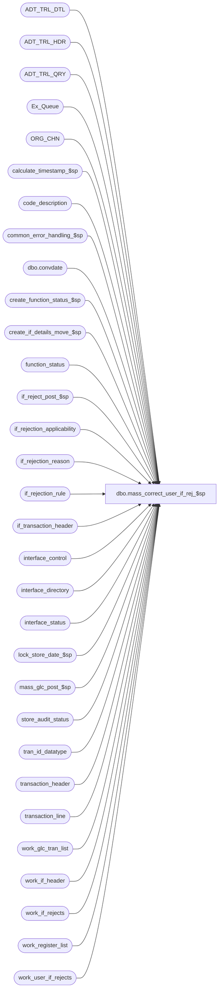

# dbo.mass_correct_user_if_rej_$sp

**Database:** auditworks  
**Server:** bedrockdb01  

## Architecture Diagram



## Table Dependencies

| Referenced Table |
|---|
| ADT_TRL_DTL |
| ADT_TRL_HDR |
| ADT_TRL_QRY |
| Ex_Queue |
| ORG_CHN |
| calculate_timestamp_$sp |
| code_description |
| common_error_handling_$sp |
| dbo.convdate |
| create_function_status_$sp |
| create_if_details_move_$sp |
| function_status |
| if_reject_post_$sp |
| if_rejection_applicability |
| if_rejection_reason |
| if_rejection_rule |
| if_transaction_header |
| interface_control |
| interface_directory |
| interface_status |
| lock_store_date_$sp |
| mass_glc_post_$sp |
| store_audit_status |
| tran_id_datatype |
| transaction_header |
| transaction_line |
| work_glc_tran_list |
| work_if_header |
| work_if_rejects |
| work_register_list |
| work_user_if_rejects |

## Stored Procedure Code

```sql
create proc dbo.mass_correct_user_if_rej_$sp 
(@process_id             binary(16),
 @user_id		 int,
 @revalidate_spid        binary(16) = NULL
)

AS

/* 
PROC NAME: mass_correct_user_if_rej_$sp	 
    DESC: To re-evaluate User Defined IF Rejects for all store/dates. Uses function_no = 111.
          Called by mass_auto_revalidate_$sp. 

HISTORY:
Date     Name       Def# Desc
Feb17,17 Vicci DAOM-1927 Log memo1, memo2, memo3.
Nov14,14 Vicci TFS-92326 Take into account the fact that the value of the output parameter of a proc called with a TRY/CATCH is not returned 
                         to the calling proc when a raise-error occurs, when calling lock_store_date_$sp.  
Jan18,12 Vicci    132439 Remove references to CRDM user-defined string datatypes from S/A since CRDM is not changing them to support unicode.
Feb03,11 Vicci    124563 Don't use @rdbms_process_id since the dynamic sql generated by the UI is now correct.
Apr20,07 PaulS   DV-1356 uplift 73592 to SA5
Jul04,05 Paul    DV-1239 use @rdbms_process_id to match dynamic sql
Apr28,05 Paul    DV-1234 expand transaction_id to use tran_id_datatype
Mar22,05 Paul    DV-1218 changed audit trail seperator, comments
Dec07,04 David   DV-1181 Fix typo
Sep17,04 Maryam  DV-1146 Change user_name to user_id.
Aug31,04 Maryam  DV-1120 Use convdate function for dates when logging the audit trail.
Aug06,04 Maryam  DV-1071 insert into new audit trail, use ORG_CHN_WRKSTN, modify the call to lock_store_date_$sp
May20,04 David   DV-1071 Use ORG_CHN table as new the Store table.
Jun15,06 Vicci     73592 Skip store/dates locked by the Edit since lock will be held all day
Feb02,04 Phu       21723 Rejects not fixed when called directly from FE
Sep19,03 Phu       15801 Validate all or specific transactions
Sep15,03 ShuZ    1-G7A5F Remove all references to the interface_directory '... _check' 
                         fields from stored procedures/triggers and replace with usage 
                         of if_rejection_applicability table.
Apr24,03 Paul    1-KO2HY populate till_no
Jul26,02 Paul    1-E7L7M populate key_11 in Ex_Queue with entry_date_time
May16,02 Henry   1-CD0IX Add R3.5 standardized common error handling
Sep18,01 Paul       8726 use datetime for @entry_date_time
Sep12,01 David C    8720 R3 C/L - Include interface_id 28 in work_glc_tran_list
Jul25,01 David C    8413 Add transaction_id to if_transaction_header
May04,01 Henry      7369 Allows user-defined IF rejection reasons.

*/

DECLARE @cursor_open		tinyint,
	@date_reject_id		tinyint,
	@edit_timestamp		float,
	@entry_date_time	datetime,
	@errmsg			nvarchar(255),
	@errno			int,
	@function_no		tinyint,
	@glc_rows		int,
	@if_reject_flag		tinyint,
	@register_no		smallint,
	@ret			int,
	@rows			int,
	@sep			nchar(1),
	@ORG_CHN_NAME		nvarchar(50),
	@store_no		int,
	@table_key		nvarchar(255),
	@table_key_descr	nvarchar(255),
	@tinyint_filler		tinyint,
	@transaction_date	smalldatetime,
	@transaction_id		tran_id_datatype,	
	@object_name		nvarchar(255),
	@process_name		nvarchar(100),
	@operation_name		nvarchar(100),
	@message_id		int,
	@ENTRY_ID               binary(16),
	@all_selected_descr     nvarchar(255),
	@all_selected_flag      tinyint,
	@count                  tinyint,
	@if_rejection_reason    smallint,
        @if_reject              nvarchar(100),     	
        @if_reject_descr        nvarchar(100)

SELECT	@function_no = 111,
	@cursor_open = 0,
	@entry_date_time = getdate(),
	@process_name = 'mass_correct_user_if_rej_$sp',
	@message_id = 201068,
	@count = 0,
	@all_selected_flag = 0, -- selected transactions
	@sep = NCHAR(12) -- audit trail seperator

IF @revalidate_spid IS NULL
  SELECT @all_selected_flag = 1  --all transactions

SELECT @ENTRY_ID = NEWID(),
       @all_selected_descr = code_display_descr
  FROM code_description
 WHERE code_type = 203
   AND code = @all_selected_flag

SELECT @errno = @@error
IF @errno != 0
  BEGIN
   SELECT @errmsg = 'Failed to select the description for code_type = 203',
	  @object_name = 'code_description',
	  @operation_name = 'SELECT'
   GOTO error
  END   

DECLARE if_reject_desc_crsr CURSOR FAST_FORWARD
FOR
SELECT if_rejection_reason
  FROM if_rejection_rule WITH (NOLOCK)
 WHERE if_rejection_reason >= 200 

SELECT @errno = @@error
IF @errno <> 0
BEGIN
   SELECT @errmsg = 'Unable to declare a cursor on if_rejection_rule',
  @object_name = 'if_reject_desc_crsr',
          @operation_name = 'DECLARE CURSOR'
   GOTO error
END

OPEN if_reject_desc_crsr

SELECT  @cursor_open = 2

WHILE 1 = 1
BEGIN
  FETCH if_reject_desc_crsr 
   INTO @if_rejection_reason

  IF @@fetch_status <> 0
    BREAK
    
  SELECT @count = @count + 1
  
  IF @count = 1
  BEGIN
    SELECT @if_reject = CONVERT(nvarchar,@if_rejection_reason)
    SELECT @if_reject_descr = if_rejection_description
      FROM if_rejection_rule
     WHERE if_rejection_reason = @if_rejection_reason
    
    SELECT @errno = @@error
    IF @errno <> 0
      BEGIN
        SELECT @errmsg = 'Unable to select the description of the reject reason.',
               @object_name = 'if_rejection_rule',
               @operation_name = 'SELECT'
        GOTO error
      END
  END
  ELSE
  BEGIN    
    SELECT @if_reject = @if_reject + ', ' + convert(nvarchar,@if_rejection_reason)
    SELECT @if_reject_descr = @if_reject_descr + ', ' + if_rejection_description
      FROM if_rejection_rule
     WHERE if_rejection_reason = @if_rejection_reason
    
    SELECT @errno = @@error
    IF @errno <> 0
      BEGIN
        SELECT @errmsg = 'Failed to select the description of the reject reason.',
               @object_name = 'if_rejection_rule',
               @operation_name = 'SELECT'
        GOTO error
      END 
  END

END -- While 1=1

CLOSE if_reject_desc_crsr
DEALLOCATE if_reject_desc_crsr
SELECT @cursor_open = 0

 
INSERT INTO ADT_TRL_HDR(
       ENTRY_ID,
       ENTRY_DATE_TIME,
       USER_ID,
       APP_ID,
       ROOT_TBL_NAME,
       ROOT_TBL_KEY,
       ROOT_TBL_KEY_RSRC_NAME,
       ROOT_TBL_KEY_RSRC_PRMS,
       FNCTN_NUM)
VALUES (@ENTRY_ID,
        getdate(),
        @user_id,
        300,
        'TRANSACTION',
        @if_reject+@sep+ CONVERT(nvarchar, @all_selected_flag),
        'TK_IF_REJE_REAS_ALL_SELE_FLAG',
        @if_reject_descr +@sep+@all_selected_descr,
        111)
          
SELECT @errno = @@error
IF @errno != 0
  BEGIN
   SELECT @errmsg = 'Failed to insert into ADT_TRL_HDR',
	  @object_name = 'ADT_TRL_HDR',
	  @operation_name = 'INSERT'
   GOTO error
  END

/*{ build temp table of ALL User Defined IF Rejects */

SELECT	DISTINCT th.store_no, th.register_no, th.transaction_date,
	th.transaction_no, th.transaction_series, th.entry_date_time,
	th.date_reject_id, ir.transaction_id, ir.line_id, 
	if_reject_reason, th.cashier_no, th.till_no, th.if_rejection_flag
INTO	#user_if_reject
FROM 	if_rejection_reason ir, transaction_header th, store_audit_status s
WHERE   ir.if_reject_reason >= 200
AND 	ir.transaction_id = th.transaction_id
AND 	th.date_reject_id = 0
AND 	(ir.process_id = @revalidate_spid OR @revalidate_spid IS NULL)
AND     th.store_no = s.store_no
AND     th.transaction_date = s.sales_date
AND     th.date_reject_id = s.date_reject_id
AND     s.update_in_progress NOT IN (1, 4) --73592
ORDER BY th.store_no, th.transaction_date

SELECT @errno = @@error,
	@rows = @@rowcount
IF @errno != 0
BEGIN
  SELECT @errmsg = 'Failed to build table #user_if_reject',
	 @object_name = '#user_if_reject',
	 @operation_name = 'SELECT'
  GOTO error
END

IF @rows = 0
  BEGIN
   DROP TABLE #user_if_reject
   RETURN
  END

/*} build temp table of User Defined IF Rejected lines */

EXEC calculate_timestamp_$sp @edit_timestamp OUTPUT

SELECT @errno = @@error
IF @errno != 0
BEGIN
  IF @errmsg IS NULL /* then */
    SELECT @errmsg = 'Failed to execute stored procedure calculate_timestamp_$sp'
  SELECT @object_name = 'calculate_timestamp_$sp',
	 @operation_name = 'EXEC'
  GOTO error
END

/* re-evaluate if_rejections for one store-date at a time */

DECLARE mass_user_if_crsr cursor FAST_FORWARD
FOR
SELECT DISTINCT
	store_no,
	transaction_date
  FROM #user_if_reject WITH (NOLOCK)

OPEN mass_user_if_crsr

SELECT @errno = @@error
IF @errno != 0
  BEGIN
   SELECT @errmsg = 'Failed to open cursor mass_user_if_crsr',
	  @object_name = 'mass_user_if_crsr',
	  @operation_name = 'OPEN'
   GOTO error
  END

SELECT @cursor_open = 1

-- Re-evaluate User Defined IF Rejects, one store/date at a time to avoid contention/locking issues.

WHILE 1=1
BEGIN

  FETCH mass_user_if_crsr INTO
	@store_no,
	@transaction_date

  IF @@fetch_status <> 0
    BREAK

 EXEC create_function_status_$sp @process_id, @user_id, @function_no, 0,
	@errmsg OUTPUT, @store_no, @transaction_date, 0

  SELECT @errno = @@error
  IF @errno != 0
  BEGIN
    IF @errmsg IS NULL /* then */
      SELECT @errmsg = 'Failed to execute stored proc create_function_status_$sp'
    SELECT @object_name = 'create_function_status_$sp',
	   @operation_name = 'EXEC'
      GOTO error
  END

  /* Lock store-date */
  SELECT @ret = NULL;
  BEGIN TRY 
    EXEC lock_store_date_$sp @process_id, @user_id, @store_no, @transaction_date, 0, @function_no, @ret OUTPUT;
  END TRY
  BEGIN CATCH
  SELECT @errno = ERROR_NUMBER();
  IF @ret IS NULL OR @ret = 0
    SELECT @ret = @errno;
  END CATCH;          
  IF @errno != 0 AND @ret <> 201550 AND @errno <> 201550
  BEGIN
    SELECT @errmsg = 'Failed to execute lock_store_date_$sp',
           @object_name = 'lock_store_date_$sp',
           @operation_name = 'EXEC'
    GOTO error
  END

  IF @ret != 0
  BEGIN /* unable to lock, skip all transactions for store-date */
    DELETE function_status
     WHERE user_id = @user_id
       AND function_no = @function_no
       AND process_id = @process_id

     SELECT @errno = @@error
     IF @errno != 0
     BEGIN
       SELECT @errmsg = 'Failed to delete function_status',
	      @object_name = 'function_status',
	      @operation_name = 'DELETE'
       GOTO error
     END

    CONTINUE
  END

  /* get list of User Defined IF rejected trxns by store/date */

  SELECT store_no, register_no, transaction_date, transaction_no, transaction_series,
   entry_date_time, date_reject_id, transaction_id, line_id, if_reject_reason,
   cashier_no, till_no, if_rejection_flag 
    INTO #str_date_user_if_rej
    FROM #user_if_reject
   WHERE store_no = @store_no
     AND transaction_date = @transaction_date

  SELECT @errno = @@error,
	@rows = @@rowcount
  IF @errno != 0
  BEGIN
    SELECT @errmsg = 'Failed to build temp table #str_date_user_if_rej',
	   @object_name = '#str_date_user_if_rej',
	   @operation_name = 'SELECT'
    GOTO error
  END

  /* Populate work table for User Defined IF Rejects */

  DELETE work_if_rejects
  WHERE process_id = @process_id
  SELECT @errno = @@error 
  IF @errno != 0 
  BEGIN 
    SELECT @errmsg = 'Failed to DELETE work_if_rejects (1)', 
	   @object_name = 'work_if_rejects',
	   @operation_name = 'DELETE'
    GOTO error 
  END 

  DELETE work_if_header
   WHERE process_id = @process_id
  SELECT @errno = @@error
  IF @errno != 0
    BEGIN
     SELECT @errmsg = 'Failed to delete rows from table work_if_header',
	 @object_name = 'work_if_header',
	 @operation_name = 'DELETE'
     GOTO error
    END

  INSERT work_if_rejects (
	 process_id,
	 transaction_id,
	 if_reject_reason)
  SELECT DISTINCT @process_id,
	 ir.transaction_id,
	 0
    FROM #str_date_user_if_rej sd, if_rejection_reason ir
   WHERE sd.transaction_id = ir.transaction_id
     AND sd.line_id = ir.line_id
     AND sd.if_reject_reason = ir.if_reject_reason
  SELECT @errno = @@error
  IF @errno != 0
  BEGIN
    SELECT @errmsg = 'Failed to INSERT work_if_rejects',
	   @object_name = 'work_if_rejects',
	   @operation_name = 'INSERT'
    GOTO error
  END

  /* this will call the proc to revalidate User Defined IF Rejects
     It will call the user_if_procs_$sp, to populate the work_user_if_rejects table */

  EXEC if_reject_post_$sp @process_id, @user_id, @errmsg OUTPUT
  SELECT @errno = @@error
  IF @errno != 0
  BEGIN
    IF @errmsg IS NULL /*then */
      SELECT @errmsg = 'Failed to execute stored procedure if_reject_post_$sp'
    SELECT @object_name = 'if_reject_post_$sp',
	   @operation_name = 'EXEC'
    GOTO error
  END

  /* determine a list of trxns that are no longer User Defined IF Rejects
     between the 2 tables: #str_date_user_if_rej and work_user_if_rejects. 
     Then create a new table #tran_interface_list, to populate the if_tables. */

  SELECT DISTINCT ic.transaction_id,
	ic.interface_id,
	interface_status_flag = id.update_timing,
	transaction_date = @transaction_date,
	entry_date_time
  INTO #tran_interface_list
  FROM #str_date_user_if_rej tl WITH (NOLOCK), interface_control ic WITH (NOLOCK),
	interface_directory id WITH (NOLOCK), if_rejection_applicability ia WITH (NOLOCK)
  WHERE tl.transaction_id = ic.transaction_id  -- does the trxn exist in interface_control
  AND ic.interface_status_flag = 99	-- was it originally an IF Reject
  AND ic.interface_id = id.interface_id  
  AND id.update_timing >= 1 -- is it an interface that should be posting
  AND ic.interface_id = ia.interface_id  -- does the trxn apply to the User Defined IF reject interface
  AND tl.transaction_id NOT IN (SELECT transaction_id	-- to make sure that it is no longer USER DEFINED IF REJECT
				  FROM work_user_if_rejects
				 WHERE process_id = @process_id)
  SELECT @errno = @@error
  IF @errno != 0
  BEGIN
    SELECT @errmsg = 'Failed to build table #tran_interface_list',
	   @object_name = '#tran_interface_list',
	   @operation_name = 'INSERT'
    GOTO error
  END

  -- It is possible for each trxn to have multiple User Defined IF Reject reasons.
  -- If some of the User Defined IF Reject reasons have been cleaned up for the trxn,
  -- but there are some still remaining in the trxn, first clean up the if_rejection_reason table.
  -- Then re-insert the remaining User Defined IF Rejects back into the if_rejection_reason table.

  BEGIN TRANSACTION

  DELETE if_rejection_reason
    FROM if_rejection_reason ir WITH (NOLOCK),
         work_user_if_rejects we
   WHERE ir.if_reject_reason >= 200
     AND ir.transaction_id = we.transaction_id
     AND we.process_id = @process_id

  SELECT @errno = @@error
  IF @errno != 0
  BEGIN
    SELECT @errmsg = 'Failed to DELETE if_rejection_reason',
	   @object_name = 'if_rejection_reason',
	   @operation_name = 'DELETE'
    GOTO error
  END

  INSERT INTO if_rejection_reason (
		transaction_id,
		line_id,
		if_reject_reason,
		deferred,
		process_id,
		memo1,
		memo2,
		memo3)
	SELECT  transaction_id,
		line_id,
		if_reject_reason,
		0,
		process_id,
		memo1,
		memo2,
		memo3
	  FROM  work_user_if_rejects WITH (NOLOCK)
	 WHERE  process_id = @process_id

  SELECT @errno = @@error
  IF @errno != 0
  BEGIN
    SELECT @errmsg = 'Failed to INSERT if_rejection_reason',
	   @object_name = 'if_rejection_reason',
	   @operation_name = 'INSERT'
    GOTO error
  END

  COMMIT TRANSACTION
  /* save list of store-reg-dates affected. Table work_register_list used in mass_glc_post_$sp for validations. */

  DELETE work_register_list
   WHERE process_id = @process_id

  SELECT @errno = @@error
  IF @errno != 0
  BEGIN
    SELECT @errmsg = 'Failed to delete work_register_list',
	   @object_name = 'work_register_list',
	   @operation_name = 'DELETE'
    GOTO error
  END

  INSERT work_register_list (
	process_id,
	store_no,
	transaction_date,
	date_reject_id,
	register_no,
	function_no )
  SELECT DISTINCT
	@process_id,
	store_no,
	transaction_date,
	date_reject_id,
	register_no,
	@function_no
  FROM #str_date_user_if_rej

  SELECT @errno = @@error
 IF @errno != 0
  BEGIN
    SELECT @errmsg = 'Failed to insert work_register_list',
	   @object_name = 'work_register_list',
	   @operation_name = 'INSERT'
    GOTO error
  END

  SELECT @ORG_CHN_NAME = ORG_CHN_NAME
    FROM ORG_CHN WITH (NOLOCK)
   WHERE ORG_CHN_NUM = @store_no

  SELECT @errno = @@error
  IF @errno != 0
  BEGIN
    SELECT @errmsg = 'Failed to SELECT from ORG_CHN',
	   @object_name = 'ORG_CHN',
	   @operation_name = 'SELECT'
    GOTO error
  END


INSERT INTO ADT_TRL_DTL(
       ENTRY_ID,
       TBL_NAME,
       TBL_KEY,
       TBL_KEY_RSRC_NAME,
       TBL_KEY_RSRC_PRMS,
       ACTN_CODE)
SELECT DISTINCT
       @ENTRY_ID,
       'IF_REJECTION_REASON',
        CONVERT(nvarchar, if_reject_reason)
        +@sep+CONVERT(nvarchar, transaction_id)
        +@sep+ CONVERT(nvarchar, line_id),
       'TK_IF_REJE_REAS_STOR_TRAN_DATE_REGI_DATE_REJE_ID_TRAN_NO_TRAN_SERI_ENTR_DATE_TIME_LINE_ID',
        if_rejection_description
        +@sep+ CONVERT(nvarchar, store_no)+ '-' +@ORG_CHN_NAME
        +@sep+ dbo.convdate(transaction_date)
        +@sep+ CONVERT(nvarchar, register_no)
        +@sep+ CONVERT(nvarchar, date_reject_id)
        +@sep+ CONVERT(nvarchar, transaction_no)
        +@sep+ CONVERT(nvarchar, transaction_series)
        +@sep+ dbo.convdate(entry_date_time)
        +@sep+ CONVERT(nvarchar, line_id),
        'D'
    FROM #str_date_user_if_rej v, if_rejection_rule i
   WHERE v.if_reject_reason = i.if_rejection_reason

SELECT @errno = @@error
IF @errno != 0
  BEGIN
   SELECT @errmsg = 'Failed to insert into ADT_TRL_DTL',
	  @object_name = 'ADT_TRL_DTL',
	  @operation_name = 'INSERT'
   GOTO error
  END


INSERT INTO ADT_TRL_QRY(
       ENTRY_ID,
       QRY_KEY_NUM,
       KEY_PART_VAL_1,
       KEY_PART_VAL_2,
       KEY_PART_VAL_3,
       KEY_PART_VAL_4,
       KEY_PART_VAL_5,
       KEY_PART_VAL_6,
       KEY_PART_VAL_7,
       KEY_PART_VAL_8,
       KEY_PART_VAL_9,
       KEY_PART_VAL_10)
SELECT DISTINCT
       @ENTRY_ID,
       301,
       CONVERT(nvarchar,store_no),
       CONVERT(nvarchar,register_no),
       dbo.convdate(transaction_date),
       CONVERT(nvarchar, till_no),
       CONVERT(nvarchar,transaction_no),
       CONVERT(nvarchar,transaction_series),
       CONVERT(nvarchar,cashier_no),
       CONVERT(nvarchar,transaction_id),
       NULL,
       NULL
  FROM #str_date_user_if_rej WITH (NOLOCK)
       
SELECT @errno = @@error
IF @errno != 0
  BEGIN
    SELECT @errmsg = 'Failed to insert into ADT_TRL_QRY for QRY_KEY_NUM = 1)',
    	   @object_name = 'ADT_TRL_QRY',
	   @operation_name = 'INSERT'
    GOTO error
  END
  
  UPDATE transaction_header
     SET last_modified_date_time = @entry_date_time
    FROM #tran_interface_list tr, transaction_header th
   WHERE tr.transaction_id = th.transaction_id

   SELECT @errno = @@error
  IF @errno != 0
  BEGIN
    SELECT @errmsg = 'Failed to update table transaction_header (last_modified_date_time)',
	   @object_name = 'transaction_header',
	   @operation_name = 'UPDATE'
    GOTO error
  END

  /* 	don't include transactions that are still i/f rejections
	due to other reasons for the same interfaces */

  DELETE #tran_interface_list
    FROM #tran_interface_list il, if_rejection_reason ir WITH (NOLOCK), if_rejection_applicability ia WITH (NOLOCK)
   WHERE il.transaction_id = ir.transaction_id
     AND ir.if_reject_reason < 200
     AND il.interface_id = ia.interface_id
     AND ia.if_reject_reason = ir.if_reject_reason

  SELECT @errno = @@error
  IF @errno != 0
  BEGIN
    SELECT @errmsg = 'Failed to delete rows from #tran_interface_list (reason)',
	   @object_name = '#tran_interface_list',
	   @operation_name = 'DELETE'
    GOTO error
  END

  /* Delete rejections for User Defined IF Rejects now on file */

  DELETE if_rejection_reason
  FROM #tran_interface_list tl, if_rejection_reason ir WITH (NOLOCK)
  WHERE tl.transaction_id = ir.transaction_id
  AND ir.if_reject_reason >= 200

  SELECT @errno = @@error
  IF @errno != 0
  BEGIN
    SELECT @errmsg = 'Failed to delete if_rejection_reason',
	   @object_name = 'if_rejection_reason',
	   @operation_name = 'DELETE'
    GOTO error
  END

  /* get list of corrected transactions (at least one interface has been corrected) */

  SELECT DISTINCT transaction_id
  INTO #non_rejects
  FROM #tran_interface_list WITH (NOLOCK)

  SELECT @errno = @@error
  IF @errno != 0
  BEGIN
    SELECT @errmsg = 'Failed to build temp table #non_rejects',
	   @object_name = '#non_rejects',
	   @operation_name = 'SELECT'
    GOTO error
  END

  /* get list of corrected tran which apply to glc */
  DELETE work_glc_tran_list
   WHERE process_id = @process_id

  SELECT @errno = @@error
  IF @errno != 0
  BEGIN
    SELECT @errmsg = 'Failed to delete work_glc_tran_list',
	   @object_name = 'work_glc_tran_list',
	   @operation_name = 'DELETE'
    GOTO error
  END

  INSERT work_glc_tran_list (
	process_id,
	transaction_id )
  SELECT DISTINCT @process_id, nr.transaction_id
  FROM #non_rejects nr, interface_control ic WITH (NOLOCK)
  WHERE nr.transaction_id = ic.transaction_id
  AND ic.interface_id = 28
  AND interface_status_flag = 99

  SELECT @glc_rows = @@rowcount,
	@errno = @@error
  IF @errno != 0
  BEGIN
    SELECT @errmsg = 'Failed to insert work_glc_tran_list',
	   @object_name = 'work_glc_tran_list',
	   @operation_name = 'INSERT'
  GOTO error
  END

  UPDATE function_status
  SET status = 2
  WHERE user_id = @user_id
  AND process_id = @process_id
  AND function_no = @function_no

  SELECT @errno = @@error
  IF @errno != 0
  BEGIN
    SELECT @errmsg = 'Failed to update function_status (status=2)',
	   @object_name = 'function_status',
	   @operation_name = 'UPDATE'
    GOTO error
  END

  INSERT work_if_header (
	process_id,
	transaction_id,
	effective_date,
	entry_date_time )
  SELECT DISTINCT @process_id,
	transaction_id,
	transaction_date,
	entry_date_time
  FROM #tran_interface_list WITH (NOLOCK)
  WHERE interface_status_flag = 1

  SELECT @errno = @@error
  IF @errno != 0
  BEGIN
    SELECT @errmsg = 'Failed to insert work_if_header',
	   @object_name = 'work_if_header',
	   @operation_name = 'INSERT'
    GOTO error
  END

  BEGIN TRANSACTION

  INSERT if_transaction_header (
	store_no,
	register_no,
	transaction_date,
	date_reject_id,
	transaction_series,
	transaction_no,
	entry_date_time,
	cashier_no,
	transaction_category,
	tender_total,
	transaction_void_flag,
	customer_info_exists,
	exception_flag,
	deposit_declaration_flag,
	closeout_flag,
	media_count_flag,
	customer_modified_flag,
	tax_override_flag,
	pos_tax_jurisdiction,
	edit_timestamp,
	employee_no,
	transaction_remark,
	source_process_no,
	last_modified_date_time,
	in_use_timestamp,
	updated_by_user_id,
	transaction_id,
	till_no )
  SELECT
	store_no,
	register_no,
	transaction_date,
	date_reject_id,
	transaction_series,
	transaction_no,
	th.entry_date_time,
	cashier_no,
	transaction_category,
	tender_total,
	transaction_void_flag,
	customer_info_exists,
	exception_flag,
	deposit_declaration_flag,
	closeout_flag,
	media_count_flag,
	customer_modified_flag,
	tax_override_flag,
	pos_tax_jurisdiction,
	@edit_timestamp,
	employee_no,
	transaction_remark,
	@function_no,
	last_modified_date_time,
	in_use_timestamp,
	updated_by_user_id,
	th.transaction_id,
	th.till_no
  FROM work_if_header wh WITH (NOLOCK), transaction_header th WITH (NOLOCK)
  WHERE process_id = @process_id
  AND wh.transaction_id = th.transaction_id

  SELECT @errno = @@error
  IF @errno != 0
  BEGIN
    SELECT @errmsg = 'Failed to insert if_transaction_header',
	   @object_name = 'if_transaction_header',
	   @operation_name = 'INSERT'
   GOTO error
  END

  UPDATE work_if_header
  SET if_entry_no = ih.if_entry_no
 FROM work_if_header wh, transaction_header th WITH (NOLOCK), if_transaction_header ih WITH (NOLOCK)
  WHERE wh.process_id = @process_id
  AND wh.transaction_id = th.transaction_id
  AND ih.store_no = th.store_no
  AND ih.transaction_date = th.transaction_date
  AND ih.entry_date_time = th.entry_date_time
  AND ih.register_no = th.register_no
  AND ih.transaction_no = th.transaction_no
  AND ih.transaction_series = th.transaction_series
  AND ih.edit_timestamp = @edit_timestamp

  SELECT @errno = @@error
  IF @errno != 0
  BEGIN
    SELECT @errmsg = 'Failed to update work_if_header',
	   @object_name = 'work_if_header',
	   @operation_name = 'UPDATE'
    GOTO error
  END

  /* Call sub-procedure to create entries in the if detail tables */
  EXEC create_if_details_move_$sp @process_id, @user_id, 1, @errmsg OUTPUT

  SELECT @errno = @@error
  IF @errno != 0
  BEGIN
    IF @errmsg IS NULL /* then */ 
      SELECT @errmsg = 'Failed to execute stored procedure create_if_details_move_$sp'
    SELECT @object_name = 'create_if_details_move_$sp',
	 @operation_name = 'EXEC'
    GOTO error
  END

 /* get list of tran for which no i/f rejections exist */

  DELETE #non_rejects
  FROM #non_rejects nr, if_rejection_reason ir WITH (NOLOCK)
  WHERE nr.transaction_id = ir.transaction_id

  SELECT @errno = @@error
  IF @errno != 0
  BEGIN
   SELECT @errmsg = 'Failed to delete rows from temp table #non_rejects',
	   @object_name = '#non_rejects',
	   @operation_name = 'DELETE'
   GOTO error
  END

  -- Reset process_id to null for remaining unvalidate trans
  IF @revalidate_spid IS NOT NULL --
  BEGIN
    UPDATE if_rejection_reason
    SET process_id = NULL --
    FROM #str_date_user_if_rej t, if_rejection_reason ir
    WHERE t.store_no = @store_no
    AND t.transaction_date = @transaction_date
    AND t.transaction_id = ir.transaction_id
    AND ir.if_reject_reason >= 200
    AND ir.process_id = @revalidate_spid

    SELECT @errno = @@error
    IF @errno != 0
    BEGIN
      SELECT @errmsg = 'Unable to set process_id to null in if_rejection_reason (2)',
             @object_name = 'if_rejection_reason',
             @operation_name = 'UPDATE'
      GOTO error
    END
  END

  /* This update handles most of the cases but it is incomplete. mass_glc_post_$sp
     updates transaction_line. */

  UPDATE transaction_line
  SET interface_rejection_flag = 0
  FROM #non_rejects nr, transaction_line tl
  WHERE nr.transaction_id = tl.transaction_id
  AND interface_rejection_flag = 1

  SELECT @errno = @@error
  IF @errno != 0
  BEGIN
    SELECT @errmsg = 'Failed to update transaction_line',
	   @object_name = 'transaction_line',
	   @operation_name = 'UPDATE'
    GOTO error
  END

  UPDATE transaction_header
  SET if_rejection_flag = 0
  FROM #non_rejects nr, transaction_header th
  WHERE nr.transaction_id = th.transaction_id

  SELECT @errno = @@error
  IF @errno != 0
  BEGIN
    SELECT @errmsg = 'Failed to update table transaction_header',
	   @object_name = 'transaction_header',
	   @operation_name = 'UPDATE'
    GOTO error
  END

  UPDATE interface_control
  SET interface_status_flag = il.interface_status_flag
  FROM #tran_interface_list il, interface_control ic
  WHERE il.transaction_id = ic.transaction_id
  AND il.interface_id = ic.interface_id

  SELECT @errno = @@error
  IF @errno != 0
  BEGIN
    SELECT @errmsg = 'Failed to update interface_control',
	   @object_name = 'interface_control',
	   @operation_name = 'UPDATE'
    GOTO error
  END
 
  INSERT Ex_Queue (
		queue_id, -- interface_id
    		key_1, -- if_entry_no
		key_2, -- interface_control_flag
		key_9, -- effective_date
		key_10, -- interface_posting_date
		key_11) -- entry_date_time
  SELECT il.interface_id,
	wh.if_entry_no,
	10,
	il.transaction_date,
	@entry_date_time,
	wh.entry_date_time
    FROM #tran_interface_list il, work_if_header wh
   WHERE il.interface_status_flag = 1
     AND wh.transaction_id = il.transaction_id
     AND wh.process_id = @process_id

  SELECT @errno = @@error
  IF @errno != 0
  BEGIN
    SELECT @errmsg = 'Failed to insert Ex_Queue',
	   @object_name = 'Ex_Queue',
	   @operation_name = 'INSERT'
    GOTO error
  END

  UPDATE function_status
  SET status = 3
  WHERE user_id = @user_id
  AND process_id = @process_id
  AND function_no = @function_no

  SELECT @errno = @@error
  IF @errno != 0
  BEGIN
    SELECT @errmsg = 'Failed to update function_status',
	   @object_name = 'function_status',
	  @operation_name = 'UPDATE'
    GOTO error
  END

  COMMIT TRANSACTION /* interfaces and tran details */

  EXEC mass_glc_post_$sp @function_no, @process_id, @user_id, @glc_rows, @errmsg OUTPUT

  SELECT @errno = @@error
  IF @errno != 0
  BEGIN
    IF @errmsg IS NULL /* then */
      SELECT @errmsg = 'Failed to execute stored procedure mass_glc_post_$sp'
    SELECT @object_name = 'mass_glc_post_$sp',
     @operation_name = 'EXEC'
    GOTO error
  END

  UPDATE store_audit_status
  SET update_in_progress = 0
  WHERE store_no = @store_no
  AND sales_date = @transaction_date
  AND date_reject_id = 0

  SELECT @errno = @@error
  IF @errno !=0
  BEGIN
    SELECT @errmsg = 'Failed to unlock (update) store_audit_status',
	   @object_name = 'store_audit_status',
	   @operation_name = 'UPDATE'
    GOTO error
  END

  DELETE function_status
  WHERE user_id = @user_id
  AND function_no = @function_no
  AND process_id = @process_id

  SELECT @errno = @@error
  IF @errno !=0
  BEGIN
    SELECT @errmsg = 'Failed to DELETE function_status',
	   @object_name = 'function_status',
	   @operation_name = 'UPDATE'
    GOTO error
  END

  DROP TABLE #str_date_user_if_rej, #tran_interface_list, #non_rejects

  SELECT @errno = @@error
  IF @errno != 0
  BEGIN
    SELECT @errmsg = 'Failed to drop temp tables',
	   @object_name = 'function_status',
	   @operation_name = 'DROP'
    GOTO error
  END

END /* While 1=1 */

CLOSE mass_user_if_crsr
SELECT @errno = @@error,
	@cursor_open = 0
IF @errno != 0
  BEGIN
   SELECT @errmsg = 'Failed to close cursor mass_user_if_crsr',
	  @object_name = 'mass_user_if_crsr',
	  @operation_name = 'CLOSE'
   GOTO error
  END
  
DEALLOCATE mass_user_if_crsr

DELETE work_if_rejects
 WHERE process_id = @process_id
SELECT @errno = @@error
IF @errno != 0
BEGIN
  SELECT @errmsg = 'Failed to DELETE work_if_rejects (2)',
	 @object_name = 'work_if_rejects',
	 @operation_name = 'DELETE'
  GOTO error
END

DELETE work_user_if_rejects
 WHERE process_id = @process_id
SELECT @errno = @@error
IF @errno != 0
BEGIN
  SELECT @errmsg = 'Failed to DELETE work_user_if_rejects.',
	 @object_name = 'work_user_if_rejects',
	 @operation_name = 'DELETE'
  GOTO error
END

DROP TABLE #user_if_reject

SELECT @errno = @@error
IF @errno != 0
BEGIN
  SELECT @errmsg = 'Failed to drop temp table #user_if_reject',
	 @object_name = '#user_if_reject',
	 @operation_name = 'DROP'
  GOTO error
END

UPDATE interface_status
   SET last_posting_datetime = getdate()
  FROM interface_directory id, interface_status st, if_rejection_applicability ia
 WHERE update_timing = 1
   AND ia.if_reject_reason >= 200  -- make sure that the interface applies to User Defined IF Rejects
   AND st.interface_id = id.interface_id
   AND id.interface_id = ia.interface_id

SELECT @errno = @@error
IF @errno != 0
  BEGIN
     SELECT @errmsg = 'Failed to update interface_status',
	    @object_name = 'interface_status',
	    @operation_name = 'UPDATE'
     GOTO error
  END

RETURN

error:

        IF @cursor_open = 2
	BEGIN
	   CLOSE if_reject_desc_crsr
	   DEALLOCATE if_reject_desc_crsr
	   
	END
	
	IF @cursor_open = 1
	  BEGIN
	   CLOSE mass_user_if_crsr
	   DEALLOCATE mass_user_if_crsr
	  END

	EXEC common_error_handling_$sp @function_no, @errno, @errmsg, 0, @message_id, 
	@process_name, @object_name, @operation_name, 0, 1, 0, null, 0, null, null, 
	null, null, null, null, 0, @process_id, @user_id

	RETURN
```

