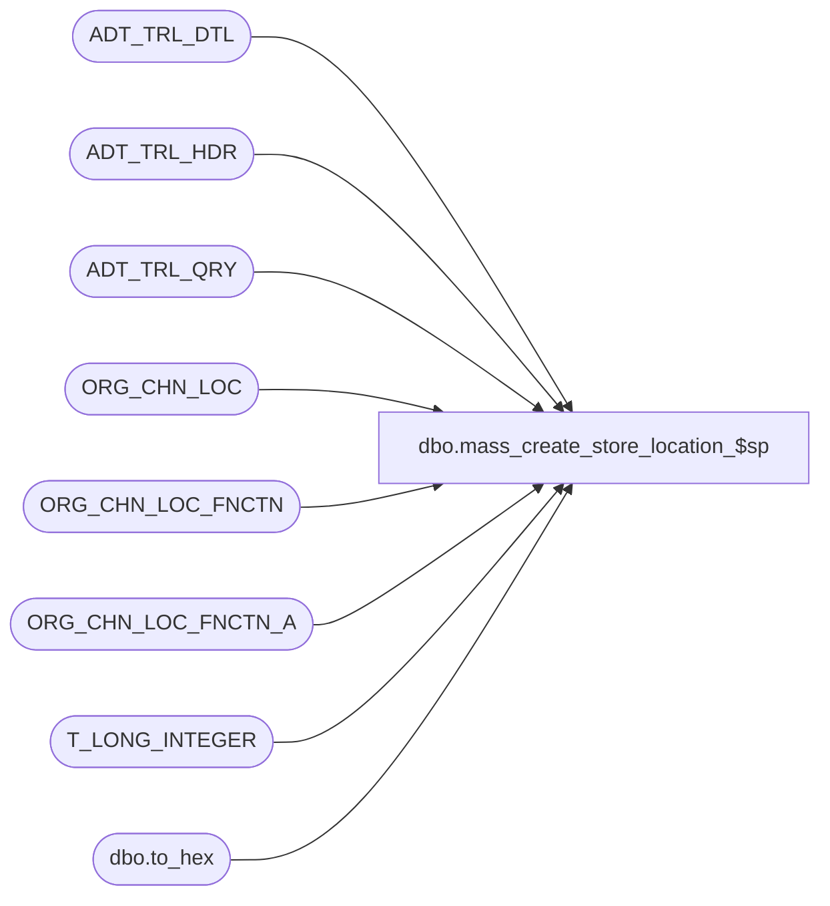

# dbo.mass_create_store_location_$sp

**Database:** auditworks  
**Server:** bedrockdb01  

## Architecture Diagram



## Table Dependencies

| Referenced Table |
|---|
| ADT_TRL_DTL |
| ADT_TRL_HDR |
| ADT_TRL_QRY |
| ORG_CHN_LOC |
| ORG_CHN_LOC_FNCTN |
| ORG_CHN_LOC_FNCTN_A |
| T_LONG_INTEGER |
| dbo.to_hex |

## Stored Procedure Code

```sql
create proc [dbo].[mass_create_store_location_$sp] (@process_id binary(16) = null,
 @user_id    int,
 @function_list nvarchar(3000),     --must provide comma-delimited list of valid FNCTN_NUM
 @store_list nvarchar(3000) = null, --Note:  if store_list is provided, remaining input params will be ignored;  
                                   --       if no store list is specified, from/to store is used to find those in range of matching type(s)
 @org_chn_type_sys_code_list nvarchar(3000) = null, --see ORG_CHN_TYPE.SYS_CODE for list of valid options.  
                                                   --comma delimited list of SYS_CODEs with quotes around each of them (for example: 'WEB','WH')
                                                   --If not provided, 'STR' (store) is assumed.
 @from_store_no int = null,        --Note:  if no from/to store nor store list is specified, all of matching type(s) is assumed
 @to_store_no int = null
)
AS

/* Proc Name: mass_create_store_location_$sp
   Description: To create a store location under each selected store with a primary function corresponding to that
                specified if one does not already exist.
		    Called from frontend. 

HISTORY
Date	 Name           Def# Desc
Jan19,12 Vicci        132481 Remove usage of data length function for substring extraction from unicode strings since it returns a length
                             of double that corresponding to the character positions within the string in the case of nvarchar and nchar data types.
Feb12,11 Paul         105977 unicode version
Jan14,08 Vicci               Author
*/

DECLARE @action_value		tinyint,
	@current_date		smalldatetime,
	@cursor_open		tinyint,
	@date_reject_id		tinyint,
	@errmsg			nvarchar(255),
	@errno			int,
	@raise_error		int,
	@function_no		smallint,
	@rows			int,
	@object_name		nvarchar(255),
	@process_name		nvarchar(100),
	@operation_name		nvarchar(100),
	@message_id		int,
	@sql_command		nvarchar(3000),
	@FNCTN_DESC		nvarchar(255),
        @start_pos 		int,
        @end_pos 		int,
        @function_list_length 	int,
        @FNCTN_NUM  		T_LONG_INTEGER,
        @org_chn_type_sys_code  nvarchar(4),
        @sep                    nchar(1),
		@returnerrmsg			nvarchar(255)

IF @org_chn_type_sys_code_list IS NULL
  SELECT @org_chn_type_sys_code_list  = '''STR'''

SELECT  @function_no = 1029,
        @process_name = 'mass_create_store_location_$sp',
        @message_id = 201068,
        @current_date = getdate(),
        @function_list_length = IsNull(len(@function_list), 0),
        @start_pos = 1,
        @end_pos = 0

CREATE TABLE #ORG_CHN_LOC (
       LOC_ID 		binary(16) NOT NULL,		  --T_ID
       ORG_CHN_NUM	int NOT NULL,  --T_LONG_INTEGER
       FNCTN_NUM	int NOT NULL,  --T_LONG_INTEGER
       LOC_DESC		nvarchar(255) COLLATE DATABASE_DEFAULT NOT NULL,	  --T_DESCRIPTION
       SYS_CODE		nvarchar(4) COLLATE DATABASE_DEFAULT NOT NULL,   --T_SYSTEM_CODE
       ENTRY_ID 	binary(16) NULL)		  --T_ID
SELECT @errno = @@error
IF @errno != 0
BEGIN
  SELECT @errmsg = 'Failed table to hold list of missing store locations for the selected function(s) under the selected stores',
         @object_name = '#ORG_CHN_LOC',
         @operation_name = 'CREATE'
  GOTO error
END

IF @store_list IS NOT NULL
BEGIN
  SELECT @sql_command = '
    INSERT into #ORG_CHN_LOC(
           LOC_ID,
           ORG_CHN_NUM,
           FNCTN_NUM,
           LOC_DESC,
           SYS_CODE)
    SELECT NEWID(),
           o.ORG_CHN_NUM, 
           f.FNCTN_NUM,
           f.FNCTN_DESC,
           f.SYS_CODE
      FROM ORG_CHN o
           INNER JOIN ORG_CHN_LOC_FNCTN f
              ON FNCTN_NUM IN (' + @function_list + ')
     WHERE o.ORG_CHN_NUM IN (' + @store_list + ')
       AND o.ORG_CHN_NUM NOT IN (SELECT l.ORG_CHN_NUM
                                   FROM ORG_CHN_LOC l
                                        INNER JOIN ORG_CHN_LOC_FNCTN_A lf
                                           ON l.LOC_ID = lf.LOC_ID
                                          AND f.FNCTN_NUM = lf.FNCTN_NUM
                                          AND lf.PRMRY_LOC_FNCTN_A = 1
                                  WHERE o.ORG_CHN_NUM = l.ORG_CHN_NUM  )
       AND o.ORG_CHN_NUM NOT IN (SELECT ld.ORG_CHN_NUM
                                   FROM ORG_CHN_LOC ld
        WHERE o.ORG_CHN_NUM = ld.ORG_CHN_NUM
                                    AND f.FNCTN_DESC = ld.LOC_DESC)
     '
--    PRINT @sql_command
    EXEC sp_executesql @sql_command  
    SELECT @errno = @@error
    IF @errno != 0
    BEGIN
      SELECT @errmsg = 'Failed to create missing store locations for the selected function(s) under the selected store list',
             @object_name = '#ORG_CHN_LOC',
             @operation_name = 'INSERT'
      GOTO error
    END
END
ELSE
BEGIN
  SELECT @sql_command = '
    INSERT into #ORG_CHN_LOC(
           LOC_ID,
           ORG_CHN_NUM,
           FNCTN_NUM,
           LOC_DESC,
           SYS_CODE)
    SELECT NEWID(),
           o.ORG_CHN_NUM, 
           f.FNCTN_NUM,
           f.FNCTN_DESC,
           f.SYS_CODE
      FROM ORG_CHN o
           INNER JOIN ORG_CHN_LOC_FNCTN f
              ON FNCTN_NUM IN (' + @function_list + ')
     WHERE o.ORG_CHN_TYPE_CODE IN (SELECT t.ORG_CHN_TYPE_CODE
                                     FROM ORG_CHN_TYPE t
                                    WHERE t.SYS_CODE in (' + @org_chn_type_sys_code_list + '))
       AND (o.ORG_CHN_NUM >= @from_store_no OR @from_store_no IS NULL)
       AND (o.ORG_CHN_NUM <= @to_store_no OR @to_store_no IS NULL)

       AND o.ORG_CHN_NUM NOT IN (SELECT l.ORG_CHN_NUM
                                   FROM ORG_CHN_LOC l
                                        INNER JOIN ORG_CHN_LOC_FNCTN_A lf
                                           ON l.LOC_ID = lf.LOC_ID
                                          AND f.FNCTN_NUM = lf.FNCTN_NUM
                                          AND lf.PRMRY_LOC_FNCTN_A = 1
                                  WHERE o.ORG_CHN_NUM = l.ORG_CHN_NUM  )
       AND o.ORG_CHN_NUM NOT IN (SELECT ld.ORG_CHN_NUM
                                   FROM ORG_CHN_LOC ld
                                  WHERE o.ORG_CHN_NUM = ld.ORG_CHN_NUM
                                    AND f.FNCTN_DESC = ld.LOC_DESC)
     '
--  PRINT @sql_command
  EXEC sp_executesql @sql_command, N'@from_store_no int, @to_store_no int', @from_store_no, @to_store_no
  SELECT @errno = @@error
  IF @errno != 0
  BEGIN
    SELECT @errmsg = 'Failed to create missing store locations for the selected function(s) under the selected store range',
           @object_name = '#ORG_CHN_LOC',
           @operation_name = 'INSERT'
      GOTO error
    END

END

SELECT @current_date = getdate(),
       @sep = nchar(12)

UPDATE #ORG_CHN_LOC
   SET ENTRY_ID = q.ENTRY_ID
  FROM (SELECT w.ORG_CHN_NUM, max(w.LOC_ID) ENTRY_ID
          FROM #ORG_CHN_LOC w
         GROUP BY w.ORG_CHN_NUM) q
 WHERE #ORG_CHN_LOC.ORG_CHN_NUM = q.ORG_CHN_NUM
SELECT @errno = @@error 
IF @errno !=0
BEGIN
  SELECT @errmsg = 'Failed entry id to be used to log audit trail header entries for stores impacted by mass location creation',
         @operation_name ='UPDATE',
         @object_name = '#ORG_CHN_LOC' 
  GOTO error
END   

INSERT ADT_TRL_HDR (
       ENTRY_ID,
       ENTRY_DATE_TIME,
       USER_ID,
       APP_ID,
       ROOT_TBL_NAME,
       ROOT_TBL_KEY,
       ROOT_TBL_KEY_RSRC_NAME,
       ROOT_TBL_KEY_RSRC_PRMS,
       FNCTN_NUM)
SELECT DISTINCT 
       w.ENTRY_ID,
       @current_date,
       @user_id,
       1000,  
       'ORG_CHN',
       convert(nvarchar, w.ORG_CHN_NUM) + @sep,
       'TK_LOCA',
       convert(nvarchar, w.ORG_CHN_NUM) + @sep,
       @function_no  
  FROM #ORG_CHN_LOC w
SELECT @errno = @@error 
IF @errno !=0
BEGIN
  SELECT @errmsg = 'Failed log audit trail header entries for stores impacted by mass location area creation',
         @operation_name ='INSERT',
         @object_name = 'ADT_TRL_HDR' 
  GOTO error
END   

INSERT ADT_TRL_DTL (
       ENTRY_ID,
       TBL_NAME,
       TBL_KEY,
   TBL_KEY_RSRC_NAME,	
       TBL_KEY_RSRC_PRMS,
       ACTN_CODE,  --M, D, A
       CLMN_NAME,
       OLD_VAL,
       NEW_VAL)
SELECT w.ENTRY_ID,
 'ORG_CHN_LOC',
       dbo.to_hex(w.LOC_ID) + @sep,
       'TK_AREA',	
       w.LOC_DESC + @sep,
       'A',
       'LOC_ID' + @sep + 'ORG_CHN_NUM' + @sep + 'ACTV' + @sep + 'LOC_DESC' + @sep,
       @sep + @sep + @sep +  @sep,
       dbo.to_hex(w.LOC_ID) + @sep + convert(nvarchar,w.ORG_CHN_NUM) + @sep + '1' + @sep + w.LOC_DESC + @sep
  FROM #ORG_CHN_LOC w
SELECT @errno = @@error 
IF @errno !=0
BEGIN
  SELECT @errmsg = 'Failed log audit trail detail entries for mass created store location areas',
         @operation_name ='INSERT',
         @object_name = 'ADT_TRL_DTL' 
  GOTO error
END   

INSERT ADT_TRL_DTL (
       ENTRY_ID,
       TBL_NAME,
       TBL_KEY,
       TBL_KEY_RSRC_NAME,	
       TBL_KEY_RSRC_PRMS,
       ACTN_CODE,  --M, D, A
       CLMN_NAME,
       OLD_VAL,
       NEW_VAL)
SELECT w.ENTRY_ID,
       'ORG_CHN_LOC_FNCTN_A',
       dbo.to_hex(w.LOC_ID) + @sep + convert(nvarchar, w.FNCTN_NUM) + @sep,
       'TK_LOCA_FUNC_CODE',	
       convert(nvarchar(10), w.FNCTN_NUM) + @sep,
       'A',
       'LOC_ID' + @sep + 'FNCTN_NUM' + @sep + 'PRMRY_LOC_FNCTN_A' + @sep,
       @sep + @sep + @sep,
       dbo.to_hex(w.LOC_ID) + @sep + convert(nvarchar,w.FNCTN_NUM) + @sep + '1' + @sep
  FROM #ORG_CHN_LOC w
SELECT @errno = @@error 
IF @errno !=0
BEGIN
  SELECT @errmsg = 'Failed log audit trail detail entries for associations of mass created store location areas with corresponding functions',
         @operation_name ='INSERT',
         @object_name = 'ADT_TRL_DTL' 
  GOTO error
END   

INSERT ADT_TRL_QRY (
       ENTRY_ID,
       QRY_KEY_NUM,
       KEY_PART_VAL_1)
SELECT DISTINCT w.ENTRY_ID,
       1001,
       w.ORG_CHN_NUM
  FROM #ORG_CHN_LOC w
SELECT @errno = @@error 
IF @errno !=0
BEGIN
  SELECT @errmsg = 'Failed log audit trail detail entries for associations of mass created store location areas with corresponding functions',
         @operation_name ='INSERT',
         @object_name = 'ADT_TRL_DTL' 
  GOTO error
END   


BEGIN TRANSACTION

INSERT into ORG_CHN_LOC(
       LOC_ID,
       ORG_CHN_NUM,
       LOC_DESC,
       ACTV) 
SELECT LOC_ID,
       ORG_CHN_NUM, 
       LOC_DESC,
       1
  FROM #ORG_CHN_LOC w
 WHERE w.LOC_ID NOT IN (SELECT l.LOC_ID
                          FROM ORG_CHN_LOC l
                         WHERE w.LOC_ID = l.LOC_ID)
   AND w.LOC_DESC NOT IN (SELECT ld.LOC_DESC
                            FROM ORG_CHN_LOC ld
                           WHERE w.ORG_CHN_NUM = ld.ORG_CHN_NUM)

SELECT @errno = @@error
IF @errno != 0
BEGIN
  SELECT @errmsg = 'Failed to create missing store locations for the selected function/stores',
         @object_name = 'ORG_CHN_LOC',
         @operation_name = 'INSERT'
  GOTO error
END

INSERT into ORG_CHN_LOC_FNCTN_A(
       LOC_ID,
       FNCTN_NUM,
       PRMRY_LOC_FNCTN_A)
SELECT w.LOC_ID,
       w.FNCTN_NUM,
       1
  FROM #ORG_CHN_LOC w
 WHERE w.LOC_ID NOT IN (SELECT lf.LOC_ID
                          FROM ORG_CHN_LOC_FNCTN_A lf
                         WHERE w.LOC_ID = lf.LOC_ID
                           AND w.FNCTN_NUM = lf.FNCTN_NUM)
   AND w.LOC_ID NOT IN (SELECT lfd.LOC_ID
                          FROM ORG_CHN_LOC_FNCTN_A lfd
                               INNER JOIN ORG_CHN_LOC_FNCTN f
                                  ON lfd.FNCTN_NUM = f.FNCTN_NUM
                                 AND w.SYS_CODE = f.SYS_CODE 
                         WHERE w.LOC_ID = lfd.LOC_ID
                           AND lfd.PRMRY_LOC_FNCTN_A = 1)
SELECT @errno = @@error
IF @errno != 0
BEGIN
  SELECT @errmsg = 'Failed to associate newly created store locations for the selected function/stores with their function',
         @object_name = 'ORG_CHN_LOC_FNCTN_A',
         @operation_name = 'INSERT'
  GOTO error
END

COMMIT TRANSACTION

RETURN
 
error:
	IF @errno < 100000 -- system errors
	  SELECT @raise_error = @errno + 100000
	ELSE
	  SELECT @raise_error = @errno
	
	SET @returnerrmsg = @errno + ', ' + @errmsg

	RAISERROR(@returnerrmsg, 16, 1)
	
	RETURN
```

