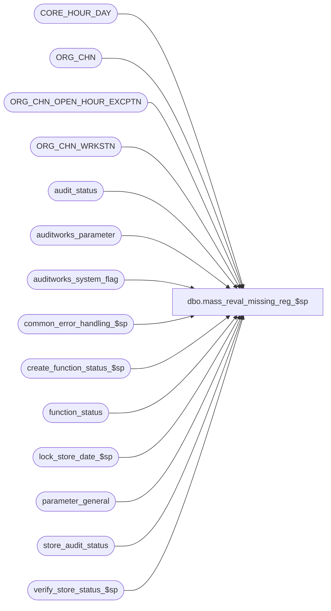

# dbo.mass_reval_missing_reg_$sp

**Database:** auditworks  
**Server:** bedrockdb01  

## Architecture Diagram



## Table Dependencies

| Referenced Table |
|---|
| CORE_HOUR_DAY |
| ORG_CHN |
| ORG_CHN_OPEN_HOUR_EXCPTN |
| ORG_CHN_WRKSTN |
| audit_status |
| auditworks_parameter |
| auditworks_system_flag |
| common_error_handling_$sp |
| create_function_status_$sp |
| function_status |
| lock_store_date_$sp |
| parameter_general |
| store_audit_status |
| verify_store_status_$sp |

## Stored Procedure Code

```sql
create proc dbo.mass_reval_missing_reg_$sp 
( @process_id               binary(16),
  @user_id                  int
)

AS

/*
    Proc Name : mass_reval_missing_reg_$sp
    Desc      : To re-evaluate audit_status rows with status = 5 (missing)
                in audit_status and store_audit_status in case tm has been done to flag them as closed.
                Called by mass_auto_revalidate_$sp.

 HISTORY:
Date     Name              Def#  Desc
Nov14,14 Vicci         TFS-92326 Since this proc is called from mass_auto_revalidate_$sp within a try/catch @@error can't be checked.
 			         Take into account the fact that the value of the output parameter of a proc called with a TRY/CATCH is not returned 
                                 to the calling proc when a raise-error occurs, when calling lock_store_date_$sp.  Do not report individual 201571 errors
                                 since individual pre-verified 201550 errors have already been reported by the lock_store_date_$sp proc.
Jun14,10 Paul            115882  port 113433 to mssql
Feb10,10 Vicci           115882  Allow failure to be recovered:  use correct process number and log store/reg/date to function_status.
				 Revalidate missing status even if not in scaleout mode.
Jan22,10 Vicci           115524  Don't set status to closed when it should be missing.  Ensure conditions match those in verify_register_$sp
Nov24,09 Paul            113433  author

*/

DECLARE
  @cursor_open                 tinyint,
  @errmsg                      nvarchar(255),
  @errno                       int,
  @function_no                 tinyint,
  @inlock			smallint,
  @last_date_closed		smalldatetime,
  @message_id                  int,
  @object_name                 nvarchar(255),
  @operation_name              nvarchar(100),
  @post_midnight_time		datetime,
  @prev_store_no		int,
  @prev_sales_date		smalldatetime,
  @process_name                nvarchar(100),
  @register_no			smallint,
  @rows                        int,
  @sales_date			smalldatetime,
  @scaleout_flag		int,
  @skipstore			smallint,
  @status_flag			smallint,
  @status_date			smalldatetime,
  @store_no                    int,
  @table_exists			tinyint


  SELECT @cursor_open = 0,
       @function_no = 67,
       @message_id = 201068,
       @process_name = 'mass_reval_missing_reg_$sp',
       @status_date = getdate()

  SELECT @scaleout_flag = CONVERT(int,flag_numeric_value)
    FROM auditworks_system_flag
   WHERE flag_name = 'scaleout_flag'

  SELECT @rows = @@rowcount, @errno = @@error
  IF @errno != 0 OR @rows = 0
   BEGIN
     SELECT @errmsg = 'Failed to select scaleout_flag from auditworks_system_flag',
	    @object_name = 'auditworks_system_flag',
	    @operation_name = 'SELECT'
     GOTO error
   END

  IF @scaleout_flag = 2 --don't run on consolidated since no data resides there.
    RETURN
  
  SELECT @last_date_closed = last_date_closed
    FROM parameter_general WITH (NOLOCK)

  SELECT @errno = @@error
  IF @errno != 0
  BEGIN
    SELECT @errmsg = 'Failed to select from last_date_closed',
           @object_name = 'parameter_general',
           @operation_name = 'SELECT'
    GOTO error
  END

  SELECT @post_midnight_time = CONVERT(datetime, '01/01/1900 ' + LEFT(RIGHT('0000' + LTRIM(par_value),4),2) + ':' + RIGHT(par_value,2))
    FROM auditworks_parameter
   WHERE par_name = 'default_post_midnight_time'

  SELECT @errno = @@error
  IF @errno != 0
  BEGIN
    SELECT @errmsg = 'Failed to select default_post_midnight_time',
           @object_name = 'auditworks_parameter',
           @operation_name = 'SELECT'
    GOTO error
  END

  CREATE TABLE #reval_reg_list (
	store_no int not null,
	register_no smallint not null,
	sales_date smalldatetime not null,
	status_flag smallint null,
	OPEN_HOUR_ID binary(16) null) 

  SELECT @errno = @@error
  IF @errno != 0
  BEGIN
    SELECT @errmsg = 'Failed to create temp table #reval_reg_list',
           @object_name = '#reval_reg_list',
           @operation_name = 'CREATE'
    GOTO error
  END

  SELECT @table_exists = 1

  /* Search only for missing registers that might become flagged as closed. */

  INSERT INTO #reval_reg_list (
     	        store_no,
     	        register_no,
                sales_date,
                status_flag,
                OPEN_HOUR_ID)
  SELECT st.store_no ,
                st.register_no,
                st.sales_date,
                st.audit_status,
    org.OPEN_HOUR_ID
   FROM audit_status st, ORG_CHN_WRKSTN r, ORG_CHN org
  WHERE st.audit_status = 5
    AND st.sales_date > COALESCE(@last_date_closed, CONVERT(smalldatetime,'01/01/1970'))
    AND st.valid_qty = 0
    AND st.store_no = r.ORG_CHN_NUM
    AND st.register_no = r.WRKSTN_NUM
    AND st.store_no = org.ORG_CHN_NUM

  SELECT @errno = @@error
  IF @errno != 0
  BEGIN
    SELECT @errmsg = 'Failed to get list of missing registers',
           @object_name = '#reval_reg_list',
           @operation_name = 'INSERT'
    GOTO error
  END

  --
  -- Do not re-evaluate missing/unused for any store which is accepted/completed
  --

  DELETE #reval_reg_list
  FROM #reval_reg_list sl, store_audit_status st
  WHERE st.store_no            = sl.store_no
    AND st.sales_date          = sl.sales_date
    AND st.date_reject_id      = 0
    AND st.store_audit_status >= 300
    AND st.store_audit_status  < 899

  SELECT @errno = @@error
  IF @errno != 0
  BEGIN
    SELECT @errmsg = 'Failed to delete from #reval_reg_list',
           @object_name = '#reval_reg_list',
           @operation_name = 'DELETE'
    GOTO error
  END

  --
  -- Update status to 901 for store-dates that have been flagged as closed
  --

  UPDATE #reval_reg_list
   SET status_flag = 901
    FROM #reval_reg_list sl, ORG_CHN oc
   WHERE sl.status_flag <> 901
     AND sl.store_no   = oc.ORG_CHN_NUM
     AND ((oc.CLS_DATE IS NOT NULL AND oc.CLS_DATE <= sl.sales_date)
           OR
          (oc.OPEN_DATE IS NOT NULL AND oc.OPEN_DATE > sl.sales_date))

  SELECT @errno = @@error
  IF @errno != 0
  BEGIN
    SELECT @errmsg = 'Failed to flag closed stores and their registers (901) based on CLS_DATE',
           @object_name = '#reval_reg_list',
           @operation_name = 'UPDATE'
    GOTO error
  END

  UPDATE #reval_reg_list
   SET status_flag = 901
    FROM #reval_reg_list sl, ORG_CHN_OPEN_HOUR_EXCPTN cd
   WHERE sl.status_flag <> 901
     AND sl.store_no   = cd.ORG_CHN_NUM
     AND sl.sales_date = cd.EXCPTN_DATE
     AND cd.CLSD = 1
     AND NOT EXISTS( SELECT 1
                       FROM ORG_CHN_OPEN_HOUR_EXCPTN cd2 
                      WHERE sl.store_no   = cd2.ORG_CHN_NUM
                        AND sl.sales_date = cd2.EXCPTN_DATE
                        AND cd2.CLSD = 0
                        AND (cd2.START_TIME <> CONVERT(datetime,'01/01/1900')
                             OR cd2.END_TIME  > @post_midnight_time))
  SELECT @errno = @@error
  IF @errno != 0
  BEGIN
    SELECT @errmsg = 'Failed to flag closed stores and their registers (901)',
           @object_name = '#reval_reg_list',
           @operation_name = 'UPDATE'
    GOTO error
  END

  -- If store was closed for a special occasion, then flag as closed. 
  -- Ignore store/dates that are opened from midnight to < the default post midnight time. 
  -- Those were store/dates opened the previous day but not closed until after midnight.
    
  -- If store is not supposed to be opened on that day of the week, then flag as Closed. 

  UPDATE #reval_reg_list
   SET status_flag = 901
    FROM #reval_reg_list sl
   WHERE sl.status_flag = 5
     AND sl.OPEN_HOUR_ID IS NOT NULL
     AND NOT EXISTS (SELECT 1 FROM CORE_HOUR_DAY chd
                      WHERE chd.HOUR_ID = sl.OPEN_HOUR_ID
                        AND chd.DAY_NUM = (DATEPART (dw, sl.sales_date) + @@datefirst - 1) % 7
                        AND (chd.START_TIME <> '01/01/1900 12:00am' OR chd.END_TIME > @post_midnight_time ) )
  SELECT @errno = @@error
  IF @errno != 0
  BEGIN
    SELECT @errmsg = 'Failed to set status_flag = 901 (day of week)',
           @object_name = '#reval_reg_list',
           @operation_name = 'UPDATE'
    GOTO error
  END

  SELECT @skipstore = 0,
	@prev_store_no = -1,
	@prev_sales_date = NULL

  DECLARE reval_missing_reg_crsr CURSOR FAST_FORWARD
  FOR
  SELECT store_no, sales_date, register_no, status_flag
   FROM #reval_reg_list
   WHERE status_flag != 5
   ORDER BY store_no, sales_date

  SELECT @errno = @@error
  IF @errno != 0
  BEGIN
    SELECT @errmsg         = 'Failed to declare reval_missing_reg_crsr CURSOR',
           @object_name    = 'reval_missing_reg_crsr',
           @operation_name = 'DECLARE'
    GOTO error
  END

  OPEN reval_missing_reg_crsr

  SELECT @errno = @@error
  IF @errno != 0
  BEGIN
    SELECT @errmsg         = 'Failed to open reval_missing_reg_crsr CURSOR',
           @object_name    = 'reval_missing_reg_crsr',
           @operation_name = 'OPEN'
    GOTO error
  END

  SELECT @cursor_open = 1


  WHILE 1 = 1
  BEGIN

    FETCH reval_missing_reg_crsr
     INTO @store_no,
          @sales_date,
          @register_no,
          @status_flag

    IF @@fetch_status <> 0
      SELECT @store_no = -1

    IF ((@store_no <> @prev_store_no)
      OR  (@sales_date <> @prev_sales_date)
      OR  (@prev_sales_date IS NULL)) -- THEN change of store/date
    BEGIN

      IF @inlock <> 0 -- THEN unlock previous store/date
        BEGIN
	-- set store_audit_status and unlock store-date

	 EXEC verify_store_status_$sp @process_id, @user_id, @prev_store_no, @prev_sales_date, 0, @errmsg, 3, 0

	 SELECT @errno = @@error
	 IF @errno != 0
	   BEGIN
	    SELECT @errmsg         = 'Failed to execute stored procedure verify_store_status_$sp',
	           @object_name    = 'reval_missing_reg_crsr',
	           @operation_name = 'EXECUTE'
	    GOTO error
	   END

	 DELETE function_status
	  WHERE user_id = @user_id
	    AND function_no = @function_no
	    AND process_id = @process_id

	 SELECT @errno = @@error
	 IF @errno != 0
	   BEGIN
	    SELECT @errmsg         = 'Failed to delete function_no = 67 from function_status',
	           @object_name    = 'function_status',
	           @operation_name = 'DELETE'
	    GOTO error
	   END

        END -- If @inlock <> 0

      SELECT @inlock = 0

      IF @store_no >= 0
      	BEGIN -- lock new store/date
      	
      	SELECT @message_id = NULL;
        BEGIN TRY 
           EXEC lock_store_date_$sp @process_id, @user_id, @store_no, @sales_date, 0, @function_no, @message_id OUTPUT;
        END TRY
        BEGIN CATCH
          SELECT @errno = ERROR_NUMBER();
          IF @message_id IS NULL OR @message_id = 0
            SELECT @message_id = @errno;
        END CATCH;          
        IF @errno != 0 AND @message_id <> 201550 AND @errno <> 201550
          BEGIN
           SELECT @errmsg = 'Failed to execute lock_store_date_$sp',
		  @object_name = 'lock_store_date_$sp',
		  @operation_name = 'EXEC'
           GOTO error
          END

	IF @message_id = 0 -- successfully locked
		BEGIN
		 SELECT @inlock = 1,
			@skipstore = 0

		  -- record for cleanup of locked store_audit_status
		 EXEC create_function_status_$sp @process_id, @user_id, @function_no, 0, @errmsg, @store_no, @sales_date
		 SELECT @errno = @@error

		 IF @errno != 0
		   BEGIN
		    IF @errmsg IS NULL
		      SELECT @errmsg = 'Failed to execute stored proc create_function_status_$sp'
		    SELECT @object_name    = 'create_function_status_$sp',
		           @operation_name = 'EXECUTE'
		    GOTO error
		   END

		END
	ELSE -- (@message_id != 0) unable to lock, skip all registers for store-date
		SELECT @skipstore = 1

      END -- If @store_no >= 0

      SELECT @prev_store_no = @store_no,
		@prev_sales_date = @sales_date

    END -- If change of store/date

    IF @store_no < 0 -- no more data
       BREAK

    IF @skipstore = 0
	BEGIN
	  UPDATE audit_status
	   SET audit_status = @status_flag,
		     status_date = @status_date
	   WHERE sales_date = @sales_date
	     AND store_no = @store_no
	     AND register_no = @register_no
	     AND audit_status IN (5, 900) -- safety check
	     AND date_reject_id = 0

	  SELECT @errno = @@error
	  IF @errno != 0
	    BEGIN
	     SELECT @errmsg         = 'Failed to set audit_status',
		    @object_name    = 'audit_status',
		    @operation_name = 'UPDATE'
	     GOTO error
	    END
	END -- If @skipstore = 0

  END -- While 1=1


  CLOSE reval_missing_reg_crsr
  DEALLOCATE reval_missing_reg_crsr

  DROP TABLE #reval_reg_list

RETURN


error:
  IF @cursor_open = 1
  BEGIN
    CLOSE reval_missing_reg_crsr
    DEALLOCATE reval_missing_reg_crsr
  END

  IF @table_exists = 1
    DROP TABLE #reval_reg_list

  EXEC common_error_handling_$sp @function_no, @errno, @errmsg, 0, @message_id, 
                                 @process_name, @object_name, @operation_name, 0, 1, 0, null, 0, null, null, null,
	                         null, null, null, 0, @process_id, @user_id

  RETURN
```

