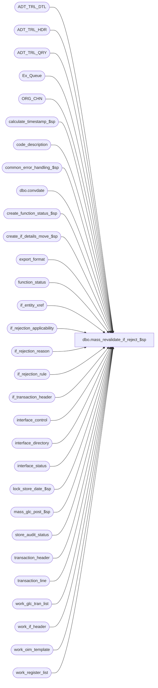

# dbo.mass_revalidate_if_reject_$sp

**Database:** auditworks  
**Server:** bedrockdb01  

## Architecture Diagram



## Table Dependencies

| Referenced Table |
|---|
| ADT_TRL_DTL |
| ADT_TRL_HDR |
| ADT_TRL_QRY |
| Ex_Queue |
| ORG_CHN |
| calculate_timestamp_$sp |
| code_description |
| common_error_handling_$sp |
| dbo.convdate |
| create_function_status_$sp |
| create_if_details_move_$sp |
| export_format |
| function_status |
| if_entity_xref |
| if_rejection_applicability |
| if_rejection_reason |
| if_rejection_rule |
| if_transaction_header |
| interface_control |
| interface_directory |
| interface_status |
| lock_store_date_$sp |
| mass_glc_post_$sp |
| store_audit_status |
| transaction_header |
| transaction_line |
| work_glc_tran_list |
| work_if_header |
| work_oim_template |
| work_register_list |

## Stored Procedure Code

```sql
create proc dbo.mass_revalidate_if_reject_$sp 
( @process_id               binary(16),
  @user_id                  int,
  @if_rejection_reason      smallint,
  @revalidate_spid          binary(16) = NULL, -- null means all transactions for the specified @if_rejection_reason
  @allow_override           tinyint       = 0 -- 1 = override option in frontend
)

AS

/*
PROCNAME: mass_revalidate_if_reject_$sp
    DESC: Revalidate externally detected i/f rejects (where external_detection > 0 in if_rejection_rule),
          by feeding them (again) to the applicable interfaces.
          All other revalidation is done by background process mass_auto_revalidate_$sp as of SA5.
          Called by frontend. 

 HISTORY:
Date     Name             Defect  Desc
Nov14,14 Vicci          TFS-92326 Take into account the fact that the value of the output parameter of a proc called with a TRY/CATCH is not returned 
                                  to the calling proc when a raise-error occurs, when calling lock_store_date_$sp.  Do not report individual 201571 errors
                                  since individual pre-verified 201550 errors have already been reported by the lock_store_date_$sp proc.
Apr28,11 Vicci             125576 Correct logging of ADT_TRL_DTL.TBL_KEY_RSRC_PRMS to fit in nvarchar(255).
Mar25,11 Vicci             125576 Compensate for UI defect (they were passing user-id instead of process-id as revalidation_spid).
Oct05,07 Paul               91395 uplift 87372 to SA5
May01,07 Phu              DV-1364 85598 does not apply to this proc in SA5.
Apr20,07 PaulS            DV-1356 uplift 73592 to SA5
Oct25,06 Phu              77931   Fix outer join for SQL 2005 Mode 90.
Nov30,05 Paul             DV-1325 drop temp tables when finished, add nolock hints
Nov11,05 Paul             DV-1322 updated comments
Jul05,05 Paul             DV-1239 Use tran_id_datatype
Apr28,05 Paul             DV-1234 remove logic that has been moved to mass_auto_revalidate_$sp
Mar22,05 Paul             DV-1218 Changed audit trail seperator, comments
Sep17,04 Maryam           DV-1146 Change user_name to user_id.
Aug30,04 Maryam           DV-1120 Use convdate function for dates when logging the audit trail.
Jul27,04 Maryam           DV-1071 insert into new audit trail, receive @process_id.
May20,04 David            DV-1071 Use ORG_CHN table as new the Store table.
Jun01,07 Phu              87372   Validate Employee Attribute I/F rejects 38-41.
Apr11,07 Phu              85598   Call mass_correct_emp_attribute_$sp to validate Employee Attribute I/F rejects 21-37.
Jun15,06 Vicci            73592   Skip store/dates locked by the Edit since lock will be held all day
Apr02,04 Phu              27391   Retrieve negative entity code in memo1 to revalidate Offline Stock
Feb08,04 Phu              21459   Set if_rejection_flag to 0 if there is no more reject
Feb03,04 Phu              21723   Fix error converting data type nvarchar to numeric
Dec02,03 Phu              15801   Initial development

*/

DECLARE
  @all_rejects_fixed           int,
  @auto_set_posting            int,
  @cursor_open                 tinyint,
  @edit_timestamp              float,
  @entry_date_time             datetime,
  @errmsg                      nvarchar(255),
  @errno                       int,
  @function_no                 tinyint,
  @glc_rows                    int,
  @if_rejection_description    nvarchar(255),
  @message_id                  int,
  @object_name                 nvarchar(255),
  @operation_name              nvarchar(100),
  @post_audit_trans            int,
  @process_name                nvarchar(100),
  @reject_description          nvarchar(255),
  @replace_upc_flag            tinyint,
  @ret                         int,
  @rows                        int,
  @sep			       nchar(1),
  @store_name                  nvarchar(30),
  @store_no                    int,
  @transaction_date            smalldatetime,
  @all_selected_flag           tinyint,
  @ENTRY_ID                    binary(16),
  @all_selected_descr          nvarchar(255),
  @some_skipped                int

IF @revalidate_spid IS NOT NULL 
BEGIN
  SELECT @revalidate_spid = @process_id  --Defect 125576
END

IF @if_rejection_reason IS NULL -- invalid option
  RETURN

SELECT @auto_set_posting = 0,
       @cursor_open = 0,
       @entry_date_time = getdate(),
       @function_no = 91, --Mass Revalidate -Externally detected I/F rejects 
       @message_id = 201068,
       @process_name = 'mass_revalidate_if_reject_$sp',
       @replace_upc_flag = 0,
       @all_selected_flag = 0, -- selected transactions
       @sep = NCHAR(12), -- audit trail seperator
       @some_skipped = 0

IF @allow_override = 1
  SELECT @function_no = 94 --Mass Override

IF @revalidate_spid IS NULL
SELECT @all_selected_flag = 1  --all transactions
 
EXEC calculate_timestamp_$sp @edit_timestamp OUTPUT
SELECT @errno = @@error
IF @errno != 0
BEGIN
  SELECT @errmsg = 'Unable to execute stored procedure calculate_timestamp_$sp',
	 @object_name = 'calculate_timestamp_$sp',
	 @operation_name = 'EXEC'
  GOTO error
END

-- Revalidate Externally Detected i/f rejections, e.g. i/f reject reason 107.
-- In SA5, all other revalidation logic is now in mass_auto_revalidate_$sp.

SELECT DISTINCT
    h.transaction_id, h.store_no, h.register_no, h.transaction_date, h.transaction_no,
    h.transaction_series, h.entry_date_time, h.date_reject_id, h.cashier_no, h.till_no
  INTO #oim_unverify
  FROM if_rejection_reason ire, transaction_header h
  WHERE ire.if_reject_reason = @if_rejection_reason
  AND (ire.process_id = @revalidate_spid OR @revalidate_spid IS NULL)
  AND ire.transaction_id = h.transaction_id

  SELECT @errno = @@error, @rows = @@rowcount
  IF @errno != 0
  BEGIN
    SELECT @errmsg = 'Unable to select into #oim_unverify',
           @object_name = '#oim_unverify',
           @operation_name = 'SELECT_INTO'
    GOTO error
  END

  IF @rows = 0
  BEGIN
    DROP TABLE #oim_unverify
    RETURN
  END

  SELECT @if_rejection_description = if_rejection_description
  FROM if_rejection_rule
  WHERE if_rejection_reason = @if_rejection_reason

  SELECT @errno = @@error
  IF @errno != 0
  BEGIN
    SELECT @errmsg = 'Unable to select from if_rejection_rule',
           @object_name = 'if_rejection_rule',
           @operation_name = 'SELECT'
    GOTO error
  END

  SELECT interface_id
  INTO #auto_set_posting
  FROM work_oim_template

  SELECT @errno = @@error
  IF @errno != 0
  BEGIN
    SELECT @errmsg = 'Unable to create (select into) table #auto_set_posting from work_oim_template',
           @object_name = '#auto_set_posting',
           @operation_name = 'SELECT_INTO'
    GOTO error
  END

  SELECT transaction_id, line_id, if_reject_reason,
         store_no, register_no, transaction_date, transaction_no,
         transaction_series, entry_date_time, date_reject_id, cashier_no,
         till_no, interface_id, interface_status_flag, all_rejects_fixed,
         validation_id, validation_description, tab_delimited_token_list
  INTO #oim_verify_reject
  FROM work_oim_template

  SELECT @errno = @@error
  IF @errno != 0
  BEGIN
    SELECT @errmsg = 'Unable to create (select into) table #oim_verify_reject from work_oim_template',
           @object_name = '#oim_verify_reject',
           @operation_name = 'SELECT_INTO'
    GOTO error
  END

  SELECT transaction_id, line_id, if_reject_reason,
         store_no, register_no, transaction_date, transaction_no,
         transaction_series, entry_date_time, date_reject_id, cashier_no,
         till_no, interface_id, interface_status_flag, all_rejects_fixed,
         validation_id, validation_description, tab_delimited_token_list
    INTO #oim_trans_verified
    FROM work_oim_template

  SELECT @errno = @@error
  IF @errno != 0
  BEGIN
    SELECT @errmsg = 'Unable to create (select into) table #oim_trans_verified from work_oim_template',
           @object_name = '#oim_trans_verified',
           @operation_name = 'SELECT_INTO'
    GOTO error
  END

  CREATE TABLE #oim_ver_count_reject (
    interface_id               tinyint       not null,
    transaction_id             numeric(14,0) not null, -- tran_id_datatype
    count_reject_reason        int           not null,
    all_rejects_fixed          tinyint not null )

  SELECT @errno = @@error
  IF @errno != 0
  BEGIN
   SELECT @errmsg = 'Unable to create temp table #oim_ver_count_reject',
           @object_name = '#oim_ver_count_reject',
           @operation_name = 'CREATE'
    GOTO error
  END

  CREATE TABLE #oim_count_reject (
    interface_id               tinyint       not null,
    transaction_id             numeric(14,0) not null, -- tran_id_datatype
    count_reject_reason        int           not null )

  SELECT @errno = @@error
  IF @errno != 0
  BEGIN
    SELECT @errmsg = 'Unable to create temp table #oim_count_reject',
           @object_name = '#oim_count_reject',
           @operation_name = 'CREATE'
    GOTO error
  END

  -- retrieve trans for all if reject reasons where external_detection > 0
  INSERT INTO #oim_verify_reject (
    transaction_id, line_id, if_reject_reason,
    store_no, register_no, transaction_date, transaction_no,
  transaction_series, entry_date_time, date_reject_id, cashier_no,
    till_no, interface_id, interface_status_flag, all_rejects_fixed,
    validation_id, validation_description, tab_delimited_token_list)
  SELECT
    ire.transaction_id, ire.line_id, ire.if_reject_reason,
    t.store_no, t.register_no, t.transaction_date, t.transaction_no,
    t.transaction_series, t.entry_date_time, t.date_reject_id, t.cashier_no,
    t.till_no, ISNULL(x.interface_id, CONVERT(SMALLINT, ire.memo1)), 1, 0,
    ire.memo2, ire.other_information, ire.tab_delimited_token_list
  FROM #oim_unverify t
       INNER JOIN if_rejection_reason ire WITH (NOLOCK) ON (t.transaction_id = ire.transaction_id)
       INNER JOIN if_rejection_rule iru WITH (NOLOCK) ON (ire.if_reject_reason = iru.if_rejection_reason)
       LEFT JOIN if_entity_xref x ON ((CONVERT(SMALLINT, ire.memo1) * -1) = x.entity_code)
  WHERE iru.external_detection > 0

  SELECT @errno = @@error
  IF @errno != 0
  BEGIN
    SELECT @errmsg = 'Unable to insert into #oim_verify_reject where external_detection > 0', 
           @object_name = '#oim_verify_reject',
           @operation_name = 'INSERT'
    GOTO error
  END

  IF @allow_override > 0
  BEGIN
    UPDATE interface_control
    SET if_rejection_rules_overriden = 1
    FROM #oim_verify_reject t, interface_control c
    WHERE t.if_reject_reason = @if_rejection_reason
    AND t.transaction_id = c.transaction_id
    AND t.interface_id = c.interface_id

    SELECT @errno = @@error
    IF @errno != 0
    BEGIN
      SELECT @errmsg = 'Unable to update interface_control',
             @object_name = 'interface_control',
             @operation_name = 'UPDATE'
      GOTO error
    END
  END

  -- count current if reject reason per interface_id, transaction_id
  INSERT INTO #oim_ver_count_reject (
    interface_id, transaction_id, count_reject_reason, all_rejects_fixed )
  SELECT interface_id, transaction_id, COUNT(if_reject_reason), 0
  FROM #oim_verify_reject
  WHERE if_reject_reason = @if_rejection_reason
  GROUP BY transaction_id, interface_id

  SELECT @errno = @@error
  IF @errno != 0
  BEGIN
    SELECT @errmsg = 'Unable to insert #oim_ver_count_reject',
           @object_name = '#oim_ver_count_reject',
           @operation_name = 'INSERT'
    GOTO error
  END

  -- retrieve transaction id, interface_id where external_detection = 0
  INSERT INTO #oim_verify_reject (
    transaction_id, line_id, if_reject_reason,
    store_no, register_no, transaction_date, transaction_no,
    transaction_series, entry_date_time, date_reject_id, cashier_no,
    till_no, interface_id, interface_status_flag, all_rejects_fixed,
    validation_id, validation_description, tab_delimited_token_list )
  SELECT
    ire.transaction_id, ire.line_id, ire.if_reject_reason,
    t.store_no, t.register_no, t.transaction_date, t.transaction_no,
    t.transaction_series, t.entry_date_time, t.date_reject_id, t.cashier_no,
    t.till_no, ia.interface_id, id.update_timing, 0,
    ire.memo2, ire.other_information, ire.tab_delimited_token_list 
 FROM #oim_unverify t, if_rejection_reason ire WITH (NOLOCK), if_rejection_applicability ia WITH (NOLOCK),
       if_rejection_rule iru WITH (NOLOCK), interface_directory id WITH (NOLOCK), interface_control ic WITH (NOLOCK)
  WHERE t.transaction_id = ire.transaction_id
  AND t.transaction_id = ic.transaction_id
  AND ire.if_reject_reason = ia.if_reject_reason
  AND ire.if_reject_reason = iru.if_rejection_reason
  AND ia.interface_id = ic.interface_id
  AND ia.interface_id = id.interface_id
  AND iru.external_detection = 0
  AND ic.interface_status_flag = 99
  AND id.update_timing >= 1
  AND id.applicability_method < 2

  SELECT @errno = @@error
  IF @errno != 0
  BEGIN
    SELECT @errmsg = 'Unable to insert #oim_verify_reject where applicability_method < 2',
           @object_name = '#oim_verify_reject',
           @operation_name = 'INSERT'
    GOTO error
  END

  INSERT INTO #oim_verify_reject (
    transaction_id, line_id, if_reject_reason,
    store_no, register_no, transaction_date, transaction_no,
    transaction_series, entry_date_time, date_reject_id, cashier_no,
    till_no,interface_id, interface_status_flag, all_rejects_fixed,
    validation_id, validation_description, tab_delimited_token_list)
  SELECT
    ire.transaction_id, ire.line_id, ire.if_reject_reason,
    t.store_no, t.register_no, t.transaction_date, t.transaction_no,
    t.transaction_series, t.entry_date_time, t.date_reject_id, t.cashier_no,
    t.till_no, ia.interface_id, id.update_timing, 0,
    ire.memo2, ire.other_information, ire.tab_delimited_token_list 
  FROM #oim_unverify t, if_rejection_reason ire WITH (NOLOCK), if_rejection_applicability ia WITH (NOLOCK),
       if_rejection_rule iru WITH (NOLOCK), interface_directory id WITH (NOLOCK)
  WHERE t.transaction_id = ire.transaction_id
  AND ire.if_reject_reason = ia.if_reject_reason
  AND ire.if_reject_reason = iru.if_rejection_reason
  AND ia.interface_id = id.interface_id
  AND iru.external_detection = 0
  AND id.update_timing >= 1
  AND id.applicability_method = 2

  SELECT @errno = @@error
  IF @errno != 0
  BEGIN
    SELECT @errmsg = 'Unable to insert #oim_verify_reject where applicability_method = 2',
           @object_name = '#oim_verify_reject',
           @operation_name = 'INSERT'
    GOTO error
  END

  -- count all if reject reasons per interface_id, transaction_id
  INSERT INTO #oim_count_reject (
    interface_id, transaction_id, count_reject_reason )
  SELECT interface_id, transaction_id, COUNT(if_reject_reason)
  FROM #oim_verify_reject
  GROUP BY interface_id, transaction_id

  SELECT @errno = @@error
  IF @errno != 0
  BEGIN
    SELECT @errmsg = 'Unable to insert #oim_count_reject (1)',
           @object_name = '#oim_count_reject',
           @operation_name = 'INSERT'
    GOTO error
  END

  -- set all_rejects_fixed flag to 1 if there is no more reject per interface_id, transaction_id
  UPDATE #oim_ver_count_reject
  SET all_rejects_fixed = 1
  FROM #oim_ver_count_reject t1, #oim_count_reject t2
  WHERE t1.transaction_id = t2.transaction_id
  AND t1.interface_id = t2.interface_id
  AND t1.count_reject_reason = t2.count_reject_reason

  SELECT @errno = @@error
  IF @errno != 0
  BEGIN
    SELECT @errmsg = 'Unable to update #oim_ver_count_reject',
 @object_name = '#oim_ver_count_reject',
           @operation_name = 'UPDATE'
    GOTO error
  END

  UPDATE #oim_verify_reject
  SET all_rejects_fixed = 1
  FROM #oim_verify_reject t1, #oim_ver_count_reject t2
  WHERE t1.interface_id = t2.interface_id
  AND t1.transaction_id = t2.transaction_id
  AND t2.all_rejects_fixed = 1

  SELECT @errno = @@error
  IF @errno != 0
  BEGIN
    SELECT @errmsg = 'Unable to update #oim_verify_reject',
           @object_name = '#oim_verify_reject',
           @operation_name = 'UPDATE'
    GOTO error
  END

  -- remove unwanted trans
  DELETE FROM #oim_verify_reject
  WHERE if_reject_reason <> @if_rejection_reason

  SELECT @errno = @@error
  IF @errno != 0
  BEGIN
    SELECT @errmsg = 'Unable to delete unwanted trans in #oim_verify_reject',
           @object_name = '#oim_verify_reject',
           @operation_name = 'DELETE'
    GOTO error
  END

  -- re-evaluate if_rejections for one store-date at a time
  DECLARE oim_mass_correct_crsr CURSOR FAST_FORWARD
FOR
  SELECT DISTINCT
    u.store_no,
    u.transaction_date
   FROM #oim_verify_reject u WITH (NOLOCK), store_audit_status s  --73592
  WHERE u.store_no = s.store_no
    AND u.transaction_date = s.sales_date
    AND s.date_reject_id = 0
    AND s.update_in_progress NOT IN (1,4)  --don't revalidate if trickle-edit has date locked
  ORDER BY u.store_no, u.transaction_date

  OPEN oim_mass_correct_crsr

  SELECT @errno = @@error
  IF @errno != 0
  BEGIN
    SELECT @errmsg = 'Failed to open cursor oim_mass_correct_crsr',
           @object_name = 'oim_mass_correct_crsr',
           @operation_name = 'OPEN'
    GOTO error
  END

  SELECT @cursor_open = 1

  WHILE 1 = 1
  BEGIN
    FETCH oim_mass_correct_crsr INTO
      @store_no,
      @transaction_date

    IF @@fetch_status <> 0
      BREAK

    DELETE work_glc_tran_list
    WHERE process_id = @process_id

    SELECT @errno = @@error
    IF @errno != 0
    BEGIN
      SELECT @errmsg = 'Failed to delete work_glc_tran_list',
             @object_name = 'work_glc_tran_list',
             @operation_name = 'DELETE'
      GOTO error
    END

    DELETE work_register_list
    WHERE process_id = @process_id

    SELECT @errno = @@error
    IF @errno != 0
    BEGIN
      SELECT @errmsg = 'Failed to delete work_register_list',
             @object_name = 'work_register_list',
             @operation_name = 'DELETE'
      GOTO error
    END

    DELETE work_if_header
    WHERE process_id = @process_id

    SELECT @errno = @@error
    IF @errno != 0
    BEGIN
      SELECT @errmsg = 'Failed to delete rows from table work_if_header',
             @object_name = 'work_if_header',
             @operation_name = 'DELETE'
      GOTO error
    END

    TRUNCATE TABLE #oim_trans_verified
    SELECT @errno = @@error
    IF @errno != 0
    BEGIN
      SELECT @errmsg = 'Failed to truncate table #oim_trans_verified',
             @object_name = '#oim_trans_verified',
             @operation_name = 'TRUNCATE'
      GOTO error
    END

    -- Lock store-date
    SELECT @ret = NULL;
    BEGIN TRY 
      EXEC lock_store_date_$sp @process_id, @user_id, @store_no, @transaction_date, 0, @function_no, @ret OUTPUT;
    END TRY
    BEGIN CATCH
    SELECT @errno = ERROR_NUMBER();
    IF @ret IS NULL OR @ret = 0
      SELECT @ret = @errno;
    END CATCH;          
    IF @errno != 0 AND @ret <> 201550 AND @errno <> 201550
    BEGIN
      SELECT @errmsg = 'Failed to execute lock_store_date_$sp',
             @object_name = 'lock_store_date_$sp',
             @operation_name = 'EXEC'
      GOTO error
    END

    IF @ret = 0
    BEGIN
      EXEC create_function_status_$sp @process_id, @user_id, @function_no, 0,
           @errmsg OUTPUT, @store_no, @transaction_date, 0

      SELECT @errno = @@error
      IF @errno != 0
      BEGIN
        SELECT @errmsg = ISNULL(@errmsg, 'Failed to execute stored proc create_function_status_$sp'),
               @object_name = 'create_function_status_$sp',
               @operation_name = 'EXEC'
        GOTO error
      END
    END
    ELSE -- unable to lock, skip all transactions for store-date
    BEGIN
      SELECT @some_skipped = 1
      CONTINUE
    END -- else of if @ret = 0

    INSERT INTO #oim_trans_verified (
      transaction_id, line_id, if_reject_reason,
      store_no, register_no, transaction_date, transaction_no,
      transaction_series, entry_date_time, date_reject_id, cashier_no, till_no,
      interface_id, interface_status_flag, all_rejects_fixed,
      validation_id, validation_description, tab_delimited_token_list )
    SELECT
      t.transaction_id, t.line_id, t.if_reject_reason,
      t.store_no, t.register_no, t.transaction_date, t.transaction_no,
      t.transaction_series, t.entry_date_time, t.date_reject_id, t.cashier_no, t.till_no,
      t.interface_id, t.interface_status_flag, t.all_rejects_fixed,
      t.validation_id, t.validation_description, t.tab_delimited_token_list 
    FROM #oim_verify_reject t, transaction_header th WITH (NOLOCK)
    WHERE t.store_no = @store_no
    AND t.transaction_date = @transaction_date
    AND t.transaction_id = th.transaction_id
    AND th.if_rejection_flag = 1  -- ensure hasn't changed since populating work table

    SELECT @errno = @@error
    IF @errno != 0
    BEGIN
      SELECT @errmsg = 'Unable to insert into #oim_trans_verified from #oim_verify_reject',
	@object_name = '#oim_trans_verified',
	@operation_name = 'INSERT'
      GOTO error
    END

    -- save list of store-reg-dates affected
    INSERT work_register_list (
      process_id,
      store_no,
      transaction_date,
      date_reject_id,
      register_no,
      function_no )
    SELECT DISTINCT
      @process_id,
      store_no,
      transaction_date,
      date_reject_id,
      register_no,
      @function_no
    FROM #oim_trans_verified

    SELECT @errno = @@error
    IF @errno != 0
    BEGIN
      SELECT @errmsg = 'Failed to insert work_register_list',
             @object_name = 'work_register_list',
             @operation_name = 'INSERT'
      GOTO error
    END

    -- get list of corrected tran which apply to new glc
    INSERT work_glc_tran_list (
      process_id,
      transaction_id )
    SELECT DISTINCT @process_id, transaction_id
    FROM #oim_trans_verified
    WHERE interface_id IN (25,28) -- new cust liability

    SELECT @glc_rows = @@rowcount,
           @errno = @@error
    IF @errno != 0
    BEGIN
      SELECT @errmsg = 'Failed to insert work_glc_tran_list',
             @object_name = 'work_glc_tran_list',
             @operation_name = 'INSERT'
      GOTO error
    END

    UPDATE function_status
    SET status = 2
    WHERE user_id = @user_id
    AND process_id = @process_id
    AND function_no = @function_no

    SELECT @errno = @@error
    IF @errno != 0
    BEGIN
      SELECT @errmsg = 'Failed to update function_status (status=2)',
             @object_name = 'function_status',
             @operation_name = 'UPDATE'
      GOTO error
    END

    INSERT work_if_header (
      process_id,
      transaction_id,
      effective_date,
      entry_date_time )
    SELECT DISTINCT @process_id,
      transaction_id,
      transaction_date,
      entry_date_time
    FROM #oim_trans_verified
    WHERE all_rejects_fixed = 1
    AND interface_status_flag = 1

    SELECT @errno = @@error,
           @all_rejects_fixed = @@rowcount
    IF @errno != 0
    BEGIN
      SELECT @errmsg = 'Failed to insert work_if_header',
        @object_name = 'work_if_header',
             @operation_name = 'INSERT'
     GOTO error
    END

    SELECT @post_audit_trans = COUNT(transaction_id)
    FROM #oim_trans_verified
    WHERE all_rejects_fixed = 1
      AND interface_status_flag = 2

    SELECT @errno = @@error
    IF @errno != 0
    BEGIN
      SELECT @errmsg = 'Failed to select count from #oim_trans_verified',
             @object_name = '#oim_trans_verified',
             @operation_name = 'SELECT'
      GOTO error
    END    

   IF @all_rejects_fixed >= 1 OR @post_audit_trans > 0 -- (1)
    BEGIN
      UPDATE transaction_line
      SET interface_rejection_flag = 0
      FROM #oim_trans_verified tr, transaction_line tl
      WHERE tr.all_rejects_fixed = 1
      AND tr.transaction_id = tl.transaction_id
      AND tr.line_id = tl.line_id

      SELECT @errno = @@error
      IF @errno != 0
      BEGIN
        SELECT @errmsg = 'Failed to update transaction_line (1)',
               @object_name = 'transaction_line',
               @operation_name = 'UPDATE'
        GOTO error
      END
    END  -- if @all_rejects_fixed >= 1 (1)

    IF @all_rejects_fixed >= 1  -- (2)
    BEGIN
      INSERT INTO #auto_set_posting (interface_id)
      SELECT oim.interface_id
      FROM #oim_trans_verified oim, export_format ex
      WHERE oim.all_rejects_fixed = 1
      AND oim.interface_status_flag = 1
      AND oim.interface_id = ex.interface_id
      AND ex.auto_set_posting_request = 1
    AND oim.interface_id NOT IN (SELECT DISTINCT interface_id FROM #auto_set_posting)

      SELECT @errno = @@error, @auto_set_posting = @auto_set_posting + @@rowcount
      IF @errno != 0
      BEGIN
        SELECT @errmsg = 'Unable to insert #auto_set_posting',
               @object_name = '#auto_set_posting',
               @operation_name = 'INSERT'
        GOTO error
      END

      INSERT if_transaction_header (
        store_no,
        register_no,
        transaction_date,
        date_reject_id,
        transaction_series,
        transaction_no,
        entry_date_time,
        cashier_no,
        transaction_category,
        tender_total,
        transaction_void_flag,
        customer_info_exists,
        exception_flag,
        deposit_declaration_flag,
        closeout_flag,
        media_count_flag,
        customer_modified_flag,
        tax_override_flag,
        pos_tax_jurisdiction,
        edit_timestamp,
        employee_no,
        transaction_remark,
        source_process_no,
        last_modified_date_time,
        in_use_timestamp,
        updated_by_user_id,
        transaction_id,
        till_no )
      SELECT
        store_no,        
        register_no,
        transaction_date,
        date_reject_id,
        transaction_series,
        transaction_no,
        th.entry_date_time,
        cashier_no,
        transaction_category,
        tender_total,
        transaction_void_flag,
        customer_info_exists,
        exception_flag,
        deposit_declaration_flag,
        closeout_flag,
        media_count_flag,
        customer_modified_flag,
        tax_override_flag,
        pos_tax_jurisdiction,
        @edit_timestamp,
        employee_no,
        transaction_remark,
        @function_no,
        last_modified_date_time,
        in_use_timestamp,
        updated_by_user_id,
        th.transaction_id,
        th.till_no
      FROM work_if_header wh WITH (NOLOCK), transaction_header th WITH (NOLOCK)
      WHERE process_id = @process_id
      AND wh.transaction_id = th.transaction_id

      SELECT @errno = @@error
      IF @errno != 0
      BEGIN
        SELECT @errmsg = 'Failed to insert if_transaction_header',
               @object_name = 'if_transaction_header',
               @operation_name = 'INSERT'
        GOTO error
      END

      UPDATE work_if_header
      SET if_entry_no = ih.if_entry_no
      FROM work_if_header wh, transaction_header th WITH (NOLOCK), if_transaction_header ih WITH (NOLOCK)
      WHERE wh.process_id = @process_id
      AND wh.transaction_id = th.transaction_id
      AND ih.store_no = th.store_no
      AND ih.transaction_date = th.transaction_date
      AND ih.entry_date_time = th.entry_date_time
      AND ih.register_no = th.register_no
      AND ih.transaction_no = th.transaction_no
      AND ih.transaction_series = th.transaction_series
      AND ih.edit_timestamp = @edit_timestamp

 SELECT @errno = @@error
      IF @errno != 0
      BEGIN
        SELECT @errmsg = 'Failed to update work_if_header',
               @object_name = 'work_if_header',
               @operation_name = 'UPDATE'
        GOTO error
      END
    END  -- if @all_rejects_fixed >= 1  (2)

    -- Call sub-procedure to create entries in the if detail tables
    EXEC create_if_details_move_$sp @process_id, @user_id, 1, @errmsg OUTPUT

    SELECT @errno = @@error
    IF @errno != 0
    BEGIN
      SELECT @errmsg = ISNULL(@errmsg, 'Failed to execute stored procedure create_if_details_move_$sp'),
             @object_name = 'create_if_details_move_$sp',
             @operation_name = 'EXEC'
      GOTO error
    END

    UPDATE transaction_header
    SET last_modified_date_time = @entry_date_time
    FROM #oim_trans_verified t, transaction_header h
    WHERE t.transaction_id = h.transaction_id

    SELECT @errno = @@error
    IF @errno != 0
    BEGIN
      SELECT @errmsg = 'Unable to set last_modified_date_time in transaction_header',
             @object_name = 'transaction_header',
             @operation_name = 'UPDATE'
      GOTO error
    END

    BEGIN TRANSACTION

    IF @all_rejects_fixed >= 1 OR @post_audit_trans > 0 -- (3)
    BEGIN
      UPDATE interface_control
      SET interface_status_flag = tr.interface_status_flag
      FROM #oim_trans_verified tr, interface_control ic
      WHERE tr.all_rejects_fixed = 1
      AND tr.transaction_id = ic.transaction_id
      AND tr.interface_id = ic.interface_id

      SELECT @errno = @@error
      IF @errno != 0
      BEGIN
        SELECT @errmsg = 'Failed to update interface_control',
           @object_name = 'interface_control',
               @operation_name = 'UPDATE'
        GOTO error
      END

      INSERT Ex_Queue (
        queue_id, -- interface_id
        key_1, --if_entry_no
        key_2, --interface_control_flag
        key_4, --if_rejection_rules_overriden
        key_9, -- effective_date
        key_10, -- interface_posting_date
        key_11) -- entry_date_time
      SELECT DISTINCT
        tr.interface_id,
        wh.if_entry_no,
        10,
        ic.if_rejection_rules_overriden,
        tr.transaction_date,
        @entry_date_time,
        wh.entry_date_time
      FROM #oim_trans_verified tr, work_if_header wh WITH (NOLOCK), interface_control ic WITH (NOLOCK)
      WHERE tr.all_rejects_fixed = 1
      AND tr.transaction_id = wh.transaction_id
      AND wh.process_id = @process_id
      AND tr.transaction_id = ic.transaction_id
      AND tr.interface_id = ic.interface_id

      SELECT @errno = @@error
      IF @errno != 0
      BEGIN
        SELECT @errmsg = 'Failed to insert Ex_Queue',
               @object_name = 'Ex_Queue',
               @operation_name = 'INSERT'
        GOTO error
      END
    END  -- if @all_rejects_fixed >= 1  (3)

    -- Delete rejections where rejects have been validated
    DELETE if_rejection_reason
    FROM #oim_trans_verified tr, if_rejection_reason ir
    WHERE tr.transaction_id = ir.transaction_id
    AND tr.line_id = ir.line_id
    AND tr.if_reject_reason = ir.if_reject_reason

    SELECT @errno = @@error
    IF @errno != 0
    BEGIN
      SELECT @errmsg = 'Failed to delete if_rejection_reason',
             @object_name = 'if_rejection_reason',
             @operation_name = 'DELETE'
      GOTO error
    END

    -- Reset process_id to null for remaining unvalidate trans
    IF @revalidate_spid IS NOT NULL --
    BEGIN
      UPDATE if_rejection_reason
      SET process_id = NULL --
      FROM #oim_trans_verified tr, if_rejection_reason ir
      WHERE ir.process_id = @revalidate_spid
      AND tr.transaction_id = ir.transaction_id

      SELECT @errno = @@error
      IF @errno != 0
      BEGIN
        SELECT @errmsg = 'Unable to set process_id to null in if_rejection_reason (2)',
               @object_name = 'if_rejection_reason',
               @operation_name = 'UPDATE'
        GOTO error
      END
    END

    -- Exclude trans that still have other if rejects for the same line_id
    DELETE #oim_trans_verified
    FROM #oim_trans_verified tr, if_rejection_reason ir WITH (NOLOCK)
    WHERE tr.transaction_id = ir.transaction_id
    AND tr.line_id = ir.line_id

    SELECT @errno = @@error
    IF @errno != 0
    BEGIN
      SELECT @errmsg = 'Failed to delete #oim_trans_verified from if_rejection_reason (1)',
             @object_name = '#oim_trans_verified',
             @operation_name = 'DELETE'
      GOTO error
    END

    -- Clean up transaction lines with no more i/f rejections for the same line_id
    UPDATE transaction_line
    SET interface_rejection_flag = 0
    FROM #oim_trans_verified tr, transaction_line tl
    WHERE tr.transaction_id = tl.transaction_id
    AND tr.line_id = tl.line_id

    SELECT @errno = @@error
    IF @errno != 0
    BEGIN
      SELECT @errmsg = 'Failed to update transaction_line (2)',
             @object_name = 'transaction_line',
             @operation_name = 'UPDATE'
      GOTO error
    END

    --Clean up transaction headers where no more i/f rejections exist
    UPDATE transaction_header
    SET if_rejection_flag = 0
    FROM #oim_trans_verified tr, transaction_header th
    WHERE tr.all_rejects_fixed = 1
   AND tr.transaction_id = th.transaction_id

    SELECT @errno = @@error
 IF @errno != 0
    BEGIN
      SELECT @errmsg = 'Failed to update transaction_header',
             @object_name = 'transaction_header',
             @operation_name = 'UPDATE'
      GOTO error
    END

    UPDATE function_status
    SET status = 3
  WHERE user_id = @user_id
    AND process_id = @process_id
    AND function_no = @function_no

    SELECT @errno = @@error
    IF @errno != 0
    BEGIN
      SELECT @errmsg = 'Failed to update function_status (status=3)',
             @object_name = 'function_status',
             @operation_name = 'UPDATE'
      GOTO error
    END

    COMMIT TRANSACTION /* interfaces and tran details */

    -- Log to audit trail
    SELECT @store_name = ORG_CHN_NAME
      FROM ORG_CHN
     WHERE ORG_CHN_NUM = @store_no

    SELECT @errno = @@error
    IF @errno != 0
    BEGIN
      SELECT @errmsg = 'Unable to select store_name from ORG_CHN',
             @object_name = 'ORG_CHN',
             @operation_name = 'SELECT'
      GOTO error
    END
    
    SELECT @ENTRY_ID = NEWID()
    
    SELECT @all_selected_descr = code_display_descr
     FROM code_description
    WHERE code_type = 203
      AND code = @all_selected_flag

    SELECT @errno = @@error
    IF @errno != 0
      BEGIN
        SELECT @errmsg = 'Failed to select the description for code_type = 203',
  	       @object_name = 'code_description',
	       @operation_name = 'SELECT'
        GOTO error
      END   
  
    INSERT INTO ADT_TRL_HDR(
           ENTRY_ID,
           ENTRY_DATE_TIME,
           USER_ID,
           APP_ID,
           ROOT_TBL_NAME,
           ROOT_TBL_KEY,
           ROOT_TBL_KEY_RSRC_NAME,
           ROOT_TBL_KEY_RSRC_PRMS,
           FNCTN_NUM)
    VALUES (@ENTRY_ID,
           getdate(),
           @user_id,
           300,
           'TRANSACTION',
           CONVERT(nvarchar, @if_rejection_reason)+@sep+ CONVERT(nvarchar, @all_selected_flag),
           'TK_IF_REJE_REAS_ALL_SELE_FLAG',
           @if_rejection_description +@sep+@all_selected_descr,
           @function_no)
      
    SELECT @errno = @@error
    IF @errno != 0
      BEGIN
        SELECT @errmsg = 'Failed to insert into ADT_TRL_HDR',
               @object_name = 'ADT_TRL_HDR',
               @operation_name = 'INSERT'
        GOTO error
      END
    
    INSERT INTO ADT_TRL_DTL(
           ENTRY_ID,
           TBL_NAME,
       TBL_KEY,
         TBL_KEY_RSRC_NAME,
           TBL_KEY_RSRC_PRMS,
ACTN_CODE,
     CLMN_NAME,
           OLD_VAL)
    SELECT DISTINCT
           @ENTRY_ID,
         'IF_REJECTION_REASON',
           CONVERT(nvarchar, @if_rejection_reason)
           +@sep+ CONVERT(nvarchar, transaction_id)
           +@sep+ CONVERT(nvarchar, line_id)
           +@sep+ COALESCE(validation_id, '?'),
           'TK_IF_REJE_REAS_STOR_TRAN_DATE_REGI_DATE_REJE_ID_TRAN_NO_TRAN_SERI_ENTR_DATE_TIME_LINE_ID_FAIL_VALI',
           SUBSTRING(@if_rejection_description
           +@sep+ CONVERT(nvarchar, store_no)+ '-' + @store_name
           +@sep+ dbo.convdate(transaction_date)
           +@sep+ CONVERT(nvarchar, register_no)
           +@sep+ CONVERT(nvarchar, date_reject_id)
           +@sep+ CONVERT(nvarchar, transaction_no)
           +@sep+ CONVERT(nvarchar, transaction_series)
           +@sep+ dbo.convdate(entry_date_time)
           +@sep+ CONVERT(nvarchar, line_id)
           +@sep+ COALESCE(validation_description, '?'), 1, 255),
           'D',
           'TAB_DELIMITED_TOKEN_LIST',
           tab_delimited_token_list
       FROM #oim_trans_verified 
  
     SELECT @errno = @@error
     IF @errno != 0
       BEGIN
         SELECT @errmsg = 'Failed to insert what validation failed.',
	        @object_name = 'ADT_TRL_DTL',
	        @operation_name = 'INSERT'
         GOTO error
       END


  INSERT INTO ADT_TRL_QRY(
         ENTRY_ID,
         QRY_KEY_NUM,
         KEY_PART_VAL_1,
         KEY_PART_VAL_2,
         KEY_PART_VAL_3,
         KEY_PART_VAL_4,
         KEY_PART_VAL_5,
         KEY_PART_VAL_6,
         KEY_PART_VAL_7,
         KEY_PART_VAL_8,
         KEY_PART_VAL_9,
         KEY_PART_VAL_10)
  SELECT DISTINCT
         @ENTRY_ID,
         301,
         CONVERT(nvarchar,store_no),
         CONVERT(nvarchar,register_no),
         dbo.convdate(transaction_date),
         CONVERT(nvarchar,till_no),
         CONVERT(nvarchar,transaction_no),
         CONVERT(nvarchar,transaction_series),
         CONVERT(nvarchar,cashier_no),
         CONVERT(nvarchar,transaction_id),
         NULL,
         NULL
    FROM #oim_trans_verified
       
  SELECT @errno = @@error
  IF @errno != 0
    BEGIN
      SELECT @errmsg = 'Failed to insert from #oim_trans_verified for sales_audit query key.',
             @object_name = 'ADT_TRL_QRY',
	     @operation_name = 'INSERT'
      GOTO error
    END

    EXEC mass_glc_post_$sp @function_no, @process_id, @user_id,
         @glc_rows, @errmsg OUTPUT

    SELECT @errno = @@error
    IF @errno != 0
    BEGIN
      SELECT @errmsg = ISNULL(@errmsg, 'Failed to execute stored procedure mass_glc_post_$sp'),
             @object_name = 'mass_glc_post_$sp',
     @operation_name = 'EXEC'
      GOTO error
    END

    UPDATE store_audit_status
    SET update_in_progress = 0
    WHERE store_no = @store_no
    AND sales_date = @transaction_date
    AND date_reject_id = 0

    SELECT @errno = @@error
    IF @errno != 0
    BEGIN
      SELECT @errmsg = 'Failed to unlock (update) store_audit_status',
             @object_name = 'store_audit_status',
             @operation_name = 'UPDATE'
      GOTO error
    END

    DELETE function_status
    WHERE user_id = @user_id
    AND function_no = @function_no
    AND process_id = @process_id

    SELECT @errno = @@error
    IF @errno != 0
    BEGIN
      SELECT @errmsg = 'Failed to delete function_status (1)',
	  @object_name = 'function_status',
             @operation_name = 'DELETE'
      GOTO error
    END
  END -- while 1 = 1

  CLOSE oim_mass_correct_crsr
  DEALLOCATE oim_mass_correct_crsr
  SELECT @cursor_open = 0

  -- remove rollforward flag previously inserted by Powerbuilder
  DELETE function_status
  WHERE user_id = @user_id
  AND function_no = @function_no
  AND process_id = @process_id

  SELECT @errno = @@error
  IF @errno != 0
  BEGIN
    SELECT @errmsg = 'Failed to delete function_status (2)',
           @object_name = 'function_status',
           @operation_name = 'DELETE'
    GOTO error
  END

  IF @auto_set_posting > 0
  BEGIN
    UPDATE interface_status
    SET immediate_posting_requested = 1, last_posting_datetime = getdate()
    FROM interface_status i, #auto_set_posting a
    WHERE a.interface_id = i.interface_id

    SELECT @errno = @@error
    IF @errno != 0
    BEGIN
      SELECT @errmsg = 'Failed to update interface_status',
             @object_name = 'interface_status',
             @operation_name = 'UPDATE'
      GOTO error
    END
  END

IF @some_skipped = 1
BEGIN
  SELECT @errno = 201571,
	 @errmsg = 'Could not process all data. Some store-dates were in use.',
	 @object_name = 'lock_store_date_$sp',
	 @operation_name = 'EXEC',
	 @message_id = 201571
  EXEC common_error_handling_$sp @function_no, @errno, @errmsg, 3, @message_id, @process_name, @object_name, @operation_name, 
                                 0, 1, 0, null, 0, null, null, null, null, null, null, 0, @process_id, @user_id
END

DROP TABLE #oim_unverify
DROP TABLE #auto_set_posting
DROP TABLE #oim_verify_reject
DROP TABLE #oim_trans_verified
DROP TABLE #oim_ver_count_reject
DROP TABLE #oim_count_reject

RETURN


error:
  IF @cursor_open = 1
  BEGIN
    CLOSE oim_mass_correct_crsr
    DEALLOCATE oim_mass_correct_crsr
  END

  EXEC common_error_handling_$sp @function_no, @errno, @errmsg, 0, @message_id, 
                                 @process_name, @object_name, @operation_name, 0, 1, 0, null, 0, null, null, null,
	                         null, null, null, 0, @process_id, @user_id

  RETURN
```

