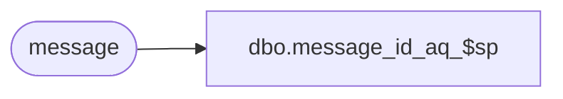

# dbo.message_id_aq_$sp

**Database:** auditworks  
**Server:** bedrockdb01  

## Architecture Diagram



## Table Dependencies

| Referenced Table |
|---|
| message |

## Stored Procedure Code

```sql
create procedure dbo.message_id_aq_$sp
@id int
AS
/* Version:1.00 Date:1995/08/14 */
/*
   Type: autoquery stored procedure
   Input Parameter: id
   Output: selected row from the message table
*/

SELECT message.id,
	message.title,
	message.text,
	message.icon,
	message.buttons,
	message.defaultbutton,
	message.timestamp
FROM message
WHERE message.id = @id

RETURN
```

