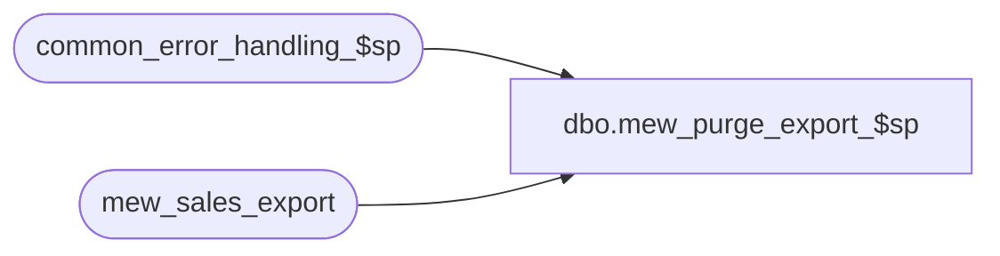

# dbo.mew_purge_export_$sp

**Database:** auditworks  
**Server:** bedrockdb01  

## Architecture Diagram



## Table Dependencies

| Referenced Table |
|---|
| common_error_handling_$sp |
| mew_sales_export |

## Stored Procedure Code

```sql
CREATE PROCEDURE dbo.mew_purge_export_SP8_$sp

	@nb_days_keep_trans AS INT

AS

SET NOCOUNT ON

/* 
PROCNAME: mew_purge_export_$sp
DESC: This procedure is called for a new Pipeline segment (12100 - SA cleanup mew_sales_export). 
	In parameter : Number of days to keep the transactions in mew_sales_export.
 	  Called by Merch pipeline.

  *** WARNING: If running on SQL2000, then comment out the error routine and try .. catch OR 
      install SQL2000 compatible hotfix 130228_merch_sql2000.sp for SA 4.1.001.090 .

  HISTORY:
Date     Name             Defect Desc
OBSOLETE as of Merch SP6 (code moved to pipeline along with check on last posted ID).
Dec10,15 Sean S		      152952 Revised code to simplify looping process and grab the largest batch of rows possible while still respecting the @batch_size variable
Aug14,13 Paul             145958 call common_error_handling_$sp
Oct28,11 Paul S           130228 added SA error routine and comments
Oct05,11 Pierrette        130228 author
*/

DECLARE @error_flag			BIT,
	@errmsg				nvarchar(1024), 
	@errno				int,
	@batch_size			INT,
	@crs_trans_per_day_flag		BIT,
	@floor_date			DATETIME,
	@curr_transaction_date		DATETIME,
	@curr_transaction_count		INT,
	@crs_trans_per_loc_day_flag	BIT,
	@location_id			NUMERIC(5,0),
	@loc_count			INT, 
	@batch_counter			INT, 
	@batch_start			NUMERIC(5,0), 
	@batch_end			NUMERIC(5,0),
	@operation_name			nvarchar(100),
	@object_name			nvarchar(255),
	@process_name			nvarchar(32),
	@process_no			int,
	@message_id			int,
	@row_count AS INT

	SELECT @error_flag = 0,
		@batch_size = 50000,
		@crs_trans_per_day_flag = 0,
		@process_name = 'mew_purge_export_$sp',
		@process_no = 280,
		@message_id = 201068,
		@object_name = 'mew purge',
		@operation_name = 'purge'

	SET @row_count = @batch_size

	BEGIN TRY
		-- Find the floor date that will be used as the minimum date to keep in the table
		SELECT @floor_date = DATEADD(day, -@nb_days_keep_trans, GETDATE()) ;

		WHILE @row_count = @batch_size
		BEGIN

			DELETE TOP (@batch_size)
			FROM mew_sales_export
			WHERE transaction_date < @floor_date

			SET @row_count = @@ROWCOUNT

		END

RETURN 0;

END TRY

BEGIN CATCH;
	SELECT @errno = ERROR_NUMBER(),
			@errmsg = 'Error when executing mew_purge_export_$sp: ' + CAST(ERROR_NUMBER() AS nvarchar) + ' ' + ERROR_MESSAGE();

	IF @@trancount > 0 ROLLBACK;

	EXEC common_error_handling_$sp
		@process_no = @process_no,
		@error_code = @errno,
		@error_msg = @errmsg,
		@abort_flag = 0,
		@message_id = @message_id,
		@process_name = @process_name,
		@object_name = @object_name,
		@operation_name = @operation_name;

	RETURN 1;
END CATCH;
```

