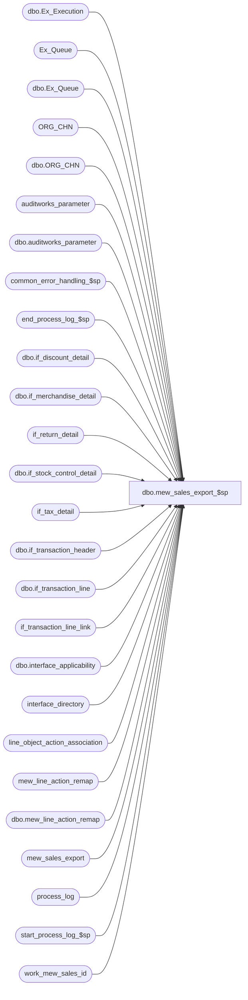

# dbo.mew_sales_export_$sp

**Database:** auditworks  
**Server:** bedrockdb01  

## Architecture Diagram



## Table Dependencies

| Referenced Table |
|---|
| dbo.Ex_Execution |
| Ex_Queue |
| dbo.Ex_Queue |
| ORG_CHN |
| dbo.ORG_CHN |
| auditworks_parameter |
| dbo.auditworks_parameter |
| common_error_handling_$sp |
| end_process_log_$sp |
| dbo.if_discount_detail |
| dbo.if_merchandise_detail |
| if_return_detail |
| dbo.if_stock_control_detail |
| if_tax_detail |
| dbo.if_transaction_header |
| dbo.if_transaction_line |
| if_transaction_line_link |
| dbo.interface_applicability |
| interface_directory |
| line_object_action_association |
| mew_line_action_remap |
| dbo.mew_line_action_remap |
| mew_sales_export |
| process_log |
| start_process_log_$sp |
| work_mew_sales_id |

## Stored Procedure Code

```sql
CREATE proc [dbo].[mew_sales_export_$sp] @interface_id tinyint = 27
AS
/* 
Proc Name: mew_sales_export_$sp (SA module)
Desc: Standard interface to NSB Merchandising. Replaces SVExport MeW Export.
	Extracts data from interface tables to populate the mew_sales_export table. Parameter values for
	batch size, # iterations, and max unpostable transactions are selected from auditworks_parameter.
	If the data can be extracted to the work area but not mass inserted to the mew_sales_export table
	then each transaction in the work table is inserted to mew_sales_export using a cursor in order to bypass 
	the error(s). Transactions that are unpostable are logged to process_error_log. If the max number of unpostable
	transactions is reached, then the entire batch is aborted.
	Supports new NSB Merchandising 4.1/5.1 or older Merchandising using ascii_export parameter in interface_directory.

	Called by SRProc (SmartView/SUSM) or ICT_EXPORT depending on export_format selected.
	When called by SRProc (the normal case), a Merchandising posting job (pipeline segment 12000) posts the rows from 
	table mew_sales_export to Merch and then deletes them from mew_sales_export.

	S/A exports 5 pieces of information related to store in the export table:
	  1) Transaction Store (store number from transaction header)
	  2) Originating Store (originating store number from merchandise attachment)
	  3) Location ID (merch location id corresponding to 
	                  a) transaction header store in the case of order returns, 
	                  or
	                  b) fulfillment store (if not given then source store, if not given then header store) for all other transactions
	  4) Originating Location ID (merch location id corresponding to originating store if given or header store otherwise)
	  5) Credit Originating Store flag (false by default, for transactions other than order returns true if
	                  a) G/L account segment lookup option 14 (Originating Store - G/L store) is applied to the transaction line and the originating store doesn't match the fulfillment store (or if not given the source store, or if not given the header store)
	                  or
	                  b) fulfillment store (or if not given then source store) doesn't match the transaction header store.

HISTORY:  
Date     Name           Def#    Desc
Apr19,18 Kiri        DAOM-3426  Correct remap values to Transaction_type from line action when posting to merch 4.2 from SA 5.1
Nov28,17 Kiri		 DAOM-2815  Store number not being updated correctly on Return to a selling store other than fulfillment store
Jun15,17 Kiri/Daphna DAOM-2051  Allow a merchant to post sales to Merch based on fulfillment store. A sub-ledger segment has been configured to use posting method 25, 'Post to fulfillment store if the fulfillment store is a selling location, otherwise post to the originating store'
JUL22,15 Daphna		   131151   cannot use user-defined datatype to create temp table
--WARNING:  please advise BI of any logic changes to this stored proc!!!
JUL21,15 akhoukaz      131151   Expand the length of the column for tender total and amounts
Jun23,15 Vicci     TFS-127376   Log executions to process log;  log batch error to process error log prior to attempt cursor logging.
Feb27,14 Vicci          61711   Ensure tax stripping amount continues to be tax on net for merch records by excluding new tax-on-discount entries.
                                Add tax stripped on discounts to 'D' records.
Aug19,11 Phu           129219   Performance tuning.
Nov30,10 Vicci         123090   Add markup_flag.
Sep01,10 Vicci         120602   Add reference_no to discount lines.
Mar08,10 Paul          116446   Corrected join to ORG_CHN to avoid error
Oct20,09 Vicci         109078   Ignore fulfillment store in case of order delivery return.
Jul21,09 Vicci         109078   Set location_id to fulfillment location id in case of shipments/pickups and originating 
                            location id in case of order cancellations; 
                                log new originating_location_id, credit_originating_store.                          May07,09 Vicci         
Jan09,08 Paul           94350   use signed discount amount for returns, added comments
Jul18,07 Paul           DV-1363 Apply 83205,1-3NLRBN to SA5 (added new value for ascii_export parameter to support Merch 4.1/5.1)
Nov20,06 Paul           DV-1349 read EXTRNL_RFRNC_NUM
Nov23,05 Paul             63859 apply 63778 to SA5
Jul08,05 Paul           DV-1295 apply DV-1298 to SA5
Mar18,05 Maryam         DV-1202 Handle the indirect association via line links.
Feb10,05 David          DV-1206 Expand column reference_no
Oct07,04 David		DV-1146	apply 42301 to SA5
Jul10,07 Sab		83205   Add logic to lookup new merch transaction types
May03.07 Daphna       1-3NLRBN  set execution_id = 0 to allow SV Housekeeping to delete from Ex_Execution
Nov22,05 Vicci		63778	Support re-mapping of line-actions not supported by merch pipeline
Jul08,05 David          DV-1298 Expand column reference_no to nvarchar(80).
Oct06,04 Vicci		42301	Avoid infinite loop in case where no posting ever run but first
				entry's serial# in Ex_Queue is > 1 plus the batch size and fix 
				serial number @first_ser_no datatype to match Ex_Queue to avoid
				arithmetic overflow.
Jul13,04 Vicci		1-UL01B Add @interface_id to allow procedure to be run from ICT_EXPORT
Mar28,03 ShuZ           1-ITBQ5 Set max_serial_no to 0 if it is not between min_serial_no and max_serial_no
Mar04,03 Phu            6512    Avoid error: insert NULL into 'tax_amount_expected' in #mew_extract
Dec09,02 Winnie     	1-H56TW avoid raise error on business rule warning message
Dec02,02 Winnie		5254	Change error messages.
Oct31,02 Winnie		5105    Add upc_lookup_division in auditworks_parameter.
                      	also includes functionality of 5103 for rel 3.5 and up.
Oct15,02 Paul           1-F41VV refix: use work_mew_sales_id as the work table
Oct01,02 Winnie		1-FPWM1 Add update to tax_amount_expected.
Oct01,02 Winnie		1-F41VV Correctly seed the identity.
Sep30,02 David Amend	5060	Correctly track identity_no by storing it in auditworks_parameter
May02,02 David Amend    1-CSBU5 Author

*/

SET NOCOUNT ON
DECLARE	@ascii_export	tinyint,
	@batch_size	int,
	@complete_iters	int,
	@cursor_open	tinyint,
	@didwork	tinyint,
	@errmsg		nvarchar(255), 
	@errno		int,
	@execution_id	int,
	@first_ser_no 	numeric(14),
	@findwork	int,
	@identity_seed	numeric(22),
	@if_entry_no	numeric(12),
	@iterations	int,
	@last_serial_no	numeric(14),
	@max_errors	smallint, -- set to -1 to bypass cursor mode for errors
	@max_serial_no	numeric(14),
	@message_id	int,
	@min_serial_no	numeric(14), 
	@object_id	smallint,
	@process_name	nvarchar(32),
	@process_no	int,
	@process_log_entry tinyint,
	@process_timestamp float,
	@queue_id	tinyint,
	@rowcount 	integer,
	@serial_no	numeric(14),
	@sql_object	nvarchar(32),
	@sql_operation	nvarchar(16),
	@last_id	numeric(22),
	@upc_lookup_division	tinyint,
	@work_todo	integer,
	@memo1		nvarchar(50),
	@transaction_count  int

SELECT	@process_name = 'Merch (MeW) Sales Interface',
	@process_no = 280,
	@process_log_entry = 0,
	@message_id = 201068,
	@complete_iters = 0,
	@min_serial_no = 0,
	@max_serial_no = 0, 
	@last_serial_no = 0,
	@queue_id = 27,
	@didwork = 0,
	@cursor_open = 0,
	@work_todo = 0,
	@execution_id =0,  -- def 1-3NLRBN
	@transaction_count = 0
	
SELECT @object_id = -1 * @queue_id,
	@ascii_export = 2

-- select ascii export parameter.
--    1 = NSB merch via SUSM
--    2 = NSB merch via ICT_EXPORT01
--    3 = new NSB Merch 4.1 and higher via SUSM
--    4 = new NSB Merch 4.1 and higher via ICT_EXPORT01

SELECT @ascii_export = ascii_export
  FROM interface_directory
 WHERE interface_id = 27

--selection of batch size and iterations from auditworks_parameter
SELECT	@batch_size = CONVERT(integer, par_value)
FROM	dbo.auditworks_parameter
WHERE	par_name='mewsales_exp_batch_size'

SELECT @errno = @@error 
IF @errno <> 0 
  BEGIN
    SELECT @errmsg = 'Unable to select batch size from auditworks_parameter',
	   @sql_object = 'auditworks_parameter',
	   @sql_operation = 'SELECT'
    GOTO error
  END

SELECT	@iterations = CONVERT(integer, par_value)
  FROM	dbo.auditworks_parameter
 WHERE	par_name='mewsales_exp_iterations'

SELECT @errno = @@error 
  IF @errno <> 0 
    BEGIN
      SELECT @errmsg = 'Unable to select number of iterations from auditworks_parameter',
	     @sql_object = 'auditworks_parameter',
	     @sql_operation = 'SELECT'
      GOTO error
    END

SELECT	@max_errors = CONVERT(integer, par_value)
  FROM	dbo.auditworks_parameter
 WHERE	par_name='mewsales_max_unpostable'

SELECT @errno = @@error 
IF @errno <> 0 
  BEGIN
    SELECT @errmsg = 'Unable to select max number of unpostable transactions from auditworks_parameter',
	   @sql_object = 'auditworks_parameter',
	   @sql_operation = 'SELECT'
    GOTO error
  END

--selection of upc lookup division from auditworks_parameter
SELECT	@upc_lookup_division = CONVERT(tinyint, par_value)
  FROM	dbo.auditworks_parameter
 WHERE	par_name='mew_upc_lookup_division'

SELECT @errno = @@error 
IF @errno <> 0 
  BEGIN
    SELECT @errmsg = 'Unable to select UPC lookup division from auditworks_parameter',
	   @sql_object = 'auditworks_parameter',
	   @sql_operation = 'SELECT'
    GOTO error
  END

-- default batch size and iterations if not set anywhere	
SELECT	@batch_size = ISNULL(@batch_size, 10000),
	@iterations = ISNULL(@iterations, 5),
	@max_errors = ISNULL(@max_errors, 100),
	@upc_lookup_division = ISNULL(@upc_lookup_division, 2)

-- Initialization section: check if any work to do and build list of transactions to process

SELECT	@min_serial_no = MAX(to_serial_no)  + 1
  FROM	dbo.Ex_Execution
 WHERE	queue_id = @queue_id
   AND object_id = @object_id

SELECT @errno = @@error 
IF @errno <> 0 
  BEGIN
    SELECT @sql_object = 'Ex_Execution',
	   @sql_operation = 'SELECT',
	   @errmsg = 'Unable to select max(to_serial_no) from Ex_Execution' 
    GOTO error
  END

IF @min_serial_no IS NULL 
BEGIN
  SELECT @min_serial_no = MIN(serial_no)
    FROM Ex_Queue
   WHERE queue_id = @queue_id
   
  SELECT @errno = @@error 
  IF @errno <> 0 
  BEGIN
    SELECT @sql_object = 'Ex_Queue',
	   @sql_operation = 'SELECT',
	   @errmsg = 'Unable to select min(serial_no) from Ex_Queue' 
    GOTO error
  END
  
  IF @min_serial_no IS NULL 
    RETURN 0
END

-- Create temp extract table

CREATE TABLE #mew_extract(
	serial_no numeric(14,0) NULL,
	if_entry_no numeric(12, 0) NULL,
	line_id numeric(5, 0) NULL,
	transaction_date datetime NULL,
	transaction_no int NULL,
	location_id numeric(5, 0) NULL,
	register_no smallint NULL,
	reference_no nvarchar(80) NULL,
	line_action smallint NULL,
	style_reference_id numeric(12,0) NULL,
	sku_id numeric(14, 0) NULL,
	upc_no numeric(14, 0) NULL,
	price_override_flag tinyint DEFAULT 0,
	return_reason_code smallint NULL,
	units numeric(15,4) NULL,
	sold_at_price NUMERIC(18,4) NULL,
	pos_discount_type numeric(18, 0) NULL,
	pos_discount_amount NUMERIC(18,4) NULL,
	applied_by_line_id numeric(12, 0) NULL,
	record_type nvarchar (1) NULL,
	reference_type tinyint NULL,
	originating_store_no int NULL,
	tax_amount_expected money NULL,
	originating_location_id numeric(5,0) null,
	credit_originating_store tinyint DEFAULT 1 not null,
	transaction_store_no int null,
	markup_flag tinyint default 0 not null)
SELECT @errno = @@error 
IF @errno <> 0 
  BEGIN
    SELECT @sql_object = '#mew_extract',
	   @sql_operation = 'CREATE TABLE',
	   @errmsg = 'Unable to create temp table #mew_extract' 
    GOTO error
  END

SELECT *
INTO #mew_final
FROM #mew_extract

SELECT @errno = @@error 
IF @errno <> 0 
  BEGIN
    SELECT @sql_object = '#mew_final',
	   @sql_operation = 'CREATE TABLE',
	   @errmsg = 'Unable to create temp table #mew_final from #mew_extract' 
    GOTO error
  END

CREATE TABLE #Ex_Work_MeW(
   serial_no NUMERIC(14, 0) NOT NULL,
   if_entry_no NUMERIC(12, 0) NOT NULL, --key_1
   interface_control_flag tinyint NOT NULL  --key_2
)
SELECT @errno = @@error 
IF @errno <> 0 
BEGIN
  SELECT @sql_object = '#Ex_Work_MeW',
         @sql_operation = 'CREATE TABLE',
         @errmsg = 'Unable to create temp table #Ex_Work_MeW'
  GOTO error
END

-- loop through until no more iterations
WHILE @iterations > @complete_iters
BEGIN

   IF @complete_iters = 0
     SELECT @first_ser_no = @min_serial_no

   IF EXISTS (SELECT 1 
      	       FROM Ex_Queue 
	      WHERE queue_id = @queue_id
		AND serial_no >= @min_serial_no)
      BEGIN
        SELECT @findwork = 1, @work_todo = 0 
        WHILE @work_todo = 0
          BEGIN
            SELECT @max_serial_no = @min_serial_no + (@batch_size * @findwork) 
            SELECT @work_todo = 1 
             WHERE EXISTS (SELECT * FROM Ex_Queue 
                            WHERE queue_id = @queue_id
                              AND serial_no BETWEEN @min_serial_no AND @max_serial_no)

            SELECT @findwork = @findwork + 1
          End --WHILE @work_todo = 0
        END -- IF EXISTS

    --what's the real @max_serial_no in the range
    SELECT @max_serial_no = isnull(max(serial_no), 0) FROM Ex_Queue 
		WHERE queue_id = @queue_id
                AND serial_no BETWEEN @min_serial_no AND @max_serial_no

    -- if nowork to do skip rest of proc

    IF @max_serial_no = 0
      BEGIN
 	SELECT @complete_iters = @iterations + 1
	BREAK
      END --nowork
    ELSE
    BEGIN
        IF @process_log_entry = 0
        BEGIN
          EXEC start_process_log_$sp @process_no, @process_timestamp OUTPUT, @errmsg OUTPUT
          SELECT @errno = @@error
          IF @errno <> 0
          BEGIN
            SELECT @errmsg = @errmsg + ' Unable to execute start_process_log_$sp',
                   @sql_object = 'start_process_log_$sp',
                   @sql_operation = 'EXECUTE'
            GOTO error
          END
          SELECT @process_log_entry = 1
        END
    END

    SELECT @last_serial_no = @max_serial_no	
	
    INSERT #Ex_Work_MeW
    SELECT serial_no, key_1, key_2
      FROM dbo.Ex_Queue
     WHERE queue_id = 27 -- @queue_id 
       AND serial_no >= @min_serial_no
       AND serial_no <= @max_serial_no
       AND (used_by_object_id = @object_id OR used_by_object_id IS NULL)
	
    SELECT @errno = @@error 
    IF @errno <> 0 
      BEGIN
	SELECT @sql_object = '#Ex_Work_MeW',
	       @sql_operation = 'INSERT',
	       @errmsg = 'Unable to insert #Ex_Work_MeW' 
	GOTO error
      END
	
    IF @ascii_export <= 2
    BEGIN
     -- extract the merch data for Merch 4.0 and less
      INSERT #mew_extract (
             serial_no,
  	     if_entry_no,
 	     line_id,
	     transaction_date,
	     transaction_no,
	     location_id,
	     register_no,
	     reference_no,
	     line_action,
	     style_reference_id,
	     sku_id,
	     upc_no,
	     price_override_flag,
	     units,
	     sold_at_price,
	     record_type,
	     reference_type,
	     originating_store_no,
	     applied_by_line_id,
	     originating_location_id,
	     transaction_store_no,
	     credit_originating_store)
    SELECT w.serial_no,
	   h.if_entry_no,
	   l.line_id,
	   h.transaction_date,
	   h.transaction_no,
	   CASE WHEN l.line_action = 99 THEN
	   	    CASE WHEN ((1 - ( ABS( SIGN(COALESCE(lookup_segment1, 0) - 25) * SIGN(COALESCE(lookup_segment2, 0) - 25)*
                                SIGN(COALESCE(lookup_segment3, 0) - 25) * SIGN(COALESCE(lookup_segment4, 0) - 25)*
                                SIGN(COALESCE(lookup_segment5, 0) - 25) * SIGN(COALESCE(lookup_segment6, 0) - 25)*
                                SIGN(COALESCE(lookup_segment7, 0) - 25) * SIGN(COALESCE(lookup_segment8, 0) - 25) ))) = 1)
                     OR ((1 - ( ABS( SIGN(COALESCE(lookup_segment1, 0) - 26) * SIGN(COALESCE(lookup_segment2, 0) - 26)*
                                SIGN(COALESCE(lookup_segment3, 0) - 26) * SIGN(COALESCE(lookup_segment4, 0) - 26)*
                                SIGN(COALESCE(lookup_segment5, 0) - 26) * SIGN(COALESCE(lookup_segment6, 0) - 26)*
                                SIGN(COALESCE(lookup_segment7, 0) - 26) * SIGN(COALESCE(lookup_segment8, 0) - 26) ))) = 1)
                     OR (((1 - ( ABS( SIGN(COALESCE(lookup_segment1, 0) - 27) * SIGN(COALESCE(lookup_segment2, 0) - 27)*
                                SIGN(COALESCE(lookup_segment3, 0) - 27) * SIGN(COALESCE(lookup_segment4, 0) - 27)*
                                SIGN(COALESCE(lookup_segment5, 0) - 27) * SIGN(COALESCE(lookup_segment6, 0) - 27)*
                                SIGN(COALESCE(lookup_segment7, 0) - 27) * SIGN(COALESCE(lookup_segment8, 0) - 27) ))) = 1) 
								)
						THEN COALESCE(scr.EXTRNL_RFRNC_NUM, s.EXTRNL_RFRNC_NUM)
					ELSE
						s.EXTRNL_RFRNC_NUM
					END
			WHEN l.line_action in (90, 142) THEN
				CASE WHEN ((1 - ( ABS( SIGN(COALESCE(lookup_segment1, 0) - 25) * SIGN(COALESCE(lookup_segment2, 0) - 25)*
                                SIGN(COALESCE(lookup_segment3, 0) - 25) * SIGN(COALESCE(lookup_segment4, 0) - 25)*
                                SIGN(COALESCE(lookup_segment5, 0) - 25) * SIGN(COALESCE(lookup_segment6, 0) - 25)*
								SIGN(COALESCE(lookup_segment7, 0) - 25) * SIGN(COALESCE(lookup_segment8, 0) - 25) ))) = 1)
					OR ((1 - ( ABS( SIGN(COALESCE(lookup_segment1, 0) - 26) * SIGN(COALESCE(lookup_segment2, 0) - 26)*
								SIGN(COALESCE(lookup_segment3, 0) - 26) * SIGN(COALESCE(lookup_segment4, 0) - 26)*
								SIGN(COALESCE(lookup_segment5, 0) - 26) * SIGN(COALESCE(lookup_segment6, 0) - 26)*
								SIGN(COALESCE(lookup_segment7, 0) - 26) * SIGN(COALESCE(lookup_segment8, 0) - 26) ))) = 1)
					OR (((1 - ( ABS( SIGN(COALESCE(lookup_segment1, 0) - 27) * SIGN(COALESCE(lookup_segment2, 0) - 27)*
								SIGN(COALESCE(lookup_segment3, 0) - 27) * SIGN(COALESCE(lookup_segment4, 0) - 27)*
								SIGN(COALESCE(lookup_segment5, 0) - 27) * SIGN(COALESCE(lookup_segment6, 0) - 27)*
								SIGN(COALESCE(lookup_segment7, 0) - 27) * SIGN(COALESCE(lookup_segment8, 0) - 27) ))) = 1) 
								)
					THEN COALESCE(scf.EXTRNL_RFRNC_NUM, f.EXTRNL_RFRNC_NUM, s.EXTRNL_RFRNC_NUM)
				ELSE
						COALESCE(f.EXTRNL_RFRNC_NUM, s.EXTRNL_RFRNC_NUM)
				END
	       ELSE 
		     COALESCE(f.EXTRNL_RFRNC_NUM, s.EXTRNL_RFRNC_NUM)
	   END location_id,
	   h.register_no,
	   l.reference_no,
	   COALESCE(r.replacement_line_action, l.line_action),
	   m.style_reference_id,
	   m.sku_id,
	   m.upc_no,
	   m.price_override,
	   m.units,
	   m.sold_at_price,
	   record_type='H',
	   l.reference_type,
         -- orig_store_no when EOM
	     m.originating_store_no,
	     applied_by_line_id = 0,
         -- location id for orig store no when EOM
		 COALESCE(o.EXTRNL_RFRNC_NUM, s.EXTRNL_RFRNC_NUM) originating_location_id, 

         -- this is the transaction store no
		 CASE WHEN l.line_action = 99 THEN
					CASE WHEN ((1 - ( ABS( SIGN(COALESCE(lookup_segment1, 0) - 25) * SIGN(COALESCE(lookup_segment2, 0) - 25)*
						SIGN(COALESCE(lookup_segment3, 0) - 25) * SIGN(COALESCE(lookup_segment4, 0) - 25)*
						SIGN(COALESCE(lookup_segment5, 0) - 25) * SIGN(COALESCE(lookup_segment6, 0) - 25)*
						SIGN(COALESCE(lookup_segment7, 0) - 25) * SIGN(COALESCE(lookup_segment8, 0) - 25) ))) = 1)
						OR ((1 - ( ABS( SIGN(COALESCE(lookup_segment1, 0) - 26) * SIGN(COALESCE(lookup_segment2, 0) - 26)*
						SIGN(COALESCE(lookup_segment3, 0) - 26) * SIGN(COALESCE(lookup_segment4, 0) - 26)*
						SIGN(COALESCE(lookup_segment5, 0) - 26) * SIGN(COALESCE(lookup_segment6, 0) - 26)*
						SIGN(COALESCE(lookup_segment7, 0) - 26) * SIGN(COALESCE(lookup_segment8, 0) - 26) ))) = 1)
						OR (((1 - ( ABS( SIGN(COALESCE(lookup_segment1, 0) - 27) * SIGN(COALESCE(lookup_segment2, 0) - 27)*
						SIGN(COALESCE(lookup_segment3, 0) - 27) * SIGN(COALESCE(lookup_segment4, 0) - 27)*
						SIGN(COALESCE(lookup_segment5, 0) - 27) * SIGN(COALESCE(lookup_segment6, 0) - 27)*
						SIGN(COALESCE(lookup_segment7, 0) - 27) * SIGN(COALESCE(lookup_segment8, 0) - 27) ))) = 1) 
						)
						THEN COALESCE(sc.location_no, m.fulfillment_store_no, h.store_no)
					ELSE
								    h.store_no
					END
				WHEN l.line_action in (90, 142) THEN	
					CASE WHEN ((1 - ( ABS( SIGN(COALESCE(lookup_segment1, 0) - 25) * SIGN(COALESCE(lookup_segment2, 0) - 25)*
						SIGN(COALESCE(lookup_segment3, 0) - 25) * SIGN(COALESCE(lookup_segment4, 0) - 25)*
						SIGN(COALESCE(lookup_segment5, 0) - 25) * SIGN(COALESCE(lookup_segment6, 0) - 25)*
						SIGN(COALESCE(lookup_segment7, 0) - 25) * SIGN(COALESCE(lookup_segment8, 0) - 25) ))) = 1)
						OR ((1 - ( ABS( SIGN(COALESCE(lookup_segment1, 0) - 26) * SIGN(COALESCE(lookup_segment2, 0) - 26)*
						SIGN(COALESCE(lookup_segment3, 0) - 26) * SIGN(COALESCE(lookup_segment4, 0) - 26)*
						SIGN(COALESCE(lookup_segment5, 0) - 26) * SIGN(COALESCE(lookup_segment6, 0) - 26)*
						SIGN(COALESCE(lookup_segment7, 0) - 26) * SIGN(COALESCE(lookup_segment8, 0) - 26) ))) = 1)
						OR (((1 - ( ABS( SIGN(COALESCE(lookup_segment1, 0) - 27) * SIGN(COALESCE(lookup_segment2, 0) - 27)*
						SIGN(COALESCE(lookup_segment3, 0) - 27) * SIGN(COALESCE(lookup_segment4, 0) - 27)*
						SIGN(COALESCE(lookup_segment5, 0) - 27) * SIGN(COALESCE(lookup_segment6, 0) - 27)*
						SIGN(COALESCE(lookup_segment7, 0) - 27) * SIGN(COALESCE(lookup_segment8, 0) - 27) ))) = 1) 
						   )
						THEN COALESCE(sc.other_store_no, m.fulfillment_store_no, h.store_no)
					ELSE
								    h.store_no
					END
			ELSE 
			    h.store_no
		 END	store_no,
		 -- Credit to original store
		 CASE WHEN (l.line_action = 99 AND ((1 - ( ABS( SIGN(COALESCE(lookup_segment1, 0) - 26) * SIGN(COALESCE(lookup_segment2, 0) - 26)*
                                           SIGN(COALESCE(lookup_segment3, 0) - 26) * SIGN(COALESCE(lookup_segment4, 0) - 26)*
                                           SIGN(COALESCE(lookup_segment5, 0) - 26) * SIGN(COALESCE(lookup_segment6, 0) - 26)*
                                           SIGN(COALESCE(lookup_segment7, 0) - 26) * SIGN(COALESCE(lookup_segment8, 0) - 26) ))) = 1)
		 )
		 THEN 1 ELSE
		    CASE WHEN (l.line_action = 99 AND ((1 - ( ABS( SIGN(COALESCE(lookup_segment1, 0) - 27) * SIGN(COALESCE(lookup_segment2, 0) - 27)*
                                           SIGN(COALESCE(lookup_segment3, 0) - 27) * SIGN(COALESCE(lookup_segment4, 0) - 27)*
                                           SIGN(COALESCE(lookup_segment5, 0) - 27) * SIGN(COALESCE(lookup_segment6, 0) - 27)*
                                           SIGN(COALESCE(lookup_segment7, 0) - 27) * SIGN(COALESCE(lookup_segment8, 0) - 27) ))) = 1)
		 )
		 THEN CASE WHEN SIGN(ISNULL(sc.store_on_file_flag, 0)) = 0 THEN 1 ELSE 0 END ELSE
		    -- case when order delivered or order picked up and GL25
		    CASE WHEN (l.line_action in (90, 142) AND ((1 - ( ABS( SIGN(COALESCE(lookup_segment1, 0) - 25) * SIGN(COALESCE(lookup_segment2, 0) - 25)*
                                           SIGN(COALESCE(lookup_segment3, 0) - 25) * SIGN(COALESCE(lookup_segment4, 0) - 25)*
                                           SIGN(COALESCE(lookup_segment5, 0) - 25) * SIGN(COALESCE(lookup_segment6, 0) - 25)*
                                           SIGN(COALESCE(lookup_segment7, 0) - 25) * SIGN(COALESCE(lookup_segment8, 0) - 25) ))) = 1) 
		 )
		 THEN CASE WHEN SIGN(ISNULL(sc.store_on_file_flag, 0)) = 0 THEN 1 ELSE 0 END ELSE
	        CASE WHEN (l.line_action <> 99 AND COALESCE(m.fulfillment_store_no, m.source_store_no, h.store_no) <> h.store_no) /* NB since S/A does not have G/L account segment lookup for fulfillment store if it doesn't match that in header merch must attribute to originating store */
	               OR ( COALESCE(m.fulfillment_store_no, m.source_store_no, h.store_no) <> m.originating_store_no
	        AND(1 - ( ABS( SIGN(COALESCE(lookup_segment1, 0) - 14) * SIGN(COALESCE(lookup_segment2, 0) - 14)*
              SIGN(COALESCE(lookup_segment3, 0) - 14) * SIGN(COALESCE(lookup_segment4, 0) - 14)*
                                           SIGN(COALESCE(lookup_segment5, 0) - 14) * SIGN(COALESCE(lookup_segment6, 0) - 14)*
                                           SIGN(COALESCE(lookup_segment7, 0) - 14) * SIGN(COALESCE(lookup_segment8, 0) - 14) ) )) = 1) 
                  THEN 1
                  ELSE 0
			  END
			  END
			  END
        END credit_originating_store
      FROM #Ex_Work_MeW w
     INNER JOIN dbo.if_transaction_header h ON h.if_entry_no = w.if_entry_no AND h.transaction_void_flag IN (0,8)
     INNER JOIN dbo.ORG_CHN s ON h.store_no = s.ORG_CHN_NUM
     INNER JOIN dbo.if_transaction_line l ON h.if_entry_no = l.if_entry_no AND l.line_void_flag = 0
     INNER JOIN dbo.if_merchandise_detail m ON l.if_entry_no = m.if_entry_no AND l.line_id = m.line_id AND m.upc_lookup_division = @upc_lookup_division
     INNER JOIN dbo.interface_applicability a ON a.line_object = l.line_object AND a.line_action = l.line_action 
     		AND a.transaction_category = h.transaction_category AND a.interface_id = @queue_id
     LEFT OUTER JOIN dbo.if_stock_control_detail sc ON l.if_entry_no = sc.if_entry_no AND l.line_id = sc.line_id AND sc.display_def_id = 31 
     LEFT OUTER JOIN ORG_CHN o ON m.originating_store_no = o.ORG_CHN_NUM
     LEFT OUTER JOIN ORG_CHN f ON COALESCE(m.fulfillment_store_no, m.source_store_no) = f.ORG_CHN_NUM
     LEFT OUTER JOIN ORG_CHN sco ON sc.originating_store_no = sco.ORG_CHN_NUM
     LEFT OUTER JOIN ORG_CHN scr ON sc.location_no = scr.ORG_CHN_NUM
     LEFT OUTER JOIN ORG_CHN scf ON sc.other_store_no = scf.ORG_CHN_NUM
     LEFT OUTER	JOIN dbo.mew_line_action_remap r ON l.line_action = r.line_action
     LEFT OUTER JOIN line_object_action_association x WITH (NOLOCK) 
     ON h.transaction_category = x.transaction_category
            AND l.line_object = x.line_object
            AND l.line_action = x.line_action
     SELECT @errno = @@error 
     IF @errno <> 0 
      BEGIN
	SELECT	@sql_object = '#mew_extract',
		@sql_operation = 'INSERT',
		@errmsg = 'Unable to insert #mew_extract for merchandising records (4.0)' 
	GOTO error
      END
    END	
  ELSE
    BEGIN -- use new format with merch tran types
     INSERT #mew_extract (
           serial_no,
	   if_entry_no,
	   line_id,
	   transaction_date,
	   transaction_no,
	   location_id,
	   register_no,
	   reference_no,
	   line_action,
	   style_reference_id,
	   sku_id,
	   upc_no,
	   price_override_flag,
	   units,
	   sold_at_price,
	   record_type,
	   reference_type,
	   originating_store_no,
	   applied_by_line_id,
	   originating_location_id,
	   transaction_store_no,
	   credit_originating_store)
    SELECT w.serial_no,
	   h.if_entry_no,
	   l.line_id,
	   h.transaction_date,
	   h.transaction_no,
	   CASE WHEN l.line_action = 99 THEN
	   	    CASE WHEN ((1 - ( ABS( SIGN(COALESCE(lookup_segment1, 0) - 25) * SIGN(COALESCE(lookup_segment2, 0) - 25)*
                                SIGN(COALESCE(lookup_segment3, 0) - 25) * SIGN(COALESCE(lookup_segment4, 0) - 25)*
                                SIGN(COALESCE(lookup_segment5, 0) - 25) * SIGN(COALESCE(lookup_segment6, 0) - 25)*
                                SIGN(COALESCE(lookup_segment7, 0) - 25) * SIGN(COALESCE(lookup_segment8, 0) - 25) ))) = 1)
                     OR ((1 - ( ABS( SIGN(COALESCE(lookup_segment1, 0) - 26) * SIGN(COALESCE(lookup_segment2, 0) - 26)*
                                SIGN(COALESCE(lookup_segment3, 0) - 26) * SIGN(COALESCE(lookup_segment4, 0) - 26)*
                                SIGN(COALESCE(lookup_segment5, 0) - 26) * SIGN(COALESCE(lookup_segment6, 0) - 26)*
                                SIGN(COALESCE(lookup_segment7, 0) - 26) * SIGN(COALESCE(lookup_segment8, 0) - 26) ))) = 1)
                     OR (((1 - ( ABS( SIGN(COALESCE(lookup_segment1, 0) - 27) * SIGN(COALESCE(lookup_segment2, 0) - 27)*
                                SIGN(COALESCE(lookup_segment3, 0) - 27) * SIGN(COALESCE(lookup_segment4, 0) - 27)*
                                SIGN(COALESCE(lookup_segment5, 0) - 27) * SIGN(COALESCE(lookup_segment6, 0) - 27)*
                                SIGN(COALESCE(lookup_segment7, 0) - 27) * SIGN(COALESCE(lookup_segment8, 0) - 27) ))) = 1) 
								)
						THEN COALESCE(scr.EXTRNL_RFRNC_NUM, s.EXTRNL_RFRNC_NUM)
					ELSE
						s.EXTRNL_RFRNC_NUM
					END
			WHEN l.line_action in (90, 142) THEN
				CASE WHEN ((1 - ( ABS( SIGN(COALESCE(lookup_segment1, 0) - 25) * SIGN(COALESCE(lookup_segment2, 0) - 25)*
                                SIGN(COALESCE(lookup_segment3, 0) - 25) * SIGN(COALESCE(lookup_segment4, 0) - 25)*
                                SIGN(COALESCE(lookup_segment5, 0) - 25) * SIGN(COALESCE(lookup_segment6, 0) - 25)*
								SIGN(COALESCE(lookup_segment7, 0) - 25) * SIGN(COALESCE(lookup_segment8, 0) - 25) ))) = 1)
					OR ((1 - ( ABS( SIGN(COALESCE(lookup_segment1, 0) - 26) * SIGN(COALESCE(lookup_segment2, 0) - 26)*
								SIGN(COALESCE(lookup_segment3, 0) - 26) * SIGN(COALESCE(lookup_segment4, 0) - 26)*
								SIGN(COALESCE(lookup_segment5, 0) - 26) * SIGN(COALESCE(lookup_segment6, 0) - 26)*
								SIGN(COALESCE(lookup_segment7, 0) - 26) * SIGN(COALESCE(lookup_segment8, 0) - 26) ))) = 1)
					OR (((1 - ( ABS( SIGN(COALESCE(lookup_segment1, 0) - 27) * SIGN(COALESCE(lookup_segment2, 0) - 27)*
								SIGN(COALESCE(lookup_segment3, 0) - 27) * SIGN(COALESCE(lookup_segment4, 0) - 27)*
								SIGN(COALESCE(lookup_segment5, 0) - 27) * SIGN(COALESCE(lookup_segment6, 0) - 27)*
								SIGN(COALESCE(lookup_segment7, 0) - 27) * SIGN(COALESCE(lookup_segment8, 0) - 27) ))) = 1) 
								)
					THEN COALESCE(scf.EXTRNL_RFRNC_NUM, f.EXTRNL_RFRNC_NUM, s.EXTRNL_RFRNC_NUM)
				ELSE
						COALESCE(f.EXTRNL_RFRNC_NUM, s.EXTRNL_RFRNC_NUM)
				END
	       ELSE 
		     COALESCE(f.EXTRNL_RFRNC_NUM, s.EXTRNL_RFRNC_NUM)
	   END location_id,
	   h.register_no,
	   l.reference_no,
	   COALESCE(r.merch_transaction_type, r.replacement_line_action, l.line_action),
	   m.style_reference_id,
	   m.sku_id,
	   m.upc_no,
	   m.price_override,
	   m.units,
	   m.sold_at_price,
	   record_type='H',
	   l.reference_type,
         -- orig_store_no when EOM
	     m.originating_store_no,
	     applied_by_line_id = 0,
         -- location id for orig store no when EOM
		 COALESCE(o.EXTRNL_RFRNC_NUM, s.EXTRNL_RFRNC_NUM) originating_location_id, 

         -- this is the transaction store no
		 CASE WHEN l.line_action = 99 THEN
					CASE WHEN ((1 - ( ABS( SIGN(COALESCE(lookup_segment1, 0) - 25) * SIGN(COALESCE(lookup_segment2, 0) - 25)*
						SIGN(COALESCE(lookup_segment3, 0) - 25) * SIGN(COALESCE(lookup_segment4, 0) - 25)*
						SIGN(COALESCE(lookup_segment5, 0) - 25) * SIGN(COALESCE(lookup_segment6, 0) - 25)*
						SIGN(COALESCE(lookup_segment7, 0) - 25) * SIGN(COALESCE(lookup_segment8, 0) - 25) ))) = 1)
						OR ((1 - ( ABS( SIGN(COALESCE(lookup_segment1, 0) - 26) * SIGN(COALESCE(lookup_segment2, 0) - 26)*
						SIGN(COALESCE(lookup_segment3, 0) - 26) * SIGN(COALESCE(lookup_segment4, 0) - 26)*
						SIGN(COALESCE(lookup_segment5, 0) - 26) * SIGN(COALESCE(lookup_segment6, 0) - 26)*
						SIGN(COALESCE(lookup_segment7, 0) - 26) * SIGN(COALESCE(lookup_segment8, 0) - 26) ))) = 1)
						OR (((1 - ( ABS( SIGN(COALESCE(lookup_segment1, 0) - 27) * SIGN(COALESCE(lookup_segment2, 0) - 27)*
						SIGN(COALESCE(lookup_segment3, 0) - 27) * SIGN(COALESCE(lookup_segment4, 0) - 27)*
						SIGN(COALESCE(lookup_segment5, 0) - 27) * SIGN(COALESCE(lookup_segment6, 0) - 27)*
						SIGN(COALESCE(lookup_segment7, 0) - 27) * SIGN(COALESCE(lookup_segment8, 0) - 27) ))) = 1) 
						)
						THEN COALESCE(sc.location_no, m.fulfillment_store_no, h.store_no)
					ELSE
								    h.store_no
					END
				WHEN l.line_action in (90, 142) THEN	
					CASE WHEN ((1 - ( ABS( SIGN(COALESCE(lookup_segment1, 0) - 25) * SIGN(COALESCE(lookup_segment2, 0) - 25)*
						SIGN(COALESCE(lookup_segment3, 0) - 25) * SIGN(COALESCE(lookup_segment4, 0) - 25)*
						SIGN(COALESCE(lookup_segment5, 0) - 25) * SIGN(COALESCE(lookup_segment6, 0) - 25)*
						SIGN(COALESCE(lookup_segment7, 0) - 25) * SIGN(COALESCE(lookup_segment8, 0) - 25) ))) = 1)
						OR ((1 - ( ABS( SIGN(COALESCE(lookup_segment1, 0) - 26) * SIGN(COALESCE(lookup_segment2, 0) - 26)*
						SIGN(COALESCE(lookup_segment3, 0) - 26) * SIGN(COALESCE(lookup_segment4, 0) - 26)*
						SIGN(COALESCE(lookup_segment5, 0) - 26) * SIGN(COALESCE(lookup_segment6, 0) - 26)*
						SIGN(COALESCE(lookup_segment7, 0) - 26) * SIGN(COALESCE(lookup_segment8, 0) - 26) ))) = 1)
						OR (((1 - ( ABS( SIGN(COALESCE(lookup_segment1, 0) - 27) * SIGN(COALESCE(lookup_segment2, 0) - 27)*
						SIGN(COALESCE(lookup_segment3, 0) - 27) * SIGN(COALESCE(lookup_segment4, 0) - 27)*
						SIGN(COALESCE(lookup_segment5, 0) - 27) * SIGN(COALESCE(lookup_segment6, 0) - 27)*
						SIGN(COALESCE(lookup_segment7, 0) - 27) * SIGN(COALESCE(lookup_segment8, 0) - 27) ))) = 1) 
						   )
						THEN COALESCE(sc.other_store_no, m.fulfillment_store_no, h.store_no)
					ELSE
								    h.store_no
					END
			ELSE 
			    h.store_no
		 END	store_no,
		 -- Credit to original store
		 CASE WHEN (l.line_action = 99 AND ((1 - ( ABS( SIGN(COALESCE(lookup_segment1, 0) - 26) * SIGN(COALESCE(lookup_segment2, 0) - 26)*
                                           SIGN(COALESCE(lookup_segment3, 0) - 26) * SIGN(COALESCE(lookup_segment4, 0) - 26)*
                                           SIGN(COALESCE(lookup_segment5, 0) - 26) * SIGN(COALESCE(lookup_segment6, 0) - 26)*
                                           SIGN(COALESCE(lookup_segment7, 0) - 26) * SIGN(COALESCE(lookup_segment8, 0) - 26) ))) = 1)
		 )
		 THEN 1 ELSE
		    CASE WHEN (l.line_action = 99 AND ((1 - ( ABS( SIGN(COALESCE(lookup_segment1, 0) - 27) * SIGN(COALESCE(lookup_segment2, 0) - 27)*
                                           SIGN(COALESCE(lookup_segment3, 0) - 27) * SIGN(COALESCE(lookup_segment4, 0) - 27)*
                                           SIGN(COALESCE(lookup_segment5, 0) - 27) * SIGN(COALESCE(lookup_segment6, 0) - 27)*
                                           SIGN(COALESCE(lookup_segment7, 0) - 27) * SIGN(COALESCE(lookup_segment8, 0) - 27) ))) = 1)
		 )
		 THEN CASE WHEN SIGN(ISNULL(sc.store_on_file_flag, 0)) = 0 THEN 1 ELSE 0 END ELSE
		    -- case when order delivered or order picked up and GL25
		    CASE WHEN (l.line_action in (90, 142) AND ((1 - ( ABS( SIGN(COALESCE(lookup_segment1, 0) - 25) * SIGN(COALESCE(lookup_segment2, 0) - 25)*
                                           SIGN(COALESCE(lookup_segment3, 0) - 25) * SIGN(COALESCE(lookup_segment4, 0) - 25)*
                                           SIGN(COALESCE(lookup_segment5, 0) - 25) * SIGN(COALESCE(lookup_segment6, 0) - 25)*
                                           SIGN(COALESCE(lookup_segment7, 0) - 25) * SIGN(COALESCE(lookup_segment8, 0) - 25) ))) = 1) 
		 )
		 THEN CASE WHEN SIGN(ISNULL(sc.store_on_file_flag, 0)) = 0 THEN 1 ELSE 0 END ELSE
	        CASE WHEN (l.line_action <> 99 AND COALESCE(m.fulfillment_store_no, m.source_store_no, h.store_no) <> h.store_no) /* NB since S/A does not have G/L account segment lookup for fulfillment store if it doesn't match that in header merch must attribute to originating store */
	               OR ( COALESCE(m.fulfillment_store_no, m.source_store_no, h.store_no) <> m.originating_store_no
	        AND(1 - ( ABS( SIGN(COALESCE(lookup_segment1, 0) - 14) * SIGN(COALESCE(lookup_segment2, 0) - 14)*
              SIGN(COALESCE(lookup_segment3, 0) - 14) * SIGN(COALESCE(lookup_segment4, 0) - 14)*
                                           SIGN(COALESCE(lookup_segment5, 0) - 14) * SIGN(COALESCE(lookup_segment6, 0) - 14)*
                                           SIGN(COALESCE(lookup_segment7, 0) - 14) * SIGN(COALESCE(lookup_segment8, 0) - 14) ) )) = 1) 
                  THEN 1
                  ELSE 0
			  END
			  END
			  END
        END credit_originating_store
      FROM #Ex_Work_MeW w
     INNER JOIN dbo.if_transaction_header h ON h.if_entry_no = w.if_entry_no AND h.transaction_void_flag IN (0,8)
     INNER JOIN dbo.ORG_CHN s ON h.store_no = s.ORG_CHN_NUM
     INNER JOIN dbo.if_transaction_line l ON h.if_entry_no = l.if_entry_no AND l.line_void_flag = 0
     INNER JOIN dbo.if_merchandise_detail m ON l.if_entry_no = m.if_entry_no AND l.line_id = m.line_id AND m.upc_lookup_division = @upc_lookup_division
     INNER JOIN dbo.interface_applicability a ON a.line_object = l.line_object AND a.line_action = l.line_action 
     		AND a.transaction_category = h.transaction_category AND a.interface_id = @queue_id
     LEFT OUTER JOIN dbo.if_stock_control_detail sc ON l.if_entry_no = sc.if_entry_no AND l.line_id = sc.line_id AND sc.display_def_id = 31 
     LEFT OUTER JOIN ORG_CHN o ON m.originating_store_no = o.ORG_CHN_NUM
     LEFT OUTER JOIN ORG_CHN f ON COALESCE(m.fulfillment_store_no, m.source_store_no) = f.ORG_CHN_NUM
     LEFT OUTER JOIN ORG_CHN sco ON sc.originating_store_no = sco.ORG_CHN_NUM
     LEFT OUTER JOIN ORG_CHN scr ON sc.location_no = scr.ORG_CHN_NUM
     LEFT OUTER JOIN ORG_CHN scf ON sc.other_store_no = scf.ORG_CHN_NUM
     LEFT OUTER	JOIN dbo.mew_line_action_remap r ON l.line_action = r.line_action
     LEFT OUTER JOIN line_object_action_association x WITH (NOLOCK) 
     ON h.transaction_category = x.transaction_category
            AND l.line_object = x.line_object
            AND l.line_action = x.line_action	
     SELECT @errno = @@error 
     IF @errno <> 0 
      BEGIN
	SELECT	@sql_object = '#mew_extract',
		@sql_operation = 'INSERT',
		@errmsg = 'Unable to insert #mew_extract for merchandising records (4.1)'
	GOTO error
      END
    END -- else of IF @ascii_export <= 2 merch
	
    -- update tax_amount_expected

UPDATE #mew_extract
       SET tax_amount_expected = (SELECT SUM(ISNULL(t.tax_strip_flag * t.tax_amount_expected,0))
                                    FROM if_tax_detail t
                                   WHERE t.if_entry_no = w.if_entry_no
                                     AND t.line_id = w.line_id
           AND t.applied_by_line_id IS NULL)  --to exclude tax on discounts, since tax record with null applied-by is tax on net.
      FROM #mew_extract w, if_tax_detail td
     WHERE w.record_type = 'H'
     AND w.if_entry_no = td.if_entry_no
     AND w.line_id = td.line_id
     AND td.applied_by_line_id IS NULL
    SELECT @errno = @@error 
    IF @errno <> 0 
      BEGIN
	SELECT @sql_object = '#mew_extract',
	       @sql_operation = 'UPDATE',
	       @errmsg = 'Unable to update #mew_extract' 
	GOTO error
      END

    -- extract the discount data

    IF @ascii_export <= 2
    BEGIN
     INSERT #mew_extract (
     	   serial_no,
	   if_entry_no,
	   line_id,
	   transaction_date,
	   transaction_no,
	   location_id,
	   register_no,
	   reference_no, 
	   line_action,
	   style_reference_id,
	   sku_id,
	   upc_no,
	   price_override_flag,
	   units,
	   sold_at_price,
	   record_type,
	   reference_type,
	   originating_store_no,
	   applied_by_line_id,
	   pos_discount_type,
	   pos_discount_amount,
	   originating_location_id,
	   transaction_store_no,
	   credit_originating_store)
     SELECT w.serial_no,
	   t.if_entry_no,
	   t.line_id,
	   t.transaction_date,
	   t.transaction_no,
	   t.location_id,
	   t.register_no,
	   t.reference_no, 
	   IsNull(r.replacement_line_action, l.line_action),
	   t.style_reference_id,
	   t.sku_id,
	   t.upc_no,
	   t.price_override_flag,
	   t.units,
	   t.sold_at_price,
	   'D', -- record_type
	   t.reference_type,
	   t.originating_store_no,
	   d.applied_by_line_id,
	   d.pos_discount_type,
	   d.pos_discount_amount,
	   t.originating_location_id,
	   t.transaction_store_no,
	   t.credit_originating_store
      FROM #mew_extract t
     INNER JOIN #Ex_Work_MeW w ON t.if_entry_no = w.if_entry_no
     INNER JOIN dbo.if_discount_detail d ON t.if_entry_no = d.if_entry_no AND t.line_id = d.line_id
     INNER JOIN dbo.if_transaction_line l ON d.applied_by_line_id = l.line_id AND d.if_entry_no = l.if_entry_no AND d.applied_flag = 1
      LEFT OUTER JOIN mew_line_action_remap r ON l.line_action = r.line_action
	
     SELECT @errno = @@error 
     IF @errno <> 0 
       BEGIN
	SELECT	@sql_object = '#mew_extract',
		@sql_operation = 'INSERT',
		@errmsg = 'Unable to insert #mew_extract for discount records (4.0)' 
	GOTO error
       END
     END

    ELSE
    BEGIN -- use new format with merch tran types
     INSERT #mew_extract (
     	   serial_no,
	   if_entry_no,
	   line_id,
	   transaction_date,
	   transaction_no,
	   location_id,
	   register_no,
	   reference_no, 
	   line_action,
	   style_reference_id,
	   sku_id,
	   upc_no,
	   price_override_flag,
	   units,
	   sold_at_price,
	   record_type,
	   reference_type,
	   originating_store_no,
	   applied_by_line_id,
	   pos_discount_type,
	   pos_discount_amount,
	   originating_location_id,
	   transaction_store_no,
	   credit_originating_store,
	   markup_flag)
     SELECT w.serial_no,
	   t.if_entry_no,
	   t.line_id,
	   t.transaction_date,
	   t.transaction_no,
	   t.location_id,
	   t.register_no,
	   t.reference_no, 
	   COALESCE(r.merch_transaction_type, r.replacement_line_action, l.line_action),
	   t.style_reference_id,
	   t.sku_id,
	   t.upc_no,
	   t.price_override_flag,
	   t.units,
	   t.sold_at_price,
	   'D', -- record_type
	   t.reference_type,
	   t.originating_store_no,
	   d.applied_by_line_id,
	   d.pos_discount_type,
	   CASE WHEN (t.line_action in (610, 615)) THEN
      	            d.pos_discount_amount * -1 -- negative for returns
    	       ELSE d.pos_discount_amount -- positive
    	       END,
	   t.originating_location_id,
	   t.transaction_store_no,
	   t.credit_originating_store,
	   CASE WHEN (   (d.pos_discount_amount < 0 AND w.interface_control_flag <> 20) 
	              OR (d.pos_discount_amount > 0 AND w.interface_control_flag = 20)) 
	        THEN 1 ELSE 0 END
      FROM #mew_extract t
     INNER JOIN #Ex_Work_MeW w ON t.if_entry_no = w.if_entry_no
     INNER JOIN dbo.if_discount_detail d ON t.if_entry_no = d.if_entry_no AND t.line_id = d.line_id
     INNER JOIN dbo.if_transaction_line l ON d.applied_by_line_id = l.line_id AND d.if_entry_no = l.if_entry_no AND d.applied_flag = 1
      LEFT OUTER JOIN mew_line_action_remap r ON l.line_action = r.line_action

    SELECT @errno = @@error 
    IF @errno <> 0 
      BEGIN
	SELECT	@sql_object = '#mew_extract',
		@sql_operation = 'INSERT',
		@errmsg = 'Unable to insert #mew_extract for discount records (4.1)' 
	GOTO error
      END
      
    END -- else of IF @ascii_export <= 2 disc

    -- update tax_amount_expected
    UPDATE #mew_extract
       SET tax_amount_expected = (SELECT SUM(ISNULL(t.tax_strip_flag * t.tax_amount_expected, 0))
                                    FROM if_tax_detail t
                                   WHERE t.if_entry_no = w.if_entry_no
                                     AND t.line_id = w.line_id
                                     AND t.applied_by_line_id = w.applied_by_line_id)
                                 * SIGN(w.pos_discount_amount)
      FROM #mew_extract w, if_tax_detail td
     WHERE w.record_type = 'D'
       AND w.if_entry_no = td.if_entry_no
       AND w.line_id = td.line_id
AND w.applied_by_line_id  = td.applied_by_line_id
    SELECT @errno = @@error 
    IF @errno <> 0 
      BEGIN
	SELECT @sql_object = '#mew_extract',
	       @sql_operation = 'UPDATE',
	       @errmsg = 'Unable to update #mew_extract' 
	GOTO error
      END

    -- return reason codes	
    UPDATE #mew_extract
    SET return_reason_code = r.return_reason_code
    FROM if_return_detail r
    WHERE #mew_extract.if_entry_no = r.if_entry_no
    AND r.line_id = 0	

    SELECT @errno = @@error 
    IF @errno <> 0 
      BEGIN
        SELECT @sql_object = '#mew_extract',
               @sql_operation = 'UPDATE',
               @errmsg = 'Unable to update #mew_extract for header level return reason codes' 
        GOTO error
      END

    UPDATE #mew_extract
    SET return_reason_code = r.return_reason_code
    FROM if_return_detail r
    WHERE #mew_extract.if_entry_no = r.if_entry_no
    AND #mew_extract.line_id = r.line_id
	
    SELECT @errno = @@error 
    IF @errno <> 0 
      BEGIN
        SELECT @sql_object = '#mew_extract',
      	       @sql_operation = 'UPDATE',
	       @errmsg = 'Unable to update #mew_extract for return reason codes' 
        GOTO error
      END

    UPDATE #mew_extract
    SET return_reason_code = r.return_reason_code
    FROM if_return_detail r, if_transaction_line_link k
    WHERE #mew_extract.if_entry_no = k.if_entry_no
    AND #mew_extract.line_id = k.line_id
    AND k.if_entry_no = r.if_entry_no
    AND k.linked_line_id = r.line_id

    SELECT @errno = @@error 
    IF @errno <> 0 
      BEGIN
        SELECT @sql_object = '#mew_extract',
     	       @sql_operation = 'UPDATE',
               @errmsg = 'Unable to update #mew_extract for return reason codes via transaction line link' 
        GOTO error
      END

    INSERT INTO #mew_final
    SELECT *
    FROM #mew_extract
      
    SELECT @errno = @@error 
    IF @errno <> 0 
    BEGIN
      SELECT @sql_object = '#mew_final',
             @sql_operation = 'INSERT',
             @errmsg = 'Unable to insert #mew_final from #mew_extract' 
      GOTO error
    END

    -- cleanup work
    TRUNCATE TABLE #mew_extract
    SELECT @errno = @@error 
    IF @errno <> 0 
      BEGIN
	SELECT	@sql_object = '#mew_extract',
		@sql_operation = 'TRUNCATE TABLE',
		@errmsg = 'Could not truncate table #mew_extract' 
        GOTO error
      END

    TRUNCATE TABLE #Ex_Work_MeW
    SELECT @errno = @@error 
    IF @errno <> 0 
      BEGIN
        SELECT @sql_object = '#Ex_Work_MeW',
               @sql_operation = 'TRUNCATE TABLE',
       @errmsg = 'Could not truncate table #Ex_Work_MeW' 
        GOTO error
      END

    -- bump the iterations
    SELECT @complete_iters = @complete_iters + 1, @didwork = 1

    SELECT @min_serial_no = @max_serial_no +1 --ISNULL(@min_serial_no, 1+(@batch_size * @complete_iters)),

nowork:
END --@iterations	

IF @didwork = 1
BEGIN
  --what's the next identity_no
  SELECT @identity_seed = ISNULL(convert(numeric(22,0),par_value),0)
    FROM auditworks_parameter
   WHERE par_name='last_mew_sales_id'

  -- abort if the next identity_no is undetermined

  SELECT @rowcount = @@rowcount, @errno = @@error 
    IF @rowcount = 0 OR @errno != 0 
      BEGIN
	SELECT @sql_object = 'auditworks_parameter',
	       @sql_operation = 'SELECT',
	       @errmsg = 'Unable to select from auditworks_parameter for last_mew_sales_id' 
               IF @rowcount = 0 
                 SELECT @errmsg = @errmsg + ' since the parameter was not found'
 	GOTO error
      END

  TRUNCATE TABLE work_mew_sales_id
	
  SELECT @errno = @@error 
  IF @errno <> 0 
    BEGIN
      SELECT	@sql_object = 'work_mew_sales_id',
		@sql_operation = 'TRUNCATE TABLE',
		@errmsg = 'Unable to TRUNCATE table work_mew_sales_id' 
      GOTO error
    END
	
   --Seed the identity 
  IF @identity_seed > 0
    BEGIN
      SET IDENTITY_INSERT work_mew_sales_id ON	
     INSERT work_mew_sales_id(identity_no, if_entry_no, line_id, applied_by_line_id)
      VALUES (@identity_seed, -1, -1, -1)
      SELECT @errno = @@error 
      IF @errno <> 0 
        BEGIN
          SET IDENTITY_INSERT work_mew_sales_id OFF
          SELECT @sql_object = 'work_mew_sales_id',
	  	 @sql_operation = 'INSERT',
		 @errmsg = 'Unable to insert work_mew_sales_id for identity seeding' 
          GOTO error
        END
      SET IDENTITY_INSERT work_mew_sales_id OFF
    END
	
  -- create identity numbers for the extracted records prior to sending them to the final table
  INSERT work_mew_sales_id (if_entry_no, line_id, applied_by_line_id)
  SELECT e.if_entry_no, e.line_id, e.applied_by_line_id
    FROM #mew_final e
  ORDER BY e.if_entry_no, e.line_id, e.applied_by_line_id

  SELECT @errno = @@error 
  IF @errno <> 0 
    BEGIN
      SELECT @sql_object = 'work_mew_sales_id',
             @sql_operation = 'INSERT',
             @errmsg = 'Unable to insert work_mew_sales_id to create identity values for extracted records'
      GOTO error
    END
	
  -- post the data to the output table
  BEGIN TRANSACTION
  INSERT mew_sales_export (
         identity_no,
         if_entry_no,
         transaction_line_id,
         applied_by_line_id,
         transaction_date,
         transaction_no,
         location_id,
         register_no,
         reference_no,
         transaction_type,
         style_id,
         sku_id,
         upc_no,
         price_override_flag,
         reason_code,
         units,
         sold_at_price,
         pos_disc_type_code,
         pos_disc_type_amt,
  record_type,
         reference_type,
         originating_store_no,
         tax_amount,
	 originating_location_id,
	 transaction_store_no,
	 credit_originating_store,
	 markup_flag)
  SELECT i.identity_no,
         e.if_entry_no,
         e.line_id,
         e.applied_by_line_id,
         e.transaction_date,
         e.transaction_no,
         e.location_id,
         e.register_no,
         e.reference_no,
         e.line_action,
         e.style_reference_id,
         e.sku_id,
         e.upc_no,
         e.price_override_flag,
         e.return_reason_code,
         e.units,
         e.sold_at_price,
         e.pos_discount_type,
         e.pos_discount_amount,
         e.record_type,
         e.reference_type,
         e.originating_store_no,
         e.tax_amount_expected,
         e.originating_location_id,
         e.transaction_store_no,
         e.credit_originating_store,
         e.markup_flag
    FROM #mew_final e, work_mew_sales_id i
   WHERE i.if_entry_no = e.if_entry_no
     AND i.line_id = e.line_id
     AND i.applied_by_line_id = e.applied_by_line_id
  ORDER BY identity_no
	
  SELECT @errno = @@error, @transaction_count = @@rowcount
  IF @errno <> 0 
    BEGIN
      SELECT @sql_object = 'mew_sales_export',
             @sql_operation = 'INSERT',
     	     @errmsg = 'Unable to insert mew_sales_export for extracted records (batch mode)'
      IF @max_errors != -1
        GOTO use_cursor_posting -- handle error by using a cursor for each transaction
      ELSE
        GOTO error
    END
	
  INSERT dbo.Ex_Execution (queue_id, object_id, execution_id, from_serial_no, to_serial_no)
  SELECT @queue_id, @object_id, @execution_id, @first_ser_no, @last_serial_no

  SELECT @errno = @@error 
  IF @errno <> 0 
    BEGIN
      SELECT @sql_object = 'Ex_Execution',
             @sql_operation = 'INSERT',
	     @errmsg = 'Unable to insert Ex_Execution to log execution'
      GOTO error
    END
  -- update the last mew_id in auditworks_parameter
  SELECT @last_id = ISNULL(MAX(identity_no),0)
    FROM work_mew_sales_id
        
  SELECT @errno = @@error 
  IF @errno <> 0 
    BEGIN
      SELECT @sql_object = 'work_mew_sales_id',
             @sql_operation = 'SELECT',
	     @errmsg = 'Unable to select @last_id from work_mew_sales_id'
      GOTO error
    END  

  UPDATE auditworks_parameter
     SET par_value = CONVERT(nvarchar(22), @last_id)
   WHERE par_name = 'last_mew_sales_id'

  SELECT @errno = @@error 
  IF @errno <> 0 
    BEGIN
      SELECT @sql_object = 'auditworks_parameter',
    	     @sql_operation = 'UPDATE',
	     @errmsg = 'Unable to update auditworks_parameter for last_mew_sales_id'
      GOTO error
    END  
	
  COMMIT

END -- @didwork=1

IF @process_log_entry = 1
BEGIN
  EXEC end_process_log_$sp @process_no, @process_timestamp, @transaction_count
  SELECT @errno = @@error
  IF @errno <> 0
  BEGIN
    SELECT @errmsg = 'Unable to exec end_process_log_$sp',
           @sql_object = 'end_process_log_$sp',
           @sql_operation = 'EXECUTE'
    GOTO error
  END
  SELECT @process_log_entry = 0
  
  UPDATE process_log
     SET process_status_flag = 3
   WHERE process_start_time = process_end_time
     AND process_no = @process_no
     AND process_status_flag = 1
   SELECT @errno = @@error
   IF @errno <> 0
     BEGIN
	SELECT @errmsg = 'Unable to update process_log',
              @sql_object = 'process_log',
            @sql_operation = 'UPDATE'
	GOTO error
     END
END -- If @process_log_entry = 1

RETURN 0

DROP TABLE #Ex_Work_MeW
SELECT @errno = @@error 
IF @errno <> 0 
BEGIN
  SELECT @sql_object = '#Ex_Work_MeW',
         @sql_operation = 'DROP TABLE',
         @errmsg = 'Unable to drop temp table #Ex_Work_MeW'
  GOTO error
END

DROP TABLE #mew_final
SELECT @errno = @@error 
IF @errno <> 0 
BEGIN
  SELECT @sql_object = '#mew_final',
         @sql_operation = 'DROP TABLE',
         @errmsg = 'Unable to drop temp table #mew_final'
  GOTO error
END

DROP TABLE #mew_extract
SELECT @errno = @@error 
IF @errno <> 0 
BEGIN
  SELECT @sql_object = '#mew_extract',
         @sql_operation = 'DROP TABLE',
         @errmsg = 'Unable to drop temp table #mew_extract'
  GOTO error
END


use_cursor_posting:
IF @@trancount > 0 ROLLBACK

	EXEC common_error_handling_$sp 
		@process_no = @process_no,
		@error_code = @errno,
		@error_msg = @errmsg,
		@abort_flag = 3,  --bypass raise error
		@message_id = @message_id,
		@process_name = @process_name,
		@object_name = @sql_object,
		@operation_name = @sql_operation

DECLARE post_by_tran CURSOR FAST_FORWARD FOR
SELECT DISTINCT	serial_no,
		if_entry_no
 FROM #mew_final WITH (NOLOCK)

SELECT @errno = @@error 
IF @errno <> 0 
    BEGIN
      SELECT @sql_object = 'N/A',
 	     @sql_operation = 'DECLARE CURSOR',
 	  @errmsg = 'Unable to declare post_by_tran cursor'
      GOTO error
    END

OPEN post_by_tran
SELECT @errno = @@error 
IF @errno <> 0 
  BEGIN
    SELECT @sql_object = 'N/A',
	   @sql_operation = 'OPEN CURSOR',
	   @errmsg = 'Unable to open post_by_tran cursor'
    GOTO error
  END

SELECT @cursor_open = 1

BEGIN TRANSACTION
WHILE @cursor_open = 1
BEGIN
  FETCH post_by_tran INTO @serial_no, @if_entry_no

  SELECT @errno = @@error 
  IF @errno <> 0 
    BEGIN
      SELECT @sql_object = 'N/A',
	     @sql_operation = 'FETCH',
	     @errmsg = 'Unable to fetch from post_by_tran cursor'
GOTO error
     END

  IF @@fetch_status != 0

    BEGIN
      CLOSE post_by_tran
      DEALLOCATE post_by_tran
      SELECT @cursor_open = 0
    BREAK
    END

  INSERT mew_sales_export (
  	 identity_no,
	 if_entry_no,
	 transaction_line_id,
	 applied_by_line_id,
	 transaction_date,
	 transaction_no,
	 location_id,
	 register_no,
	 reference_no,
	 transaction_type,
	 style_id,
	 sku_id,
	 upc_no,
	 price_override_flag,
	 reason_code,
	 units,
	 sold_at_price,
	 pos_disc_type_code,
	 pos_disc_type_amt,
	 record_type,
	 reference_type,
	 originating_store_no,
	 tax_amount,
	 originating_location_id,
	 transaction_store_no,
	 credit_originating_store,
	 markup_flag)
  SELECT i.identity_no,
	 e.if_entry_no,
	 e.line_id,
	 e.applied_by_line_id,
	 e.transaction_date,
	 e.transaction_no,
	 e.location_id,
	 e.register_no,
	 e.reference_no,
	 e.line_action,
	 e.style_reference_id,
	 e.sku_id,
	 e.upc_no,
	 e.price_override_flag,
	 e.return_reason_code,
	 e.units,
	 e.sold_at_price,
	 e.pos_discount_type,
	 e.pos_discount_amount,
	 e.record_type,
	 e.reference_type,
	 e.originating_store_no,
         e.tax_amount_expected,
	 e.originating_location_id,
	 e.transaction_store_no,
	 e.credit_originating_store,
	 e.markup_flag
    FROM work_mew_sales_id i, #mew_final e
   WHERE i.if_entry_no = e.if_entry_no
     AND i.line_id = e.line_id
     AND i.applied_by_line_id = e.applied_by_line_id 
     AND e.if_entry_no = @if_entry_no
   ORDER BY identity_no
	
  SELECT @errno = @@error, @transaction_count = @transaction_count + @@rowcount
  IF @errno <> 0 
    BEGIN
      SELECT @sql_object = 'mew_sales_export',
	     @sql_operation = 'INSERT',
	     @errmsg = 'Unable to post I/F entry |1 - the transaction was bypassed',
	     @max_errors = @max_errors - 1,
             @message_id = 201674,
             @memo1= CONVERT(nvarchar(12), @if_entry_no)
      -- Abort the batch if too many errors
      IF @max_errors < 0 
	BEGIN
  	  SELECT @errmsg = 'The number of unpostable transactions exceeds the maxium specified',
  	         @message_id = 201675
  	  INSERT dbo.Ex_Execution (queue_id, object_id, execution_id, from_serial_no, to_serial_no, status_code)
	  SELECT @queue_id, @object_id, @execution_id, @serial_no, @serial_no, 1
  	  GOTO error
	END -- @maxerrors

      -- Log the error but don't rollback the work done so far
      EXEC common_error_handling_$sp 
	@process_no = @process_no,
	@error_code = @errno,
	@error_msg = @errmsg,
	@abort_flag = 3,
	@message_id = @message_id,
	@process_name = @process_name,
	@object_name = @sql_object,
 	@operation_name = @sql_operation,
	@commit_flag = 1,
	@memo1 = @memo1

      -- Insert the row in Ex_Execution with a bad status
  INSERT dbo.Ex_Execution (queue_id, object_id, execution_id, from_serial_no, to_serial_no, status_code)
      SELECT @queue_id, @object_id, @execution_id, @serial_no, @serial_no, 1

      -- The problem is not recoverable if the insert to Ex_Execution fails
      SELECT @errno = @@error 
      IF @errno <> 0 
        BEGIN
  	  SELECT @sql_object = 'Ex_Execution',
		 @sql_operation = 'INSERT',
		 @errmsg = 'Unable to insert Ex_Execution to log execution'
	  GOTO error
	END
    END
  ELSE
    BEGIN
      INSERT dbo.Ex_Execution (queue_id, object_id, execution_id, from_serial_no, to_serial_no)
      SELECT @queue_id, @object_id, @execution_id, @serial_no, @serial_no
	
    -- The problem is not recoverable if the insert to Ex_Execution fails
    SELECT @errno = @@error 
    IF @errno <> 0 
      BEGIN
	SELECT	@sql_object = 'Ex_Execution',
		@sql_operation = 'INSERT',
		@errmsg = 'Unable to insert Ex_Execution to log execution'
	GOTO error
      END
    END

  -- update the last_mew_sales_id
  SELECT @last_id = ISNULL(MAX(identity_no),0)
    FROM work_mew_sales_id
   WHERE if_entry_no=@if_entry_no

  SELECT @errno = @@error 
  IF @errno <> 0 
    BEGIN
      SELECT	@sql_object = 'work_mew_sales_id',
		@sql_operation = 'SELECT',
		@errmsg = 'Unable to select @last_id from work_mew_sales_id' 
      GOTO error
    END

  UPDATE auditworks_parameter
     SET par_value=CONVERT(nvarchar(22),@last_id)
   WHERE par_name = 'last_mew_sales_id'

  SELECT @errno = @@error 
  IF @errno <> 0 
    BEGIN
      SELECT @sql_object = 'auditworks_parameter',
	     @sql_operation = 'UPDATE',
	     @errmsg = 'Unable to update auditworks_parameter for last_mew_sales_id' 
      GOTO error
    END

END
COMMIT

DROP TABLE #Ex_Work_MeW
SELECT @errno = @@error 
IF @errno <> 0 
BEGIN
  SELECT @sql_object = '#Ex_Work_MeW',
         @sql_operation = 'DROP TABLE',
         @errmsg = 'Unable to drop temp table #Ex_Work_MeW'
  GOTO error
END

DROP TABLE #mew_final
SELECT @errno = @@error 
IF @errno <> 0 
BEGIN
  SELECT @sql_object = '#mew_final',
         @sql_operation = 'DROP TABLE',
         @errmsg = 'Unable to drop temp table #mew_final'
  GOTO error
END

DROP TABLE #mew_extract
SELECT @errno = @@error 
IF @errno <> 0 
BEGIN
  SELECT @sql_object = '#mew_extract',
         @sql_operation = 'DROP TABLE',
         @errmsg = 'Unable to drop temp table #mew_extract'
  GOTO error
END

IF @process_log_entry = 1
BEGIN
  EXEC end_process_log_$sp @process_no, @process_timestamp, @transaction_count
  SELECT @errno = @@error
  IF @errno <> 0
  BEGIN
    SELECT @errmsg = 'Unable to exec end_process_log_$sp end.',
           @sql_object = 'end_process_log_$sp',
           @sql_operation = 'EXECUTE'
    GOTO error
  END
  SELECT @process_log_entry = 0
  
  UPDATE process_log
      SET process_status_flag = 3
    WHERE process_start_time = process_end_time
      AND process_no = @process_no
      AND process_status_flag = 1
   SELECT @errno = @@error
   IF @errno <> 0
     BEGIN
	SELECT @errmsg = 'Unable to update process_log end.',
 @sql_object = 'process_log',
               @sql_operation = 'UPDATE'
	GOTO error
     END

END -- If @process_log_entry = 1
	
RETURN 0

error:
	IF @@trancount > 0 ROLLBACK

	IF @cursor_open = 1
	BEGIN
		CLOSE post_by_tran
		DEALLOCATE post_by_tran
		select @cursor_open = 0
	END

	--flag the batch as unpostable
	INSERT dbo.Ex_Execution (queue_id, object_id, execution_id, from_serial_no, to_serial_no, status_code)
	SELECT @queue_id, @object_id, @execution_id, @first_ser_no, @last_serial_no, 1

IF @process_log_entry = 1
BEGIN
  EXEC end_process_log_$sp @process_no, @process_timestamp, @transaction_count
  
  UPDATE process_log
     SET process_status_flag = 3
   WHERE process_start_time = process_end_time
     AND process_no = @process_no
     AND process_status_flag = 1
END -- If @process_log_entry = 1

	EXEC common_error_handling_$sp 
		@process_no = @process_no,
		@error_code = @errno,
		@error_msg = @errmsg,
		@abort_flag = 0,
		@message_id = @message_id,
		@process_name = @process_name,
		@object_name = @sql_object,
		@operation_name = @sql_operation


	RETURN @errno
```

