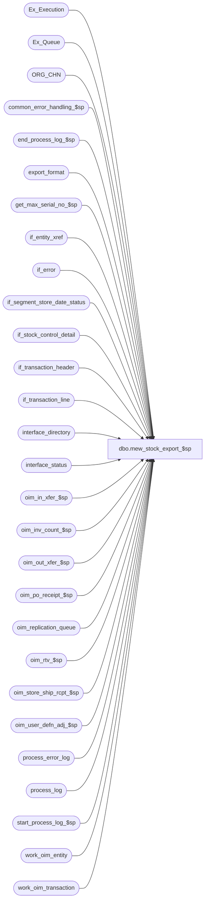

# dbo.mew_stock_export_$sp

**Database:** auditworks  
**Server:** bedrockdb01  

## Architecture Diagram



## Table Dependencies

| Referenced Table |
|---|
| Ex_Execution |
| Ex_Queue |
| ORG_CHN |
| common_error_handling_$sp |
| end_process_log_$sp |
| export_format |
| get_max_serial_no_$sp |
| if_entity_xref |
| if_error |
| if_segment_store_date_status |
| if_stock_control_detail |
| if_transaction_header |
| if_transaction_line |
| interface_directory |
| interface_status |
| oim_in_xfer_$sp |
| oim_inv_count_$sp |
| oim_out_xfer_$sp |
| oim_po_receipt_$sp |
| oim_replication_queue |
| oim_rtv_$sp |
| oim_store_ship_rcpt_$sp |
| oim_user_defn_adj_$sp |
| process_error_log |
| process_log |
| start_process_log_$sp |
| work_oim_entity |
| work_oim_transaction |

## Stored Procedure Code

```sql
create proc dbo.mew_stock_export_$sp 
( @interface_id                 tinyint = NULL )

AS

/*
Proc name: mew_stock_export_$sp
     Desc: To post Offline Inventory Management transactions.
           Called by multi stream ICT_EXPORT (ad-hoc mechanism)
 
HISTORY:
Date     Name            Defect   Desc
Jan04,11 Paul            105313   Use unicode datatypes
Sep11,08 PaulS           104806   Uplift 1-3YKUAE to SA5
Nov20,06 Paul           DV-1349   read EXTRNL_RFRNC_NUM
Oct25,06 Phu              77931   Fix outer join for SQL 2005 Mode 90.
Sep22,06 Paul             76719   apply 1-34YBHK to SA5, add nolock hints
May27,05 Paul           DV-1254   apply 48946 to SA5
Nov02,04 Paul           DV-1159   use ORG_CHN_NUM instead of location id
Oct07,04 David          DV-1146   Use column verified_by_user_id, apply 42301 to SA5
Jul09,04 ShuZ           DV-1071   superceded by DV-1146
Sep11,08 PaulS         1-3YKUAE   Avoid repeated retries in ICT_EXPORT01 when immediate_posting_requested = 2,
					 added NOLOCK hints
Sep08,05 ShuZ          1-34YHBK   Only allow line_sequence > 0 to be populated
Feb08,05 Daphna           48946   Add call to oim_user_defn_adj_$sp for entity = 160
Oct06,04 Vicci		  42301   Check context_info instead of login-name since users 
				  assigned to run smartload processes are user-defined 
				  in Smartload Var table maintenance.
May14,04 Phu              29268   Fix duplicate key insert in oim_out_xfer
Feb23,04 Phu              24432   Log object name to process_error_log
Jan12,04 Phu              21459   Include Transfer Ready To Send transactions
Sep09,03 Phu              15801   Initial development

*/

DECLARE
  @current_rows                 int,
  @batch_size                   int,
  @current_db_name              nvarchar(30),
  @cursor_open                  tinyint,
  @db_id                        int,
  @entity_code                  smallint,
  @errmsg                       nvarchar(255),
  @errno                        int,
  @function_name	        varbinary(128),
  @last_posting_datetime        datetime,
  @max_serial_no                numeric(14,0),
  @message_id                   int,
  @min_serial_no                numeric(14,0),
  @object_name                  nvarchar(255),
  @operation_name               nvarchar(100),
  @process_log_entry            tinyint,
  @process_name                 nvarchar(100),
  @process_no                   int,
  @process_timestamp            float,
  @retrieval_in_progress        tinyint,
  @rows                         int,
  @stream_no                    tinyint,
  @transaction_count            int


SELECT @batch_size = 2000,
       @current_db_name = db_name(),
       @function_name = convert(varbinary(128), 'auditworks_mew_stock_export'),
       @message_id = 201068,
       @operation_name = 'Validate',
       @process_log_entry = 0,
       @process_name = 'mew_stock_export_$sp',
       @process_no = 209,
       @stream_no = 1,
       @transaction_count = 0

SET CONTEXT_INFO @function_name

IF @interface_id IS NULL OR @interface_id <> 43
BEGIN
  SELECT @message_id = 201684,
         @errno = 201684,
         @object_name = @process_name,
         @errmsg = 'Invalid Argument(s) passed to the stored procedure ' + @process_name + '. Unable to proceed.'
  GOTO error
END

SELECT @stream_no = e.stream_no
FROM export_format e, interface_directory i
WHERE i.interface_id = @interface_id
AND i.interface_id = e.interface_id
AND i.ascii_export = e.export_format

SELECT @errno = @@error
IF @errno <> 0
BEGIN
  SELECT @errmsg = 'Unable to select stream_no from export_format',
         @object_name = 'export_format',
         @operation_name = 'SELECT'
  GOTO error
END

SELECT @stream_no = ISNULL(@stream_no, 1)

SELECT @retrieval_in_progress = retrieval_in_progress,
       @last_posting_datetime = last_posting_datetime
FROM interface_status
WHERE interface_id = @interface_id

SELECT @errno = @@error
IF @errno <> 0
BEGIN
  SELECT @errmsg = 'Unable to select retrieval_in_progress from interface_status',
         @object_name = 'interface_status',
         @operation_name = 'SELECT'
  GOTO error
END

IF @retrieval_in_progress <> 0
BEGIN
  SELECT @db_id = dbid
  FROM master..sysprocesses
  WHERE spid = @@spid

  SELECT @errno = @@error
  IF @errno != 0
  BEGIN
    SELECT @errmsg = 'Unable to select from master..sysprocesses',
           @object_name = 'master..sysprocesses',
           @operation_name = 'SELECT'
    GOTO error
  END

  IF EXISTS (SELECT 1
             FROM master..sysprocesses
             WHERE context_info = @function_name
             AND spid <> @@spid
             AND dbid = @db_id
             AND db_name(dbid) = @current_db_name)
  BEGIN
    SELECT @message_id = 201682,
           @errno = 201682,
           @object_name = @process_name,
           @errmsg = 'The stored proc ' + @process_name + ' is currently running on another stream. Please verify config.'
    GOTO error
  END
END

UPDATE interface_status
SET retrieval_in_progress = 1, last_retrieval_datetime = getdate()
WHERE interface_id = @interface_id

SELECT @errno = @@error
IF @errno <> 0
BEGIN
  SELECT @errmsg = 'Unable to set retrieval_in_progress in interface_status',
         @object_name = 'interface_status',
         @operation_name = 'UPDATE'
  GOTO error
END

WHILE 1 = 1
BEGIN
  SELECT @min_serial_no = ISNULL(MAX(to_serial_no),0) + 1
  FROM Ex_Execution WITH (NOLOCK)
  WHERE queue_id = @interface_id

  SELECT @errno = @@error
  IF @errno <> 0
  BEGIN
    SELECT @errmsg = 'Unable to select to_serial_no from Ex_Execution',
           @object_name = 'Ex_Execution',
           @operation_name = 'SELECT'
    GOTO error
  END

  EXEC get_max_serial_no_$sp @interface_id, @min_serial_no, @batch_size, @max_serial_no OUTPUT

  SELECT @errno = @@error
  IF @errno <> 0
  BEGIN
    SELECT @errmsg = 'Unable to execute get_max_serial_no_$sp',
           @object_name = 'get_max_serial_no_$sp',
           @operation_name = 'EXECUTE'
    GOTO error
  END

  IF @max_serial_no = 0
    BREAK

  IF @process_log_entry = 0
  BEGIN
    EXEC start_process_log_$sp @process_no, @process_timestamp OUTPUT, @errmsg OUTPUT
    SELECT @errno = @@error
    IF @errno <> 0
    BEGIN
      SELECT @errmsg = @errmsg + ' Unable to execute start_process_log_$sp',
             @object_name = 'start_process_log_$sp',
             @operation_name = 'EXECUTE'
      GOTO error
    END
    SELECT @process_log_entry = 1
  END

  TRUNCATE TABLE work_oim_entity
  SELECT @errno = @@error
  IF @errno <> 0
  BEGIN
    SELECT @errmsg = 'Unable to truncate table work_oim_entity',
           @object_name = 'work_oim_entity',
           @operation_name = 'TRUNCATE'
    GOTO error
  END

  TRUNCATE TABLE work_oim_transaction
  SELECT @errno = @@error
  IF @errno <> 0
  BEGIN
    SELECT @errmsg = 'Unable to truncate table work_oim_transaction',
           @object_name = 'work_oim_transaction',
           @operation_name = 'TRUNCATE'
    GOTO error
  END

  INSERT INTO work_oim_transaction (
    interface_id, if_entry_no, store_no, register_no,
    transaction_date, cashier_no, transaction_void_flag, transaction_id,
    interface_control_flag, if_rejection_rules_overriden, location_id)
  SELECT
    @interface_id, ith.if_entry_no, ith.store_no, ith.register_no,
    ith.transaction_date, ith.cashier_no, ith.transaction_void_flag, ith.transaction_id,
    xq.key_2, ISNULL(xq.key_4, 0), us.EXTRNL_RFRNC_NUM
  FROM Ex_Queue xq, if_transaction_header ith WITH (NOLOCK), ORG_CHN us WITH (NOLOCK)
  WHERE xq.queue_id = @interface_id
  AND xq.serial_no >= @min_serial_no
  AND xq.serial_no <= @max_serial_no
  AND xq.key_1 = ith.if_entry_no
  AND ith.store_no = us.ORG_CHN_NUM

  SELECT @errno = @@error
  IF @errno <> 0
  BEGIN
    SELECT @errmsg = 'Unable to insert work_oim_transaction',
           @object_name = 'work_oim_transaction',
           @operation_name = 'INSERT'
    GOTO error
  END

  INSERT INTO work_oim_entity (
    transaction_id, interface_id, if_entry_no, store_no,
    register_no, transaction_date, cashier_no, entity_code,
    segment_id, reference_no, min_line_id,
    max_line_id, if_rejection_rules_overriden, location_id, vendor_no,
    other_store_no, location_no, count_date, units,
    pos_identifier, reason, imrd, other_location_id, initiated_by_host)
  SELECT
    w.transaction_id, w.interface_id, MAX(w.if_entry_no), MAX(w.store_no),
    MAX(w.register_no), MAX(w.transaction_date), MAX(w.cashier_no), MAX(iex.entity_code),
    MAX(iex.segment_id), MAX(l.reference_no), MIN(l.line_id),
    MAX(l.line_id), MAX(w.if_rejection_rules_overriden), MAX(w.location_id), MAX(s.vendor_no),
    MAX(s.other_store_no), MAX(s.location_no), MAX(s.count_date), MAX(s.units * l.voiding_reversal_flag),
    MAX(s.pos_identifier), MAX(s.reason), MAX(s.imrd), MAX(us.EXTRNL_RFRNC_NUM), MAX(SIGN(s.initiated_by_host))
  FROM work_oim_transaction w WITH (NOLOCK)
       INNER JOIN if_transaction_line l WITH (NOLOCK) ON (w.if_entry_no = l.if_entry_no)
       INNER JOIN if_stock_control_detail s WITH (NOLOCK) ON (l.if_entry_no = s.if_entry_no AND l.line_id = s.line_id)
       INNER JOIN if_entity_xref iex WITH (NOLOCK) ON (s.display_def_id = iex.display_def_id
                                                       AND (iex.initiated_by_host_imrd_null IS NULL -- not relevant
                                                            OR (iex.initiated_by_host_imrd_null = 0 AND (SIGN(s.initiated_by_host) = 0 OR s.imrd IS NOT NULL))
                                                            OR (iex.initiated_by_host_imrd_null = 1 AND (SIGN(s.initiated_by_host) = 1 AND s.imrd IS NULL)) -- transfer ready to send
                                                           ))
       LEFT JOIN ORG_CHN us WITH (NOLOCK) ON (s.other_store_no = us.ORG_CHN_NUM)
  WHERE w.interface_control_flag = 10
  AND w.transaction_void_flag IN (0,8)
  AND l.line_void_flag = 0
  AND l.line_sequence > 0
  GROUP BY w.transaction_id, w.interface_id

  SELECT @errno = @@error
  IF @errno <> 0
  BEGIN
    SELECT @errmsg = 'Unable to insert work_oim_entity',
           @object_name = 'work_oim_entity',
           @operation_name = 'INSERT'
    GOTO error
  END

-- Determine whether any transactions contain more that 1 document and reject them if so
-- since this is not allowed (S/A only supports a whole transaction being valid or
-- a whole transaction being rejected, and the OIM validations are on a per document basis,
-- so the OIM tables have been defined with transaction_id as their unique key)

  INSERT INTO if_error (
    transaction_id, line_id, interface_id, if_reject_reason, 
    resource_id, resource_string, object_key, entity_code )
  SELECT
    transaction_id, max_line_id, interface_id, 108,
    1, 'Transaction may not include more than 1 document', reference_no, entity_code
  FROM work_oim_entity WITH (NOLOCK)
  WHERE min_line_id <> max_line_id

  SELECT @errno = @@error
  IF @errno <> 0
  BEGIN
    SELECT @errmsg = 'Unable to insert if_error (1)',
           @object_name = 'if_error',
           @operation_name = 'INSERT'
    GOTO error
  END

  DELETE work_oim_entity
  WHERE min_line_id <> max_line_id

  SELECT @errno = @@error
  IF @errno <> 0
  BEGIN
    SELECT @errmsg = 'Unable to delete work_oim_entity (1)',
           @object_name = 'work_oim_entity',
           @operation_name = 'DELETE'
    GOTO error
  END

-- Determine whether any transactions contain header stores for which the location_id
-- has not yet been defined in user_store, and if so reject them.

  INSERT INTO if_error (
    transaction_id, line_id, interface_id, if_reject_reason, 
    resource_id, resource_string,
    object_key, entity_code, token )
  SELECT
   w.transaction_id, w.max_line_id, w.interface_id, 108, 
   2, 'The location_id for store ' + CONVERT(nvarchar, w.store_no) + ' has not been defined',
   w.reference_no, w.entity_code, CONVERT(nvarchar, w.store_no)
  FROM work_oim_entity w WITH (NOLOCK)
  WHERE location_id IS NULL --

  SELECT @errno = @@error
  IF @errno <> 0
  BEGIN
    SELECT @errmsg = 'Unable to insert if_error (2)',
           @object_name = 'if_error',
           @operation_name = 'INSERT'
    GOTO error
  END

  DELETE work_oim_entity
  WHERE location_id IS NULL --

  SELECT @errno = @@error
  IF @errno <> 0
  BEGIN
    SELECT @errmsg = 'Unable to delete work_oim_entity (2)',
           @object_name = 'work_oim_entity',
           @operation_name = 'DELETE'
    GOTO error
  END

-- Determine whether any transactions contain other stores for which the location_id
-- has not yet been defined in user_store, and if so reject them.

  INSERT INTO if_error (
    transaction_id, line_id, interface_id, if_reject_reason, 
    resource_id, resource_string,
    object_key, entity_code, token )
  SELECT
    w.transaction_id, w.max_line_id, w.interface_id, 108, 
    2, 'The location_id for store ' + CONVERT(nvarchar, w.other_store_no) + ' has not been defined',
    w.reference_no, w.entity_code, CONVERT(nvarchar, w.other_store_no)
  FROM work_oim_entity w WITH (NOLOCK)
  WHERE other_store_no IS NOT NULL --
  AND other_location_id IS NULL --

  SELECT @errno = @@error
  IF @errno <> 0
  BEGIN
    SELECT @errmsg = 'Unable to insert if_error (3)',
     @object_name = 'if_error',
           @operation_name = 'INSERT'
    GOTO error
  END

  DELETE work_oim_entity
  WHERE other_store_no IS NOT NULL --
  AND other_location_id IS NULL --

  SELECT @errno = @@error
  IF @errno <> 0
  BEGIN
    SELECT @errmsg = 'Unable to delete work_oim_entity (3)',
           @object_name = 'work_oim_entity',
           @operation_name = 'DELETE'
    GOTO error
  END

  SELECT @current_rows = COUNT(transaction_id)
  FROM work_oim_entity WITH (NOLOCK)

  SELECT @errno = @@error
  IF @errno <> 0
  BEGIN
    SELECT @errmsg = 'Unable to count rows in work_oim_entity',
           @object_name = 'work_oim_entity',
           @operation_name = 'SELECT'
    GOTO error
  END

  SELECT @transaction_count = @transaction_count + @current_rows

  DECLARE entity_crsr CURSOR FAST_FORWARD
  FOR
  SELECT DISTINCT entity_code
  FROM work_oim_entity WITH (NOLOCK)
  ORDER BY entity_code

  SELECT @errno = @@error
  IF @errno <> 0
  BEGIN
    SELECT @errmsg = 'Unable to declare cursor entity_crsr',
           @object_name = 'entity_crsr',
           @operation_name = 'DECLARE'
    GOTO error
  END

  OPEN entity_crsr
  SELECT @cursor_open = 1

  WHILE 1 = 1
  BEGIN
    FETCH entity_crsr INTO
      @entity_code

    IF @@fetch_status <> 0
      BREAK

    IF @entity_code = 10
    BEGIN
      EXEC oim_po_receipt_$sp
      SELECT @errno = @@error
      IF @errno <> 0
      BEGIN
        SELECT @errmsg = 'Unable to execute stored procedure oim_po_receipt_$sp',
               @object_name = 'oim_po_receipt_$sp',
             @operation_name = 'EXECUTE'
        GOTO error
      END
    END
    ELSE
    IF @entity_code IN (50, 150)
    BEGIN
      EXEC oim_out_xfer_$sp @entity_code
      SELECT @errno = @@error
      IF @errno <> 0
      BEGIN
        SELECT @errmsg = 'Unable to execute stored procedure oim_out_xfer_$sp',
               @object_name = 'oim_out_xfer_$sp',
               @operation_name = 'EXECUTE'
        GOTO error
      END
    END
    ELSE
    IF @entity_code = 60
    BEGIN
      EXEC oim_rtv_$sp
      SELECT @errno = @@error
      IF @errno <> 0
      BEGIN
        SELECT @errmsg = 'Unable to execute stored procedure oim_rtv_$sp',
               @object_name = 'oim_rtv_$sp',
               @operation_name = 'EXECUTE'
        GOTO error
      END
    END
    ELSE
    IF @entity_code = 120
    BEGIN
EXEC oim_inv_count_$sp
      SELECT @errno = @@error
      IF @errno <> 0
      BEGIN
        SELECT @errmsg = 'Unable to execute stored procedure oim_inv_count_$sp',
               @object_name = 'oim_inv_count_$sp',
    @operation_name = 'EXECUTE'
        GOTO error
      END
    END
    ELSE
    IF @entity_code = 130
    BEGIN
      EXEC oim_in_xfer_$sp
      SELECT @errno = @@error
      IF @errno <> 0
      BEGIN
        SELECT @errmsg = 'Unable to execute stored procedure oim_in_xfer_$sp',
    @object_name = 'oim_in_xfer_$sp',
               @operation_name = 'EXECUTE'
        GOTO error
      END
    END
    ELSE
    IF @entity_code = 140
    BEGIN
      EXEC oim_store_ship_rcpt_$sp
      SELECT @errno = @@error
      IF @errno <> 0
      BEGIN
        SELECT @errmsg = 'Unable to execute stored procedure oim_store_ship_rcpt_$sp',
               @object_name = 'oim_store_ship_rcpt_$sp',
               @operation_name = 'EXECUTE'
        GOTO error
      END
END
    ELSE
    IF @entity_code = 160
    BEGIN
      EXEC oim_user_defn_adj_$sp
      SELECT @errno = @@error
      IF @errno <> 0
      BEGIN
        SELECT @errmsg = 'Unable to execute stored procedure oim_user_defn_adj_$sp',
               @object_name = 'oim_user_defn_adj_$sp',
               @operation_name = 'EXECUTE'
        GOTO error
      END
    END
  END -- while 1 = 1

  CLOSE entity_crsr
  DEALLOCATE entity_crsr
  SELECT @cursor_open = 0

-- Mark the transactions as having been posted and release them to OIM:

  BEGIN TRANSACTION

  INSERT INTO oim_replication_queue (entity_code, replication_action, entity_id)
  SELECT entity_code, 'I', transaction_id
  FROM work_oim_entity WITH (NOLOCK)

  SELECT @errno = @@error
  IF @errno <> 0
  BEGIN
    SELECT @errmsg = 'Unable to insert oim_replication_queue',
           @object_name = 'oim_replication_queue',
      @operation_name = 'INSERT'
    GOTO error
  END
 
  INSERT INTO if_segment_store_date_status (
    interface_id, segment_id, store_no,  transaction_date, last_queue_id)
  SELECT
    w.interface_id, w.segment_id, w.store_no, w.transaction_date, MAX(oim.oim_replication_queue_id)
  FROM work_oim_entity w WITH (NOLOCK), oim_replication_queue oim WITH (NOLOCK)
  WHERE w.entity_code = oim.entity_code
  AND w.transaction_id = oim.entity_id
  GROUP BY w.interface_id, w.segment_id, w.store_no, w.transaction_date

  SELECT @errno = @@error
  IF @errno <> 0
  BEGIN
    SELECT @errmsg = 'Unable to insert if_segment_store_date_status',
           @object_name = 'if_segment_store_date_status',
           @operation_name = 'INSERT'
    GOTO error
  END

  INSERT Ex_Execution (queue_id, object_id, execution_id, from_serial_no, to_serial_no)
  VALUES (@interface_id, @interface_id * -1, 0, @min_serial_no, @max_serial_no)

  SELECT @errno = @@error
  IF @errno <> 0
  BEGIN
    SELECT @errmsg = 'Unable to insert Ex_Execution for queue_id ' + CONVERT(nvarchar, @interface_id),
           @object_name = 'Ex_Execution',
           @operation_name = 'INSERT'
    GOTO error
  END

  COMMIT

END -- while 1 = 1

IF @process_log_entry = 1
BEGIN
  EXEC end_process_log_$sp @process_no, @process_timestamp, @transaction_count
  SELECT @errno = @@error
  IF @errno <> 0
  BEGIN
    SELECT @errmsg = 'Unable to exec end_process_log_$sp',
           @object_name = 'end_process_log_$sp',
           @operation_name = 'EXECUTE'
    GOTO error
  END

   UPDATE process_error_log
      SET verified = 1,
          verified_by_user_id = NULL -- system
    WHERE process_no = @process_no
      AND verified = 0

   SELECT @errno = @@error
   IF @errno <> 0
     BEGIN
	SELECT @errmsg = 'Unable to update process_error_log',
	       @object_name = 'process_error_log',
   	       @operation_name = 'UPDATE'
	GOTO error
     END

   UPDATE process_log
      SET process_status_flag = 3
    WHERE process_start_time = process_end_time
      AND process_no = @process_no
      AND process_status_flag = 1

   SELECT @errno = @@error
   IF @errno <> 0
     BEGIN
	SELECT @errmsg = 'Unable to update process_log',
              @object_name = 'process_log',
               @operation_name = 'UPDATE'
	GOTO error
     END

  END -- If @process_log_entry = 1

-- Mark the interface as complete if no more data has come in since start of proc

UPDATE interface_status
SET last_retrieval_datetime = getdate(),
    retrieval_in_progress = 0,
    immediate_posting_requested = 1 -- reset in case the prev value was 2. export.ict will set back to zero afterwards.
WHERE last_posting_datetime = @last_posting_datetime
AND interface_id = @interface_id

SELECT @errno = @@error, @rows = @@rowcount
IF @errno <> 0
BEGIN
  SELECT @errmsg = 'Unable to set retrieval_in_progress in interface_status for interface_id ' + CONVERT(nvarchar, @interface_id),
         @object_name = 'interface_status',
         @operation_name = 'UPDATE'
  GOTO error
END

If @rows = 0 -- more data has been posted to interface tables since start of proc (last_posting_datetime changed)
BEGIN
  UPDATE interface_status
  SET last_retrieval_datetime = getdate(),
      retrieval_in_progress = 0,
      immediate_posting_requested = 2 -- may have more work to do. Next exec of ICT_EXPORT FBlock 15 will see the 2 and try again.
  WHERE interface_id = @interface_id

  SELECT @errno = @@error
  IF @errno <> 0
  BEGIN
    SELECT @errmsg = 'Unable to set immediate_posting_requested in interface_status for interface_id ' + CONVERT(nvarchar, @interface_id),
           @object_name = 'interface_status',
           @operation_name = 'UPDATE'
    GOTO error
  END
END

RETURN

error:

  IF @cursor_open = 1
  BEGIN
    CLOSE entity_crsr
    DEALLOCATE entity_crsr
  END

  EXEC common_error_handling_$sp @process_no, @errno, @errmsg, 0, @message_id, @process_name, @object_name, @operation_name, 1, @stream_no

  RETURN
```

