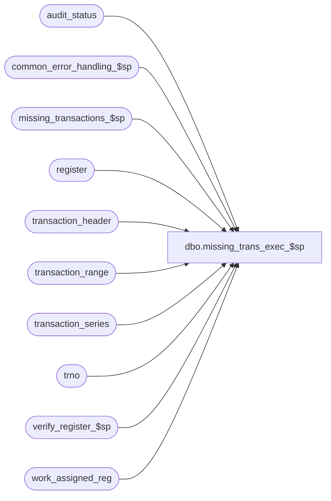

# dbo.missing_trans_exec_$sp

**Database:** auditworks  
**Server:** bedrockdb01  

## Architecture Diagram



## Table Dependencies

| Referenced Table |
|---|
| audit_status |
| common_error_handling_$sp |
| missing_transactions_$sp |
| register |
| transaction_header |
| transaction_range |
| transaction_series |
| trno |
| verify_register_$sp |
| work_assigned_reg |

## Stored Procedure Code

```sql
create proc dbo.missing_trans_exec_$sp 

@store_no		int,
@transaction_date	smalldatetime,
@old_register_no	smallint,
@date_reject_id		tinyint,
@errmsg			varchar(255) OUTPUT,
@all_series		int, -- 0 = only one series (@transaction_series), 1 = all series
@audit_status		smallint,
@process_no 		smallint,  -- calling function
@transaction_series	char,  -- affected series (passed from frontend, NOT NULL) 
@log_error_flag 	tinyint = 0,  -- 1 if called by smartload
@edit_process_no 	tinyint = 1,  
@all_reg                tinyint = 0,  -- DEF 1-BMAEV  = 1 when whole store (move, massdel)
@move_flag		tinyint = 1 -- 0 = fixing invalid register

AS

/* 
PROC NAME: missing_transactions_exec_$sp
     DESC: Called from move_reg_media_rec_$sp, transaction_add_$sp, delete_store_reg_date_$sp,
           rollforward_transaction_add_$sp and edit_missing_transactions_$sp.
           For invalid register or store, update/inserts transaction_range only
           For date reject, calls missing_transactions_$sp 
           Calls missing_transcactions_$sp with various parameters depending on situation
           
  HISTORY:
Date     Name	    Def# Desc
Dec12,02 Winnie	 1-G4RBY delete transaction range when call by delete_store_reg_date before
     			 calling missing_transaction_$sp
OCT17,02 Daphna  1-G1GCL when next_date is not open, ensure call to missing_transaction_$sp
                         passes next_date as eval-date and tran_date as log-to-date and
                         call verify register_$sp passing tran_date (not next_date)
AUG19,02 Daphna  1-BMAEV Determine use of assigned register group by transaction_series
                         evaluate seq-by-assigned-reg series for single reg function
                         (all_reg = 0), 
SEP27,02 Daphna  1-FMGUG call verify_register_$sp after calc missing txns for each SRD                         
MAY03,02 Daphna  1-COKT3 When series not found in transaction_series, insert as non-sequential
SEP27,02 Daphna  1-FE0G1 RETROFIT 1-FMGUG to R3.0
DEC26,01 Daphna     8628 Ensure cursor only created from transaction_range for sequential series
                         Input variable @edit_process_no, passed in call to missing_transactions_$sp
                         for R3 Error Handling
NOV19,01 Daphna     8952 Error Handling changes
NOV09,01 Daphna     8929 change datatype for first_datetime and last_datetime to datetime
                         (prev smalldatetime) 
                         Select MAX tran no for last, MIN tran no for first
Sep21,01 Daphna     8629 author

*/

DECLARE	@by_assigned_reg        tinyint,   -- DEF 1-BMAEV
	@count			int,
        @cursor_open		tinyint,   -- changed from bit
	@errno			int,
	@first_datetime		datetime,
	@first_txn_no		trno,
	@last_datetime		datetime,
 	@last_txn_no		trno,
	@log_missing_flag	tinyint, -- parameter passed to missing_transactions_$sp  	
	@max_transaction_no	trno,
	@min_transaction_no	trno,
	@next_date		smalldatetime,
	@open_date		tinyint, 
	@process_id             int,  -- 1-BMAEV	
	@register_no		smallint,  -- for assigned register
	@add_to_missing_qty     tinyint,  -- 1-BMAEV: for call to proc
	@rows			int,
	@series			char,
	@seq_series		tinyint,  -- 0 = no, 1 = yes, 2 = series not found
	@to_transaction_no	trno,
	@transaction_no	trno,	
-- for error handling
        @operation_name	varchar(100),
        @object_name     varchar(255),
        @process_name    varchar(100),
        @message_id      int

SELECT @rows = 0,
       @process_name = 'missing_transactions_exec_$sp',
       @message_id = 201068,
       @process_id = @@spid      

-- def 1-BMAEV: cleanup work table
DELETE work_assigned_reg
WHERE process_id = @process_id

SELECT @errno = @@error
IF @errno != 0
BEGIN
  SELECT @errmsg = 'before any insert: where process_id = @process_id',
         @object_name = 'work_assigned_reg',
         @operation_name = 'DELETE'
  GOTO error
END


IF @all_series = 1  
BEGIN

  UPDATE audit_status
     SET missing_qty = 0
   WHERE store_no = @store_no
     AND register_no = @old_register_no
     AND sales_date = @transaction_date
     AND date_reject_id = @date_reject_id  
   
  SELECT @errno = @@error
  IF @errno != 0
  BEGIN
    SELECT @errmsg = 'Failed to UPDATE audit_status (missing_qty=0)',
           @object_name = 'audit_status',
           @operation_name = 'UPDATE'
    GOTO error
  END

  -- DEF 1-COKT3: remove join to transaction_series to select all series 
  SELECT DISTINCT h.transaction_series
    INTO #temp_tran_header
    FROM transaction_header h
   WHERE store_no = @store_no
     AND register_no = @old_register_no
     AND transaction_date = @transaction_date
     AND date_reject_id = @date_reject_id

  SELECT @errno = @@error,
       @rows = @@rowcount
  IF @errno != 0
  BEGIN
    SELECT @errmsg = 'Failed to SELECT INTO #temp_tran_header',
           @object_name = '#temp_tran_header',
           @operation_name = 'SELECT INTO'    
    GOTO error
  END

  IF @rows > 0
  BEGIN
    DECLARE tran_series_crsr CURSOR FOR
    SELECT DISTINCT transaction_series
    FROM #temp_tran_header
    FOR READ ONLY

    SELECT @errno = @@error
    IF @errno != 0
    BEGIN
      SELECT @errmsg = 'Failed to DECLARE tran_series_crsr',
             @object_name = 'tran_series_crsr',
             @operation_name = 'DECLARE'      
      GOTO error
    END
  END  -- @rows > 0
  ELSE  -- NO ROWS IN TRAN HEADER
  BEGIN
    CREATE TABLE #temp_tran_range
    (transaction_series char)

    SELECT @errno = @@error
    IF @errno != 0
    BEGIN
      SELECT @errmsg = 'temp table',
             @object_name = '#temp_tran_range',
             @operation_name = 'CREATE'      
      GOTO error
    END
    
    INSERT INTO #temp_tran_range
    SELECT r.transaction_series
      FROM transaction_range r, transaction_series s --, register rg  -- def 8628
     WHERE r.store_no = @store_no
       AND r.register_no = @old_register_no
       AND transaction_date = @transaction_date
       AND r.transaction_series = s.transaction_series  -- def 8628
       AND s.sequential = 1     -- def 8628

    SELECT @errno = @@error,
           @rows = @@rowcount
    IF @errno != 0
    BEGIN
      SELECT @errmsg = 'for old_register_no',
             @object_name = '#temp_tran_range',
             @operation_name = 'INSERT'      
      GOTO error                           
    END

    IF @rows = 0
    BEGIN  -- lookup tran range for assigned reg
      INSERT INTO #temp_tran_range
      SELECT r.transaction_series        
        FROM transaction_range r, transaction_series s, register rg  
       WHERE r.store_no = @store_no
         AND r.register_no = rg.assigned_register_group
         AND rg.register_no = @old_register_no 
         AND rg.store_no = @store_no
         AND transaction_date = @transaction_date
         AND r.transaction_series = s.transaction_series  -- def 8628
         AND s.sequential = 1     -- def 8628
    
      SELECT @errno = @@error,
             @rows = @@rowcount
      IF @errno != 0
      BEGIN
        SELECT @errmsg = 'for assigned register',
               @object_name = '#temp_tran_range',
               @operation_name = 'INSERT'      
        GOTO error                           
      END         
    END
    
    IF @rows > 0
    BEGIN
      DECLARE tran_series_crsr CURSOR FOR
      SELECT DISTINCT transaction_series
      FROM #temp_tran_range
      FOR READ ONLY

      SELECT @errno = @@error
      IF @errno != 0
      BEGIN
        SELECT @errmsg = 'Failed to DECLARE tran_series_crsr',
               @object_name = 'tran_series_crsr',
               @operation_name = 'DECLARE'
        GOTO error 
      END
    END  -- @rows > 0 
    ELSE  
    BEGIN
      DROP TABLE #temp_tran_range
      RETURN
    END  -- @rows = 0   
  END  
  
  OPEN tran_series_crsr

  SELECT @errno = @@error
  IF @errno != 0
  BEGIN
    SELECT @errmsg = 'Failed to OPEN tran_series_crsr',
           @object_name = 'tran_series_crsr',
           @operation_name = 'OPEN CURSOR'
    GOTO error
  END

  SELECT @cursor_open = 1
END  -- @all_series = 1

WHILE 1=1
BEGIN

  IF @all_series = 1
  BEGIN
    FETCH tran_series_crsr INTO
  	  @series

    IF @@fetch_status <> 0
      BREAK -- get out of while 1=1 loop
  END
  ELSE  -- only one series
    SELECT @series = @transaction_series  -- the affected series only

  SELECT  @add_to_missing_qty = @all_series  -- reset in called proc when all_series = 0
  
  SELECT @seq_series = 2  -- default
  
  SELECT @seq_series = ISNULL(sequential, 2)
    FROM transaction_series
   WHERE transaction_series = @series
  
  SELECT @errno = @@error
  IF @errno != 0
  BEGIN
     SELECT @errmsg = '@seq_series = ISNULL(sequential, 2)',
            @object_name = 'transaction_series',
            @operation_name = 'SELECT'
     GOTO error
   END  

  IF @seq_series IN (0,2)  -- not sequential or not found
  BEGIN  
    IF @seq_series = 2 -- not found in transaction_series
    BEGIN  
      -- insert series as non-sequential by default
      INSERT INTO transaction_series
            (transaction_series, description, sequential,comments, code_meaning_control)
      VALUES(@series, 'Unknown Series', 0, 'Entry Created by System', 'U')

      SELECT @errno = @@error
      IF @errno != 0
      BEGIN
        SELECT @errmsg = '@series = Unknown Series',
               @object_name = 'transaction_series',
               @operation_name = 'INSERT'
        GOTO error
      END      
    END  -- not found in transaction_series
  
    IF @all_series = 0 -- only one series, exit loop
      BREAK    
    ELSE   
      CONTINUE  -- next fetch
  END  -- not sequential or not found  
   
  --  1-BMAEV : determine whether series seq by assigned reg, populate work table
  SELECT @by_assigned_reg = by_assigned_reg
  FROM transaction_series 
  WHERE transaction_series = @series
 
  SELECT @errno = @@error
  IF @errno != 0
  BEGIN
     SELECT @errmsg = '@by_assigned_reg = by_assigned_reg',
            @object_name = 'transaction_series',
            @operation_name = 'SELECT'
     GOTO error
  END
  
  IF @by_assigned_reg = 0  -- series sequential by one reg only 
  BEGIN
    INSERT INTO work_assigned_reg
      (process_id, register_no, assigned_reg_no)
    VALUES(@process_id, @old_register_no, @old_register_no)  
    
    SELECT @errno = @@error
    IF @errno != 0
    BEGIN
      SELECT @errmsg = 'one reg only',
             @object_name = 'work_assigned_reg',
             @operation_name = 'INSERT'
      GOTO error
    END      
    
    SELECT @register_no = @old_register_no
  END
  ELSE  -- seq by assigned reg
  BEGIN
    SELECT @register_no = ISNULL(assigned_register_group,@old_register_no)
      FROM register
     WHERE store_no = @store_no
       AND register_no = @old_register_no

    SELECT @errno = @@error
    IF @errno != 0
    BEGIN
      SELECT @errmsg = 'assigned register no',
             @object_name = 'register',
             @operation_name = 'SELECT'
      GOTO error
    END
  
    IF @all_reg = 1   -- whole store
    BEGIN    
      IF @process_no in (9,109)  -- called by move
      BEGIN
        CONTINUE  -- skip this series
      END
              
      IF (@process_no IN (5,40) AND @old_register_no <> @register_no)  -- edit, mass delete
      BEGIN
        CONTINUE   -- skip this series              
      END
      ELSE  -- NOT (@process_no IN (5,40) AND @old_register_no <> @register_no)  -- edit, mass delete
      BEGIN
        INSERT INTO work_assigned_reg
              (process_id, register_no, assigned_reg_no)
        SELECT @process_id, register_no, @register_no
          FROM register  
         WHERE store_no = @store_no
         AND assigned_register_group = @register_no
    
        SELECT @errno = @@error
        IF @errno != 0
        BEGIN
          SELECT @errmsg = 'all registers in assignment group/whole store',
                 @object_name = 'work_assigned_reg',
                 @operation_name = 'INSERT'
          GOTO error
        END           
      
        IF @old_register_no <> @register_no
          SELECT @add_to_missing_qty = 0  -- not set = 0 above
      END   -- NOT (@process_no IN (5,40) AND @old_register_no <> @register_no)  -- edit, mass delete    
    END
    ELSE  -- all_reg = 0: single reg functions 
    BEGIN 
      INSERT INTO work_assigned_reg
        (process_id, register_no, assigned_reg_no)
      SELECT @process_id, register_no, @register_no
        FROM register  
       WHERE store_no = @store_no
         AND assigned_register_group = @register_no
    
      SELECT @errno = @@error
      IF @errno != 0
      BEGIN
        SELECT @errmsg = 'all registers in assigment group/single reg',
               @object_name = 'work_assigned_reg',
               @operation_name = 'INSERT'
        GOTO error
      END           
      
      IF @old_register_no <> @register_no
        SELECT @add_to_missing_qty = 0  -- not set = 0 above
    END   -- all_reg = 0: evaluate series seq by assigned reg
  END  --seq by assigned reg    

  SELECT @count = 0,
         @log_missing_flag = 1,
         @open_date = 0        
  
  /* DELETE transaction_range for mass delete before calling missing_transaction */
  
  IF @process_no = 40
    BEGIN
      DELETE transaction_range
       WHERE store_no = @store_no
         AND transaction_date = @transaction_date
         AND date_reject_id = @date_reject_id 
         AND (@all_reg = 1 OR register_no = @register_no)
         
      SELECT @errno = @@error
      IF @errno != 0
      BEGIN
         SELECT @errmsg = 'Failed to delete from transaction_range for delete S/R/D',
                @object_name = 'transaction_range',
                @operation_name = 'DELETE'
         GOTO error
      END
    END 

  IF (@date_reject_id <> 0 OR @audit_status IN (7,8))  -- bad data
  BEGIN

    SELECT @log_missing_flag = 0 -- do not update audit_status or transaction_missing
    
    SELECT @count = COUNT(transaction_no)
      FROM transaction_header h, work_assigned_reg w
     WHERE store_no = @store_no
       AND transaction_date = @transaction_date
       AND date_reject_id = @date_reject_id
       AND transaction_series = @series
       AND w.process_id = @process_id
       AND w.assigned_reg_no = @register_no      
       AND h.register_no =  w.register_no
    
    SELECT @errno = @@error
    IF @errno != 0
    BEGIN
       SELECT @errmsg = 'Failed to SELECT from transaction_header',
              @object_name = 'transaction_header',
              @operation_name = 'SELECT'
       GOTO error
    END
    
    IF @count > 0  -- transactions still exist for this S/R/D/drj/series
    BEGIN
      IF @audit_status IN (7,8)
      BEGIN 
        SELECT @first_datetime = MIN(entry_date_time),
               @last_datetime = MAX(entry_date_time)
          FROM transaction_header h, work_assigned_reg w
         WHERE store_no = @store_no
           AND h.register_no = w.register_no
           AND transaction_date = @transaction_date
           AND date_reject_id = @date_reject_id
           AND transaction_series = @series
           AND w.process_id = @process_id
           AND w.assigned_reg_no = @register_no

        SELECT @errno = @@error
        IF @errno != 0
        BEGIN
          SELECT @errmsg = 'Failed to SELECT from transaction_header (datetimes)',
                 @object_name = 'audit_status',
                 @operation_name = 'UPDATE'
          GOTO error
        END
  
        SELECT @first_txn_no = MIN(transaction_no)   -- def 8929
          FROM transaction_header h, work_assigned_reg w
         WHERE store_no = @store_no
           AND h.register_no = w.register_no
           AND transaction_date = @transaction_date
           AND date_reject_id = @date_reject_id
           AND transaction_series = @series
           AND entry_date_time = @first_datetime
           AND w.process_id = @process_id
           AND w.assigned_reg_no = @register_no

        SELECT @errno = @@error
        IF @errno != 0
        BEGIN
          SELECT @errmsg = 'Failed to SELECT from transaction_header (first_txn_no)',
                 @object_name = 'transaction_header',
                 @operation_name = 'SELECT'
          GOTO error
        END

        SELECT @last_txn_no = MAX(transaction_no)  -- def8929
          FROM transaction_header h, work_assigned_reg w
         WHERE store_no = @store_no
           AND h.register_no = w.register_no
           AND transaction_date = @transaction_date
           AND date_reject_id = @date_reject_id
           AND transaction_series = @series
           AND entry_date_time = @last_datetime
           AND w.process_id = @process_id
           AND w.assigned_reg_no = @register_no

        SELECT @errno = @@error
        IF @errno != 0
        BEGIN
          SELECT @errmsg = 'Failed to SELECT from transaction_header (last_txn_no)',
                 @object_name = 'transaction_header',
                 @operation_name = 'SELECT'
          GOTO error
        END
   
        UPDATE transaction_range
           SET first_transaction_no = @first_txn_no,
               last_transaction_no = @last_txn_no
         WHERE store_no = @store_no
           AND register_no = @register_no
           AND transaction_date = @transaction_date  -- same as log date
           AND date_reject_id = @date_reject_id
           AND transaction_series = @series

        SELECT @errno = @@error,
               @rows = @@rowcount
        IF @errno != 0
        BEGIN
          SELECT @errmsg = 'Failed to update transaction_range for tran date',
                 @object_name = 'transaction_range',
                 @operation_name = 'UPDATE'
          GOTO error
        END

        IF @rows = 0 -- updated in transaction_range for tran date
        BEGIN
          INSERT INTO transaction_range
                      (store_no, register_no, transaction_date, date_reject_id, 
                 transaction_series, first_transaction_no, last_transaction_no)
          VALUES (@store_no, @register_no, @transaction_date, @date_reject_id,
                  @series,  @first_txn_no, @last_txn_no)    

          SELECT @errno = @@error
          IF @errno != 0
          BEGIN
           SELECT @errmsg = 'Failed to insert on transaction_range for tran_date',
                  @object_name = 'transaction_range',
                  @operation_name = 'INSERT'
           GOTO error
          END
        END -- @rows = 0 updated in transaction_range for tran date
      END 
      ELSE  -- @audit_status NOT IN (7,8)
      BEGIN      
        EXEC missing_transactions_$sp @store_no, @transaction_date, @register_no,
              @date_reject_id, @errmsg OUTPUT, @series, @all_series, NULL, @log_missing_flag,
              @log_error_flag,  @process_no, @edit_process_no, @process_id
              
        SELECT @errno = @@error
        IF @errno <> 0
        BEGIN
          SELECT @errmsg = 'Failed to EXEC missing_transactions_$sp (1)',
                 @object_name = 'missing_transactions_$sp',
                 @operation_name = 'EXECUTE'
          GOTO error
        END      
      END -- @audit_status NOT IN (7,8)  
    END -- @count > 0    
  END
  ELSE -- good data
  BEGIN  
    IF (@process_no <> 40 OR  @old_register_no <> @register_no)
        -- SKIP when called by mass delete for non-assigned reg
    BEGIN
      EXEC missing_transactions_$sp @store_no, @transaction_date, @register_no,
              @date_reject_id, @errmsg OUTPUT, @series, @add_to_missing_qty, NULL, 
              @log_missing_flag, @log_error_flag, @process_no, @edit_process_no, @process_id
              
      SELECT @errno = @@error
      IF @errno <> 0
      BEGIN
        SELECT @errmsg = 'Failed to EXEC missing_transaction_$sp (2)',
               @object_name = 'missing_transactions_$sp',
               @operation_name = 'EXECUTE'
        GOTO error
      END
    
      --DEF 1-FMGUG
      EXEC verify_register_$sp @store_no, @register_no, @transaction_date, @date_reject_id,
                               @errmsg OUTPUT
      SELECT @errno = @@error
      IF @errno <> 0
      BEGIN
        SELECT @errmsg = 'for transaction date',
               @object_name = 'verify_register_$sp',
               @operation_name = 'EXECUTE'
        GOTO error
      END      
    END  -- @process_no <> 40  SKIP when called by mass delete 

    -- get date of next occurance of series
    
    SELECT @next_date = MIN(transaction_date)
    FROM transaction_range 
    WHERE store_no = @store_no
    AND register_no = @register_no
    AND transaction_series = @series 
    AND transaction_date > @transaction_date

    SELECT @errno = @@error
    IF @errno <> 0
    BEGIN
        SELECT @errmsg = 'Failed to SELECT next date from transaction_range',
               @object_name = 'transaction_range',
               @operation_name = 'SELECT'
        GOTO error
    END
    IF @next_date IS NOT NULL /* then */
    BEGIN
      SELECT @open_date = 1
        FROM audit_status
       WHERE store_no = @store_no
         AND register_no = @register_no
         AND sales_date = @next_date
         AND date_reject_id = 0
         AND (audit_status IN (100,200) OR @move_flag = 0)
      
      SELECT @errno = @@error
      IF @errno <> 0
      BEGIN
        SELECT @errmsg = 'Failed to SELECT from audit_status',
               @object_name = 'audit_status',
               @operation_name = 'SELECT'
        GOTO error
      END   
      IF @open_date = 1
      BEGIN  
        
        EXEC missing_transactions_$sp @store_no, @next_date, @register_no,
              @date_reject_id, @errmsg OUTPUT, @series, 0 /*@all_series*/, NULL, @log_missing_flag,
              @log_error_flag, @process_no, @edit_process_no, @process_id
              
        SELECT @errno = @@error
        IF @errno <> 0
        BEGIN
          SELECT @errmsg = 'Failed to EXEC missing_transactions_$sp (3)',
                 @object_name = 'missing_transactions_$sp',
                 @operation_name = 'EXECUTE'
          GOTO error
        END
        
        --DEF 1-FMGUG
        EXEC verify_register_$sp @store_no, @register_no, @next_date, @date_reject_id,
                               @errmsg OUTPUT
        SELECT @errno = @@error
        IF @errno <> 0
        BEGIN
          SELECT @errmsg = 'for next open date',
                 @object_name = 'verify_register_$sp',
                 @operation_name = 'EXECUTE'
          GOTO error
        END        
      END
      ELSE  -- date is 'closed'
      BEGIN
        SELECT @count = COUNT(transaction_no)
          FROM transaction_header h, work_assigned_reg w
         WHERE store_no = @store_no
           AND h.register_no = w.register_no
           AND transaction_date = @transaction_date
           AND date_reject_id = @date_reject_id
           AND transaction_series = @series
           AND w.process_id = @process_id
           AND w.assigned_reg_no = @register_no
    
        SELECT @errno = @@error
        IF @errno != 0
        BEGIN
          SELECT @errmsg = 'Failed to SELECT from transaction_header (2)',
                 @object_name = 'transaction_header',
                 @operation_name = 'SELECT'
          GOTO error
        END
        
        IF ( @count > 0 OR @process_no = 40 )
        BEGIN
          -- DEF 1-G1GCL: pass eval-date = next_date, log-to-date = tran_date
            EXEC missing_transactions_$sp @store_no, @next_date, @register_no,
                   @date_reject_id, @errmsg OUTPUT, @series, 0 /*@all_series*/, @transaction_date, 
                   @log_missing_flag,@log_error_flag, @process_no, @edit_process_no, @process_id
              
              SELECT @errno = @@error
              IF @errno <> 0
              BEGIN
                SELECT @errmsg = 'Failed to EXEC missing_transactions_$sp (4)',
                       @object_name = 'missing_transactions_$sp',
                       @operation_name = 'EXECUTE'
                GOTO error
              END
          --DEF 1-G1GCL: pass transaction_date when next_date not open
          --DEF 1-FMGUG
          EXEC verify_register_$sp @store_no, @register_no, @transaction_date, @date_reject_id,
                               @errmsg OUTPUT
          SELECT @errno = @@error
          IF @errno <> 0
          BEGIN
            SELECT @errmsg = 'for next closed date',
                   @object_name = 'verify_register_$sp',
                   @operation_name = 'EXECUTE'
            GOTO error
          END               
        END -- ( @count > 0 OR @process_no = 40 )       
        
      END -- @open_date = 1
    END -- @next_date IS NOT NULL
    
  END -- (date_reject_id <> 0 OR audit_status IN (7,8))  -- bad data

  -- def 1-BMAEV: cleanup work table
  DELETE work_assigned_reg
  WHERE process_id = @process_id

  SELECT @errno = @@error
  IF @errno != 0
  BEGIN
    SELECT @errmsg = 'for each series: where process_id = @process_id',
           @object_name = 'work_assigned_reg',
           @operation_name = 'DELETE'
    GOTO error
  END
  
  IF @all_series = 0 -- only one series, exit loop
    BREAK
END  -- WHILE 1=1

IF @all_series = 1
BEGIN
  CLOSE tran_series_crsr
  DEALLOCATE tran_series_crsr
  SELECT @cursor_open = 0
END -- @all_series = 1

RETURN


error:   /* Common error handler. */

	IF @cursor_open <> 0
	BEGIN
	  CLOSE tran_series_crsr
	  DEALLOCATE tran_series_crsr
	END

        EXEC common_error_handling_$sp @process_no, @errno, @errmsg, 0, @message_id,
                      @process_name, @object_name, @operation_name, @log_error_flag,
                      @edit_process_no                     


	RETURN
```

