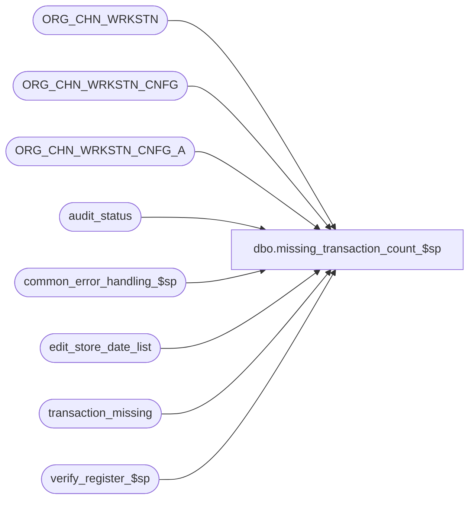

# dbo.missing_transaction_count_$sp

**Database:** auditworks  
**Server:** bedrockdb01  

## Architecture Diagram



## Table Dependencies

| Referenced Table |
|---|
| ORG_CHN_WRKSTN |
| ORG_CHN_WRKSTN_CNFG |
| ORG_CHN_WRKSTN_CNFG_A |
| audit_status |
| common_error_handling_$sp |
| edit_store_date_list |
| transaction_missing |
| verify_register_$sp |

## Stored Procedure Code

```sql
CREATE proc  dbo.missing_transaction_count_$sp 
@process_id		binary(16),
@user_id		int,
@store_no		int,
@transaction_date	smalldatetime,
@register_no		smallint,
@date_reject_id		tinyint,
@errmsg			nvarchar(2000) OUTPUT,
@log_error_flag		tinyint = 0,  -- for call to common_error_handler, 1 = CALLED BY SMARTLOAD
@process_no		int,     -- for call to common_error_handler, 5=Edit
@edit_process_no 	tinyint = 1  --  for call to common_error_handler

AS

/* 
PROC NAME: missing_transaction_count_$sp 
     DESC: Count the number of missing transactions for a given store/reg/date 
           and update audit_status accordingly.
     
     Unicode version.
     
HISTORY:
Date     Name		   Def#  Desc 
May30,16 Vicci         DAOM-730  Don't set status to Edited if status is Invalid store/reg (generally missing aren't counted for invalids but there is an exception
                                 when the store/reg has since been created).
May12,16 Vicci         DAOM-730  Don't set register_poll_id unless option 1 "log parent as missing children as unused" is selected, in which case set it to the store/parent-reg.
Aug13,14 Vicci        TFS-75489  Remove the "EXECWARN: error 8115 can be ignored" message since the error is now trapped and therefore isn't there to be ignored.
Jun18,14 Vicci        TFS-75489  Verify that the sum of @missing_qty_pos and @missing_qty_neg does not exceed 999999999 to avoid arithmetic overflow.
                                 Also, since MSSQL is using an int to hold the SUM(from_transaction_no - to_transaction_no + 1) and is blowing up
                                 with an arithmetic overflow before even getting to the comparison with 999999999 wrap a try/cath around the SUM
                                 so that the error is caught-without this, the error trap is not recognized even when arith abort option is set to false.
May26,10 Vicci           116498  Don't create an audit_status entry unless necessary (since otherwise we end up with missing
                                 registers reported for the CURRENT date when 1 loop polled but not others).
Apr05,10 Vicci           115666  Don't verify the store/reg/date if called by the Edit, since it is not done its processing yet.
Jul10,07 Paul           DV-1363  set @missing_qty = 999999999 when arithmetic overflow occurs (requires arith abort option set to false)
Apr16,07 Paul           DV-1356  Use ORG_CHN_WRKSTN
Jan11,07 Paul             81764  pass in process_id, user_id for SA5 version. Allow missing_qty to exceed 32767.
Sep06,06 Vicci            76394  Author

*/


DECLARE	@errno				int,
	@message_id			int,
	@operation_name		        nvarchar(100),
	@object_name		        nvarchar(255),
	@process_name			nvarchar(100),
	@missing_qty_pos		int,
	@missing_qty_neg		int,
	@missing_qty			int,
	@rows				int,
	@in_edit_list			tinyint,
	@prnt_wrkstn_id			binary(16),
	@register_poll_id		nvarchar(15); 
	
IF @date_reject_id <> 0
  RETURN
  
SELECT @process_name = 'missing_transaction_count_$sp',
       @message_id   = 201068,
       @missing_qty_pos = 0,
       @missing_qty_neg = 0,
       @missing_qty = 0,
       @rows = 0,
       @in_edit_list = 0

/* If the number of missing transactions is > 2.147 billion then an arithmetic overflow error 8115 will occur.
   If the server or db option 'arithmethic abort enabled' is set to false then this proc will trap the error 8115
   and report the missing_qty as 999999999. Required only for mssql. */

BEGIN TRY
  SELECT @missing_qty_pos = SUM(to_transaction_no - from_transaction_no + 1)
  FROM transaction_missing WITH (NOLOCK)
 WHERE store_no = @store_no
   AND register_no = @register_no
   AND sales_date = @transaction_date
   AND to_transaction_no >= from_transaction_no;
END TRY
BEGIN CATCH
  SELECT @errno = ERROR_NUMBER();
  IF @errno = 8115 -- arithmetic overflow
    SELECT @missing_qty_pos = 999999999;
  ELSE  
  BEGIN
    SELECT @errmsg = 'Failed to SELECT  missing_qty_pos.  Line: ' + CONVERT(nvarchar, ERROR_LINE()) + ', ' + ERROR_MESSAGE(),
           @object_name = 'transaction_missing',
           @operation_name = 'SELECT' ;
    GOTO error;
  END;
END CATCH;

BEGIN TRY    
SELECT @missing_qty_neg = SUM(from_transaction_no - to_transaction_no + 1)
  FROM transaction_missing WITH (NOLOCK)
 WHERE store_no = @store_no
   AND register_no = @register_no
   AND sales_date = @transaction_date
   AND to_transaction_no < from_transaction_no
END TRY
BEGIN CATCH
  SELECT @errno = ERROR_NUMBER();
  IF @errno = 8115 -- arithmetic overflow
    SELECT @missing_qty_neg = 999999999;
  ELSE  
  BEGIN
    SELECT @errmsg = 'Failed to SELECT  missing_qty_neg.  Line: ' + CONVERT(nvarchar, ERROR_LINE()) + ', ' + ERROR_MESSAGE(),
           @object_name = 'transaction_missing',
           @operation_name = 'SELECT' ;
    GOTO error;
  END;
END CATCH;

BEGIN TRY
IF ISNULL(@missing_qty_pos,0) + ISNULL(@missing_qty_neg,0) >= 999999999 -- then
  BEGIN
   SELECT @missing_qty = 999999999 -- avoid exceeding the capacity of the int datatype
  END
ELSE
  SELECT @missing_qty = ISNULL(@missing_qty_pos,0) + ISNULL(@missing_qty_neg,0)
END TRY
BEGIN CATCH
  SELECT @errno = ERROR_NUMBER();
  IF @errno = 8115 -- arithmetic overflow
    SELECT @missing_qty = 999999999;
  ELSE  
  BEGIN
    SELECT @errmsg = 'Failed to SET @missing_qty.  Line: ' + CONVERT(nvarchar, ERROR_LINE()) + ', ' + ERROR_MESSAGE(),
           @object_name = '@missing_qty',
           @operation_name = 'SET' ;
    GOTO error;
  END;
END CATCH;
  
UPDATE audit_status
   SET missing_qty = @missing_qty, 
       audit_status = CASE WHEN audit_status IN (7, 8) OR @missing_qty = 0 THEN audit_status ELSE 100 END,
       status_date = CASE WHEN audit_status IN (7, 8, 100) OR @missing_qty = 0 THEN status_date ELSE getdate() END
 WHERE store_no = @store_no
   AND register_no = @register_no
   AND sales_date = @transaction_date
   AND date_reject_id = @date_reject_id            
SELECT @errno = @@error, @rows = @@rowcount
IF @errno != 0
BEGIN
  SELECT @errmsg = 'Failed update audit status',
         @object_name = 'audit_status',
         @operation_name = 'UPDATE'
  GOTO error
END

IF @rows = 0 AND @missing_qty <> 0  --i.e. we have never received transactions for the transaction assignment register itself
BEGIN   
  SELECT @prnt_wrkstn_id = COALESCE(PRNT_WRKSTN_ID, WRKSTN_ID)
    FROM ORG_CHN_WRKSTN 
   WHERE ORG_CHN_NUM = @store_no
     AND WRKSTN_NUM = @register_no
     AND ACTV = 1;
  SELECT @errno = @@error
  IF @errno != 0
  BEGIN
    SELECT @errmsg = 'Failed to determine if register is valid.  ',
           @object_name = 'ORG_CHN_WRKSTN',
           @operation_name = 'SELECT'
    GOTO error
  END

  IF @prnt_wrkstn_id IS NOT NULL --i.e. register is valid
  BEGIN
    SELECT @register_poll_id = MAX(RIGHT ('0000000000' + CONVERT(nvarchar, rg.ORG_CHN_NUM),10) + RIGHT ('00000' + CONVERT(nvarchar, rg.WRKSTN_NUM),5))
      FROM ORG_CHN_WRKSTN rg WITH (NOLOCK)
           INNER JOIN ORG_CHN_WRKSTN_CNFG_A ca WITH (NOLOCK)
              ON @prnt_wrkstn_id = ca.WRKSTN_ID	   
	     AND @transaction_date >= ca.EFCTV_DATE
	     AND (@transaction_date < ca.EXPRTN_DATE OR ca.EXPRTN_DATE IS NULL)
	   INNER JOIN ORG_CHN_WRKSTN_CNFG c WITH (NOLOCK)
  	      ON ca.WRKSTN_CNFG_CODE = c.WRKSTN_CNFG_CODE
  	     AND COALESCE(c.RPRT_UNSD_WRKSTNS, 1) = 1
     WHERE rg.WRKSTN_ID = @prnt_wrkstn_id;
    SELECT @errno = @@error
    IF @errno != 0
    BEGIN
      SELECT @errmsg = 'Failed to determine loop name for case when option to log parent as missing and child as unused is selected. ',
             @object_name = 'ORG_CHN_WRKSTN_CNFG',
             @operation_name = 'SELECT'
      GOTO error
    END
     
    INSERT INTO audit_status (
   	   store_no,
   	   register_no,
           sales_date,
	   date_reject_id,
	   audit_status,
	   status_date,
	   missing_qty,
           register_poll_id)
    VALUES (@store_no,
 	   @register_no,
           @transaction_date, 
	   0,
           (900 * (1-sign(@missing_qty))) + (100 * sign(@missing_qty)),
	   getdate(),
           @missing_qty,
           @register_poll_id);
    SELECT @errno = @@error
    IF @errno != 0
    BEGIN
      SELECT @errmsg = 'Failed to insert on audit_status for log_date',
             @object_name = 'audit_status',
             @operation_name = 'INSERT'
      GOTO error
    END
  END;  --IF @prnt_wrkstn_id IS NOT NULL, i.e. register is valid
END  --IF @rows = 0


IF @process_no = 5 AND EXISTS (SELECT 1 
       	       			 FROM edit_store_date_list
       		      		WHERE store_no = @store_no
    		        	  AND transaction_date = @transaction_date
	                	  AND register_no = @register_no
	                	  AND date_reject_id = @date_reject_id)
  SELECT @in_edit_list = 1
  
IF @in_edit_list = 0
BEGIN
  EXEC verify_register_$sp @process_id, @user_id, @store_no, @register_no, @transaction_date, @date_reject_id, @errmsg OUTPUT
  SELECT @errno = @@error
  IF @errno <> 0
  BEGIN
    SELECT @errmsg = 'for transaction date',
           @object_name = 'verify_register_$sp',
           @operation_name = 'EXECUTE'
    GOTO error
  END
END      

RETURN

error:   /* Common error handler. */

EXEC common_error_handling_$sp @process_no, @errno, @errmsg, 0, @message_id,
                 @process_name, @object_name, @operation_name, @log_error_flag, @edit_process_no, 0, null, 0, null, 
		null, null, null, null, null, 0, @process_id, @user_id

RETURN
```

