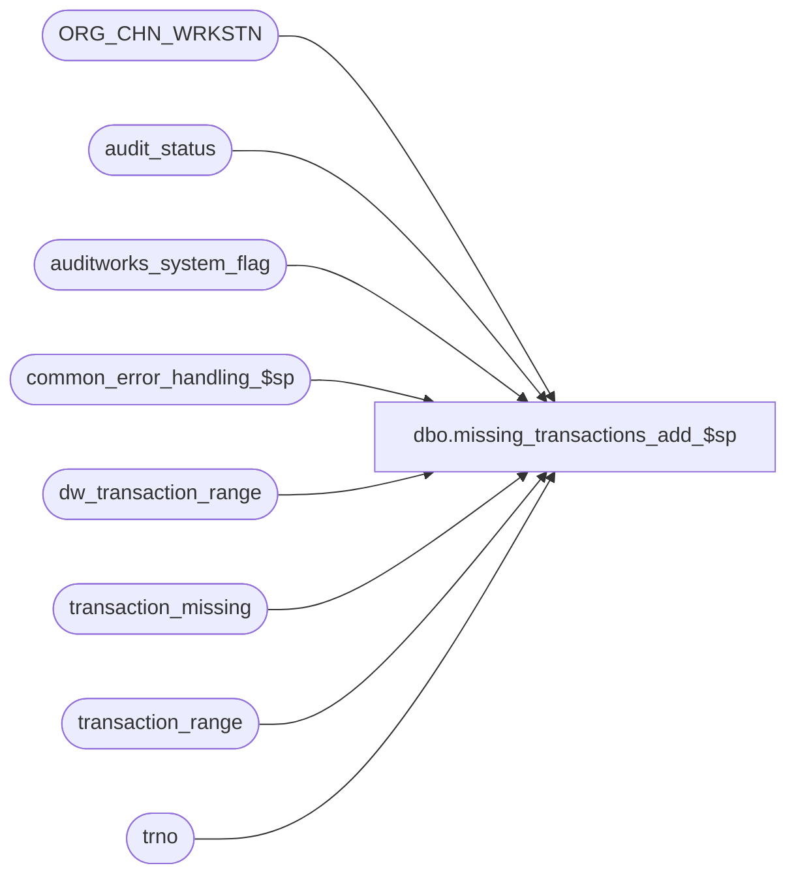

# dbo.missing_transactions_add_$sp

**Database:** auditworks  
**Server:** bedrockdb01  

## Architecture Diagram



## Table Dependencies

| Referenced Table |
|---|
| ORG_CHN_WRKSTN |
| audit_status |
| auditworks_system_flag |
| common_error_handling_$sp |
| dw_transaction_range |
| transaction_missing |
| transaction_range |
| trno |

## Stored Procedure Code

```sql
create proc dbo.missing_transactions_add_$sp 
@process_id	        binary(16),
@user_id                int,
@store_no		int,
@transaction_date	smalldatetime,
@register_no		smallint,
@date_reject_id		tinyint,
@transaction_no		trno,
@errmsg			varchar(255) OUTPUT,
@transaction_series	char(1)
 
AS

/*

PROC NAME: missing_transactions_add_$sp
     DESC: To identify missing transactions in store-reg-date for the ADD function.
           Called from transaction_add_$sp.

HISTORY:
Date     Name		Def# Desc
Jan25,05 Sab	     DV-1203 Added logic to scaleout dw_transaction_range
Sep17,04 Maryam      DV-1146 Change user_name to user_id.
Jul09,04 ShuZ        DV-1071 Expand user_name to varchar(50)
May29,04 Maryam      DV-1071 Use ORG_CHN_WRKSTN instead of register table.
Apr27,04 Maryam      DV-1071 Receive @process_id and @user_name and pass it to common_error_handling_$sp
Dec16,03 Paul          19908 add locking hints to improve performance
May16,02 Henry       1-CD0IX Add R3.5 standardized common error handling
Oct18,01 Daphna		8629 Updates transaction_range when added txn is the first or last of the missing_transactions 
May01,01 David M	7589 Missing transactions by transaction series Version 1.0 (missing handling). 
Jan30,01 Henry		6765 Create missing trxns, for the assigned register grouping
Mar01,00 Phu		5900 Change @@fetch_status > 0 to @@fetch_status <> 0 for MS SQL compatibility
Jul05,99 Daphna F	4907 remove code for unneccessary variables: @first_transaction_no, @last_transaction_no, 
				@max_transaction_no, @min_transaction_no, @transaction_zero_flag
Sep15,98 Shapoor M	n/a  last modified
Mar12,96 Sebastiano V	n/a  author version 1.01

*/


DECLARE	@cursor_open			tinyint,
	@errno				int,
	@from_transaction_no		trno,	
	@missing_qty			numeric(12,0),
	@to_transaction_no		trno,
	@assigned_register_group	smallint,
-- used for common error handling.
	@process_no			smallint,
	@object_name			varchar(255),
	@process_name			varchar(100),
	@operation_name			varchar(100),
	@message_id			int,
	@PRNT_WRKSTN_ID                 binary(16),
	@rows				int,
	@scaleout_flag			int

SELECT @process_name = 'missing_transactions_add_$sp',
       @message_id = 201068,
       @process_no = 150

SELECT @scaleout_flag = CONVERT(int,flag_numeric_value)
  FROM auditworks_system_flag
 WHERE flag_name = 'scaleout_flag'

SELECT @rows = @@rowcount, @errno = @@error
IF @errno != 0
 BEGIN
   SELECT @errmsg = 'Failed to select scaleout_flag from auditworks_system_flag',
	  @object_name = 'auditworks_system_flag',
	  @operation_name = 'SELECT'
   GOTO error
 END

IF @rows = 0
 BEGIN
   SELECT @errmsg = 'Invalid setup. Missing scaleout_flag.',
	  @object_name = 'auditworks_system_flag',
	  @operation_name = 'SELECT'
   GOTO error
 END

-- determine the assigned register to group the missing trxns, and replace @register_no 
-- with @assigned_register_group

SELECT @PRNT_WRKSTN_ID = ISNULL(PRNT_WRKSTN_ID,WRKSTN_ID)
  FROM ORG_CHN_WRKSTN WITH (NOLOCK)
 WHERE ORG_CHN_NUM = @store_no
   AND WRKSTN_NUM = @register_no

SELECT @errno = @@error
IF @errno != 0
BEGIN
  SELECT @errmsg = 'Failed to select the parent id of the workstation',
	 @object_name = 'ORG_CHN_WRKSTN',
	 @operation_name = 'SELECT'
  GOTO error
END

SELECT @assigned_register_group = WRKSTN_NUM
  FROM ORG_CHN_WRKSTN
 WHERE WRKSTN_ID = @PRNT_WRKSTN_ID

SELECT @errno = @@error
IF @errno != 0
BEGIN
  SELECT @errmsg = 'Failed to select WRKSTN_NUM of the parent workstation .',
	 @object_name = 'ORG_CHN_WRKSTN',
	 @operation_name = 'SELECT'
  GOTO error
END

DECLARE missing_crsr CURSOR FAST_FORWARD
FOR
SELECT from_transaction_no,
       to_transaction_no
  FROM transaction_missing WITH (NOLOCK)
 WHERE store_no = @store_no
   AND register_no = @assigned_register_group -- replaced @register_no
   AND sales_date = @transaction_date
   AND transaction_series = @transaction_series

SELECT @errno = @@error
IF @errno != 0
BEGIN
  SELECT @errmsg = 'Failed to declare cursor for missing_crsr',
	 @object_name = 'missing_crsr',
	 @operation_name = 'DECLARE'
  GOTO error
END

OPEN missing_crsr 

SELECT @errno = @@error
IF @errno != 0
BEGIN
  SELECT @errmsg = 'Failed to open cursor for missing_crsr',
	 @object_name = 'missing_crsr',
	 @operation_name = 'OPEN'
  GOTO error
END

SELECT @cursor_open = 1

WHILE 1=1
BEGIN

  FETCH missing_crsr INTO
	@from_transaction_no,
	@to_transaction_no

  IF @@fetch_status <> 0
  BEGIN
    BREAK
  END

 IF @from_transaction_no = @to_transaction_no  -- missing range is only one txn
 BEGIN
    IF @transaction_no = @from_transaction_no  -- new txn is the missing one
     BEGIN
	DELETE FROM transaction_missing
	 WHERE store_no = @store_no
	   AND register_no = @assigned_register_group -- replaced @register_no
	   AND sales_date = @transaction_date
	   AND from_transaction_no = @from_transaction_no
	   AND to_transaction_no = @to_transaction_no
	   AND transaction_series = @transaction_series

	SELECT @errno = @@error
	IF @errno != 0
	BEGIN
	  SELECT @errmsg = 'Failed to delete on transaction_missing tran_no = @from',
		 @object_name = 'transaction_missing',
		 @operation_name = 'DELETE'
	  GOTO error
	END

	UPDATE audit_status
	   SET missing_qty = missing_qty - 1
	 WHERE store_no = @store_no
	   AND register_no = @assigned_register_group -- replaced @register_no
	   AND sales_date = @transaction_date
	   AND date_reject_id = @date_reject_id

	SELECT @errno = @@error
	IF @errno != 0
	BEGIN
	  SELECT @errmsg = 'Failed to update on audit_status tran_no = @from',
		 @object_name = 'audit_status',
		 @operation_name = 'UPDATE'
	  GOTO error
	END

	BREAK
     END
    ELSE
     CONTINUE
  END /* END @from = @to transaction_no */

  IF ((@transaction_no >= @from_transaction_no) AND (@transaction_no <= @to_transaction_no))
  BEGIN
     -- new txn lies inside the range of missing txns 
     
    IF @transaction_no = @from_transaction_no
    BEGIN
        -- new txn is the first missing txn in range         
	UPDATE transaction_missing
	   SET from_transaction_no = from_transaction_no + 1
	 WHERE store_no = @store_no
	   AND register_no = @assigned_register_group -- replaced @register_no
	   AND sales_date = @transaction_date
	   AND from_transaction_no = @from_transaction_no
	   AND to_transaction_no = @to_transaction_no
	   AND transaction_series = @transaction_series

	SELECT @errno = @@error
	IF @errno != 0
	BEGIN
	  SELECT @errmsg = 'Failed to update on transaction_missing (from)',
		 @object_name = 'transaction_missing',
		 @operation_name = 'UPDATE'
	  GOTO error
	END
	
	-- update the transaction_range to reflect added txn
	
	UPDATE transaction_range
  	   SET last_transaction_no = last_transaction_no + 1
         WHERE store_no = @store_no
	   AND register_no = @assigned_register_group -- replaced @register_no
	   AND transaction_date = @transaction_date
	   AND last_transaction_no = @from_transaction_no - 1
	   AND transaction_series = @transaction_series

	SELECT @errno = @@error
	IF @errno != 0
	BEGIN
	  SELECT @errmsg = 'Failed to update on transaction_range (last)',
		 @object_name = 'transaction_range',
		 @operation_name = 'UPDATE'
          GOTO error
	END
		
	IF @scaleout_flag = 1
	BEGIN
	  UPDATE dw_transaction_range
  	     SET last_transaction_no = last_transaction_no + 1
           WHERE store_no = @store_no
	     AND register_no = @assigned_register_group -- replaced @register_no
	     AND transaction_date = @transaction_date
	     AND last_transaction_no = @from_transaction_no - 1
	     AND transaction_series = @transaction_series

	  SELECT @errno = @@error
	  IF @errno != 0
	  BEGIN
	    SELECT @errmsg = 'Failed to update on dw_transaction_range (last)',
		   @object_name = 'dw_transaction_range',
		   @operation_name = 'UPDATE'
            GOTO error
	  END
	END
    END -- @transaction_no = @from_transaction_no

    IF @transaction_no = @to_transaction_no
    BEGIN
       -- new txn is the last missing txn in the range
	UPDATE transaction_missing
	   SET to_transaction_no = to_transaction_no - 1
	 WHERE store_no = @store_no
	   AND register_no = @assigned_register_group -- replaced @register_no
	   AND sales_date = @transaction_date
	   AND from_transaction_no = @from_transaction_no
	   AND to_transaction_no = @to_transaction_no
	   AND transaction_series = @transaction_series

	SELECT @errno = @@error
	IF @errno != 0
	BEGIN
	  SELECT @errmsg = 'Failed to update on transaction_missing (to)',
		 @object_name = 'transaction_missing',
		 @operation_name = 'UPDATE'
	  GOTO error
	END
	
	-- update transaction_range to reflect added txn

	UPDATE transaction_range
  	   SET first_transaction_no = first_transaction_no - 1
         WHERE store_no = @store_no
	   AND register_no = @assigned_register_group -- replaced @register_no
	   AND transaction_date = @transaction_date
	   AND first_transaction_no = @to_transaction_no + 1
	   AND transaction_series = @transaction_series

	SELECT @errno = @@error
	IF @errno != 0
	BEGIN
	  SELECT @errmsg = 'Failed to update on transaction_range (first)',
		 @object_name = 'transaction_range',
		 @operation_name = 'UPDATE'
	  GOTO error
	END

	IF @scaleout_flag = 1
	BEGIN
	  UPDATE dw_transaction_range
  	     SET first_transaction_no = first_transaction_no - 1
           WHERE store_no = @store_no
	     AND register_no = @assigned_register_group -- replaced @register_no
	     AND transaction_date = @transaction_date
	     AND first_transaction_no = @to_transaction_no + 1
	     AND transaction_series = @transaction_series

	  SELECT @errno = @@error
	  IF @errno != 0
	  BEGIN
	    SELECT @errmsg = 'Failed to update on dw_transaction_range (first)',
		   @object_name = 'dw_transaction_range',
		   @operation_name = 'UPDATE'
	    GOTO error
	  END
	END
 END  -- @transaction_no = @to_transaction_no

    IF ((@transaction_no > @from_transaction_no) AND (@transaction_no < @to_transaction_no))
    BEGIN

        -- reset existing missings TO = txn - 1

	UPDATE transaction_missing
	   SET to_transaction_no = @transaction_no - 1
	 WHERE store_no = @store_no
	   AND register_no = @assigned_register_group -- replaced @register_no
	   AND sales_date = @transaction_date
	   AND from_transaction_no = @from_transaction_no
 	   AND to_transaction_no = @to_transaction_no 
 	   AND transaction_series = @transaction_series

	SELECT @errno = @@error
	IF @errno != 0
	BEGIN
	  SELECT @errmsg = 'Failed to update on transaction_missing 3',
		 @object_name = 'transaction_missing',
		 @operation_name = 'UPDATE'
	  GOTO error
	END
	
        -- new missings FROM = txn + 1 
	
	INSERT transaction_missing (
		store_no,
		register_no,
		sales_date,
		from_transaction_no,
		to_transaction_no,
		verified,
		transaction_series)
	VALUES (
		@store_no,
		@assigned_register_group, -- replaced @register_no
		@transaction_date,
		@transaction_no + 1,
		@to_transaction_no,
		0,
		@transaction_series)

	SELECT @errno = @@error
	IF @errno != 0
	BEGIN
	  SELECT @errmsg = 'Failed to insert on transaction_missing',
		 @object_name = 'transaction_missing',
		 @operation_name = 'INSERT'
	  GOTO error
	END				
	
        -- NOT rollover case: first < last
        
	UPDATE transaction_range
  	   SET last_transaction_no = @transaction_no
         WHERE store_no = @store_no
	   AND register_no = @assigned_register_group -- replaced @register_no
	   AND transaction_date = @transaction_date
	   AND transaction_series = @transaction_series
           AND first_transaction_no < last_transaction_no  -- NOT rollover case 	   
           AND last_transaction_no < @transaction_no  -- new > last

	SELECT @errno = @@error
	IF @errno != 0
	BEGIN
	  SELECT @errmsg = 'Failed to update on transaction_range (new > last)',
		 @object_name = 'transaction_range',
		 @operation_name = 'UPDATE'
          GOTO error
	END

	UPDATE transaction_range
  	   SET first_transaction_no = @transaction_no
         WHERE store_no = @store_no
	   AND register_no = @assigned_register_group -- replaced @register_no
	   AND transaction_date = @transaction_date
	   AND transaction_series = @transaction_series
           AND first_transaction_no < last_transaction_no  -- NOT rollover case 	   
           AND first_transaction_no > @transaction_no  -- new < first

	SELECT @errno = @@error
	IF @errno != 0
	BEGIN
	  SELECT @errmsg = 'Failed to update on transaction_range (new < first)',
		 @object_name = 'transaction_range',
		 @operation_name = 'UPDATE'
          GOTO error
	END

	IF @scaleout_flag = 1
	BEGIN
	  UPDATE dw_transaction_range
	     SET last_transaction_no = @transaction_no
           WHERE store_no = @store_no
	     AND register_no = @assigned_register_group -- replaced @register_no
	     AND transaction_date = @transaction_date
	     AND transaction_series = @transaction_series
	     AND first_transaction_no < last_transaction_no  -- NOT rollover case 	   
	     AND last_transaction_no < @transaction_no  -- new > last

	  SELECT @errno = @@error
	  IF @errno != 0
	  BEGIN
	    SELECT @errmsg = 'Failed to update on dw_transaction_range (new > last)',
		   @object_name = 'dw_transaction_range',
		   @operation_name = 'UPDATE'
	    GOTO error
	  END

	  UPDATE dw_transaction_range
	     SET first_transaction_no = @transaction_no
	   WHERE store_no = @store_no
	     AND register_no = @assigned_register_group -- replaced @register_no
	     AND transaction_date = @transaction_date
	     AND transaction_series = @transaction_series
	     AND first_transaction_no < last_transaction_no  -- NOT rollover case 	   
	     AND first_transaction_no > @transaction_no  -- new < first

	  SELECT @errno = @@error
	  IF @errno != 0
	  BEGIN
	    SELECT @errmsg = 'Failed to update on dw_transaction_range (new < first)',
		   @object_name = 'dw_transaction_range',
		   @operation_name = 'UPDATE'
	    GOTO error
	  END
	END
    END --((@transaction_no > @from_transaction_no) AND (@transaction_no < @to_transaction_no))

    UPDATE audit_status
       SET missing_qty = missing_qty - 1
     WHERE store_no = @store_no
       AND register_no = @assigned_register_group -- replaced @register_no
       AND sales_date = @transaction_date
       AND date_reject_id = @date_reject_id

    SELECT @errno = @@error
    IF @errno != 0
    BEGIN
	SELECT @errmsg = 'Failed to update on audit_status missing',
	       @object_name = 'audit_status',
	       @operation_name = 'UPDATE'
	GOTO error
    END

    BREAK
  END  -- new txn is one of missing txns in range

END /* While 1=1 */

CLOSE missing_crsr
SELECT @errno = @@error
IF @errno != 0
BEGIN
  SELECT @errmsg = 'Failed to CLOSE cursor for missing_crsr',
	 @object_name = 'missing_crsr',
	 @operation_name = 'CLOSE'
  GOTO error
END

DEALLOCATE missing_crsr

RETURN

error:   /* Common error handler. */

	IF @cursor_open <> 0
	BEGIN
	  CLOSE missing_crsr
	  DEALLOCATE missing_crsr
	END

	EXEC common_error_handling_$sp @process_no, @errno, @errmsg, 0, @message_id, 
	     @process_name, @object_name, @operation_name, 0, 1, 0, null, 0, null,
	     null, null, null, null, null, 0, @process_id, @user_id

	RETURN

dbo,dt_getpropertiesbyid,/*
**	Retrieve properties by id's
**
**	dt_getproperties objid, null or '' -- retrieve all properties of the object itself
**	dt_getproperties objid, property -- retrieve the property specified
*/
create procedure dbo.dt_getpropertiesbyid
	@id int,
	@property varchar(64)
as
	set nocount on

	if (@property is null) or (@property = '')
		select property, version, value, lvalue
			from dbo.dtproperties
			where  @id=objectid
	else
		select property, version, value, lvalue
			from dbo.dtproperties
			where  @id=objectid and @property=property
```

