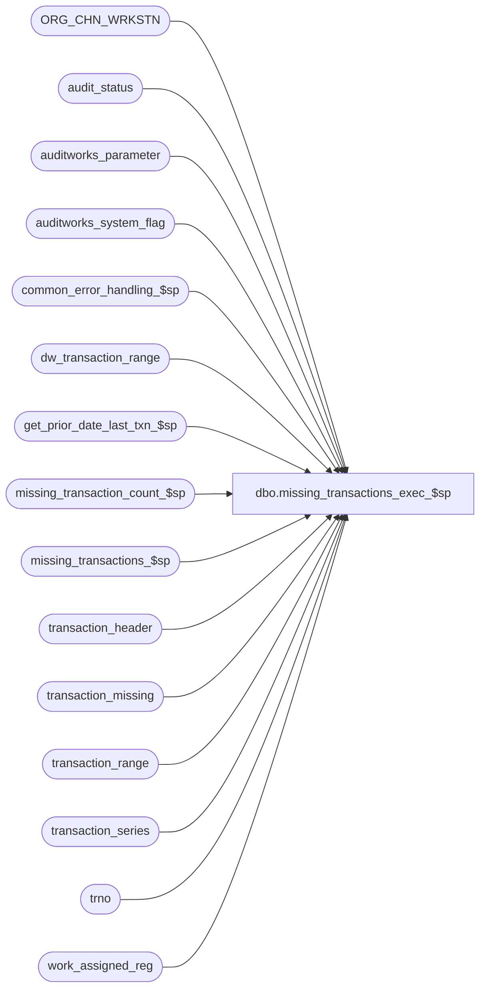

# dbo.missing_transactions_exec_$sp

**Database:** auditworks  
**Server:** bedrockdb01  

## Architecture Diagram



## Table Dependencies

| Referenced Table |
|---|
| ORG_CHN_WRKSTN |
| audit_status |
| auditworks_parameter |
| auditworks_system_flag |
| common_error_handling_$sp |
| dw_transaction_range |
| get_prior_date_last_txn_$sp |
| missing_transaction_count_$sp |
| missing_transactions_$sp |
| transaction_header |
| transaction_missing |
| transaction_range |
| transaction_series |
| trno |
| work_assigned_reg |

## Stored Procedure Code

```sql
CREATE proc  [dbo].[missing_transactions_exec_$sp] @process_id		binary(16),
@user_id                int,
@store_no		int,
@transaction_date	smalldatetime,
@register_no		smallint,
@date_reject_id		tinyint,
@errmsg			nvarchar(2000) OUTPUT,
@all_series		int, -- 0 = only one series (@transaction_series), 1 = all series
@process_no 		smallint,  -- calling function
@transaction_series	char(1),  -- affected series (NULL if all_series = 1) 
@log_error_flag 	tinyint = 0,  -- 1 if called by smartload
@edit_process_no 	tinyint = 1,  
@all_reg                tinyint = 0  -- 1 when whole store (move, massdel, edit)


AS

/* 
PROC NAME: missing_transactions_exec_$sp
     DESC: Called from move_reg_media_rec_$sp, transaction_add_$sp, delete_store_reg_date_$sp,
           and edit_missing_transactions_$sp.
           For invalid register or store or date, updates transaction_range only.
           For non-sequential series updates transaction range only.
           For sequential series logs missing transactions.
           Note that transaction range is logged to the loop controller for series which are sequential by loop.
           Note that transaction range is logged based on min/max transaction number when no missing are present,
           but based on number of first/last transaction (time dependent) otherwise;  this is to compensate for
           Coalition defects whereby sorting by time yields a different sequence than sorting by transaction number.

  HISTORY:
Date     Name       Def# Desc
Apr05,17 Kiri  DAOM-2406 Avoid bogus cursor message with uninitialize cursor flag
Aug18,14 Paul  TFS-75489 added try .. catch
Mar22,13 Vicci    142999 Remove reference to ORG_CHN_WRKSTN r2 that had no join from INSERT INTO work_assigned_reg.
Jan05,10 Vicci    115118 Support option not to evaluation transaction range for non-sequential transaction_series
Jan11,07 Paul      81764 apply 81814, 76394, 1-3XYH6J to SA5, cleaned up comments
Mar09,06 Paul    DV-1328 apply 67337, 65186 to SA5
Jan26,05 Sab     DV-1203 Added logic for scaleout dw_transaction_range.
Sep17,04 Maryam  DV-1146 Use user_id.
May18,04 Maryam  DV-1071 Modified to look at ORG_CHN_WRKSTN, receive @process_id
May20,08 PaulS  1-3XYH6J Don't include 'not live' registers in the list to be processed when a request to process
                              'all registers' is made.
Jan08,06 Phu       81814 Don't log transaction missing if transaction_series.by_assigned_reg is set to 2:register/date, 3:register loop/date.
Aug28,06 Vicci     76394 Redesign approach.
			 Avoid edit deleting transaction range/missing when processing
                         the register controlling the loop but the transactions for the
                         series being controlled by this register are only found under other registers.
Feb10,06 Daphna    67337 Treat reg with assign-group = NULL as if assigned to self
Dec19,05 Shapoor   65186 Correctly calculate missings when the next_date is an invalid date.
Dec16,03 Paul      19908 improve performance with locking hints, remove select into
Oct29,03 Vicci     17379/17396 handle invalid register being passed in.
Dec12,02 Winnie	 1-G4RBY delete transaction range when call by delete_store_reg_date before
     			 calling missing_transaction_$sp
OCT17,02 Daphna  1-G1GCL when next_date is not open, ensure call to missing_transaction_$sp
                         passes next_date as eval-date and tran_date as log-to-date and
                         call verify register_$sp passing tran_date (not next_date)
AUG19,02 Daphna  1-BMAEV Determine use of assigned register group by transaction_series
                         evaluate seq-by-assigned-reg series for single reg function
                         (all_reg = 0), 
SEP27,02 Daphna  1-FMGUG call verify_register_$sp after calc missing txns for each SRD                         
MAY03,02 Daphna  1-COKT3 When series not found in transaction_series, insert as non-sequential
SEP27,02 Daphna  1-FE0G1 RETROFIT 1-FMGUG to R3.0
DEC26,01 Daphna  8628 Ensure cursor only created from transaction_range for sequential series
                         Input variable @edit_process_no, passed in call to missing_transactions_$sp
                         for R3 Error Handling
NOV19,01 Daphna     8952 Error Handling changes
NOV09,01 Daphna     8929 change datatype for first_datetime and last_datetime to datetime
                         (prev smalldatetime) 
                         Select MAX tran no for last, MIN tran no for first
Sep21,01 Daphna     8629 author

*/

DECLARE	@by_assigned_reg        tinyint,
	@count_tran_no		int,
	@cursor_open		tinyint,
	@errline			int,
	@errmsg2			nvarchar(2000),       
	@errno			int,
	@first_datetime		datetime,
	@first_txn_no		trno,
	@last_datetime		datetime,
 	@last_txn_no		trno,
	@log_missing_flag	tinyint, -- parameter passed to missing_transactions_$sp  	
	@next_date_txn_no	trno,
	@max_txn_no		trno,
	@min_txn_no		trno,
	@missing_logged		int,
	@missing_deleted	int,
	@next_date		smalldatetime,
	@open_date		smalldatetime,
	@prior_register_no	smallint, 
	@prior_valid_reg_no	tinyint,
	@rows			int,
	@scaleout_flag		int,
	@sequential		tinyint,  -- 0 = no, 1 = yes
	@upper_series_txn_limit trno,
	@lower_series_txn_limit trno,
	@upper_txn_limit 	trno,
	@lower_txn_limit 	trno,
	@prior_day_transaction	trno,
	@prev_transaction_no	trno,
	@transaction_no		trno,
	@valid_register_no	tinyint, --0=invalid, 1=valid	
-- for error handling
        @operation_name		nvarchar(100),
        @object_name		nvarchar(255),
        @process_name		nvarchar(100),
        @message_id		int,
        @WRKSTN_ID              binary(16),
        @eval_non_seq_range	tinyint;
        
SELECT @process_name = 'missing_transactions_exec_$sp',
       @message_id = 201068,
       @prior_register_no = -1,
       @prev_transaction_no = NULL,
       @eval_non_seq_range = 1;

	   SELECT @cursor_open = 0;

BEGIN TRY            
-- @upper_txn_limit and @lower_series_txn_limit are read only from transaction_series as of SA5

SELECT @errmsg = 'Failed to select scaleout_flag from auditworks_system_flag',
	  @object_name = 'auditworks_system_flag',
	  @operation_name = 'SELECT';

SELECT @scaleout_flag = CONVERT(int,flag_numeric_value)
  FROM auditworks_system_flag
 WHERE flag_name = 'scaleout_flag';

SELECT @rows = @@rowcount;
IF @rows = 0
 BEGIN
   SELECT @errmsg = 'Invalid setup. Missing scaleout_flag.';
   GOTO business_error;
 END;

SELECT @errmsg = 'Failed to determine whether or not to evaluate the transaction number range of non-sequential transaction series.',
	 @object_name = 'auditworks_parameter';
--115118
IF EXISTS (SELECT 1
  	     FROM auditworks_parameter
	    WHERE par_name = 'log_nonsequential_series_range'
	      AND par_value = '0')
  SELECT @eval_non_seq_range = 0;

-- def 1-BMAEV: cleanup work table
  SELECT @errmsg = 'before any insert: where process_id = @process_id',
         @object_name = 'work_assigned_reg',
         @operation_name = 'DELETE';
DELETE work_assigned_reg
 WHERE process_id = @process_id;

IF @process_no = 5 --Since the Edit may receive unknown transaction series from POS...
BEGIN
    SELECT @errmsg = 'Failed to log unknown transaction series',
           @object_name = 'transaction_series',
           @operation_name = 'INSERT';
  INSERT INTO transaction_series
             (transaction_series, description, sequential,comments, code_meaning_control)
  SELECT DISTINCT transaction_series, 'Unknown Series', 0, 'Entry Created by System', 'U'
    FROM transaction_header h WITH (NOLOCK)
   WHERE h.transaction_date = @transaction_date
     AND h.store_no = @store_no
     AND h.date_reject_id = @date_reject_id
     AND (h.register_no = @register_no OR @all_reg = 1)
     AND h.transaction_series NOT IN (SELECT s.transaction_series
                                        FROM transaction_series s);
END; --IF @process_no = 5, Edit

  SELECT @errmsg = 'Cannot determine which invalid register/series combinations to process',
         @object_name = 'work_assigned_reg',
         @operation_name = 'INSERT';
INSERT INTO work_assigned_reg
           (process_id, register_no, transaction_series, valid_register_no, sequential, by_assigned_reg, lower_transaction_limit, upper_transaction_limit)
SELECT DISTINCT
           @process_id, a.register_no, t.transaction_series, 0, t.sequential, t.by_assigned_reg, t.min_tran_num, t.max_tran_num
  FROM audit_status a WITH (NOLOCK), transaction_series t WITH (NOLOCK)
 WHERE a.audit_status IN (7, 8, 904, 905, 906)  --invalid store reg
   AND t.active_flag = 1
   AND t.by_assigned_reg IN (0, 2)
   AND a.sales_date = @transaction_date
   AND a.store_no = @store_no
   AND a.date_reject_id = @date_reject_id
   AND (a.register_no = @register_no OR @all_reg = 1)
   AND (t.transaction_series = @transaction_series OR @all_series = 1)
   AND (t.sequential > 0 OR @eval_non_seq_range = 1);

  SELECT @errmsg = 'Cannot determine which register/series combinations to process';
INSERT INTO work_assigned_reg
         (process_id, register_no, transaction_series, valid_register_no, 
          sequential, by_assigned_reg, lower_transaction_limit, upper_transaction_limit)
SELECT DISTINCT
       @process_id, 
       -- use r.register_no if t.by_assigned_reg is 0 or 2, else use r.assigned_register_group
       r.WRKSTN_NUM,
       t.transaction_series, 
       1, 
       t.sequential,
       t.by_assigned_reg,
       t.min_tran_num,
       t.max_tran_num
  FROM ORG_CHN_WRKSTN r WITH (NOLOCK), transaction_series t WITH (NOLOCK)
 WHERE t.active_flag = 1
   AND r.ORG_CHN_NUM = @store_no
   AND (r.WRKSTN_NUM = @register_no OR @all_reg = 1)
   AND r.ACTV = 1 --i.e. live
   AND (t.transaction_series = @transaction_series OR @all_series = 1)    
   AND (t.sequential > 0 OR @eval_non_seq_range = 1);

-- Set register_no to WRKSTN_NUM of parent wrkstn when by_assigned_reg IN (1,3)
  SELECT @errmsg = 'Cannot update register_no',
         @operation_name = 'UPDATE';
UPDATE work_assigned_reg
  SET register_no = r2.WRKSTN_NUM
  FROM work_assigned_reg wr, ORG_CHN_WRKSTN r WITH (NOLOCK), ORG_CHN_WRKSTN r2 WITH (NOLOCK)
 WHERE wr.process_id = @process_id  --115118
   AND wr.by_assigned_reg IN (1,3)
   AND r.ORG_CHN_NUM = @store_no
   AND wr.register_no = r.WRKSTN_NUM
   AND r.PRNT_WRKSTN_ID IS NOT NULL -- a parent exists
   AND r.ORG_CHN_NUM = r2.ORG_CHN_NUM
   AND r.PRNT_WRKSTN_ID = r2.WRKSTN_ID;

  SELECT @errmsg = 'Failed to OPEN tran_series_crsr',
         @object_name = 'tran_series_crsr',
         @operation_name = 'OPEN CURSOR';
DECLARE tran_series_crsr CURSOR FAST_FORWARD
    FOR
 SELECT w.register_no, w.transaction_series, MAX(w.valid_register_no), w.sequential, w.by_assigned_reg, 
        w.lower_transaction_limit, w.upper_transaction_limit
   FROM work_assigned_reg w WITH (NOLOCK)
  WHERE process_id = @process_id
  GROUP BY w.register_no, w.transaction_series, w.sequential, w.by_assigned_reg, w.lower_transaction_limit, w.upper_transaction_limit
  ORDER BY w.register_no;

OPEN tran_series_crsr;
SELECT @cursor_open = 1;

FETCH tran_series_crsr
 INTO @register_no, @transaction_series, @valid_register_no, @sequential, @by_assigned_reg, @lower_series_txn_limit, @upper_series_txn_limit;

WHILE @@fetch_status = 0 
BEGIN

  IF @valid_register_no = 1 AND @date_reject_id = 0 AND @sequential = 1
    SELECT @log_missing_flag = 1;
  ELSE
    SELECT @log_missing_flag = 0;

  SELECT @first_datetime = NULL, 
         @last_datetime = NULL,
         @first_txn_no = NULL,
         @last_txn_no = NULL,
         @min_txn_no = NULL,
         @max_txn_no = NULL,
         @count_tran_no = 0,
         @prior_day_transaction = NULL,
         @prev_transaction_no = NULL;
    
  IF @prior_register_no <> @register_no
  BEGIN

    -- find the parent wkstn that has been associated with the register
    SELECT @WRKSTN_ID = NULL;
       SELECT @errmsg = 'Failed to read the parent workstation id of the register',
           @object_name = 'ORG_CHN_WRKSTN',
           @operation_name = 'SELECT';
    SELECT @WRKSTN_ID = ISNULL(PRNT_WRKSTN_ID, WRKSTN_ID)
      FROM ORG_CHN_WRKSTN ocw WITH (NOLOCK)
     WHERE ORG_CHN_NUM = @store_no
       AND WRKSTN_NUM = @register_no;
   
  END;  --IF @prior_register_no <> @register_no

  SELECT @lower_txn_limit = @lower_series_txn_limit, 
         @upper_txn_limit = @upper_series_txn_limit;

  IF @date_reject_id = 0
  BEGIN  
    SELECT @errmsg = 'Failed to delete missing transactions',
           @object_name = 'transaction_missing',
           @operation_name = 'DELETE';
    DELETE transaction_missing
     WHERE store_no = @store_no
       AND sales_date = @transaction_date
       AND register_no = @register_no
       AND transaction_series = @transaction_series;
  END
  
    SELECT @errmsg = 'Failed to delete transaction_range',
           @object_name = 'transaction_range';
  DELETE transaction_range
   WHERE store_no = @store_no
     AND transaction_date = @transaction_date
     AND date_reject_id = @date_reject_id 
     AND register_no = @register_no
     AND transaction_series = @transaction_series;

  IF @scaleout_flag = 1
  BEGIN
	  SELECT @errmsg = 'Failed to delete from dw_transaction_range on consolidated server',
		 @object_name = 'dw_transaction_range',
		 @operation_name = 'DELETE';
	DELETE dw_transaction_range
	 WHERE store_no = @store_no
	   AND transaction_date = @transaction_date
	   AND date_reject_id = @date_reject_id 
	   AND register_no = @register_no
	   AND transaction_series = @transaction_series;
  END;

    SELECT @errmsg = 'Failed to SELECT from transaction_header (datetimes)',
           @object_name = 'audit_status',
           @operation_name = 'SELECT';
  SELECT @first_datetime = MIN(entry_date_time),
         @last_datetime = MAX(entry_date_time),
         @count_tran_no = COUNT(DISTINCT transaction_no),
         @min_txn_no = MIN(transaction_no),
         @max_txn_no = MAX(transaction_no)
    FROM transaction_header h WITH (NOLOCK)
   WHERE h.store_no = @store_no
     AND (h.register_no = @register_no 
          OR (@by_assigned_reg IN (1, 3)
              AND h.register_no IN (SELECT r.WRKSTN_NUM
                                      FROM ORG_CHN_WRKSTN r WITH (NOLOCK)
                                     WHERE ISNULL(r.PRNT_WRKSTN_ID, r.WRKSTN_ID) = @WRKSTN_ID
                                       AND r.ORG_CHN_NUM = @store_no)))                             
     AND transaction_date = @transaction_date
     AND date_reject_id = @date_reject_id
     AND transaction_series = @transaction_series
     AND h.edit_progress_flag != 150;  -- only complete txns

  IF @first_datetime IS NOT NULL  -- entries found in tran header
  BEGIN
    /* Since Coalition periodically logs transactions out of sequence time-wise, perhaps in recall scenarios, 
       perhaps in transaction start vs end-time scenarios for series sequential by loop, sort by transaction
       number when possible, and by entry-date-time only when missing are present */

    IF (@count_tran_no = @max_txn_no - @min_txn_no + 1)
    BEGIN
      SELECT @first_txn_no = @min_txn_no,
             @last_txn_no = @max_txn_no;
    END; --if no transactions missing based on min/max instead of entry-date-time
    ELSE
    BEGIN
      SELECT @errmsg = 'Failed to SELECT from transaction_header (first_txn_no)',
             @object_name = 'transaction_header',
             @operation_name = 'SELECT';
    SELECT @first_txn_no = MIN(transaction_no)   -- def 8929
      FROM transaction_header h WITH (NOLOCK)
     WHERE h.store_no = @store_no
       AND (h.register_no = @register_no 
            OR (@by_assigned_reg IN (1, 3)
                AND h.register_no IN (SELECT r.WRKSTN_NUM
                                        FROM ORG_CHN_WRKSTN r WITH (NOLOCK)
  WHERE ISNULL(r.PRNT_WRKSTN_ID, r.WRKSTN_ID) = @WRKSTN_ID
                                         AND r.ORG_CHN_NUM = @store_no)))
       AND transaction_date = @transaction_date
       AND date_reject_id = @date_reject_id
       AND transaction_series = @transaction_series
       AND entry_date_time = @first_datetime
       AND h.edit_progress_flag != 150;  -- only complete txns


 SELECT @errmsg = 'Failed to SELECT from transaction_header (last_txn_no)';
    SELECT @last_txn_no = MAX(transaction_no)  -- def8929
      FROM transaction_header h WITH (NOLOCK)
     WHERE h.store_no = @store_no
       AND (h.register_no = @register_no 
            OR (@by_assigned_reg IN (1, 3)
                AND h.register_no IN (SELECT r.WRKSTN_NUM
                                        FROM ORG_CHN_WRKSTN r WITH (NOLOCK)
                                       WHERE ISNULL(r.PRNT_WRKSTN_ID, r.WRKSTN_ID) = @WRKSTN_ID
                                         AND r.ORG_CHN_NUM = @store_no)))
       AND transaction_date = @transaction_date
       AND date_reject_id = @date_reject_id
       AND transaction_series = @transaction_series
       AND entry_date_time = @last_datetime
       AND h.edit_progress_flag != 150;  -- only complete txns

    END;  --ELSE of if no transactions missing based on min/max

      SELECT @errmsg = 'Failed to insert on transaction_range for tran_date',
             @object_name = 'transaction_range',
             @operation_name = 'INSERT';      
    INSERT INTO transaction_range
                 (store_no, register_no, transaction_date, date_reject_id, 
                  transaction_series, first_transaction_no, last_transaction_no)
    VALUES (@store_no, @register_no, @transaction_date, @date_reject_id,
            @transaction_series,  @first_txn_no, @last_txn_no);  

    IF @scaleout_flag = 1
    BEGIN
	SELECT @errmsg = 'Failed to delete transaction_range on consolidated server',
		     @object_name = 'dw_transaction_range',
		     @operation_name = 'DELETE';
	DELETE FROM dw_transaction_range
	 WHERE store_no = @store_no
	   AND register_no = @register_no
	   AND transaction_date = @transaction_date
	   AND date_reject_id = @date_reject_id
	   AND transaction_series = @transaction_series;

	   SELECT @errmsg = 'Failed to insert on dw_transaction_range on consolidated server',
		     @object_name = 'dw_transaction_range',
		     @operation_name = 'INSERT';
	INSERT INTO dw_transaction_range (store_no, register_no, transaction_date, date_reject_id, 
			transaction_series, first_transaction_no, last_transaction_no)
	VALUES (@store_no, @register_no, @transaction_date, @date_reject_id,
			@transaction_series, @first_txn_no, @last_txn_no);  
    END; -- If @scaleout_flag = 1

    -- Check for missing trans on current date
    IF @log_missing_flag = 1 
    BEGIN
      IF ((@last_txn_no >= @first_txn_no 
           AND @count_tran_no <> @last_txn_no - @first_txn_no + 1)
       OR
          (@last_txn_no < @first_txn_no  -- rollover
           AND @count_tran_no <> @upper_txn_limit - @last_txn_no + 1 +  
                                 @first_txn_no - @lower_txn_limit + 1))
      BEGIN
          SELECT @errmsg = 'Failed to open cursor for missing_crsr',
                 @object_name = 'missing_crsr',
                 @operation_name = 'OPEN CURSOR';
      
       DECLARE missing_crsr CURSOR FAST_FORWARD FOR 
       SELECT transaction_no
           FROM transaction_header h WITH (NOLOCK)
          WHERE h.store_no = @store_no
            AND (h.register_no = @register_no 
                 OR (@by_assigned_reg IN (1, 3)
                     AND h.register_no IN (SELECT r.WRKSTN_NUM
                                             FROM ORG_CHN_WRKSTN r WITH (NOLOCK)
                                            WHERE ISNULL(r.PRNT_WRKSTN_ID, r.WRKSTN_ID) = @WRKSTN_ID
                                              AND r.ORG_CHN_NUM = @store_no)))                           
            AND transaction_date = @transaction_date
            AND date_reject_id = @date_reject_id  -- def 8563
            AND transaction_series = @transaction_series
            AND h.edit_progress_flag != 150  -- only complete txns 
          ORDER BY entry_date_time, transaction_no;   -- def 1-AHU31

        OPEN missing_crsr;
        SELECT @cursor_open = 2;
  
        WHILE 1=1
        BEGIN
        /* search for gaps in transactions on current date */
          FETCH missing_crsr INTO
          	@transaction_no;
        
          IF @@fetch_status <> 0
            BREAK; -- get out of while 1=1 loop

          SELECT @errmsg = 'Failed to EXEC missing_transactions_$sp',
                   @object_name = 'missing_transactions_$sp',
                  @operation_name = 'EXECUTE';
          EXEC missing_transactions_$sp @process_id, @user_id, @store_no, @transaction_date, @register_no, 
                                       @date_reject_id, @transaction_series, 
                                       @lower_txn_limit, @upper_txn_limit,  
                        	       @prev_transaction_no, @transaction_no, @missing_logged, 
                                       @errmsg OUTPUT, @log_error_flag,  
                                       @process_no, @edit_process_no;

          SELECT @prev_transaction_no = @transaction_no;
        END;  -- WHILE 1=1
        
        CLOSE missing_crsr;
        DEALLOCATE missing_crsr;
        SELECT @cursor_open = 1;

      END; -- IF transaction count doesn't match last trx minus first trx

        /* search for missing transactions between previous transaction_date 
           and current transaction_date */    
        /* search for prior sales date (set starting search date for max performance) 
           search from log_to_date (deleted date) or = tran date */

      IF @by_assigned_reg IN (0, 1)
      BEGIN
          SELECT @errmsg = 'Failed to EXEC get_prior_date_last_txn_$sp (1)',
                 @object_name = 'get_prior_date_last_txn_$sp',
                 @operation_name = 'EXECUTE';
        EXEC get_prior_date_last_txn_$sp @process_id, @user_id, @store_no, @transaction_date, @register_no, @date_reject_id,
                        		 @transaction_series, @prior_day_transaction OUTPUT, 
                        		 @errmsg OUTPUT, @log_error_flag,  @process_no, @edit_process_no;

        IF @prior_day_transaction IS NOT NULL /* then */
        BEGIN  
            SELECT @errmsg = 'Failed to EXEC missing_transactions_$sp',
                   @object_name = 'missing_transactions_$sp',
                   @operation_name = 'EXECUTE';
          EXEC missing_transactions_$sp @process_id, @user_id, @store_no, @transaction_date, @register_no, 
                       @date_reject_id, @transaction_series, 
                               @lower_txn_limit, @upper_txn_limit,  
                               @prior_day_transaction, @first_txn_no, @missing_logged OUTPUT, 
                               @errmsg OUTPUT, @log_error_flag,  
                               @process_no, @edit_process_no;

        END; --IF @prior_day_transaction IS NOT NULL /* then */
      END; --IF @by_assigned_reg IN (0, 1)
    END; --IF @log_missing_flag = 1
  END;  --IF @first_datetime IS NOT NULL

  --Determine the impact of the current date's changes on the missing of the next date
  SELECT @missing_logged = 0, @missing_deleted = 0;
  
  IF @log_missing_flag = 1
  BEGIN   
    IF @last_txn_no IS NULL  
    BEGIN
        SELECT @errmsg = 'Failed to EXEC get_prior_date_last_txn_$sp (1)',
               @object_name = 'get_prior_date_last_txn_$sp',
               @operation_name = 'EXECUTE';
      EXEC get_prior_date_last_txn_$sp @process_id, @user_id, @store_no, @transaction_date, @register_no, 
                		 @date_reject_id, @transaction_series, @last_txn_no OUTPUT, 
                		 @errmsg OUTPUT, @log_error_flag,  @process_no, @edit_process_no;
    END;  --IF @last_txn_no IS NULL  
  
    IF @last_txn_no IS NOT NULL  
    BEGIN
          SELECT @errmsg = 'Failed to SELECT next date from transaction_range',
                 @object_name = 'transaction_range',
                 @operation_name = 'SELECT';
      -- get date of next occurence of series
      SELECT @next_date = MIN(transaction_date)
        FROM transaction_range WITH (NOLOCK)
       WHERE store_no = @store_no
         AND register_no = @register_no
         AND transaction_series = @transaction_series 
         AND transaction_date > @transaction_date
         AND date_reject_id = 0;

      IF @next_date IS NOT NULL /* then */ 
      BEGIN
          SELECT @errmsg = 'Failed to SELECT next date from transaction_range',
                 @object_name = 'transaction_range',
                 @operation_name = 'SELECT';
        SELECT @next_date_txn_no = first_transaction_no
          FROM transaction_range WITH (NOLOCK)
         WHERE store_no = @store_no
           AND register_no = @register_no
           AND transaction_series = @transaction_series 
           AND transaction_date = @next_date
           AND date_reject_id = @date_reject_id;

          SELECT @errmsg = 'Failed to SELECT from audit_status',
                 @object_name = 'audit_status';
        SELECT @open_date = sales_date
          FROM audit_status WITH (NOLOCK)
         WHERE store_no = @store_no
           AND register_no = @register_no
           AND sales_date = @next_date
           AND date_reject_id = 0
           AND (audit_status IN (100, 200, 300, 5, 900, 901, 902, 903)
                  OR (audit_status IN (7, 8) AND @valid_register_no = 1)); --fixing invalid

      IF @by_assigned_reg IN (0, 1)
      BEGIN 
        IF @open_date = @next_date
        BEGIN

          IF @date_reject_id = 0
          BEGIN       
            SELECT @errmsg = 'Failed to delete missing transactions',
                   @object_name = 'transaction_missing',
                   @operation_name = 'DELETE';
            DELETE transaction_missing
             WHERE store_no = @store_no
               AND sales_date = @next_date
               AND register_no = @register_no
               AND transaction_series = @transaction_series
               AND (to_transaction_no < @next_date_txn_no OR to_transaction_no = @upper_txn_limit);
            SELECT @missing_deleted = @@rowcount;
          END
          ELSE 
            SELECT @missing_deleted = 0
          
        END; --IF @open_date = @next_date
        ELSE
          SELECT @open_date = @transaction_date;
        
          --Check if there is a gap between the last transaction for the series and the 
          --first for the next date, and if so, log it to the open date as missing.
        SELECT @missing_logged = 0,
             @errmsg = 'Failed to EXEC missing_transactions_$sp',
             @object_name = 'missing_transactions_$sp',
             @operation_name = 'EXECUTE';
        EXEC missing_transactions_$sp @process_id, @user_id, @store_no, @open_date, @register_no, 
                               @date_reject_id, @transaction_series,
                               @lower_txn_limit, @upper_txn_limit,  
                	       @last_txn_no, @next_date_txn_no, 
                	       @missing_logged OUTPUT,
                               @errmsg OUTPUT, @log_error_flag,  
                               @process_no, @edit_process_no;

        IF (@missing_deleted <> 0 OR @missing_logged <> 0) AND @open_date = @next_date
          BEGIN
              SELECT @errmsg = 'Failed to EXEC missing_transaction_count_$sp for next date',
                     @object_name = 'missing_transaction_count_$sp',
                     @operation_name = 'EXECUTE';
            EXEC missing_transaction_count_$sp @process_id, @user_id, @store_no, @next_date, @register_no, 
                                         @date_reject_id, @errmsg OUTPUT, @log_error_flag, 
                      @process_no, @edit_process_no;      
       END;  --IF @missing_deleted <> 0 OR @missing_logged <> 0          
        --Otherwise, i.e. if next date not open so being logged to current date, it will be counted upon change of register

        END;  -- IF @by_assigned_reg IN (0, 1)
      END; --IF @next_date IS NOT NULL /* then */       
    END;  --IF @last_txn_no IS NOT NULL
  END;  --IF @log_missing_flag = 1

  SELECT @prior_register_no = @register_no,
         @prior_valid_reg_no = @valid_register_no;
  
  FETCH tran_series_crsr
   INTO @register_no, @transaction_series, @valid_register_no, @sequential, @by_assigned_reg, @lower_series_txn_limit, @upper_series_txn_limit;

  /* Once all transaction series for a given register have been processed and we have 
     moved on to the next register, or when we have finished all series for a register
     and it is the last register to be processed, count the missing transactions and
     update audit status */
  IF @prior_register_no <> @register_no OR @@fetch_status <> 0 
  BEGIN 
    IF @prior_valid_reg_no = 1 AND @date_reject_id = 0 
    BEGIN
        SELECT @errmsg = 'Failed to EXEC missing_transaction_count_$sp for current date',
               @object_name = 'missing_transaction_count_$sp',
               @operation_name = 'EXECUTE';
      EXEC missing_transaction_count_$sp @process_id, @user_id, @store_no, @transaction_date, @prior_register_no, 
                                     @date_reject_id, @errmsg OUTPUT, @log_error_flag, 
                                     @process_no, @edit_process_no;       
    END; --IF @valid_register_no = 1 AND @date_reject_id = 0  
  END;  --IF @prior_register_no <> @register_no


END; /* while @@fetch_status = 0 for tran_series_crsr */

CLOSE tran_series_crsr;
DEALLOCATE tran_series_crsr;
SELECT @cursor_open = 0;

  SELECT @errmsg = 'Clean up work table',
         @object_name = 'work_assigned_reg',
         @operation_name = 'DELETE';
DELETE work_assigned_reg
 WHERE process_id = @process_id;


RETURN;


business_error:   /* Business Rule handler. */

	SELECT @errmsg2 = @errmsg;

	EXEC common_error_handling_$sp @process_no, @errno, @errmsg, 0, @message_id, @process_name, @object_name, @operation_name, @log_error_flag,
	     @edit_process_no, 0, null, 0, null, null, null, null, null, null, 0, @process_id, @user_id;
	  /* Note: when the exec above raises an error, that action also fires the system error trap (below) */
	RETURN;
END TRY

BEGIN CATCH; -- trap system errors
    /* common error handling. Appending proc name here because a rollback could occur if called within a transaction. */

        SELECT @errno = ERROR_NUMBER(),
		@errline = ERROR_LINE();

        SELECT @errmsg = CONVERT(nvarchar, @errno) + ':' + @process_name + ':' + CONVERT(nvarchar, @errline) + ':'
               + COALESCE(@errmsg, ' ') + ':' + ERROR_MESSAGE();

	 /* this condition will only be true when raise error in traps above fire this general catch */
	IF @errmsg2 IS NOT NULL
	  SELECT @errmsg = @errmsg2;

	IF @cursor_open <> 0
	BEGIN
	  CLOSE tran_series_crsr;
	 DEALLOCATE tran_series_crsr;
	END;

        IF @cursor_open = 2
        BEGIN
          CLOSE missing_crsr;
          DEALLOCATE missing_crsr;
        END;

	EXEC common_error_handling_$sp @process_no, @errno, @errmsg, 0, @message_id, @process_name, @object_name, @operation_name, @log_error_flag,
	     @edit_process_no, 0, null, 0, null, null, null, null, null, null, 0, @process_id, @user_id;

	RETURN;
END CATCH;
```

