# dbo.modify_interface_$sp_10052010

**Database:** auditworks  
**Server:** bedrockdb01  

## Architecture Diagram

```mermaid
flowchart LR
    SP["dbo.modify_interface_$sp_10052010"]
    Ex_Queue(["Ex_Queue"]) --> SP
    common_error_handling__sp(["common_error_handling_$sp"]) --> SP
    create_if_details__sp(["create_if_details_$sp"]) --> SP
    cust_liab_reject__sp(["cust_liab_reject_$sp"]) --> SP
    cust_liability_edit__sp(["cust_liability_edit_$sp"]) --> SP
    customer(["customer"]) --> SP
    if_entry_datatype(["if_entry_datatype"]) --> SP
    if_rejection_applicability(["if_rejection_applicability"]) --> SP
    if_rejection_reason(["if_rejection_reason"]) --> SP
    if_rejection_rule(["if_rejection_rule"]) --> SP
    if_transaction_header(["if_transaction_header"]) --> SP
    if_transaction_line(["if_transaction_line"]) --> SP
    interface_applicability(["interface_applicability"]) --> SP
    interface_directory(["interface_directory"]) --> SP
    interface_directory_lookup(["interface_directory_lookup"]) --> SP
    pre_audit_tax__sp(["pre_audit_tax_$sp"]) --> SP
    store_settlement_data(["store_settlement_data"]) --> SP
    tran_id_datatype(["tran_id_datatype"]) --> SP
    transaction_header(["transaction_header"]) --> SP
    transaction_line(["transaction_line"]) --> SP
    verify_credit_card__sp(["verify_credit_card_$sp"]) --> SP
    verify_customer__sp(["verify_customer_$sp"]) --> SP
    verify_emp_attribute__sp(["verify_emp_attribute_$sp"]) --> SP
    verify_ref_no__sp(["verify_ref_no_$sp"]) --> SP
    verify_salesperson__sp(["verify_salesperson_$sp"]) --> SP
    verify_store_return__sp(["verify_store_return_$sp"]) --> SP
    verify_tax_jurisdiction__sp(["verify_tax_jurisdiction_$sp"]) --> SP
    verify_upc__sp(["verify_upc_$sp"]) --> SP
    verify_user_if_rejects__sp(["verify_user_if_rejects_$sp"]) --> SP
    work_control_interfaces(["work_control_interfaces"]) --> SP
    work_if_rejects(["work_if_rejects"]) --> SP
    work_interface_control(["work_interface_control"]) --> SP
    work_interface_reject(["work_interface_reject"]) --> SP
    work_interfaces_modify(["work_interfaces_modify"]) --> SP
    work_tax_post_template(["work_tax_post_template"]) --> SP
```



## Table Dependencies

| Referenced Table |
|---|
| Ex_Queue |
| common_error_handling_$sp |
| create_if_details_$sp |
| cust_liab_reject_$sp |
| cust_liability_edit_$sp |
| customer |
| if_entry_datatype |
| if_rejection_applicability |
| if_rejection_reason |
| if_rejection_rule |
| if_transaction_header |
| if_transaction_line |
| interface_applicability |
| interface_directory |
| interface_directory_lookup |
| pre_audit_tax_$sp |
| store_settlement_data |
| tran_id_datatype |
| transaction_header |
| transaction_line |
| verify_credit_card_$sp |
| verify_customer_$sp |
| verify_emp_attribute_$sp |
| verify_ref_no_$sp |
| verify_salesperson_$sp |
| verify_store_return_$sp |
| verify_tax_jurisdiction_$sp |
| verify_upc_$sp |
| verify_user_if_rejects_$sp |
| work_control_interfaces |
| work_if_rejects |
| work_interface_control |
| work_interface_reject |
| work_interfaces_modify |
| work_tax_post_template |

## Stored Procedure Code

```sql
create proc [dbo].[modify_interface_$sp_10052010] (
@process_id	        binary(16),
@user_id                int,
@transaction_id		tran_id_datatype,
@errmsg			varchar(255) OUTPUT,
@function_no	        tinyint = 100,
@interface_in		tinyint = 0,
@interface_out		tinyint = 0,
@status			tinyint = 1) --may be 10 if coming from function_cleanup


AS

/* 
PROC NAME: modify_interface_$sp
     DESC: This routine will re-evaluate the transaction and set the interface flags 
           accordingly. Variable: if_entry_no_old will contain the if_entry_no for the 
           reversed entries.
           Called by transaction_add_$sp, transaction_modify_$sp and transaction_void_$sp.  
	    <transaction add ==> interface_in = 1, interface_out = 0; 
             transaction void ==> interface_in = 0, interface_out = 1; 
   	     transaction modify ==> depends.>

    work_interface_control  is the original interface_control of the transaction;  logged by
			    copy_transaction_$sp and av_transaction_modify_$sp;
    work_interfaces_modify  is an interim work table used when validating new version of the
                            transaction;
    work_control_interfaces is the work table which receives the OUT/IN which will eventually go
                            to if_interface_control, and the NEW which will go to interface_control;
			    'types' in this table are 'i'=IN, 'o'=OUT, 'c'=NEW.

    work_interface_reject - used to temporarily save potential i/f rejects and then to determine whether 
      any interfaces care about them. This allows softcoding the update statements. 
  

Date     Name      Defect# Desc
Apr25,08 Phu        100148 Apply 100169 to SA5. Fix problem of creating I/F rejects when voiding the transaction.
Aug10,07 Paul      DV-1363 Apply 90604 to SA5
Jul17,07 Phu       DV-1364 Apply 85598, 87372 to SA5. Validate Employee Attribute I/F rejects.
Oct02,06 Paul        77922 apply 77740 to SA5
Jul26,06 Tim         69753 Uplift defect 70769 to SA5
Jun14,06 Tim	   DV-1339 replace active_rejection_rule with ISNULL(active_rejection_rule, 1)
Dec06,05 Paul        64384 apply 60805/64287, 55034 to SA5
Sep06,05 Paul      DV-1312 apply 41740 to SA5
Jul05,05 Paul      DV-1239 move populate of work table to subproc
Jun03,05 Paul        55041 correct DV-1202, remove hardcoding in store_check logic, 
				 clear out work tables before displaying business rule message
May05,05 David     DV-1202 Handle I/F reject 114, 115 - Invalid source/fulfillment store no.
         Paul              expand transaction_id to use tran_id_datatype, new i/f reject type 112
Jan10,05 Paul      DV-1191 added nolock hints
Dec07,04 David     DV-1181 Pass only 1 process_id to cust_liability_edit_$sp. Make sure create_if_details_$sp is called.
Sep17,04 Maryam    DV-1146 Change user_name to user_id.
May10,04 Maryam    DV-1071 Modified to receive @process_id and @user_name and pass it to the sub procs
Apr29,04 Sab       DV-1068 remove call to verify_glc_$sp, and IF @glc_prevalidation_flag = 1
Aug09,07 Paul        90604 Only update interfaces for lines that changed for archive tran mod
Jul17,07 Phu         85598 Validate Employee Attribute I/F rejects.
Sep27,06 Vicci       77740 Include voided transaction lines if I/F wants voided transactions
Sep26,06 Vicci	     77650 Parameterize exporting all transactions with customer number to CRM 26
Apr12,06 Vicci       70769 For the CRM interfaces based on interface applicability, 
                           if the transaction category is not defined in interface 
                           applicability then don't feed the transaction to CRM.
Dec01,05 Daphna      55034 Allow softcoded logic to determine whether txn passes all store_no checks
Sep21,05 Shapoor     60805 Do not overlay tax update timing with CIM update timing.  Causes manually added transaction 
		 	   not to populate tax_detail table when interface update_timing is set to 6 (pre-audit tax).
Dec02,04 Daphna      41740 Log additional txns for CIM (IF26), same as for CPS(IF3)
Sep15,03 ShuZ      1-G7A5F Remove all references to the interface_directory '... _check' 
                           fields from stored procedures/triggers and replace with usage 
                           of if_rejection_applicability table.
Jul04,03 Vicci	   1-MNJ3X cust_liability_edit_$sp not being called in case of transaction add
		   / 11061 when validations are turned off.
Apr24,03 Paul      1-KO2HY populate till_no
Sep27,02 David 1-FKYLN Pass allow_saving_if_rejects when calling cust_liability_edit_$sp
Aug20,02 Winnie    1-D91OT Pass transaction_category when calling verify_ref_no_$sp
Aug16,02 HenryW	   1-AUHY5 Added 2 new system I/F reject reasons = 110 and 111.
Jul11,02 David C   1-E2PTQ Call cust_liability_edit_$sp when post voiding trnx.
Apr25,02 Phu	   1-C9P5S Pre audit tax
Mar13,02 Paul      1-BM3BF change business rule messages to use 201614, 201615
Jan31,02 Winnie	   1-8RFSL When unvoiding a transaction, need to feed it back to pre_audit_interface.
Jan30,02 David C   1-9DI2T Lay foundation for archive transaction modification.
Dec04,01 David C   1-9ATXP Call cust_liability_edit_$sp to prevalidate changes AND 
                            also fix defect 7369 to avoid calling verify_user_if_rejects 
                            if no user-defined validations exist AND new error handling.
Aug10,01 Maryam    8283 Change error message for  @errno = 201194, @errno = 201227.
Jul25,01 David C   8413 Add transaction_id to if_transaction_header
May04,01 Henry     7369 Allows user-defined if_reject reasons.
Apr10,01 Winnie	   7570 Create I/F rejects if applicability_method > 1.
Mar08,01 Paul      7381 Display correct message when default tax_jurisdiction is missing
Jan16,01 David M   7077 Added 3 new columns to work_interfaces_modify and passed them to
			      verify_salesperson_$sp for different types of employee check logic
Jun08,00 Daphna    4857 add new reference_no_check logic
May30,00 Vicci     6389 Remove I/F hold logic; use @interface_in/out instead of @modify_flag;
                         remove fudging of line_modified_flag; change evaluation of 'in'
         to be based on old/new and out/new comparison; replace usage of 
            work_interfaces_modify as interim work table with direct insert to
   work_control_interface for 'in' and 'out'; correct 'out' logic to 
                         look at the 'all_modifications_relevant' logic;  adjust inserts for
                         different applicability methods to be mutually exclusive thereby
                         avoiding 'if already exists' logic; etc.
Apr04,00 Daphna    5995 insert app-meth = 1 only when update_timing > 0
                        change 'sign game' on insert to work_control_interfaces to avoid 2 updates
Mar15,00 Daphna    5994 ensure interface_status = update_timing when app meth = 1
			      group all select max(validation flags) together in one query  		
Mar14,00 Shapoor   5878 Update last_modified_date_time in if_transaction_header with current date/time.
Jan27,00 Daphna    5846 ensure all newly valid txns feed interfaces if they were IF rej
			      before modify 	
Dec17,99 Paul      5725 Do not prevalidate glc for transaction add/ modifying sa rejects
Dec08,99 Paul      5544 Correct tax verification
May17,99 Mat C     4775 Made the verify_glc_$sp work for trxn modify, also see def# 4785,4777,4779
                          Moved the glc verification after the last insert to work_control_interfaces
                          Added insert to work_interfaces_modify.customer_liability_check in pass3
Apr08,99 Mat C     4449 Call verify_upc_$sp regardless of value of @upc_check
Mar17,99 Mat C     4234 verify_glc_$sp, Disallow bad GLC additions, trans mods from good to bad; 
			      --add @function_no as parameter, only verify glc's for 100, 150
Feb23,99 Mat C	        No longer add new IF line to work_control_interfaces on line void
May01,98 Paul S	
Jun18,96 Seb       n/a  author version 1.18

*/

DECLARE
  @allow_saving_if_rejects	tinyint,
  @copy_transaction_id		tran_id_datatype,
  @employee_check		tinyint,
  @purchasing_employee_check	tinyint,
  @cashier_check		tinyint,
  @payroll_employee_check	tinyint,
  @customer_modified_flag	int,
  @employee_no			int,
  @errno			int,
  @exception_jurisdiction_check	tinyint,
  @execret			int,
  @if_entry_no_old		if_entry_datatype,
  @if_entry_no_new		if_entry_datatype,
  @if_id                        tinyint,
  @include_all_trans_with_cust	tinyint,
  @interface_id			tinyint,
  @interface_update		tinyint,
  @line_action			tinyint,
  @line_object			smallint,
  @message_id			int,
  @object_name			varchar(255),
  @operation_name		varchar(100),
  @old_transaction_category 	tinyint,
  @old_last_line_id	 	numeric(5,0),
  @process_name			varchar(100),
  @ret				int,
  @return_message		int,
  @reference_no_check		tinyint,
  @rows				int,
  @settlement_count		smallint,
  @store_no			int,
  @store_check			tinyint,
  @tax_default_check		tinyint,
  @transaction_category 	tinyint,
  @transaction_date		smalldatetime,
  @upc_check			tinyint,
  @update_timing		smallint,
  @update_timing_cim 		smallint,	--#60805
  @valid_settlement_count	smallint,
  @transaction_void_flag	tinyint,
  @stock_origin_store_check	tinyint,
  @merch_origin_store_check	tinyint,
  @merch_source_store_check	tinyint,
  @merch_fulfillment_store_check tinyint


SELECT  @interface_update = 0,
	@stock_origin_store_check = 0,
	@process_name = 'modify_interface_$sp',
	@message_id = 201068


/* Allow saving transactions which would cause interface rejects
   unless user is modifying transactions which were previously valid 
   and modification would create a new interface reject */

/* @allow_saving_if_rejects = 1 means unconditionally allow saving with i/f rejects;
   @allow_saving_if_rejects = 0 means only allow saving if no NEW I/F rejects are created */

IF @function_no = 100 AND @interface_out >= 1
  SELECT @allow_saving_if_rejects = 0
ELSE
  SELECT @allow_saving_if_rejects = 1

IF @function_no = 154 -- archive_transaction_modification
  SELECT @allow_saving_if_rejects = 0

SELECT @customer_modified_flag = customer_modified_flag,
	@transaction_category = transaction_category,
	@copy_transaction_id = copy_transaction_id,
	@transaction_date = transaction_date,
	@employee_no = employee_no,
	@transaction_void_flag = transaction_void_flag,
	@store_no = store_no
 FROM transaction_header WITH (NOLOCK)
WHERE transaction_id = @transaction_id

UPDATE transaction_line
   SET interface_rejection_flag = 0
 WHERE transaction_id = @transaction_id
   AND interface_rejection_flag = 1

SELECT @errno = @@error
IF @errno != 0
BEGIN
  SELECT @errmsg = 'Failed to UPDATE transaction_line (interface_rejection_flag reset)',
         @object_name = 'transaction_line',
         @operation_name = 'UPDATE'
  GOTO error
END

DELETE FROM if_rejection_reason
 WHERE transaction_id = @transaction_id

SELECT @errno = @@error
IF @errno != 0
BEGIN
  SELECT @errmsg = 'Failed to DELETE if_rejection_reason.',
         @object_name = 'if_rejection_reason',
         @operation_name = 'DELETE'
  GOTO error
END

/* Clean up prior processing */

DELETE work_control_interfaces
 WHERE process_id = @process_id

SELECT @errno = @@error
IF @errno != 0
BEGIN
  SELECT @errmsg = 'Failed to DELETE on work_control_interfaces',
         @object_name = 'work_control_interfaces',
         @operation_name = 'DELETE'
  GOTO error
END

DELETE FROM work_interfaces_modify
 WHERE process_id = @process_id

SELECT @errno = @@error
IF @errno != 0
BEGIN
  SELECT @errmsg = 'Failed to DELETE on work_interfaces_modify',
         @object_name = 'work_interfaces_modify',
         @operation_name = 'DELETE'
  GOTO error
END

DELETE work_interface_reject
 WHERE process_id = @process_id

SELECT @errno = @@error
IF @errno != 0
BEGIN
  SELECT @errmsg = 'Failed to DELETE on work_interface_reject',
 @object_name = 'work_interface_reject',
         @operation_name = 'DELETE'
  GOTO error
END

SELECT @update_timing = update_timing
  FROM interface_directory
 WHERE interface_id = 12

SELECT @errno = @@error
IF @errno != 0
BEGIN
   SELECT @errmsg = 'Failed to read update_timing from interface_directory',
          @object_name = 'interface_directory',
          @operation_name ='SELECT'                
  GOTO error
END

SELECT @update_timing = ISNULL(@update_timing, 0)

IF @update_timing NOT IN (0,3,6)
  SELECT @update_timing = 3

/* ***************************************************************************************** */
/* 1st Pass- Build the work_control_interfaces table entries for the reversal OUT for all 
             interfaces to which the modification apply */

IF @interface_out = 1 
BEGIN

SELECT @old_transaction_category = transaction_category
  FROM if_transaction_header WITH (NOLOCK)
 WHERE if_entry_no = @copy_transaction_id

/* Determine to which interfaces the modification applies based on interface_applicability */
INSERT work_control_interfaces
  (process_id, type, entry_no, interface_id, interface_control_flag,customer_liability_check)
SELECT DISTINCT @process_id, 'o', @copy_transaction_id, wc.interface_id, 20, id.customer_liability_check
  FROM work_interface_control wc WITH (NOLOCK),
       interface_directory_lookup id WITH (NOLOCK), transaction_line tl_new WITH (NOLOCK), 
       if_transaction_line tl_old WITH (NOLOCK), interface_applicability ia WITH (NOLOCK)
 WHERE wc.process_id = @process_id
   AND wc.if_entry_no = @copy_transaction_id
   AND wc.interface_status_flag = 1
   AND wc.interface_id = id.interface_id
   AND id.all_modifications_relevant = 0
   AND (id.live_date IS NULL OR id.live_date <= @transaction_date)
   AND tl_new.transaction_id = @transaction_id
   AND tl_new.line_modified_flag = 1
   AND tl_old.if_entry_no = @copy_transaction_id
   AND tl_old.line_id = tl_new.line_id
   AND (tl_old.line_void_flag = 0 OR tl_new.line_void_flag = 0 OR id.interface_voided_transactions = 1)
   AND ((tl_old.line_action = ia.line_action
         AND tl_old.line_object = ia.line_object
         AND ia.transaction_category = @old_transaction_category) OR
        (tl_new.line_action = ia.line_action
   AND tl_new.line_object = ia.line_object
         AND ia.transaction_category = @transaction_category))
   AND ia.interface_id = wc.interface_id

SELECT @errno = @@error
IF @errno != 0
BEGIN
  SELECT @errmsg = 'Failed to INSERT work_control_interfaces transaction reversals based on interface applicability of modified lines',
         @object_name = 'work_control_interfaces',
         @operation_name = 'INSERT'
  GOTO error
END

/* If modification was the addition of a new transaction line affecting an interface to which
   the old transaction version previously belonged, rather than the modification of an 
   existing line */

SELECT @old_last_line_id = MAX(line_id)
  FROM if_transaction_line WITH (NOLOCK)
 WHERE if_entry_no = @copy_transaction_id

IF EXISTS (SELECT 1
             FROM transaction_line WITH (NOLOCK)
            WHERE transaction_id = @transaction_id
              AND line_id > @old_last_line_id)
BEGIN
INSERT work_control_interfaces (process_id, type, entry_no, interface_id, interface_control_flag, customer_liability_check)
SELECT DISTINCT @process_id, 'o', @copy_transaction_id, wc.interface_id, 20, id.customer_liability_check
  FROM work_interface_control wc WITH (NOLOCK),
       interface_directory_lookup id WITH (NOLOCK), 
       transaction_line tl_new WITH (NOLOCK), 
       interface_applicability ia WITH (NOLOCK)
 WHERE wc.process_id = @process_id
   AND wc.if_entry_no = @copy_transaction_id
   AND wc.interface_status_flag = 1
   AND wc.interface_id NOT IN (SELECT interface_id
				FROM work_control_interfaces WITH (NOLOCK)
				WHERE process_id = @process_id)
   AND wc.interface_id = id.interface_id
   AND id.all_modifications_relevant = 0
   AND (id.live_date IS NULL OR id.live_date <= @transaction_date)
   AND tl_new.transaction_id = @transaction_id
   AND tl_new.line_id > @old_last_line_id 
   AND tl_new.line_modified_flag = 1
   AND (tl_new.line_void_flag = 0 OR id.interface_voided_transactions = 1)
   AND tl_new.line_action = ia.line_action
   AND tl_new.line_object = ia.line_object
   AND ia.transaction_category = @transaction_category
   AND ia.interface_id = wc.interface_id

SELECT @errno = @@error
IF @errno != 0
BEGIN
  SELECT @errmsg = 'Failed to INSERT work_control_interfaces transaction reversals based on interface applicability of added lines',
         @object_name = 'work_control_interfaces',
         @operation_name = 'INSERT'
  GOTO error
END
END /* if a line has been added */

/* Add reversals for interfaces for which all modifications are relevant */
INSERT work_control_interfaces (process_id, type, entry_no, interface_id, interface_control_flag, customer_liability_check)
SELECT @process_id, 'o', @copy_transaction_id, wc.interface_id, 20, id.customer_liability_check
 FROM work_interface_control wc WITH (NOLOCK), interface_directory_lookup id WITH (NOLOCK) 
WHERE wc.process_id = @process_id
  AND wc.if_entry_no = @copy_transaction_id
  AND wc.interface_status_flag = 1
  AND wc.interface_id = id.interface_id
  AND id.update_timing = 1 
  AND id.all_modifications_relevant = 1
  AND (id.live_date IS NULL OR id.live_date <= @transaction_date)

SELECT @errno = @@error
IF @errno != 0
BEGIN
  SELECT @errmsg = 'Failed to INSERT work_control_interfaces transaction reversals for interfaces where all modifications are relevant',
         @object_name = 'work_control_interfaces',
         @operation_name = 'INSERT'
  GOTO error
END

END /* END IF @interface_out = 1 */

IF @interface_out = 2 /* unvoid during transaction_modify */
BEGIN
    INSERT work_control_interfaces
          (process_id,
           type,
           entry_no,
           interface_id,
           interface_control_flag,
           customer_liability_check)
    SELECT @process_id,
           'o',
           @copy_transaction_id,
           wc.interface_id,
           20,
           id.customer_liability_check
      FROM work_interface_control wc WITH (NOLOCK), interface_directory_lookup id WITH (NOLOCK)
     WHERE wc.process_id = @process_id
       AND wc.if_entry_no = @copy_transaction_id
       AND wc.interface_status_flag = 1
       AND wc.interface_id = id.interface_id
       AND id.update_timing = 1
       AND id.interface_voided_transactions = 1
       AND (id.live_date IS NULL OR id.live_date <= @transaction_date)

    SELECT @errno = @@error
    IF @errno != 0
    BEGIN
      SELECT @errmsg = 'Failed to INSERT work_control_interfaces transaction reversals for interfaces where @interface_out = 2',
             @object_name = 'work_control_interfaces',
             @operation_name = 'INSERT'
      GOTO error
    END
END -- IF @interface_out = 2

IF @interface_in = 0 -- If the new tran (void) doesn't feed any interfaces then post reversals to cust liability and exit
BEGIN
  -- 1-E2PTQ
  BEGIN TRANSACTION

    INSERT INTO Ex_Queue (
		queue_id, -- interface_id
    		key_1, --if_entry_no
		key_2, --interface_control_flag
		key_9, -- effective_date
		key_10) -- interface_posting_date
    SELECT      interface_id,
		entry_no,
		interface_control_flag,
		@transaction_date,
		getdate()
      FROM work_control_interfaces WITH (NOLOCK)
     WHERE process_id = @process_id
       AND type = 'o'
       AND interface_id = 28

	SELECT @errno = @@error, @rows=@@rowcount
	IF @errno != 0
	BEGIN
	  SELECT @errmsg = 'Failed to insert Ex_Queue (voids)',
		@object_name = 'Ex_Queue',
		@operation_name = 'INSERT'
	  GOTO error
	END

  DELETE work_control_interfaces
   WHERE process_id = @process_id
     AND type = 'o'
     AND interface_id = 28

	SELECT @errno = @@error
	IF @errno != 0
	BEGIN
	  SELECT @errmsg = 'Failed to delete work_control_interfaces',
		@object_name = 'work_control_interfaces',
		@operation_name = 'DELETE'
	  GOTO error
	END

  COMMIT TRANSACTION

 IF @rows <> 0 
  BEGIN
    EXEC cust_liability_edit_$sp @process_id = @process_id,
    				 @current_user_id = @user_id, 
                                 @function_no = @function_no, 
				 @transaction_id = @transaction_id,
				 @errmsg = @errmsg OUTPUT,
				 @allow_saving_if_rejects = @allow_saving_if_rejects -- 1-FKYLN

	SELECT @errno = @@error
	IF @errno != 0
	BEGIN
	  SELECT @errmsg = ISNULL(@errmsg, 'Failed to execute cust_liability_edit_$sp (voids)'),
                 @object_name = 'cust_liability_edit_$sp',
                 @operation_name = 'EXECUTE'
	  GOTO error
	END
  -- 1-E2PTQ end
  END -- @rows <> 0
  
  DELETE FROM work_interface_control
   WHERE process_id = @process_id

  RETURN

END


/* ***************************************************************************************** */

/* 2nd Pass- Build the interface_control table entries for the NEW version of the transaction */

INSERT work_interfaces_modify (
	interface_id,
	update_timing,
	interface_status,
	applicability_method,
	all_modifications_relevant,
	process_id,
	upc_check,
	customer_liability_check,
	credit_card_check,
	employee_no_check,
	customer_info_check,
	store_check,
	exception_jurisdiction_check,
	tax_default_check,
	reference_no_check,
	purchasing_employee_check,
	cashier_check,
	payroll_employee_check,
	line_modified_flag)
SELECT ia.interface_id,
	update_timing, 
	update_timing,
	applicability_method,
	id.all_modifications_relevant,
	@process_id,
        upc_check, 
	customer_liability_check, 
	credit_card_check, 
	employee_no_check, 
	customer_info_check, 
	store_check, 
	exception_jurisdiction_check, 
	tax_default_check, 
	reference_no_check, 
	purchasing_employee_check, 
	cashier_check, 
	payroll_employee_check, 
	MAX(CONVERT(tinyint, tl.line_modified_flag))
  FROM transaction_line tl WITH (NOLOCK), interface_applicability ia WITH (NOLOCK),
  	 interface_directory_lookup id WITH (NOLOCK)
 WHERE tl.transaction_id = @transaction_id
   AND (tl.line_void_flag = 0 OR id.interface_voided_transactions = 1)
   AND tl.line_action = ia.line_action
   AND tl.line_object = ia.line_object
   AND ia.transaction_category = @transaction_category
   AND ia.interface_id = id.interface_id
   AND id.applicability_method = 0
   AND (@transaction_void_flag IN (0,8) OR id.interface_voided_transactions = 1)
   AND (id.live_date IS NULL OR id.live_date <= @transaction_date)
 GROUP BY ia.interface_id, update_timing, update_timing,
	applicability_method, id.all_modifications_relevant, upc_check, customer_liability_check, 
	credit_card_check, employee_no_check, customer_info_check, store_check, 
	exception_jurisdiction_check, tax_default_check, reference_no_check, 
	purchasing_employee_check, cashier_check, payroll_employee_check

SELECT @errno = @@error
IF @errno != 0
BEGIN
  SELECT @errmsg = 'Failed to INSERT on work_interfaces_modify based on interface applicability',
         @object_name = 'work_interfaces_modify',
         @operation_name = 'INSERT'
  GOTO error
END

INSERT work_interfaces_modify (interface_id, process_id, update_timing, upc_check,
  customer_liability_check, credit_card_check, employee_no_check, customer_info_check,
  interface_status,store_check, exception_jurisdiction_check, tax_default_check,
  reference_no_check, purchasing_employee_check, cashier_check, payroll_employee_check,
  applicability_method, line_modified_flag, all_modifications_relevant)
SELECT DISTINCT interface_id,
  @process_id,
  update_timing, 
  upc_check, 
  customer_liability_check, 
  credit_card_check, 
  employee_no_check, 
  customer_info_check, 
  update_timing, 
  store_check, 
  exception_jurisdiction_check, 
  tax_default_check,
  reference_no_check, 
  purchasing_employee_check, 
  cashier_check, 
  payroll_employee_check,
  applicability_method,
  0,
  1
 FROM interface_directory_lookup WITH (NOLOCK)
WHERE applicability_method > 0
  AND (live_date IS NULL OR live_date <= @transaction_date)
  AND (@transaction_void_flag IN (0,8) OR interface_voided_transactions = 1)

SELECT @errno = @@error
IF @errno != 0
BEGIN
  SELECT @errmsg = 'Failed to INSERT on work_interfaces_modify for all-transaction interfaces',
         @object_name = 'work_interfaces_modify',
         @operation_name = 'INSERT'
  GOTO error
END

/* def 41740 determine whether using IF 3 or 26 */
SELECT @if_id = 0

SELECT @update_timing_cim = update_timing, --60805
       @if_id = 3,
       @include_all_trans_with_cust = IsNull(include_all_trans_with_cust, 0)
  FROM interface_directory
 WHERE interface_id = 3

IF @@rowcount = 0 OR  @update_timing_cim = 0 --60805
BEGIN
  SELECT @if_id = 26,
         @update_timing_cim = update_timing,
         @include_all_trans_with_cust = IsNull(include_all_trans_with_cust, 0)
    FROM interface_directory
   WHERE interface_id = 26
END

IF @update_timing_cim >= 1 AND @include_all_trans_with_cust = 1 AND
   NOT EXISTS (SELECT 1 FROM work_interfaces_modify WITH (NOLOCK)
               WHERE interface_id = @if_id
               AND process_id = @process_id)
   AND EXISTS (SELECT 1 FROM interface_applicability
               WHERE interface_id = @if_id
               AND transaction_category = @transaction_category)

BEGIN
 INSERT work_interfaces_modify (interface_id, process_id, update_timing, upc_check,
        customer_liability_check, credit_card_check, employee_no_check, customer_info_check,
        interface_status, purchasing_employee_check, cashier_check, payroll_employee_check, 
        applicability_method, line_modified_flag, all_modifications_relevant)
 SELECT DISTINCT id.interface_id,
        @process_id,
        update_timing, 
        upc_check, 
        customer_liability_check, 
        credit_card_check, 
        employee_no_check, 
        customer_info_check, 
        update_timing,
        purchasing_employee_check, 
        cashier_check, 
        payroll_employee_check, 
        applicability_method,
        @customer_modified_flag,
        id.all_modifications_relevant
   FROM customer c WITH (NOLOCK), interface_directory_lookup id WITH (NOLOCK)
  WHERE c.transaction_id = @transaction_id
    AND id.interface_id = @if_id
    AND id.applicability_method = 0
    AND (id.live_date IS NULL OR id.live_date <= @transaction_date)
    AND (@transaction_void_flag IN (0,8) OR id.interface_voided_transactions = 1)
    AND (@employee_no IS NOT NULL OR telephone_no1 IS NOT NULL --
         OR telephone_no2 IS NOT NULL OR last_name IS NOT NULL OR customer_no IS NOT NULL)

 SELECT @errno = @@error
 IF @errno != 0
 BEGIN
   SELECT @errmsg = 'Failed to INSERT on work_interfaces_modify CPS',
          @object_name = 'work_interfaces_modify',
          @operation_name = 'INSERT'
   GOTO error
 END
END  /* interface_id = 3 or 26*/


  /* Determine which checks need to be done for this transaction by checking the list of affected interfaces.
     These variables are later used to bypass inapplicable validations in order to maximize performance
     and thereby minimize the response time for the save of transaction modifications/add/void/unvoid. */
  
  SELECT @upc_check = MAX(upc_check),
         @employee_check = MAX(employee_no_check),
         @purchasing_employee_check = MAX(purchasing_employee_check),
         @cashier_check = MAX(cashier_check),
         @payroll_employee_check = MAX(payroll_employee_check),
         @store_check = MAX(store_check),
         @exception_jurisdiction_check = MAX(exception_jurisdiction_check),
         @tax_default_check = MAX(tax_default_check),
         @reference_no_check = MAX(reference_no_check)
 FROM work_interfaces_modify WITH (NOLOCK)
   WHERE process_id = @process_id

SELECT @errno = @@error
IF @errno != 0
BEGIN
  SELECT @errmsg = 'Failed to select validations',
         @object_name = 'work_interfaces_modify',
 @operation_name = 'SELECT'
  GOTO error
END 

/* The following checks are retrieved separately because they are not maintained in table interface_directory_lookup.
   For each, the only valid values are 0 and 1 */

SELECT @stock_origin_store_check = ISNULL(MAX(1 - ABS(SIGN(ia.if_reject_reason - 111))),0),
	@merch_origin_store_check = ISNULL(MAX(1 - ABS(SIGN(ia.if_reject_reason - 110))),0),
	@merch_source_store_check = ISNULL(MAX(1 - ABS(SIGN(ia.if_reject_reason - 114))),0),
	@merch_fulfillment_store_check = ISNULL(MAX(1 - ABS(SIGN(ia.if_reject_reason - 115))),0)
  FROM work_interfaces_modify wm WITH (NOLOCK), if_rejection_applicability ia WITH (NOLOCK)
 WHERE wm.process_id = @process_id
   AND wm.interface_id = ia.interface_id
   AND ia.if_reject_reason IN (110, 111, 114, 115)

SELECT @errno = @@error
IF @errno != 0
BEGIN
  SELECT @errmsg = 'Failed to select validations',
         @object_name = 'if_rejection_applicability',
         @operation_name = 'SELECT'
  GOTO error
END   

 -- need to do COALESCE in case the table work_interfaces_modify is empty
 -- set validation off if transaction is voided.
 SELECT @upc_check = COALESCE(@upc_check, 0) * (1 - ABS(SIGN(@transaction_void_flag * (@transaction_void_flag - 8)))),
        @employee_check = COALESCE(@employee_check, 0) * (1 - ABS(SIGN(@transaction_void_flag * (@transaction_void_flag - 8)))),
        @purchasing_employee_check = COALESCE(@purchasing_employee_check, 0) * (1 - ABS(SIGN(@transaction_void_flag * (@transaction_void_flag - 8)))),
        @cashier_check = COALESCE(@cashier_check, 0) * (1 - ABS(SIGN(@transaction_void_flag * (@transaction_void_flag - 8)))),
        @payroll_employee_check = COALESCE(@payroll_employee_check, 0) * (1 - ABS(SIGN(@transaction_void_flag * (@transaction_void_flag - 8)))),
        @store_check = COALESCE(@store_check, 0) * (1 - ABS(SIGN(@transaction_void_flag * (@transaction_void_flag - 8)))),
        @exception_jurisdiction_check = COALESCE(@exception_jurisdiction_check, 0) * (1 - ABS(SIGN(@transaction_void_flag * (@transaction_void_flag - 8)))),
        @tax_default_check = COALESCE(@tax_default_check, 0) * (1 - ABS(SIGN(@transaction_void_flag * (@transaction_void_flag - 8)))),
        @reference_no_check = COALESCE(@reference_no_check, 0) * (1 - ABS(SIGN(@transaction_void_flag * (@transaction_void_flag - 8)))),
        @stock_origin_store_check = COALESCE(@stock_origin_store_check, 0) * (1 - ABS(SIGN(@transaction_void_flag * (@transaction_void_flag - 8)))),
        @merch_origin_store_check = COALESCE(@merch_origin_store_check, 0) * (1 - ABS(SIGN(@transaction_void_flag * (@transaction_void_flag - 8)))),
        @merch_source_store_check = COALESCE(@merch_source_store_check, 0) * (1 - ABS(SIGN(@transaction_void_flag * (@transaction_void_flag - 8)))),
        @merch_fulfillment_store_check = COALESCE(@merch_fulfillment_store_check, 0) * (1 - ABS(SIGN(@transaction_void_flag * (@transaction_void_flag - 8))))

/* Verification of UPC */


/* Always look up upc's but only reject if @upc_check >= 1 */

EXEC @execret = verify_upc_$sp @process_id, @user_id, @transaction_id, @errmsg OUTPUT, @upc_check

SELECT @errno = @@error
IF @errno != 0
BEGIN
  SELECT @errmsg = ISNULL(@errmsg, 'Failed to execute stored procedure verify_upc_$sp'),
         @object_name = 'verify_upc_$sp',
         @operation_name = 'EXECUTE'
  GOTO error
END

IF (@execret = 1)
BEGIN
  UPDATE work_interfaces_modify
     SET interface_status = 99 
    FROM work_interfaces_modify WITH (NOLOCK)
   WHERE upc_check >= 1
     AND process_id = @process_id

  IF @allow_saving_if_rejects = 0
    IF EXISTS (SELECT interface_status_flag
                 FROM work_interface_control wc WITH (NOLOCK), work_interfaces_modify ti WITH (NOLOCK)
                WHERE wc.interface_id = ti.interface_id
                  AND upc_check >= 1
                  AND if_entry_no = @copy_transaction_id
                  AND interface_status_flag != 99
                  AND ti.process_id = @process_id
                  AND wc.process_id = @process_id )
      BEGIN
       SELECT @errmsg = 'Invalid UPC number.', 
              @errno = 201545
       GOTO error
      END
END

/* Verification of Credit Card #'s */

IF @transaction_void_flag IN (0, 8)
AND EXISTS (SELECT 1 FROM work_interfaces_modify WITH (NOLOCK)
            WHERE credit_card_check >= 1
              AND process_id = @process_id)
BEGIN

  EXEC @execret = verify_credit_card_$sp @process_id, @user_id, @transaction_id, @errmsg OUTPUT

  SELECT @errno = @@error
  IF @errno != 0
  BEGIN
   SELECT @errmsg = ISNULL(@errmsg, 'Failed to execute stored procedure verify_credit_card_$sp'),
           @object_name = 'verify_credit_card_$sp',
           @operation_name = 'EXECUTE'
    GOTO error
  END

  IF (@execret = 1)
    BEGIN
    UPDATE work_interfaces_modify
      SET interface_status = 99 
      FROM work_interfaces_modify WITH (NOLOCK)
     WHERE credit_card_check >= 1
       AND process_id = @process_id

    IF @allow_saving_if_rejects = 0
      IF EXISTS (SELECT interface_status_flag
                   FROM work_interface_control wc WITH (NOLOCK), work_interfaces_modify ti WITH (NOLOCK)
                  WHERE wc.interface_id = ti.interface_id
                    AND credit_card_check >= 1
                    AND if_entry_no = @copy_transaction_id
                    AND interface_status_flag != 99
                    AND ti.process_id = @process_id
                    AND wc.process_id = @process_id)
        BEGIN
	 SELECT @errmsg = 'Invalid credit card number.', 
	        @errno = 201546
	 GOTO error
        END
    END -- If (@execret = 1)

END -- credit_card_check >= 1

/* Verification of salesperson */
                          
IF @employee_check >= 1 OR @purchasing_employee_check >= 1 OR @cashier_check >= 1 OR @payroll_employee_check >= 1
BEGIN

  EXEC @execret = verify_salesperson_$sp @process_id, @user_id, @transaction_id, @errmsg OUTPUT, @employee_check, @purchasing_employee_check,
  					 @cashier_check, @payroll_employee_check

  SELECT @errno = @@error
  IF @errno != 0
  BEGIN
    SELECT @errmsg = ISNULL(@errmsg, 'Failed to execute stored procedure verify_salesperson_$sp'),
           @object_name = 'verify_salesperson_$sp',
           @operation_name = 'EXECUTE'
    GOTO error
  END

  IF (@execret >= 1)
  BEGIN
  
    IF @allow_saving_if_rejects = 0
      IF EXISTS (SELECT 1
                   FROM work_interface_control wc WITH (NOLOCK), work_interfaces_modify ti WITH (NOLOCK)
            WHERE wc.interface_id = ti.interface_id
              AND (employee_no_check >= 1 
                     OR purchasing_employee_check >= 1 
                     OR cashier_check >= 1 
                     OR payroll_employee_check >= 1)
                   AND if_entry_no = @copy_transaction_id
                   AND interface_status_flag != 99
                   AND ti.process_id = @process_id
                   AND wc.process_id = @process_id)
        BEGIN
          IF (@execret = 1)
          BEGIN
    /* Salesperson number is invalid */
	    SELECT @errmsg = 'Invalid salesperson number.', 
	           @errno = 201542
	    GOTO error
	  END
          IF (@execret > 1)
          BEGIN
            /* 2 = Purchasing employee number is invalid, error# = 201641 
               3 = Cashier number is invalid, error# = 201642 
               4 = Payroll employee number is invalid, error# = 201643 */
	    SELECT @errmsg = 'Invalid salesperson number.', 
	           @errno = (201639 + @execret)
	    GOTO error
	  END	  
        END
  END
END -- If @employee_check >= 1 ...

/* Verification for i/f reject code 9 and 10 (store) */
-- { Def 1-AUHY5. Added verification of I/F reject 110 and 111 (merch and stock originating store).

IF (@store_check + @stock_origin_store_check + @merch_origin_store_check + @merch_source_store_check + @merch_fulfillment_store_check) > 0
BEGIN

/* Return Values: 0 = no rejects exist.
		  1 = rejects exist  */

  EXEC @execret = verify_store_return_$sp @process_id, @user_id, @transaction_id, @errmsg OUTPUT, @store_check, 
		@stock_origin_store_check, @merch_origin_store_check, @merch_source_store_check, @merch_fulfillment_store_check

  SELECT @errno = @@error
  IF @errno != 0
  BEGIN
  SELECT @errmsg = ISNULL(@errmsg, 'Failed to execute stored procedure verify_store_return_$sp'),
           @object_name = 'verify_store_return_$sp',
           @operation_name = 'EXECUTE'
   GOTO error
  END

  IF @execret > 0 -- rejects exist
  BEGIN

      UPDATE work_interfaces_modify
        SET interface_status = 99 
        FROM work_interfaces_modify wm WITH (NOLOCK), work_interface_reject wr WITH (NOLOCK), if_rejection_applicability ir
       WHERE wm.process_id = @process_id
         AND wm.process_id = wr.process_id
         AND wr.transaction_id = @transaction_id
         AND wm.interface_id = ir.interface_id
         AND wr.if_reject_reason = ir.if_reject_reason
         AND wr.interface_affected_flag = 1

      SELECT @errno = @@error
      IF @errno != 0
      BEGIN
        SELECT @errmsg = 'Failed to set interface_status_flag (store check).',
            @object_name = 'work_interfaces_modify',
            @operation_name = 'UPDATE'                
        GOTO error
      END

      UPDATE transaction_line
        SET interface_rejection_flag = 1
       FROM work_interface_reject wr WITH (NOLOCK), transaction_line tl
      WHERE process_id = @process_id
        AND interface_affected_flag = 1
        AND wr.transaction_id = tl.transaction_id
        AND wr.line_id = tl.line_id

      SELECT @errno = @@error
      IF @errno != 0
      BEGIN
        SELECT @errmsg = 'Failed to set interface_rejection_flag (store check).',
            @object_name = 'transaction_line',
@operation_name = 'UPDATE'                
        GOTO error
      END

    INSERT INTO if_rejection_reason
           (transaction_id, line_id, if_reject_reason, memo1, memo2, memo3)
    SELECT DISTINCT transaction_id, line_id, if_reject_reason, memo1, memo2, memo3
        FROM work_interface_reject WITH (NOLOCK)
       WHERE interface_affected_flag = 1
         AND process_id = @process_id

      SELECT @errno = @@error
      IF @errno != 0
      BEGIN
        SELECT @errmsg = 'Failed to insert if_rejection_reason (store check).',
            @object_name = 'if_rejection_reason',
            @operation_name = 'INSERT'                
        GOTO error
      END

      IF @allow_saving_if_rejects = 0
      BEGIN -- for a combination of store checks that failed, only need to display one of the error messages.
	SELECT @return_message = 0
	SELECT @return_message = MIN(if_reject_reason)
	  FROM work_interface_reject
	 WHERE process_id = @process_id
	   AND interface_affected_flag = 1

        SELECT @errno = @@error
        IF @errno <> 0
        BEGIN
          SELECT @errmsg = ' Failed SET @return_message = MIN(if_reject_reason)',
               @object_name = 'work_interface_reject',
               @operation_name = 'SELECT'      
          GOTO error
        END

	IF @return_message > 0
	  BEGIN
	  SELECT @errno = 201549,
		@errmsg = 'Invalid original store number in return detail.'
	  IF @return_message = 10
	    SELECT @errno = 201634,
		@errmsg = 'Invalid other store (send store) number in stock detail.'
	  IF @return_message = 111
	    SELECT @errno = 201647,
		@errmsg = 'Invalid stock originating store number in stock detail.'	  
	  IF @return_message IN (110, 114, 115)
	    SELECT @errno = 201655,
		@errmsg = 'Invalid merch store number in merchandise detail.'	  

	  GOTO error
	  END -- If @return_message > 0
      END -- If @allow_saving_if_rejects = 0

  END -- IF @execret > 0 
END -- IF (@store_check >= 1 OR @stock_origin_store_check > 0 OR @merch_origin_store_check > 0)

-- } Def 1-AUHY5.

-- Validate the Employee Attribute I/F rejects.
-- @execret will hold the business error number of the reject reason message.
-- @errmsg will hold the reject reason message.
SELECT @execret = 0
EXEC verify_emp_attribute_$sp @transaction_id, @transaction_date, @process_id, @user_id, @execret OUTPUT, @errmsg OUTPUT
SELECT @errno = @@error
IF @errno != 0
BEGIN
  SELECT @errmsg = 'Failed to execute stored proc verify_emp_attribute_$sp',
         @object_name = 'verify_emp_attribute_$sp',
         @operation_name = 'EXECUTE'                
  GOTO error
END

IF @execret >= 1 AND @allow_saving_if_rejects = 0
BEGIN
  -- Don't need to insert if_rejection_reason and update work_interfaces_modify here, because the called proc already done.
  SELECT @errno = @execret, @message_id = @execret
  GOTO error
END


/* Verification of tax jurisdiction */

IF @update_timing = 6 -- pre audit tax
BEGIN
  EXEC @execret = pre_audit_tax_$sp @process_id, @user_id, @function_no, @transaction_id, @errmsg OUTPUT
  SELECT @errno = @@error
  IF @errno != 0
  BEGIN
    SELECT @errmsg = ISNULL(@errmsg, 'Failed to execute stored proc pre_audit_tax_$sp'),
           @object_name = 'pre_audit_tax_$sp',
           @operation_name ='EXECUTE'                
    GOTO error
  END
END
ELSE
IF (@exception_jurisdiction_check >= 1 OR @tax_default_check >= 1)
BEGIN
  SELECT transaction_id, line_id, store_no, transaction_date, line_object_type,
       line_object, class_code, gross_line_amount, discount_amount, amount_sign,
         store_tax_jurisdiction, tax_jurisdiction, style_reference_id, sku_id,
         upc_lookup_division, return_from_store, return_from_date, override_tax_category,
         tax_paid_flag, header_override_flag, all_tax_override_flag, transaction_no,
         register_no, entry_date_time, transaction_series
  INTO #tax_post_main
  FROM work_tax_post_template WITH (NOLOCK)

  SELECT @errno = @@error
  IF @errno != 0
  BEGIN
   SELECT @errmsg = 'Failed to select into #tax_post_main from work_tax_post_template.',
           @object_name = '#tax_post_main',
    @operation_name = 'CREATE'
    GOTO error
  END

  EXEC @execret = verify_tax_jurisdiction_$sp @process_id, @user_id, @transaction_id, @exception_jurisdiction_check,
       @tax_default_check, @function_no, @errmsg OUTPUT

 SELECT @errno = @@error
  IF @errno != 0
  BEGIN
    SELECT @errmsg = ISNULL(@errmsg, 'Failed to execute stored procedure verify_tax_jurisdiction_$sp'),
           @object_name = 'verify_tax_jurisdiction_$sp',
           @operation_name = 'EXECUTE'
    GOTO error
  END

  DROP TABLE #tax_post_main
  SELECT @errno = @@error
  IF @errno != 0
  BEGIN
    SELECT @errmsg = 'Failed to drop table #tax_post_main',
           @object_name = '#tax_post_main',
           @operation_name = 'DROP'
    GOTO error
  END

  IF @execret >= 1 AND @allow_saving_if_rejects = 0
  BEGIN
    IF @execret = 1
      SELECT @errmsg = 'Invalid tax jurisdiction or tax jurisdiction remittance is not defined.', 
             @errno = 201614
    ELSE
      SELECT @errmsg = 'Tax jurisdiction / Line object/ Tax level is missing in tax default table.', 
             @errno = 201615
    GOTO error
  END
END -- else of If @update_timing = 6

/* Verification of customer info sufficient */
IF @transaction_void_flag IN (0, 8)
AND EXISTS (SELECT 1 FROM work_interfaces_modify WITH (NOLOCK)
            WHERE customer_info_check = 1
              AND process_id = @process_id)
BEGIN

  EXEC @execret = verify_customer_$sp @process_id, @user_id, @transaction_id, @errmsg OUTPUT

  SELECT @errno = @@error
  IF @errno != 0
  BEGIN
    SELECT @errmsg = ISNULL(@errmsg, 'Failed to execute stored procedure verify_customer_$sp'),
           @object_name = 'verify_customer_$sp',
           @operation_name = 'EXECUTE'
    GOTO error
  END

  IF (@execret = 1)
  BEGIN
    UPDATE work_interfaces_modify
       SET interface_status = 99 
   FROM work_interfaces_modify WITH (NOLOCK)
     WHERE customer_info_check >= 1
       AND process_id = @process_id

    IF @allow_saving_if_rejects = 0
      IF EXISTS (SELECT 1
                   FROM work_interface_control wc WITH (NOLOCK), work_interfaces_modify ti WITH (NOLOCK)
                  WHERE wc.interface_id = ti.interface_id
	            AND customer_info_check >= 1
	            AND if_entry_no = @copy_transaction_id
	            AND interface_status_flag != 99
	            AND ti.process_id = @process_id
	            AND wc.process_id = @process_id)
        BEGIN
	 SELECT @errmsg = 'Invalid customer information.', 
	        @errno = 201543
	 GOTO error
        END
  END
END -- If exists ... customer_info_check = 1


-- Verification of reference_no
IF @reference_no_check >=1 
BEGIN

  EXEC @execret = verify_ref_no_$sp @process_id, @user_id, @transaction_id, @errmsg OUTPUT, @transaction_category

  SELECT @errno = @@error
  IF @errno != 0
  BEGIN
    SELECT @errmsg = ISNULL(@errmsg, 'Failed to execute stored procedure verify_ref_no_$sp'),
           @object_name = 'verify_ref_no_$sp',
          @operation_name = 'EXECUTE'
    GOTO error
  END

  IF (@execret = 1)
  BEGIN
    UPDATE work_interfaces_modify
       SET interface_status = 99 
      FROM work_interfaces_modify WITH (NOLOCK)
     WHERE reference_no_check >= 1
       AND process_id = @process_id


    IF @allow_saving_if_rejects = 0
      IF EXISTS (SELECT 1
     FROM work_interface_control wc WITH (NOLOCK), work_interfaces_modify ti WITH (NOLOCK)
                  WHERE wc.interface_id = ti.interface_id
	            AND reference_no_check >= 1
	            AND if_entry_no = @copy_transaction_id
	            AND interface_status_flag != 99
	            AND ti.process_id = @process_id
	            AND wc.process_id = @process_id)
 BEGIN
	 SELECT @errmsg = 'Reference No Required', 
	      @errno = 201576
	 GOTO error
        END
  END
END -- If @reference_no_check >=1

/* Verification of settlement config - SA5 enhancement */

SELECT @settlement_count = COUNT(ir.if_rejection_reason) -- number of affected interfaces that care about i/f reject 112
  FROM if_rejection_rule ir, if_rejection_applicability ia WITH (NOLOCK), work_interfaces_modify wi WITH (NOLOCK)
 WHERE ir.if_rejection_reason = 112
   AND ISNULL(ir.active_rejection_rule, 1) = 1
   AND ir.if_rejection_reason = ia.if_reject_reason
   AND ia.interface_id = wi.interface_id
   AND wi.process_id = @process_id 

IF @settlement_count > 0
BEGIN
  SELECT @valid_settlement_count = COUNT(ir.if_rejection_reason) -- number of affected interfaces for which the store is valid or not live
    FROM if_rejection_rule ir WITH (NOLOCK), if_rejection_applicability ia WITH (NOLOCK),
         work_interfaces_modify wi WITH (NOLOCK), store_settlement_data sd WITH (NOLOCK)
   WHERE ir.if_rejection_reason = 112
     AND ISNULL(ir.active_rejection_rule, 1) = 1
     AND ir.if_rejection_reason = ia.if_reject_reason
     AND ia.interface_id = wi.interface_id
     AND wi.process_id = @process_id
     AND ia.interface_id = sd.interface_id
     AND sd.store_no = @store_no
     AND (sd.store_live_flag = 0 -- will be ignored by settlement
       OR (sd.store_live_flag > 0
           AND (@transaction_date < sd.store_live_date -- will be ignored by settlement
               OR (sd.store_merchant_id != '0'
                   AND (sd.store_live_date IS NULL OR @transaction_date >= sd.store_live_date)))))

  IF @valid_settlement_count < @settlement_count -- at least one store-interface_id combination is invalid
  BEGIN
    UPDATE work_interfaces_modify
      SET interface_status = 99 
      FROM work_interfaces_modify wi WITH (NOLOCK), if_rejection_applicability ia WITH (NOLOCK)
     WHERE wi.process_id = @process_id
       AND ia.if_reject_reason = 112
       AND ia.interface_id = wi.interface_id

    SELECT @errno = @@error, @rows = @@rowcount
    IF @errno != 0
    BEGIN
      SELECT @errmsg = 'Failed to UPDATE work_interfaces_modify (112)',
           @object_name = 'work_interfaces_modify',
           @operation_name = 'UPDATE'
      GOTO error
    END

    IF @rows > 0
    BEGIN
      INSERT if_rejection_reason (transaction_id, line_id, if_reject_reason)
      VALUES ( @transaction_id, 0, 112)

      SELECT @errno = @@error
      IF @errno != 0
      BEGIN
        SELECT @errmsg = 'Failed to INSERT if_rejection_reason (112)',
           @object_name = 'if_rejection_reason',
           @operation_name = 'INSERT'
        GOTO error
     END

      IF @allow_saving_if_rejects = 0
        BEGIN
	  SELECT @errmsg = 'Store is not configured for Settlement. Cannot save changes.', 
	        @errno = 201754
	 GOTO error
        END
    END -- If @rows > 0
  END -- If @valid_settlement_count ...
END -- If @settlement_count > 0

/*{ Defect 7369. Part of the User defined IF rejects. */

IF @transaction_void_flag IN (0, 8)
AND EXISTS (SELECT 1
             FROM if_rejection_applicability ia WITH (NOLOCK), work_interfaces_modify wi WITH (NOLOCK)
            WHERE ia.interface_id = wi.interface_id
              AND ia.if_reject_reason >= 200
              AND wi.process_id = @process_id )
BEGIN
  DELETE work_if_rejects -- safety code
  WHERE process_id = @process_id

  SELECT @errno = @@error 
  IF @errno != 0 BEGIN 
    SELECT @errmsg = 'Failed to DELETE work_if_rejects',
           @object_name = 'work_if_rejects',
           @operation_name = 'DELETE' 
    GOTO error 
  END 

  INSERT work_if_rejects (
	process_id,
	transaction_id,
	if_reject_reason )
  SELECT @process_id, @transaction_id, 0

  SELECT @errno = @@error
 IF @errno != 0
  BEGIN
    SELECT @errmsg = 'Failed to INSERT work_if_rejects',
           @object_name = 'work_if_rejects',
           @operation_name = 'INSERT' 
    GOTO error
  END

  EXEC verify_user_if_rejects_$sp @process_id, @user_id, @transaction_id, @errmsg OUTPUT
  
  SELECT @errno = @@error
  IF @errno != 0
  BEGIN
    SELECT @errmsg = ISNULL(@errmsg, 'Failed to execute stored procedure verify_user_if_rejects_$sp'),
           @object_name = 'verify_user_if_rejects_$sp',
           @operation_name = 'EXECUTE'
    GOTO error
  END

END -- IF EXISTS ... if_reject_reason >= 200

/*} Defect 7369. Part of the User defined IF rejects. */

INSERT work_control_interfaces (
	process_id,
	type,
	entry_no,
	interface_id,
	interface_control_flag,
	customer_liability_check,
	line_modified_flag,
	all_modifications_relevant )
SELECT @process_id,
	'c',
	@transaction_id,
	interface_id,
	(SIGN(ABS(99-interface_status)) * update_timing ) + (99 *(1-SIGN(ABS(99-interface_status)))),
	customer_liability_check,
	line_modified_flag,
	all_modifications_relevant
  FROM work_interfaces_modify WITH (NOLOCK)
 WHERE process_id = @process_id
   AND applicability_method <=1

SELECT @errno = @@error
IF @errno != 0
  BEGIN
    SELECT @errmsg = 'Failed to INSERT work_control_interfaces (C)',
           @object_name = 'work_control_interfaces',
           @operation_name = 'INSERT'
    GOTO error
  END

DELETE FROM work_interfaces_modify
WHERE process_id = @process_id

SELECT @errno = @@error
IF @errno != 0
BEGIN
  SELECT @errmsg = 'Failed to DELETE on work_interfaces_modify',
     @object_name = 'work_interfaces_modify',
       @operation_name = 'DELETE'
  GOTO error
END

/* ***************************************************************************************** */

/* 3rd Pass- Build the work_interface_control table entries for Corrections IN */

/* If the transaction has been reversed from a particular interface and still belongs to the
   interface following the modification, insert a Correction IN into work_control_interfaces. */
/* Note:  entry_no will be corrected in later step */

IF @interface_out >= 1
BEGIN

  INSERT work_control_interfaces (process_id, type, entry_no, interface_id, 
           interface_control_flag, customer_liability_check)
  SELECT DISTINCT @process_id, 'i', @transaction_id, new_if.interface_id, 30, new_if.customer_liability_check 
    FROM work_control_interfaces new_if WITH (NOLOCK),
         work_control_interfaces out_if WITH (NOLOCK) 
   WHERE new_if.process_id = @process_id
     AND new_if.type = 'c'
     AND new_if.interface_control_flag = 1
     AND new_if.entry_no = @transaction_id 
     AND new_if.process_id = out_if.process_id
     AND new_if.interface_id = out_if.interface_id
     AND out_if.entry_no = @copy_transaction_id 
     AND out_if.type = 'o'

  SELECT @errno = @@error
  IF @errno != 0
  BEGIN
    SELECT @errmsg = 'Failed to INSERT work_control_interfaces Corrections In',
           @object_name = 'work_control_interfaces',
           @operation_name = 'INSERT'
    GOTO error
  END

END -- IF @interface_out >= 1


/* If the modified transaction did not previously belong to a particular preaudit interface and now does,
   or was rejected from a particular preaudit interface and no longer is, 
   insert an entry for it into work_control_interfaces with a status of new.
   For achive tran modification, insert entries for preaudit interfaces affected by modified lines
   and for preaudit interfaces where all_modifications_relevant = 1 (includes applicability_method > 0).
   For transaction add, all active preaudit interfaces be inserted with a status of new. */
/* Note:  entry_no will be corrected in later step */

INSERT work_control_interfaces (process_id, type, entry_no, interface_id, 
                                interface_control_flag, customer_liability_check)
SELECT DISTINCT @process_id, 'i', @transaction_id, new_if.interface_id, 10, new_if.customer_liability_check 
  FROM work_control_interfaces new_if
 WHERE new_if.process_id = @process_id
   AND new_if.entry_no = @transaction_id
   AND new_if.type = 'c'
   AND new_if.interface_control_flag = 1
   AND (
        (@function_no != 154
          AND new_if.interface_id NOT IN (SELECT old_if.interface_id
                                      FROM work_interface_control old_if
                                     WHERE old_if.process_id = @process_id
                                       AND old_if.if_entry_no = @copy_transaction_id 
                                       AND old_if.interface_status_flag = 1))
       OR 
        (@function_no = 154 AND (new_if.line_modified_flag = 1 OR new_if.all_modifications_relevant = 1)) 
       )

SELECT @errno = @@error
IF @errno != 0
BEGIN
  SELECT @errmsg = 'Failed to INSERT work_control_interfaces for interfaces receiving the transaction for the 1st time',
         @object_name = 'work_control_interfaces',
         @operation_name = 'INSERT'
  GOTO error
END

IF EXISTS (SELECT 1 FROM work_control_interfaces WITH (NOLOCK)
            WHERE process_id = @process_id AND type IN ('o', 'i'))
BEGIN
  INSERT if_transaction_header (
	store_no,
	register_no,
	transaction_date,
	date_reject_id,
	transaction_series,
	transaction_no,
	entry_date_time,
	cashier_no,
	transaction_category,
	tender_total,
	transaction_void_flag,
	customer_info_exists,
	exception_flag,
	deposit_declaration_flag,
	closeout_flag,
	media_count_flag,
	customer_modified_flag,
	tax_override_flag,
	pos_tax_jurisdiction,
	edit_timestamp,
	employee_no,
	transaction_remark,
	source_process_no,
	last_modified_date_time,
	in_use_timestamp,
	updated_by_user_id,
	transaction_id,
	till_no )
   SELECT
	store_no,
	register_no,
	transaction_date,
	date_reject_id,
	transaction_series,
	transaction_no,
	entry_date_time,
	cashier_no,
	transaction_category,
	tender_total,
	transaction_void_flag,
	customer_info_exists,
	exception_flag,
	deposit_declaration_flag,
	closeout_flag,
	media_count_flag,
	customer_modified_flag,
	tax_override_flag,
	pos_tax_jurisdiction,
	0,
	employee_no,
	transaction_remark,
	@function_no,
	getdate(),  --last_modified_date_time,
	in_use_timestamp,
	updated_by_user_id,
	@transaction_id,
	till_no
   FROM transaction_header WITH (NOLOCK)
  WHERE transaction_id = @transaction_id

  SELECT @errno = @@error, @rows=@@rowcount, @if_entry_no_new = @@identity
  IF @errno != 0
  BEGIN
    SELECT @errmsg = 'Failed to INSERT on if_transaction_header Pass3',
          @object_name = 'if_transaction_header',
           @operation_name = 'INSERT'
    GOTO error
  END

  IF (@rows !=0)
  BEGIN
 
    UPDATE work_control_interfaces
      SET entry_no = @if_entry_no_new
     WHERE process_id = @process_id
       AND type = 'i'
       AND entry_no = @transaction_id

    SELECT @errno = @@error
    IF @errno != 0
    BEGIN
	SELECT @errmsg = 'Failed to UPDATE work_control_interfaces entry_no ',
               @object_name = 'work_control_interfaces',
               @operation_name = 'UPDATE'
	GOTO error
    END

    /* Removed old glc prevalidation logic. Prevalidation is now done later by cust_liability_edit_$sp */ 

    EXEC create_if_details_$sp @process_id, @user_id, @transaction_id, @if_entry_no_new, 1, @errmsg OUTPUT

    SELECT @errno = @@error
    IF @errno != 0
    BEGIN
      SELECT @errmsg = ISNULL(@errmsg, 'Failed to execute stored procedure create_if_details_$sp Pass3'),
             @object_name = 'create_if_details_$sp',
             @operation_name = 'EXECUTE'
      GOTO error
    END

    -- R3 customer liability - posting (done ahead of time to allow prevalidation where applicable)
    IF EXISTS (SELECT 1
                 FROM work_control_interfaces WITH (NOLOCK)
                WHERE interface_id = 28
            AND process_id = @process_id
          AND type IN ('i','o') )
    BEGIN
      --IF @status > 1 then transaction_add/mod crashed after doing modify_interface, no need to 
      --process interface_id 28 again. If @status = 1, then run normally.  
      IF @status > 1 AND @function_no IN (150,100)
      BEGIN
	DELETE work_control_interfaces
	 WHERE process_id = @process_id
	   AND interface_id = 28
	   AND type IN ('i','o') 

	SELECT @errno = @@error
	IF @errno != 0
	BEGIN
	  SELECT @errmsg = 'Failed to clean up entries for interface id 28',
		@object_name = 'work_control_interfaces',
		@operation_name = 'DELETE'
	  GOTO error
	END
	
	EXEC cust_liab_reject_$sp @process_id, @user_id, @errmsg OUTPUT, 0, 0

	SELECT @errno = @@error
	IF @errno != 0
	BEGIN
          SELECT @errmsg = ISNULL(@errmsg, 'Failed to execute cust_liab_reject_$sp.'),
                 @object_name = 'cust_liab_reject_$sp',
	         @operation_name = 'EXECUTE'
	  GOTO error
	END
      END --IF @status > 1
      ELSE
      BEGIN --IF @status =< 1
	BEGIN TRANSACTION

        INSERT INTO Ex_Queue (
		queue_id, -- interface_id
    		key_1, --if_entry_no
		key_2, --interface_control_flag
		key_9, -- effective_date
		key_10) -- interface_posting_date
	SELECT 	interface_id,
		entry_no,
		interface_control_flag,
		@transaction_date,
		getdate()
	  FROM work_control_interfaces WITH (NOLOCK)
	 WHERE process_id = @process_id
	   AND type IN ('i', 'o')
	   AND interface_id = 28

	SELECT @errno = @@error
	IF @errno != 0
	BEGIN
	  SELECT @errmsg = 'Failed to insert Ex_Queue',
		@object_name = 'Ex_Queue',
		@operation_name = 'INSERT'
	  GOTO error
	END

	DELETE work_control_interfaces
	 WHERE process_id = @process_id
	   AND type IN ('i', 'o')
	   AND interface_id = 28

	SELECT @errno = @@error
	IF @errno != 0
	BEGIN
	  SELECT @errmsg = 'Failed to delete work_control_interfaces',
		@object_name = 'work_control_interfaces',
		@operation_name = 'DELETE'
	  GOTO error
	END

	COMMIT TRANSACTION

	EXEC cust_liability_edit_$sp @process_id = @process_id,
				     @current_user_id = @user_id,
				     @function_no = @function_no, 
				     @transaction_id = @transaction_id,
				     @errmsg = @errmsg OUTPUT,
				     @allow_saving_if_rejects = @allow_saving_if_rejects -- 1-FKYLN

	SELECT @errno = @@error
	IF @errno != 0
	BEGIN
	  SELECT @errmsg = ISNULL(@errmsg, 'Failed to execute cust_liability_edit_$sp'),
                 @object_name = 'cust_liability_edit_$sp',
                 @operation_name = 'EXECUTE'
	  GOTO error
	END
      END --IF @status =< 1
          
    END /* End IF EXISTS interface id 28 in work_control_interfaces */
  END /* End of @rows != 0 */
END /* IF EXISTS in work_control_interfaces ... type IN ('o', 'i') */

DELETE FROM work_interface_control
 WHERE process_id = @process_id

DELETE FROM work_interfaces_modify
 WHERE process_id = @process_id

DELETE work_interface_reject
 WHERE process_id = @process_id

RETURN

error:   /* Common error handler. */

	IF @errno > 201500
	  BEGIN -- clean up work tables to avoid dead rows (ignore any errors)
	   SELECT @message_id = @errno
	   IF @@trancount > 0
	     ROLLBACK TRANSACTION

	   DELETE work_interface_control
	    WHERE process_id = @process_id

	   DELETE work_interfaces_modify
	    WHERE process_id = @process_id

	   DELETE work_control_interfaces
	    WHERE process_id = @process_id
	   
	   DELETE work_interface_reject
	    WHERE process_id = @process_id
	  END

	EXEC common_error_handling_$sp @function_no, @errno, @errmsg, 0, @message_id, 
	@process_name, @object_name, @operation_name, 0, 1, 0, null, 0, null, null, 
	null, null, null, null, 0, @process_id, @user_id
		
	RETURN
```

