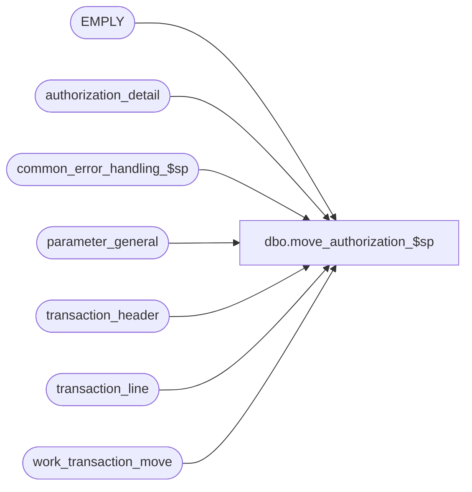

# dbo.move_authorization_$sp

**Database:** auditworks  
**Server:** bedrockdb01  

## Architecture Diagram



## Table Dependencies

| Referenced Table |
|---|
| EMPLY |
| authorization_detail |
| common_error_handling_$sp |
| parameter_general |
| transaction_header |
| transaction_line |
| work_transaction_move |

## Stored Procedure Code

```sql
create proc dbo.move_authorization_$sp 
@process_id     binary(16),
@user_id        int,
@errmsg		nvarchar(255) OUTPUT,
@function_no	tinyint

AS


/* Proc Name: move_authorization_$sp
   Desc: (MOVE) to post authorization details.
     Called by move_register_$sp, rollforward_move_$sp.

HISTORY
Date     Name		Def# Desc
Jan04,11 Paul         105313 Use unicode datatypes
Aug08,08 Paul          87777 uplift 66476, code reviewed
Sep17,04 Maryam      DV-1146 Change user name to user_id.
May31,04 Brett       DV-1071 Replace table employee with table EMPLY
Apr28,04 Maryam      DV-1071 Receive @process_id and pass it to the common_error_handling_$sp
Jan24,06 Vicci	       66476 Treat inactive employees as invalid.
Apr19,02 Winnie      1-CD0IX R3 error handling.
Apr04,01 Phu		7501 Use system function to retrieve user name
Dec21,00 Vicci		7092 Handle additional house card card-types
May 4,00 Vicci		6313 Handle additional house card card-types
Feb17,00 Daphna 	5904 pass function_no (9 or 109) in call to update_error_log_$sp
Jan12,00 Paul		11   Use temp table instead of employee_account table
Sep19,97 Louise
         Seb		author
 */

DECLARE
  @errno				int,
  @rows					int,
  @set_employee_no_from_account		bit,
  @message_id		        	int,	
  @object_name				nvarchar(255),
  @operation_name			nvarchar(100),
  @process_name		        	nvarchar(100)
  
SELECT @process_name = 'move_authorization_$sp',
       @message_id = 201068

SELECT @set_employee_no_from_account = set_employee_no_from_account
  FROM parameter_general
SELECT @errno = @@error
IF @errno != 0
  BEGIN
    SELECT @errmsg = 'Failed to select from parameter_general',
           @object_name = 'parameter_general',
           @operation_name = 'SELECT'
      GOTO error
  END   


IF @set_employee_no_from_account = 0
  RETURN

/* get list of employee housecard numbers */

 SELECT tl.transaction_id,
	reference_no
   INTO #employee
   FROM work_transaction_move wt, authorization_detail ad,
	transaction_line tl
  WHERE process_id = @process_id
    AND wt.transaction_id = ad.transaction_id
    AND card_type in ('H', 'K', 'L', 'N', 'O', 'P', 'Q', 'R', 'S', 'U', 'W', 'X', 'Y', 'Z')
    AND ad.transaction_id = tl.transaction_id
    AND ad.line_id = tl.line_id

SELECT @errno = @@error, @rows = @@rowcount
IF @errno != 0
 BEGIN
   SELECT @errmsg = 'Failed to build temp table insert on employee_account',
          @object_name = '#employee',
          @operation_name = 'CREATE'   
   GOTO error
 END

IF @rows = 0
  RETURN

/* look up employee_no using employee's house_account_no */
UPDATE transaction_header
   SET employee_no = e.EMPLY_NUM
  FROM #employee ea, transaction_header th, EMPLY e
 WHERE ea.transaction_id = th.transaction_id
   AND reference_no = HS_ACNT_NUM
   AND e.ACTV = 1

SELECT @errno = @@error
IF @errno != 0
 BEGIN
   SELECT @errmsg = 'Failed to update on transaction_header',
          @object_name = 'transaction_header',
          @operation_name = 'UPDATE'      
   GOTO error
 END

RETURN

error:   /* Common error handler. */

	EXEC common_error_handling_$sp @function_no, @errno, @errmsg, 0, @message_id, 
	@process_name, @object_name, @operation_name, 0, 1, 0, null, 0, null, null, 
	null, null, null, null, 0, @process_id, @user_id
	RETURN
```

