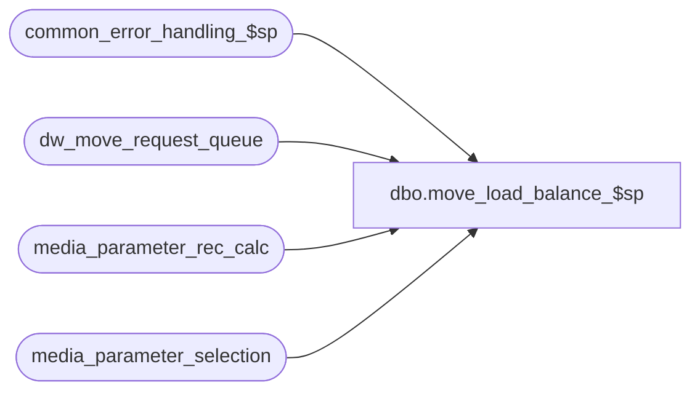

# dbo.move_load_balance_$sp

**Database:** auditworks  
**Server:** bedrockdb01  

## Architecture Diagram



## Table Dependencies

| Referenced Table |
|---|
| common_error_handling_$sp |
| dw_move_request_queue |
| media_parameter_rec_calc |
| media_parameter_selection |

## Stored Procedure Code

```sql
CREATE proc [dbo].[move_load_balance_$sp] 
@process_id             binary(16),
@user_id                int,
@cancel_store_no        int OUTPUT /* null if requesting a move, only populated for a cancellation request */

AS

/* 
PROC NAME: move_load_balance_$sp
     DESC: To evaluate request to move a store to another Scaleout peripheral.
  	   Called by front-end Load Balancing MOVE function.

  HISTORY:
Date     Name            Def# Desc
Apr15,15 Paul        T-110734 added validation of scaleout cross-peripheral scenarios


*/
	
DECLARE
 @cursor_open			tinyint,
 @dest_instance_id		smallint,
 @dest_store_status		tinyint,
 @edit_timestamp		float,
 @error_code			int,
 @errmsg		        nvarchar(2000),
 @errmsg2			nvarchar(2000),
 @errno					int,
 @function_no			tinyint,
 @instance_id			int,
 @scaleout_flag			int,
 @message_id		        int,
 @move_status			smallint,
 @multiple_store_shared_rec	tinyint,
 @next_request_id			numeric(12,0),	
 @object_name		        nvarchar(255),	
 @operation_name		        nvarchar(100),
 @process_name	         	nvarchar(100),
 @request_id			numeric(12,0),
 @rows                    	    int, 	
 @store_no			int,
 @abort_flag			tinyint

SET NOCOUNT ON;
 
SELECT 	@process_name = 'move_load_balance_$sp',
        @message_id = 201068,
        @abort_flag = 0,
        @operation_name = 'SELECT',
        @function_no = 49,
        @request_id = 0,
        @multiple_store_shared_rec = 0;

BEGIN TRY

SELECT @errmsg = 'Failed to set cancellation_requested',
       @object_name = 'dw_move_request_queue',
       @operation_name = 'UPDATE';

/* Reject any cancellation requests where background processing has already started for that store.
   For data integrity reasons, it is not allowed to cancel a move request for a store once it has started to be processed by the background job.
   Evaluate cancellation requests for all values of process_id (in case multiple users erroneously try to request load balancing at same time). */

UPDATE dw_move_request_queue
   SET cancellation_requested = 2 -- cancellation request rejected
  FROM dw_move_request_queue mr
 WHERE move_status IN (0, 1)
   AND cancellation_requested = 1
   AND from_transaction_date IS NULL -- update only the request row for the store level
   AND EXISTS (SELECT 1 FROM dw_move_request_queue mr2
                   WHERE mr.from_store_no = mr2.from_store_no
                     AND mr2.move_status > 1
                     AND mr2.move_status NOT IN (70) -- safety check
                     AND mr2.from_transaction_date IS NOT NULL
                     AND mr2.to_transaction_date IS NULL); -- exclude non-load balance requests

/* evaluate cancellation requests for all values of process_id (in case multiple users erroneously try to request load balancing at same time).
   The cancellation will be allowed for stores for which processing has not already been started 
     unless the backend job happens to read the status immediately before this update occurs.
   Check for any existing rows for store-dates for which processing has started. */

IF @cancel_store_no IS NOT NULL -- cancellation requested
  BEGIN
   SELECT @errmsg = 'Failed to set move_status for cancellation request';

   UPDATE dw_move_request_queue
     SET move_status = 70,
         last_processed_date = getdate(),
         cancel_user_id = @user_id
    FROM dw_move_request_queue mr
   WHERE move_status IN (0, 1)
     AND cancellation_requested = 1
     AND from_transaction_date IS NULL -- update only the request row for the store level
     AND from_store_no = @cancel_store_no
     AND NOT EXISTS (SELECT 1 FROM dw_move_request_queue mr2
                   WHERE mr.from_store_no = mr2.from_store_no
                     AND mr2.move_status > 1
                     AND mr2.move_status NOT IN (70, 80, 81, 82, 83) -- safety check
                     AND mr2.from_transaction_date IS NOT NULL -- store-date level
                   AND mr2.to_transaction_date IS NULL); -- exclude non-load balance requests

   IF EXISTS (SELECT 1 FROM dw_move_request_queue
              WHERE from_store_no = @cancel_store_no
                AND cancellation_requested = 2
                AND move_status != 30 -- previous succesful request
                AND from_transaction_date IS NULL) -- store level
      SELECT @cancel_store_no = -71; -- rejection of cancellation request
   RETURN;
  END;

/*

In media_reconciliation_status, store_no is sometimes set to 0 (instead of the real store) because S/A supports cross-store reconciliations such as balancing by bank
 and/or balancing by reconciliation service.  This would pose a problem for cross-peripheral moves, since we can't split stores that deposit into the same bank onto
  separate peripherals.  This implies that if exists select 1 from media_parameter_rec_calc where store_no_factor = 0, then cross peripheral moves should be disabled
  because all stores that share deposit reconciliation would need to be moved to the same peripheral. This is not supported yet and will be rejected. 

If this measure is enforced, then you can simply use the media_reconciliation_status.store_no to determine which balancing_entity_id pertain to a store.  
   
Note that since transactions can be entered in one store on behalf of another (via the Entity/Period Reconciled and/or Entity Reconciled stock_control_detail 
attachments), it is generally safer to look at balancing_entity_id (rather than store_no)  in media_reconciliation_detail, media_unreconciliation,
 media_reconciliation_trans as well.

*/

IF EXISTS (SELECT 1 FROM media_parameter_rec_calc
               WHERE store_no_factor = 0)
  SELECT @multiple_store_shared_rec = 1;

IF @multiple_store_shared_rec = 1
BEGIN
    SELECT @errmsg = 'Failed to set move_status for type 83',
       @object_name = 'dw_move_request_queue',
       @operation_name = 'UPDATE';
  UPDATE dw_move_request_queue
     SET move_status = 83
    FROM dw_move_request_queue mr
   WHERE move_status IN (0, 1)
     AND from_transaction_date IS NULL -- update only the request row for the store level
     AND EXISTS (SELECT 1 
                 FROM media_parameter_selection mps, media_parameter_rec_calc mrc
                 WHERE mps.media_parameter_set_no = mrc.media_parameter_set_no
                   AND mrc.store_no_factor = 0
                   AND mps.store_no = mr.from_store_no);
END;

/* Now evaluate each request in the table for requests for which processing has not already started (updates above are already committed).

move_status values :
 2= Move is attempting to lock dates on source db
 3= move in progress on source db
 8= move completed on source db
10= move in progress on destination db
14= media rec copy completed on destination db
15= available for edit processing on destination db
16= history copy in progress on destination db
19= edit is in progress on destination db
20= history copy completed on destination db 
30= move request is complete
70= move request was cancelled by the user 
71= move request could not be cancelled (not a status value in table, but could possibly display message when cancellation_requested = 2 and move_status != 70)
80= move request was refused - duplicate request
81= move request was refused - request conflicts with a previous request
82= move request was refused - the source store was not found (already moved or deleted).
83= move request was refused - multiple stores share the same bank reconciliation. Would need to move all of those stores.

*/


SELECT @request_id = -1;

WHILE 1=1
BEGIN

  SELECT @errmsg = 'Failed to select next_request_id',
               @object_name = 'dw_move_request_queue',
               @operation_name = 'SELECT';

  SELECT @next_request_id = MIN(request_id)
    FROM dw_move_request_queue WITH (NOLOCK)
   WHERE process_id = @process_id
 AND move_status = 0
     AND from_transaction_date IS NULL -- include only requests to move all dates (store level)
     AND request_id > @request_id

  IF @next_request_id IS NULL
    BREAK;

  SELECT @request_id = @next_request_id;

  SELECT @store_no = from_store_no,
         @move_status = move_status
    FROM dw_move_request_queue WITH (NOLOCK)
   WHERE process_id = @process_id
     AND move_status = 0
     AND from_transaction_date IS NULL -- include only requests to move all dates (store level)
     AND request_id = @request_id;

      SELECT @errmsg = 'Failed to set move_status to 80',
               @operation_name = 'UPDATE';

  IF @move_status = 0
  BEGIN -- check for duplicate requests
   IF EXISTS(SELECT 1 FROM dw_move_request_queue WITH (NOLOCK)
                  WHERE from_store_no = @store_no
                  AND move_status NOT IN (70)
                  AND from_transaction_date IS NULL
                  AND request_id <> @request_id)
   BEGIN
  SELECT @move_status = 80;
    UPDATE dw_move_request_queue
      SET move_status = 80
    WHERE process_id = @process_id
      AND request_id = @request_id
      AND from_transaction_date IS NULL
      AND move_status = 0; -- safety check
   END;
  END; -- If @move_status = 0

  -- check for store_audit_status doesn't exist
        SELECT @errmsg = 'Failed to set move_status to 1';

  UPDATE dw_move_request_queue
     SET move_status = 1
   WHERE process_id = @process_id
     AND request_id = @request_id
     AND move_status = 0
     AND from_store_no = @store_no
     AND from_transaction_date IS NULL; -- include only requests to move all dates

END; -- While 1=1


RETURN;


business_error:   /* Business Rule handler. */

	SELECT @errmsg2 = @errmsg
	SET NOCOUNT OFF;	  

	EXEC common_error_handling_$sp @function_no, @errno, @errmsg, @abort_flag, @message_id, 
	@process_name, @object_name, @operation_name, 0, 1, 0, null, 0, null, null, null,
	  null, null, null, 0, @process_id, @user_id;

	RETURN;
END TRY

BEGIN CATCH;

        /* Common error handler. */

        SELECT @errno = ERROR_NUMBER(),
		@errmsg = COALESCE(@errmsg, ' ') + ':' + ERROR_MESSAGE();

	 /* this condition will only be true when raise error in trap above fires this general catch */
	IF @errmsg2 IS NOT NULL
	  SELECT @errmsg = @errmsg2;

	EXEC common_error_handling_$sp @function_no, @errno, @errmsg, @abort_flag, @message_id, 
	@process_name, @object_name, @operation_name, 0, 1, 0, null, 0, null, null, null,
	  null, null, null, 0, @process_id, @user_id;

	RETURN;

END CATCH;
```

