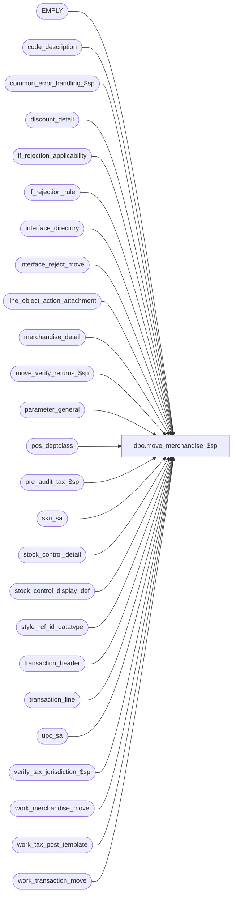

# dbo.move_merchandise_$sp

**Database:** auditworks  
**Server:** bedrockdb01  

## Architecture Diagram



## Table Dependencies

| Referenced Table |
|---|
| EMPLY |
| code_description |
| common_error_handling_$sp |
| discount_detail |
| if_rejection_applicability |
| if_rejection_rule |
| interface_directory |
| interface_reject_move |
| line_object_action_attachment |
| merchandise_detail |
| move_verify_returns_$sp |
| parameter_general |
| pos_deptclass |
| pre_audit_tax_$sp |
| sku_sa |
| stock_control_detail |
| stock_control_display_def |
| style_ref_id_datatype |
| transaction_header |
| transaction_line |
| upc_sa |
| verify_tax_jurisdiction_$sp |
| work_merchandise_move |
| work_tax_post_template |
| work_transaction_move |

## Stored Procedure Code

```sql
CREATE proc  dbo.move_merchandise_$sp  
 @process_id            binary(16),
 @user_id               int,
 @store_no              int,
 @errmsg                nvarchar(2000) OUTPUT,
 @function_no           tinyint,
 @to_cashier_no		int = NULL

AS

/*

PROC NAME: move_merchandise_$sp
     DESC: (MOVE) build merchandise/nonmerchandise details.
           logs rejects for: upc_check 1 and 2,
                             employee_check 1,2,3
                             tax_default_check 
	   Called by move_register_$sp proc.
	   Calls procs: move_verify_returns_$sp.
	   
Unicode version.

HISTORY:
Date     Name         Def#  Desc
Sep01,16 Vicci   DAOM-1367  Don't attempt to log user-defined information set attachment information not relevant to merchandise to work_merchandise_move.
                            POS Identifier for merch is limited to 20 characters but this field holds much larger data when user-defined for other purposes.
                            Don't update ALL information set attachments for a line when one of them is merchandise stock attachment.
JUL21,15 akhoukaz     131151  Expand the length of the column for tender total and amounts
Jan12,15 Vicci    TFS-99599 Handle I/F Rejection Rule 83 (invalid cashier) same as rule 80 (invalid/missing cashier) except that
                            absent cashier (i.e. cashier 0) is OK. 
Nov07,14 Vicci    TFS-81700 Retain transaction cost when moving if specified, otherwise default to that in style master.
Oct29,14 Vicci    TFS-88852 Added force order hint to the update from sku_sa in order to force work table to be looked up in resolved view and 
                            avoid the extreme performance degradation resulting from the default behaviour which is to join the work table to
                            user_upc on lookup division alone then look up that horribly magnified output in user_pos_identifier.
Jul04,14 Vicci   TFS-74694  Log cost and validate I/F Rejection rule 116 (Merchandise cost unknown).
Sep24,13 Vicci      146826  Take pos_identifier_type into account when more than 1 has been defined, and support SQL 2012.
Aug17,12 Vicci      137407  Ensure validations run agains new cashier number (not old ones left in work_transaction_move.cashier_no to support move_audit_trail).
Jul31,12 Vicci      137299  Since ADO.NET sets concat-null-yields-null on for the session, ensure that neither of the 'check' strings being
                            concatenated are null, otherwise none of the I/F rejection validations get performed during the move.
Jan27,11 Paul       123556  treat upc_no = 0 existing in upc_sa as being not on file.
Jan15,10 Vicci    1-44G2XS  Correctly assess the upc_check (and other check) values in order to avoid setting SKU to 0.
Aug08,08 Paul        87777  uplift 79437, code reviewed
Apr18,08 Phu         96766  Separate merch and return salesperson validations. Correct 93944.
Jan02,08 Phu         93944  Fix invalid employee I/F is incorrectly created even though the validation is off.
Jun14,06 Tim       DV-1339  replace active_rejection_rule with COALESCE(active_rejection_rule,1)
Sep06,05 Paul      DV-1312  Apply 49080 to SA5
Mar30,05 David     DV-1202  Handle I/F reject 114, 115 - Invalid source/fulfillment store no.
         Sab         53575  Add SUBSTRING(md.pos_identifier + '00000000000000000000',1,20) != '00000000000000000000' when comparing pos_identifier in work_merchandise_move
Mar24,05 Maryam    DV-1202  fix the join from work_merchandise_move to line_object_action_attachment to use display_def_id.
Jan10,05 Paul      DV-1191  added nolock hints
Nov17,04 Maryam    DV-1167  Check for EMPLY active flag.
Sep17,04 Maryam    DV-1146  Change user name to user_id.
Sep02,04 David     DV-1129  apply 29561, 38630 to SA5
Apr28,04 Maryam    DV-1071  Receive @process_id and pass it to the sub procs
Apr26,04 Sab       DV-1071  Replace employee table with EMPLY
Nov06.06 Daphna      79437  Ensure NULL upc_no rejects when sku_lookup_method = 0
Jan24,06 Vicci	     66476  Treat inactive employees as invalid.
Apr06,05 Maryam      49080  validate cashier_no 0.
Jul16,04 Daphna      38630  Validate purchasing employee_no 0 (use IS NOT NULL)
Jul15,04 Vicci       29561  Handle line_object_type 23 (PLU subtotal discounts)
May21,04 Daphna      29661  ensure work_table.attachment_mandatory, upc_lookup_division are
                            set correctly for stock control
Nov17,03 Phu         15801  Set sku_id, style_reference_id
Sep15,03 ShuZ      1-G7A5F  Remove all references to the interface_directory '... _check' 
                            fields from stored procedures/triggers and replace with usage 
                            of if_rejection_applicability table.
                            Do not log if_reject_reason = 1 when upc_no = 0 and sku_lookup_method > 0.
SEP16,02 Daphna    1-FBPVT  ensure insert to move_rejection_reason (reason 80) matches 
                            @process_id
Aug16,02 HenryW    1-AUHY5  Added 2 new system I/F reject reasons = 110 and 111.
Apr25,02 Phu       1-C9P5S  Pre audit tax
SEP16,02 Daphna    1-FBPVT  RETROFIT to 3.0
Jan22,02 Henry     1-A9XLD  Correctly set class_code from pos_deptclass, when retain_class_code flag is on.
Jan21,02 Vicci     1-A9Z28  Adjust line_object_action_attachment join to account for new
     transaction_category.
Dec20,01 Paul      1-9PZOZ  correctly create i/f rejects for invalid salesperson
Dec05,01 Daphna    1-9EKNQ  Create IF Rejects when merch or stock attachments are valid for
                            obj/act combination even if not mandatory
                            use the work table column attachment_mandatory to mean 'attachment is valid'
                            R3 Error Handling
Oct04,01 Paul         8811  Do not insert stock_control to work_merchandise_move if upc_no is null
Sep05,01 Daphna       8663  Do not reevaluate voided lines for Stock IF Rej (5,89,90)
                            Replace #merchandise_temp with work_merchandise_move
                            Add col merch_stock_flag,attachment_mandatory to work table
                       Insert work table for stock control details (reevaluating IF Rej 5,89,90)
                            Lookup UPC from pos_deptclass where sku-lookup-method = 2
                           for merchandise and stock control
                          Update merchandise_detail, stock_control_detail from work table
                            Don't create IF Rej 5 if stock_control attachmt not mandatory
                            Handle employee_check, purchasing_employee_check, cashier_check
                            separately (not nested) to complete Def 5678
                            Skip merch validations if no merch rows inserted to work table 
                            Skip stock validations if no stock rows inserted to work table 
                            Delete any stock rows in work table before checking tax overrides
Aug22,01 Daphna       8545  Reevaluate IF Rej (merch) 87,88,(stockcontrol)89,90
                            update class_code based on parameter_general.retain_class_code
Aug10,01 Maryam       8283  Call verify_tax_jurisdiction_$sp when either tax_default_check
                            or exception_jurisdiction_check is turned on.
SEP04,01 Daphna       8639  RETROFIT 8545 FOR 02.46.25						                             
Apr04,01 Phu          7501  Use system function to retrieve user name
Feb16,01 Paul         7359  Do not create upc rejects if mdse attachment is not mandatory
Jan08,01 Louise M     7161  To properly set the salesperson2_on_file_flag (otherwise,
                            causes incorrect i/f rejects)
Jun19,00 Daphna       6372  permit tax_override_detail.exception_tax_jurisdiction IS NULL
Jun01,00 John G       5678  Break down employee_no_check into component parts.
May17,00 Louise       6294  Added join on upc_lookup_division
Mar30,00 Daphna       6087  ensure IF rej 8 created properly
Feb17,00 Daphna       5904  pass function_no (9 or 109) in call to update_error_log_$sp 
Dec21,99 Paul         5544  don't create type 8 i/f rejects for tax overrides.
Nov24,99 Shapoor      5649  Explictly convert to numeric(12,4) when dividing by units.
Jun22,99 Daphna F     4878  add logic to log rejects for tax_default_check  
Jan20,99 Henry W            last modified 
Jun19,96 Sebastiano    n/a  author version 1.11
*/

DECLARE @bit_filler			tinyint,
	@cashier_check			tinyint,  --Missing/Invalid check
	@invalid_cashier_check		tinyint,  --Invalid check
	@employee_check			tinyint,
	@errno				int,
	@exception_jurisdiction_check	tinyint,	
	@execret			int,
	@float_filler			float,
	@int_filler			int,
	@merch_rows			int,
	@payroll_employee_check		tinyint,
	@purchasing_employee_check	tinyint,
	@retain_class_code		tinyint,
	@sku_lookup_method		tinyint,
	@stock_rows			int,
	@store_check			tinyint,
	@style_reference_id		style_ref_id_datatype,
	@tax_default_check		tinyint,
	@tinyint_filler			tinyint,
	@tinyint1_filler		tinyint,
	@upc_check			tinyint,
	@update_timing			smallint,
	@object_name			nvarchar(255),
	@operation_name			nvarchar(100),
	@process_name			nvarchar(100),
	@message_id			int,
	@log_error_flag			tinyint,
	@stock_origin_store_check	tinyint,
	@merch_origin_store_check	tinyint,
	@merch_source_store_check	tinyint,
	@merch_fulfillment_store_check 	tinyint,
	@validation_check		nchar(19),
	@validation_check1		nchar(10),
	@validation_check2		nchar(9),
	@base				numeric(19,0),
	@errmsg2                        nvarchar(2000),
	@multiple_pos_id_types_exist	tinyint,
	@cost_check			tinyint,
	@cost_val_without_upc_val	tinyint;
	

SELECT 	@employee_check = 0,
	@upc_check = 0,
	@bit_filler = 0,
	@float_filler = 0,
	@int_filler = 0,
	@tinyint_filler = 0,
	@tinyint1_filler = 1,
	@style_reference_id = 0,
	@retain_class_code =0,
	@sku_lookup_method =0,
	@stock_origin_store_check = 0,
	@merch_origin_store_check = 0,
	@base = 10,
	@message_id = 201068,
	@log_error_flag = 0,  -- not called by smartload
	@process_name = 'move_merchandise_$sp',
	@cost_check = 0,
	@cost_val_without_upc_val = 0;

BEGIN TRY

SELECT @errmsg = 'Failed to determine if multiple POS Identifier Types have been defined. ',
       @object_name = 'code_description',
       @operation_name ='SELECT'; 
SELECT @multiple_pos_id_types_exist = CASE WHEN COUNT(1) > 1 THEN 1 ELSE 0 END
  FROM code_description
 WHERE code_type = 68
   AND code > 0  --(don't count the 'please log what has been given in the pos_identifier field to the upc_no field instead' request)
   AND code <> 100  --(C/L ref# reassignment)
   AND active_flag = 1;

SELECT @errmsg = 'Clean up interface_reject_move table for current process_id. ',
       @object_name = 'interface_reject_move',
       @operation_name ='DELETE'; 
DELETE FROM interface_reject_move
 WHERE process_id = @process_id;

/*
check type                       if reject reason  string position
upc_check (merch)                1,87,88           1
credit_card_check         2,113             2
employee_check (merch)           3                 3
purchasing_employee_check        4                 4
upc_check (stock control)        5,89,90           5
customer_info_check              6                 6
exception_jurisdiction_check     7                 7
tax_default_check                8                 8
store_check (return)             9                 9
store_check  (stock control)     10                10
cashier_check                    80                11
employee_check (return)          81                12
payroll_employee_check           82                13
reference_no_check               86                14
customer_liability_check         100               15
merch_origin_store_check         110               16
stock_origin_store_check       111               17
merch_source_store_check         114               18
merch_fulfillment_store_check    115               19
*/

SELECT @errmsg = 'Failed to retrieve from if_rejection_rule, if_rejection_applicability, interface_directory for if_rejection_reason part 1. ',
       @object_name = 'if_rejection_rule',
       @operation_name ='SELECT';
SELECT @validation_check1 = REVERSE(RIGHT('0000000000' + LTRIM(STR(SUM(POWER(@base, CONVERT(numeric(10,0), 
                             COALESCE((((1 - SIGN(ABS(ir.if_rejection_reason - 1))) * 1) +
                                   ((1 - SIGN(ABS(ir.if_rejection_reason - 2))) * 2) +
                                       ((1 - SIGN(ABS(ir.if_rejection_reason - 3))) * 3) +
                                       ((1 - SIGN(ABS(ir.if_rejection_reason - 4))) * 4) +
                                   ((1 - SIGN(ABS(ir.if_rejection_reason - 5))) * 5) +
        ((1 - SIGN(ABS(ir.if_rejection_reason - 6))) * 6) +
                                       ((1 - SIGN(ABS(ir.if_rejection_reason - 7))) * 7) +
                                       ((1 - SIGN(ABS(ir.if_rejection_reason - 8))) * 8) +
                                       ((1 - SIGN(ABS(ir.if_rejection_reason - 9))) * 9) +
                                       ((1 - SIGN(ABS(ir.if_rejection_reason - 10))) * 10) +
                                       ((1 - SIGN(ABS(ir.if_rejection_reason - 87))) * 1) +
                                       ((1 - SIGN(ABS(ir.if_rejection_reason - 88))) * 1) +
     ((1 - SIGN(ABS(ir.if_rejection_reason - 89))) * 5) +
                                       ((1 - SIGN(ABS(ir.if_rejection_reason - 90))) * 5) +
                                       ((1 - SIGN(ABS(ir.if_rejection_reason - 113))) * 2)), 0)) - 1)), 10, 0)), 10))
FROM if_rejection_rule ir
WHERE ir.if_rejection_reason IN (1, 2, 3, 4, 5, 6, 7, 8, 9, 10, 87, 88, 89, 90, 113)
AND COALESCE(ir.active_rejection_rule,1) = 1
AND EXISTS (SELECT 1 FROM if_rejection_applicability ia, interface_directory id
            WHERE ir.if_rejection_reason = ia.if_reject_reason
            AND ia.interface_id = id.interface_id
            AND id.update_timing > 0);

IF @validation_check1 IS NULL
  SELECT @validation_check1 = '0000000000'; 
 
SELECT @errmsg = 'Failed to retrieve from if_rejection_rule, if_rejection_applicability, interface_directory for if_rejection_reason part 2. ',
       @object_name = 'if_rejection_rule',
       @operation_name ='SELECT';
SELECT @validation_check2 = REVERSE(RIGHT('000000000' + LTRIM(STR(SUM(POWER(@base, CONVERT(numeric(9,0), 
                             COALESCE((((1 - SIGN(ABS(ir.if_rejection_reason - 80))) * 1) +
                                       ((1 - SIGN(ABS(ir.if_rejection_reason - 81))) * 2) +
                                       ((1 - SIGN(ABS(ir.if_rejection_reason - 82))) * 3) +
                                       ((1 - SIGN(ABS(ir.if_rejection_reason - 86))) * 4) +
                                       ((1 - SIGN(ABS(ir.if_rejection_reason - 100))) * 5) +
                                       ((1 - SIGN(ABS(ir.if_rejection_reason - 110))) * 6) +
                                       ((1 - SIGN(ABS(ir.if_rejection_reason - 111))) * 7) +
                                       ((1 - SIGN(ABS(ir.if_rejection_reason - 114))) * 8) +
                                       ((1 - SIGN(ABS(ir.if_rejection_reason - 115))) * 9)), 0)) - 1)), 9, 0)), 9))
FROM if_rejection_rule ir
WHERE ir.if_rejection_reason IN (80, 81, 82, 86, 100, 110, 111, 114, 115)
AND COALESCE(ir.active_rejection_rule,1) = 1
AND EXISTS (SELECT 1 FROM if_rejection_applicability ia, interface_directory id
            WHERE ir.if_rejection_reason = ia.if_reject_reason
            AND ia.interface_id = id.interface_id
            AND id.update_timing > 0);

SELECT @errmsg = 'Failed to set variables indicating whic validations to perform. ',
       @object_name = '@xxx_check',
      @operation_name ='SELECT';

IF @validation_check2 IS NULL
  SELECT @validation_check2 = '000000000'; 
 
SELECT @validation_check = @validation_check1 + @validation_check2;

       -- @upc_check will have the value of 0:no validation, 1:validate merchandise upc, 2:stock_control_detail upc, 3:both
SELECT @upc_check = SIGN(CONVERT(tinyint, SUBSTRING(@validation_check, 1, 1))) + SIGN(CONVERT(tinyint, SUBSTRING(@validation_check, 5, 1))) * 2,

       -- @employee_check will have the value of 0:no validation, 1:merch(salesperson), 2:return(salesperson), or 3:both
       @employee_check = CONVERT(tinyint, SUBSTRING(@validation_check, 3, 1)) + CONVERT(tinyint, SUBSTRING(@validation_check, 12, 1)) * 2,

       @purchasing_employee_check = CONVERT(tinyint, SUBSTRING(@validation_check, 4, 1)),
       @exception_jurisdiction_check = CONVERT(tinyint, SUBSTRING(@validation_check, 7, 1)),
       @tax_default_check = CONVERT(tinyint, SUBSTRING(@validation_check, 8, 1)),

       -- @store_check will have the value of 0:no validation, 1:return_detail.from_store_no, 2:stock_control.other_store_no, or 3:both
       @store_check = CONVERT(tinyint, SUBSTRING(@validation_check, 9, 1)) + CONVERT(tinyint, SUBSTRING(@validation_check, 10, 1)) * 2,

       @cashier_check = CONVERT(tinyint, SUBSTRING(@validation_check, 11, 1)),
     @payroll_employee_check = CONVERT(tinyint, SUBSTRING(@validation_check, 13, 1)),
       @merch_origin_store_check = CONVERT(tinyint, SUBSTRING(@validation_check, 16, 1)),
       @stock_origin_store_check = CONVERT(tinyint, SUBSTRING(@validation_check, 17, 1)),
       @merch_source_store_check = CONVERT(tinyint, SUBSTRING(@validation_check, 18, 1)),
       @merch_fulfillment_store_check = CONVERT(tinyint, SUBSTRING(@validation_check, 19, 1));

SELECT @errmsg = 'Failed to determine if merchandise cost validation is active. ',
       @object_name = 'if_rejection_applicability',
       @operation_name ='SELECT';
IF EXISTS (SELECT 1
             FROM if_rejection_rule ir
            WHERE ir.if_rejection_reason = 116
              AND COALESCE(ir.active_rejection_rule,1) = 1
              AND EXISTS (SELECT 1 
                            FROM if_rejection_applicability ia, interface_directory id
                           WHERE ir.if_rejection_reason = ia.if_reject_reason
                             AND ia.interface_id = id.interface_id
                             AND id.update_timing > 0))
BEGIN
  SELECT @cost_check = 1;
  IF EXISTS (SELECT 1
               FROM if_rejection_applicability cst
                    INNER JOIN interface_directory id
                       ON cst.interface_id = id.interface_id
                      AND id.update_timing > 0
              WHERE cst.if_reject_reason = 116
                AND NOT EXISTS (SELECT 1
                                  FROM if_rejection_rule ir
                                       INNER JOIN if_rejection_applicability ia
                                          ON ir.if_rejection_reason = ia.if_reject_reason
                                          AND ia.interface_id = id.interface_id
                                 WHERE ir.if_rejection_reason IN (1, 87, 88)
		                   AND COALESCE(ir.active_rejection_rule,1) = 1 ))
  BEGIN
    SELECT @cost_val_without_upc_val = 1
  END;
END;

SELECT @errmsg = 'Failed to determine if cashier check for non-zero (i.e. given) cashiers only validation is active. ',
       @object_name = 'if_rejection_applicability',
       @operation_name ='SELECT';
IF EXISTS (SELECT 1
             FROM if_rejection_rule ir
            WHERE ir.if_rejection_reason = 83
              AND COALESCE(ir.active_rejection_rule,1) = 1
              AND EXISTS (SELECT 1 
                            FROM if_rejection_applicability ia, interface_directory id
                           WHERE ir.if_rejection_reason = ia.if_reject_reason
                             AND ia.interface_id = id.interface_id
                             AND id.update_timing > 0))
BEGIN
  SELECT @invalid_cashier_check = 1;
END;
ELSE
BEGIN
  SELECT @invalid_cashier_check = 0;
END;

SELECT @errmsg = 'Failed to read update_timing from interface_directory. ',
       @object_name = 'interface_directory',
       @operation_name ='SELECT';
SELECT @update_timing = update_timing
  FROM interface_directory
 WHERE interface_id = 12;

SELECT @update_timing = COALESCE(@update_timing, 0);

IF @update_timing NOT IN (0,3,6)
  SELECT @update_timing = 3;

SELECT @errmsg = 'Failed to read sku_lookup_method etc. ',
       @object_name = 'parameter_general',
       @operation_name ='SELECT';
SELECT @sku_lookup_method = sku_lookup_method,
       @retain_class_code = retain_class_code
  FROM parameter_general; 


 /* def 8663 insert to work_merchandise_move instead of SELECT INTO work_merchandise_move  */
SELECT @errmsg = 'Failed to clean up work_merchandise_move for current process_id. ',
       @object_name = 'work_merchandise_move',
       @operation_name ='DELETE';
DELETE FROM work_merchandise_move
 WHERE process_id = @process_id;

SELECT @errmsg = 'Failed to populate work_merchandise_move from merch detail and work_transaction_move.',
       @object_name = 'work_merchandise_move',
       @operation_name ='INSERT'; 
INSERT INTO work_merchandise_move (
       process_id, 
       store_no, 
       transaction_id, 
       line_id, 
       line_object, 
       line_action,
       upc_no, 
       pos_identifier,	
       pos_deptclass, 
       sku_id,
       style_reference_id,
       class_code,
       subclass_code,
       units, 
       price_override, 
       ticket_price, 
       sold_at_price, 
       plu_price, 
       gross_line_amount, 
       merchandise_category, 
       upc_lookup_division, 
       salesperson, 
       salesperson2, 
       line_void_flag, 
       line_object_type, 
       merch_stock_flag,
       pos_identifier_type,
       cost)
SELECT wt.process_id,
       @store_no,
       wt.transaction_id,
       tl.line_id,
       tl.line_object,
       tl.line_action,
       upc_no,
       pos_identifier,
       pos_deptclass,   -- def 8663
       CASE WHEN @upc_check IN (1, 3) THEN 0 ELSE md.sku_id END, 
       CASE WHEN @upc_check IN (1, 3) THEN 0 ELSE md.style_reference_id END, 
       @retain_class_code * md.pos_deptclass, -- class_code. Def 1-A9XLD.
       CASE WHEN @upc_check IN (1, 3) THEN 0 ELSE md.subclass_code END,
       md.units,
       price_override,
       CONVERT (NUMERIC(18,4), gross_line_amount / units), -- ticket_price
       CONVERT (NUMERIC(18,4),(gross_line_amount - pos_discount_amount)/units), -- sold_at_price
       CONVERT (NUMERIC(18,4),gross_line_amount / units), -- plu_price
       tl.gross_line_amount,
       merchandise_category,   -- def 8663 @tinyint1_filler = 1
       upc_lookup_division,  -- def 8663 @tinyint1_filler = 1
       salesperson,
       salesperson2,
       line_void_flag = (1 - tl.line_void_flag) * ABS(voiding_reversal_flag), /* > 0 if not void */
       line_object_type,
       1, -- merch_stock_flag =  1, merch detail, 2 = stock control detail def 8663
       md.pos_identifier_type,
       md.cost
  FROM work_transaction_move wt WITH (NOLOCK), merchandise_detail md WITH (NOLOCK), transaction_line tl WITH (NOLOCK)
 WHERE process_id = @process_id
   AND wt.transaction_id = md.transaction_id
   AND md.transaction_id = tl.transaction_id
   AND md.line_id = tl.line_id;
SELECT @merch_rows = @@rowcount;

IF @merch_rows > 0  -- 
BEGIN 
  SELECT @errmsg = 'Failed to set plu_price. ',
         @object_name = 'work_merchandise_move',
         @operation_name ='UPDATE'                
  UPDATE work_merchandise_move
  SET plu_price = CONVERT (NUMERIC(18,4),(mt.gross_line_amount -
                    (SELECT COALESCE(SUM(d.pos_discount_amount),0)
              FROM discount_detail d WITH (NOLOCK)
                     WHERE mt.transaction_id = d.transaction_id
                       AND mt.line_id = d.line_id
                       AND d.pos_discount_level in (22, 23))
                    )/mt.units)
   FROM work_merchandise_move mt
  WHERE merch_stock_flag = 1  -- def 8663
    AND process_id = @process_id;

  /* lookup upc's */
  IF @upc_check IN (1, 3)
  BEGIN

  /* set upc_lookup_division, merchandise_category, attachment_mandatory */
SELECT @errmsg = 'Failed to set upc_lookup_division, merch_category. ';  
    UPDATE work_merchandise_move
       SET upc_lookup_division = la.upc_lookup_division,
           merchandise_category = la.merchandise_category,
           attachment_mandatory = 1 -- def 1-9EKNQ attachment is valid
      FROM work_merchandise_move mt, line_object_action_attachment la WITH (NOLOCK), transaction_header th WITH (NOLOCK)
     WHERE mt.transaction_id = th.transaction_id
       AND mt.line_object = la.line_object
       AND mt.line_action = la.line_action
       AND th.transaction_category = COALESCE(la.transaction_category, th.transaction_category)
       AND attachment_type = 1
       AND merch_stock_flag = 1  -- def 8663
       AND process_id = @process_id;  -- def 8663

    /* def 8663 */
    IF @sku_lookup_method >= 1
    BEGIN
      SELECT @errmsg = 'Failed to set upc_no where sku_lookup_method = 1 (1). ';  
      UPDATE work_merchandise_move
         SET upc_no = ss.upc_no -- do not use max for MSSQL
        FROM work_merchandise_move md, sku_sa ss WITH (NOLOCK)
       WHERE md.upc_no = 0
         AND SUBSTRING(COALESCE(md.pos_identifier, '00000000000000000000') + '00000000000000000000',1,20) != '00000000000000000000'
         AND md.upc_lookup_division = ss.upc_lookup_division
         AND pos_identifier = ss.sku
         AND (md.pos_identifier_type = ss.pos_identifier_type OR @multiple_pos_id_types_exist = 0)
         AND merch_stock_flag = 1
         AND process_id = @process_id  -- def 8663
      OPTION (FORCE ORDER);
    
      IF @sku_lookup_method = 2
      BEGIN
        SELECT @errmsg = 'Failed to set upc_no where sku_lookup_method = 2 (1). ';
        UPDATE work_merchandise_move
          SET upc_no = replace_upc_no
          FROM work_merchandise_move md, pos_deptclass dc
         WHERE md.upc_no = 0
           AND SUBSTRING(COALESCE(md.pos_identifier, '00000000000000000000') + '00000000000000000000',1,20) = '00000000000000000000'
           AND md.pos_deptclass != 0
           AND md.pos_deptclass = dc.pos_deptclass
           AND md.upc_lookup_division = dc.upc_lookup_division
           AND replace_upc_no > 0
           AND merch_stock_flag = 1
           AND process_id = @process_id; -- def 8663
      END; /* @sku_lookup_method = 2 */
    END; /* @sku_lookup_method >= 1 */
  
    IF @retain_class_code != 1  -- update class code  DEF 8545 
    BEGIN
      SELECT @errmsg = 'Failed to set sku_id where retain_class_code <> 1 (1). ';
      UPDATE work_merchandise_move
      SET sku_id = us.sku_id,
    	  style_reference_id = us.style_reference_id,
  	  class_code = us.class_code,
	  subclass_code = us.subclass_code,
	  upc_on_file_flag = 1,
	  cost = COALESCE(mt.cost, us.cost)
      FROM work_merchandise_move mt, upc_sa us  -- remove join to line-obj-act-attach def 8663
      WHERE mt.upc_no = us.upc_no
        AND mt.upc_lookup_division = us.upc_lookup_division
        AND merch_stock_flag = 1  -- def 8663
        AND process_id = @process_id  -- def 8663
        AND us.upc_no > 0;
    END;
    ELSE  -- @retain_class_code = 1:  do not update class_code  DEF 8545
    BEGIN
      SELECT @errmsg = 'Failed to set sku_id where retain_class_code = 1 (1). ';
      UPDATE work_merchandise_move
        SET sku_id = us.sku_id,
   	    style_reference_id = us.style_reference_id,
	    subclass_code = us.subclass_code,
	    upc_on_file_flag = 1,
	    cost = COALESCE(mt.cost, us.cost)
      FROM work_merchandise_move mt, upc_sa us  -- remove join to line-obj-act-attach def 8663
      WHERE mt.upc_no = us.upc_no
       AND mt.upc_lookup_division = us.upc_lookup_division
       AND merch_stock_flag = 1 -- def 8663
       AND process_id = @process_id  -- def 8663
       AND us.upc_no > 0;
    END;  -- @retain_class_code != 1    
  END; -- @upc_check IN (1, 3)


  -- DEFECT #5678 - Modify 'IF @employee_check >= 1' condition

  IF @employee_check IN (1, 3)
  BEGIN
    SELECT @errmsg = 'Failed to set salesperson_on_file = 1. ';
    UPDATE work_merchandise_move
       SET salesperson_on_file = 1
      FROM work_merchandise_move mt, EMPLY e WITH (NOLOCK)
     WHERE salesperson >= 1
       AND mt.salesperson = e.EMPLY_NUM
       AND e.ACTV = 1
       AND merch_stock_flag = 1 -- def 8663
       AND process_id = @process_id;  -- def 8663
    
    /* DEF 8663 combined 2 updates into 1 */
    
    SELECT @errmsg = 'Failed to set salesperson_2on_file = 1. ';
    UPDATE work_merchandise_move
       SET salesperson2_on_file = 1
      FROM work_merchandise_move mt, EMPLY e WITH (NOLOCK)
     WHERE merch_stock_flag = 1 -- def 8663
       AND process_id = @process_id  -- def 8663
       AND (( salesperson2 >= 1 AND mt.salesperson2 = e.EMPLY_NUM AND e.ACTV = 1)
           OR (salesperson2 IS NULL OR salesperson2 = 0));
  END; -- @employee_check IN (1, 3)
  
  /* def 8663: update merchandise_detail */

  SELECT @errmsg = 'Failed to update merchandise_detail from work_merchandise_move. ',
         @object_name = 'merchandise_detail',
         @operation_name = 'UPDATE';                
  UPDATE merchandise_detail
     SET upc_no = tt.upc_no,
         upc_on_file_flag = tt.upc_on_file_flag,
         upc_lookup_division = tt.upc_lookup_division,
         merchandise_category = tt.merchandise_category,
         sku_id = tt.sku_id,
         style_reference_id = tt.style_reference_id,
         class_code = tt.class_code,
         subclass_code = tt.subclass_code,
         salesperson_on_file_flag = tt.salesperson_on_file,
         salesperson2_on_file_flag = tt.salesperson2_on_file,
         cost = tt.cost
   FROM work_merchandise_move tt WITH (NOLOCK), merchandise_detail md
   WHERE merch_stock_flag = 1
     AND process_id = @process_id
     AND tt.transaction_id = md.transaction_id
     AND tt.line_id = md.line_id;  
END; -- @merch_rows > 0 

IF @upc_check IN (2, 3)   -- validate stock control
BEGIN
  SELECT @errmsg = 'Failed to populate work_merchandise_move from stock_control_detail, work_transaction_move. ',
         @object_name = 'work_merchandise_move',
         @operation_name ='INSERT';
  INSERT work_merchandise_move(     --  def 8663
         process_id, store_no, transaction_id, line_id, line_object, line_action,
         upc_no, pos_identifier, pos_deptclass, units, gross_line_amount, upc_lookup_division,
	 line_void_flag, line_object_type, merch_stock_flag, sku_id, style_reference_id, display_def_id,
         pos_identifier_type)
  SELECT wt.process_id,
         @store_no,
         wt.transaction_id,
         tl.line_id,
	 tl.line_object,
	 tl.line_action,
	 upc_no,
	 SUBSTRING(sc.pos_identifier, 1, 20),
	 sc.pos_deptclass,
	 COALESCE(sc.units, 0) units,
         tl.gross_line_amount,
	 sc.upc_lookup_division, -- def 8663 = @tinyint1_filler,
	 (1 - tl.line_void_flag) * ABS(tl.voiding_reversal_flag) line_void_flag, /* > 0 if not void */
         tl.line_object_type,
         2, -- merch_stock_flag =  1 merch detail, 2 = stock control detail
         sc.sku_id,
         sc.style_reference_id,
         sc.display_def_id,
         sc.pos_identifier_type
    FROM work_transaction_move wt WITH (NOLOCK), stock_control_detail sc WITH (NOLOCK), transaction_line tl WITH (NOLOCK)
   WHERE process_id = @process_id
     AND wt.transaction_id = sc.transaction_id
     AND sc.transaction_id = tl.transaction_id
     AND sc.line_id = tl.line_id
     AND sc.display_def_id IN (SELECT display_def_id FROM stock_control_display_def WHERE upc_division_fe_resource_id <> 0);
  SELECT @stock_rows = @@rowcount;

  IF @stock_rows > 0 
  BEGIN
    /* set upc_lookup_division for any upc's that are not on file */
    SELECT @errmsg = 'Failed to set upc_lookup_division (2). ',
           @object_name = 'work_merchandise_move',
           @operation_name ='UPDATE';
    UPDATE work_merchandise_move
      SET upc_lookup_division = la.upc_lookup_division, 
          attachment_mandatory = 1 -- def 1-9EKNQ attachment is valid 
      FROM work_merchandise_move mt, line_object_action_attachment la WITH (NOLOCK), transaction_header th WITH (NOLOCK)
     WHERE mt.transaction_id = th.transaction_id
       AND mt.line_object = la.line_object
       AND mt.line_action = la.line_action
       AND mt.display_def_id = la.note_type
       AND th.transaction_category = COALESCE(la.transaction_category, th.transaction_category)
       AND la.attachment_type = 3   -- stock control
       AND merch_stock_flag = 2  -- def 8663
       AND process_id = @process_id;

    IF @sku_lookup_method >= 1
    BEGIN
      SELECT @errmsg = 'Failed to set upc_no where sku_lookup_method = 1 (2). ';
      UPDATE work_merchandise_move
        SET upc_no = ss.upc_no 
       FROM work_merchandise_move tt, sku_sa ss
      WHERE tt.upc_no = 0
        AND tt.merch_stock_flag = 2
        AND process_id = @process_id
        AND SUBSTRING(COALESCE(pos_identifier, '00000000000000000000') + '00000000000000000000',1,20) <> '00000000000000000000'
        AND tt.pos_identifier = ss.sku
        AND (tt.pos_identifier_type = ss.pos_identifier_type OR @multiple_pos_id_types_exist = 0)
        AND tt.upc_lookup_division = ss.upc_lookup_division
     OPTION (FORCE ORDER); 
     
      IF @sku_lookup_method = 2
      BEGIN
        SELECT @errmsg = 'Failed to set upc_no where sku_lookup_method = 2 (2). ';
        UPDATE work_merchandise_move 
          SET upc_no = replace_upc_no
         FROM work_merchandise_move tt, pos_deptclass dc
         WHERE tt.upc_no = 0
         AND SUBSTRING(COALESCE(tt.pos_identifier, '00000000000000000000') + '00000000000000000000',1,20) = '00000000000000000000'
         AND tt.pos_deptclass != 0
         AND tt.pos_deptclass = dc.pos_deptclass
         AND tt.upc_lookup_division = dc.upc_lookup_division
         AND tt.merch_stock_flag = 2  
         AND process_id = @process_id; 
      END; /* @sku_lookup_method = 2 */     
    END; -- @sku_lookup_method >= 1

    SELECT @errmsg = 'Failed to set upc_on_file_flag = 1 (2). ';
    UPDATE work_merchandise_move
       SET upc_on_file_flag = 1,
           sku_id = us.sku_id,
           style_reference_id = us.style_reference_id
      FROM work_merchandise_move tt, upc_sa us
     WHERE tt.upc_no = us.upc_no
       AND tt.upc_lookup_division = us.upc_lookup_division 
       AND tt.merch_stock_flag = 2   -- def 8663
       AND process_id = @process_id -- def 8663
       AND us.upc_no > 0;

      /* def 8663: update stock_control_detail */  
    SELECT @errmsg = 'Failed to update stock_control_detail from work_merchandise_move. ',
           @object_name = 'stock_control_detail',
           @operation_name ='UPDATE'; 
    UPDATE stock_control_detail
       SET upc_no = tt.upc_no,
           upc_on_file_flag = tt.upc_on_file_flag,
           upc_lookup_division = tt.upc_lookup_division,
           sku_id = tt.sku_id,
           style_reference_id = tt.style_reference_id
      FROM work_merchandise_move tt WITH (NOLOCK), stock_control_detail sc
     WHERE merch_stock_flag = 2
       AND process_id = @process_id -- def 8663        
       AND tt.transaction_id = sc.transaction_id
       AND tt.line_id = sc.line_id
       AND tt.display_def_id = sc.display_def_id;    
  END; -- @stock_rows > 0
END;  -- @upc_check IN (2, 3)

IF (@upc_check IN (1, 3) AND @merch_rows > 0)
BEGIN
  /* IF REJ 1 - Merch UPC not on file */ 
  SELECT @errmsg = 'Failed to populate interface_reject_move for IF reject 1. ',
         @object_name = 'interface_reject_move',
         @operation_name ='INSERT';
  INSERT interface_reject_move (
	 process_id,
	 if_reject_reason,
	 transaction_id,
	 line_id )
  SELECT @process_id,
	 1,
	 transaction_id,
	 line_id
    FROM work_merchandise_move WITH (NOLOCK)
   WHERE upc_on_file_flag = 0
     AND upc_lookup_division >= 1
     AND line_void_flag >= 1
     AND attachment_mandatory = 1 -- def 8663  def 1-9EKNQ attachment is valid
     AND merch_stock_flag = 1 -- def 8663
     AND process_id = @process_id -- def 8663
     AND (upc_no > 0 OR upc_no IS NULL OR @sku_lookup_method = 0);  -- prevent logging of both i/f reject reasons 1 AND 87 or 88
 
  IF @sku_lookup_method IN (1,2) 
  BEGIN
    /* IF REJ 87 - Merch SKU not on file */ 
    SELECT @errmsg = 'Failed to populate interface_reject_move for IF reject 87. ';
    INSERT interface_reject_move (
	  process_id,
	  if_reject_reason,
	  transaction_id,
 	  line_id )
    SELECT @process_id,
	  87,
	  transaction_id,
	  line_id
     FROM work_merchandise_move WITH (NOLOCK)
    WHERE upc_on_file_flag = 0
      AND upc_no = 0
      AND (SUBSTRING(pos_identifier + '00000000000000000000',1,20) != '00000000000000000000' OR pos_identifier IS NULL OR @sku_lookup_method = 1)
      AND upc_lookup_division >= 1
      AND line_void_flag >= 1
      AND attachment_mandatory = 1 -- def 8663
      AND merch_stock_flag = 1 -- def 8663      
      AND process_id = @process_id; -- def 8663        
   
    IF @sku_lookup_method = 2
    BEGIN
      /* IF REJ 88 - Merch DeptClass not on file */ 
      SELECT @errmsg = 'Failed to populate interface_reject_move for IF reject 88. ';
      INSERT interface_reject_move (
	     process_id,
	     if_reject_reason,
	     transaction_id,
 	     line_id )
      SELECT @process_id,
	     88,
	     transaction_id,
	 line_id
        FROM work_merchandise_move WITH (NOLOCK)
       WHERE upc_on_file_flag = 0
         AND upc_no = 0
         AND SUBSTRING(COALESCE(pos_identifier, '00000000000000000000') + '00000000000000000000',1,20) = '00000000000000000000'
         AND upc_lookup_division >= 1
         AND line_void_flag >= 1
         AND attachment_mandatory = 1 -- def 8663
         AND process_id = @process_id -- def 8663        
         AND merch_stock_flag = 1; -- def 8663
    END; -- @sku_lookup_method = 2 
  END; -- @sku_lookup_method IN (1,2) 
END; -- @upc_check IN (1, 3) AND @merch_rows > 0

IF @cost_check = 1 AND @merch_rows > 0
BEGIN
  --@cost_val_without_upc_val

  --IF REJ 116 - Merch cost unknown
  SELECT @errmsg = 'Failed to populate interface_reject_move for IF reject 116. ',
         @object_name = 'interface_reject_move',
         @operation_name ='INSERT';
  INSERT interface_reject_move (
	 process_id,
	 if_reject_reason,
	 transaction_id,
	 line_id )
  SELECT @process_id,
	 116,
	 transaction_id,
	 line_id
    FROM work_merchandise_move WITH (NOLOCK)
   WHERE (upc_on_file_flag <> 0 OR @cost_val_without_upc_val = 1)  -- prevent logging of both i/f reject reasons 1 AND 116
     AND cost IS NULL
     AND upc_lookup_division >= 1
     AND line_void_flag >= 1
     AND attachment_mandatory = 1 
     AND merch_stock_flag = 1 
     AND process_id = @process_id; 
END;  --IF @cost_check = 1

IF (@upc_check IN (2, 3) AND @stock_rows > 0)
BEGIN
    /* IF REJ 5 - Stock Control UPC not on file */
  SELECT @errmsg = 'Failed to populate interface_reject_move for IF reject 5. ',
         @object_name = 'interface_reject_move',
         @operation_name ='INSERT';
  INSERT interface_reject_move (
	process_id,
	if_reject_reason,
	transaction_id,
	line_id )
  SELECT @process_id,
	5,
	transaction_id,
	line_id
   FROM work_merchandise_move WITH (NOLOCK)
  WHERE upc_on_file_flag = 0
    AND upc_lookup_division >= 1
    AND (upc_no > 0 OR upc_no IS NULL OR @sku_lookup_method = 0)
    AND line_void_flag >= 1  -- def 8663
    AND attachment_mandatory = 1 -- def 8663
    AND process_id = @process_id -- def 8663        
    AND merch_stock_flag = 2; -- def 8663
    
  IF @sku_lookup_method IN (1,2)
  BEGIN
      /* IF REJ 89 - Stock Control UPC not on file */
    SELECT @errmsg = 'Failed to populate interface_reject_move for IF reject 89. ';
    INSERT interface_reject_move (
           process_id,
	   if_reject_reason,
	   transaction_id,
	   line_id )
    SELECT @process_id,
	   89,
	   transaction_id,
	   line_id
      FROM work_merchandise_move WITH (NOLOCK)
     WHERE upc_no = 0
  AND (SUBSTRING(COALESCE(pos_identifier, '00000000000000000000') + '00000000000000000000',1,20) != '00000000000000000000' OR @sku_lookup_method = 1)
       AND upc_on_file_flag = 0
       AND line_void_flag >= 1   -- def 8663
       AND merch_stock_flag = 2 -- def 8663
       AND attachment_mandatory = 1 -- def 8663
       AND process_id = @process_id; -- def 8663        
      
    IF @sku_lookup_method = 2
    BEGIN
        /* IF REJ 90 - Stock Control DeptClass not on file */
      SELECT @errmsg = 'Failed to populate interface_reject_move for IF reject 90. ';
      INSERT interface_reject_move (
 	     process_id,
	     if_reject_reason,
	     transaction_id,
	     line_id )
      SELECT @process_id,
  	     90,
	     transaction_id,
	     line_id
        FROM work_merchandise_move WITH (NOLOCK)
       WHERE upc_no = 0
         AND SUBSTRING(COALESCE(pos_identifier, '00000000000000000000') + '00000000000000000000',1,20) = '00000000000000000000'
         AND upc_on_file_flag = 0
         AND line_void_flag >= 1   -- def 8663
         AND merch_stock_flag = 2 -- def 8663
         AND attachment_mandatory = 1 -- def 8663
         AND process_id = @process_id; -- def 8663            
    END; -- @sku_lookup_method = 2
  END; -- @sku_lookup_method IN (1,2)   
  
  SELECT @errmsg = 'Failed to delete merch_stock_flag = 2 entries from work_merchandise_move. ',
         @object_name = 'work_merchandise_move',
         @operation_name ='DELETE'                
  DELETE FROM work_merchandise_move
   WHERE process_id = @process_id
    AND merch_stock_flag = 2;

END; -- @upc_check IN (2, 3) AND @stock_rows > 0

IF @employee_check IN (1, 3) -- defect 1-9PZ0Z (moved down)
BEGIN
  SELECT @errmsg = 'Failed to populate interface_reject_move with IF reject 3. ',
         @object_name = 'interface_reject_move',
         @operation_name ='INSERT';
  INSERT interface_reject_move (
  	 process_id,
	 if_reject_reason,
	 transaction_id,
	 line_id )
  SELECT @process_id,
	 3,
	 transaction_id,
	 line_id
    FROM work_merchandise_move WITH (NOLOCK)
   WHERE salesperson_on_file * salesperson2_on_file = 0
     AND line_void_flag >= 1   -- def 8663
     AND merch_stock_flag = 1 -- def 8663
     AND attachment_mandatory = 1 -- def 8663
     AND process_id = @process_id; -- def 8663
END; -- @employee_check IN (1, 3)

IF @purchasing_employee_check >= 1 /* verify purchasing employee */
BEGIN
  SELECT @errmsg = 'Failed to set employee_flag = 1. ',
         @object_name = 'work_transaction_move',
         @operation_name ='UPDATE';
  UPDATE work_transaction_move
     SET employee_flag = 1
    FROM work_transaction_move wt, EMPLY e WITH (NOLOCK)
   WHERE wt.employee_no IS NOT NULL /* purchasing employee */
     AND wt.employee_no = e.EMPLY_NUM
     AND e.ACTV = 1;

  SELECT @errmsg = 'Failed to populate interface_reject_move for IF reject 4. ',
         @object_name = 'interface_reject_move',
         @operation_name ='INSERT';
  INSERT interface_reject_move (
	 process_id,
	 if_reject_reason,
	 transaction_id,
	 line_id )
  SELECT @process_id,
	 4,
	 transaction_id,
	 0
    FROM work_transaction_move WITH (NOLOCK)
   WHERE employee_no IS NOT NULL 
    AND employee_flag = 0
     AND process_id = @process_id; 
END; -- @purchasing_employee_check >= 1 DEF 8663

-- DEFECT #5678
IF @cashier_check >= 1 OR @invalid_cashier_check >= 1 -- verify missing/invalid cashier_no or invalid cashier_no  -- DEF 8663 
BEGIN
  SELECT @errmsg = 'Failed to set cashier_on_file_flag. ',
         @object_name = 'work_transaction_move',
         @operation_name ='UPDATE';
  UPDATE work_transaction_move
     SET cashier_on_file_flag = e.EMPLY_NUM
    FROM work_transaction_move wt, EMPLY e WITH (NOLOCK)
   WHERE COALESCE(@to_cashier_no, cashier_no) >= 0
     AND COALESCE(@to_cashier_no, wt.cashier_no)= e.EMPLY_NUM
     AND e.ACTV = 1
     AND wt.process_id = @process_id;    -- DEF 1-FBPVT

 IF @cashier_check >= 1
  BEGIN
    SELECT @errmsg = 'Failed to populate interface_reject_move for IF reject 80. ',
           @object_name = 'interface_reject_move',
           @operation_name ='INSERT';
    INSERT interface_reject_move (
  	   process_id,
 	   if_reject_reason,
	   transaction_id,
	   line_id )
    SELECT DISTINCT
  	   @process_id,
	   80,
	   transaction_id,
	   0
      FROM work_transaction_move WITH (NOLOCK)
     WHERE COALESCE(@to_cashier_no, cashier_no) >= 0
       AND cashier_on_file_flag IS NULL --
       AND process_id = @process_id;  -- DEF 1-FBPVT
  END;  --IF @cashier_check >= 1

  IF @invalid_cashier_check >= 1
  BEGIN
    SELECT @errmsg = 'Failed to populate interface_reject_move for IF reject 83. ',
           @object_name = 'interface_reject_move',
           @operation_name ='INSERT';
    INSERT interface_reject_move (
  	   process_id,
 	   if_reject_reason,
	   transaction_id,
	   line_id )
    SELECT DISTINCT
  	   @process_id,
	   83,
	   transaction_id,
	   0
      FROM work_transaction_move WITH (NOLOCK)
     WHERE COALESCE(@to_cashier_no, cashier_no) > 0  --note:  cashier 0 is equivalent to NULL, i.e. it means transaction was not entered by a person
       AND cashier_on_file_flag IS NULL --
       AND process_id = @process_id;  -- DEF 1-FBPVT
  END;  --IF @invalid_cashier_check >= 1
  
END; /* IF @cashier_check >= 1 OR @invalid_cashier_check >= 1 */

-- DEFECT #5678 - Modify 'IF (@store_check >= 1 OR @employee_check >=1)' condition
-- Def 1-AUHY5. Added verification of I/F reject code 110 and 111 (merch and stock originating store)

IF (@store_check + @employee_check + @stock_origin_store_check + @merch_origin_store_check + @merch_source_store_check + @merch_fulfillment_store_check) > 0
BEGIN
  SELECT @errmsg = 'Store_check OR employee_check OR merch_origin_store_check OR stock_origin_store_check failed. ',
         @object_name = 'move_verify_returns_$sp',
         @operation_name ='EXECUTE';
  EXEC move_verify_returns_$sp @store_check, @employee_check, @process_id, @user_id, 
	                       @stock_origin_store_check, @merch_origin_store_check, @merch_source_store_check, @merch_fulfillment_store_check;
END

/* work_merchandise_move already deleted for merch_stock_flag = 2 */

IF @update_timing = 6 -- pre audit tax
BEGIN
  SELECT @errmsg = 'Failed to execute stored proc pre_audit_tax_$sp. ',
         @object_name = 'pre_audit_tax_$sp',
         @operation_name ='EXECUTE';
  EXEC @execret = pre_audit_tax_$sp @process_id, @user_id, 9, NULL, @errmsg OUTPUT
END
ELSE
IF (@exception_jurisdiction_check >= 1 OR @tax_default_check >= 1)
BEGIN
  SELECT @errmsg = 'Failed to select into #tax_post_main from work_tax_post_template. ',
         @object_name = '#tax_post_main',
         @operation_name ='CREATE';
  SELECT transaction_id, line_id, store_no, transaction_date, line_object_type,
         line_object, class_code, gross_line_amount, discount_amount, amount_sign,
 	 store_tax_jurisdiction, tax_jurisdiction, style_reference_id, sku_id,
         upc_lookup_division, return_from_store, return_from_date, override_tax_category,
         tax_paid_flag, header_override_flag, all_tax_override_flag, transaction_no,
         register_no, entry_date_time, transaction_series
  INTO #tax_post_main
  FROM work_tax_post_template WITH (NOLOCK);

  SELECT @errmsg = 'Failed to execute stored proc verify_tax_jurisdiction_$sp. ',
         @object_name = 'verify_tax_jurisdiction_$sp',
         @operation_name ='EXECUTE';
  EXEC @execret = verify_tax_jurisdiction_$sp @process_id, @user_id, NULL, @exception_jurisdiction_check,
                  @tax_default_check, 9, @errmsg OUTPUT;

  SELECT @errmsg = 'Failed to drop table #tax_post_main. ',
         @object_name = '#tax_post_main',
         @operation_name ='DROP';
  DROP TABLE #tax_post_main;
END;

SELECT @errmsg = 'Failed to delete from work_merchandise_move. ',
       @object_name = 'work_merchandise_move',
       @operation_name ='DELETE'; 
DELETE FROM work_merchandise_move
 WHERE process_id = @process_id;

RETURN;
END TRY

BEGIN CATCH
  SELECT @errno = ERROR_NUMBER();
  IF @errmsg2 IS NULL
  BEGIN
    SELECT @errmsg2 = @process_name + ':  ' + COALESCE(@errmsg, '') + ERROR_MESSAGE() + ' Line: ' + CONVERT(nvarchar, ERROR_LINE());
  END;
  SELECT @errmsg = @errmsg2;  
  EXEC common_error_handling_$sp @function_no,@errno, @errmsg2, 0, @message_id, @process_name, @object_name, @operation_name, @log_error_flag,  
       1, 0, null, 0, null, null, null, null, null, null, 0, @process_id, @user_id;  
  RETURN;
END CATCH;
```

