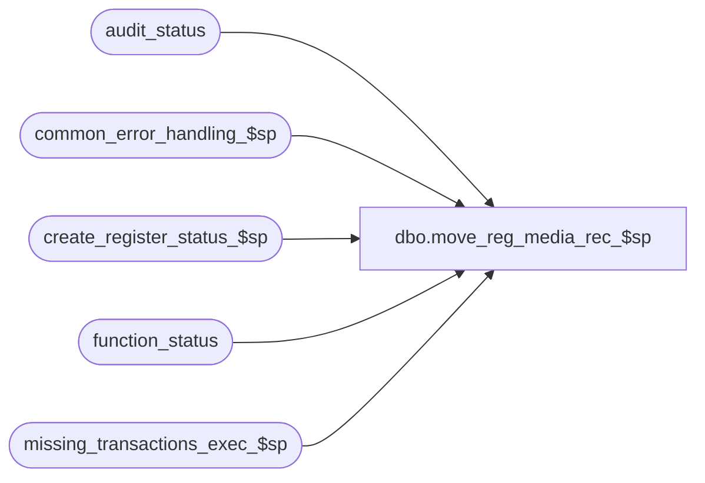

# dbo.move_reg_media_rec_$sp

**Database:** auditworks  
**Server:** bedrockdb01  

## Architecture Diagram



## Table Dependencies

| Referenced Table |
|---|
| audit_status |
| common_error_handling_$sp |
| create_register_status_$sp |
| function_status |
| missing_transactions_exec_$sp |

## Stored Procedure Code

```sql
create proc dbo.move_reg_media_rec_$sp 
@process_id                     binary(16),
@user_id                        int,
@from_store_no			int,
@from_register_no		smallint,
@from_sales_date		smalldatetime,
@date_reject_id			tinyint,
@from_transaction_no		int,
@to_store_no			int,
@to_register_no			smallint,
@to_sales_date			smalldatetime,
@to_transaction_no		int,
@errmsg				nvarchar(255) OUTPUT,
@transaction_series1		nchar(1),
@frontend_populated		tinyint,
@store_flag			tinyint, 
@function_no			tinyint,
@move_flag			tinyint, -- 0 = fix invalid register/ future dates, 1 = move
@all_server_reg                  tinyint -- 1 = batch includes the server 
AS

/*
PROC NAME: move_reg_media_rec_$sp
     DESC: Will calculate the media_reconciliation values and missing trxns for destination store/reg/date.
           If necessary, will recalculate media rec values and missing trxns for source store/reg/date.
           Called from move_register_$sp.

HISTORY:
Date     Name       Def# Desc
Jan04,11 Paul     105313 Use unicode datatypes
Jan15,07 Paul      81764 apply 76394 to SA5
Sep17,04 Maryam  DV-1146 Use user_id.
May27,04 Maryam  DV-1071 Receive the flags @all_server_reg, @process_id and clean up the code. 
Apr14,04 Sab	 DV-1068 remove old media rec logic
Sep05,06 Vicci     76394 removed missing and transaction range logic instead allowing
                         it to be assessed in missing_transactions_exec_$sp
Jun16,03 Paul    1-KX549 call old media rec only when new media rec is not activated
Dec12,02 Winnie  1-G4RBY add move_flag when calling missing_transactions_exec_$sp
Dec03,02 HenryW	 1-FFOXT To correctly call media rec when moving an invalid S/R/D to the same valid S/R/D.
Aug21,02 Daphna  1-BMAEV pass @all_reg_moved in call to missing_transaction_exec_$sp
Feb13,02 Paul    1-AZQ7X Avoid no data found when fixing invalid reg.
Jan25,02 Henry	 1-AH25K Ensure that the @balancing_method variable is reset before using.
                         	also RETROFIT TO:  02.50
Jan21,02 Daphna  1-ADTVD Do not execute missing_transactions_exec_$sp unless moving all series 
                         (@all_series = 1) OR one sequential series (@transaction_seq = 1)
                         	also RETROFIT TO:  02.50
Jan11,02 Winnie  1-A5OFH Move delete of media rec before the from/to dates are swapped, to calculate
                         correct over/short amount when fixing invalid store/register.
                         	also RETROFIT TO: 02.50
Dec28,01 Daphna  1-9PZOY Do not execute move_count procs twice when fixing an invalid register
                         When fixing invalid register set audit_status1 =100 for call to 
                         missing_transaction_exec_$sp to ensure missings are calculated for
                         newly created register
Dec26,01 Daphna     8628 Ensure non-sequential series do not have missing_transactions
                         after a move
                         R3 Error Handling
Oct10,01 Daphna	    8629 Process earlier date S/R/D before later date S/R/D regardless
                             of which is TO and which is FROM
                             Call missing_transactions_exec_$sp instead of determining next
                             day and calling missing_transactions_$sp
Sep27,01 Henry      8789 To correct problems when moving multiple transaction_series.
			     - recalc missing trxns when moving all remaining trxns for multiple transaction_series.
			     - recalc missing trxns when front-end populated, treat as if moving all series.
Sep19,01 Henry      8762 To recalculate media_rec for the FROM store/date that has multiple registers, 
			     when moving all trxns for only one of the registers.
Sep19,01 Henry      8763 Retrofit of 8762 for Build 2.46.25.
Sep17,01 Henry      8607 Do not look for @audit_status >= 100
Sep17,01 Henry      8737 retrofit version of 8607 for 2.50.02 (QA)
Sep17,01 Henry      8583 retrofit of 8607 to 2.46.25
Aug24,01 Paul       8569 Do not set audit_status = 100
Aug22,01 Winnie     8568 retrofit of 8560 to 2.46.25
Aug22,01 Winnie     8560 Update media rec with the correct S/A expected amount.
Jul16,01 Winnie     8284 To retrofit 7587 to 2.46.25 to support pre-coalition sites.
Jun22,01 Henry      8195 Call missing_transactions_$sp properly for next sales date.
Jun06,01 Henry      8056 Remove media_rec entries at store_level, let it get recalculated
				properly in the move_deposit_$sp proc. Also made code more efficient.
				Required for both PRE-COALITION and COALITION builds.
Apr27,01 David M    7589 Missing transactions by transaction Series version 1.0, remaining changes
				to use @transaction_series and transaction_range table.
Apr20,01 David M    7587 Missing transactions by transaction Series version 1.0, removed @last_transaction_no
				from call to create_register_status_$sp.
Mar20,01 David M    7379 correctly calculate media rec amounts for FROM date when balancing by store
				or cashier and moving one register to a different tran_date  
Mar16,00 Paul S     6104 avoid != null
Feb24,00 Daphna F   5904 pass function_no (9 or 109) to create_register_status_$sp
				and update_error_log_$sp and move_count procs
Jun25,99 Daphna F   4881 add condition @store_flag = 0 to bal_meth 2 and 4
				to avoid repetitive execution of move_count_store_$sp and move_count_cashier$_sp
May04,99 Shapoor M       Added the register_no to the calls to the move_count_reg_$sp
				and move_count_reg_cashier_$sp procs.
Dec14,98 Shapoor M	
Jul23,96 Sebastiano  n/a author version 1.06

*/

DECLARE
  @all_reg_moved                tinyint,  -- DEF 1-BMAEV
  @all_series			int, -- 0 = 1 series, 1 = all series
  @audit_status1		smallint,   -- def 8629
  @audit_status2		smallint,   -- def 8629
  @audit_status_to              smallint,
  @date1			smalldatetime,  -- def 8629
  @date2			smalldatetime,  -- def 8629 
  @date_reject1			tinyint,   -- def 8629
  @date_reject2			tinyint,   -- def 8629
  @errno			int,
  @fix_invalid_reg_flag		tinyint,
  @reg1				smallint,  -- def 8629
  @reg2				smallint,  -- def 8629
  @rows				int,
  @status_reject_reason		tinyint,
  @store1			int,  -- def 8629
  @store2			int,  -- def 8629
  @transaction_seq		tinyint,
-- error handling
  @operation_name     nvarchar(100),
  @process_name       nvarchar(100),  
  @object_name        nvarchar(255),
  @message_id         int,
  @log_error_flag     tinyint


SELECT @status_reject_reason = 0,
       @all_series = 1,
       @transaction_seq = 1,
       @process_name = 'move_reg_media_rec_$sp',
       @message_id = 201068,
       @log_error_flag = 0,  -- not called by smartload
       @fix_invalid_reg_flag = 0,
       @date_reject1 = 0,
       @all_reg_moved = 0  -- do not evaluate series seq by assigned reg 

/* Determine whether moving a range of transactions, in that case we are dealing with only 1 series */

IF @from_transaction_no > 0 AND ISNULL(@frontend_populated,0) = 0
   SELECT @all_series = 0

  -- DEF 8789. If front-end populated, don't know how many trxn series were moved. Thus, must
  -- treat as if moving all transaction series, to allow calculation of missing qty and transaction_range.

IF @frontend_populated > 0
  SELECT @all_series = 1

-- DEF 1-BMAEV : determine if moving all reg (for call to missing_transaction_exec_$sp)
SELECT @all_reg_moved = COUNT(*)
  FROM function_status
 WHERE function_no = @function_no
   AND process_id = @process_id
   AND register_no < 0  -- all reg

SELECT @errno = @@error
IF @errno != 0
BEGIN
  SELECT @errmsg = '@all_reg_moved',
         @operation_name = 'SELECT',
         @object_name = 'function_status'
  GOTO error
END

SELECT @audit_status1 = audit_status
  FROM audit_status
 WHERE store_no = @from_store_no
   AND register_no = @from_register_no
   AND sales_date = @from_sales_date
   AND date_reject_id = @date_reject_id

SELECT @errno = @@error
IF @errno != 0
BEGIN
  SELECT @errmsg = 'audit_status for from date',
         @operation_name = 'SELECT',
         @object_name = 'audit_status'
  GOTO error
END

IF @audit_status1 = 8 
  SELECT @audit_status1 = 100

-- if no audit_status exists for destination then create one 

SELECT @audit_status2 = audit_status,
       @audit_status_to = audit_status
  FROM audit_status
 WHERE store_no = @to_store_no
   AND register_no = @to_register_no
   AND sales_date = @to_sales_date
   AND date_reject_id = 0

SELECT @errno = @@error
IF @errno != 0
BEGIN
  SELECT @errmsg = 'audit_status for to date',
         @operation_name = 'SELECT',
         @object_name = 'audit_status'
  GOTO error
END

IF @audit_status2 IS NULL -- not found
BEGIN
  EXEC create_register_status_$sp @process_id, @user_id, @to_store_no, @to_register_no, @to_sales_date, 0,
   @date_reject1 OUTPUT, @status_reject_reason OUTPUT, @errmsg OUTPUT, @function_no,0,0,0,0,0

  SELECT @errno = @@error
  IF @errno != 0
  BEGIN
    SELECT @errmsg = 'for to date',
           @operation_name = 'EXECUTE', 
           @object_name = 'create_register_status_$sp'
    GOTO error
  END
  SELECT @audit_status2 = 100,
         @audit_status_to = 100
  
END -- IF @audit_status2 IS NULL.

IF (@from_store_no = @to_store_no AND @from_register_no = @to_register_no
     AND @from_sales_date = @to_sales_date AND @date_reject_id = 0) -- Def 1-FFOXT
  SELECT @fix_invalid_reg_flag = 1

/* def 8629 process S/R/D in chronological order (earlier date before later date)
    regardless of TO and FROM */

IF @from_sales_date <= @to_sales_date  -- FROM IS EARLIER DATE
  BEGIN
   SELECT @date1 	= @from_sales_date,
         @date2 	= @to_sales_date,
         @store1 	= @from_store_no,
         @store2 	= @to_store_no,
         @reg1 		= @from_register_no,
         @reg2 		= @to_register_no,
         @date_reject1 	= @date_reject_id,
         @date_reject2	= 0   -- prev @date_reject_id_to
  END
ELSE   -- TO IS EARLIER DATE
  BEGIN
   SELECT @date1 	= @to_sales_date,
         @date2 	= @from_sales_date,
         @store1 	= @to_store_no,
         @store2 	= @from_store_no,
         @reg1 		= @to_register_no,
         @reg2 		= @from_register_no,
         @date_reject1 	= 0 ,  -- prev @date_reject_id_to
         @date_reject2 	= @date_reject_id,
         @audit_status2 = @audit_status1,
         @audit_status1 = @audit_status_to
  END
   
-- CALCULATES MISSING TRXNS AND THE FIRST/LAST TRXNS FOR THE STORE1/REG1/DATE1
IF @store_flag = 0
BEGIN
  EXEC missing_transactions_exec_$sp @process_id, @user_id, @store1, @date1, 
    				      @reg1, @date_reject1, @errmsg OUTPUT, 
    				        @all_series,
                                        @function_no, @transaction_series1,
                                        null, --log_error_flag, 
                                        null, --edit_process_no, 
        @all_reg_moved
  SELECT @errno = @@error
  IF @errno <> 0
  BEGIN
    SELECT @errmsg = 'Failed to EXEC missing_transactions_exec_$sp'
    SELECT @object_name = 'missing_transactions_exec_$sp',
           @operation_name = 'EXECUTE'
    GOTO error
  END            
END

-- Avoid calculating missings twice when the FROM store/reg/date is the same as TO store/reg/date
IF @fix_invalid_reg_flag = 0    
BEGIN

  /* CALCULATES MISSING TRXNS AND THE FIRST/LAST TRXNS FOR STORE2/REG2/DATE2 */

  EXEC missing_transactions_exec_$sp @process_id, @user_id, @store2, @date2, 
    				      @reg2, @date_reject2, @errmsg OUTPUT, 
    				      @all_series, 
                                      @function_no, @transaction_series1,
                                      null, --log_error_flag, 
                                      null, --edit_process_no, 
                                      @all_reg_moved
  SELECT @errno = @@error
  IF @errno <> 0
  BEGIN
    SELECT @errmsg = 'Failed to EXEC missing_transactions_exec_$sp (S2/R2/D2)'
    SELECT @object_name = 'missing_transactions_exec_$sp',
           @operation_name = 'EXECUTE'
    GOTO error
  END   

END  -- @fix_invalid_register_flag = 0

RETURN

error:   /* Common error handler. */

EXEC common_error_handling_$sp @function_no, @errno, @errmsg, 0, @message_id,
          @process_name, @object_name, @operation_name, @log_error_flag, 1,
            0, null, 0, null, null, null, null, null, null, 0, @process_id, @user_id

RETURN
```

