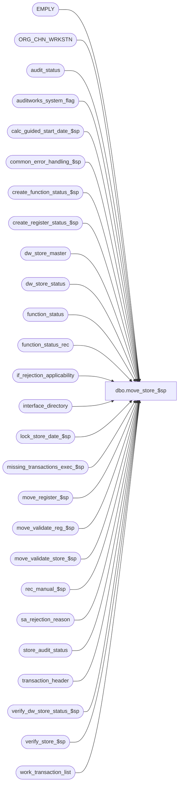

# dbo.move_store_$sp

**Database:** auditworks  
**Server:** bedrockdb01  

## Architecture Diagram



## Table Dependencies

| Referenced Table |
|---|
| EMPLY |
| ORG_CHN_WRKSTN |
| audit_status |
| auditworks_system_flag |
| calc_guided_start_date_$sp |
| common_error_handling_$sp |
| create_function_status_$sp |
| create_register_status_$sp |
| dw_store_master |
| dw_store_status |
| function_status |
| function_status_rec |
| if_rejection_applicability |
| interface_directory |
| lock_store_date_$sp |
| missing_transactions_exec_$sp |
| move_register_$sp |
| move_validate_reg_$sp |
| move_validate_store_$sp |
| rec_manual_$sp |
| sa_rejection_reason |
| store_audit_status |
| transaction_header |
| verify_dw_store_status_$sp |
| verify_store_$sp |
| work_transaction_list |

## Stored Procedure Code

```sql
CREATE proc  dbo.move_store_$sp 
@process_id             binary(16),
@user_id                int,
@from_store_no		int,
@from_register_no	smallint, -- -1 indicates all reg
@from_sales_date	smalldatetime,
@date_reject_id		tinyint,
@from_transaction_no	int, -- -1 indicates all tran. 
@to_store_no		int,
@to_register_no		smallint, -- used when moving one register, i.e. when using detail mode in the gui.
@to_sales_date		smalldatetime,
@to_transaction_no	int, -- always -1 as of SA5
@move_flag		tinyint,  /* 0 = fix invalid reg, 1 = normal move (do validations), 2= called by fix_future_date_$sp from Edit, 3=called by fix_future_date_$sp from revalidate */
@errmsg		        nvarchar(2000) OUTPUT,
@frontend_populated     tinyint = 0 /* front end selects individual transactions */,
@transaction_series     nchar(1) = ' '   /* frontend should not pass a NULL, always blank as of SA5, backend will fix it if no range passed. */,
@to_till_no		    smallint = null, -- used when requesting a change of till_no
@to_cashier_no		int = null, -- used when requesting a change of cashier_no
@function_no		tinyint = 9,     -- 9 (move), 109 (move to fix incorrect POS date-time)
@register_no_cursor	smallint = null,
@function_status	tinyint = 0,
@rec_process_id		numeric(12,0) = null,
@in_out_both_flag	tinyint = 3,
@all_server_reg         tinyint = 0

-- Removed following params:
-- @move_all_transactions - We can deduce if we need to move all trnx if @from_transaction_no = -1 and frontend_populated = 0
-- @fix_pos_time - If fixing pos time, then FE should pass function_no = 109. 

--Unicode version.

AS

/* 
PROC NAME: move_store_$sp
     DESC: To move transactions from one store/reg/date to another.
           This function will use a temporary work table to capture all
  	   transaction_id's affected by the move.
  	   Called by front-end MOVE function and fix_invalid_register_$sp.
  HISTORY:
Date     Name        Def# Desc
Sep28,16 Vicci  DAOM-1396 Reset transaction series to null when it is irrelevant (avoids confusion if user has to look a halted process).
Feb10,16 Vicci TFS-155283 Handle move_validate_reg_$sp returning an errmsg '201556-Duplicate transactions were omitted from move.' for frontend_populated = 1 case.
May05,15 Vicci TFS-119660 Release failed move to cleanup when it fails and was called by background process
Feb23,15 Paul   T-95034 added validation of scaleout cross-peripheral scenarios
Sep23,13 Paul    145958 call common_error_handling_$sp, use try .. catch
May13,13 Phu     143826 Override user selection of changing POS entry_date_time to yes if source status is invalid date and has SA rejects.
Aug22,12 Vicci   137795 Remove SET NOCOUNT OFF from after the call to the common error handling to avoid @@error being reset before the calling proc can see it.
Oct24,11 Paul    130413 If @frontend_populated = 1, then ensure that @from_transaction_no = 0 (not moving all trans)
Mar11,09 Vicci   106158 Suport @move_flag = 3 (date revalidation).
Feb20,09 Vicci   105395 Uplift 1-3YR5DH
Feb20,09 Vicci 1-3YR5DH use move_source_date to evaluate entry_date_time adjustment
Jul31,08 Paul     87777 uplift 81588, code reviewed
Jan12,07 Paul     81764 apply 81535, 76394 to SA5
Nov03,06 Paul     79509 raise error 201575 if function_status row already exists
Mar07,06 Paul   DV-1328 Apply 1-36QREW, 66476 to SA5. 67337 is not applicable due to register changes in SA5.
Sep13,05 Paul   DV-1312 apply 62852 to SA5, updated comments on input parameters
Jun21,05 Paul     54934 apply 52604 to SA5
May06,05 Sab    DV-1254 Call new procedure verify_dw_store_status_$sp
Apr20,05 Paul   DV-1218 treat -99 in @from_till_no and @to_cashier_no input param as null to accomodate frontend limitations 
Jan10,05 Paul   DV-1191 added nocount, nolock hints
Nov17,04 Maryam DV-1167 Check for EMPLY active flag.
Sep17,04 Maryam DV-1146 Use user_id.
Jul29,04 David  DV-1071 Add rollforward logic, remove unnecessary flags, change employee table to EMPLY
         Maryam         Receive @process_id, modify the call to lock_store_date_$sp as it no longer outputs the user name
Apr15,04 Sab    DV-1068 Remove code for old media rec
Jan18,07 Daphna   81588 Do validations before locking TO Store-Date
Jan09,07 Daphna   81535 determine whether EDT will be changed, and pass difference to move_validate procs
Sep05,06 Vicci    76394 removed missing and transaction range logic instead allowing
      it to be assessed in missing_transactions_exec_$sp
Mar10,06 Paul  1-36QREW When fixing invalid dates, ensure that destination store-date is created. Corrected error handling.
Feb10,06 Daphna   67337 treat reg with assign-group = NULL  as if assigned to self
Jan24,06 Vicci    66476 Treat inactive employees as invalid.
Nov03,05 Paul     62852 pass @date_reject_id when calling verify_store_$sp for from store-date
Apr22,05 ShuZ     52604 Allow reassign cashier or till in same store-reg-date
May12,04 Daphna   28965 Allow move for trickling stores when move_flag = 2 (called by
                        fix_future_date_$sp)
Oct31,03 Paul     17506 allow changing cashier_no without validation if no interfaces care about cashier_no.
Aug07,03 Paul     11627 corrected store balance logic for new media rec
Jun20,03 Paul   1-KX549 call new media rec, receive @to_till_no and @to_cashier_no
Jan02,03 Sab	1-FC32T To recalculate logical trading dates ONLY when fixing invalid registers.
SEP21,02 Daphna 1-BMAEV evaluate any seq by assigned_reg after all reg moved
Jun03,02 Paul   1-CD0IX change message to use 201616, remove calls to common error proc
Jan04,02 Winnie 1-9JOJ5	Does not call media_reconciliation, need to select @balancing_method 
			from store_salesaudit outside the cursor. also retrofitted to 2.46.25
Sep06,01 Henry     8607 zero out media rec when moving entire store
Sep17,01 Henry     8583 retrofit of 8607 to 2.46.25
Jun19,01 Winnie    8154 Remove first/last_transaction_no column from audit_status
Jul16,01 Winnie    8284 To retrofit 7587 to 2.46.25 to support pre-coalition sites.
Apr20,01 David M   7587 Missing transactions by transaction Series version 1.0, removing
                               code for last_transaction_no.
Apr04,01 Phu       7501 Use system function to retrieve user name
Jan11,01 Shapoor   7209 Avoid deleting entries from media_reconciliation when the from 
			       SRD has a date_reject_id > 0.
Apr13,00 Daphna    6100 Ensure that amounts in store_audit_status FROM are cleared out 
			   when moving whole store Ensure that verify_store_status FROM 
			   called when moving whole store.
Apr04,00 Daphna    6090 Pass @date_reject_id in call to verify_store for FROM.
Mar01,00 Phu       5900 Change @@fetch_status > 0 to @@fetch_status <> 0 for MS SQL compatibility
Feb11,00 Daphna F  5904 Allow change of entry_date_time when moving txns to fix incorrect 
			       POS date-time.
Sep22,99 Daphna F  5299 Call media_reconciliation_$sp once for all reg for balancing by 
			 cashier (2),store(4).  Remove call to verify_store_$sp, performed 
			 by media_rec Call media_rec per reg inside cursor for balancing 
			 by reg (1), reg-cashier(3) All calls to media_reconciliation pass 
			 function_no (9). Unlock TO and FROM store-date.
Jul06,99 Louise M  4526 New code added to disallow move during trickle.
Jun25,99 Daphna F  4881 Add call to move_count_cashier_$sp for bal_meth = 2 and 
			  move_count_store_$sp for bal_meth = 4 for EOF on reg_crsr fetch 
			  to avoid repetitive execution.    
Apr26,99 Daphna F  4475 Ensure audit_status created for store/reg/date before calling
			  move_register_$sp.
Apr23,99 Daphna F  4475 Remove delete from function_status upon failure of 
			  move_validate_register_$sp to allow standard error handling.				
Apr15,99 Daphna F  4455 Add order by to select into temp table used in declaring
			  register cursor.
Jan21,99  Matthew C	 	
Nov05,98  Paul S
Jun18,96  Sebastiano V	n/a	Author

*/
	
DECLARE
 @cursor_open			tinyint,
 @dest_instance_id		smallint,
 @dest_store_status		tinyint,
 @edit_timestamp		float,
 @error_code			int,
 @errmsg2			nvarchar(2000),
 @errmsg1			nvarchar(2000), 
 @errmsg4			nvarchar(2000), -- used for trapping messages from sub procs
 @errno				int,
 @from_trickle_in_progress	tinyint,
 @from_lock_needed		tinyint,
 @instance_id			int,
 @to_lock_needed		tinyint,
 @register_no			smallint,
 @register_found		tinyint,
 @scaleout_flag			int,
 @status_reject_reason		tinyint,
 @store_flag			tinyint,
 @to_date_reject_id		tinyint,
 @to_trickle_in_progress	tinyint,
 @message_id		        int,	
 @object_name		        nvarchar(255),	
 @operation_name	        nvarchar(100),
 @process_name	         	nvarchar(100),
 @rows                    	int, 	
 @fix_invalid_reg_flag		tinyint,
 @batch_server_count            int,
 @server_count                  int,
 @recovery_flag			tinyint,
 @temp_exists			tinyint,
 @abort_flag			tinyint, -- 1 = abort smartload, 2 = bypass rollback, 3 = bypass raise error
 @called_by_background_process  tinyint

SET NOCOUNT ON;
 
SELECT 	@cursor_open = 0,
	@store_flag = 0,
	@from_trickle_in_progress = 0,
	@to_trickle_in_progress = 0,
        @process_name = 'move_store_$sp',
        @message_id = 201068,
        @fix_invalid_reg_flag = 0, 
        @recovery_flag = 0,
        @from_lock_needed = 1,
        @to_lock_needed = 1,
        @abort_flag = 0,
        @operation_name = 'SELECT',
        @object_name = 'EMPLY',
        @errmsg = 'Failed to select',
        @called_by_background_process = 0;

BEGIN TRY

IF @frontend_populated > 0 OR @from_transaction_no < 0 OR @to_transaction_no < 0
  SELECT @transaction_series = NULL;  --series only applies if moving a range of transactions

IF @function_status > 0
  SELECT @recovery_flag = 1;

IF @from_transaction_no = -2
  SELECT @from_transaction_no = -1,
	 @fix_invalid_reg_flag = 1;
ELSE
  IF @frontend_populated = 1 /* compensate for gui bug */
    SELECT @from_transaction_no = 0;

-- Handle -99 which front end C# passes instead of null
IF @to_cashier_no = -99
  SELECT @to_cashier_no = null;

IF @to_till_no = -99
  SELECT @to_till_no = null;

IF @to_cashier_no IS NOT NULL -- validate requested change of cashier_no
  BEGIN
   SELECT @rows = 0;
   
   IF EXISTS( SELECT 1
                FROM EMPLY
               WHERE EMPLY_NUM = @to_cashier_no
                 AND ACTV = 1)
	  SELECT @rows = 1;

   IF @rows = 0 -- cashier does not exist
     BEGIN
	  SELECT @object_name = 'if_rejection_applicability'
	IF NOT EXISTS( SELECT 1
                   FROM if_rejection_applicability ir, interface_directory id
                  WHERE if_reject_reason = 80
                    AND ir.interface_id = id.interface_id
                    AND id.update_timing >= 1)
	  SELECT @rows = 1; -- don't need to validate if no interfaces care about cashier
     END;

   IF @rows = 0 -- cashier does not exist and some interfaces care about cashier
     BEGIN
      SELECT @errno = 201642,
	     @errmsg = 'Cashier number is invalid. Cannot save changes.',
	     @message_id = 201642;
      GOTO business_error;
     END;
  END; -- @to_cashier_no IS NOT NULL -- validate requested change of cashier_no

IF @to_sales_date IS NULL AND @fix_invalid_reg_flag = 0 AND @frontend_populated = 0
  BEGIN
      SELECT @errno = 201703,
	     @errmsg = 'Invalid date range. From date must be less than or equal to the To date.',
	     @message_id = 201703;
      GOTO business_error;
  END;

     SELECT @errmsg = 'Failed to select scaleout_flag from auditworks_system_flag',
	    @object_name = 'auditworks_system_flag',
	    @operation_name = 'SELECT';
SELECT @scaleout_flag = CONVERT(int,flag_numeric_value)
  FROM auditworks_system_flag
 WHERE flag_name = 'scaleout_flag';

SELECT @rows = @@rowcount;
IF @rows = 0
      GOTO business_error;

IF @date_reject_id != 0
BEGIN
  SELECT @in_out_both_flag = 1, @rows = 0;

  -- user chooses not to change POS entry date time in UI, but the proc attempts to change it if source status is invalid date and has SA rejects.
  IF @function_no = 9
  BEGIN
    IF @from_register_no >= 0
    BEGIN
        SELECT @object_name = 'transaction_header';
      IF EXISTS( SELECT 1
                 FROM transaction_header h WITH (NOLOCK)
                 WHERE transaction_date = @from_sales_date
                 AND store_no = @from_store_no
                 AND register_no = @from_register_no
     AND date_reject_id > 0
                 AND sa_rejection_flag > 0
                 AND EXISTS (SELECT 1 FROM sa_rejection_reason s WHERE s.transaction_id = h.transaction_id AND s.violated_sareject_rule = 3)) -- 3:future date
      BEGIN
        SELECT @rows = 1;
      END
    END -- IF @from_register_no >= 0
    ELSE
    BEGIN
      IF EXISTS( SELECT 1
                 FROM transaction_header h WITH (NOLOCK)
         WHERE transaction_date = @from_sales_date
                 AND store_no = @from_store_no
                 AND date_reject_id > 0
                 AND sa_rejection_flag > 0
                 AND EXISTS (SELECT 1 FROM sa_rejection_reason s WHERE s.transaction_id = h.transaction_id AND s.violated_sareject_rule = 3)) -- 3:future date
      BEGIN
        SELECT @rows = 1;
      END
    END -- else of IF @from_register_no >= 0

    IF @rows = 1
      SELECT @function_no = 109; -- change POS entry date time

  END; -- IF @function_no = 9
END; -- IF @date_reject_id != 0

IF @in_out_both_flag = 3
BEGIN
   SELECT @rows = 0, @object_name = 'transaction_header';
   IF @from_register_no >= 0
   BEGIN
      IF EXISTS( SELECT 1
                 FROM transaction_header WITH (NOLOCK)
                 WHERE transaction_date = @from_sales_date
                 AND store_no = @from_store_no
                 AND register_no = @from_register_no
                 AND date_reject_id = 0
                 AND sa_rejection_flag = 0)
      BEGIN
        SELECT @rows = 1;
      END;
   END -- IF @from_register_no >= 0
   ELSE
   BEGIN
      IF EXISTS( SELECT 1
                 FROM transaction_header WITH (NOLOCK)
                 WHERE transaction_date = @from_sales_date
                 AND store_no = @from_store_no
                 AND date_reject_id = 0
                 AND sa_rejection_flag = 0)
      BEGIN
        SELECT @rows = 1;
      END;
   END; -- else of IF @from_register_no >= 0

   IF @rows = 0
     SELECT @in_out_both_flag = 1; -- no reversals required
END;

IF @fix_invalid_reg_flag = 0 AND @function_status = 0
BEGIN
    SELECT @object_name = 'function_status';
  IF EXISTS( SELECT 1
           FROM function_status
           WHERE process_id = @process_id -- work tables are unique by process_id only
           AND (function_no = @function_no OR function_no = 182))  --lock-store-date
  BEGIN
   SELECT @errmsg = 'Previous function did not complete normally. Use cleanup button or log in again.',
	     @message_id = 201575, @errno = 201575;
      GOTO business_error;
  END
  
  IF @move_flag NOT IN (2, 3)  -- i.e. not called by fix_future_date_$sp, since it did this validation already
  BEGIN  -- validate trickle status
         /* Cannot move FROM or TO a store that is trickling in */
        SELECT @errmsg = 'Failed to select from store_audit_status (from store).',
               @object_name = 'store_audit_status';
    SELECT @from_trickle_in_progress = ISNULL(trickle_in_progress_flag,0)
      FROM store_audit_status
     WHERE store_no = @from_store_no
       AND sales_date = @from_sales_date
       AND date_reject_id = @date_reject_id;  

       SELECT @errmsg = 'Failed to select from store_audit_status (to store).'
    SELECT @to_trickle_in_progress = ISNULL(trickle_in_progress_flag,0)
     FROM store_audit_status
     WHERE store_no = @to_store_no
       AND sales_date = @to_sales_date
       AND date_reject_id = 0; 

    IF @from_trickle_in_progress = 1 OR @to_trickle_in_progress = 1
    BEGIN
      SELECT @errmsg = 'Cannot move FROM or TO a store that is trickling in. Must wait for last phase of edit to run before proceeding.',
             @errno = 201616,
             @message_id = 201616;
      GOTO business_error;
    END; 
  END;  --IF @move_flag not in (2, 3) i.e. not called by fix_future_date_$sp, since it did this validation already


  /* -- VALIDATION SECTION -- */
  IF @move_flag = 1 AND @function_status = 0
  BEGIN
   IF (@from_register_no = -1)
     BEGIN
        SELECT @errmsg = 'Failed to execute stored procedure move_validate_store_$sp',
               @object_name = 'move_validate_store_$sp',
               @operation_name = 'EXECUTE';
      EXEC move_validate_store_$sp @process_id, @user_id, @from_store_no, @from_sales_date,
  		@date_reject_id, @to_store_no, @to_sales_date,
		@to_cashier_no, @to_till_no, @errmsg4 OUTPUT, @function_no;
     END;
    ELSE
     BEGIN
        SELECT @errmsg = 'Failed to execute stored procedure move_validate_reg_$sp',
               @object_name = 'move_validate_reg_$sp',
               @operation_name = 'EXECUTE';
      --Note @errmsg starting with 201556 can be returned by move_validate_reg_$sp without raising error, so see handling at bottom of move_store_$sp 
      EXEC move_validate_reg_$sp @process_id, @user_id, @from_store_no, @from_register_no,
	@from_sales_date,@date_reject_id, @from_transaction_no, @to_store_no,
	@to_register_no, @to_sales_date, @to_transaction_no,
	@to_cashier_no, @to_till_no, @errmsg1 OUTPUT,
	@frontend_populated, @transaction_series, @function_no;	
     END;
  END; -- IF @move_flag = 1 AND @function_status = 0

    /* TFS-95034 */
  IF @scaleout_flag > 0 AND @move_flag = 1 AND @function_status = 0
  BEGIN

  -- Validation logic for Scaleout environments
  -- Prevents moving in certain scenarios in order to avoid causing data integrity issues

         SELECT @errmsg = 'Failed to select instance_id from auditworks_system_flag',
	     @object_name = 'auditworks_system_flag',
	     @operation_name = 'SELECT';
    SELECT @instance_id = CONVERT(int,flag_numeric_value)
      FROM auditworks_system_flag
     WHERE flag_name = 'instance_id';

    SELECT @rows = @@rowcount;
    IF @rows = 0
      GOTO business_error;

    -- determine whether the destination store is owned yet (will create a new message)
         SELECT @errmsg = 'Failed to select dest_instance_id from dw_store_master',
	     @object_name = 'dw_store_master',
	     @operation_name = 'SELECT',
	     @dest_instance_id = NULL;
    SELECT @dest_instance_id = instance_id
      FROM dw_store_master
     WHERE store_no = @to_store_no;

    IF @dest_instance_id IS NULL -- row not found in dw_store_master
    BEGIN
      SELECT @errmsg = 'Move Denied: Cannot move data to destination store because it is not yet owned by a peripheral.',
             @errno = 201691,
             @message_id = 201691;
      GOTO business_error;
    END;

    /* The following logic currently disallows moving a store-date to a different peripheral (mimics previous frontend behaviour) */

    IF @to_trickle_in_progress IS NULL -- row not found in local store_audit_status
          OR @dest_instance_id <> @instance_id -- different peripheral
    BEGIN
      SELECT @errmsg = 'Move Denied: Cannot move data from one server to another.',
             @errno = 201691,
             @message_id = 201691;
      GOTO business_error;
    END;

    -- determine whether the destination store-date has been closed
    SELECT @dest_store_status = store_status
      FROM dw_store_status
     WHERE store_no = @to_store_no
       AND sales_date = @to_sales_date;

    IF @dest_store_status > 1 -- destination store-date was already processed by dayend
    BEGIN
      SELECT @errmsg = 'Move Denied: Destination Store/Date has status accepted/completed.',
             @errno = 201557,
             @message_id = 201557;
      GOTO business_error;
    END;


  /* TODO in SA 5.1 SP5 (scaleout move) : 
  
  1) Add logic to check status of source and destination store-dates 
  
  e.g. if all transactions in source store are sa rejections, then allow the move.
     possibly don't need existence check for destination registers in ORG_CHN_WRKSTN ?
  

  2) For the scaleout move, the existing edit logic will create rows when necessary in store_audit_status, 
      audit_status, dw_audit_status, dw_store_master on the destination instance/db. 
  
  3) Create new messages and corresponding resource strings for any new messages that will be raised by this proc.
     also populate new rows into message_resource_xref for any such messages.
  
  
  */


  END; -- If scaleout_flag > 0 AND move_flag = 1 AND function_status = 0


    SELECT @errmsg = 'Failed to insert function_status initial value',
	   @object_name = 'function_status',
	   @operation_name = 'INSERT';

  INSERT function_status (
	user_id,
	process_id,
	function_no,
	status,
	entry_date,
	store_no,
	register_no,
	transaction_date,
	date_reject_id,
	from_transaction_no,
	to_store_no,
	to_register_no,
	to_transaction_date,
	to_transaction_no,
	move_flag,
	transaction_series,
	frontend_populated,
	to_till_no,
	to_cashier_no,
	glc_type,
	reference_type)
  SELECT @user_id,
	@process_id,
	@function_no,
	0,
	getdate(),
	@from_store_no,
	@from_register_no,
	@from_sales_date,
	@date_reject_id,
	@from_transaction_no,
	@to_store_no,
	@to_register_no,
	@to_sales_date,
	@to_transaction_no,
	@move_flag,
	@transaction_series,
	@frontend_populated,
	@to_till_no,
	@to_cashier_no,
	@in_out_both_flag,
	0; -- all_server_reg 


  IF @move_flag = 2  --fix future dates called by Edit
  BEGIN
    SELECT @errmsg = 'Failed to select lock_needed from store_audit_status',
	   @object_name = 'store_audit_status',
	   @operation_name = 'SELECT';
    IF EXISTS(SELECT 1
	 	FROM store_audit_status
	       WHERE sales_date = @from_sales_date
		 AND store_no = @from_store_no
		 AND date_reject_id = @date_reject_id
		 AND update_in_progress = 1)
      SELECT @from_lock_needed = 0; -- already locked by edit
    IF EXISTS(SELECT 1
		FROM store_audit_status
	       WHERE sales_date = @from_sales_date  --fix future dates store/date doesn't change (revalidation)

		 AND store_no = @from_store_no
		 AND date_reject_id = 0
		 AND update_in_progress = 1)
      SELECT @to_lock_needed = 0; -- already locked by edit
  END; --IF @move_flag = 2

  IF @from_lock_needed = 1
  BEGIN
      SELECT @errmsg = 'Failed to lock store/date for FROM store_no',
	     @object_name = 'lock_store_date_$sp',
	     @operation_name = 'EXECUTE'
    /* Lock store_audit_status (from_date) */
    EXEC lock_store_date_$sp @process_id, @user_id, @from_store_no, @from_sales_date, @date_reject_id,
		             @function_no, @error_code OUTPUT;
    IF @error_code != 0
    BEGIN
      SELECT @errno = @error_code, @message_id = @error_code,
             @errmsg = 'Failed to lock store/date for FROM store_no';
      GOTO business_error;
    END;
  END; -- If @from_lock_needed = 1
  
END; -- IF @fix_invalid_reg_flag = 0 AND @function_status = 0

IF @move_flag <> 0 AND @function_status = 0 AND @to_lock_needed = 1
BEGIN
  IF (@to_store_no != @from_store_no OR @to_sales_date != @from_sales_date
      OR @date_reject_id != 0)
  BEGIN
	  SELECT @errmsg = 'Failed to execute stored procedure create_function_status_$sp',
	         @object_name = 'create_function_status_$sp',
		@operation_name = 'EXECUTE';
	EXEC create_function_status_$sp @process_id, @user_id, 182, 0, @errmsg OUTPUT, @to_store_no, @to_sales_date, 0, 0;
  	
	--Note:  lock_store_date_$sp creates the store/date if it is missing in store_audit_status
	  SELECT @errmsg = 'Failed to lock store/date for TO store_no',
	         @object_name = 'lock_store_date_$sp';				
	EXEC lock_store_date_$sp @process_id, @user_id, @to_store_no, @to_sales_date, 0, @function_no, @error_code OUTPUT;

	IF @error_code != 0
	BEGIN
	 SELECT @errno = @error_code, @message_id = @error_code;
	  GOTO business_error;
	END;
  END;
END; -- IF @move_flag <> 0 AND @function_status = 0

IF @function_status = 0
BEGIN
    SELECT @errmsg = 'Failed to insert function_status_rec.',
           @object_name = 'function_status_rec',
          @operation_name = 'INSERT';
  BEGIN TRAN
  INSERT function_status_rec(
	         process_id,
	         function_no,
	         rec_status,   
	         edit_process_no)
   VALUES ( @process_id,
	         @function_no,
	         0,
	         null);   
  SELECT @rec_process_id = @@identity;

    SELECT @errmsg = 'Failed to set rec_process_id in function_status',
           @object_name = 'function_status',
          @operation_name = 'UPDATE';
  UPDATE function_status
     SET rec_process_id = @rec_process_id
   WHERE user_id = @user_id
     AND process_id = @process_id
     AND function_no = @function_no;
        
  COMMIT TRAN;
END; -- IF @function_status = 0

IF @move_flag IN (2, 3)
  SELECT @move_flag = 1, @called_by_background_process = 1; -- emulate a move from this point (move_flag value of 2 already logged to function_status)

IF (@from_register_no = -1)   -- all registers 
BEGIN
  SELECT @store_flag = 1,
         @errmsg = 'Failed to create #temp_register',
         @object_name = '#temp_register',
         @operation_name = 'CREATE';
  CREATE TABLE #temp_register (store_no            int           not null,
                               register_no         smallint      not null,
                               server_flag         tinyint       not null);
  SELECT @temp_exists = 1,
         @errmsg = 'Failed to insert #temp_register',
         @object_name = '#temp_register',
         @operation_name = 'INSERT';

  INSERT #temp_register(
         store_no,
         register_no,
         server_flag)
  SELECT store_no,
         register_no,
         0
    FROM audit_status
   WHERE store_no = @from_store_no
     AND sales_date = @from_sales_date
     AND date_reject_id = @date_reject_id
     AND audit_status <= 299
     AND (register_no >= @register_no_cursor OR @register_no_cursor IS NULL);

    SELECT @errmsg = 'Failed to set the server_flag',
           @operation_name = 'UPDATE';
  UPDATE #temp_register
     SET server_flag = 1
    FROM #temp_register t, ORG_CHN_WRKSTN o WITH (NOLOCK)
   WHERE t.store_no = o.ORG_CHN_NUM
   AND t.register_no = o.WRKSTN_NUM
     AND ISNULL(PRNT_WRKSTN_ID, WRKSTN_ID) = WRKSTN_ID;
        
   SELECT @batch_server_count = @@rowcount; --how many servers are in the batch

     SELECT @errmsg = 'Unable to find the number of servers that are associated with the registers in the batch.',
           @operation_name = 'SELECT';

  -- Find how many servers are associated with the registers in the batch    
  SELECT @server_count = COUNT (DISTINCT ISNULL(wrk.PRNT_WRKSTN_ID, wrk.WRKSTN_ID))
    FROM #temp_register r, ORG_CHN_WRKSTN wrk WITH (NOLOCK)
   WHERE r.store_no = wrk.ORG_CHN_NUM 
     AND r.register_no = wrk.WRKSTN_NUM;
    
  IF @server_count = @batch_server_count
    SELECT @all_server_reg = 1;
  ELSE 
    SELECT @all_server_reg = 0;    

    SELECT @errmsg = 'Failed to open cursor reg_crsr',
           @object_name = 'reg_crsr',
           @operation_name = 'OPEN';  
  DECLARE reg_crsr CURSOR FAST_FORWARD
  FOR
    SELECT register_no
      FROM #temp_register WITH (NOLOCK)
     ORDER BY server_flag, register_no; -- process the child before the parent
     
  OPEN reg_crsr;

  SELECT @cursor_open = 1;

  WHILE 3=3
  BEGIN
    FETCH reg_crsr 
     INTO @register_no;
        		
    IF @@fetch_status <> 0  /* end of list or error on fetch */
      BREAK;

    IF @function_status = 0
    BEGIN
        SELECT @errmsg = 'Failed to update function_status reg_no_crsr',
               @object_name = 'function_status',
               @operation_name = 'UPDATE'; 
      UPDATE function_status
         SET register_no_cursor = @register_no,
             status = 1, 
           reference_type = @all_server_reg
       WHERE process_id = @process_id
       AND user_id = @user_id
         AND function_no = @function_no;
    END; -- IF @function_status = 0

       SELECT @errmsg = 'Failed to select COUNT(register_no) from audit_status',
               @object_name = 'audit_status',
               @operation_name = 'SELECT';
    SELECT @register_found = COUNT(register_no) 
      FROM audit_status WITH (NOLOCK)
     WHERE store_no = @to_store_no
       AND register_no = @register_no
       AND sales_date = @to_sales_date
       AND date_reject_id = 0;
     
    IF @register_found = 0
    BEGIN
       SELECT @errmsg = 'Failed to execute create_register_status_$sp TO store',
              @object_name = 'create_register_status_$sp',
              @operation_name = 'EXECUTE';

      EXEC create_register_status_$sp @process_id, @user_id, @to_store_no, @register_no,
            @to_sales_date, 0, 0, 0, @errmsg4 OUTPUT, @function_no, 100, 0, 0, 0, 0;  
    END;

       SELECT @errmsg = 'Failed to execute stored procedure move_register_$sp',
              @object_name = 'move_register_$sp',
              @operation_name = 'EXECUTE'; 
    EXEC move_register_$sp 
    	@process_id             = @process_id,
	@user_id       		= @user_id,		 
	@from_store_no 		= @from_store_no,
	@from_register_no 	= @register_no,
	@from_sales_date		= @from_sales_date,
	@date_reject_id		= @date_reject_id,
	@from_transaction_no	= -1,
	@to_store_no		= @to_store_no,
	@to_register_no		= @register_no,
	@to_sales_date		= @to_sales_date,
	@to_transaction_no	= @to_transaction_no,
	@move_flag		= @move_flag, 
	@store_flag		= @store_flag, 
	@errmsg 		= @errmsg4 OUTPUT,
	@frontend_populated	= @frontend_populated,
	@transaction_series	= @transaction_series,
	@to_till_no		= @to_till_no, 
	@to_cashier_no		= @to_cashier_no, 
	@function_no		= @function_no, 
	@function_status		= @function_status,
	@rec_process_id		= @rec_process_id, 
	@all_server_reg		= @all_server_reg;

       SELECT @errmsg = 'Failed to EXEC missing_transactions_exec_$sp',
              @object_name = 'missing_transactions_exec_$sp';

    EXEC missing_transactions_exec_$sp @process_id, @user_id, @from_store_no, @from_sales_date, 
    				      NULL, --register_no
    				      @date_reject_id, @errmsg OUTPUT, 
    				      1, --all_series
                                      @function_no, NULL, --transaction_series
                                      null, --log_error_flag, 
                                      null, --edit_process_no, 
                                      1; --all_reg_moved
                      
       SELECT @errmsg = 'Failed to EXEC missing_transactions_exec_$sp (2)',
              @object_name = 'missing_transactions_exec_$sp';
    EXEC missing_transactions_exec_$sp @process_id, @user_id, @to_store_no, @to_sales_date, 
    				      NULL, --register_no
    				      @date_reject_id, @errmsg OUTPUT, 
    				      1, --all_series
                                      @function_no, NULL, --transaction_series
                                      null, --log_error_flag, 
                                      null, --edit_process_no, 
                                      1; --all_reg_moved
     SELECT @function_status = 0;

  END; /* WHILE 3=3 */

  CLOSE reg_crsr;
  DEALLOCATE reg_crsr;

  SELECT @cursor_open = 0,
      @errmsg = 'Failed to drop #temp_register',
      @object_name = '#temp_register',
      @operation_name = 'DROP';
  DROP TABLE #temp_register;
  SELECT @temp_exists = 0;


END;  -- move all registers

ELSE
BEGIN /* @register_no != -1: one register only */
        SELECT @errmsg = 'Failed to execute stored procedure move_register_$sp',
               @object_name = 'move_register_$sp',
               @operation_name = 'EXECUTE';
    EXEC move_register_$sp 
    	@process_id             = @process_id,
	@user_id                = @user_id,		 
	@from_store_no 		= @from_store_no,
	@from_register_no 	= @from_register_no,
	@from_sales_date	= @from_sales_date,
	@date_reject_id		= @date_reject_id,
	@from_transaction_no	= @from_transaction_no,
	@to_store_no		= @to_store_no,
	@to_register_no		= @to_register_no,
	@to_sales_date		= @to_sales_date,
	@to_transaction_no	= @to_transaction_no,
	@move_flag		= @move_flag, 
	@store_flag		= @store_flag, 
	@errmsg 		= @errmsg4 OUTPUT,
	@frontend_populated	= @frontend_populated,
	@transaction_series	= @transaction_series,
	@to_till_no		= @to_till_no, 
	@to_cashier_no		= @to_cashier_no, 
	@function_no		= @function_no, 
	@function_status	= @function_status,
	@rec_process_id		= @rec_process_id, 
	@all_server_reg		= @all_server_reg;

   /* move_register_$sp calls media_rec when moving one reg only */     
   
END;  /* @register_no != -1 */

/* call new media rec only once for the entire move.
   ignore trans that are still s/a rejects */

   SELECT @errmsg = 'Failed to delete rejects from work_transaction_list',
	 @object_name = 'work_transaction_list',
	 @operation_name = 'DELETE';
DELETE work_transaction_list
  FROM work_transaction_list wt, sa_rejection_reason sr
 WHERE wt.rec_process_id = @rec_process_id
 AND wt.transaction_id = sr.transaction_id;

   SELECT @operation_name = 'SELECT';
IF NOT EXISTS( SELECT 1
                 FROM work_transaction_list wt WITH (NOLOCK), transaction_header th WITH (NOLOCK)
                WHERE wt.rec_process_id = @rec_process_id
    AND wt.transaction_id = th.transaction_id
                  AND th.sa_rejection_flag = 0)
   SELECT @in_out_both_flag = 0; -- all trans are still s/a rejects

    SELECT @errmsg = 'Failed to execute rec_manual_$sp',
           @object_name = 'rec_manual_$sp',
	  @operation_name = 'EXECUTE';
EXEC rec_manual_$sp @function_no, @process_id, @rec_process_id, @in_out_both_flag, @errmsg4 OUTPUT, @recovery_flag,
   @user_id, 0;

    SELECT @errmsg = 'for from store date',
	  @object_name = 'verify_store_$sp';
EXEC verify_store_$sp @process_id, @user_id, @from_store_no, @from_sales_date, @date_reject_id, @errmsg4 OUTPUT;

    SELECT @errmsg = 'for TO store date',
	  @object_name = 'verify_store_$sp';
EXEC verify_store_$sp @process_id, @user_id,@to_store_no, @to_sales_date, 0, @errmsg4 OUTPUT;

    SELECT @errmsg = 'for from store date verify_dw_store_status_$sp',
	  @object_name = 'verify_dw_store_status_$sp';
EXEC verify_dw_store_status_$sp @process_id, @user_id, @from_store_no, @from_sales_date, @errmsg4 OUTPUT;

    SELECT @errmsg = 'for to store date verify_dw_store_status_$sp',
	  @object_name = 'verify_dw_store_status_$sp';
EXEC verify_dw_store_status_$sp @process_id, @user_id, @to_store_no, @to_sales_date, @errmsg4 OUTPUT;

IF @fix_invalid_reg_flag = 0
BEGIN
 /* unlock TO and FROM store-date */
     SELECT @errmsg = 'Failed to unlock FROM store',
	   @object_name = 'store_audit_status',
	   @operation_name = 'UPDATE';
  UPDATE store_audit_status
     SET update_in_progress = 0
   WHERE store_no = @from_store_no
     AND sales_date = @from_sales_date
     AND date_reject_id = @date_reject_id
     AND update_in_progress != 1; -- don't unlock when fixing invalid date that edit still has locked
	   
     SELECT @errmsg = 'Failed to unlock TO store';
  UPDATE store_audit_status
     SET update_in_progress = 0
   WHERE store_no = @to_store_no
     AND sales_date = @to_sales_date
     AND date_reject_id = 0
     AND update_in_progress != 1; -- don't unlock when fixing invalid date that edit still has locked

     SELECT @errmsg = 'Failed to delete function_status',
	   @object_name = 'function_status',
	   @operation_name = 'DELETE';
  DELETE function_status
   WHERE user_id = @user_id
     AND function_no = @function_no
     AND process_id = @process_id;

  IF @move_flag != 0
   BEGIN
       SELECT @errmsg =  'Failed to delete function_status (to date)';
     DELETE function_status
      WHERE user_id = @user_id
	AND function_no = 182
	AND process_id = @process_id;
   END;
END; -- If @fix_invalid_reg_flag = 0

   SELECT @errmsg = 'Failed to execute stored procedure calc_guided_start_date_$sp',
          @object_name = 'calc_guided_start_date_$sp',
          @operation_name = 'EXECUTE';
EXEC calc_guided_start_date_$sp @process_id, @user_id, @to_sales_date, @errmsg4 OUTPUT;


IF DATEDIFF(dd,@from_sales_date,getdate()) >= 7 /* recalculate if moving date >= 7 days old */
 BEGIN
      SELECT @errmsg = 'Failed to execute stored procedure calc_guided_start_date_$sp (old date)';
   EXEC calc_guided_start_date_$sp @process_id, @user_id, NULL, @errmsg4 OUTPUT;
  END;

--This message can be reported by move_validate_reg_$sp
IF SUBSTRING(@errmsg1, 1, 6) = '201556'
BEGIN
  SELECT @errmsg = @errmsg1,
         @message_id = 201556,
         @errno = 201556,
         @object_name = 'move_validate_reg_$sp',
         @operation_name = 'EXECUTE';
  GOTO business_error;  
END;

SET NOCOUNT OFF;
RETURN;


business_error:   /* Business Rule handler. */

	SELECT @errmsg2 = @errmsg
	SET NOCOUNT OFF;	  

	/* cursor was not opened yet */

	IF @temp_exists = 1 -- clean up since db connection is shared
	  DROP TABLE #temp_register;
	SELECT @temp_exists = 0;

	EXEC common_error_handling_$sp @function_no, @errno, @errmsg, @abort_flag, @message_id, 
	@process_name, @object_name, @operation_name, 0, 1, 0, null, 0, null, null, null,
	  null, null, null, 0, @process_id, @user_id;

	RETURN;
END TRY

BEGIN CATCH;

        /* Common error handler. */

        SELECT @errno = ERROR_NUMBER(),
		@errmsg = COALESCE(@errmsg, ' ') + ':' + ERROR_MESSAGE();

	 /* this condition will only be true when raise error in trap above fires this general catch */
	IF @errmsg2 IS NOT NULL
	  SELECT @errmsg = @errmsg2;

        SET NOCOUNT OFF;	  
	
	IF @cursor_open = 1
	BEGIN
	  CLOSE reg_crsr;
	  DEALLOCATE reg_crsr;
	END;

	IF @temp_exists = 1 -- clean up since db connection is shared
	  DROP TABLE #temp_register;

	IF @move_flag in (2, 3) OR @called_by_background_process = 1
	BEGIN
	  UPDATE function_status
	     SET released_to_cleanup = 1
  	   WHERE function_no = @function_no
	     AND process_id = @process_id
	     AND user_id = @user_id;
	END;

	EXEC common_error_handling_$sp @function_no, @errno, @errmsg, @abort_flag, @message_id, 
	@process_name, @object_name, @operation_name, 0, 1, 0, null, 0, null, null, null,
	  null, null, null, 0, @process_id, @user_id;

	RETURN;

END CATCH;
```

