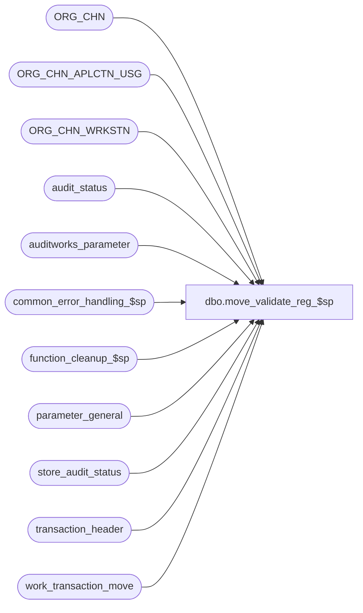

# dbo.move_validate_reg_$sp

**Database:** auditworks  
**Server:** bedrockdb01  

## Architecture Diagram



## Table Dependencies

| Referenced Table |
|---|
| ORG_CHN |
| ORG_CHN_APLCTN_USG |
| ORG_CHN_WRKSTN |
| audit_status |
| auditworks_parameter |
| common_error_handling_$sp |
| function_cleanup_$sp |
| parameter_general |
| store_audit_status |
| transaction_header |
| work_transaction_move |

## Stored Procedure Code

```sql
create proc dbo.move_validate_reg_$sp @process_id	        binary(16),
@user_id                int,
@from_store_no		int,
@from_register_no	smallint,
@from_sales_date	smalldatetime,
@date_reject_id		tinyint,
@from_transaction_no	int,
@to_store_no		int,
@to_register_no		smallint,
@to_sales_date		smalldatetime,
@to_transaction_no	int,
@to_cashier_no		int,
@to_till_no		smallint,
@errmsg			nvarchar(2000) OUTPUT,
@frontend_populated	tinyint,
@transaction_series	nchar(1),
@function_no		tinyint

AS

DECLARE
  @duplicate_transactions       tinyint,
  @errmsg1			nvarchar(2000),
  @errmsg2			nvarchar(2000),
  @errno			int,
  @last_date_closed		smalldatetime,
  @reject_recur_tran		smallint,
  @message_id		       	int,	
  @object_name			nvarchar(255),
  @operation_name		nvarchar(100),
  @process_name		       	nvarchar(100)

/*
PROC NAME: move_validate_reg_$sp
  DESC: Validate the store/date for both the FROM and TO store.
     If the parameter reject_recurring_trans_number is turned on, then moving multiple trans with same trans number
     will not be allowed, even if the series and time are different, unless cashier or till is also changed. 

  Called by move_store_$sp.

  HISTORY:
Date     Name		Def# Desc
Feb10,16 Vicci    TFS-155283 Don't skip duplicate-avoidance validation just because till or cashier were changed.
                             If a list of transactions to be moved was provided, remove from it the transactions 
                             that cannot be moved since they would be duplicated from xns populated by frontend
                             (allowing the remainder to first be moved before error is raised) instead of only raising an error.
                             Add TRY CATCH since this proc is called within a TRY CATCH by move_store_$sp.
Feb20,09 Vicci        105395 Uplift 1-3YR5DH
Feb20,09 Vicci      1-3YR5DH Use move_source_date to evaluate entry_date_time adjustments
Aug08,08 Paul          87777 uplift to SA5
Jan12,07 Paul          81764 apply 81535, 1-38J3WJ to SA5
Jun21,05 Paul          54934 apply 52604 to SA5
Oct28,04 David       DV-1159 Check for ORG_CHN active flag. 
Sep15,04 David       DV-1146 Receive user_id. Remove reference to active flags.
Aug23,04 Sab	     DV-1120 Remove local variable @aplctn_id and aplctn_id in auditwork_parameter since we hardcode aplctn_id to 300.
May29,04 Maryam      DV-1071 Use ORG_CHN_WRKSTN, ORG_CHN table, receive @process_id
Jan18.07 Daphna        81588 Call function_cleanup to autorecover (rollback) failure due to business rule
Jan09.07 Daphna        81535 use @date_changed_by to modify EDT when determining whether duplicates will result from move
Mar15,06 Daphna     1-38J3WJ search for duplicates is (series = series AND e-d-t = e-d-t) OR reject_recurring = 1
Apr22,05 ShuZ          52604 Allow reassign cashier or till in same store-reg-date
Aug05,02 Paul        1-EKNL1 Report message when moving tran for one register to another
				 and transaction(s) would be duplicated.
Apr19,02 Winnie	     1-CD0IX R3 error handling
Sep27,01 Henry		8789 To correct problems when moving multiple transaction_series.
			     - when front-end populated, missing join to transaction_series.
Aug01,01 Paul		8448 change 8236 to allow moving if another register is accepted but not completed.
Jul12,01 Winnie		8236 To validate the status in audit_status in case of integs in store_audit_status.
May30,01 Henry		8008 To correctly verify existing trxns in the destination store/date.
Apr04,01 Phu		7501 Use system function to retrieve user name
Mar28,00 Daphna F	6090 permit moving invalid date to itself when TO date is now valid 
May03,99 Paul S.	4525 Prevent moving invalid date to itself
Apr26,99 Daphna F	4475 removed unlocking of TO and FROM
				stores in error logic to allow standard handling on failure
Sep18,97 Louise M	
Oct29,96 Sebastiano V	n/a	Author
					
*/
BEGIN TRY

SELECT @process_name = 'move_validate_reg_$sp',
       @message_id = 201068;

SELECT @errmsg = 'unable to select @reject_recur_tran from auditworks_parameter.  ',
       @object_name = 'auditworks_parameter',
       @operation_name = 'SELECT';
SELECT @reject_recur_tran = CONVERT(smallint, par_value)
  FROM auditworks_parameter
 WHERE par_name = 'reject_recurring_trans_number';

/* check whether destination store# exists */
SELECT @errmsg = 'Unable to determine if destination store is valid.  ',
       @object_name = 'ORG_CHN_APLCTN_USG';
IF NOT EXISTS (SELECT 1 FROM ORG_CHN_APLCTN_USG u, ORG_CHN c 
		WHERE u.ORG_CHN_NUM = @to_store_no
		  AND u.APLCTN_ID = 300
		  AND u.VLDTY = 1
		  AND u.ORG_CHN_NUM = c.ORG_CHN_NUM
		  AND c.ACTV = 1)
BEGIN
  SELECT @errno = 201555, -- Store does not exist in the common Store table
	 @errmsg = 'TO Store number does not exist.',
         @message_id = 201555
  GOTO business_error
END

/* moving an invalid date to itself */
IF (@date_reject_id > 0
  AND @from_store_no = @to_store_no
  AND @from_sales_date = @to_sales_date)
BEGIN
   SELECT @errmsg = 'unable to select @last_date_closed from parameter_general.  ',
          @object_name = 'parameter_general',
          @operation_name = 'SELECT';
   SELECT @last_date_closed = last_date_closed 
     FROM parameter_general;
    
  IF (@to_sales_date > getdate() 
      OR @to_sales_date <= @last_date_closed)  -- TO date not valid
  BEGIN
    SELECT @errmsg = 'Unable to determine destination register status.  ',
           @object_name = 'audit_status';
    IF EXISTS ( SELECT register_no
                FROM audit_status
               WHERE store_no = @to_store_no
                 AND sales_date = @to_sales_date
                 AND register_no = @to_register_no
                 AND date_reject_id > 0 )
    BEGIN
      SELECT @errno = 201573, -- An invalid date cannot be moved to itself.
	     @errmsg = 'Cannot move an invalid date to itself',
             @message_id = 201573
      GOTO business_error 
    END
  END  -- TO date not valid 
END

SELECT @errmsg = 'Unable to determine if destination register is valid.  ',
       @object_name = 'ORG_CHN_WRKSTN';
IF NOT EXISTS ( SELECT 1 
                  FROM ORG_CHN_WRKSTN 
		 WHERE ACTV = 1
		   AND WRKSTN_NUM = @to_register_no
		   AND ORG_CHN_NUM = @to_store_no)
BEGIN
  SELECT @errno = 201556, -- Destination register is invalid or duplicate transactions would result.
	 @errmsg = 'Must set-up the register_no for the TO store number.',
         @message_id = 201556
  GOTO business_error
END

/* From store/date already accepted/completed from store_audit_status */
SELECT @errmsg = 'Unable to determine if destination store status accepted/completed .  ',
       @object_name = 'store_audit_status';
IF EXISTS (SELECT store_no FROM store_audit_status
	    WHERE store_no = @from_store_no
	      AND sales_date = @from_sales_date
	      AND date_reject_id = @date_reject_id
	      AND store_audit_status >= 300
	      AND store_audit_status < 900)
BEGIN
  SELECT @errno = 201557, -- Destination store-date has already been accepted and/or posted.
	 @errmsg = 'From Store/Date has status accepted/completed',
         @message_id = 201557
  GOTO business_error 
END

/* From store/date already accepted/completed from audit_status*/
SELECT @errmsg = 'Unable to determine source store status accepted/completed .  ',
       @object_name = 'audit_status';
IF EXISTS (SELECT store_no FROM audit_status
	    WHERE store_no = @from_store_no
	      AND sales_date = @from_sales_date
	      AND date_reject_id = @date_reject_id
	      AND register_no = @from_register_no
	      AND audit_status >= 300
	      AND audit_status < 900)
BEGIN
  SELECT @errno = 201558, -- One of the Store/Reg/Date in guided audit has a status of accepted/completed
	 @errmsg = 'One of the FROM Store/Reg/Date has a status of accepted/completed',
         @message_id = 201558
  GOTO business_error 
END

/* To store/date already accepted/completed from store_audit_status */
SELECT @errmsg = 'Unable to determine source store status accepted/completed .  ',
       @object_name = 'store_audit_status';
IF EXISTS (SELECT store_no FROM store_audit_status
	    WHERE store_no = @to_store_no
	      AND sales_date = @to_sales_date
	      AND date_reject_id = 0
	      AND store_audit_status >= 300
	      AND store_audit_status < 900)
BEGIN
  SELECT @errno = 201557, -- Destination store-date has already been accepted and/or posted.
  	 @errmsg = 'To Store/Date has status accepted/completed',
         @message_id = 201557
  GOTO business_error 
END

/* To store/reg/date already accepted/completed from audit_status*/
SELECT @errmsg = 'Unable to determine if destination register status accepted/completed .  ',
       @object_name = 'audit_status';
IF EXISTS (SELECT store_no FROM audit_status
	    WHERE store_no = @to_store_no
	      AND sales_date = @to_sales_date
	      AND register_no = @to_register_no
	      AND date_reject_id = 0
	      AND audit_status >= 300
	      AND audit_status < 900)
BEGIN
  SELECT @errno = 201558, -- One of the Store/Reg/Date in guided audit has a status of accepted/completed
	 @errmsg = 'One of the TO Store/Reg/Date has a status of accepted/completed',
         @message_id = 201558
  GOTO business_error 
END

/* To store/reg/date already completed from audit_status in case of integs in store_audit_status 
   Defect 8236 */
SELECT @errmsg = 'Unable to determine if any destination register status accepted/completed .  ',
       @object_name = 'audit_status';
IF EXISTS (SELECT store_no FROM audit_status
	    WHERE store_no = @to_store_no
	      AND sales_date = @to_sales_date
	      AND date_reject_id = 0
	      AND audit_status >= 301
	 AND audit_status < 900)
BEGIN
  SELECT @errno = 201558, -- One of the Store/Reg/Date in guided audit has a status of accepted/completed
	 @errmsg = 'One of the TO Store/Reg/Date has a status of accepted/completed',
         @message_id = 201558
  GOTO business_error 
END

/* Ensure that transactions to be moved do not already exist on destination register */

SELECT @duplicate_transactions = 0

IF (@from_store_no <> @to_store_no) OR (@from_register_no <> @to_register_no) OR @date_reject_id <> 0 OR (@from_sales_date <> @to_sales_date)
BEGIN
	IF @from_transaction_no = -1 --  all transactions moved
	  BEGIN
            SELECT @errmsg = 'Unable to determine if duplicates would result when all transaction moved.',
                   @object_name = 'transaction_header';
	   IF EXISTS (SELECT 1
			FROM transaction_header th, transaction_header th2
		       WHERE th.store_no = @from_store_no
			 AND th.register_no = @from_register_no
			 AND th.transaction_date = @from_sales_date
			 AND th.date_reject_id = @date_reject_id
			 AND th2.store_no = @to_store_no
			 AND th2.register_no = @to_register_no
			 AND th2.transaction_date = @to_sales_date
			 AND th2.date_reject_id = 0
			 AND th.transaction_no = th2.transaction_no
			 AND ((th.transaction_series = th2.transaction_series
   			      AND CASE WHEN @function_no = 109 THEN DATEADD(dd, DATEDIFF(dd, COALESCE(th.move_source_date, @from_sales_date), @to_sales_date), th.entry_date_time) ELSE th.entry_date_time END  = th2.entry_date_time)
   			      OR @reject_recur_tran = 1))
	    SELECT @duplicate_transactions = 1
	  END
	ELSE
	  BEGIN
	   IF @frontend_populated <> 1 
	    BEGIN
	     IF (@to_transaction_no >= @from_transaction_no) -- range selected
	      BEGIN
                SELECT @errmsg = 'Unable to determine if duplicates would result when range moved.',
                       @object_name = 'transaction_header';
		IF EXISTS (SELECT 1
			     FROM transaction_header th, transaction_header th2
			    WHERE th.store_no = @from_store_no
			      AND th.register_no = @from_register_no
			      AND th.transaction_date = @from_sales_date
			      AND th.date_reject_id = @date_reject_id
			      AND th.transaction_series = @transaction_series
			   AND th2.store_no = @to_store_no
			      AND th2.register_no = @to_register_no
			      AND th2.transaction_date = @to_sales_date
			      AND th2.date_reject_id = 0
			      AND th.transaction_no = th2.transaction_no
			      AND th.transaction_no BETWEEN @from_transaction_no AND @to_transaction_no
			      AND ((th.transaction_series = th2.transaction_series
   			            AND CASE WHEN @function_no = 109 THEN DATEADD(dd, DATEDIFF(dd, COALESCE(th.move_source_date, @from_sales_date), @to_sales_date), th.entry_date_time) ELSE th.entry_date_time END  = th2.entry_date_time)
   			         OR @reject_recur_tran = 1))
	        SELECT @duplicate_transactions = 1
	      END /* end of @to_transaction_no >= @from_transaction_no */
	    ELSE
	      BEGIN -- rollover case
                SELECT @errmsg = 'Unable to determine if duplicates would result when range moved -rollover.',
                       @object_name = 'transaction_header';
		IF EXISTS (SELECT 1
			     FROM transaction_header th, transaction_header th2
			    WHERE th.store_no = @from_store_no
			      AND th.register_no = @from_register_no
			      AND th.transaction_date = @from_sales_date
			      AND th.date_reject_id = @date_reject_id
			      AND th2.store_no = @to_store_no
			      AND th2.register_no = @to_register_no
			      AND th2.transaction_date = @to_sales_date
			      AND th2.date_reject_id = 0
			      AND th.transaction_no = th2.transaction_no
			      AND (th.transaction_no >= @from_transaction_no OR th.transaction_no <= @to_transaction_no)
			      AND ((th.transaction_series = th2.transaction_series
   			            AND CASE WHEN @function_no = 109 THEN DATEADD(dd, DATEDIFF(dd, COALESCE(th.move_source_date, @from_sales_date), @to_sales_date), th.entry_date_time) ELSE th.entry_date_time END  = th2.entry_date_time)
   			         OR @reject_recur_tran = 1))
	        SELECT @duplicate_transactions = 1
	      END
	   END   /* End of if @frontend_populated <> 1 */

	  ELSE /* table has already been populated by the front-end */
	   BEGIN
	     --Validation replaced with auto-correction of work_transaction_move to only move those transactions that it can
             SELECT @errmsg = 'Unable to remove transactions that would become duplicated from work list.',
                    @object_name = 'work_transaction_move',
                    @operation_name = 'DELETE';
	     DELETE work_transaction_move
	       FROM transaction_header th, transaction_header th2
	      WHERE work_transaction_move.process_id = @process_id
	        AND th.transaction_id = work_transaction_move.transaction_id
	        AND th.store_no = @from_store_no
		AND th.register_no = @from_register_no
		AND th.transaction_date = @from_sales_date
		AND th.date_reject_id = @date_reject_id
		AND th2.store_no = @to_store_no
		AND th2.register_no = @to_register_no
		AND th2.transaction_date = @to_sales_date
		AND th2.date_reject_id = 0
		AND th.transaction_no = th2.transaction_no
		AND (   (    th.transaction_series = th2.transaction_series
		         AND CASE WHEN @function_no = 109 
		                  THEN DATEADD(dd, DATEDIFF(dd, COALESCE(th.move_source_date, @from_sales_date), @to_sales_date), th.entry_date_time) 
		                  ELSE th.entry_date_time 
		             END  = th2.entry_date_time)
   		     OR @reject_recur_tran = 1);
	     SELECT @duplicate_transactions = SIGN(@@rowcount);
	     IF @duplicate_transactions > 0 
	     BEGIN
	       SELECT @errmsg1 = '201556-Duplicate transactions were omitted from move.';
	     END;
	   END;
	 END; -- else of if @from_transaction_no = -1
END -- If (@to_till_no ...

IF @duplicate_transactions = 1 AND @frontend_populated <> 1
BEGIN
  SELECT @errno = 201556,
         @message_id = 201556,
	 @errmsg = 'Destination register is invalid or duplicate transactions would result.';
  GOTO business_error;
END;
ELSE
BEGIN
  SELECT @errmsg = @errmsg1;  
END;

RETURN

business_error:   /* Business Rule handler. */

	SELECT @errmsg2 = @errmsg

	IF @errno > 201000   --- business rule
	BEGIN
	  EXEC function_cleanup_$sp @process_id, @user_id, @function_no, @errmsg1 OUTPUT 
	END

	EXEC common_error_handling_$sp 9, @errno, @errmsg, 0, @message_id, 
	@process_name, @object_name, @operation_name, 0, 1, 0, null, 0, null, null, 
	null, null, null, null, 0, @process_id, @user_id

	RETURN;
END TRY

BEGIN CATCH;

        /* Common error handler. */

        SELECT @errno = ERROR_NUMBER(),
	       @errmsg = COALESCE(@errmsg, ' ') + ':' + ERROR_MESSAGE();

	 /* this condition will only be true when raise error in trap above fires this general catch */
	IF @errmsg2 IS NOT NULL
	  SELECT @errmsg = @errmsg2;

	
	EXEC common_error_handling_$sp 9, @errno, @errmsg, 0, @message_id, 
	@process_name, @object_name, @operation_name, 0, 1, 0, null, 0, null, null, 
	null, null, null, null, 0, @process_id, @user_id;

	RETURN;

END CATCH;
```

