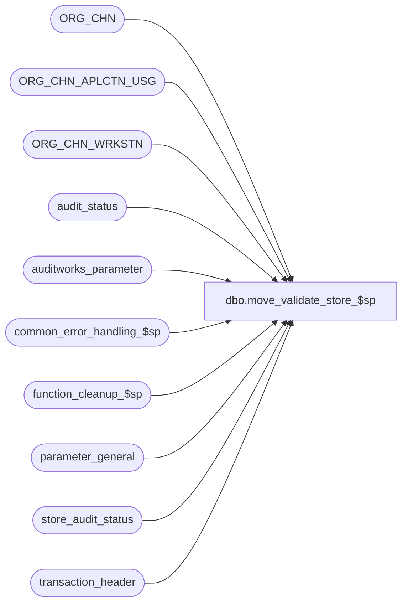

# dbo.move_validate_store_$sp

**Database:** auditworks  
**Server:** bedrockdb01  

## Architecture Diagram



## Table Dependencies

| Referenced Table |
|---|
| ORG_CHN |
| ORG_CHN_APLCTN_USG |
| ORG_CHN_WRKSTN |
| audit_status |
| auditworks_parameter |
| common_error_handling_$sp |
| function_cleanup_$sp |
| parameter_general |
| store_audit_status |
| transaction_header |

## Stored Procedure Code

```sql
create proc dbo.move_validate_store_$sp 
@process_id	        binary(16),
@user_id                int,
@from_store_no		int,
@from_sales_date	smalldatetime,
@date_reject_id		tinyint,
@to_store_no		int,
@to_sales_date		smalldatetime,
@to_cashier_no		int,
@to_till_no		smallint,
@errmsg			nvarchar(2000) OUTPUT,
@function_no		tinyint

AS

DECLARE
  @errno			int,
  @last_date_closed		smalldatetime,
  @reg_count_from		int,
  @reg_count_to			int,
  @reject_recur_tran		smallint,
  @rows				int,
  @message_id		       	int,	
  @object_name			nvarchar(255),
  @operation_name		nvarchar(100),
  @process_name		       	nvarchar(100),
  @errmsg1			nvarchar(2000),
  @errmsg2			nvarchar(2000);

/*
PROC NAME: move_validate_store_$sp
     DESC: Validate the store/date for both the FROM and TO store.
           Called by move_store_$sp when moving all registers.

  HISTORY:
Date     Name		Def# Desc
Feb10,16 Vicci    TFS-155283 Don't skip duplicate-avoidance validation just because till or cashier were changed.
                             Add TRY/CATCH since this proc is called from move_store_$sp within a try/catch.
Feb20,09 Vicci        105395 Uplift 1-3YR5DH
Feb20,09 Vicci      1-3YR5DH Use move_source_date to evaluate entry_date_time adjustments
Aug08,08 Paul          87777 uplift 81588 to SA5
Jan12,07 Paul          81764 apply 81535,78468,1-38J3WJ to SA5
Jun21,05 Paul          54934 apply 52604 to SA5 
Oct28,04 David       DV-1159 Check for ORG_CHN active flag. 
Sep17,04 Maryam      DV-1146 Change user name to user_id.
Aug23,04 Sab	     DV-1120 Remove local variable @aplctn_id and aplctn_id in auditwork_parameter since we hardcode aplctn_id to 300.
May29,04 Maryam      DV-1071 Use ORG_CHN_WRKSTN, ORG_CHN table, receive @process_id
Jan18.07 Daphna        81588 Call function_cleanup to autorecover (rollback) failure due to business rule
Jan09.07 Daphna        81535 use @date_changed_by to modify EDT when determining whether duplicates will result from move
Oct13.06 Daphna        78468 to validate if registers exist in destination store, evaluate only reg that will get moved
                             (status <=299)
Mar15,06 Daphna     1-38J3WJ search for duplicates is (series = series AND e-d-t = e-d-t) OR reject_recurring = 1
Apr22,05 ShuZ          52604 Allow reassign cashier or till in same store-reg-date                            
Apr19,02 Winnie	     1-CD0IX R3 error handling
Aug02,01 Paul		8447 To disallow moving if any destination register is status 8
May30,01 Henry		8008 To correctly verify existing trxns in the destination store/date.
Mar28,00 Daphna F	6090 permit moving invalid date to itself when TO date is now valid 
May03,99 Paul S.	4525 Prevent moving invalid date to itself
Apr26,99 Daphna F	4475 removed unlocking of TO and FROM stores in error logic
				 to allow for standard handling on failure  
Sep18,97 Louise M
Oct29,96 Sebastiano V	n/a	Author

*/

BEGIN TRY

SELECT @process_name = 'move_validate_store_$sp',
       @message_id = 201068

/* check whether destination store# exists */
SELECT @errmsg = 'Unable to determine if destination store is valid.  ',
       @object_name = 'ORG_CHN_APLCTN_USG',
       @operation_name = 'SELECT';
IF NOT EXISTS (SELECT 1 FROM ORG_CHN_APLCTN_USG u, ORG_CHN c 
		WHERE u.ORG_CHN_NUM = @to_store_no
		  AND u.APLCTN_ID = 300
		  AND u.VLDTY = 1
		  AND u.ORG_CHN_NUM = c.ORG_CHN_NUM
		  AND c.ACTV = 1)
BEGIN
  SELECT @errno = 201555, @errmsg = 'TO Store number does not exist.',
         @message_id = 201555  
  GOTO business_error
END

SELECT @errmsg = 'Unable to determine if destination definition of duplicate.  ',
       @object_name = 'auditworks_parameter';
SELECT @reject_recur_tran = CONVERT(smallint, par_value)
  FROM auditworks_parameter
 WHERE par_name = 'reject_recurring_trans_number'

/* moving an invalid date to itself */
IF (@date_reject_id > 0
  AND @from_store_no = @to_store_no
  AND @from_sales_date = @to_sales_date)
BEGIN
  SELECT @errmsg = 'Unable to determine last date closed.  ',
         @object_name = 'parameter_general';
  SELECT @last_date_closed = last_date_closed 
    FROM parameter_general;
    
 IF (@to_sales_date > getdate() 
      OR @to_sales_date <= @last_date_closed)  -- TO date not valid
  BEGIN
    SELECT @errno = 201573, @errmsg = 'Cannot move an invalid date to itself',
           @message_id = 201573;
    GOTO business_error;
  END;  -- TO date not valid  
END;

/* From store/date already accepted/completed from store_audit_status */
SELECT @errmsg = 'Unable to determine if FROM store/date already accepted/completed.  ',
       @object_name = 'store_audit_status';
IF EXISTS (SELECT store_no FROM store_audit_status
	   WHERE store_no = @from_store_no
	   AND sales_date = @from_sales_date
	   AND date_reject_id = @date_reject_id
	   AND store_audit_status >= 300 AND store_audit_status < 900)
BEGIN
  SELECT @errno = 201557, @errmsg = 'From Store/Date has status accepted/completed',
         @message_id = 201557;
  GOTO business_error ;
END

/* From store/date already accepted/completed from audit_status*/
SELECT @errmsg = 'Unable to determine if any register for FROM store/date already accepted/completed.  ',
       @object_name = 'audit_status';
IF EXISTS (SELECT store_no FROM audit_status
	   WHERE store_no = @from_store_no
	   AND sales_date = @from_sales_date
	   AND date_reject_id = @date_reject_id
	   AND audit_status >= 300 AND audit_status < 900)
BEGIN
  SELECT @errno = 201558, @errmsg = 'One of the FROM Store/Reg/Date has a status of accepted/completed',
         @message_id = 201558;
  GOTO business_error;
END

/* To store/date already accepted/completed from store_audit_status */
SELECT @errmsg = 'Unable to determine if destination store/date already accepted/completed.  ',
       @object_name = 'store_audit_status';
IF EXISTS (SELECT store_no FROM store_audit_status
	   WHERE store_no = @to_store_no
	   AND sales_date = @to_sales_date
	   AND date_reject_id = 0
	   AND store_audit_status >= 300 AND store_audit_status < 900)
BEGIN
  SELECT @errno = 201557, @errmsg = 'To Store/Date has status accepted/completed',
         @message_id = 201557;
  GOTO business_error;
END

/* To store/reg/date already accepted/completed from audit_status*/
SELECT @errmsg = 'Unable to determine if any register for destination store/date already accepted/completed.  ',
       @object_name = 'audit_status';
IF EXISTS (SELECT store_no FROM audit_status
	   WHERE store_no = @to_store_no
	   AND sales_date = @to_sales_date
	   AND date_reject_id = 0
	   AND audit_status >= 300 AND audit_status < 900)
BEGIN
  SELECT @errno = 201558, @errmsg = 'One of the TO Store/Reg/Date has a status of accepted/completed',
         @message_id = 201558;
  GOTO business_error;
END

/* Validate if all MOVE CANDIDATE registers exist in the TO store */
SELECT @errmsg = 'Unable to determine if destination register exists for store/date.  ',
       @object_name = 'audit_status';
SELECT @reg_count_from = COUNT(store_no)
  FROM audit_status
 WHERE store_no = @from_store_no
   AND sales_date = @from_sales_date
   AND date_reject_id = @date_reject_id
   AND audit_status <= 299  -- registers that can be moved

SELECT @errmsg = 'Unable to determine if destination register is valid.  ',
       @object_name = 'ORG_CHN_WRKSTN';
SELECT @reg_count_to = COUNT(au.store_no)   -- how many matches
  FROM ORG_CHN_WRKSTN rt, audit_status au
 WHERE rt.ORG_CHN_NUM = @to_store_no
   AND au.store_no = @from_store_no
   AND sales_date = @from_sales_date
   AND date_reject_id = @date_reject_id
   AND au.audit_status <= 299  -- registers that can be moved
   AND rt.WRKSTN_NUM = au.register_no

SELECT @rows = 0
IF @reg_count_from = @reg_count_to
  BEGIN /* Def 8447: Look for store/reg not on file (needs to be corrected first),
     also checks integrity in case store/reg has been created but invalid data is not fixed */
   SELECT @errmsg = 'Unable to determine if destination store has registers that need revalidating.  ',
          @object_name = 'audit_status';
   SELECT @rows = COUNT(store_no)
     FROM audit_status
    WHERE store_no = @to_store_no
      AND sales_date = @to_sales_date
      AND date_reject_id = 0
      AND audit_status IN (7,8)
  END

IF (@reg_count_from != @reg_count_to) OR @rows != 0
BEGIN
  SELECT @errno = 201554, @errmsg = 'Cannot move. Not all registers have been created in the destination store.',
         @message_id = 201554;
  GOTO business_error;
END;

/* check all transactions in the store to be moved for overlap with destination */
  IF (@from_store_no <> @to_store_no) OR @date_reject_id <> 0 OR (@from_sales_date <> @to_sales_date) 
  BEGIN
        SELECT @errmsg = 'Unable to determine if duplicates would result from move.  ',
               @object_name = 'transaction_header';
	IF EXISTS (SELECT 1
	             FROM transaction_header th, transaction_header th2
		    WHERE th.transaction_date = @from_sales_date
		      AND th.store_no = @from_store_no
		      AND th.date_reject_id = @date_reject_id
		      AND th2.store_no = @to_store_no
		      AND th2.transaction_date = @to_sales_date
		      AND th2.date_reject_id = 0
		      AND th.register_no = th2.register_no
		      AND th.transaction_no = th2.transaction_no
		      AND (( th.transaction_series = th2.transaction_series
		           AND CASE WHEN @function_no = 109 THEN DATEADD(dd, DATEDIFF(dd, COALESCE(th.move_source_date, @from_sales_date), @to_sales_date), th.entry_date_time) ELSE th.entry_date_time END  = th2.entry_date_time)
		        OR @reject_recur_tran = 1))
	BEGIN
	  SELECT @errno = 201556, @errmsg = 'Transactions already exists for the TO store no',
	         @message_id = 201556;
	  GOTO business_error;
	END
  END

RETURN

business_error:   /* Business Rule handler. */

	SELECT @errmsg2 = @errmsg

	IF @errno > 201000   --- business rule
	BEGIN
	  EXEC function_cleanup_$sp @process_id, @user_id, @function_no, @errmsg1 OUTPUT
	END

	EXEC common_error_handling_$sp 9, @errno, @errmsg, 0, @message_id, @process_name,
	     @object_name, @operation_name, 0, 1, 0, null, 0, null, null, null, null, null,
	     null, 0, @process_id, @user_id;

	RETURN
END TRY

BEGIN CATCH;

        /* Common error handler. */

        SELECT @errno = ERROR_NUMBER(),
	       @errmsg = COALESCE(@errmsg, ' ') + ':' + ERROR_MESSAGE();

	 /* this condition will only be true when raise error in trap above fires this general catch */
	IF @errmsg2 IS NOT NULL
	  SELECT @errmsg = @errmsg2;

	EXEC common_error_handling_$sp 9, @errno, @errmsg, 0, @message_id, @process_name,
	     @object_name, @operation_name, 0, 1, 0, null, 0, null, null, null, null, null,
	     null, 0, @process_id, @user_id;

	RETURN;

END CATCH;
```

