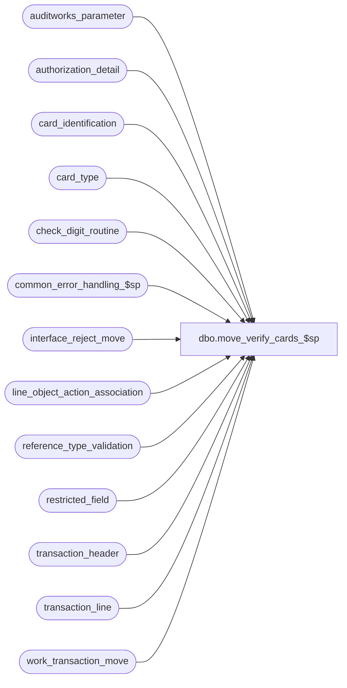

# dbo.move_verify_cards_$sp

**Database:** auditworks  
**Server:** bedrockdb01  

## Architecture Diagram



## Table Dependencies

| Referenced Table |
|---|
| auditworks_parameter |
| authorization_detail |
| card_identification |
| card_type |
| check_digit_routine |
| common_error_handling_$sp |
| interface_reject_move |
| line_object_action_association |
| reference_type_validation |
| restricted_field |
| transaction_header |
| transaction_line |
| work_transaction_move |

## Stored Procedure Code

```sql
create proc dbo.move_verify_cards_$sp  
@process_id	        binary(16),
@user_id                int,
@store_no		int,
@errmsg			nvarchar(255) OUTPUT

AS

/* Proc Name: move_verify_cards_$sp
   Desc: Verify credit card account numbers for transactions that were previously sa rejects.

HISTORY
 Date    Name		Def# Desc
Nov19,15 Vicci    TFS-150090 Reject invalid cards even if alphanumeric token <= 20 was given by Translate in Encrypted Reference# field resulting 
                             in Edit logging reference# to invalid reference# field, by applying same logic as for Edit (since during move there is 
                             no manual manipulation of credit cards and since I/F rejects may not already exist given that transactions may have 
                             been S/A rejects for bad store, reg or date).
Feb18,14 Phu        1-4C6V8J Change the move to work like the edit by using edit_active_flag.
Jan19,12 Vicci        132481 Remove usage of data length function for substring extraction from unicode strings since it returns a length
                             of double that corresponding to the character positions within the string in the case of nvarchar and nchar data types.
Jun02,10 Paul         118326 Avoid error if any card numbers are non-numeric (matches edit functionality)
Nov26,09 Vicci      1-44DRTV Don't validate cards for reference types where validations are turned off.
Feb27,07 Paul        DV-1357 uplift 66617 to SA5
Oct25,06 Phu           77931 Fix outer join for SQL 2005 Mode 90.
Nov10,05 Paul        DV-1322 apply 62921 to SA5
Sep20,05 Paul          60471 apply 60266, DV-1298 to SA5
Jul22,05 David       DV-1294 Fixed bug #credit_card instead of #credit_cards. 
Apr29,05 Paul        DV-1234 expand transaction_id to use tran_id_datatype
Feb23,05 David       DV-1206 Only validate if transaction was an S/A reject.
Sep17,04 Maryam      DV-1146 Change user_name to user_id. 
Apr28,04 Maryam      DV-1071 Receive @process_id and @user_name and pass it to the common_error_handling_$sp. Added 
			     logic for encrypted credit cards.
Jan31,06 Daphna        66617 Validate cards even when NOT S/A rej
Nov04,05 David         62921 Replace line_object for line_object_type 4 also.
Sep16,05 David         60266 Check for reference_type when identifying card_type.
Aug22,05 David       DV-1298 Added logic for encrypted credit cards. Only validate if transaction was an S/A reject.
Aug21,03 Paul          13215 corrected 9250
Jun18,03 Winnie	        9250 Media Reconciliation enhancements.	 
Apr19,02 Winnie	     1-CD0IX R3 error handling
Aug30,01 Paul		8579 removed double quotes
Apr04,01 Phu		7501 Use system function to retrieve user name
May19,99 Paul		4681 avoid arithmetic overflow
Apr06,99 Paul		4446 avoid division by zero
Dec03,98 Andrew
         Sebastiano V	Author
 */

DECLARE
  @digit			smallint,
  @errno			int,
  @rows				int,
  @rows1			int,
  @sum_digit			smallint,
  @type_char			nchar(1),
  @type_smallint		smallint,
  @message_id		       	int,	
  @object_name			nvarchar(255),
  @operation_name		nvarchar(100),
  @process_name		       	nvarchar(100),
  @transaction_date		smalldatetime,
  @translate_validation		tinyint;

SELECT 	@type_char = '?',
	@type_smallint = 0,
	@digit = 0,
	@sum_digit = 0,
        @process_name = 'move_verify_cards_$sp',
        @message_id = 201068,
        @translate_validation = 0,
        @rows = 0,
        @rows1 = 0;	

SELECT @translate_validation = CONVERT(tinyint, par_value) 
  FROM auditworks_parameter
 WHERE par_name = 'translate_card_validation';
SELECT @errno = @@error;
IF @errno != 0
BEGIN
  SELECT @errmsg = 'Failed to get translate_validation flag.',
         @object_name = 'auditworks_parameter',
         @operation_name = 'SELECT';
  GOTO error;
END;

CREATE TABLE #credit_cards
(transaction_id numeric(14,0), -- tran_id_datatype
 transaction_category tinyint,
 line_id numeric(5,0),
 orig_line_object smallint,
 line_action tinyint,
 line_object_type tinyint, 
 check_digit_routine smallint,
 card_no numeric(20,0) null, 
 card_no_char nchar(20) null,
 calculated_card_type nchar(1),
 calculated_line_object smallint,
 digit1 smallint,
 digit2 smallint,
 digit3 smallint,
 digit4 smallint,
 digit5 smallint,
 digit6 smallint,
 digit7 smallint,
 digit8 smallint,
 digit9 smallint,
 digit10 smallint,
 digit11 smallint,
 digit12 smallint,
 digit13 smallint,
 digit14 smallint,
 digit15 smallint,
 digit16 smallint,
 digit17 smallint,
 digit18 smallint,
 digit19 smallint,
 digit20 smallint,
 sum_of_digits smallint,
 remainder_value smallint,
 reference_type tinyint)

/* Insert non-encrypted card numbers and any encrypted card numbers where the translate also logged a non-encrypted
     value in invalid_reference_no (will be reset to null later if card is valid). */
INSERT #credit_cards
       (transaction_id,
	transaction_category,
	line_id,
	orig_line_object,
	line_action,
	line_object_type,
	check_digit_routine,
        card_no,
	card_no_char,
	calculated_card_type,
	calculated_line_object,
	digit1,
	digit2,
	digit3,
	digit4,
	digit5,
	digit6,
	digit7,
	digit8,
	digit9,
	digit10,
	digit11,
	digit12,
	digit13,
	digit14,
	digit15,
	digit16,
	digit17,
	digit18,
	digit19,
	digit20,
 	sum_of_digits,
	remainder_value,
	reference_type)
 SELECT tl.transaction_id,
	th.transaction_category,
	tl.line_id,
	tl.line_object,
	tl.line_action,
	tl.line_object_type,
	0,
	CONVERT( numeric(20,0), ISNULL(ISNULL(tl.invalid_reference_no, tl.reference_no),'0')),
  	RIGHT('00000000000000000000'+LTRIM(RTRIM(ISNULL(tl.invalid_reference_no, tl.reference_no))),20),
	ISNULL(ad.card_type, @type_char),
	@type_smallint,
	@digit,
	@digit,
	@digit,
	@digit,
	@digit,
	@digit,
	@digit,
	@digit,
	@digit,
	@digit,
	@digit,
	@digit,
	@digit,
	@digit,
	@digit,
	@digit,
	@digit,
	@digit,
	@digit,
	@digit,
	@sum_digit,
	@digit,
	tl.reference_type
 FROM work_transaction_move wt WITH (NOLOCK)
  INNER JOIN transaction_header th WITH (NOLOCK) ON (wt.transaction_id = th.transaction_id)
  INNER JOIN transaction_line tl WITH (NOLOCK) ON (th.transaction_id = tl.transaction_id)
  INNER JOIN reference_type_validation r WITH (NOLOCK) ON (tl.reference_type = r.reference_type)
  LEFT OUTER JOIN authorization_detail ad WITH (NOLOCK) ON (tl.transaction_id = ad.transaction_id AND tl.line_id = ad.line_id)
  WHERE wt.process_id = @process_id
    AND th.sa_rejection_flag = 0
    AND tl.line_void_flag = 0
    AND tl.reference_no IS NOT NULL --
    AND r.validation_type  = 1
    AND r.edit_active_flag = 1
    AND len(ISNULL(ISNULL(tl.invalid_reference_no, tl.reference_no),'0')) <= 20
    AND IsNumeric(ISNULL(ISNULL(tl.invalid_reference_no, tl.reference_no),'0')) = 1
SELECT @errno = @@error, @rows = @@rowcount
IF @errno != 0
  BEGIN
    SELECT @errmsg = 'Failed to insert into #credit_cards (unencrypted)',
           @object_name = '#credit_cards',
           @operation_name = 'CREATE'  
    GOTO error
  END

IF @rows > 0 AND @translate_validation = 0
BEGIN
UPDATE #credit_cards
   SET calculated_card_type = card_type
  FROM #credit_cards ec, card_identification ci
 WHERE ec.card_no >= ci.from_account_no
   AND ec.card_no <= ci.to_account_no
   AND ec.reference_type = ci.reference_type

SELECT @errno = @@error
IF @errno != 0
BEGIN
  SELECT @errmsg = 'Failed to update on #credit_cards card_type',
         @object_name = '#credit_cards',
         @operation_name = 'UPDATE'  
  GOTO error
END

UPDATE authorization_detail
   SET card_type = calculated_card_type
  FROM #credit_cards cc, authorization_detail ad
 WHERE ad.card_type != calculated_card_type
   AND calculated_card_type != '?'
   AND cc.transaction_id = ad.transaction_id
   AND cc.line_id = ad.line_id

SELECT @errno = @@error
IF @errno != 0
BEGIN
  SELECT @errmsg = 'Failed to update on authorization_detail',
         @object_name = 'authorization_detail',
         @operation_name = 'UPDATE'  
  GOTO error
END

UPDATE #credit_cards
   SET check_digit_routine=check_digit_routine_number
  FROM #credit_cards ec, card_type ct
 WHERE calculated_card_type = card_type

SELECT @errno = @@error
IF @errno != 0
BEGIN
  SELECT @errmsg = 'Failed to update check_digit_routine on #credit_cards',
         @object_name = '#credit_cards',
         @operation_name = 'UPDATE'  
  GOTO error
END

UPDATE #credit_cards
   SET digit20= ISNULL(CONVERT(tinyint, SUBSTRING(card_no_char, 20, 1 )),0) * multiplier20,
	digit19= (ISNULL(CONVERT(tinyint, SUBSTRING(card_no_char, 19, 1 )),0) * multiplier19)
	- (sum_of_product_digits * SIGN(SIGN(ISNULL(CONVERT(tinyint, SUBSTRING(card_no_char, 19, 1 )),0) - 5)+1)),
	digit18= ISNULL(CONVERT(tinyint, SUBSTRING(card_no_char, 18, 1 )),0) * multiplier18,
	digit17= (ISNULL(CONVERT(tinyint, SUBSTRING(card_no_char, 17, 1 )),0) * multiplier17)
	- (sum_of_product_digits * SIGN(SIGN(ISNULL(CONVERT(tinyint, SUBSTRING(card_no_char, 17, 1 )),0) - 5)+1)),
	digit16= ISNULL(CONVERT(tinyint, SUBSTRING(card_no_char, 16, 1 )),0) * multiplier16,
	digit15= (ISNULL(CONVERT(tinyint, SUBSTRING(card_no_char, 15, 1 )),0) * multiplier15)
	- (sum_of_product_digits * SIGN(SIGN(ISNULL(CONVERT(tinyint, SUBSTRING(card_no_char, 15, 1 )),0) - 5)+1)),
	digit14= ISNULL(CONVERT(tinyint, SUBSTRING(card_no_char, 14, 1 )),0) * multiplier14,
	digit13= (ISNULL(CONVERT(tinyint, SUBSTRING(card_no_char, 13, 1 )),0) * multiplier13)
	- (sum_of_product_digits * SIGN(SIGN(ISNULL(CONVERT(tinyint, SUBSTRING(card_no_char, 13, 1 )),0) - 5)+1)),
	digit12= ISNULL(CONVERT(tinyint, SUBSTRING(card_no_char, 12, 1 )),0) * multiplier12,
	digit11= (ISNULL(CONVERT(tinyint, SUBSTRING(card_no_char, 11, 1 )),0) * multiplier11)
	- (sum_of_product_digits * SIGN(SIGN(ISNULL(CONVERT(tinyint, SUBSTRING(card_no_char, 11, 1 )),0) - 5)+1))
  FROM #credit_cards, check_digit_routine
 WHERE check_digit_routine=check_digit_routine_no
SELECT @errno = @@error
IF @errno != 0
BEGIN
  SELECT @errmsg = 'Failed to update digit20 on #credit_cards',
         @object_name = '#credit_cards',
         @operation_name = 'UPDATE'  
  GOTO error
END

UPDATE #credit_cards
   SET digit10= ISNULL(CONVERT(tinyint, SUBSTRING(card_no_char, 10, 1 )),0) * multiplier10,
	digit9= (ISNULL(CONVERT(tinyint, SUBSTRING(card_no_char, 9, 1 )),0) * multiplier9)
	- (sum_of_product_digits * SIGN(SIGN(ISNULL(CONVERT(tinyint, SUBSTRING(card_no_char, 9, 1 )),0) - 5)+1)),
	digit8= ISNULL(CONVERT(tinyint, SUBSTRING(card_no_char, 8, 1 )),0) * multiplier8,
	digit7= (ISNULL(CONVERT(tinyint, SUBSTRING(card_no_char, 7, 1 )),0) * multiplier7)
	- (sum_of_product_digits * SIGN(SIGN(ISNULL(CONVERT(tinyint, SUBSTRING(card_no_char, 7, 1 )),0) - 5)+1)),
	digit6= ISNULL(CONVERT(tinyint, SUBSTRING(card_no_char, 6, 1 )),0) * multiplier6,
	digit5= (ISNULL(CONVERT(tinyint, SUBSTRING(card_no_char, 5, 1 )),0) * multiplier5)
	- (sum_of_product_digits * SIGN(SIGN(ISNULL(CONVERT(tinyint, SUBSTRING(card_no_char, 5, 1 )),0) - 5)+1)),
	digit4= ISNULL(CONVERT(tinyint, SUBSTRING(card_no_char, 4, 1 )),0) * multiplier4,
	digit3= (ISNULL(CONVERT(tinyint, SUBSTRING(card_no_char, 3, 1 )),0) * multiplier3)
	- (sum_of_product_digits * SIGN(SIGN(ISNULL(CONVERT(tinyint, SUBSTRING(card_no_char, 3, 1 )),0) - 5)+1)),
	digit2= ISNULL(CONVERT(tinyint, SUBSTRING(card_no_char, 2, 1 )),0) * multiplier2,
	digit1= (ISNULL(CONVERT(tinyint, SUBSTRING(card_no_char, 1, 1 )),0) * multiplier1)
	- (sum_of_product_digits * SIGN(SIGN(ISNULL(CONVERT(tinyint, SUBSTRING(card_no_char, 1, 1 )),0) - 5)+1))
  FROM #credit_cards, check_digit_routine
 WHERE check_digit_routine=check_digit_routine_no
SELECT @errno = @@error
IF @errno != 0
BEGIN
  SELECT @errmsg = 'Failed to update digit10 on #credit_cards',
         @object_name = '#credit_cards',
         @operation_name = 'UPDATE'  
  GOTO error
END

UPDATE #credit_cards
   SET sum_of_digits = digit1 + digit2 + digit3 + digit4 + digit5 + digit6
	+ digit7 + digit8 + digit9 + digit10 + digit11 + digit12 + digit13
	+ digit14 + digit15 + digit16 + digit17 + digit18 + digit19 + digit20
  FROM #credit_cards, check_digit_routine
 WHERE check_digit_routine=check_digit_routine_no
   AND sum_of_products = 1

SELECT @errno = @@error
IF @errno != 0
BEGIN
  SELECT @errmsg = 'Failed to update sum_of_digits on #credit_cards',
         @object_name = '#credit_cards',
         @operation_name = 'UPDATE'  
  GOTO error
END

UPDATE #credit_cards
   SET remainder_value = sum_of_digits % divisor
  FROM #credit_cards, check_digit_routine
 WHERE check_digit_routine=check_digit_routine_no
   AND divisor >= 1

SELECT @errno = @@error
IF @errno != 0
BEGIN
  SELECT @errmsg = 'Failed to update remainder_value on #credit_cards',
         @object_name = '#credit_cards',
         @operation_name = 'UPDATE'  
  GOTO error
END
END -- IF @rows > 0 AND @translate_validation = 0

/* Insert all the encrypted/tokenized credit cards (that were not already inserted above) to the work table to allow 
     line_object manipulation and to allow reporting i/f rejects */

INSERT #credit_cards
       (transaction_id,
	transaction_category,
	line_id,
	orig_line_object,
	line_action,
	line_object_type,
	check_digit_routine,
        card_no,
	card_no_char,
	calculated_card_type,
	calculated_line_object,
	digit1,
	digit2,
	digit3,
	digit4,
	digit5,
	digit6,
	digit7,
	digit8,
	digit9,
	digit10,
	digit11,
	digit12,
	digit13,
	digit14,
	digit15,
	digit16,
	digit17,
	digit18,
	digit19,
	digit20,
 	sum_of_digits,
	remainder_value,
	reference_type)
 SELECT tl.transaction_id,
	th.transaction_category,
	tl.line_id,
	tl.line_object,
	tl.line_action,
	tl.line_object_type,
	0,
	NULL, -- card_no
	NULL, -- card_no_char
	IsNull(ad.card_type,'?'),
	@type_smallint,
	@digit,
	@digit,
	@digit,
	@digit,
	@digit,
	@digit,
	@digit,
	@digit,
	@digit,
	@digit,
	@digit,
	@digit,
	@digit,
	@digit,
	@digit,
	@digit,
	@digit,
	@digit,
	@digit,
	@digit,
	@sum_digit,
	@digit,
	tl.reference_type
   FROM work_transaction_move wt
        INNER JOIN transaction_header th WITH (NOLOCK) ON (wt.transaction_id = th.transaction_id)
        INNER JOIN transaction_line tl WITH (NOLOCK) ON (th.transaction_id = tl.transaction_id)
        INNER JOIN reference_type_validation r WITH (NOLOCK) ON (tl.reference_type = r.reference_type)
        LEFT JOIN authorization_detail ad WITH (NOLOCK) ON (tl.transaction_id = ad.transaction_id AND tl.line_id = ad.line_id)
  WHERE wt.process_id = @process_id
    AND th.sa_rejection_flag = 0
    AND tl.line_void_flag = 0
    AND r.validation_type  = 1
    AND r.edit_active_flag = 1
    -- exclude rows already inserted
    AND (   len(ISNULL(ISNULL(tl.invalid_reference_no, tl.reference_no),'0')) > 20
         OR IsNumeric(ISNULL(ISNULL(tl.invalid_reference_no, tl.reference_no),'0')) = 0 )
SELECT @errno = @@error, @rows1 = @@rowcount
IF @errno != 0
  BEGIN
    SELECT @errmsg = 'Failed to insert into #credit_cards (encrypted)',
	   @object_name = '#credit_cards',
           @operation_name = 'INSERT'  
    GOTO error
  END

IF (@rows + @rows1) = 0
BEGIN
  DROP TABLE #credit_cards;
  RETURN;
END;

/* change line_object only if the resulting object-action is valid */
UPDATE #credit_cards
   SET calculated_line_object = cd.line_object
FROM #credit_cards cc, card_type cd, line_object_action_association la
 WHERE calculated_card_type != '?'
   AND cc.line_object_type = 6
   AND calculated_card_type = cd.card_type
   AND cd.line_object = la.line_object
   AND cc.line_action = la.line_action
   AND cc.transaction_category = la.transaction_category
SELECT @errno = @@error
IF @errno != 0
BEGIN
  SELECT @errmsg = 'Failed to update on #credit_cards calculated_line_object',
         @object_name = '#credit_cards',
         @operation_name = 'UPDATE'  
  GOTO error
END

/* change payment line_object only if the resulting object-action is valid */
UPDATE #credit_cards
   SET calculated_line_object = cd.payment_line_object
  FROM #credit_cards cc, card_type cd, line_object_action_association la
 WHERE cc.line_object_type IN (4, 8)
   AND calculated_card_type != '?'
   AND calculated_card_type = cd.card_type
   AND cd.payment_line_object = la.line_object
   AND cc.line_action = la.line_action
   AND cc.transaction_category = la.transaction_category
SELECT @errno = @@error
IF @errno != 0
  BEGIN
   SELECT @errmsg = 'Failed to update #work_credit_card (calculated_line_object) ',
          @object_name = '#credit_cards',
          @operation_name = 'UPDATE'  
   GOTO error
  END

UPDATE transaction_line
   SET line_object = calculated_line_object
  FROM #credit_cards cc, transaction_line tl
 WHERE calculated_line_object != orig_line_object
   AND calculated_line_object >= 1
   AND tl.transaction_id = cc.transaction_id
   AND tl.line_id = cc.line_id
SELECT @errno = @@error
IF @errno != 0
BEGIN
  SELECT @errmsg = 'Failed to update on transaction_line',
         @object_name = 'transaction_line',
         @operation_name = 'UPDATE'  
  GOTO error
END

-- cleanup invalid_reference_no if card no is now considered valid and encrypted version has been logged.
UPDATE transaction_line
   SET invalid_reference_no = NULL --
  FROM transaction_line tl, #credit_cards cc WITH (NOLOCK)
 WHERE cc.calculated_card_type <> '?'
   AND cc.remainder_value = 0
   AND cc.calculated_line_object > 0
   AND tl.invalid_reference_no IS NOT NULL --
   AND tl.reference_no <> tl.invalid_reference_no
   AND tl.transaction_id = cc.transaction_id
   AND tl.line_id = cc.line_id
SELECT @errno = @@error
IF @errno != 0
BEGIN
  SELECT @errmsg = 'Failed to cleanup invalid_reference_no.',
         @object_name = 'transaction_line',
         @operation_name = 'UPDATE'        
  GOTO error
END

-- Change card_type to '?' for valid accepted card# that needs to be encrypted because encrypted version not provided by translate (since otherwise settlement will fail).
UPDATE #credit_cards
   SET calculated_card_type = '?'
  FROM #credit_cards ec, restricted_field rf, transaction_line tl
 WHERE ec.card_no IS NOT NULL --card validated
   AND ec.calculated_card_type != '?'  --card type valid
   AND ec.remainder_value = 0 --card# valid
   AND ec.calculated_line_object <> 0  --card accepted
   AND ec.reference_type = rf.field_value
   AND rf.field_name        = 'reference_type'
   AND rf.restriction_level = 1  --requires encryption/tokenization
   AND rf.active_flag       = 1
   AND (tl.reference_no IS NULL OR tl.reference_no = tl.invalid_reference_no) -- i.e. reference_no not logged or requires encryption and is not encrypted.
   AND tl.transaction_id = ec.transaction_id
   AND tl.line_id = ec.line_id
SELECT @errno = @@error
IF @errno != 0
BEGIN
  SELECT @errmsg = 'Unable to set card_type to ?.',
         @object_name = '#credit_card',
         @operation_name = 'UPDATE'
  GOTO error
END

-- Reject if card type cannot be determined or card_no did not pass the check digit routine
INSERT interface_reject_move (
	process_id,
	if_reject_reason,
	transaction_id,
	line_id )
SELECT DISTINCT
       @process_id,
       2,
       transaction_id,  
       line_id
  FROM #credit_cards
 WHERE calculated_card_type = '?' 
    OR remainder_value <> 0

SELECT @errno = @@error
IF @errno != 0
  BEGIN
   SELECT @errmsg = 'Failed to insert rows for i/f reject reason 2.',
          @object_name = 'interface_reject_move',
          @operation_name = 'INSERT'  
   GOTO error
  END

-- Reject if invalid line-object/action associated with valid card
INSERT interface_reject_move (
	process_id,
	if_reject_reason,
	transaction_id,
	line_id )
SELECT DISTINCT 
       @process_id,
       113, 
       transaction_id,  
       line_id
  FROM #credit_cards
 WHERE calculated_card_type <> '?'
   AND remainder_value = 0
   AND calculated_line_object = 0

SELECT @errno = @@error
IF @errno != 0
BEGIN
  SELECT @errmsg = 'Failed to insert rows for i/f reject reason 113.',
         @object_name = 'interface_reject_move',
         @operation_name = 'INSERT'  
  GOTO error
END

DROP TABLE #credit_cards

RETURN

error:   /* Common error handler. */

	EXEC common_error_handling_$sp 9, @errno, @errmsg, 0, @message_id, 
	@process_name, @object_name, @operation_name, 0, 1, 0, null, 0, null, null, 
	null, null, null, null, 0, @process_id, @user_id

	RETURN
```

