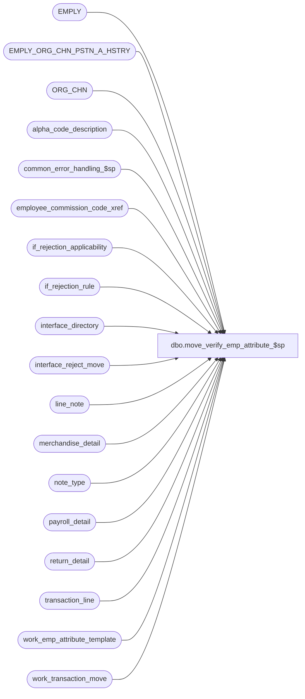

# dbo.move_verify_emp_attribute_$sp

**Database:** auditworks  
**Server:** bedrockdb01  

## Architecture Diagram



## Table Dependencies

| Referenced Table |
|---|
| EMPLY |
| EMPLY_ORG_CHN_PSTN_A_HSTRY |
| ORG_CHN |
| alpha_code_description |
| common_error_handling_$sp |
| employee_commission_code_xref |
| if_rejection_applicability |
| if_rejection_rule |
| interface_directory |
| interface_reject_move |
| line_note |
| merchandise_detail |
| note_type |
| payroll_detail |
| return_detail |
| transaction_line |
| work_emp_attribute_template |
| work_transaction_move |

## Stored Procedure Code

```sql
create proc dbo.move_verify_emp_attribute_$sp ( @process_id                      binary(16),
  @user_id                         int,
  @function_no                     tinyint,
  @to_sales_date		   smalldatetime,
  @to_cashier_no		   int = NULL
)

AS

/*
Proc Name: move_verify_emp_attribute_$sp
     Desc: To re-evaluate Employee Attribute I/F rejects for the move.
           Called from move_register_$sp.

 HISTORY:
Date     Name        Defect# Description
Oct07,14 Vicci     TFS-87723 Correct to look at EMPLY_ORG_CHN_PSTN_A_HSTRY table (not just current assignment table) and to take into account
                             the fact that current assignments have a NULL expiration date and the expiration date is EXCLUSIVE not inclusive.
                             Correct selling area validation to look at selling area not store location.
Jul09,14 Vicci     TFS-77354 Since the transaction_date is not set in work_transaction_move in the case of a move of selected transactions, use @to_sales_date in that case.
Aug17,12 Vicci        137407 Ensure validations run agains new cashier number (not old ones left in work_transaction_move.cashier_no to support move_audit_trail).
Jan15,10 Vicci      1-44G2XS Use CONVERT instead of STR to avoid loss of precision (invalid check)
Dec19,08 Paul          87777 Uplift 101197 to SA5, corrected alias
May14,08 Vicci        101197 Support effective dates in commission code assignment.
Oct09,07 Paul          91395 Apply 90420 to SA5
Aug07,07 Phu           90420 Log employee to memo1 and employee attribute to memo2.
Jul19,07 Phu         DV-1364 Apply 85598, 87372, 89485 to SA5. Initial development.

*/


DECLARE
  @base                           numeric(21,0),
  @emp_attr_need_validation       nchar(21), -- for 21 validations
  @errmsg                         nvarchar(255),
  @errno                          int,
  @if_reject_reason               smallint,
  @message_id                     int,
  @object_name                    nvarchar(255),
  @operation_name                 nvarchar(100),
  @process_name                   nvarchar(100),
  @reject_diff                    tinyint,
  @reject_index                   tinyint,
  @rows                           int


SET CONCAT_NULL_YIELDS_NULL OFF

SELECT
  @process_name = 'move_verify_emp_attribute_$sp',
  @message_id = 201068,
  @rows = 0,
  @base = 10, @reject_diff = 20 -- do not change values

-- See if_rejection_rule table for description of I/F reject 21 to 41.
-- If I/F reject 21 need to validate then the first byte in @emp_attr_need_validation is set to 1, otherwise 0.
-- If I/F reject 22 need to validate then the second byte in @emp_attr_need_validation is set to 1, otherwise 0, and so on.

SELECT @emp_attr_need_validation = REVERSE(RIGHT('000000000000000000000' + LTRIM(CONVERT(nvarchar, SUM(POWER(@base, CONVERT(numeric(21,0), ISNULL(ir.if_rejection_reason - @reject_diff, 1)) - 1)))), 21))
FROM if_rejection_rule ir
WHERE ir.if_rejection_reason >= 21
AND ir.if_rejection_reason <= 41
AND ISNULL(ir.active_rejection_rule,1) = 1
AND EXISTS (SELECT 1 FROM if_rejection_applicability ia, interface_directory id
            WHERE ir.if_rejection_reason = ia.if_reject_reason
            AND ia.interface_id = id.interface_id
            AND id.update_timing > 0)

IF CONVERT(numeric(21,0), @emp_attr_need_validation) = 0
  RETURN

SELECT transaction_id, line_id, cashier_no, cashier_on_file, employee_no, employee_on_file,
       salesperson, salesperson_on_file, salesperson2, salesperson2_on_file, note_type, line_note,
       transaction_date, user_defined_emp_on_file, original_salesperson_flag, PRMY_ORG_CHN_NUM, PRMY_ORG_CHN_NUM_2
       -- transaction_date needed for SA5+ only
INTO #move_emp_attr_trans
FROM work_emp_attribute_template

SELECT @errno = @@error
IF @errno != 0
BEGIN
  SELECT @errmsg = 'Unable to create table #move_emp_attr_trans',
         @object_name = '#move_emp_attr_trans',
         @operation_name = 'SELECT_INTO'
  GOTO error
END

-- Retrieve all trans that need to validate. Split into 4 INSERT SQLs for correct info.
-- user-defined employee role validation.
IF CONVERT(numeric(5,0), SUBSTRING(@emp_attr_need_validation, 1, 5)) > 0
BEGIN
  INSERT INTO #move_emp_attr_trans (
    transaction_id, line_id,
    note_type, line_note, transaction_date, user_defined_emp_on_file, PRMY_ORG_CHN_NUM)
  SELECT
    wt.transaction_id, ln.line_id,
    ln.note_type, ln.line_note, COALESCE(wt.transaction_date, @to_sales_date), SIGN(ISNULL(e.EMPLY_NUM, 0)), e.PRMY_ORG_CHN_NUM
  FROM work_transaction_move wt
       INNER JOIN transaction_line l WITH (NOLOCK) ON (wt.transaction_id = l.transaction_id AND l.line_void_flag = 0)
       INNER JOIN line_note ln WITH (NOLOCK) ON (l.transaction_id = ln.transaction_id AND l.line_id = ln.line_id)
       INNER JOIN note_type nt WITH (NOLOCK) ON (ln.note_type = nt.note_type AND nt.employee_validation = 1)
       LEFT JOIN EMPLY e WITH (NOLOCK) ON (CONVERT(INT, ln.line_note) = e.EMPLY_NUM AND e.ACTV = 1)
  WHERE wt.process_id = @process_id

  SELECT @errno = @@error, @rows = @rows + @@rowcount
  IF @errno != 0
  BEGIN
    SELECT @errmsg = 'Unable to insert for user-defined emmployee role validation',
           @object_name = '#move_emp_attr_trans',
           @operation_name = 'INSERT'
    GOTO error
  END
END -- IF CONVERT(numeric(5,0), SUBSTRING(@emp_attr_need_validation, 1, 5)) > 0

-- salesperson validation
IF CONVERT(numeric(4,0), SUBSTRING(@emp_attr_need_validation, 6, 4)) > 0
BEGIN
  INSERT INTO #move_emp_attr_trans (
    transaction_id, line_id, salesperson, salesperson_on_file, salesperson2, salesperson2_on_file,
    transaction_date, original_salesperson_flag, PRMY_ORG_CHN_NUM, PRMY_ORG_CHN_NUM_2)
  SELECT
    wt.transaction_id, m.line_id, m.salesperson, SIGN(ISNULL(e1.EMPLY_NUM, 0)), m.salesperson2, SIGN(ISNULL(e2.EMPLY_NUM, 0)),
    COALESCE(wt.transaction_date, @to_sales_date), 0, e1.PRMY_ORG_CHN_NUM, e2.PRMY_ORG_CHN_NUM
  FROM work_transaction_move wt
       INNER JOIN transaction_line l WITH (NOLOCK) ON (wt.transaction_id = l.transaction_id AND l.line_void_flag = 0)
       INNER JOIN merchandise_detail m WITH (NOLOCK) ON (l.transaction_id = m.transaction_id AND l.line_id = m.line_id)
       LEFT JOIN EMPLY e1 WITH (NOLOCK) ON (m.salesperson = e1.EMPLY_NUM AND e1.ACTV = 1)
       LEFT JOIN EMPLY e2 WITH (NOLOCK) ON (m.salesperson2 = e2.EMPLY_NUM AND e2.ACTV = 1)
  WHERE wt.process_id = @process_id

  SELECT @errno = @@error, @rows = @rows + @@rowcount
  IF @errno != 0
  BEGIN
    SELECT @errmsg = 'Unable to insert for salesperson validation',
           @object_name = '#move_emp_attr_trans',
           @operation_name = 'INSERT'
    GOTO error
  END
END -- IF CONVERT(numeric(4,0), SUBSTRING(@emp_attr_need_validation, 6, 4)) > 0


-- payroll employee validation
IF CONVERT(numeric(4,0), SUBSTRING(@emp_attr_need_validation, 10, 4)) > 0
BEGIN
  INSERT INTO #move_emp_attr_trans (
    transaction_id, line_id, employee_no, employee_on_file,
    transaction_date, PRMY_ORG_CHN_NUM)
  SELECT
    wt.transaction_id, p.line_id, p.employee_no, SIGN(ISNULL(e.EMPLY_NUM, 0)),
    COALESCE(wt.transaction_date, @to_sales_date), e.PRMY_ORG_CHN_NUM
  FROM work_transaction_move wt
       INNER JOIN payroll_detail p WITH (NOLOCK) ON (wt.transaction_id = p.transaction_id)
       LEFT JOIN EMPLY e WITH (NOLOCK) ON (p.employee_no = e.EMPLY_NUM AND e.ACTV = 1)
  WHERE wt.process_id = @process_id

  SELECT @errno = @@error, @rows = @rows + @@rowcount
  IF @errno != 0
  BEGIN
    SELECT @errmsg = 'Unable to insert for payroll employee validation',
           @object_name = '#move_emp_attr_trans',
           @operation_name = 'INSERT'
    GOTO error
  END
END -- IF CONVERT(numeric(4,0), SUBSTRING(@emp_attr_need_validation, 10, 4)) > 0


-- cashier validation
IF CONVERT(numeric(4,0), SUBSTRING(@emp_attr_need_validation, 14, 4)) > 0
BEGIN
  INSERT INTO #move_emp_attr_trans (
    transaction_id, line_id, cashier_no, cashier_on_file,
    transaction_date, PRMY_ORG_CHN_NUM)
  SELECT
    wt.transaction_id, 0, COALESCE(@to_cashier_no, wt.cashier_no), SIGN(ISNULL(e.EMPLY_NUM, 0)),
    COALESCE(wt.transaction_date, @to_sales_date), e.PRMY_ORG_CHN_NUM
  FROM work_transaction_move wt
 LEFT JOIN EMPLY e WITH (NOLOCK) ON (COALESCE(@to_cashier_no, wt.cashier_no) = e.EMPLY_NUM AND e.ACTV = 1)
  WHERE wt.process_id = @process_id

  SELECT @errno = @@error, @rows = @rows + @@rowcount
  IF @errno != 0
  BEGIN
    SELECT @errmsg = 'Unable to insert for cashier validation',
           @object_name = '#move_emp_attr_trans',
           @operation_name = 'INSERT'
    GOTO error
  END
END -- IF CONVERT(numeric(4,0), SUBSTRING(@emp_attr_need_validation, 14, 4)) > 0


-- original salesperson validation from return_detail
IF CONVERT(numeric(4,0), SUBSTRING(@emp_attr_need_validation, 18, 4)) > 0
BEGIN
  INSERT INTO #move_emp_attr_trans (
    transaction_id, line_id, salesperson, salesperson_on_file, salesperson2, salesperson2_on_file,
    transaction_date, original_salesperson_flag, PRMY_ORG_CHN_NUM, PRMY_ORG_CHN_NUM_2)
  SELECT
    wt.transaction_id, r.line_id, r.original_salesperson, SIGN(ISNULL(e1.EMPLY_NUM, 0)), r.original_salesperson2, SIGN(ISNULL(e2.EMPLY_NUM, 0)),
    COALESCE(wt.transaction_date, @to_sales_date), 1, e1.PRMY_ORG_CHN_NUM, e2.PRMY_ORG_CHN_NUM
  FROM work_transaction_move wt
       INNER JOIN transaction_line l WITH (NOLOCK) ON (wt.transaction_id = l.transaction_id AND l.line_void_flag = 0)
       INNER JOIN return_detail r WITH (NOLOCK) ON (l.transaction_id = r.transaction_id AND l.line_id = r.line_id)
       LEFT JOIN EMPLY e1 WITH (NOLOCK) ON (r.original_salesperson = e1.EMPLY_NUM AND e1.ACTV = 1)
       LEFT JOIN EMPLY e2 WITH (NOLOCK) ON (r.original_salesperson2 = e2.EMPLY_NUM AND e2.ACTV = 1)
  WHERE wt.process_id = @process_id

  SELECT @errno = @@error, @rows = @rows + @@rowcount
  IF @errno != 0
  BEGIN
    SELECT @errmsg = 'Unable to insert for original salesperson validation',
           @object_name = '#move_emp_attr_trans',
           @operation_name = 'INSERT'
    GOTO error
  END
END -- IF CONVERT(numeric(4,0), SUBSTRING(@emp_attr_need_validation, 18, 4)) > 0

IF @rows = 0
BEGIN
  DROP TABLE #move_emp_attr_trans
  RETURN
END


-- Entry in interface_reject_move table was deleted in move_merchandise_$sp
-- Don't ever delete the entry in interface_reject_move table in this proc.

SELECT @reject_index = 0
WHILE @reject_index < 21
BEGIN
  SELECT @reject_index = @reject_index + 1
  IF SUBSTRING(@emp_attr_need_validation, @reject_index, 1) = '0'
    CONTINUE  

  SELECT @if_reject_reason = @reject_diff + @reject_index

  -- Invalid employee for user-defined employee role
  IF @if_reject_reason = 21
  BEGIN          
    INSERT interface_reject_move (
      process_id,
      if_reject_reason,
      transaction_id,
      line_id,
      memo1,
      memo3 )
    SELECT
      @process_id,
      @if_reject_reason,
      t.transaction_id,
      t.line_id,
      t.line_note,                   -- employee
      CONVERT(nvarchar, t.note_type)  -- user-defined employee role
    FROM #move_emp_attr_trans t
    WHERE t.user_defined_emp_on_file = 0

    SELECT @errno = @@error
    IF @errno != 0
    BEGIN
      SELECT @errmsg = 'Unable to insert for invalid employee for user-defined employee role',
             @object_name = 'interface_reject_move',
             @operation_name = 'INSERT'
      GOTO error
    END
  END -- IF @if_reject_reason = 21


  -- Invalid commission code for user-defined employee role
  -- Need UNION to retrieve correct info.
  ELSE IF @if_reject_reason = 22
  BEGIN
    INSERT interface_reject_move (
      process_id,
      if_reject_reason,
      transaction_id,
      line_id,
      memo1,
      memo2,
    memo3 )
    SELECT
      @process_id,
      @if_reject_reason,
      t.transaction_id,
      t.line_id,
      t.line_note,
      NULL,
      CONVERT(nvarchar, t.note_type)
    FROM #move_emp_attr_trans t
    WHERE t.user_defined_emp_on_file = 1
    AND CONVERT(INT, t.line_note) NOT IN (SELECT x.employee_no FROM employee_commission_code_xref x WITH (NOLOCK)
                              WHERE @to_sales_date >= x.effective_from_date
                                             AND (@to_sales_date <= x.effective_to_date OR x.effective_to_date IS NULL))
                              
    UNION

    SELECT
      @process_id,
      @if_reject_reason,
   t.transaction_id,
      t.line_id,
      t.line_note,
      x.employee_commission_code,
      CONVERT(nvarchar, t.note_type)
    FROM #move_emp_attr_trans t, employee_commission_code_xref x WITH (NOLOCK)
    WHERE t.user_defined_emp_on_file = 1
    AND CONVERT(INT, t.line_note) = x.employee_no
    AND @to_sales_date >= x.effective_from_date
    AND (@to_sales_date <= x.effective_to_date OR x.effective_to_date IS NULL)
    AND x.employee_commission_code NOT IN (SELECT a.code
                                           FROM alpha_code_description a
                                           WHERE a.code_type = 15
                                           AND a.code_status = 'U'
                                           AND a.code >= '-1')

    SELECT @errno = @@error
    IF @errno != 0
    BEGIN
      SELECT @errmsg = 'Unable to insert for invalid commission code for user-defined employee role',
             @object_name = 'interface_reject_move',
             @operation_name = 'INSERT'
      GOTO error
    END
  END -- IF @if_reject_reason = 22


  -- Invalid primary position for user-defined employee role
  ELSE IF @if_reject_reason = 23
  BEGIN
    INSERT interface_reject_move (
      process_id,
      if_reject_reason,
      transaction_id,
      line_id,
      memo1,
      memo2,
      memo3 )
    SELECT
      @process_id,
      @if_reject_reason,
      t.transaction_id,
      t.line_id,
      t.line_note,
      NULL,
      CONVERT(nvarchar, t.note_type)
    FROM #move_emp_attr_tran t
    WHERE t.user_defined_emp_on_file = 1
    AND CONVERT(INT, line_note) NOT IN (SELECT a.EMPLY_NUM 
                                          FROM EMPLY_ORG_CHN_PSTN_A_HSTRY a WITH (NOLOCK)
                                         WHERE CONVERT(INT, line_note) = a.EMPLY_NUM
                                           AND t.transaction_date >= a.EFCTV_DATE
                                           AND (t.transaction_date < a.EXPRTN_DATE OR a.EXPRTN_DATE IS NULL)
                                           AND a.PRMRY_LOC_A = 1 )
    SELECT @errno = @@error
    IF @errno != 0
    BEGIN
      SELECT @errmsg = 'Unable to insert for invalid primary position for user-defined employee role',
             @object_name = 'interface_reject_move',
             @operation_name = 'INSERT'
      GOTO error
    END
  END -- IF @if_reject_reason = 23


  -- Invalid primary selling area for user-defined employee role
  ELSE IF @if_reject_reason = 24
  BEGIN
    INSERT interface_reject_move (
      process_id,
      if_reject_reason,
      transaction_id,
      line_id,
      memo1,
      memo2,
      memo3 )
    SELECT DISTINCT
      @process_id,
      @if_reject_reason,
      t.transaction_id,
      t.line_id,
      t.line_note,
      NULL,  -- different than 4.1
      CONVERT(nvarchar, t.note_type)
    FROM #move_emp_attr_trans t
         LEFT OUTER JOIN EMPLY_ORG_CHN_PSTN_A_HSTRY a WITH (NOLOCK)
           ON CONVERT(INT, t.line_note) = a.EMPLY_NUM
          AND t.transaction_date >= a.EFCTV_DATE
          AND (t.transaction_date < a.EXPRTN_DATE OR a.EXPRTN_DATE IS NULL)
          AND a.PRMRY_LOC_A = 1
    WHERE t.user_defined_emp_on_file = 1
    AND a.PRMRY_DISP_FNCTN_NUM IS NULL --

    -- IF t.transaction_date < a.EFCTV_DATE OR t.transaction_date > a.EXPRTN_DATE,
    -- then it is logged as invalid primary position for user-defined employee role I/F reject.

    SELECT @errno = @@error
    IF @errno != 0
    BEGIN
      SELECT @errmsg = 'Unable to insert for invalid primary selling area for user-defined employee role',
           @object_name = 'interface_reject_move',
             @operation_name = 'INSERT'
      GOTO error
    END
  END -- IF @if_reject_reason = 24


  -- Invalid home store for user-defined employee role
  ELSE IF @if_reject_reason = 25
  BEGIN
    INSERT interface_reject_move (
      process_id,
      if_reject_reason,
      transaction_id,
      line_id,
      memo1,
      memo2,
      memo3 )
    SELECT
      @process_id,
      @if_reject_reason,
      t.transaction_id,
      t.line_id,
      t.line_note,
      CONVERT(nvarchar, PRMY_ORG_CHN_NUM),
      CONVERT(nvarchar, t.note_type)
    FROM #move_emp_attr_trans t
   WHERE t.user_defined_emp_on_file = 1  -- also imply e.ACTV = 1
   AND PRMY_ORG_CHN_NUM NOT IN (SELECT ORG_CHN_NUM FROM ORG_CHN WITH (NOLOCK))

    SELECT @errno = @@error
    IF @errno != 0
    BEGIN
      SELECT @errmsg = 'Unable to insert for invalid home store for user-defined employee role',
             @object_name = 'interface_reject_move',
             @operation_name = 'INSERT'
      GOTO error
    END
  END -- IF @if_reject_reason = 25


  -- Invalid commission code for salesperson
  ELSE IF @if_reject_reason = 26
  BEGIN
    INSERT interface_reject_move (
      process_id,
      if_reject_reason,
      transaction_id,
      line_id,
      memo1,
      memo2 )
    SELECT
      @process_id,
      @if_reject_reason,
      t.transaction_id,
      t.line_id,
      -- if salesperson is on file and salesperson2 is NOT on file then memo2 contains salesperson.
      -- if salesperson is NOT on file and salesperson2 is on file then memo2 contains salesperson2.
      -- if both salesperson and salesperson2 are on file then memo2 contains salesperson.
      -- if both salesperson and salesperson2 are NOT on file then WHERE clause will exclude it.
      CONVERT(nvarchar, ISNULL(t.salesperson * (1 - SIGN(t.salesperson2_on_file)), 0) + ISNULL(t.salesperson2 * (1 - SIGN(t.salesperson_on_file)), 0) + ISNULL(t.salesperson * SIGN(t.salesperson_on_file * t.salesperson2_on_file), 0)),
      NULL
    FROM #move_emp_attr_trans t
    WHERE t.original_salesperson_flag = 0
    AND   ((t.salesperson_on_file = 1
            AND t.salesperson NOT IN (SELECT x.employee_no FROM employee_commission_code_xref x WITH (NOLOCK)
                                     WHERE @to_sales_date >= x.effective_from_date
                                       AND (@to_sales_date <= x.effective_to_date OR x.effective_to_date IS NULL))
           )
           OR (t.salesperson2_on_file = 1
               AND t.salesperson2 NOT IN (SELECT x2.employee_no FROM employee_commission_code_xref x2 WITH (NOLOCK)
                                         WHERE @to_sales_date >= x2.effective_from_date
                                           AND (@to_sales_date <= x2.effective_to_date OR x2.effective_to_date IS NULL))
              ))

    UNION

    SELECT
      @process_id,
      @if_reject_reason,
      t.transaction_id,
      t.line_id,
      CONVERT(nvarchar, t.salesperson),
      x.employee_commission_code
    FROM #move_emp_attr_trans t, employee_commission_code_xref x WITH (NOLOCK)
    WHERE t.original_salesperson_flag = 0
    AND t.salesperson_on_file = 1
    AND t.salesperson = x.employee_no
    AND @to_sales_date >= x.effective_from_date
    AND (@to_sales_date <= x.effective_to_date OR x.effective_to_date IS NULL)
    AND x.employee_commission_code NOT IN (SELECT a.code
                                           FROM alpha_code_description a
                                           WHERE a.code_type = 15
             AND a.code_status = 'U'
                                           AND a.code >= '-1')

    SELECT @errno = @@error
    IF @errno != 0
    BEGIN
      SELECT @errmsg = 'Unable to insert for invalid commission code for salesperson',
             @object_name = 'interface_reject_move',
             @operation_name = 'INSERT'
      GOTO error
    END

    -- make sure either salesperson or salesperson2 (not both) is logged for the same transaction_id, line_id.
    INSERT interface_reject_move (
      process_id,
      if_reject_reason,
      transaction_id,
      line_id,
      memo1,
      memo2 )
    SELECT
      @process_id,
      @if_reject_reason,
      t.transaction_id,
      t.line_id,
      CONVERT(nvarchar, t.salesperson2),
      x.employee_commission_code
    FROM #move_emp_attr_trans t, employee_commission_code_xref x WITH (NOLOCK)
    WHERE t.original_salesperson_flag = 0
    AND t.salesperson2_on_file = 1
    AND t.salesperson2 = x.employee_no
    AND @to_sales_date >= x.effective_from_date
    AND (@to_sales_date <= x.effective_to_date OR x.effective_to_date IS NULL)
    AND x.employee_commission_code NOT IN (SELECT a.code
                                           FROM alpha_code_description a
                                           WHERE a.code_type = 15
                                           AND a.code_status = 'U'
                                           AND a.code >= '-1')
    AND NOT EXISTS (SELECT 1 FROM interface_reject_move im
                    WHERE im.process_id = @process_id
                    AND im.if_reject_reason = @if_reject_reason
                    AND im.transaction_id = t.transaction_id
                    AND im.line_id = t.line_id)

    SELECT @errno = @@error
    IF @errno != 0
    BEGIN
      SELECT @errmsg = 'Unable to insert for invalid commission code for salesperson2',
             @object_name = 'interface_reject_move',
             @operation_name = 'INSERT'
      GOTO error
    END
  END -- IF @if_reject_reason = 26


  -- Invalid primary position for salesperson
  ELSE IF @if_reject_reason = 27
  BEGIN
    INSERT interface_reject_move (
      process_id,
      if_reject_reason,
      transaction_id,
      line_id,
      memo1,
      memo2 )
    SELECT
      @process_id,
      @if_reject_reason,
      t.transaction_id,
      t.line_id,
      -- if salesperson is on file and salesperson2 is NOT on file then memo2 contains salesperson.
      -- if salesperson is NOT on file and salesperson2 is on file then memo2 contains salesperson2.
      -- if both salesperson and salesperson2 are on file then memo2 contains salesperson.
      -- if both salesperson and salesperson2 are NOT on file then WHERE clause will exclude the trans.
      CONVERT(nvarchar, ISNULL(t.salesperson * (1 - SIGN(t.salesperson2_on_file)), 0) + ISNULL(t.salesperson2 * (1 - SIGN(t.salesperson_on_file)), 0) + ISNULL(t.salesperson * SIGN(t.salesperson_on_file * t.salesperson2_on_file), 0)),
      NULL
    FROM #move_emp_attr_trans t
    WHERE t.original_salesperson_flag = 0
    AND   ((t.salesperson_on_file = 1
            AND t.salesperson NOT IN (SELECT a.EMPLY_NUM FROM EMPLY_ORG_CHN_PSTN_A_HSTRY a WITH (NOLOCK)
                                       WHERE t.salesperson = a.EMPLY_NUM
                                         AND t.transaction_date >= a.EFCTV_DATE
                                         AND (t.transaction_date < a.EXPRTN_DATE OR a.EXPRTN_DATE IS NULL)
                                         AND a.PRMRY_LOC_A = 1)
           )
           OR (t.salesperson2_on_file = 1
               AND t.salesperson2 NOT IN (SELECT a2.EMPLY_NUM FROM EMPLY_ORG_CHN_PSTN_A_HSTRY a2 WITH (NOLOCK)
                                           WHERE t.salesperson2 = a2.EMPLY_NUM
                                             AND t.transaction_date >= a2.EFCTV_DATE
                                             AND (t.transaction_date < a2.EXPRTN_DATE OR a2.EXPRTN_DATE IS NULL)
                                             AND a2.PRMRY_LOC_A = 1)
              ))
    SELECT @errno = @@error
    IF @errno != 0
    BEGIN
      SELECT @errmsg = 'Unable to insert for invalid primary position for salesperson',
             @object_name = 'interface_reject_move',
             @operation_name = 'INSERT'
      GOTO error
    END

    -- make sure either salesperson or salesperson2 (not both) is logged for the same transaction_id, line_id.
    INSERT interface_reject_move (
      process_id,
      if_reject_reason,
      transaction_id,
      line_id,
      memo1,
      memo2 )
    SELECT
      @process_id,
      @if_reject_reason,
      t.transaction_id,
      t.line_id,
      CONVERT(nvarchar, t.salesperson2),
      NULL
    FROM #move_emp_attr_trans t
         LEFT OUTER JOIN EMPLY_ORG_CHN_PSTN_A_HSTRY a WITH (NOLOCK)
           ON t.transaction_date >= a.EFCTV_DATE
          AND (t.transaction_date < a.EXPRTN_DATE OR a.EXPRTN_DATE IS NULL)
          AND t.salesperson2 = a.EMPLY_NUM
          AND a.PRMRY_LOC_A = 1
    WHERE t.original_salesperson_flag = 0
    AND t.salesperson2_on_file = 1
    AND a.PSTN_CODE IS NULL
    AND NOT EXISTS (SELECT 1 FROM interface_reject_move ir
                    WHERE ir.process_id = @process_id
                    AND ir.if_reject_reason = @if_reject_reason
                    AND ir.transaction_id = t.transaction_id
                    AND ir.line_id = t.line_id)
    GROUP BY t.transaction_id, t.line_id, CONVERT(nvarchar, t.salesperson2)

    SELECT @errno = @@error
    IF @errno != 0
    BEGIN
      SELECT @errmsg = 'Unable to insert for invalid primary position for salesperson2',
             @object_name = 'interface_reject_move',
             @operation_name = 'INSERT'
      GOTO error
    END
  END -- IF @if_reject_reason = 27


  -- Invalid primary selling area for salesperson
  ELSE IF @if_reject_reason = 28
  BEGIN
    INSERT interface_reject_move (
      process_id,
      if_reject_reason,
      transaction_id,
      line_id,
      memo1,
      memo2 )
    SELECT
      @process_id,
      @if_reject_reason,
      t.transaction_id,
      t.line_id,
      CONVERT(nvarchar, t.salesperson),
      NULL -- different than 4.1
    FROM #move_emp_attr_trans t
         LEFT OUTER JOIN EMPLY_ORG_CHN_PSTN_A_HSTRY a WITH (NOLOCK)
           ON t.salesperson = a.EMPLY_NUM
          AND t.transaction_date >= a.EFCTV_DATE
          AND (t.transaction_date < a.EXPRTN_DATE OR a.EXPRTN_DATE IS NULL)
          AND a.PRMRY_LOC_A = 1
    WHERE t.original_salesperson_flag = 0
    AND t.salesperson_on_file = 1
    AND a.PRMRY_DISP_FNCTN_NUM IS NULL --
    SELECT @errno = @@error
    IF @errno != 0
    BEGIN
      SELECT @errmsg = 'Unable to insert for invalid primary selling area for salesperson',
             @object_name = 'interface_reject_move',
             @operation_name = 'INSERT'
      GOTO error
    END

    -- make sure either salesperson or salesperson2 (not both) is logged for the same transaction_id, line_id.
    INSERT interface_reject_move (
      process_id,
      if_reject_reason,
      transaction_id,
      line_id,
      memo1,
      memo2 )
    SELECT
      @process_id,
      @if_reject_reason,
      t.transaction_id,
      t.line_id,
      CONVERT(nvarchar, t.salesperson2),
      NULL -- different than 4.1
    FROM #move_emp_attr_trans t
        LEFT OUTER JOIN EMPLY_ORG_CHN_PSTN_A_HSTRY a WITH (NOLOCK)
          ON t.salesperson2 = a.EMPLY_NUM
         AND t.transaction_date >= a.EFCTV_DATE
         AND (t.transaction_date < a.EXPRTN_DATE OR a.EXPRTN_DATE IS NULL)
         AND a.PRMRY_LOC_A = 1
    WHERE t.original_salesperson_flag = 0
    AND t.salesperson2_on_file = 1
    AND a.PRMRY_DISP_FNCTN_NUM IS NULL --
    AND NOT EXISTS (SELECT 1 FROM interface_reject_move ir
                    WHERE ir.process_id = @process_id
                    AND ir.if_reject_reason = @if_reject_reason
                    AND ir.transaction_id = t.transaction_id
                    AND ir.line_id = t.line_id)

    SELECT @errno = @@error
    IF @errno != 0
    BEGIN
      SELECT @errmsg = 'Unable to insert for invalid primary selling area for salesperson2',
             @object_name = 'interface_reject_move',
             @operation_name = 'INSERT'
      GOTO error
    END
  END -- IF @if_reject_reason = 28


  -- Invalid home store for salesperson
  ELSE IF @if_reject_reason = 29
  BEGIN
    INSERT interface_reject_move (
      process_id,
      if_reject_reason,
      transaction_id,
      line_id,
      memo1,
      memo2 )
    SELECT
      @process_id,
      @if_reject_reason,
      t.transaction_id,
      t.line_id,
      CONVERT(nvarchar, t.salesperson),
      CONVERT(nvarchar, PRMY_ORG_CHN_NUM)
    FROM #move_emp_attr_trans t
    WHERE t.original_salesperson_flag = 0
    AND t.salesperson_on_file = 1
    AND PRMY_ORG_CHN_NUM NOT IN (SELECT ORG_CHN_NUM FROM ORG_CHN WITH (NOLOCK))

    SELECT @errno = @@error
    IF @errno != 0
    BEGIN
      SELECT @errmsg = 'Unable to insert for invalid home store for salesperson',
             @object_name = 'interface_reject_move',
             @operation_name = 'INSERT'
      GOTO error
    END

    -- make sure either salesperson or salesperson2 (not both) is logged for the same transaction_id, line_id.
    INSERT interface_reject_move (
      process_id,
      if_reject_reason,
      transaction_id,
      line_id,
      memo1,
      memo2 )
    SELECT
      @process_id,
      @if_reject_reason,
      t.transaction_id,
      t.line_id,
      CONVERT(nvarchar, t.salesperson2),
      CONVERT(nvarchar, t.PRMY_ORG_CHN_NUM_2)
    FROM #move_emp_attr_trans t
    WHERE t.original_salesperson_flag = 0
    AND t.salesperson2_on_file = 1
    AND t.PRMY_ORG_CHN_NUM_2 NOT IN (SELECT ORG_CHN_NUM FROM ORG_CHN WITH (NOLOCK))
    AND NOT EXISTS (SELECT 1 FROM interface_reject_move ir
                    WHERE ir.process_id = @process_id
                    AND ir.if_reject_reason = @if_reject_reason
                    AND ir.transaction_id = t.transaction_id
                    AND ir.line_id = t.line_id)

    SELECT @errno = @@error
    IF @errno != 0
    BEGIN
      SELECT @errmsg = 'Unable to insert for invalid home store for salesperson2',
             @object_name = 'interface_reject_move',
             @operation_name = 'INSERT'
      GOTO error
    END
END -- IF @if_reject_reason = 29


  -- Invalid commission code for payroll employee
  ELSE IF @if_reject_reason = 30
  BEGIN
    INSERT interface_reject_move (
      process_id,
      if_reject_reason,
      transaction_id,
      line_id,
      memo1,
      memo2 )
    SELECT
      @process_id,
      @if_reject_reason,
      t.transaction_id,
      t.line_id,
      CONVERT(nvarchar, t.employee_no),
      NULL
    FROM #move_emp_attr_trans t
    WHERE t.employee_on_file = 1
    AND t.employee_no NOT IN (SELECT x.employee_no FROM employee_commission_code_xref x WITH (NOLOCK)
                               WHERE @to_sales_date >= x.effective_from_date
                                 AND (@to_sales_date <= x.effective_to_date OR x.effective_to_date IS NULL))

    UNION

    SELECT
      @process_id,
      @if_reject_reason,
      t.transaction_id,
      t.line_id,
      CONVERT(nvarchar, t.employee_no),
      x.employee_commission_code
    FROM #move_emp_attr_trans t, employee_commission_code_xref x
    WHERE t.employee_on_file = 1
    AND t.employee_no = x.employee_no
    AND @to_sales_date >= x.effective_from_date
    AND (@to_sales_date <= x.effective_to_date OR x.effective_to_date IS NULL)
    AND x.employee_commission_code NOT IN (SELECT a.code
                                           FROM alpha_code_description a WITH (NOLOCK)
                                           WHERE a.code_type = 15
                                           AND a.code_status = 'U'
                                           AND a.code >= '-1')

    SELECT @errno = @@error
    IF @errno != 0
    BEGIN
      SELECT @errmsg = 'Unable to insert for invalid commission code for payroll employee',
             @object_name = 'interface_reject_move',
             @operation_name = 'INSERT'
      GOTO error
    END
  END -- IF @if_reject_reason = 30


  -- Invalid primary position for payroll employee
  ELSE IF @if_reject_reason = 31
  BEGIN
    INSERT interface_reject_move (
      process_id,
      if_reject_reason,
      transaction_id,
      line_id,
      memo1,
      memo2 )
    SELECT
      @process_id,
      @if_reject_reason,
      t.transaction_id,
      t.line_id,
      CONVERT(nvarchar, t.employee_no),
      NULL
    FROM #move_emp_attr_trans t
         LEFT OUTER JOIN EMPLY_ORG_CHN_PSTN_A_HSTRY a WITH (NOLOCK)
           ON t.employee_no = a.EMPLY_NUM
          AND (t.transaction_date >= a.EFCTV_DATE AND (t.transaction_date < a.EXPRTN_DATE OR a.EXPRTN_DATE IS NULL))
          AND a.PRMRY_LOC_A = 1
    WHERE t.employee_on_file = 1
    AND a.PSTN_CODE IS NULL
    GROUP BY t.transaction_id, t.line_id, CONVERT(nvarchar, t.employee_no)

    SELECT @errno = @@error
    IF @errno != 0
    BEGIN
      SELECT @errmsg = 'Unable to insert for invalid primary position for payroll employee',
             @object_name = 'interface_reject_move',
             @operation_name = 'INSERT'
      GOTO error
    END
  END -- IF @if_reject_reason = 31


  -- Invalid primary selling area for payroll employee
  ELSE IF @if_reject_reason = 32
  BEGIN
    INSERT interface_reject_move (
      process_id,
      if_reject_reason,
      transaction_id,
      line_id,
      memo1,
      memo2 )
    SELECT
      @process_id,
      @if_reject_reason,
      t.transaction_id,
      t.line_id,
      CONVERT(nvarchar, t.employee_no),
      NULL  -- different than 4.1
    FROM #move_emp_attr_trans t
         LEFT OUTER JOIN EMPLY_ORG_CHN_PSTN_A_HSTRY a WITH (NOLOCK)
           ON t.employee_no = a.EMPLY_NUM
          AND t.transaction_date >= a.EFCTV_DATE
          AND (t.transaction_date < a.EXPRTN_DATE OR a.EXPRTN_DATE IS NULL)
          AND a.PRMRY_LOC_A = 1
    WHERE t.employee_on_file = 1
    AND a.PRMRY_DISP_FNCTN_NUM IS NULL --

    -- IF t.transaction_date < a.EFCTV_DATE OR t.transaction_date > a.EXPRTN_DATE,
    -- then it is logged as invalid primary position for payroll employee.

    SELECT @errno = @@error
    IF @errno != 0
    BEGIN
      SELECT @errmsg = 'Unable to insert for invalid primary selling area for payroll employee',
             @object_name = 'interface_reject_move',
             @operation_name = 'INSERT'
      GOTO error
    END
  END -- IF @if_reject_reason = 32


  -- Invalid home store for payroll employee
  ELSE IF @if_reject_reason = 33
  BEGIN
    INSERT interface_reject_move (
      process_id,
      if_reject_reason,
      transaction_id,
      line_id,
      memo1,
      memo2 )
    SELECT
      @process_id,
      @if_reject_reason,
      t.transaction_id,
      t.line_id,
      CONVERT(nvarchar, t.employee_no),
      CONVERT(nvarchar, PRMY_ORG_CHN_NUM)
    FROM #move_emp_attr_trans t
    WHERE t.employee_on_file = 1
    AND PRMY_ORG_CHN_NUM NOT IN (SELECT ORG_CHN_NUM FROM ORG_CHN WITH (NOLOCK))

    SELECT @errno = @@error
    IF @errno != 0
    BEGIN
      SELECT @errmsg = 'Unable to insert for invalid home store for payroll employee',
             @object_name = 'interface_reject_move',
             @operation_name = 'INSERT'
      GOTO error
    END
  END -- IF @if_reject_reason = 33


  -- Invalid commission code for cashier
  ELSE IF @if_reject_reason = 34
  BEGIN
    INSERT interface_reject_move (
      process_id,
      if_reject_reason,
    transaction_id,
      line_id,
      memo1,
      memo2 )
    SELECT
      @process_id,
      @if_reject_reason,
      t.transaction_id,
      t.line_id, -- value is zero
      CONVERT(nvarchar, t.cashier_no),
      NULL
    FROM #move_emp_attr_trans t
    WHERE t.cashier_on_file = 1
    AND t.cashier_no NOT IN (SELECT x.employee_no FROM employee_commission_code_xref x WITH (NOLOCK)
                              WHERE @to_sales_date >= x.effective_from_date
                                AND (@to_sales_date <= x.effective_to_date OR x.effective_to_date IS NULL))
                              
    UNION

    SELECT
      @process_id,
      @if_reject_reason,
      t.transaction_id,
      t.line_id, -- value is zero
      CONVERT(nvarchar, t.cashier_no),
      x.employee_commission_code
    FROM #move_emp_attr_trans t, employee_commission_code_xref x WITH (NOLOCK)
    WHERE t.cashier_on_file = 1
    AND t.cashier_no = x.employee_no
    AND @to_sales_date >= x.effective_from_date
    AND (@to_sales_date <= x.effective_to_date OR x.effective_to_date IS NULL)
    AND x.employee_commission_code NOT IN (SELECT a.code
                                           FROM alpha_code_description a WITH (NOLOCK)
                                           WHERE a.code_type = 15
                                           AND a.code_status = 'U'
 AND a.code >= '-1')

   SELECT @errno = @@error
    IF @errno != 0
    BEGIN
      SELECT @errmsg = 'Unable to insert for invalid commission code for cashier',
             @object_name = 'interface_reject_move',
             @operation_name = 'INSERT'
      GOTO error
    END
  END -- IF @if_reject_reason = 34


  -- Invalid primary position for cashier
  ELSE IF @if_reject_reason = 35
  BEGIN
    INSERT interface_reject_move (
      process_id,
      if_reject_reason,
      transaction_id,
      line_id,
      memo1,
      memo2 )
    SELECT
      @process_id,
      @if_reject_reason,
      t.transaction_id,
      t.line_id, -- value is zero
      CONVERT(nvarchar, t.cashier_no),
      NULL
    FROM #move_emp_attr_trans t
    WHERE t.cashier_on_file = 1
    AND t.cashier_no NOT IN (SELECT a.EMPLY_NUM FROM EMPLY_ORG_CHN_PSTN_A_HSTRY a WITH (NOLOCK)
                              WHERE t.cashier_no = a.EMPLY_NUM
                                AND t.transaction_date >= a.EFCTV_DATE
                                AND (t.transaction_date < a.EXPRTN_DATE OR a.EXPRTN_DATE IS NULL)
                                AND a.PRMRY_LOC_A = 1)
    SELECT @errno = @@error
    IF @errno != 0
    BEGIN
      SELECT @errmsg = 'Unable to insert for invalid primary position for cashier',
             @object_name = 'interface_reject_move',
             @operation_name = 'INSERT'
      GOTO error
    END
  END -- IF @if_reject_reason = 35


  -- Invalid primary selling area for cashier
  ELSE IF @if_reject_reason = 36
  BEGIN
    INSERT interface_reject_move (
      process_id,
      if_reject_reason,
      transaction_id,
      line_id,
      memo1,
      memo2 )
    SELECT
      @process_id,
      @if_reject_reason,
      t.transaction_id,
      t.line_id, -- value is zero
      CONVERT(nvarchar, t.cashier_no),
      NULL  -- different than 4.1
    FROM #move_emp_attr_trans t
         LEFT OUTER JOIN EMPLY_ORG_CHN_PSTN_A_HSTRY a WITH (NOLOCK)
           ON t.cashier_no = a.EMPLY_NUM
          AND t.transaction_date >= a.EFCTV_DATE
          AND (t.transaction_date < a.EXPRTN_DATE OR a.EXPRTN_DATE IS NULL)
          AND a.PRMRY_LOC_A = 1
    WHERE t.cashier_on_file = 1
    AND a.PRMRY_DISP_FNCTN_NUM IS NULL --

    -- IF t.transaction_date < a.EFCTV_DATE OR t.transaction_date > a.EXPRTN_DATE,
    -- then it is logged as invalid primary position for cashier.

    SELECT @errno = @@error
    IF @errno != 0
    BEGIN
      SELECT @errmsg = 'Unable to insert for invalid primary selling area for cashier',
      @object_name = 'interface_reject_move',
             @operation_name = 'INSERT'
      GOTO error
    END
  END -- IF @if_reject_reason = 36


  -- Invalid home store for cashier
  ELSE IF @if_reject_reason = 37
  BEGIN
    INSERT interface_reject_move (
      process_id,
      if_reject_reason,
      transaction_id,
      line_id,
      memo1,
      memo2 )
    SELECT
      @process_id,
      @if_reject_reason,
      t.transaction_id,
      t.line_id, -- value is zero
      CONVERT(nvarchar, t.cashier_no),
      CONVERT(nvarchar, PRMY_ORG_CHN_NUM)
    FROM #move_emp_attr_trans t
    WHERE t.cashier_on_file = 1
    AND PRMY_ORG_CHN_NUM NOT IN (SELECT ORG_CHN_NUM FROM ORG_CHN WITH (NOLOCK))

    SELECT @errno = @@error
    IF @errno != 0
    BEGIN
      SELECT @errmsg = 'Unable to insert for invalid home store for cashier',
             @object_name = 'interface_reject_move',
             @operation_name = 'INSERT'
      GOTO error
    END
  END -- IF @if_reject_reason = 37


  -- Invalid commission code for original salesperson
  ELSE IF @if_reject_reason = 38
  BEGIN
    INSERT interface_reject_move (
      process_id,
      if_reject_reason,
      transaction_id,
      line_id,
memo1,
      memo2 )
    SELECT
      @process_id,
      @if_reject_reason,
      t.transaction_id,
      t.line_id,
      -- if salesperson is on file and salesperson2 is NOT on file then memo1 contains salesperson.
      -- if salesperson is NOT on file and salesperson2 is on file then memo1 contains salesperson2.
      -- if both salesperson and salesperson2 are on file then memo1 contains salesperson.
      -- if both salesperson and salesperson2 are NOT on file then WHERE clause will exclude it.
      CONVERT(nvarchar, ISNULL(t.salesperson * (1 - SIGN(t.salesperson2_on_file)), 0) + ISNULL(t.salesperson2 * (1 - SIGN(t.salesperson_on_file)), 0) + ISNULL(t.salesperson * SIGN(t.salesperson_on_file * t.salesperson2_on_file), 0)),
      NULL
    FROM #move_emp_attr_trans t
    WHERE t.original_salesperson_flag = 1
    AND   ((t.salesperson_on_file = 1
            AND t.salesperson NOT IN (SELECT x.employee_no FROM employee_commission_code_xref x WITH (NOLOCK)
                                     WHERE @to_sales_date >= x.effective_from_date
                                       AND (@to_sales_date <= x.effective_to_date OR x.effective_to_date IS NULL))
           )
           OR (t.salesperson2_on_file = 1
               AND t.salesperson2 NOT IN (SELECT x2.employee_no FROM employee_commission_code_xref x2 WITH (NOLOCK)
                                         WHERE @to_sales_date >= x2.effective_from_date
                                           AND (@to_sales_date <= x2.effective_to_date OR x2.effective_to_date IS NULL))
              ))

    UNION

    SELECT
      @process_id,
      @if_reject_reason,
      t.transaction_id,
      t.line_id,
      CONVERT(nvarchar, t.salesperson),
      x.employee_commission_code
    FROM #move_emp_attr_trans t, employee_commission_code_xref x WITH (NOLOCK)
    WHERE t.original_salesperson_flag = 1
    AND t.salesperson_on_file = 1
    AND t.salesperson = x.employee_no
    AND @to_sales_date >= x.effective_from_date
    AND (@to_sales_date <= x.effective_to_date OR x.effective_to_date IS NULL)
    AND x.employee_commission_code NOT IN (SELECT a.code
                                           FROM alpha_code_description a
                                           WHERE a.code_type = 15
   AND a.code_status = 'U'
                                           AND a.code >= '-1')

    SELECT @errno = @@error
    IF @errno != 0
    BEGIN
      SELECT @errmsg = 'Unable to insert for invalid commission code for original salesperson',
             @object_name = 'interface_reject_move',
             @operation_name = 'INSERT'
      GOTO error
    END

    -- make sure either original salesperson or original salesperson2 (not both) is logged for the same transaction_id, line_id.
    INSERT interface_reject_move (
      process_id,
      if_reject_reason,
      transaction_id,
      line_id,
      memo1,
      memo2 )
    SELECT
      @process_id,
      @if_reject_reason,
      t.transaction_id,
      t.line_id,
      CONVERT(nvarchar, t.salesperson2),
      x.employee_commission_code
    FROM #move_emp_attr_trans t, employee_commission_code_xref x WITH (NOLOCK)
    WHERE t.original_salesperson_flag = 1
    AND t.salesperson2_on_file = 1
    AND t.salesperson2 = x.employee_no
    AND @to_sales_date >= x.effective_from_date
    AND (@to_sales_date <= x.effective_to_date OR x.effective_to_date IS NULL)
    AND x.employee_commission_code NOT IN (SELECT a.code
                                           FROM alpha_code_description a
                                           WHERE a.code_type = 15
                  AND a.code_status = 'U'
                                           AND a.code >= '-1')
    AND NOT EXISTS (SELECT 1 FROM interface_reject_move im
                    WHERE im.process_id = @process_id
   AND im.if_reject_reason = @if_reject_reason
                    AND im.transaction_id = t.transaction_id
       AND im.line_id = t.line_id)

    SELECT @errno = @@error
    IF @errno != 0
    BEGIN
      SELECT @errmsg = 'Unable to insert for invalid commission code for original salesperson2',
             @object_name = 'interface_reject_move',
             @operation_name = 'INSERT'
      GOTO error
    END
  END -- IF @if_reject_reason = 38


  -- Invalid primary position for original salesperson
  ELSE IF @if_reject_reason = 39
  BEGIN
    INSERT interface_reject_move (
      process_id,
      if_reject_reason,
      transaction_id,
      line_id,
      memo1,
      memo2 )
    SELECT
      @process_id,
      @if_reject_reason,
      t.transaction_id,
      t.line_id,
      -- if original salesperson is on file and original salesperson2 is NOT on file then memo2 contains original salesperson.
      -- if original salesperson is NOT on file and original salesperson2 is on file then memo2 contains original salesperson2.
      -- if both original salesperson and original salesperson2 are on file then memo2 contains original salesperson.
      -- if both original salesperson and original salesperson2 are NOT on file then WHERE clause will exclude it.
      CONVERT(nvarchar, ISNULL(t.salesperson * (1 - SIGN(t.salesperson2_on_file)), 0) + ISNULL(t.salesperson2 * (1 - SIGN(t.salesperson_on_file)), 0) + ISNULL(t.salesperson * SIGN(t.salesperson_on_file * t.salesperson2_on_file), 0)),
      NULL
    FROM #move_emp_attr_trans t
    WHERE t.original_salesperson_flag = 1
    AND   ((t.salesperson_on_file = 1
            AND t.salesperson NOT IN (SELECT a.EMPLY_NUM FROM EMPLY_ORG_CHN_PSTN_A_HSTRY a WITH (NOLOCK)
                                       WHERE t.salesperson = a.EMPLY_NUM
                                         AND t.transaction_date >= a.EFCTV_DATE
                                         AND (t.transaction_date < a.EXPRTN_DATE OR a.EXPRTN_DATE IS NULL)
                                         AND a.PRMRY_LOC_A = 1)
           )
           OR (t.salesperson2_on_file = 1
               AND t.salesperson2 NOT IN (SELECT a2.EMPLY_NUM FROM EMPLY_ORG_CHN_PSTN_A_HSTRY a2 WITH (NOLOCK)
                                           WHERE t.salesperson2 = a2.EMPLY_NUM
                                             AND t.transaction_date >= a2.EFCTV_DATE
                                             AND (t.transaction_date < a2.EXPRTN_DATE OR a2.EXPRTN_DATE IS NULL)
                                             AND a2.PRMRY_LOC_A = 1)
              ))
    SELECT @errno = @@error
    IF @errno != 0
    BEGIN
      SELECT @errmsg = 'Unable to insert for invalid primary position for original salesperson',
             @object_name = 'interface_reject_move',
        @operation_name = 'INSERT'
      GOTO error
    END

    -- make sure either original salesperson or original salesperson2 (not both) is logged for the same transaction_id, line_id.
    INSERT interface_reject_move (
      process_id,
      if_reject_reason,
      transaction_id,
      line_id,
      memo1,
      memo2 )
    SELECT
      @process_id,
      @if_reject_reason,
      t.transaction_id,
      t.line_id,
      CONVERT(nvarchar, t.salesperson2),
      NULL
    FROM #move_emp_attr_trans t
         LEFT OUTER JOIN EMPLY_ORG_CHN_PSTN_A_HSTRY a WITH (NOLOCK)
           ON t.salesperson2 = a.EMPLY_NUM
          AND (t.transaction_date >= a.EFCTV_DATE OR (t.transaction_date < a.EXPRTN_DATE AND a.EXPRTN_DATE IS NULL))
          AND a.PRMRY_LOC_A = 1
    WHERE t.original_salesperson_flag = 1
    AND t.salesperson2_on_file = 1
    AND a.PSTN_CODE IS NULL
    AND NOT EXISTS (SELECT 1 FROM interface_reject_move ir
                    WHERE ir.process_id = @process_id
                    AND ir.if_reject_reason = @if_reject_reason
                    AND ir.transaction_id = t.transaction_id
                    AND ir.line_id = t.line_id)
    GROUP BY t.transaction_id, t.line_id, CONVERT(nvarchar, t.salesperson2)

    SELECT @errno = @@error
    IF @errno != 0
    BEGIN
      SELECT @errmsg = 'Unable to insert for invalid primary position for original salesperson2',
       @object_name = 'interface_reject_move',
       @operation_name = 'INSERT'
      GOTO error
    END
  END -- IF @if_reject_reason = 39


  -- Invalid primary selling area for original salesperson
  ELSE IF @if_reject_reason = 40
  BEGIN
    INSERT interface_reject_move (
      process_id,
      if_reject_reason,
      transaction_id,
      line_id,
      memo1,
      memo2 )
    SELECT
      @process_id,
      @if_reject_reason,
      t.transaction_id,
      t.line_id,
      CONVERT(nvarchar, t.salesperson),
      NULL -- different than 4.1
    FROM #move_emp_attr_trans t
         LEFT OUTER JOIN EMPLY_ORG_CHN_PSTN_A_HSTRY a WITH (NOLOCK)
           ON t.salesperson = a.EMPLY_NUM
          AND t.transaction_date >= a.EFCTV_DATE
          AND (t.transaction_date < a.EXPRTN_DATE OR a.EXPRTN_DATE IS NULL)
          AND a.PRMRY_LOC_A = 1
    WHERE t.original_salesperson_flag = 1
    AND t.salesperson_on_file = 1
    AND a.PRMRY_DISP_FNCTN_NUM IS NULL --

    -- IF t.transaction_date < a.EFCTV_DATE OR t.transaction_date > a.EXPRTN_DATE,
    -- then it is logged as invalid primary position for original salesperson.

    SELECT @errno = @@error
    IF @errno != 0
    BEGIN
      SELECT @errmsg = 'Unable to insert for invalid primary selling area for original salesperson',
             @object_name = 'interface_reject_move',
             @operation_name = 'INSERT'
      GOTO error
    END

    -- make sure either original salesperson or original salesperson2 (not both) is logged for the same transaction_id, line_id.
    INSERT interface_reject_move (
      process_id,
      if_reject_reason,
      transaction_id,
      line_id,
      memo1,
      memo2 )
    SELECT
      @process_id,
      @if_reject_reason,
      t.transaction_id,
      t.line_id,
      CONVERT(nvarchar, t.salesperson2),
      NULL -- different than 4.1
    FROM #move_emp_attr_trans t
         LEFT OUTER JOIN EMPLY_ORG_CHN_PSTN_A_HSTRY a WITH (NOLOCK)
           ON t.salesperson2 = a.EMPLY_NUM
          AND t.transaction_date >= a.EFCTV_DATE
          AND (t.transaction_date < a.EXPRTN_DATE OR a.EXPRTN_DATE IS NULL)
          AND a.PRMRY_LOC_A = 1
    WHERE t.original_salesperson_flag = 1
    AND t.salesperson2_on_file = 1
    AND a.PRMRY_DISP_FNCTN_NUM IS NULL --
    AND NOT EXISTS (SELECT 1 FROM interface_reject_move im
                    WHERE im.process_id = @process_id
                    AND im.if_reject_reason = @if_reject_reason
                    AND im.transaction_id = t.transaction_id
     AND im.line_id = t.line_id)

    SELECT @errno = @@error
    IF @errno != 0
    BEGIN
      SELECT @errmsg = 'Unable to insert for invalid primary selling area for original salesperson2',
             @object_name = 'interface_reject_move',
             @operation_name = 'INSERT'
      GOTO error
    END
  END -- IF @if_reject_reason = 40


  -- Invalid home store for original salesperson
  ELSE IF @if_reject_reason = 41
  BEGIN
    INSERT interface_reject_move (
      process_id,
      if_reject_reason,
      transaction_id,
      line_id,
      memo1,
      memo2 )
    SELECT
      @process_id,
      @if_reject_reason,
      t.transaction_id,
      t.line_id,
      CONVERT(nvarchar, t.salesperson),
      CONVERT(nvarchar, PRMY_ORG_CHN_NUM)
    FROM #move_emp_attr_trans t
    WHERE t.original_salesperson_flag = 1
    AND t.salesperson_on_file = 1
    AND PRMY_ORG_CHN_NUM NOT IN (SELECT ORG_CHN_NUM FROM ORG_CHN WITH (NOLOCK))

    SELECT @errno = @@error
    IF @errno != 0
    BEGIN
      SELECT @errmsg = 'Unable to insert for invalid home store for original salesperson',
             @object_name = 'interface_reject_move',
             @operation_name = 'INSERT'
      GOTO error
    END

    -- make sure either original salesperson or original salesperson2 (not both) is logged for the same transaction_id, line_id.
    INSERT interface_reject_move (
      process_id,
      if_reject_reason,
      transaction_id,
      line_id,
      memo1,
      memo2 )
    SELECT
      @process_id,
      @if_reject_reason,
     t.transaction_id,
      t.line_id,
    CONVERT(nvarchar, t.salesperson2),
      CONVERT(nvarchar, t.PRMY_ORG_CHN_NUM_2)
    FROM #move_emp_attr_trans t
    WHERE t.original_salesperson_flag = 1
    AND t.salesperson2_on_file = 1
    AND t.PRMY_ORG_CHN_NUM_2 NOT IN (SELECT ORG_CHN_NUM FROM ORG_CHN WITH (NOLOCK))
    AND NOT EXISTS (SELECT 1 FROM interface_reject_move ir
                    WHERE ir.process_id = @process_id
                    AND ir.if_reject_reason = @if_reject_reason
                    AND ir.transaction_id = t.transaction_id
                    AND ir.line_id = t.line_id)

    SELECT @errno = @@error
    IF @errno != 0
    BEGIN
      SELECT @errmsg = 'Unable to insert for invalid home store for original salesperson2',
             @object_name = 'interface_reject_move',
             @operation_name = 'INSERT'
      GOTO error
    END
  END -- IF @if_reject_reason = 41

END -- while @reject_index < 21
  

RETURN


error:

  EXEC common_error_handling_$sp @function_no, @errno, @errmsg, 0, @message_id, 
       @process_name, @object_name, @operation_name, 0, 1, 0, null, 0, null, 
       null, null, null, null, null, 0, @process_id, @user_id

  RETURN
```

