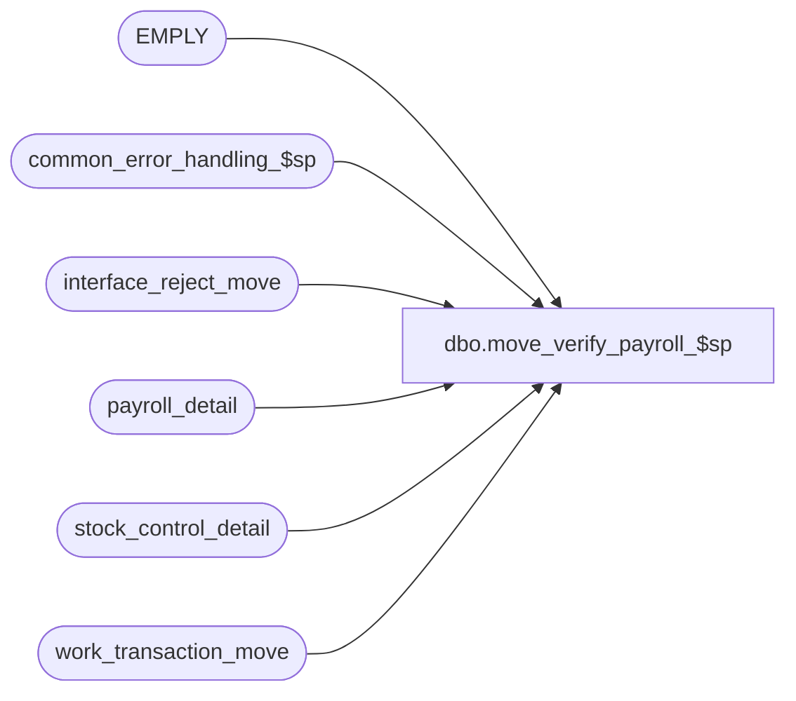

# dbo.move_verify_payroll_$sp

**Database:** auditworks  
**Server:** bedrockdb01  

## Architecture Diagram



## Table Dependencies

| Referenced Table |
|---|
| EMPLY |
| common_error_handling_$sp |
| interface_reject_move |
| payroll_detail |
| stock_control_detail |
| work_transaction_move |

## Stored Procedure Code

```sql
create proc dbo.move_verify_payroll_$sp 
@process_id	        binary(16),
@user_id                int,
@errmsg		        varchar(255)		OUTPUT
AS

/* Proc Name: move_verify_payroll_$sp
   Description: To check for if_rejections reason 82 where employee_no in payroll_detail is invalid.
    Called by move_interfaces_$sp.

HISTORY:
Date     Name		Def#   Desc
Apr20,11 Vicci          105917 Set memo1 and memo2 for I/F Reject reason 82.
Jul31,08 Paul           87777  Updated comments, code reviewed
Oct25,06 Phu            77931  Fix outer join for SQL 2005 Mode 90.
Nov17,04 Maryam       DV-1167  Check for EMPLY active flag.
Sep17,04 Maryam       DV-1146  Change user name to user_id.
Aug03,04 Maryam       DV-1071  When inserting #payroll_temp make e.EMPLY_NUM as employee_no
Apr28,04 Maryam       DV-1071  Receive @process_id and pass it to the common_error_handling_$sp. 
Apr28,04 Brett C      DV-1071  change employee table to EMPLY
Aug05,08 Vicci         103686  Change references to employee to be LEFT OUTER JOIN to avoid issues when employee is view instead of table.
Jan24,06 Vicci          66476  Treat inactive employees as invalid.
Apr19,02 Winnie       1-CD0IX  R3 error handling
Apr04,01 Phu             7501  Use system function to retrieve user name
         YIN                   author
*/

DECLARE @errno          int,
        @message_id	int,	
        @object_name	varchar(255),
        @operation_name	varchar(100),
        @process_name	varchar(100)
 
	

SELECT  @process_name = 'move_verify_payroll_$sp',
        @message_id = 201068

  SELECT wt.transaction_id,
         pd.line_id,
         pd.employee_no,
         CASE WHEN e.EMPLY_NUM IS NULL THEN 0 ELSE 1 END employee_on_file,
	 SUBSTRING(shift.vendor_no, 1, 255) employee_name
    INTO #payroll_temp
    FROM work_transaction_move wt
         INNER JOIN payroll_detail pd ON (wt.transaction_id = pd.transaction_id)
         LEFT JOIN EMPLY e ON (pd.employee_no = e.EMPLY_NUM AND e.ACTV = 1)
         LEFT OUTER JOIN stock_control_detail shift
                 ON pd.transaction_id = shift.transaction_id
                AND pd.line_id = shift.line_id
                AND shift.display_def_id = 58
   WHERE wt.process_id = @process_id
     AND pd.employee_no IS NOT NULL
     AND pd.employee_no > 0
 
SELECT @errno = @@error
IF @errno != 0
  BEGIN
	SELECT @errmsg = 'Failed to build #payroll_temp',
               @object_name = '#payroll_temp',
               @operation_name = 'CREATE'
	GOTO error
  END
  
INSERT interface_reject_move ( 
       process_id,
       if_reject_reason,
       transaction_id,
       line_id,
       memo1,
       memo2)
SELECT @process_id,
       82,
       transaction_id,
       line_id,
       employee_no,
       employee_name 
  FROM #payroll_temp
 WHERE employee_on_file = 0

SELECT @errno = @@error
IF @errno != 0
  BEGIN
	SELECT @errmsg = 'Failed to insert into interface_reject_move (reason=82)',
               @object_name = 'interface_reject_move',
               @operation_name = 'INSERT'
	GOTO error
  END

DROP TABLE #payroll_temp
SELECT @errno = @@error
IF @errno != 0
  BEGIN
	SELECT @errmsg = 'Failed to drop table #payroll_temp',
               @object_name = '#payroll_temp',
               @operation_name = 'DROP'
	GOTO error
  END

RETURN

error:   /* Common error handler. */

	EXEC common_error_handling_$sp 9, @errno, @errmsg, 0, @message_id, 
	@process_name, @object_name, @operation_name, 0, 1, 0, null, 0, null, null, 
	null, null, null, null, 0, @process_id, @user_id
	RETURN
```

