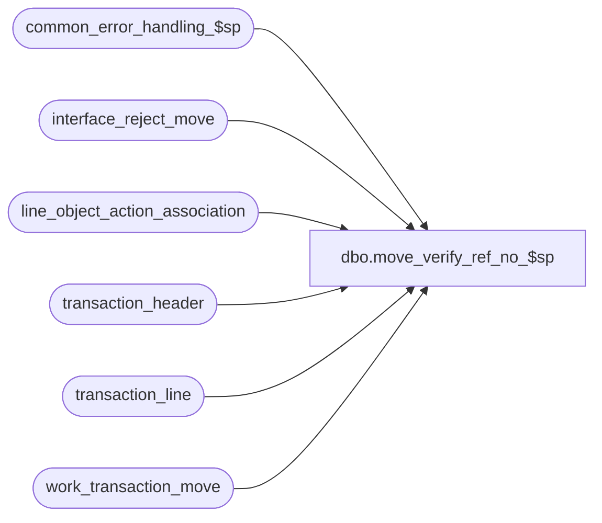

# dbo.move_verify_ref_no_$sp

**Database:** auditworks  
**Server:** bedrockdb01  

## Architecture Diagram



## Table Dependencies

| Referenced Table |
|---|
| common_error_handling_$sp |
| interface_reject_move |
| line_object_action_association |
| transaction_header |
| transaction_line |
| work_transaction_move |

## Stored Procedure Code

```sql
create proc dbo.move_verify_ref_no_$sp 
@process_id			binary(16),
@user_id			int

AS

/*
PROC NAME: move_verify_ref_no_$sp 
     DESC: To check for if_rejections (Required Reference_no not populated).
           called by move_interfaces_$sp. 	
HISTORY:
Date	  Name	    Defect#  Description
Jan04,11  Paul       105313  Use unicode datatypes
Sep17,04  Maryam    DV-1146  Use user_id.
Apr28,04  Maryam    DV-1071  Changed @process_id from int to binary(16) and pass @process_id to common_error_handling_$sp. 
Aug20,02  Winnie    1-D91OT  To allow reference_no to be set as optional.
Apr19,02  Winnie    1-CD0IX  R3 error handling	
Jun08,00  Daphna       4857  author
*/

DECLARE @errno int,
	@errmsg nvarchar(255),
        @message_id		int,	
	@object_name		nvarchar(255),
  	@operation_name		nvarchar(100),
  	@process_name		nvarchar(100)
 
SELECT @process_name = 'move_verify_ref_no_$sp',
       @message_id = 201068

SELECT wt.transaction_id,
       l.line_id,
       ref_no = ISNULL(LTRIM(reference_no),'-1')
  INTO #refno
  FROM work_transaction_move wt, transaction_line l, line_object_action_association la,
       transaction_header th
 WHERE wt.process_id = @process_id
   AND wt.transaction_id = l.transaction_id
   AND l.reference_type >= 1
   AND la.reference_no_option = 0
   AND la.transaction_category = th.transaction_category
   AND l.line_object = la.line_object
   AND l.line_action = la.line_action
   AND th.transaction_id = l.transaction_id

SELECT @errno = @@error
IF @errno != 0
BEGIN
  SELECT @errmsg = 'Failed to insert into #refno',
         @object_name = '#refno',
         @operation_name = 'CREATE'
  GOTO error
END

INSERT interface_reject_move ( 
       process_id,
       if_reject_reason,
       transaction_id,
       line_id)
SELECT @process_id,
       86,
       transaction_id,
       line_id
  FROM #refno
 WHERE ref_no like'-1'

SELECT @errno = @@error
IF @errno != 0
BEGIN
  SELECT @errmsg = 'Failed to insert into interface_reject_move (reason=86)',
         @object_name = 'interface_reject_move',
         @operation_name = 'INSERT'
  GOTO error
END

UPDATE transaction_line
   SET interface_rejection_flag = 1
  FROM interface_reject_move i,  transaction_line l
 WHERE i.process_id = @process_id
   AND i.if_reject_reason = 86
   AND i.transaction_id = l.transaction_id
   AND i.line_id = l.line_id

SELECT @errno = @@error
IF @errno != 0
BEGIN
      SELECT @errmsg = 'Failed to UPDATE transaction_line (type 86)',
             @object_name = 'transaction_line',
             @operation_name = 'UPDATE'
      GOTO error
END
   
RETURN

error:   /* Common error handler. */
	
	EXEC common_error_handling_$sp 9, @errno, @errmsg, 0, @message_id, 
	@process_name, @object_name, @operation_name, 0, 1, 0, null, 0, null, null, 
	null, null, null, null, 0, @process_id, @user_id
	RETURN
```

