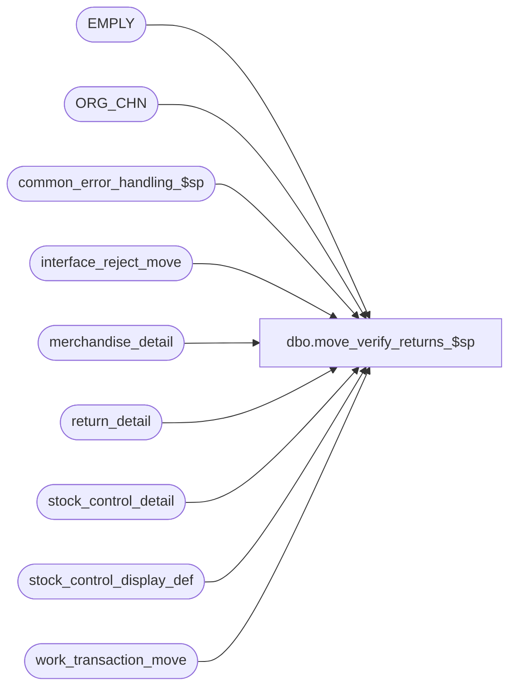

# dbo.move_verify_returns_$sp

**Database:** auditworks  
**Server:** bedrockdb01  

## Architecture Diagram



## Table Dependencies

| Referenced Table |
|---|
| EMPLY |
| ORG_CHN |
| common_error_handling_$sp |
| interface_reject_move |
| merchandise_detail |
| return_detail |
| stock_control_detail |
| stock_control_display_def |
| work_transaction_move |

## Stored Procedure Code

```sql
create proc dbo.move_verify_returns_$sp @store_check			tinyint, -- 0:no validation, 1:validate return_detail.return_from_store, 2:stock_control_detail.other_store_no, 3:both
@employee_check			tinyint, -- 0:no validation, 1:merch(salesperson), 2:return(salesperson), or 3:both
@process_id			binary(16),
@user_id			int,
@stock_origin_store_check	tinyint,
@merch_origin_store_check	tinyint,
@merch_source_store_check	tinyint,
@merch_fulfillment_store_check	tinyint

AS

/*
NAME: move_verify_returns_$sp 
DESCRIPTION: To check for if_rejections ( return store_no, nonsale other store_no, stock_control_detail
	     and merchandise_detail originating stores ).
	     Validate store numbers against ORG_CHN only since warehouse store numbers will not be valid for SA.
	     Called by move_merchandise_$sp. 

HISTORY:
Date      Name          Defect# Description
Jan04,11  Paul           105313 Use unicode datatypes
Apr18,08  Phu             96766 Separate merch and stock, return from store and stock control other store validations.
Sep13,05  Paul          DV-1312 Remove unnecessary drop statement, apply 29369 to SA5 for stock control validation but
				don't join to ORG_CHN_APLCTN_USG since warehouse stores may not exist there. Improve performance
				by removing joins to transaction line since move_interfaces_$sp already checks for voids.
Mar30,05  David         DV-1202 Validate source and fulfillment store.
Nov18,04  Maryam        DV-1167 Change employee table to EMPLY and Check for EMPLY active flag.
Sep17,04  Maryam        DV-1146 Use user_id.
Aug23,04  Sab           DV-1120 Remove local variable @aplctn_id and aplctn_id in auditwork_parameter since we hardcode aplctn_id to 300.
May25,04  David         DV-1071 Use ORG_CHN table as new the Store table.
Apr28,04  Maryam        DV-1071 changed @process_id from int to binary(16)
Apr28,04  Brett C       DV-1071 change employee table to EMPLY
Dec06,04  Daphna          29369         Check stores against store_sa (warehouse stores may not be
                                        set up in store_salesaudit), allow store_no = 0
                                        Validate for header_level attachments (line_id = 0)
                                        Validate for store_no NOT NULL depending on mandatory check 
May06,04  Daphna F 28700/1-VOT7S Lookup IF reject 10,110,111 against store_salesaudit in order to be consistent with EDIT 
                                 Added check of line void flag to IF rej 10
Aug16,02  HenryW        1-AUHY5 Added 2 new system I/F reject reasons = 110 and 111.
Jun28,02  HenryW        1-DWNRS Correct order of variables being passed in.
Apr19,02  Winnie        1-CD0IX R3 error handling
Jun01,00  John G           5678 Break down employee_no_check into component parts.
Feb28,97  Sebastiano V          Author
*/

DECLARE @errno 			int,
	@errmsg 		nvarchar(255),
	@message_id		int,	
	@object_name		nvarchar(255),
  	@operation_name		nvarchar(100),
  	@process_name		nvarchar(100)

SELECT @process_name = 'move_verify_returns_$sp',
       @message_id = 201068 

-- Create list of active stores to be used for validations (need not be valid for SA).


-- DEFECT #5678 - modify 'IF @employee_check >= 1' condition 
IF @employee_check IN (2, 3)
BEGIN

  INSERT interface_reject_move
         (process_id, if_reject_reason, transaction_id, line_id)
  SELECT @process_id, 81, wt.transaction_id, rd.line_id
    FROM work_transaction_move wt, return_detail rd
   WHERE wt.process_id = @process_id
     AND wt.transaction_id = rd.transaction_id
     AND rd.original_salesperson > 0
     AND rd.original_salesperson NOT IN (SELECT EMPLY_NUM 
                                           FROM EMPLY
                                          WHERE ACTV = 1)
  SELECT @errno = @@error
  IF @errno != 0
  BEGIN
    SELECT @errmsg = ' IF reject = 81: original_salesperson)',
	   @object_name = 'interface_reject_move',
	   @operation_name = 'INSERT'
    GOTO error
  END
  
  SELECT wt.transaction_id,
	 rd.line_id
    INTO #return_temp
    FROM work_transaction_move wt, return_detail rd
   WHERE wt.process_id = @process_id
     AND wt.transaction_id = rd.transaction_id
     AND rd.original_salesperson2 > 0
     AND rd.original_salesperson2 NOT IN (SELECT EMPLY_NUM 
                               FROM EMPLY WHERE ACTV = 1)  
  SELECT @errno = @@error
  IF @errno != 0
  BEGIN
    SELECT @errmsg = 'Failed to insert into #return_temp',
	   @object_name = '#return_temp',
	   @operation_name = 'CREATE'
    GOTO error
  END

  DELETE #return_temp
  FROM #return_temp r, interface_reject_move i
  WHERE i.process_id = @process_id
  AND if_reject_reason = 81
  AND r.transaction_id = i.transaction_id
  AND r.line_id = i.line_id
  
  SELECT @errno = @@error
  IF @errno != 0
  BEGIN
    SELECT @errmsg = ' Where IF rej 81 already recorded for this txn/line',
	   @object_name = '#return_temp',
	   @operation_name = 'DELETE'
    GOTO error
  END
	 
  INSERT interface_reject_move ( 
	 process_id,
	 if_reject_reason,
	 transaction_id,
	 line_id)
  SELECT @process_id,
	 81,
	 transaction_id,
	 line_id
   FROM #return_temp

  SELECT @errno = @@error
  IF @errno != 0
  BEGIN
    SELECT @errmsg = 'IF Rej 81: original_salesperson2',
	   @object_name = 'interface_reject_move',
	   @operation_name = 'INSERT'
    GOTO error
  END

  DROP TABLE #return_temp

END -- IF @employee_check IN (2, 3)

IF @store_check IN (1, 3)   /* Look for returns */
  BEGIN

  INSERT interface_reject_move 
         (process_id, if_reject_reason, transaction_id, line_id, memo1)
  SELECT DISTINCT @process_id, 9, rd.transaction_id, rd.line_id, CONVERT(nvarchar,return_from_store)
    FROM work_transaction_move wt, return_detail rd
   WHERE process_id = @process_id
     AND wt.transaction_id = rd.transaction_id
     AND return_from_store >= 0
     AND return_from_store NOT IN (SELECT ORG_CHN_NUM FROM ORG_CHN WHERE ACTV = 1)
     
   SELECT @errno = @@error
   IF @errno != 0
     BEGIN
	SELECT @errmsg = 'Failed to insert into interface_reject_move (reason=9)',
               @object_name = 'interface_reject_move',
               @operation_name = 'INSERT'
	GOTO error
     END
  END -- IF @store_check IN (1, 3)

IF @store_check IN (2, 3)
  BEGIN

   /* Other Store Validation (handles header and line levels) */

   INSERT interface_reject_move 
          (process_id, 	if_reject_reason, transaction_id, line_id, memo1)
   SELECT DISTINCT @process_id, 10, sc.transaction_id, sc.line_id, CONVERT(nvarchar,sc.other_store_no)
   FROM work_transaction_move wt, stock_control_detail sc
   WHERE process_id = @process_id
     AND wt.transaction_id = sc.transaction_id
     AND sc.other_store_no >= 0
     AND sc.other_store_no NOT IN (SELECT ORG_CHN_NUM FROM ORG_CHN WHERE ACTV = 1)
     AND sc.display_def_id IN (SELECT display_def_id
         		         FROM stock_control_display_def
         		        WHERE other_store_validation = 1
         		          AND other_store_no_fe_resource_id > 0)
   SELECT @errno = @@error
   IF @errno != 0
     BEGIN
	SELECT @errmsg = 'IF reject reason=10, other_store_validation',
               @object_name = 'interface_reject_move',
               @operation_name = 'INSERT'
	GOTO error
     END

   INSERT interface_reject_move 
          (process_id, 	if_reject_reason, transaction_id, line_id)
   SELECT DISTINCT @process_id, 10, sc.transaction_id, sc.line_id
   FROM work_transaction_move wt, stock_control_detail sc
   WHERE process_id = @process_id
     AND wt.transaction_id = sc.transaction_id
     AND sc.other_store_no IS NULL 
     AND sc.display_def_id IN (SELECT display_def_id
         		         FROM stock_control_display_def
         		        WHERE other_store_no_mandatory = 1
         		          AND other_store_no_fe_resource_id > 0)
   SELECT @errno = @@error
   IF @errno != 0
   BEGIN
     SELECT @errmsg = 'IF reject reason=10, other_store_mandatory)',
            @object_name = 'interface_reject_move',
            @operation_name = 'INSERT'
     GOTO error
   END
 
  END -- If @store_check IN (2, 3)


-- { Def 1-AUHY5. Check if originating store exists in stock_control_detail and merchandise_detail attachments.
IF @stock_origin_store_check > 0
BEGIN -- handle header and line levels

  INSERT interface_reject_move ( 
	 process_id,
	 if_reject_reason,
	 transaction_id,
	 line_id,
	 memo1)
  SELECT DISTINCT @process_id,
	 111,
	 sd.transaction_id,
	 sd.line_id,
	 CONVERT(nvarchar,sd.originating_store_no)
    FROM work_transaction_move wt,
	 stock_control_detail sd
   WHERE wt.process_id = @process_id
     AND wt.transaction_id = sd.transaction_id
     AND sd.originating_store_no >= 0 
     AND sd.originating_store_no NOT IN (SELECT ORG_CHN_NUM FROM ORG_CHN WHERE ACTV = 1)
     AND sd.display_def_id IN (SELECT display_def_id
         		         FROM stock_control_display_def
         		      WHERE original_store_validation = 1
         		          AND originating_str_fe_resource_id > 0)
  SELECT @errno = @@error
  IF @errno != 0
  BEGIN
    SELECT @errmsg = 'IF reject reason=111, original_store_validation',
	   @object_name = 'interface_reject_move',
	   @operation_name = 'INSERT'
    GOTO error
  END

  INSERT interface_reject_move ( 
	 process_id,
	 if_reject_reason,
	 transaction_id,
	 line_id)
  SELECT DISTINCT @process_id,
	 111,
	 sd.transaction_id,
	 sd.line_id
    FROM work_transaction_move wt,
	 stock_control_detail sd
   WHERE wt.process_id = @process_id
     AND wt.transaction_id = sd.transaction_id
     AND sd.originating_store_no IS NULL
     AND sd.display_def_id IN (SELECT display_def_id
         		         FROM stock_control_display_def
         		        WHERE originating_str_mandatory = 1
         		          AND originating_str_fe_resource_id > 0)
  SELECT @errno = @@error
  IF @errno != 0
  BEGIN
    SELECT @errmsg = 'IF reject reason=111, originating_str_mandatory',
	   @object_name = 'interface_reject_move',
	   @operation_name = 'INSERT'
    GOTO error
  END

END -- IF @stock_origin_store_check > 0

IF @merch_origin_store_check > 0
BEGIN
 INSERT interface_reject_move ( 
	 process_id,
	 if_reject_reason,
	 transaction_id,
	 line_id,
	 memo1)
  SELECT DISTINCT @process_id,
	 110,
	 md.transaction_id,
	 md.line_id,
	 CONVERT(nvarchar, md.originating_store_no)
    FROM work_transaction_move wt,
	 merchandise_detail md
   WHERE wt.process_id = @process_id
     AND wt.transaction_id = md.transaction_id
     AND md.originating_store_no >= 0 
     AND md.originating_store_no NOT IN (SELECT ORG_CHN_NUM FROM ORG_CHN WHERE ACTV = 1)
     
  SELECT @errno = @@error
  IF @errno != 0
  BEGIN
    SELECT @errmsg = 'Failed to insert into interface_reject_move (reason=110)',
	   @object_name = 'interface_reject_move',
	   @operation_name = 'INSERT'
    GOTO error
  END
END -- IF @merch_origin_store_check > 0
-- } Def 1-AUHY5.

IF @merch_source_store_check > 0
BEGIN
 INSERT interface_reject_move ( 
	 process_id,
	 if_reject_reason,
	 transaction_id,
	 line_id,
	 memo1)
  SELECT DISTINCT @process_id,
	 114,
	 md.transaction_id,
	 md.line_id,
	 CONVERT(nvarchar, md.source_store_no)
    FROM work_transaction_move wt,
	 merchandise_detail md
   WHERE wt.process_id = @process_id
     AND wt.transaction_id = md.transaction_id
     AND md.source_store_no IS NOT NULL
     AND md.source_store_no NOT IN (SELECT ORG_CHN_NUM FROM ORG_CHN WHERE ACTV = 1)
     
  SELECT @errno = @@error
  IF @errno != 0
  BEGIN
    SELECT @errmsg = 'Failed to insert into interface_reject_move (reason=114)',
	   @object_name = 'interface_reject_move',
	   @operation_name = 'INSERT'
    GOTO error
  END
END -- IF @merch_source_store_check > 0

IF @merch_fulfillment_store_check > 0
BEGIN
 INSERT interface_reject_move ( 
	 process_id,
	 if_reject_reason,
	 transaction_id,
	 line_id,
	 memo1)
  SELECT DISTINCT @process_id,
	 115,
	 md.transaction_id,
	 md.line_id,
	 CONVERT(nvarchar, md.fulfillment_store_no)
    FROM work_transaction_move wt,
	 merchandise_detail md
   WHERE wt.process_id = @process_id
     AND wt.transaction_id = md.transaction_id
     AND md.fulfillment_store_no IS NOT NULL -- 
     AND md.fulfillment_store_no NOT IN (SELECT ORG_CHN_NUM FROM ORG_CHN WHERE ACTV = 1)
     
SELECT @errno = @@error
  IF @errno != 0
  BEGIN
    SELECT @errmsg = 'Failed to insert into interface_reject_move (reason=115)',
	   @object_name = 'interface_reject_move',
	   @operation_name = 'INSERT'
    GOTO error
  END
END -- IF @merch_fulfillment_store_check > 0

RETURN

error:   /* Common error handler. */

	EXEC common_error_handling_$sp 9, @errno, @errmsg, 0, @message_id, 
	@process_name, @object_name, @operation_name, 0, 1, 0, null, 0, null, null, 
	null, null, null, null, 0, @process_id, @user_id 
	RETURN
```

