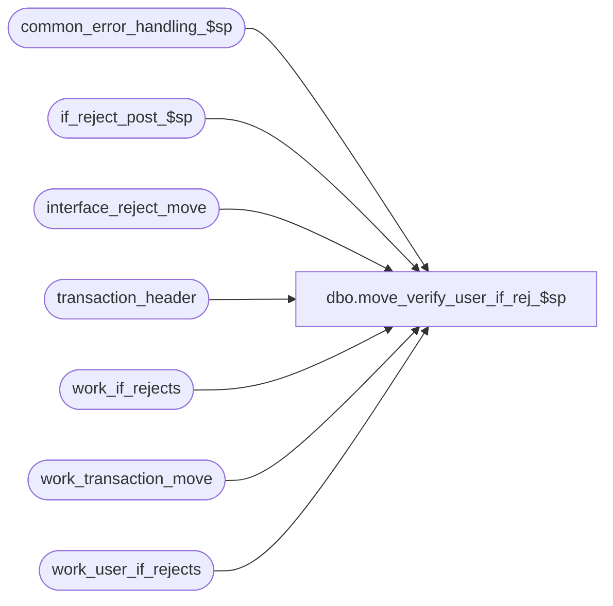

# dbo.move_verify_user_if_rej_$sp

**Database:** auditworks  
**Server:** bedrockdb01  

## Architecture Diagram



## Table Dependencies

| Referenced Table |
|---|
| common_error_handling_$sp |
| if_reject_post_$sp |
| interface_reject_move |
| transaction_header |
| work_if_rejects |
| work_transaction_move |
| work_user_if_rejects |

## Stored Procedure Code

```sql
create proc dbo.move_verify_user_if_rej_$sp 
@process_id	binary(16),
@user_id        int,
@errmsg		nvarchar(255) OUTPUT

AS

/*

PROC NAME: move_verify_user_if_rej_$sp
     DESC: This routine will verify if there are User Defined IF Rejects.
     	   If there are rejects, then populate the if_rejection_reason table
     	   from the work_user_if_rejects table.
           Called by move_interface_$sp. 

HISTORY:

Date     Name     Def#    Desc
Jan04,11 Paul      105313 Use unicode datatypes
Jul04,05 Paul     DV-1239 use @rdbms_process_id to match dynamic sql
Dec20,04 David    DV-1191 Use aliases to avoid ambiguous column name error.
Sep17,04 Maryam   DV-1146 Use user_id.
Apr28,04 Maryam   DV-1071 Receive @process_id and pass it to the common_error_handling_$sp
Apr19,02 Winnie   1-CD0IX R3 error handling
May04,01 Henry    7369    Author.

*/

DECLARE
  @errno		int,
  @rows			int,
  @message_id		int,	
  @object_name		nvarchar(255),
  @operation_name	nvarchar(100),
  @process_name		nvarchar(100),
  @rdbms_process_id	binary(16)
  
  
SELECT @process_name = 'move_verify_user_if_rej_$sp',
       @message_id = 201068,
       @rdbms_process_id = @@spid 

BEGIN

  DELETE work_if_rejects
  WHERE process_id = @rdbms_process_id

  SELECT @errno = @@error 
  IF @errno != 0 
  BEGIN 
    SELECT @errmsg = 'Failed to DELETE work_if_rejects (1)' ,
           @object_name = 'work_if_rejects',
           @operation_name = 'DELETE'
    GOTO error 
  END 

  INSERT work_if_rejects (
	process_id,
	transaction_id,
	if_reject_reason )
  SELECT DISTINCT @rdbms_process_id,
	wm.transaction_id,
	0
   FROM work_transaction_move wm WITH (NOLOCK), 
	transaction_header th WITH (NOLOCK)
  WHERE wm.process_id = @process_id
    AND wm.transaction_id = th.transaction_id
    AND th.date_reject_id = 0
    AND th.transaction_void_flag IN (0,8)
    AND th.sa_rejection_flag = 0

  SELECT @errno = @@error
  IF @errno != 0
  BEGIN
    SELECT @errmsg = 'Failed to INSERT work_if_rejects',
           @object_name = 'work_if_rejects',
           @operation_name = 'INSERT'
    GOTO error
  END

  EXEC if_reject_post_$sp @rdbms_process_id, @user_id, @errmsg OUTPUT

  SELECT @errno = @@error
  IF @errno != 0
    BEGIN
    IF @errmsg IS NULL
    SELECT @errmsg = 'Failed to execute stored procedure if_reject_post_$sp'
    SELECT @object_name = 'if_reject_post_$sp',
           @operation_name = 'EXECUTE'
       GOTO error
    END

  INSERT interface_reject_move (
	process_id,
	if_reject_reason,
	transaction_id,
	line_id )
  SELECT @process_id,
	if_reject_reason,
	transaction_id,  
	line_id
   FROM work_user_if_rejects WITH (NOLOCK)
  WHERE process_id = @rdbms_process_id

  SELECT @errno = @@error
  IF @errno != 0
  BEGIN
    SELECT @errmsg = 'Failed to INSERT into interface_reject_move for User Defined IF Rejects.',
           @object_name = 'interface_reject_move',
           @operation_name = 'INSERT'
    GOTO error
  END

  DELETE work_if_rejects
  WHERE process_id = @rdbms_process_id

  SELECT @errno = @@error 
  IF @errno != 0 
  BEGIN 
    SELECT @errmsg = 'Failed to DELETE work_if_rejects (2)' ,
           @object_name = 'work_if_rejects',
           @operation_name = 'DELETE'
    GOTO error 
  END 

  DELETE work_user_if_rejects
  WHERE process_id = @rdbms_process_id

  SELECT @errno = @@error 
  IF @errno != 0 
  BEGIN 
    SELECT @errmsg = 'Failed to DELETE work_user_if_rejects' ,
           @object_name = 'work_user_if_rejects',
           @operation_name = 'DELETE'
    GOTO error 
  END 

END

RETURN

error:   /* Common error handler. */

	EXEC common_error_handling_$sp 100, @errno, @errmsg, 0, @message_id, 
	@process_name, @object_name, @operation_name, 0, 1, 0, null, 0, null, null, 
	null, null, null, null, 0, @process_id, @user_id
	RETURN
```

