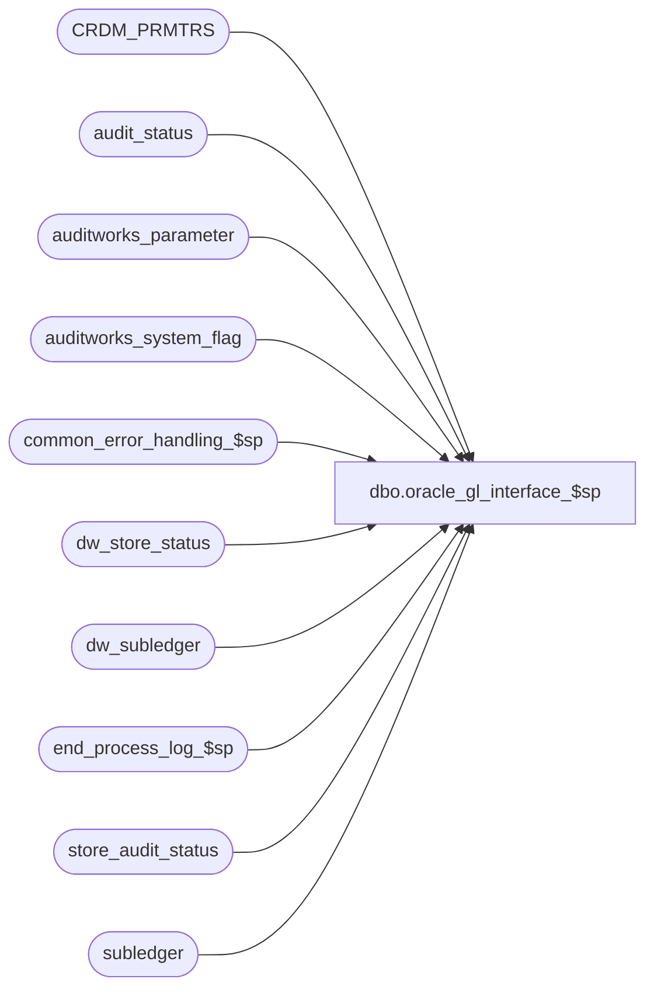

# dbo.oracle_gl_interface_$sp

**Database:** auditworks  
**Server:** bedrockdb01  

## Architecture Diagram



## Table Dependencies

| Referenced Table |
|---|
| CRDM_PRMTRS |
| audit_status |
| auditworks_parameter |
| auditworks_system_flag |
| common_error_handling_$sp |
| dw_store_status |
| dw_subledger |
| end_process_log_$sp |
| store_audit_status |
| subledger |

## Stored Procedure Code

```sql
create proc dbo.oracle_gl_interface_$sp 
@period_ending_date		smalldatetime,
@journal_entry_description 	nchar(29),
@last_date_closed		smalldatetime

 AS
/* Proc name:   oracle_gl_interface_$sp
** Description: supports Oracle gl layout
** 	Called from period_end_$sp.

    *** NOTE : CURRENTLY NOT SUPPORTED IN MSSQL. NEEDS TO BE PORTED FROM ORACLE ***

** HISTORY:

Date     Name        Def# Desc
Jan31,11 Paul      105313 Use unicode datatypes
Nov12,10 Paul      121833 update dw_subledger on consolidated
Jan17,03 ShuZ     1-HZ3U2 Change double quote to single quote
Jul05,01 Winnie      8166 To correct the process no.
Mar23,01 Winnie      7450 Check gl_interface_timing for daily GL, move out all the recurring logic of all the GL interface and put it in period end. 
*/
		
DECLARE
	@clndr_id				binary(16),
	@lvl_month				binary(16),
	@current_date				smalldatetime,
	@errmsg 				nvarchar(255),
	@errno 					int,
	@instance_id				int,
	@loop_date				smalldatetime,
	@process_log_entry 			tinyint,
	@process_no				smallint,
	@process_timestamp 			float,
	@rows					int,
	@scaleout_flag				int,
	@scaleout_gl_export_on_peri		tinyint,
	@transaction_count 			numeric(12,0),
	@message_id				int,
	@object_name				nvarchar(255),
	@process_name				nvarchar(100),
	@operation_name				nvarchar(100)

SELECT @process_name = 'oracle_gl_interface_$sp',
	@message_id = 201068,
	@process_no = 205,
	@current_date = getdate(),
	@errno = 0

SELECT 	@scaleout_flag = 0,
	@scaleout_gl_export_on_peri = 0,
	@instance_id = 0

SELECT @scaleout_flag = flag_numeric_value
  FROM auditworks_system_flag
 WHERE flag_name = 'scaleout_flag'

SELECT @scaleout_gl_export_on_peri = CONVERT(tinyint,par_value)
  FROM auditworks_parameter 
 WHERE par_name = 'scaleout_gl_export_on_peri'

SELECT @instance_id = flag_numeric_value
  FROM auditworks_system_flag
 WHERE flag_name = 'instance_id'

SELECT @clndr_id = PRMTR_VAL_BIN
  FROM CRDM_PRMTRS
 WHERE PRMTR_NAME = 'GL_PSTNG_CLNDR_ID'

SELECT @errno = @@error, @rows = @@rowcount
IF @rows = 0 AND @errno = 0
  SELECT @errno = 201612
IF @errno <> 0
  BEGIN
	SELECT @errmsg = 'Unable to select calendar id',
	       @object_name = 'CRDM_PRMTRS',
	       @operation_name = 'SELECT'
	GOTO error
  END

SELECT @lvl_month = par_bin_value
  FROM auditworks_parameter
 WHERE par_name = 'clndr_lvl_month'

SELECT @errno = @@error
IF @errno <> 0
  BEGIN
	SELECT @errmsg = 'Unable to select month level id',
	       @object_name = 'auditworks_parameter',
	       @operation_name = 'SELECT'
	GOTO error
  END

SELECT @process_no = 208,
       @errno = 202502,
       @errmsg = 'Oracle Interface is currently not supported in Mssql. Verify gl interface set up.'
       
GOTO error

BEGIN TRAN


/* place ported logic here */


/* Set subledger posting status to yes */
  
  UPDATE subledger
    SET posting_status = 1,
	gl_posting_datetime = @current_date
   WHERE posting_status = 0
     AND transaction_date > @last_date_closed
     AND transaction_date <= @period_ending_date

  SELECT @errno = @@error
  IF @errno <> 0
    BEGIN
     SELECT @errmsg = 'Failed to update subledger with posting_status to 1',
	@object_name = 'subledger',
        @operation_name = 'UPDATE'
     GOTO error
    END

  /* If running export on peripheral, also need to set posted_status in subledger on consolidated */
  IF @scaleout_gl_export_on_peri = 1 AND @scaleout_flag = 1 -- THEN 
    BEGIN
    /* Using loop to batch by date and to improve scaleout query plan */
    SELECT @loop_date = DATEADD(dd,1,@last_date_closed)

    WHILE @loop_date <= @period_ending_date
    BEGIN
	      UPDATE dw_subledger
	         SET posting_status = 1,
	             gl_posting_datetime = @current_date
	       WHERE posting_status = 0
	         AND transaction_date = @loop_date 
	         AND store_no
	             IN (SELECT DISTINCT store_no
	                 FROM subledger
	                 WHERE transaction_date = @loop_date
	                   AND posting_status >= 1)

		  SELECT @errno = @@error
		  IF @errno <> 0
		    BEGIN
		     SELECT @errmsg = 'Failed to update dw_subledger with posting_status to 1',
			@object_name = 'dw_subledger',
			@operation_name = 'UPDATE'
			GOTO error
		    END
	SELECT @loop_date = DATEADD(dd,1,@loop_date)
    END -- While
    END -- If @scaleout_gl_export_on_peri = 1


  UPDATE audit_status
    SET audit_status = 500,
       status_date =  @current_date
   WHERE audit_status = 400
     AND sales_date > @last_date_closed
     AND sales_date <= @period_ending_date

  SELECT @errno = @@error
  IF @errno <> 0
    BEGIN
     SELECT @errmsg = 'Failed to update audit_status to 500 from 400',
	@object_name = 'audit_status',
        @operation_name = 'UPDATE'
     GOTO error
    END

  UPDATE store_audit_status
    SET store_audit_status = 500,
        store_status_date = @current_date
   WHERE store_audit_status = 400
     AND sales_date > @last_date_closed
     AND sales_date <= @period_ending_date

  SELECT @errno = @@error
  IF @errno <> 0
    BEGIN
     SELECT @errmsg = 'Failed to update store_audit_status to 500 from 400',
	@object_name = 'store_audit_status',
        @operation_name = 'UPDATE'
     GOTO error
    END

  UPDATE dw_store_status
     SET store_status = 3
   WHERE store_status = 2 
     AND subledger_copied_flag = 1
     AND sales_date > @last_date_closed
     AND sales_date <= @period_ending_date
     AND instance_id = @instance_id

  SELECT @errno = @@error
  IF @errno <> 0
    BEGIN
	SELECT @errmsg = 'Unable to set store_status to 3 from 2',
	       @object_name = 'dw_store_status',
	       @operation_name = 'UPDATE'
	GOTO error
    END

COMMIT TRAN

IF @process_log_entry = 1
  BEGIN
    EXEC end_process_log_$sp @process_no, @process_timestamp, @transaction_count
    SELECT @errno = @@error
    IF @errno <> 0
      BEGIN
       SELECT @errmsg = 'Failed to EXECUTE end_process_log_$sp',
  	      @object_name = 'end_process_log_$sp',
              @operation_name = 'EXECUTE'
       GOTO error
      END
  END

RETURN


error:   /* Common error handler */

	EXEC common_error_handling_$sp @process_no, @errno, @errmsg, 0, @message_id, 
	  @process_name, @object_name, @operation_name, 1, 1, 1, @process_timestamp, @transaction_count

	RETURN
```

