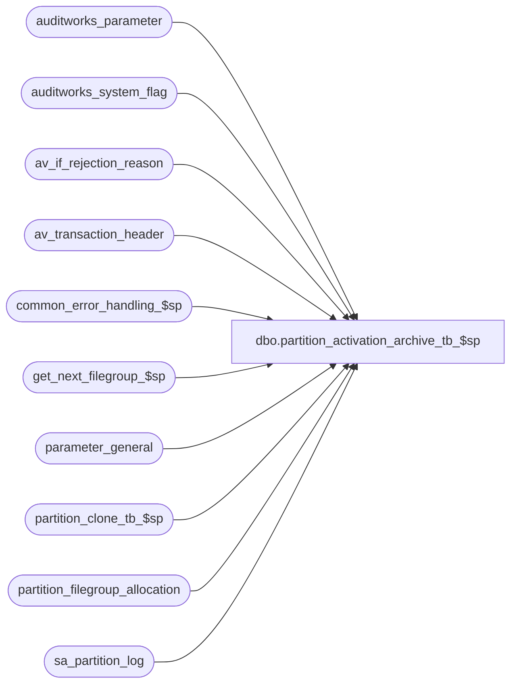

# dbo.partition_activation_archive_tb_$sp

**Database:** auditworks  
**Server:** bedrockdb01  

## Architecture Diagram



## Table Dependencies

| Referenced Table |
|---|
| auditworks_parameter |
| auditworks_system_flag |
| av_if_rejection_reason |
| av_transaction_header |
| common_error_handling_$sp |
| get_next_filegroup_$sp |
| parameter_general |
| partition_clone_tb_$sp |
| partition_filegroup_allocation |
| sa_partition_log |

## Stored Procedure Code

```sql
CREATE proc [dbo].[partition_activation_archive_tb_$sp] @repartition_following_db_init	tinyint = 0  --0=partition activation;  
                                             --1=repartition EMPTY archive tables in accordance with revised parameters or initialized data (for example following database initialization)
AS

/*

Proc name: partition_activation_archive_tb_$sp
     Desc: Utility to initialize or create archive partition function (which defines the date-ranges for each partition) and partition scheme (which assigns each partition to a filegroup)
           based on parameter_general.last_date_closed, the auditworks_parameter table's partition_days and partition_min_trans_qty and 
           the partition_filegroup_allocation table, all of which are set when the partitioning activation request is made during installation 
           (in response to the DevStudio archive_partitioning_activation and sa_company_setup INSTL prompts).  
           When there is no data in the archive (fresh installation), the utility then partitions the archive tables into:
           	-An empty partition for dates <= last-date-closed;
           	-One partition per date range for dates between last date closed and today, based on auditworks_parameter partition_days;
           	-An empty partition for dates beyond today.
           When there is data in the archive (after-the-fact implementation), the utility then partitions the archive tables into:
           	-An empty partition for dates < the earliest of the earliest date in the archive and the last date closed;
           	-One partition per date range for dates earlier than the archive retention period, based on auditworks_parameter partition_days 
           	 or whatever larger number of days is required to avoid exceeding the pre-2016 SP1 999 partition limitation (which we don't wan't
           	 to exceed for performance reasons anyhow), adjust to accomodate the extra six days the partition maintenance will do before 1st 
           	 cleanup runs;
           	-One partition per date range for dates between the archive retention period and today, based on auditworks_parameter partition_days;
           	-An empty partition for dates beyond today.           	
           
           Called from DevStudio release_finalization_steps EPILOG to activate partitioning or by util_init_database_$sp to initialize partitions.
           
           Timings may be reviewed in sa_partition_log.
           
           It's run once only for existing/new SA5 clients who wish to partition 22 tables, i.e. 20 archive tables 
           (av_...) and 2 joint current/archive (cust_liab_auto_compl_line, tax_exception_transaction)
           namely:
	   ('av_transaction_missing', 'cust_liab_auto_compl_line', 'av_authorization_detail', 'av_customer', 
	    'av_customer_detail', 'av_discount_detail', 'av_line_note', 'av_merchandise_detail', 'av_payroll_detail', 
	    'av_post_void_detail', 'av_return_detail', 'av_special_order_detail', 'av_stock_control_detail', 
	    'av_tax_override_detail', 'tax_exception_transaction', 'av_tax_detail', 'av_transaction_line_link', 
	    'av_transaction_line', 'av_interface_control', 'av_exception_reason', 'av_if_rejection_reason', 
	    'av_transaction_header')           
	   ...or by a TPL initializing a database in preparation for a new round of testing or live.

HISTORY:
Date     Name       Defect#    Description
Spe13,17 Sean/Terri DAOM-2537 Changing various variables datatype to nvarchar(max) and increase partition limitation 
Jun01,12 Vicci      134811    copy of util_partition_archive_tb_$sp adjusted to remove usage of sa_partition_data and to handle
                            extended archive which may exceed 7 years and to actually partition tables and to verify that their date
                            has been set and to suppor re-partitioning empty archive tables in accordance with new parameters (for example
                            following database initialization). 
Sep29,08 Phu         95126    Initial development

*/

DECLARE
  @archive_days_retained                 smallint,
  @date_ranges                           nvarchar(MAX),
  @errmsg                                nvarchar(2000),
  @errno                                 int,
  @file_groups                           nvarchar(MAX),
  @last_filegroup                        sysname,
  @message_id                            int,
  @next_filegroup                        sysname,
  @process_no                            smallint,
  @object_name                           nvarchar(255),
  @operation_name                        nvarchar(100),
  @partition_days                        smallint,
  @partition_function_sql                nvarchar(MAX),
  @partition_scheme_sql                  nvarchar(MAX),
  @partitioning_in_use                   smallint,
  @process_id                            binary(16),
  @process_name                          nvarchar(100),
  @rows                                  int,
  @start_date                            smalldatetime,
  @user_id                               int,
  @last_date_closed			 smalldatetime,
  @min_av_trans_date           		 smalldatetime,
  @max_av_trans_date           		 smalldatetime,
  @partition_min_trans_qty		 int,
  @ext_av_partition_days		 int,
  @extended_archive_date		 smalldatetime,
  @trans_date_fix_sql 			 nvarchar(2000), 
  @fix_date_table_name 			 sysname,
  @default 			 	 sysname,
  @trans_date_default_fix_sql 		 nvarchar(2000),
  @rows_per_batch			 int,
  @rows_updated				 int,
  @cursor_open				 tinyint,
  @sql_cmd 			 	 nvarchar(2000)

SET CONCAT_NULL_YIELDS_NULL OFF
SET DATEFORMAT mdy

SELECT @message_id = 201068,
       @process_name = 'partition_activation_archive_tb_$sp',
       @process_id = NEWID(),
       @user_id = SUSER_ID(SUSER_SNAME()),
       @process_no = 11,  --Conversion  (note:  this is the only function that partition_clone_tb_$sp logs to the partition_log)
       @partition_function_sql = 'CREATE PARTITION FUNCTION ArchiveTransactionPF(smalldatetime) AS RANGE RIGHT FOR VALUES (',
       @partition_scheme_sql = 'CREATE PARTITION SCHEME ArchiveTransactionPS AS PARTITION ArchiveTransactionPF TO ('

-- Verify if partitioning is turned on
SELECT @partitioning_in_use = flag_numeric_value
  FROM auditworks_system_flag
 WHERE flag_name = 'partitioning_in_use'
SELECT @errno = @@error
IF @errno != 0
BEGIN
  SELECT @errmsg = 'Unable to retrieve partitioning_in_use',
         @object_name = 'auditworks_system_flag',
         @operation_name = 'SELECT'
  GOTO error
END
IF @partitioning_in_use = 1 AND @repartition_following_db_init = 0
BEGIN
  SELECT 'Partitioning is already active.  Skipping request.'
  UPDATE auditworks_system_flag 
     SET flag_numeric_value = 0, flag_numeric_initialize_value = 0
   WHERE flag_name = 'av_partition_install_request'
     AND flag_numeric_value = 1
  SELECT @errno = @@error
  IF @errno != 0
  BEGIN
    SELECT @errmsg = 'Unable to mark partitioning request as being skipped since already active',
           @object_name = 'auditworks_system_flag',
           @operation_name = 'UPDATE'
    GOTO error
  END
  SELECT @errno = 201500,
         @errmsg = 'Partitioning is already active.  Skipping request.',
         @object_name = 'auditworks_system_flag',
         @operation_name = 'SELECT'
  GOTO error
END
IF @partitioning_in_use IS NULL
BEGIN
  INSERT INTO auditworks_system_flag
            (flag_name, flag_numeric_value, flag_comment, flag_numeric_initialize_value)
  VALUES ('partitioning_in_use', 0, 'Used to indicate whether the archive tables will be partitioned or not', 0)
  SELECT @errno = @@error
  IF @errno != 0
  BEGIN
    SELECT @errmsg = 'Unable to insert row for partitioning_in_use',
           @object_name = 'auditworks_system_flag',
           @operation_name = 'INSERT'
    GOTO error
  END
END

--If av_transaction_header is defined as a view it means we are on the peripheral in a scaleout environment and cannot execute partitioning in this database
IF EXISTS (SELECT 1
             FROM sysobjects WITH (NOLOCK)
            WHERE type = 'V'
              AND id = Object_id('dbo.av_transaction_header'))
BEGIN
  IF @repartition_following_db_init = 0
  BEGIN
    SELECT @errno = 201500,
    	   @errmsg = 'Peripheral databases in a scaleout environment do not have archive tables but only views of those in the consolidated database.  Please run partitioning in consolidated (data warehouse) database only instead.',
           @object_name = 'sysobjects',
           @operation_name = 'SELECT'
    GOTO error
  END
  ELSE
    RETURN
END

-- Verify if the filegroup(s) has(ve) been allocated for partitioning
SELECT @rows = COUNT(1)
 FROM partition_filegroup_allocation  ----Set by DevStudio archive_partitioning_activation INSTL
SELECT @errno = @@error
IF @errno != 0
BEGIN
  IF @errno = 208 -- table not exist
  BEGIN
    SELECT @errmsg = 'Please create table partition_filegroup_allocation and populate data rows before running this proc.'
  END
  ELSE 
  BEGIN
    SELECT @errmsg = 'Unable to retrieve row counts'
  END
  
  SELECT @object_name = 'partition_filegroup_allocation',
         @operation_name = 'SELECT'
  GOTO error
END
IF @rows = 0
BEGIN
  SELECT @errno = 201500,
         @errmsg = 'Please allocate filegroup(s) in table partition_filegroup_allocation before running this proc or activate in the standard manner via the S/A installation',
         @object_name = 'partition_filegroup_allocation',
         @operation_name = 'SELECT'
  GOTO error
END

-- Verify that the flag used to track the last filegroup in which a partition was created exists
SELECT @last_filegroup = flag_alpha_value
  FROM auditworks_system_flag
 WHERE flag_name = 'last_filegroup_used'
SELECT @errno = @@error, @rows = @@rowcount
IF @errno != 0
BEGIN
  SELECT @errmsg = 'Unable to retrieve last_filegroup_used',
         @object_name = 'auditworks_system_flag',
         @operation_name = 'SELECT'
  GOTO error
END
IF @rows = 0
BEGIN
  INSERT INTO auditworks_system_flag (flag_name, flag_alpha_value, flag_comment, flag_alpha_initialize_value)
  VALUES ('last_filegroup_used', NULL, 'Used to keep track of the last filegroup used in partitioning so that the next filegroup can be determined.', NULL)
  SELECT @errno = @@error
  IF @errno != 0
  BEGIN
    SELECT @errmsg = 'Unable to insert row for last_filegroup_used',
           @object_name = 'auditworks_system_flag',
           @operation_name = 'INSERT'
    GOTO error
  END
END

-- Determine whether the number of days per partition has been configured
SELECT @partition_days = par_value  --Set by DevStudio archive_partitioning_activation INSTL
  FROM auditworks_parameter
 WHERE par_name = 'partition_days'
SELECT @errno = @@error
IF @errno != 0
BEGIN
  SELECT @errmsg = 'Unable to retrieve partition_days',
         @object_name = 'auditworks_parameter',
         @operation_name = 'SELECT'
  GOTO error
END

IF COALESCE(@partition_days, 0) = 0
BEGIN
  SELECT @errno = 201500,
         @errmsg = 'Please indicate the number of days per partition (partition_days) in auditworks_parameter before running this stored procedure or activate in the standard manner via the S/A installation',
         @object_name = 'auditworks_parameter',
         @operation_name = 'SELECT'
  GOTO error
END

IF @partition_days = 16  --assume bi-monthly
  SELECT @partition_days = 15

IF @partition_days IN (28, 29, 31) --assume monthly partition
  SELECT @partition_days = 30

IF @repartition_following_db_init = 0
BEGIN
  /* ******************************************************************************************************** */
  --Verify that all archive tables have a transaction_date column and that it does not allow nulls (since it was added allowing nulls for clients originally installed with an earlier release then upgraded to 5.1
  SELECT @rows_per_batch = CONVERT(integer,ISNULL(par_value,'10000'))
    FROM auditworks_parameter
   WHERE par_name = 'rows_per_batch'
  SELECT @errno = @@error
  IF @errno <> 0
  BEGIN
    SELECT @errmsg = 'Unable to select from auditworks_parameter (rows_per_batch)',
  	   @object_name = 'auditworks_parameter',
	   @operation_name = 'SELECT'
    GOTO error
  END

  SELECT @default = d.name
    FROM sysobjects t, syscolumns c, sysobjects d
   WHERE t.type = 'U' and t.name = 'av_if_rejection_reason'
     AND t.id = c.id and c.name = 'transaction_date'
     AND c.cdefault = d.id
  SELECT @errno = @@error
  IF @errno <> 0
  BEGIN
    SELECT @errmsg = 'Unable to determine if a default value has been assigned to av_if_rejection_reason.transaction_date',
  	   @object_name = 'sysobjects',
	   @operation_name = 'SELECT'
    GOTO error
  END

  IF @default IS NOT NULL
  BEGIN
    INSERT INTO sa_partition_log (
           entry_date,
           table_name,
           log_message)
    SELECT getdate(),
           'av_if_rejection_reason',
           'Removing transaction_date default and correcting it to match av_transaction_header date.'
    SELECT @errno = @@error
    IF @errno != 0
    BEGIN
      SELECT @errmsg = 'Failed to insert transaction_date default removal to sa_partition_log',
             @object_name = 'sa_partition_log',
             @operation_name = 'INSERT'
      GOTO error
    END

    SELECT @trans_date_default_fix_sql = 'alter table av_if_rejection_reason drop constraint ' + @default,
           @rows_updated = @rows_per_batch
    WHILE @rows_updated = @rows_per_batch
    BEGIN
      UPDATE av_if_rejection_reason SET transaction_date = h.transaction_date FROM av_transaction_header h WHERE av_if_rejection_reason.transaction_date <> h.transaction_date AND av_if_rejection_reason.av_transaction_id = h.av_transaction_id
      SELECT @errno = @@error, @rows_updated = @@rowcount
      IF @errno <> 0
      BEGIN
        SELECT @errmsg = 'Unable to correct transaction_date in av_if_rejection_reason',
	       @object_name = 'av_if_rejection_reason',
	       @operation_name = 'UPDATE'
        GOTO error
      END 
    END
    BEGIN TRY
      EXEC sp_executesql @trans_date_default_fix_sql
    END TRY
    BEGIN CATCH
      SELECT @errno = @@error, 
             @errmsg = 'Failed to remove default from av_if_rejection_reason transaction_date' + ERROR_MESSAGE(),
             @object_name = 'av_if_rejection_reason',
             @operation_name = 'ALTER TABLE'
      GOTO error
    END CATCH	
  END

  DECLARE null_trans_date_fix_cursor CURSOR FAST_FORWARD
      FOR
   SELECT t.name
     FROM sysobjects t
    WHERE t.type = 'U'
      AND t.name in ('av_authorization_detail', 'av_customer', 'av_customer_detail', 'av_discount_detail', 'av_exception_reason', 'av_if_rejection_reason', 'av_interface_control', 'av_line_note', 'av_merchandise_detail', 'av_payroll_detail', 'av_post_void_detail', 'av_return_detail', 'av_special_order_detail', 'av_stock_control_detail', 'av_tax_detail', 'av_tax_override_detail', 'av_transaction_line', 'av_transaction_line_link', 'tax_exception_transaction')
  SELECT @errno = @@error 
  IF @errno != 0
  BEGIN
    SELECT @errmsg = 'Unable to prepare list of archive transaction tables that used to allowed null in transaction_date field in earlier releases',
           @object_name = 'null_trans_date_fix_cursor',
           @operation_name = 'DECLARE'
    GOTO error
  END

  OPEN null_trans_date_fix_cursor
  SELECT @errno = @@error
  IF @errno != 0
  BEGIN
    SELECT @errmsg = 'Failed to open null_trans_date_fix_cursor',
           @object_name = 'null_trans_date_fix_cursor',
           @operation_name = 'OPEN'
    GOTO error
  END
  SELECT @cursor_open = 1

  FETCH null_trans_date_fix_cursor
   INTO @fix_date_table_name
  SELECT @errno = @@error 
  IF @errno != 0
  BEGIN
    SELECT @errmsg = 'Unable to retrieve list of archive transaction tables that used to allowed null in transaction_date field in earlier releases',
           @object_name = 'null_trans_date_fix_cursor',
           @operation_name = 'FETCH'
    GOTO error
  END

  WHILE @@fetch_status = 0 
  BEGIN
    INSERT INTO sa_partition_log (
           entry_date,
           table_name,
           log_message)
    SELECT getdate(),
           @fix_date_table_name,
           'Setting transaction_date to match av_transaction_header date and altering table to disallow nulls.'
    SELECT @errno = @@error
    IF @errno != 0
    BEGIN
      SELECT @errmsg = 'Failed to insert transaction_date null prevention correction to sa_partition_log',
             @object_name = 'sa_partition_log',
             @operation_name = 'INSERT'
      GOTO error
    END

    SELECT @rows_updated = @rows_per_batch
    SELECT @trans_date_fix_sql = '
     IF NOT EXISTS (SELECT c.name
  	              FROM sysobjects t
	              INNER JOIN syscolumns c
 	  	         ON t.id = c.id 
 	  	        AND c.name = ''transaction_date''
 	  	        AND c.isnullable = 0
	             WHERE t.type = ''U''
	               AND t.name = ''' + @fix_date_table_name + ''')
     BEGIN
       WHILE @rows_updated = @rows_per_batch
       BEGIN
         UPDATE ' + @fix_date_table_name + ' SET transaction_date = h.transaction_date FROM av_transaction_header h WHERE ' + @fix_date_table_name + '.transaction_date IS NULL AND  ' + @fix_date_table_name + '.av_transaction_id = h.av_transaction_id
         SELECT @rows_updated = @@rowcount
       END
       ALTER TABLE '+ @fix_date_table_name + ' ALTER COLUMN transaction_date smalldatetime not null
     END
     '
    SELECT @errno = @@error 
    IF @errno != 0
    BEGIN
      SELECT @errmsg = 'Unable build sql to alter archive table to no longer allow nulls',
             @object_name = '@trans_date_fix_sql',
             @operation_name = 'SELECT'
      GOTO error
    END

    BEGIN TRY
      EXEC sp_executesql @trans_date_fix_sql, N'@rows_per_batch int, @rows_updated int',  @rows_per_batch, @rows_updated
    END TRY
    BEGIN CATCH
      SELECT @errno = @@error, 
             @errmsg = 'Failed to alter table ' + @fix_date_table_name + ' ' + ERROR_MESSAGE(),
             @object_name = @fix_date_table_name,
             @operation_name = 'ALTER TABLE'
      GOTO error
    END CATCH	
  
    FETCH null_trans_date_fix_cursor
     INTO @fix_date_table_name
    SELECT @errno = @@error 
    IF @errno != 0
    BEGIN
      SELECT @errmsg = 'Unable to retrieve next in list of archive transaction tables that used to allowed null in transaction_date field in earlier releases',
             @object_name = 'null_trans_date_fix_cursor',
             @operation_name = 'FETCH'
      GOTO error
    END

  END /* while not end of null_trans_date_fix_cursor */

  CLOSE null_trans_date_fix_cursor
  DEALLOCATE null_trans_date_fix_cursor
  SELECT @cursor_open = 0

  --END of verification that all archive tables have a transaction_date column and that it does not allow nulls
  /* ******************************************************************************************************** */
END
ELSE  --ELSE of IF @repartition_following_db_init = 0
BEGIN
  IF EXISTS (SELECT 1 FROM av_transaction_header)
  BEGIN
    SELECT @errno = 201500,
           @errmsg = 'Archive tables are not empty.  Re-partitioning option is only available for empty archive.',
           @object_name = 'av_transaction_header',
           @operation_name = 'SELECT'
      GOTO error
  END
  ELSE
  BEGIN
    --Remove existing partition ranges
    DECLARE partition_range_init_cursor CURSOR FAST_FORWARD
        FOR
     SELECT 'ALTER PARTITION FUNCTION ArchiveTransactionPF() MERGE RANGE (''' + convert(nvarchar, r.value) + ''')' 
       FROM sys.partition_functions f 
            INNER JOIN sys.partition_range_values r 
              ON f.function_id = r.function_id
             AND r.value IS NOT NULL
      ORDER BY r.value  --this clause is mandatory, otherwise some partition ranges don't get fetched
    SELECT @errno = @@error 
    IF @errno != 0
    BEGIN
      SELECT @errmsg = 'Unable to determine list of partition ranges to be initialized',
             @object_name = 'partition_range_init_cursor',
             @operation_name = 'DECLARE'
      GOTO error
    END
    
    OPEN partition_range_init_cursor
    SELECT @cursor_open = 2

    FETCH partition_range_init_cursor 
     INTO @sql_cmd
    SELECT @errno = @@error 
    IF @errno != 0
    BEGIN
      SELECT @errmsg = 'Unable to retrieve first in list of partition ranges to be initialized',
             @object_name = 'partition_range_init_cursor',
             @operation_name = 'FETCH'
      GOTO error
    END

    WHILE @@fetch_status = 0 
    BEGIN
      INSERT INTO sa_partition_log (
             entry_date,
             table_name,
             log_message)
      SELECT getdate(),
             'Archive Tables',
             SUBSTRING(@sql_cmd, 1, 120)
      SELECT @errno = @@error
      IF @errno != 0
      BEGIN
        SELECT @errmsg = 'Failed to insert partition range initialization into sa_partition_log',
               @object_name = 'sa_partition_log',
               @operation_name = 'INSERT'
        GOTO error
      END

      BEGIN TRY
        EXEC sp_executesql @sql_cmd
      END TRY
      BEGIN CATCH
        SELECT @errno = @@error, 
               @errmsg = 'Failed to initialize partition ranges for ArchiveTransactionPF' + ERROR_MESSAGE(),
               @object_name = 'ArchiveTransactionPF',
               @operation_name = 'ALTER PARTITION'
        GOTO error
      END CATCH	

      FETCH partition_range_init_cursor INTO @sql_cmd
      SELECT @errno = @@error 
      IF @errno != 0
      BEGIN
        SELECT @errmsg = 'Unable to retrieve next in list of partition ranges to be initialized',
               @object_name = 'partition_range_init_cursor',
               @operation_name = 'FETCH'
        GOTO error
      END
    END  --WHILE not end of partition_range_init_cursor

    CLOSE partition_range_init_cursor
    DEALLOCATE partition_range_init_cursor
    SELECT @cursor_open = 0  
  END  --ELSE of IF av_transaction_header not empty
END  --ELSE of IF @repartition_following_db_init = 0


-- Determine last_date_closed (partitions including any date more recent than this date cannot be merged)
SELECT @last_date_closed = last_date_closed,  --Set by DevStudio sa_company_setup INSTL in the case of a fresh installation
       @archive_days_retained = archive_days_retained  --Not set yet in the case of a fresh installation, but irrelevant in that case since no data in archive yet and by default installed as 400 days.
       --extended_archive_days_retained is not taken into account since it is insufficient (C/L transactions and exceptions may be retained longer) and since extended partitions may contain more than @partition_days (dependent on partition_min_trans_qty).
  FROM parameter_general
SELECT @errno = @@error
IF @errno != 0
BEGIN
  SELECT @errmsg = 'Unable to retrieve last_date_closed',
         @object_name = 'parameter_general',
         @operation_name = 'SELECT'
  GOTO error
END

SELECT @partition_min_trans_qty = convert(int, par_value)
  FROM auditworks_parameter
 WHERE par_name = 'partition_min_trans_qty'
   AND IsNumeric(par_value) = 1
SELECT @errno = @@error
IF @errno != 0
BEGIN
  SELECT @errmsg = 'Unable to retrieve min trans qty warranting the retention of a separate extended archive partition',
         @object_name = 'auditworks_parameter',
         @operation_name = 'SELECT'
  GOTO error
END
IF @partition_min_trans_qty IS NULL OR @partition_min_trans_qty < 1
  SELECT @partition_min_trans_qty = 1
  
-- Create partition function and partition scheme
IF (NOT EXISTS (SELECT 1 FROM [sys].[partition_functions] WHERE name = 'ArchiveTransactionPF')
    AND NOT EXISTS (SELECT 1 FROM [sys].[partition_schemes] WHERE name = 'ArchiveTransactionPS'))
    OR @repartition_following_db_init = 1
BEGIN
  SELECT @min_av_trans_date = MIN(transaction_date), @max_av_trans_date = MAX(transaction_date)
    FROM av_transaction_header
  SELECT @errno = @@error
  IF @errno != 0
  BEGIN
    SELECT @errmsg = 'Unable to select MIN(transaction_date), MAX(transaction_date)',
           @object_name = 'av_transaction_header',
           @operation_name = 'SELECT'
    GOTO error
  END

  IF @min_av_trans_date IS NULL OR @min_av_trans_date > @last_date_closed
    SELECT @start_date = dateadd(dd, 1, @last_date_closed)  --since right partition ranges are exclusive of date specified and we want last-date-closed to fall in the first (empty) partition
  ELSE
    SELECT @start_date = @min_av_trans_date
    
  IF (DATEDIFF(dd, @last_date_closed, getdate()) + 6) / @partition_days + 2 > 14999  --+2 since keeping empty partition at each end;  adjusted to accomodate the extra six days the partition maintenance will do before 1st cleanup runs
  BEGIN
    SELECT @errno = 201500,
           @errmsg = 'The number of open transaction dates in the archive to be partitioned will exceed the limitation of 14999 partitions. Please correct parameter_general.last_date_closed/period_end_date to be more recent.',
           @object_name = 'parameter_general',
           @operation_name = 'SELECT'
    GOTO error
  END

  IF (@archive_days_retained + 6) / @partition_days + 2 > 14999 --+2 since keeping empty partition at each end;  adjusted to accomodate the extra six days the partition maintenance will do before 1st cleanup runs
  BEGIN
    SELECT @errno = 201500,
           @errmsg = 'The number of transaction dates to be retained in the archive to be partitioned will exceed the limitation of 14999 partitions. Please decrease parameter_general.archive_days_retained or increase partition_days.',
           @object_name = 'parameter_general',
           @operation_name = 'SELECT'
    GOTO error
  END
      
  IF (DATEDIFF(dd, @start_date, getdate()) + 6) / @partition_days + 2 > 14999  --+2 since keeping empty partition at each end;  adjusted to accomodate the extra six days the partition maintenance will do before 1st cleanup runs
  --Note that if the archive retention period is not an issue but the @start_date is, this implies that the extended archive transactions in the av are the issue.
  BEGIN
    --Partition the extended archive based on a larger number of days-per-partition if the parameterized number of days won't fit, since extended 
    --archive partitions typically hold very few transactions and will end up being merged on an on-going basis based on @partition_min_trans_qty
    --by partition_purge_archive_$sp
    IF @partition_min_trans_qty = 1 
    BEGIN
      SELECT @errno = 201500,
             @errmsg = 'The number of transaction dates to be retained in the extended archive to be partitioned will exceed the limitation of 14999 partitions. Please decrease parameter_general.extended_archive_days_retained, exception_rule.extended_archive_days and cust_liability_reference_type.history_days and/or purge old C/L reference #s or increase auditworks_parameter partition_min_trans_qty or partition_days.',
             @object_name = 'parameter_general',
             @operation_name = 'SELECT'
      GOTO error
    END
    ELSE
    BEGIN
      SELECT @ext_av_partition_days = CEILING(
             (DATEDIFF(dd, @start_date, getdate()) - @archive_days_retained)  --number of extended archive dates existing in the archive
             / 
             (14999 - CEILING((@archive_days_retained + 6) / @partition_days + 2)) --number of partitions available to hold extended archive dates
             )
      SELECT @errno = 201696,  
             @errmsg = 'WARNING!! The number of transaction dates to be retained in the extended archive will exceed the limitation of 14999 partitions. As a result, the days per partition for the EXTENDED archive has been increased to ' + convert(nvarchar, @ext_av_partition_days) ,
             @object_name = 'av_transaction_header',
             @operation_name = 'SELECT'
      -- log a warning
      EXEC common_error_handling_$sp @process_no, @errno, @errmsg, 3, @errno, @process_name, @object_name, @operation_name, 0, 1
      SELECT @errno = 0
      SELECT @extended_archive_date = DATEADD(dd, @archive_days_retained * -1, getdate())  --any date prior to the archive retention period is an extended archive date.
    END
  END

  SELECT @next_filegroup = NULL
  EXEC @next_filegroup = get_next_filegroup_$sp @last_filegroup
  SELECT @errno = @@error
  IF @errno != 0
  BEGIN
    SELECT @errmsg = 'Unable to determine next file-group to use',
           @object_name = 'get_next_filegroup_$sp',
           @operation_name = 'EXEC'
    GOTO error
  END
  SELECT @last_filegroup = @next_filegroup

  IF @repartition_following_db_init = 0
  BEGIN
    --Add date which will create first empty partition to partition upper boundary list
    SELECT @date_ranges = '''' + CONVERT(nvarchar, @start_date, 101) + ''',' 
    SELECT @file_groups = @file_groups + '''' + @next_filegroup + ''','
  END    
  ELSE  --ELSE of IF @repartition_following_db_init = 0
  BEGIN
    SELECT @sql_cmd = 'ALTER PARTITION SCHEME ArchiveTransactionPS NEXT USED [' + @next_filegroup + ']
                       ALTER PARTITION FUNCTION ArchiveTransactionPF() SPLIT RANGE(''' + CONVERT(nvarchar, @start_date, 101) + ''')
                       '
    INSERT INTO sa_partition_log (
           entry_date,
           table_name,
           log_message)
    SELECT getdate(),
           'Archive Tables',
           'ALTER PARTITION FUNCTION ArchiveTransactionPF() SPLIT RANGE(''' + CONVERT(nvarchar, @start_date, 101) + ''')'
    SELECT @errno = @@error
    IF @errno != 0
    BEGIN
      SELECT @errmsg = 'Failed to insert partition range split into sa_partition_log',
             @object_name = 'sa_partition_log',
             @operation_name = 'INSERT'
      GOTO error
    END

    BEGIN TRY
      EXEC sp_executesql @sql_cmd
    END TRY
    BEGIN CATCH
      SELECT @errno = @@error, 
             @errmsg = 'Failed to split partition range for ArchiveTransactionPF' + ERROR_MESSAGE(),
             @object_name = 'ArchiveTransactionPF',
             @operation_name = 'ALTER PARTITION'
      GOTO error
    END CATCH	
  END--ELSE of IF @repartition_following_db_init = 0
  

  --If @extended_archive_date is set, i.e. if extended av has to be partitioned based on a greater number of days per partition
  WHILE @start_date < @extended_archive_date
  BEGIN
    SELECT @start_date = DATEADD(dd, @ext_av_partition_days, @start_date)
    SELECT @next_filegroup = NULL
    EXEC @next_filegroup = get_next_filegroup_$sp @last_filegroup
    SELECT @errno = @@error
    IF @errno != 0
    BEGIN
      SELECT @errmsg = 'Unable to determine next file-group to use',
             @object_name = 'get_next_filegroup_$sp',
             @operation_name = 'EXEC'
      GOTO error
    END
    SELECT @last_filegroup = @next_filegroup
    
    SELECT @date_ranges = @date_ranges +  '''' + CONVERT(nvarchar, DATEPART(mm, @start_date)) + '/' + CONVERT(nvarchar, DATEPART(dd, @start_date)) + '/' + CONVERT(nvarchar, DATEPART(yyyy, @start_date)) + ''','
    SELECT @file_groups = @file_groups + '''' + @next_filegroup + ''','
    
  END --WHILE @start_date < @extended_archive_date

  
  IF @partition_days = 30 -- monthly partition
    SELECT @start_date = CONVERT(smalldatetime, CONVERT(nvarchar, DATEPART(mm, @start_date)) + '/01/' + CONVERT(nvarchar, DATEPART(yyyy, @start_date)))

  WHILE @start_date < getdate()
  BEGIN
    IF @partition_days = 30 -- monthly partition
    BEGIN
      SELECT @start_date = DATEADD(mm, 1, @start_date)
    END
    ELSE IF @partition_days IN (14, 15) -- bi-weekly partition, set to 1st and 16th of the month
    BEGIN
    IF DATEPART(dd, @start_date) < @partition_days
      BEGIN
        IF @partition_days = 14
          SELECT @start_date = CONVERT(smalldatetime, CONVERT(nvarchar, DATEPART(mm, @start_date)) + '/15/' + CONVERT(nvarchar, DATEPART(yyyy, @start_date)))
        ELSE
          SELECT @start_date = CONVERT(smalldatetime, CONVERT(nvarchar, DATEPART(mm, @start_date)) + '/16/' + CONVERT(nvarchar, DATEPART(yyyy, @start_date)))
      END
      ELSE
      BEGIN
        SELECT @start_date = CONVERT(smalldatetime, CONVERT(nvarchar, DATEPART(mm, DATEADD(mm, 1, @start_date))) + '/01/' + CONVERT(nvarchar, DATEPART(yyyy, DATEADD(mm, 1, @start_date))))
      END
    END
    ELSE
    BEGIN
      SELECT @start_date = DATEADD(dd, @partition_days, @start_date)
    END

    SELECT @next_filegroup = NULL
    EXEC @next_filegroup = get_next_filegroup_$sp @last_filegroup
    SELECT @errno = @@error
    IF @errno != 0
    BEGIN
      SELECT @errmsg = 'Unable to determine next file-group to use for regular archive partitioning',
             @object_name = 'get_next_filegroup_$sp',
             @operation_name = 'EXEC'
      GOTO error
    END
    SELECT @last_filegroup = @next_filegroup

    IF @repartition_following_db_init = 0
    BEGIN
      SELECT @date_ranges = @date_ranges +  '''' + CONVERT(nvarchar, @start_date, 101) + ''','
      SELECT @file_groups = @file_groups + '''' + @next_filegroup + ''','
    END
    ELSE  --ELSE of IF @repartition_following_db_init = 0
    BEGIN
      SELECT @sql_cmd = 'ALTER PARTITION SCHEME ArchiveTransactionPS NEXT USED [' + @next_filegroup + ']
                         ALTER PARTITION FUNCTION ArchiveTransactionPF() SPLIT RANGE(''' + CONVERT(nvarchar, @start_date, 101) + ''')
                         '
      INSERT INTO sa_partition_log (
             entry_date,
             table_name,
             log_message)
      SELECT getdate(),
             'Archive Tables',
             'ALTER PARTITION FUNCTION ArchiveTransactionPF() SPLIT RANGE(''' + CONVERT(nvarchar, @start_date, 101) + ''')'
      SELECT @errno = @@error
      IF @errno != 0
      BEGIN
        SELECT @errmsg = 'Failed to insert next partition range split into sa_partition_log',
               @object_name = 'sa_partition_log',
               @operation_name = 'INSERT'
        GOTO error
      END

      BEGIN TRY
        EXEC sp_executesql @sql_cmd
      END TRY
      BEGIN CATCH
        SELECT @errno = @@error, 
               @errmsg = 'Failed to split next partition range for ArchiveTransactionPF' + ERROR_MESSAGE(),
               @object_name = 'ArchiveTransactionPF',
               @operation_name = 'ALTER PARTITION'
        GOTO error
      END CATCH	      
    END  --ELSE of IF @repartition_following_db_init = 0
  END -- WHILE @start_date < getdate()

  IF @repartition_following_db_init = 0
  BEGIN
    -- The number of filegroups to be created has to be 1 more than the number of partitions created by partition function.
    SELECT @next_filegroup = NULL
    EXEC @next_filegroup = get_next_filegroup_$sp @last_filegroup
    SELECT @errno = @@error
    IF @errno != 0
    BEGIN
      SELECT @errmsg = 'Unable to determine file-group to use for last empty partition',
             @object_name = 'get_next_filegroup_$sp',
             @operation_name = 'EXEC'
      GOTO error
    END
    SELECT @last_filegroup = @next_filegroup
    SELECT @file_groups = @file_groups + '''' + @next_filegroup + ''','
  END
  
  -- An additional filegroup must be specified to support the next split to occur (since not done in advance in partition_maintenance_$sp).
  SELECT @next_filegroup = NULL
  EXEC @next_filegroup = get_next_filegroup_$sp @last_filegroup
  SELECT @errno = @@error
  IF @errno != 0
  BEGIN
    SELECT @errmsg = 'Unable to determine file-group to use for next future partition split',
           @object_name = 'get_next_filegroup_$sp',
           @operation_name = 'EXEC'
    GOTO error
  END
  SELECT @last_filegroup = @next_filegroup

  IF @repartition_following_db_init = 0
  BEGIN
    SELECT @file_groups = @file_groups + '''' + @next_filegroup + ''','
  END
  ELSE
  BEGIN
    SELECT @sql_cmd = 'ALTER PARTITION SCHEME ArchiveTransactionPS NEXT USED [' + @next_filegroup + ']'
    BEGIN TRY
      EXEC sp_executesql @sql_cmd
    END TRY
    BEGIN CATCH
      SELECT @errno = @@error, 
             @errmsg = 'Failed to indicate next filegroup to use for future partition split for ArchiveTransactionPS' + ERROR_MESSAGE(),
             @object_name = 'ArchiveTransactionPS',
             @operation_name = 'ALTER PARTITION'
      GOTO error
    END CATCH	      
  END  --ELSE of IF @repartition_following_db_init = 0

  UPDATE auditworks_system_flag
     SET flag_alpha_value = @last_filegroup
   WHERE flag_name = 'last_filegroup_used'
  SELECT @errno = @@error
  IF @errno != 0
  BEGIN
    SELECT @errmsg = 'Unable to update for last_filegroup_used',
           @object_name = 'auditworks_system_flag',
           @operation_name = 'UPDATE'
    GOTO error
  END

  IF @repartition_following_db_init = 0
  BEGIN
    -- create partition function
    SELECT @partition_function_sql = @partition_function_sql + SUBSTRING(@date_ranges, 1, LEN(@date_ranges) - 1) + ')'
    EXEC sp_executesql @partition_function_sql
    SELECT @errno = @@error
    IF @errno != 0
    BEGIN
      SELECT @errmsg = 'Unable to dynamically execute partition function sql',
             @object_name = @partition_function_sql,
             @operation_name = 'EXECUTE'
      GOTO error
    END

    -- create partition scheme
    SELECT @partition_scheme_sql = @partition_scheme_sql + SUBSTRING(@file_groups, 1, LEN(@file_groups) -1) + ')'
    EXEC sp_executesql @partition_scheme_sql
    SELECT @errno = @@error
    IF @errno != 0
    BEGIN
      SELECT @errmsg = 'Unable to dynamically execute partition scheme sql',
             @object_name = @partition_scheme_sql,
             @operation_name = 'SELECT'
      GOTO error
    END

    INSERT INTO sa_partition_log (
           entry_date,
           table_name,
           log_message)
    SELECT getdate(),
           'Archive Tables',
           'ArchiveTransactionPF and ArchiveTransactionPS Partition Function and Schema created.'
    SELECT @errno = @@error
    IF @errno != 0
    BEGIN
      SELECT @errmsg = 'Failed to insert sa_partition_log',
             @object_name = 'sa_partition_log',
             @operation_name = 'INSERT'
      GOTO error
    END
  END  --IF @repartition_following_db_init = 0
END -- IF NOT EXISTS (SELECT * FROM [sys].[partition_functions] WHERE name = 'ArchiveTransactionPF') OR @repartition_following_db_init = 1
ELSE
BEGIN
  BEGIN
    SELECT @errno = 201500,
           @errmsg = 'The partition function and scheme had already been previously been created. Please verify.',
           @object_name = 'sys.partition_functions',
           @operation_name = 'SELECT'
    GOTO error
  END
END


IF @repartition_following_db_init = 0
BEGIN
  --Apply the Partition Scheme created to the 22 Transaction Archive tables in order to partition them.  
  --This may takes several hours to execute if the archive tables are full.
  EXEC partition_clone_tb_$sp 'ArchiveTransactionPS', NULL, NULL, NULL, @process_no, 0
  SELECT @errno = @@error
  IF @errno != 0
  BEGIN
    SELECT @errmsg = 'Unable to partition all archive tables',
           @object_name = 'partition_clone_tb_$sp',
           @operation_name = 'EXEC'
    GOTO error
  END

  UPDATE auditworks_system_flag 
     SET flag_numeric_value = 1, flag_numeric_initialize_value = 1
   WHERE flag_name = 'partitioning_in_use'
    AND flag_numeric_value = 0
  SELECT @errno = @@error
  IF @errno != 0
  BEGIN
    SELECT @errmsg = 'Unable to mark partitioning as now being active',
           @object_name = 'auditworks_system_flag',
           @operation_name = 'UPDATE'
    GOTO error
  END

  UPDATE auditworks_system_flag 
     SET flag_numeric_value = 2, flag_numeric_initialize_value = 2
   WHERE flag_name = 'av_partition_install_request'
     AND flag_numeric_value = 1
  SELECT @errno = @@error
  IF @errno != 0
  BEGIN
    SELECT @errmsg = 'Unable to mark partitioning request as being complete',
           @object_name = 'auditworks_system_flag',
           @operation_name = 'UPDATE'
    GOTO error
  END
END  --IF @repartition_following_db_init = 0

RETURN


error:

  IF @cursor_open = 1 
  BEGIN
    CLOSE null_trans_date_fix_cursor
    DEALLOCATE null_trans_date_fix_cursor
  END
  IF @cursor_open = 2  
  BEGIN
    CLOSE partition_range_init_cursor
    DEALLOCATE partition_range_init_cursor
  END

  EXEC common_error_handling_$sp @process_no, @errno, @errmsg, 0, @message_id, 
       @process_name, @object_name, @operation_name, 0, 1, 0, null, 0, null, null,
       null, null, null, null, 0, @process_id, @user_id
  RETURN
```

