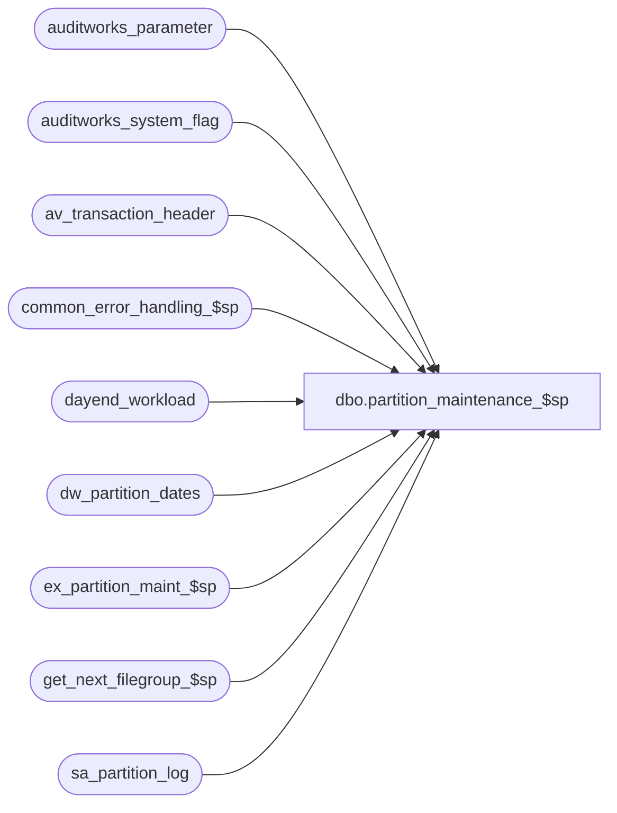

# dbo.partition_maintenance_$sp

**Database:** auditworks  
**Server:** bedrockdb01  

## Architecture Diagram



## Table Dependencies

| Referenced Table |
|---|
| auditworks_parameter |
| auditworks_system_flag |
| av_transaction_header |
| common_error_handling_$sp |
| dayend_workload |
| dw_partition_dates |
| ex_partition_maint_$sp |
| get_next_filegroup_$sp |
| sa_partition_log |

## Stored Procedure Code

```sql
CREATE proc [dbo].[partition_maintenance_$sp] AS

/*
Proc name: partition_maintenance_$sp
     Desc: To split/add partitions as more transactions are added to archive tables.
		Requires SQL2016 SP1 or higher. Belongs to SA module.
           Called by day_end_populate_$sp in mssql as opposed to by ICT_DAYEND01 in Oracle version.
           In a scaleout environment, will be called from scaleout_cons_int_p1_$sp on consolidated server.

HISTORY:
Date     Name            Defect# Description
Mar15,18 Terri	       DAOM-2866 Correcting required comments
Jan17,18 Sean/Terri    DAOM-2866 Removing the number of partitions check
Sep13,17 Sean/Terri    DAOM-2537 Change in logic to create new partitions based on getdate instead of max(sales_date). 
                 	 	Increased the partition limitation. 
Feb16,15 Paul S            94760 read external_archive_flag to detect external db, use try catch
Jul01,14 Ian K             63833 Check to see if external archive is in use - if so do a remote call to maintain
                                  the external archive partitions on the remote database.
Oct15,10 Paul           1-45X7AW If running on consolidated, ensure partitions exist for system date + 5 days,
					update sa_partition_log
Jan26,09 Paul             107623 Handle scaleout (running in consolidated archive db)
Aug04,08 Phu               95126 Initial development

*/

DECLARE
  @errline                               int,
  @errmsg                                nvarchar(2000),
  @errmsg2                               nvarchar(2000),
  @errno                                 int,
  @exec_sql                              nvarchar(4000),
  @external_archive_flag                 int,
  @external_archive_in_use               int,
  @last_filegroup                        sysname,
  @max_sales_date                        smalldatetime,
  @max_tran_date                         smalldatetime,
  @message_id                            int,
  @min_sales_date                        smalldatetime,
  @next_filegroup                        sysname,
  @object_name                           nvarchar(255),
  @operation_name                        nvarchar(100),
  @partition_days                        smallint,
  @partitioning_in_use                   smallint,
  @process_name                          nvarchar(100),  
  @process_no                            smallint,
  @rows                                  int,
  @scaleout_flag                         smallint,
  @start_date                            smalldatetime,
  @total_partitions                      int;

SELECT
  @process_no = 28,
  @message_id = 201068,
  @process_name = 'partition_maintenance_$sp';

BEGIN TRY

  SELECT @errmsg = 'Unable to retrieve partitioning_in_use',
         @object_name = 'auditworks_system_flag',
         @operation_name = 'SELECT';

SET CONCAT_NULL_YIELDS_NULL OFF;
SET DATEFORMAT mdy;

-- Verify if partitioning is turned on
SELECT @partitioning_in_use = flag_numeric_value
FROM auditworks_system_flag
WHERE flag_name = 'partitioning_in_use';

IF COALESCE(@partitioning_in_use, 0) = 0
  RETURN;

  SELECT @errmsg = 'Failed to select scaleout_flag',
           @object_name = 'auditworks_system_flag',
          @operation_name = 'SELECT';
SELECT @scaleout_flag = CONVERT(int,flag_numeric_value)
  FROM auditworks_system_flag WITH (NOLOCK)
 WHERE flag_name = 'scaleout_flag';

SELECT @rows = @@rowcount;
IF @rows = 0
    GOTO business_error;

IF @scaleout_flag = 1 /* Do not run archive maintenance on peripheral servers in a scaleout environment */
   RETURN;

/* Check to see if external database is in use */

  SELECT @errmsg = 'Unable to select from auditworks_system_flag - external_archive_in_use',
	 @object_name = 'external_archive_in_use',
	 @operation_name = 'SELECT';
SELECT @external_archive_in_use = flag_numeric_value
  FROM auditworks_system_flag
 WHERE flag_name = 'external_archive_in_use';

IF @external_archive_in_use IS NULL
  SELECT @external_archive_in_use = 0;

  SELECT @errmsg = 'Unable to select external_archive_flag';
SELECT @external_archive_flag = flag_numeric_value
  FROM auditworks_system_flag
 WHERE flag_name = 'external_archive_flag';
 
IF @external_archive_flag IS NULL
  SELECT @external_archive_flag = 0;

/* If external archive is being used, and running in main SA db, then remotely call this same proc to maintain partitions in the external db */

IF @external_archive_in_use = 1 AND @external_archive_flag = 0
  BEGIN
   SELECT @errmsg = 'Unable to exec synonym ex_partition_maint_$sp',
         @object_name = 'ex_partition_maint_$sp',
         @operation_name = 'EXECUTE';

   EXEC ex_partition_maint_$sp;
  END;

  SELECT @errmsg = 'Unable to retrieve partition_days',
         @object_name = 'auditworks_parameter',
         @operation_name = 'SELECT';   
SELECT @partition_days = par_value
  FROM auditworks_parameter
WHERE par_name = 'partition_days';

IF COALESCE(@partition_days, 0) = 0
BEGIN
  SELECT @errno = 201500,
         @errmsg = 'ABORT: Configuration for partition_days (days per partition) is missing from auditworks_parameter',
         @object_name = 'auditworks_parameter',
         @operation_name = 'SELECT';
  GOTO business_error;
END;

  SELECT @errmsg = 'Unable to retrieve last_filegroup_used',
         @object_name = 'auditworks_system_flag',
         @operation_name = 'SELECT';
SELECT @last_filegroup = flag_alpha_value
  FROM auditworks_system_flag
 WHERE flag_name = 'last_filegroup_used';

  SELECT @errmsg = 'Failed to select the latest transaction date',
         @object_name = 'av_transaction_header',
         @operation_name = 'SELECT';
SELECT @max_tran_date = MAX(transaction_date)
  FROM av_transaction_header;

SELECT @max_tran_date = COALESCE(@max_tran_date, getdate()); -- in case the archive table is empty

  /* Get the max date for which partitions need to exist in order to allow posting to run.
     If scaleout, then ensure that current system date and the next five dates are covered so that valid
     transactions in the interface tables can be posted to the preaudit archive tables after today's edit.
     This also handles possible timing scenarios where the dayend may not be run for a few days.
     The number of days added in the calculation is 1 greater than 5 because the Oracle partitions contain dates
     that are LESS than the upper limit of the partition key (date with midnight).
     For non-scaleout, will also pre-allocate an extra 5 days of partitions from the current system date in order
     to reduce the chance of a subsequent dayend failing due to partitions not existing due to possible errors in this proc. */ 

IF @scaleout_flag = 2 -- consolidated server (currently not in use)
  BEGIN
	  SELECT @errmsg = 'Failed to select the lowest and highest sales date',
	         @object_name = 'dw_partition_dates',
	         @operation_name = 'SELECT';
	SELECT @min_sales_date = MIN(transaction_date), @max_sales_date = MAX(transaction_date)
	  FROM dw_partition_dates
	WHERE partition_exists = 0;

	IF @max_sales_date <= @max_tran_date
	BEGIN
	   SELECT @errmsg = 'Unable to set partition_exists = 1 (no rows)',
	         @object_name = 'dw_partition_dates',
	         @operation_name = 'UPDATE';
	  UPDATE dw_partition_dates
	    SET partition_exists = 1
	   WHERE partition_exists = 0;

	END; -- If @max_sales_date <= @max_tran_date ...

	-- ensure that partitions always exist for current date plus 6 days
	SELECT @max_sales_date = DATEADD(dd,6,CONVERT(smalldatetime, CONVERT(nchar(8),getdate(),112)));
  END;
ELSE
  BEGIN /* nonscaleout. Ensure that partitions exist for all dates up to max(sales_date) plus the next 5 dates */ 
	  SELECT @errmsg = 'Failed to select the lowest and highest sales date',
		 @object_name = 'dayend_workload',
	         @operation_name = 'SELECT';
	SELECT @min_sales_date = MIN(sales_date)
	FROM dayend_workload;

	SELECT @max_sales_date = DATEADD(dd,6,CONVERT(smalldatetime, CONVERT(nchar(8),getdate(),112)));
  END;

IF @min_sales_date IS NULL OR @max_sales_date <= @max_tran_date
  RETURN; -- There are no new dates to partition

 /* Otherwise, at least one partition may be out of room */

IF @min_sales_date > @max_tran_date
  SELECT @min_sales_date = @max_tran_date;

-- Get the current total partitions
  SELECT @errmsg = 'Failed to select the total partition_numbers',
         @object_name = 'sys.partitions',
         @operation_name = 'SELECT';
SELECT @total_partitions = MAX(p.partition_number)
  FROM sys.partitions p
 WHERE p.object_id = OBJECT_ID('av_transaction_header');

 /* Removing the number of partitions check

IF (DATEDIFF(dd, @min_sales_date, @max_sales_date) / @partition_days) + @total_partitions > 14999 
BEGIN
  SELECT @errno = 201500,
         @errmsg = 'The volume of archived transactions and partition_days will exceed the limitation of 14999 partitions. Please increase partition_days.',
         @object_name = 'sys.partitions',
         @operation_name = 'SELECT';
  GOTO business_error;
END;
*/


IF @partition_days = 16
  SELECT @partition_days = 15;

IF @partition_days IN (28, 29) -- assume monthly partition
  SELECT @partition_days = 30;

SELECT @start_date = @min_sales_date;

WHILE @start_date < @max_sales_date
BEGIN
  IF @partition_days IN (30, 31) -- monthly partition
     -- first day of the month
     SELECT @start_date = DATEADD(mm, 1, @start_date);
  ELSE 
  IF @partition_days IN (14, 15) -- bi-weekly partition, set to 1st and 16th of the month
  BEGIN
      IF DATEPART(dd, @start_date) < @partition_days
      BEGIN
        IF @partition_days = 14
          SELECT @start_date = CONVERT(smalldatetime, convert(nvarchar, DATEPART(mm, @start_date)) + '/15/' + convert(nvarchar, DATEPART(yyyy, @start_date)));
         ELSE
          SELECT @start_date = CONVERT(smalldatetime, convert(nvarchar, DATEPART(mm, @start_date)) + '/16/' + convert(nvarchar, DATEPART(yyyy, @start_date)));
      END;
      ELSE
        SELECT @start_date = CONVERT(smalldatetime, convert(nvarchar, DATEPART(mm, DATEADD(mm, 1, @start_date))) + '/01/' + convert(nvarchar, DATEPART(yyyy, DATEADD(mm, 1, @start_date))));
  END; -- If @partition_days IN (14, 15)
  ELSE
  BEGIN
    SELECT @start_date = DATEADD(dd, @partition_days, @start_date);
  END; -- IF @partition_days IN (30, 31)

  IF NOT EXISTS (SELECT 1
                 FROM sys.partition_range_values prv, sys.partition_functions pf
                 WHERE pf.name = 'ArchiveTransactionPF'
                 AND pf.function_id = prv.function_id
                 AND CONVERT(smalldatetime, prv.value) = @start_date)
  BEGIN
        SELECT @errmsg = 'Unable to insert sa_partition_log (1)',
             @object_name = 'sa_partition_log',
             @operation_name = 'INSERT';
    INSERT INTO sa_partition_log (
			entry_date,
			table_name,
			log_message,
			partition_name)
    SELECT getdate(),
			'av_transaction_header',
			'Archive Maintenance creating partition for ' + convert(nvarchar,@start_date, 101),
			'ArchiveTransactionPF-' + convert(nvarchar,@start_date, 101);

    SELECT @exec_sql = 'ALTER PARTITION FUNCTION ArchiveTransactionPF () SPLIT RANGE (''' + convert(nvarchar, @start_date, 101) + ''')';

      SELECT @errmsg = 'Unable to ALTER PARTITION FUNCTION',
             @object_name = @exec_sql,
             @operation_name = 'EXECUTE';
    EXEC sp_executesql @exec_sql;

    -- get next value for @next_filegroup
    SELECT @next_filegroup = NULL;

      SELECT @errmsg = 'Unable to execute get_next_filegroup_$sp',
             @object_name = 'get_next_filegroup_$sp',
             @operation_name = 'EXECUTE';
    EXEC @next_filegroup = get_next_filegroup_$sp @last_filegroup;

    IF @next_filegroup IS NOT NULL
    BEGIN
        SELECT @errmsg = 'Unable to insert sa_partition_log (2)',
             @object_name = 'sa_partition_log',
             @operation_name = 'INSERT';
      INSERT INTO sa_partition_log (
			entry_date,
			table_name,
			log_message,
			partition_name)
      SELECT getdate(),
			'av_transaction_header',
			'Archive Maintenance creating partition filegroup ' + @next_filegroup,
			@next_filegroup;

      SELECT @exec_sql = 'ALTER PARTITION SCHEME ArchiveTransactionPS NEXT USED [' + @next_filegroup + ']';

        SELECT @errmsg = 'Unable to ALTER PARTITION SCHEME',
               @object_name = @exec_sql,
               @operation_name = 'EXECUTE';
      EXEC sp_executesql @exec_sql;

      SELECT @last_filegroup = @next_filegroup;
    END; -- IF @next_filegroup IS NOT NULL

  END; -- IF NOT EXISTS (SELECT 1
END; -- while @start_date < @max_transaction_date

  SELECT @errmsg = 'Unable to update for last_filegroup_used',
         @object_name = 'auditworks_system_flag',
         @operation_name = 'UPDATE';
UPDATE auditworks_system_flag
  SET flag_alpha_value = @last_filegroup
 WHERE flag_name = 'last_filegroup_used';

IF @scaleout_flag = 2 -- consolidated server (currently not in use)
  BEGIN
	  SELECT @errmsg = 'Unable to set partition_exists = 1',
	         @object_name = 'dw_partition_dates',
	         @operation_name = 'UPDATE';
	UPDATE dw_partition_dates
	  SET partition_exists = 1 -- flag dates as evaluated
	WHERE partition_exists = 0;
  END;

RETURN;


business_error:   /* Business Rule handler. */

	SELECT @errmsg2 = @errmsg;

	/* Could include similar cleanup code to system error trap when needed (example is from move_store_$sp).
	   However, could also exclude the cleanup code here since the outer system error catch should fire again after the exec below. */

	EXEC common_error_handling_$sp @process_no, @errno, @errmsg, 0, @message_id, 
	       @process_name, @object_name, @operation_name, 1;
	  /* Note: when the exec above raises an error, that action also fires the system error trap (below) */
	RETURN;
END TRY

BEGIN CATCH; -- trap system errors
    /* common error handling. Appending proc name here because a rollback could occur if called within a transaction. */

        SELECT @errno = ERROR_NUMBER(),
		@errline = ERROR_LINE();

        SELECT @errmsg = CONVERT(nvarchar, @errno) + ':' + @process_name + ':' + CONVERT(nvarchar, @errline) + ':'
               + COALESCE(@errmsg, ' ') + ':' + ERROR_MESSAGE();

	 /* this condition will only be true when raise error in traps above fire this general catch */
	IF @errmsg2 IS NOT NULL
	  SELECT @errmsg = @errmsg2;

	EXEC common_error_handling_$sp @process_no, @errno, @errmsg, 0, @message_id, 
	       @process_name, @object_name, @operation_name, 1;

	RETURN;
END CATCH;
```

