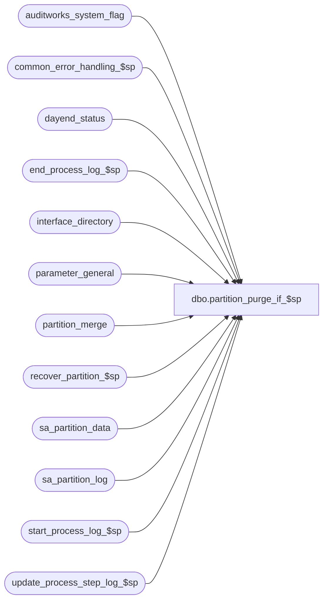

# dbo.partition_purge_if_$sp

**Database:** auditworks  
**Server:** bedrockdb01  

## Architecture Diagram



## Table Dependencies

| Referenced Table |
|---|
| auditworks_system_flag |
| common_error_handling_$sp |
| dayend_status |
| end_process_log_$sp |
| interface_directory |
| parameter_general |
| partition_merge |
| recover_partition_$sp |
| sa_partition_data |
| sa_partition_log |
| start_process_log_$sp |
| update_process_step_log_$sp |

## Stored Procedure Code

```sql
create proc dbo.partition_purge_if_$sp AS

/*
Proc name: partition_purge_if_$sp (SA)
     Desc: Deletes expired partitions that are older than @extend_archive_days_retained and @archive_days_retained
           for tables that are in sa_partition_data.
           Called by purge_interface_$sp.

*** UNCOMMENT partition logic before submitting to repo ***

HISTORY:
Date     Name            Defect# Description
Jun17,10 Paul             114682 Added prints to smartload log, update sa_partition_log


*/

DECLARE
  @archive_days_retained                 int,
  @create_clustered_index                nvarchar(300),
  @create_nonclustered_index_1           nvarchar(300),
  @create_nonclustered_index_2           nvarchar(300),
  @create_table_script                   nvarchar(4000),
  @cursor_open                           tinyint,
  @employee_purchase_days                smallint,  
  @employee_purchase_date                smalldatetime,
  @errmsg                                varchar(255),
  @errno                                 int,
  @exception_count                       numeric(14,0),
  @exec_sql                              nvarchar(4000),
  @extend_archive_days_retained          int,
  @gl_ascii_export_type                  tinyint,
  @last_date_closed                      smalldatetime,
  @log_table_name                        varchar(30),
  @max_date                              smalldatetime,
  @max_tran_date                         smalldatetime,
  @message_id                            int,
  @min_date                              smalldatetime,
  @min_tran_date                         smalldatetime,
  @object_name                           varchar(255),
  @oldest_date                           smalldatetime,
  @oldest_date_audit_status              smalldatetime,
  @oldest_date_extended                  smalldatetime,
  @operation_name                        varchar(100),
  @param_definition                      nvarchar(200),
  @part_table_name                       sysname,
  @partition_no                          int,
  @process_log_entry                     tinyint,
  @process_name                          varchar(100),  
  @process_no                            smallint,
  @process_start_time                    datetime,
  @process_timestamp                     float,
  @purge_tran_count                      numeric(14,0),
  @rdbms_sid                             smallint,
  @rows                                  int,
  @row_count                             int,
  @scaleout_flag                         int,
  @status                                smallint,
  @table_name                            sysname,
  @temp_table_name                       sysname,
  @tax_date                              smalldatetime,
  @tax_days                              smallint,
  @trace_msg                             varchar(255),
  @tran_count                            int

SET CONCAT_NULL_YIELDS_NULL OFF
SET DATEFORMAT mdy

SELECT
  @cursor_open = 0,
  @process_log_entry = 0,
  @process_no = 39,
  @process_timestamp = 0,
  @purge_tran_count = 0,
  @process_start_time = getdate(),
  @gl_ascii_export_type = 0,
  @message_id = 201068,
  @process_name = 'partition_purge_if_$sp',
  @log_table_name = 'if_transaction_header',
  @rdbms_sid = @@spid

-- still needs coding and testing for mssql

RETURN

EXEC update_process_step_log_$sp 18, 1, 62, 1, 0, @process_start_time

SELECT @errno = @@error
IF @errno != 0
BEGIN
  SELECT @errmsg = 'Failed to execute stored proc update_process_step_log_$sp for step 62',
         @object_name = 'update_process_step_log_$sp',
         @operation_name = 'EXECUTE'
  GOTO error
END


SELECT @archive_days_retained = archive_days_retained,
       @extend_archive_days_retained = extended_archive_days_retained,
       @last_date_closed = last_date_closed,
       @employee_purchase_days = employee_purchase_days,
       @tax_days = tax_days
FROM parameter_general

SELECT @errno = @@error
IF @errno != 0
BEGIN
  SELECT @errmsg = 'Unable to select from parameter_general',
         @object_name = 'parameter_general',
         @operation_name = 'SELECT'
  GOTO error
END

SELECT @scaleout_flag = CONVERT(int, flag_numeric_value)
  FROM auditworks_system_flag
 WHERE flag_name = 'scaleout_flag'

SELECT @errno = @@error, @rows = @@rowcount
IF @errno != 0 OR @rows = 0
BEGIN
  SELECT @errmsg = 'Failed to select scaleout_flag from auditworks_system_flag',
         @object_name = 'auditworks_system_flag',
         @operation_name = 'SELECT'
  GOTO error
END

IF @extend_archive_days_retained < @archive_days_retained
  SELECT @extend_archive_days_retained = @archive_days_retained

SELECT @oldest_date = DATEADD (dd, @archive_days_retained * -1, getdate()),
       @oldest_date_extended = DATEADD (dd, @extend_archive_days_retained * -1, getdate()),
       @employee_purchase_date = DATEADD (dd, @employee_purchase_days * -1, getdate()),
       @tax_date = DATEADD (dd, @tax_days * -1, getdate())

SELECT @oldest_date_audit_status = @oldest_date_extended

-- Do not delete any dates in audit_status which are not in closed periods

IF @oldest_date_audit_status > @last_date_closed
  SELECT @oldest_date_audit_status = @last_date_closed

SELECT @gl_ascii_export_type = ascii_export
  FROM interface_directory
 WHERE interface_id = 19

INSERT INTO sa_partition_log (
		entry_date,
		table_name,
		log_message)
SELECT getdate(),
		@log_table_name,
		'Interface Purge starts on sid ' + CONVERT(varchar,@rdbms_sid)
SELECT @errno = @@error
IF @errno != 0
BEGIN
  SELECT @errmsg = 'Failed to insert sa_partition_log',
         @object_name = 'sa_partition_log',
         @operation_name = 'INSERT'
  GOTO error
END

EXEC start_process_log_$sp @process_no, @process_timestamp OUTPUT, @errmsg OUTPUT, 1, @process_start_time
SELECT @errno = @@error
IF @errno <> 0
BEGIN
  SELECT @errmsg = 'Unable to execute start_process_log_$sp',
         @object_name = 'start_process_log_$sp',
         @operation_name = 'EXECUTE'
  GOTO error
END

SELECT @process_log_entry = 1

-- To cleanup/recover the temporary tables that are left from the last run
EXEC recover_partition_$sp
SELECT @errno = @@error
IF @errno != 0
BEGIN
  SELECT @errmsg = 'Unable to execute stored procedure',
         @object_name = 'recover_partition_$sp',
         @operation_name = 'EXECUTE'
  GOTO error
END

CREATE TABLE #exception_trans (av_transaction_id numeric(14,0) NOT NULL)
SELECT @errno = @@error
IF @errno != 0 
BEGIN
  SELECT @errmsg = 'Failed to create temp table',
         @object_name = '#exception_trans',
         @operation_name = 'CREATE'
  GOTO error  
END

/* Uncommented in repo:
SELECT MIN(transaction_date) AS min_tran_date,
       MAX(transaction_date) AS max_tran_date,
       COUNT(av_transaction_id) AS tran_count,
       $partition.InterfaceTransactionPF (transaction_date) AS partition_no
INTO #part_func_summary
FROM av_transaction_header
GROUP BY $partition.InterfaceTransactionPF (transaction_date)
HAVING COUNT(av_transaction_id) > 0
AND MIN(transaction_date) <= @oldest_date
ORDER BY MIN(transaction_date) DESC
*/

SELECT @errno = @@error
IF @errno != 0 
BEGIN
  SELECT @errmsg = 'Failed to create temp table',
         @object_name = '#part_func_summary',
         @operation_name = 'CREATE'
  GOTO error  
END

DECLARE part_func_sum_crsr CURSOR FAST_FORWARD
FOR
SELECT min_tran_date,
       max_tran_date,
       tran_count,
       partition_no
FROM #part_func_summary
ORDER BY min_tran_date

SELECT @errno = @@error
IF @errno != 0
BEGIN
  SELECT @errmsg = 'Unable to declare cursor',
         @object_name = 'part_func_sum_crsr',
         @operation_name = 'DECLARE'
  GOTO error
END


SELECT @trace_msg = ':LOG ***> Starting Purge of Interface partitions : ' + CONVERT(CHAR, getdate(), 8)
PRINT @trace_msg

  /* Loop through the oldest partitions.
     Start with the oldest partition in the non-extended part of the achive. */

OPEN part_func_sum_crsr

SELECT @errno = @@error
IF @errno != 0
BEGIN
  SELECT @errmsg = 'Unable to open cursor',
         @object_name = 'part_func_sum_crsr',
         @operation_name = 'OPEN'
  GOTO error
END

SELECT @cursor_open = 1

WHILE 1 = 1
BEGIN
  FETCH part_func_sum_crsr 
  INTO @min_tran_date,
       @max_tran_date,
       @tran_count,
       @partition_no

  IF @@fetch_status != 0
    BREAK

  TRUNCATE TABLE #exception_trans
  SELECT @errno = @@error
  IF @errno != 0
  BEGIN
    SELECT @errmsg = 'Unable to truncate temporary table',
           @object_name = '#exception_trans',
           @operation_name = 'TRUNCATE'
    GOTO error
  END

  INSERT INTO sa_partition_log (
		entry_date,
		table_name,
		log_message,
		partition_name)
  SELECT getdate(),
		@log_table_name,
		'Searching for partition_no = ' + CONVERT(varchar,COALESCE(@partition_no,0)),
		CONVERT(varchar, COALESCE(@partition_no,0)) + ': ' + CONVERT(CHAR, @max_tran_date, 8)
  SELECT @errno = @@error
  IF @errno != 0
  BEGIN
    SELECT @errmsg = 'Failed to insert sa_partition_log (1)',
         @object_name = 'sa_partition_log',
         @operation_name = 'INSERT'
    GOTO error
  END

  -- populate exception trans that need to remain on the system.

/* uncommented in repo:
  INSERT INTO #exception_trans (av_transaction_id)
SELECT h.av_transaction_id
  FROM av_transaction_header h
  WHERE $partition.InterfaceTransactionPF (transaction_date) = @partition_no
  AND (h.transaction_date >= @oldest_date_extended
       OR h.transaction_date >= @oldest_date
       OR (h.transaction_date >= @employee_purchase_date
           AND h.employee_no IS NOT NULL)
       OR (h.transaction_date >= @tax_date
           AND h.tax_override_flag = 1))

  UNION
  SELECT aer.av_transaction_id
  FROM exception_rule r, av_exception_reason aer
  WHERE $partition.InterfaceTransactionPF (transaction_date) = @partition_no
  AND r.extended_archive_days > 0
  AND r.active_exception = 1
  AND r.exception_rule = aer.violated_exception_rule
  AND aer.transaction_date >= DATEADD (dd, r.extended_archive_days * -1, getdate())

  UNION
  SELECT process_key AS av_transaction_id
  FROM cust_liability_history
  WHERE transaction_date BETWEEN @min_tran_date AND @max_tran_date
  AND process_no != 11
*/
  SELECT @errno = @@error, @exception_count = @@rowcount
  IF @errno != 0
  BEGIN
    SELECT @errmsg = 'Unable to populate exception transactions',
           @object_name = '#exception_trans',
           @operation_name = 'INSERT'
    GOTO error
  END

  -- if @exception_count = @tran_count then move to next partition number
  IF @exception_count = @tran_count
    CONTINUE

  DECLARE sa_part_data_crsr CURSOR FAST_FORWARD
  FOR
  SELECT table_name, create_table_script, create_clustered_index,
         create_nonclustered_index_1, create_nonclustered_index_2
  FROM sa_partition_data
  WHERE table_group = 'interface'
  ORDER BY table_sequence DESC

  SELECT @errno = @@error
  IF @errno != 0
  BEGIN
    SELECT @errmsg = 'Unable to declare cursor',
           @object_name = 'sa_part_data_crsr',
           @operation_name = 'DECLARE'
    GOTO error
  END

  OPEN sa_part_data_crsr
  SELECT @errno = @@error
  IF @errno != 0
  BEGIN
    SELECT @errmsg = 'Unable to open cursor',
           @object_name = 'sa_part_data_crsr',
           @operation_name = 'OPEN'
    GOTO error
  END

  SELECT @cursor_open = 2

  WHILE 2 = 2
  BEGIN
    FETCH sa_part_data_crsr INTO
      @table_name,
      @create_table_script,
      @create_clustered_index,
      @create_nonclustered_index_1,
      @create_nonclustered_index_2

    IF @@fetch_status != 0
      BREAK

    INSERT INTO sa_partition_log (
		entry_date,
		table_name,
		log_message,
		partition_name)
    SELECT getdate(),
		@log_table_name,
		'Altering partition_no = ' + CONVERT(varchar,COALESCE(@partition_no,0)),
		@table_name
    SELECT @errno = @@error
    IF @errno != 0
    BEGIN
      SELECT @errmsg = 'Failed to insert sa_partition_log (2)',
         @object_name = 'sa_partition_log',
         @operation_name = 'INSERT'
      GOTO error
    END

    -- make sure the current partition number is in the range of @min_tran_date and @max_tran_date before dropping it.
    SELECT @exec_sql = N'SELECT @min_date_out = MIN(transaction_date), @max_date_out = MAX(transaction_date) FROM ' + @table_name + N' WHERE $partition.InterfaceTransactionPF (transaction_date) = ' + CONVERT(nvarchar, @partition_no)
    SELECT @param_definition = N'@min_date_out smalldatetime OUTPUT, @max_date_out smalldatetime OUTPUT'

    EXECUTE sp_executesql @exec_sql, @param_definition, @min_date_out = @min_date OUTPUT, @max_date_out = @max_date OUTPUT
    SELECT @errno = @@error
    IF @errno != 0
    BEGIN
      SELECT @errmsg = 'Unable to execute dynamic sql (select)',
             @object_name = @exec_sql,
             @operation_name = 'EXECUTE'
      GOTO error
    END

    -- if current partition number is not in the range of @min_tran_date and @max_tran_date then move to next partition number.
    IF @min_date < @min_tran_date OR @max_date > @max_tran_date
      CONTINUE

    -- prepare table names for partitioning
    SELECT @temp_table_name = @table_name + '_temp' + RIGHT('0000' + CONVERT(nvarchar, @partition_no), 4),
           @part_table_name = @table_name + '_part' + RIGHT('0000' + CONVERT(nvarchar, @partition_no), 4)

    IF @create_table_script IS NOT NULL
    BEGIN
      SELECT @exec_sql = REPLACE(@create_table_script, @table_name, @temp_table_name)
      EXEC sp_executesql @exec_sql
      SELECT @errno = @@error
      IF @errno != 0
      BEGIN
        SELECT @errmsg = 'Unable to execute dynamic sql (table_name)',
               @object_name = @exec_sql,
               @operation_name = 'EXECUTE'
        GOTO error
      END

      SELECT @exec_sql = REPLACE(@create_table_script, @table_name, @part_table_name)
      EXECUTE sp_executesql @exec_sql
      SELECT @errno = @@error
      IF @errno != 0
      BEGIN
        SELECT @errmsg = 'Unable to execute dynamic sql (create table)',
               @object_name = @exec_sql,
               @operation_name = 'EXECUTE'
        GOTO error
      END

      IF @create_clustered_index IS NOT NULL
      BEGIN
        SELECT @exec_sql = REPLACE(@create_clustered_index, @table_name, @temp_table_name)
        EXEC sp_executesql @exec_sql
        SELECT @errno = @@error
        IF @errno != 0
        BEGIN
          SELECT @errmsg = 'Unable to execute dynamic sql (replace)',
                 @object_name = @exec_sql,
                 @operation_name = 'EXECUTE'
          GOTO error
        END

        SELECT @exec_sql = REPLACE(@create_clustered_index, @table_name, @part_table_name)
        EXECUTE sp_executesql @exec_sql
        SELECT @errno = @@error
        IF @errno != 0
        BEGIN
          SELECT @errmsg = 'Unable to execute dynamic sql (replace2)',
                 @object_name = @exec_sql,
                 @operation_name = 'EXECUTE'
          GOTO error
        END
      END -- IF @create_clustered_index IS NOT NULL

      -- need to create non clustered index for av_*part* tables only
      IF @create_nonclustered_index_1 IS NOT NULL
      BEGIN
        SELECT @exec_sql = REPLACE(@create_nonclustered_index_1, @table_name, @part_table_name)
        EXECUTE sp_executesql @exec_sql
        SELECT @errno = @@error
        IF @errno != 0
        BEGIN
          SELECT @errmsg = 'Unable to execute dynamic sql (replace3)',
                 @object_name = @exec_sql,
                 @operation_name = 'EXECUTE'
GOTO error
        END
      END -- IF @create_nonclustered_index_1 IS NOT NULL

      IF @create_nonclustered_index_2 IS NOT NULL
      BEGIN
        SELECT @exec_sql = REPLACE(@create_nonclustered_index_2, @table_name, @part_table_name)
        EXECUTE sp_executesql @exec_sql
        SELECT @errno = @@error
        IF @errno != 0
        BEGIN
          SELECT @errmsg = 'Unable to execute dynamic sql (replace4)',
                 @object_name = @exec_sql,
                 @operation_name = 'EXECUTE'
          GOTO error
        END
      END -- IF @create_nonclustered_index_2 IS NOT NULL

    END -- IF @create_table_script IS NOT NULL

    IF @exception_count = 0 -- no exception tran, we can remove partition
    BEGIN
      INSERT INTO sa_partition_log (
		entry_date,
		table_name,
		log_message,
		partition_name)
      SELECT getdate(),
		@log_table_name,
		'Purging partition_no ' + CONVERT(varchar,COALESCE(@partition_no,0)),
		@table_name
      SELECT @errno = @@error
      IF @errno != 0
      BEGIN
        SELECT @errmsg = 'Failed to insert sa_partition_log (switch)',
	         @object_name = 'sa_partition_log',
	         @operation_name = 'INSERT'
        GOTO error
      END

      SELECT @purge_tran_count = @purge_tran_count + @tran_count
      SELECT @exec_sql = N'ALTER TABLE ' + @table_name + N' SWITCH PARTITION ' + CONVERT(nvarchar, @partition_no) + N' TO ' + @temp_table_name + N' PARTITION ' + CONVERT(nvarchar, @partition_no)
      EXEC sp_executesql @exec_sql
      SELECT @errno = @@error
      IF @errno != 0
      BEGIN
        SELECT @errmsg = 'Unable to execute dynamic sql (switch)',
               @object_name = @exec_sql,
               @operation_name = 'EXECUTE'
        GOTO error
      END

      -- prepare the partition for the merge.
      INSERT INTO partition_merge (partition_function_name, partition_no, min_tran_date)
      VALUES ('InterfaceTransactionPF', @partition_no, @min_tran_date)

      SELECT @errno = @@error
      IF @errno != 0
      BEGIN
        SELECT @errmsg = 'Unable to insert row',
               @object_name = 'partition_merge',
               @operation_name = 'INSERT'
        GOTO error
      END

    END -- IF @exception_count = 0
    ELSE
    BEGIN
      SELECT @purge_tran_count = @purge_tran_count + (@tran_count - @exception_count)
      -- Assuming that the @exception_count is always relatively small comparing to the total transactions to be deleted.
      -- 1) move trans from av_* table joins with #exception_trans to the partition table
      SELECT @exec_sql = N'INSERT INTO ' + @part_table_name + N' SELECT t.* FROM #exception_trans e, ' + @table_name + N' t WHERE e.av_transaction_id = t.av_transaction_id'
      EXEC sp_executesql @exec_sql
      SELECT @errno = @@error
      IF @errno != 0
      BEGIN
        SELECT @errmsg = 'Unable to execute dynamic sql (insert)',
               @object_name = @exec_sql,
               @operation_name = 'EXECUTE'
        GOTO error
      END

      INSERT INTO sa_partition_log (
		entry_date,
		table_name,
		log_message,
		partition_name)
      SELECT getdate(),
		@log_table_name,
		'Switching partition_no ' + CONVERT(varchar,COALESCE(@partition_no,0)) + ' WITH ' + @temp_table_name,
		@table_name
      SELECT @errno = @@error
      IF @errno != 0
      BEGIN
        SELECT @errmsg = 'Failed to insert sa_partition_log (switch)',
	         @object_name = 'sa_partition_log',
	         @operation_name = 'INSERT'
        GOTO error
      END
  
      -- 2) move trans belonging to a particular partition of av_* table to temporary table
      SELECT @exec_sql = N'ALTER TABLE ' + @table_name + N' SWITCH PARTITION ' + CONVERT(nvarchar, @partition_no) + N' TO ' + @temp_table_name + N' PARTITION ' + CONVERT(nvarchar, @partition_no)
      EXEC sp_executesql @exec_sql
      SELECT @errno = @@error
      IF @errno != 0
      BEGIN
        SELECT @errmsg = 'Unable to execute dynamic sql (move)',
               @object_name = @exec_sql,
               @operation_name = 'EXECUTE'
        GOTO error
      END

      -- 3) move trans from the partition table back to av_* table
      SELECT @exec_sql = N'ALTER TABLE ' + @part_table_name + N' SWITCH PARTITION ' + CONVERT(nvarchar, @partition_no) + N' TO ' + @table_name + N' PARTITION ' + CONVERT(nvarchar, @partition_no)
      EXEC sp_executesql @exec_sql
      SELECT @errno = @@error
      IF @errno != 0
      BEGIN
        SELECT @errmsg = 'Unable to execute dynamic sql (move2)',
               @object_name = @exec_sql,
               @operation_name = 'EXECUTE'
        GOTO error
      END
    END -- else of IF @exception_count = 0

    -- drop temporary tables
    SELECT @exec_sql = N'DROP TABLE ' + @part_table_name
    EXEC sp_executesql @exec_sql
    SELECT @errno = @@error
    IF @errno != 0
    BEGIN
      SELECT @errmsg = 'Unable to execute dynamic sql (drop)',
             @object_name = @exec_sql,
             @operation_name = 'EXECUTE'
      GOTO error
    END

    SELECT @exec_sql = N'DROP TABLE ' + @temp_table_name
    EXEC sp_executesql @exec_sql
    SELECT @errno = @@error
    IF @errno != 0
    BEGIN
      SELECT @errmsg = 'Unable to execute dynamic sql (drop2)',
             @object_name = @exec_sql,
             @operation_name = 'EXECUTE'
      GOTO error
    END

  END -- while 2 = 2
  CLOSE sa_part_data_crsr
  DEALLOCATE sa_part_data_crsr
  SELECT @cursor_open = 1

END -- while 1 = 1

CLOSE part_func_sum_crsr
DEALLOCATE part_func_sum_crsr
SELECT @cursor_open = 0

DROP TABLE #part_func_summary
SELECT @errno = @@error
IF @errno != 0
BEGIN
  SELECT @errmsg = 'Failed to drop temporary table',
   @object_name = '#part_func_summary',
   @operation_name = 'DROP'
  GOTO error
END


UPDATE dayend_status
  SET sales_date = @oldest_date
 WHERE process_no = @process_no

SELECT @errno = @@error
IF @errno != 0
BEGIN
  SELECT @errmsg = 'Failed to set sales_date to @last_date_purged',
   @object_name = 'dayend_status',
   @operation_name = 'UPDATE'
  GOTO error
END


IF @gl_ascii_export_type = 0
  SELECT @status = 400
ELSE
  SELECT @status = 500


-- Merge empty partitions
IF EXISTS (SELECT 1 FROM partition_merge
           WHERE partition_function_name = 'InterfaceTransactionPF')
BEGIN
  DECLARE merge_partition_crsr CURSOR FAST_FORWARD
  FOR
  SELECT partition_no, min_tran_date
  FROM partition_merge
  WHERE partition_function_name = 'InterfaceTransactionPF'
  ORDER BY partition_no

  SELECT @errno = @@error
  IF @errno != 0
  BEGIN
    SELECT @errmsg = 'Unable to declare cursor',
           @object_name = 'merge_partition_crsr',
           @operation_name = 'DECLARE'
    GOTO error
  END

  OPEN merge_partition_crsr
  SELECT @errno = @@error
  IF @errno != 0
  BEGIN
    SELECT @errmsg = 'Unable to open cursor',
           @object_name = 'merge_partition_crsr',
           @operation_name = 'OPEN'
    GOTO error
  END

  SELECT @cursor_open = 3

  WHILE 3 = 3
  BEGIN
    FETCH merge_partition_crsr INTO
      @partition_no,
      @min_tran_date

    IF @@fetch_status != 0
      BREAK

    -- using @max_tran_date to hold the boundary of the current partition
    SELECT @max_tran_date = NULL
    SELECT @max_tran_date = MAX(CONVERT(smalldatetime, prv.value))
    FROM sys.partition_range_values prv, sys.partition_functions pf
    WHERE pf.name = 'InterfaceTransactionPF'
    AND pf.function_id = prv.function_id
    HAVING MAX(prv.value) <= @min_tran_date

    IF @max_tran_date IS NOT NULL
    BEGIN

      INSERT INTO sa_partition_log (
		entry_date,
		table_name,
		log_message,
		partition_name)
      SELECT getdate(),
		@log_table_name,
		'Merging partition_no ' + CONVERT(varchar,COALESCE(@partition_no,0)),
		CONVERT(varchar, @min_tran_date, 101)
      SELECT @errno = @@error
      IF @errno != 0
      BEGIN
        SELECT @errmsg = 'Failed to insert sa_partition_log (merge)',
	         @object_name = 'sa_partition_log',
	         @operation_name = 'INSERT'
        GOTO error
      END

      SELECT @exec_sql = N'ALTER PARTITION FUNCTION InterfaceTransactionPF () MERGE RANGE (''' + CONVERT(nvarchar, @max_tran_date, 101) + N''')'
      EXEC sp_executesql @exec_sql
      SELECT @errno = @@error
      IF @errno != 0
      BEGIN
        SELECT @errmsg = 'Unable to execute dynamic sql (merge)',
               @object_name = @exec_sql,
               @operation_name = 'EXECUTE'
        GOTO error
      END
    END --- IF @max_tran_date IS NOT NULL

  END -- while 3 = 3
  CLOSE merge_partition_crsr
  DEALLOCATE merge_partition_crsr
  SELECT @cursor_open = 0

  DELETE FROM partition_merge
  WHERE partition_function_name = 'InterfaceTransactionPF'

  SELECT @errno = @@error
  IF @errno != 0
  BEGIN
    SELECT @errmsg = 'Unable to delete row',
           @object_name = 'partition_merge',
           @operation_name = 'DELETE'
    GOTO error
  END
END -- IF EXISTS (SELECT 1 FROM partition_merge

INSERT INTO sa_partition_log (
		entry_date,
		table_name,
		log_message)
SELECT getdate(),
		@log_table_name,
		'Interface Purge ends on sid ' + CONVERT(varchar,@rdbms_sid)
SELECT @errno = @@error
IF @errno != 0
BEGIN
  SELECT @errmsg = 'Failed to insert sa_partition_log (end)',
         @object_name = 'sa_partition_log',
         @operation_name = 'INSERT'
  GOTO error
END

IF @process_log_entry = 1
BEGIN
  EXEC end_process_log_$sp @process_no, @process_timestamp, @purge_tran_count
  SELECT @errno = @@error
  IF @errno != 0
  BEGIN
    SELECT @errmsg = 'Unable to execute stored procedure',
           @object_name = 'end_process_log_$sp',
           @operation_name = 'EXECUTE'
    GOTO error
  END
END

RETURN


error:

  IF @cursor_open = 3
  BEGIN
    CLOSE merge_partition_crsr
    DEALLOCATE merge_partition_crsr
    SELECT @cursor_open = 0
  END

  IF @cursor_open = 2
  BEGIN
    CLOSE sa_part_data_crsr
    DEALLOCATE sa_part_data_crsr
    SELECT @cursor_open = 1
  END

  IF @cursor_open = 1
  BEGIN
    CLOSE part_func_sum_crsr
    DEALLOCATE part_func_sum_crsr
    SELECT @cursor_open = 0
  END

  EXEC common_error_handling_$sp @process_no, @errno, @errmsg, 0, @message_id, 
       @process_name, @object_name, @operation_name, 1
  
  RETURN
```

