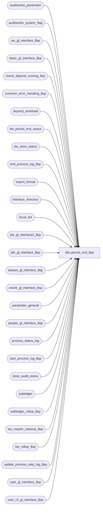

# dbo.period_end_$sp

**Database:** auditworks  
**Server:** bedrockdb01  

## Architecture Diagram



## Table Dependencies

| Referenced Table |
|---|
| auditworks_parameter |
| auditworks_system_flag |
| aw_gl_interface_$sp |
| basic_gl_interface_$sp |
| check_dayend_running_$sp |
| common_error_handling_$sp |
| dayend_workload |
| dw_period_end_status |
| dw_store_status |
| end_process_log_$sp |
| export_format |
| interface_directory |
| issue_list |
| jde_gl_interface2_$sp |
| jde_gl_interface_$sp |
| lawson_gl_interface_$sp |
| oracle_gl_interface_$sp |
| parameter_general |
| people_gl_interface_$sp |
| process_status_log |
| start_process_log_$sp |
| store_audit_status |
| subledger |
| subledger_rollup_$sp |
| tax_master_cleanup_$sp |
| tax_rollup_$sp |
| update_process_step_log_$sp |
| user_gl_interface_$sp |
| user_r3_gl_interface_$sp |

## Stored Procedure Code

```sql
create proc dbo.period_end_$sp 
AS

/* 
   Proc name:   period_end_$sp
   Description: Post period end.
                In a scaleout environment, the g/l file creation will happen only on the consolidated server.
                Called from smartload script dayend.ict

HISTORY:
Date     Name        Def# Desc
Jun10,14 Phu        74509 Verify correctly outstanding transactions.
Apr23,13 Vicci     143314 Pass expected workload to update_process_step_log_$sp, bump process_status_log work completed.
Dec07,11 Paul    1-475NTQ reset period_end_only flag when period end finds no work to do
Sep02,10 Vicci     120669 Set @period_end_status correctly when there is no work to do.
Jun17,10 Vicci     102089 Mark outstanding invalid account issues as verified since they can no longer be resolved
                          within S/A once the period is closed.
Jun09,10 Vicci     117335 Only log waiting message once, not once per loop in period end.
May26,10 Vicci     117228 Don't close period if not all store/dates were picked up by dayend populate yet because of
			  batch size limitations, nor if store/dates within period have not yet been dayended.
May26,10 Vicci     116866 Leave preliminary period end request outstanding if period end failed.
May26,10 Vicci     116687 Remove updates to parameter general last_date_closed and preliminary_period_end_date 
			  since this is already done (but with the right condition checks) in reset_period_end_$sp
May26,10 Vicci
         for Paul  116538 Scaleout: allow option of running gl export on peripherals
May26,10 Vicci 
         for Paul  108944 Avoid unnecessary call of tax master cleanup when running on peripherals
Apr07,10 Phu       116982 Calls jde_gl_interface2_$sp.
Sep28,07 Phu        91846 SA5 only: Handle front end requesting 'period-end_upon the next day-end'.
                          Log period end starts and ends date.
Jul25,06 Phu        75021 SA5 only: Set period_end_completed_by to period_end_locked_by when period end finishes.
Nov22,05 Paul     DV-1324 clear out period_end_only flag when finished, wait for peripheral servers if scaleout
Oct03,05 Paul       60471 apply 60634 to SA5
Jun29,05 Paul     DV-1239 Handle scaleout_flag = 2 as archive db
May04,05 Sab	  DV-1254 For scaleout, added logic to prevent peripheral servers from creating a GL file. 
Oct07,04 David    DV-1146 Remove user name.
May10,04 Maryam   DV-1071 Set @process_id and pass it to check_dayend_running_$sp.
Sep19,05 Daphna     60634 Update subledger.gl_posting_datetime for custom GL procs
Sep11,03 Maryam     13686 Do not run period end if subsequent runs required to finish 
                          dayend and period end is set to run daily.
Dec06,02 Paul     1-H56TW avoid raise error on business rule warning messages
Jun03,02 Winnie   1-CD0IX standardize R3.5 error handling.
Jan17,01 Paul     1-AARZT remove unnecessary commit to avoid MSSQL error
Nov30,01 Phu         8931 Progress monitor and error handling
Oct03,01 Winnie      8809 Remove the extra variable passing to lawson_gl_interface and jde_gl_interface.
Sep18,01 Winnie      8739 Compare the procedure name in lower case.
Jul20,01 Henry       8286 Modify cleanup logic to work correctly with multi-stream dayend.
				Replaces Defects 7493 and 8285 in Oracle.
May01,01 Winnie      7598 If transaction_count1 =0 then do housekeeping instead of return.
Mar23,01 Winnie      7450 Check gl_interface_timing for daily GL, move out all the recurring logic of all the GL interface and put it in period end. 
Mar16,01 Maryam      7435 Add exec of tax_master_cleanup_$sp.
Mar14,01 Winnie      7377 use export_procedure_name to determine which gl interface store procedure to execute
Feb08,01 Winnie      7295 add logic for creation of Oracle G/L file
Jul06,00 Maryam      3882 insert row into process_log.
Jan13,00 Vicci       5835 Use auditworks_parameter gl_interface_timing instead of smartload_var ascii_update_timin  
Oct25,99 LouiseM     5532 Added logic for creation of PeopleSoft gl file (currently not supported -
				returns an error from the proc.)
Sep20,99 Vicci       5455 Support creation of ascii subledger export file with closing of period.
Aug16,99 Phu         5233 Expand GL account number up to 160 characters in length

*** must script with ANSI_NULLS ON, ANSI_WARNINGS ON due to scaleout

*/

DECLARE
	@abort_flag			tinyint,
	@current_date_time		datetime,
	@errmsg 			nvarchar(255),
	@errno 				int,
	@gl_export_procedure		nvarchar(30),
	@gl_interface_timing		smallint,
	@immediate_dayend_requested tinyint,
	@instance_id			int,
	@journal_entry_description	nchar(29),
	@last_date_closed 		smalldatetime,
	@loop_counter			int,
	@message_id			int,
	@object_name			nvarchar(255),
	@operation_name			nvarchar(100),
	@process_name			nvarchar(100),
	@other_streams_running		int,
	@period_end_date 		smalldatetime,
	@period_end_in_progress 	tinyint,
	@period_end_status		tinyint,
	@period_ending_date		smalldatetime,
	@period_end_only		int,
	@process_id 			binary(16),
	@process_log_entry 		tinyint,
	@process_no 			smallint,
	@process_timestamp 		float,
	@preliminary_period_end_date	smalldatetime,
	@request_time			datetime,
	@rows				int,
	@scaleout_flag			int,
	@scaleout_gl_export_on_peri	int,
	@step_no			int,
	@store_count			int,
	@trace_msg			nvarchar(255),
	@transaction_count 		numeric(12,0),
	@transaction_count1 		numeric(12,0),
	@completed_workload 		numeric(12,0)

SET ANSI_NULLS ON
SET ANSI_WARNINGS ON

SELECT	@errmsg = NULL,
	@process_no = 86,
	@store_count = 0,
	@abort_flag = 0,
	@process_id = @@spid,
	@period_end_status = 1

SELECT @journal_entry_description = journal_entry_description  + ' ' + convert(nchar(8), getdate(), 1),
	@last_date_closed = last_date_closed,
	@period_end_date = period_end_date,
	@period_end_in_progress = period_end_in_progress,
	@preliminary_period_end_date = preliminary_period_end_date,
	@current_date_time = getdate(),
	@message_id = 201068,
	@process_name = 'period_end_$sp',
	@step_no = 45,
	@immediate_dayend_requested = immediate_dayend_requested 
  FROM parameter_general
SELECT @errno = @@error,@rows = @@rowcount
IF @errno <> 0 OR @rows = 0
BEGIN
	SELECT @errmsg = 'Unable to select from parameter general',
	       @object_name = 'parameter_general',
	       @operation_name = 'SELECT'
	GOTO error
END

SELECT @gl_interface_timing = 0 -- uses code_type 28
SELECT @gl_interface_timing = CONVERT(smallint, par_value)
  FROM auditworks_parameter
 WHERE par_name = 'gl_interface_timing'
SELECT @errno = @@error
IF @errno <> 0
BEGIN
  SELECT @errmsg = 'Unable to determine gl_interface_timing',
         @object_name = 'auditworks_parameter',
         @operation_name = 'SELECT'
  GOTO error
END

/* If dayend has more batches to process, then defer running the period end until the last smartload pass */

IF @immediate_dayend_requested = 9  --dayend still has more batches to process (smartload will loop again)
BEGIN
  SELECT @trace_msg = ':LOG ===> Deferring period end until next loop since dayend still has more batches to process : ' + convert(nchar, getdate(), 8)
  PRINT @trace_msg
  RETURN  --so don't run period end yet
END  --IF @immediate_dayend_requested = 9

IF @last_date_closed = @period_end_date
   AND @preliminary_period_end_date IS NULL
   AND @gl_interface_timing <> 3
  BEGIN
	/* If period end has no work to do, then ensure that the period_end_only flag gets reset */
	UPDATE auditworks_system_flag
	  SET flag_numeric_value = 0
	 WHERE flag_name = 'period_end_only'

	SELECT @errno = @@error
	IF @errno <> 0
	  BEGIN
	   SELECT @errmsg = 'Failed to reset period_end_only flag (1)',
	             @object_name = 'auditworks_system_flag',
	             @operation_name = 'UPDATE'
	   GOTO error
	  END

	RETURN
  END

SELECT @scaleout_flag = CONVERT(int,flag_numeric_value)
  FROM auditworks_system_flag
 WHERE flag_name = 'scaleout_flag'
SELECT @rows = @@rowcount, @errno = @@error
IF @errno != 0 OR @rows = 0
BEGIN
  SELECT @errmsg = 'Failed to select scaleout_flag from auditworks_system_flag',
         @object_name = 'auditworks_system_flag',
   @operation_name = 'SELECT'
  GOTO error
END

SELECT @instance_id = CONVERT(int,flag_numeric_value)
  FROM auditworks_system_flag
 WHERE flag_name = 'instance_id'
SELECT @rows = @@rowcount, @errno = @@error
IF @errno != 0 OR @rows = 0
  BEGIN
    SELECT @errmsg = 'Failed to select instance_id from auditworks_system_flag',
           @object_name = 'auditworks_system_flag',
           @operation_name = 'SELECT'
    GOTO error
  END

SELECT @request_time = flag_datetime_value
  FROM auditworks_system_flag
 WHERE flag_name = 'period_end_request_date'
SELECT @errno = @@error
IF @errno != 0 OR @rows = 0
  BEGIN
    SELECT @errmsg = 'Unable to select period_end_request_date',
           @object_name = 'auditworks_system_flag',
           @operation_name = 'SELECT'
    GOTO error
  END

SELECT @period_end_only = CONVERT(int,flag_numeric_value)
  FROM auditworks_system_flag
 WHERE flag_name = 'period_end_only'
SELECT @errno = @@error, @rows = @@rowcount
IF @errno <> 0
  BEGIN
   SELECT @errmsg = 'Failed to select period_end_only flag',
             @object_name = 'auditworks_system_flag',
             @operation_name = 'SELECT'
   GOTO error
  END
IF @rows = 0
  SELECT @period_end_only = 0

SELECT @scaleout_gl_export_on_peri = convert(int, par_value) 
  FROM auditworks_parameter 
 WHERE par_name = 'scaleout_gl_export_on_peri'
   AND IsNumeric(par_value) = 1
SELECT @errno = @@error, @rows = @@rowcount
IF @errno <> 0
  BEGIN
   SELECT @errmsg = 'Failed to determine if G/L export should be executed on peripherals',
             @object_name = 'auditworks_parameter',
      @operation_name = 'SELECT'
   GOTO error
  END
IF @rows = 0
  SELECT @scaleout_gl_export_on_peri = 0


UPDATE dw_period_end_status
   SET process_start_time = @current_date_time,
       period_end_status = 0
 WHERE instance_id = @instance_id
SELECT @errno = @@error, @rows = @@rowcount
IF @errno <> 0
BEGIN
  SELECT @errmsg = 'Unable to set process_start_time in dw_period_end_status',
         @object_name = 'dw_period_end_status',
         @operation_name = 'UPDATE'
  GOTO error
END
IF @rows = 0
BEGIN
  INSERT INTO dw_period_end_status (instance_id, process_start_time, process_end_time, period_end_status)
  VALUES (@instance_id, @current_date_time, null, 0)
  SELECT @errno = @@error
  IF @errno <> 0
  BEGIN
    SELECT @errmsg = 'Unable to populate dw_period_end_status',
           @object_name = 'dw_period_end_status',
           @operation_name = 'UPDATE'
    GOTO error
  END
END

SELECT @loop_counter = 0 
WHILE 1 = 1
  BEGIN
    SELECT @other_streams_running = 0

    --Check to see if any dayend for any other stream(s) (NOT stream 1) is still running.
    --This also does a SET CONTEXT_INFO
    EXEC check_dayend_running_$sp @process_id, 1, 2, @other_streams_running OUTPUT

    SELECT @errno = @@error
    IF @errno <> 0
    BEGIN
      SELECT @errmsg = 'Unable to execute procedure check_dayend_running_$sp for other streams',
	     @object_name = 'check_dayend_running_$sp',
	     @operation_name = 'EXECUTE'
      GOTO error
    END

    IF @other_streams_running = 0
      BREAK

    SELECT @loop_counter =  @loop_counter + 1
    
    IF @loop_counter > 240  -- time out after 12 hours
    BEGIN
      SELECT @trace_msg = ':LOG ===> SLEEPING in PERIOD END TIMEOUT waiting for other streams dayend at: ' + convert(nchar, getdate(), 8)
      PRINT @trace_msg
      BREAK
    END -- IF @loop_counter > 240

    IF @loop_counter = 1 
    BEGIN
      SELECT @trace_msg = ':LOG ===> SLEEPING in PERIOD END for 180 seconds at: ' + convert(nchar, getdate(), 8)
      PRINT @trace_msg
    END

    WAITFOR DELAY '0:03:00' -- 180 seconds sleep cycle

  END -- WHILE 1=1


-- reset flag so next overnight run will not see the same value

UPDATE auditworks_system_flag
  SET flag_numeric_value = 0
 WHERE flag_name = 'period_end_only'
SELECT @errno = @@error
IF @errno <> 0
BEGIN
  SELECT @errmsg = 'Failed to reset period_end_only flag (2)',
         @object_name = 'auditworks_system_flag',
         @operation_name = 'UPDATE'
  GOTO error
END

IF @loop_counter > 1 
BEGIN
  SELECT @trace_msg = ':LOG ===> END OF SLEEPING waiting for other streams dayend in PERIOD END at: ' + convert(nchar, getdate(), 8)
  PRINT @trace_msg

  IF @loop_counter > 240
  BEGIN
    SELECT @errmsg = 'WARNING !! Period-End NOT run since dayends for other streams remained in progress for more than 12 hours',
           @errno = 201619, 
           @message_id = 201619
    SELECT @trace_msg = ':LOG ===> Period-end NOT run since dayends for other streams remained in progress from more than 12 hours.  '
    PRINT @trace_msg
    SELECT @trace_msg = ':LOG ===> NO GL Interface File will be created.  '
    PRINT @trace_msg

    EXEC common_error_handling_$sp @process_no, @errno, @errmsg, 3, @message_id, @process_name, @object_name, @operation_name, 1
      
    GOTO housekeeping
  END  -- IF @loop_counter > 240
END  --IF @loop_counter > 1 


-- Bypass the period-end if there are stores in dayend_workload that have not been posted to Subledger yet.
SELECT @store_count = COUNT(store_no)  -- previous dayend aborted or is still running
  FROM dayend_workload
 WHERE store_audit_status IN (301,310,320)
   AND sales_date <= @period_end_date

IF @store_count > 0 -- previous dayend aborted or is still running
BEGIN
  SELECT @errmsg = 'WARNING !! There were store/dates in dayend_workload. NO GL Interface File will be created.',
         @errno = 201619,
         @message_id = 201619
  EXEC common_error_handling_$sp @process_no, @errno, @errmsg, 3, @message_id, @process_name, @object_name, @operation_name, 1           
           
  SELECT @trace_msg = ':LOG ===> Period-End NOT run because there are stores/dates ' + convert(nchar(5),@store_count) + ' in dayend_workload.'
  PRINT @trace_msg
  SELECT @trace_msg = ':LOG ===> NO GL Interface File will be created. '
  PRINT @trace_msg

  GOTO end_of_processing 
END

IF @last_date_closed < @period_end_date  --period end request is outstanding and not planning to loop around again to pickup up store/dates that exceeded batch size (otherwise immediate_dayend_requested = 9 would have reset @period_end_date)
BEGIN
  SELECT @store_count = COUNT(store_no) -- store/date whose status was downgraded prior to dayend picking it up
    FROM store_audit_status  --empty on consolidated but needs to be checked on peripherals
   WHERE store_audit_status <= 320
     AND store_audit_status <> 305 --subledger posted
     AND date_reject_id = 0
     AND sales_date > @last_date_closed
     AND sales_date <= @period_end_date
  SELECT @errno = @@error
  IF @errno <> 0
  BEGIN
    SELECT @errmsg = 'Failed to determine if period to be closed contains store/dates which have not yet been dayended',
           @object_name = 'store_audit_status',
           @operation_name = 'SELECT'
    GOTO error
  END

  IF @store_count > 0  -- previous dayend aborted or is still running
  BEGIN
    SELECT @errmsg = 'WARNING !! WARNING !! There were store/dates not yet completed in Store Audit Status. NO GL Interface File will be created.',
           @errno = 201695,
           @message_id = 201695

    EXEC common_error_handling_$sp @process_no, @errno, @errmsg, 3, @message_id, @process_name, @object_name, @operation_name, 1

    SELECT @trace_msg = ':LOG ===> Period-End NOT run yet because there are ' + convert(nchar(5),@store_count) + ' store-dates which have not yet been dayended.'
    PRINT @trace_msg
    PRINT ':LOG ===> NO GL Interface File will be created. '
    
    GOTO end_of_processing
  END  --IF @store_count > 0
END  --IF @immediate_dayend_requested <> 9 AND @last_date_closed < @period_end_date safety check


/* period_end_in_progress = 0: completed, 1: in progress */

IF @period_end_in_progress = 1
  BEGIN
	SELECT @errno = 201536,
	    @message_id = 201536,
		@errmsg = 'Period end is in progress/terminated abnormally. Please verify',
		@abort_flag = 3
	GOTO error
  END
ELSE
IF @last_date_closed > @period_end_date
  BEGIN
	SELECT @errno = 201510,
	       @message_id = 201510,
		@errmsg = 'There were Invalid passing arguments passed to the store procedure',
		@abort_flag = 3
	GOTO error
  END
ELSE

SELECT @transaction_count = COUNT(store_no)
  FROM dw_store_status
 WHERE store_status = 2  --dayended
   AND sales_date <= COALESCE(@preliminary_period_end_date, @period_end_date)
   AND sales_date > @last_date_closed
SELECT @errno = @@error
IF @errno <> 0
BEGIN
  SELECT @errmsg = 'Failed to select dw_store_status.',
	 @object_name = 'dw_store_status',
	 @operation_name = 'SELECT'
  GOTO error
END

SELECT @current_date_time = getdate(), @step_no = 45

EXEC update_process_step_log_$sp 18, 1, @step_no, @transaction_count, 0, @current_date_time
SELECT @errno = @@error
IF @errno != 0
  BEGIN
   SELECT @errmsg = 'Failed to execute stored proc update_process_step_log_$sp for step ' + CONVERT(nvarchar, @step_no),
	  @object_name = 'update_process_step_log_$sp',
	  @operation_name = 'EXECUTE'
   GOTO error
  END

EXEC start_process_log_$sp @process_no, @process_timestamp OUTPUT,
	@errmsg OUTPUT, 1

SELECT @errno = @@error
IF @errno <> 0
  BEGIN
   IF @errmsg IS NULL --
     SELECT @errmsg = 'Failed to execute start_process_log_$sp.'
   SELECT @object_name = 'start_process_log_$sp',
          @operation_name = 'EXECUTE'
	GOTO error
  END

SELECT @process_log_entry = 1


/* To prevent running multiple period_end's concurrently, the period_end_in_progress flag will be set to 1.
** IF the smartload script dayend.ict finishes normally, it will call
** reset_period_end_$sp to reset this flag to zero.
*/

UPDATE parameter_general
   SET period_end_in_progress = 1
SELECT @errno = @@error
IF @errno <> 0
BEGIN
  SELECT @errmsg = 'Unable to set period_end_in_progress to 1 in parameter general',
	 @object_name = 'parameter_general',
	 @operation_name = 'UPDATE'
  GOTO error
END

UPDATE auditworks_system_flag
   SET flag_datetime_value = getdate()
 WHERE flag_name = 'period_end_started_date'
SELECT @errno = @@error
IF @errno <> 0
BEGIN
  SELECT @errmsg = 'Unable to set period end start date',
         @object_name = 'auditworks_system_flag',
         @operation_name = 'UPDATE'
  GOTO error
END

SELECT @gl_export_procedure = LOWER(export_procedure_name)
  FROM export_format e, interface_directory i
 WHERE e.interface_id = 19
   AND e.interface_id = i.interface_id
   AND e.export_format = i.ascii_export
   AND i.ascii_export > 0
SELECT @errno = @@error
IF @errno <> 0
BEGIN
  SELECT @errmsg = 'Unable to select from interface_directory',
	 @object_name = 'export_format',
	 @operation_name = 'SELECT'
  GOTO error
END

-- Check if prelim period end date is valid.

IF @preliminary_period_end_date IS NOT NULL AND
	@preliminary_period_end_date < @last_date_closed
  BEGIN
    SELECT @errno = 201510,
	   @message_id = 201510,
	   @errmsg = 'There were Invalid arguments passed to the stored procedure.',
	   @abort_flag = 3
    GOTO error
  END

IF @scaleout_flag != 2 
BEGIN
  -- Check for valid update timing.
  IF @gl_interface_timing <> 3 AND @preliminary_period_end_date IS NOT NULL -- Preliminary period end selected
  BEGIN
    SELECT @transaction_count1 = COUNT (transaction_date),
           @period_ending_date = MAX(transaction_date)
    FROM subledger
    WHERE transaction_date > @last_date_closed
    AND transaction_date <= @preliminary_period_end_date
    AND posting_status = 0

    SELECT @errno = @@error
    IF @errno <> 0
      BEGIN
	SELECT @errmsg = 'Unable to select count from subledger (1)',
	       @object_name = 'subledger',
	       @operation_name = 'SELECT'
	GOTO error
      END

  END  --IF @gl_interface_timing <> 3 AND @preliminary_period_end_date IS NOT NULL
  ELSE 
  BEGIN
    SELECT @transaction_count1 = COUNT (transaction_date),
           @period_ending_date = MAX (transaction_date)
    FROM subledger
    WHERE transaction_date > @last_date_closed
    AND (transaction_date <= @period_end_date OR
	 @gl_interface_timing = 3)
    AND posting_status = 0

    SELECT @errno = @@error
    IF @errno <> 0
      BEGIN
	SELECT @errmsg = 'Unable to select count from subledger (2)',
	       @object_name = 'subledger',
	       @operation_name = 'SELECT'
	GOTO error
      END
  END  --ELSE of IF @gl_interface_timing <> 3 AND @preliminary_period_end_date IS NOT NULL
END  --IF @scaleout_flag != 2 

--If no work to do, then just do housekeeping
IF (@transaction_count1 = 0 AND @scaleout_flag IN (0,1)) -- no work to do
  OR (@scaleout_flag = 1 AND @scaleout_gl_export_on_peri = 0) -- peripheral server
  OR (@scaleout_flag = 2 AND @scaleout_gl_export_on_peri = 1) -- consolidated server
  BEGIN
    SELECT @period_end_status = 0
    GOTO housekeeping
  END -- IF @transaction_count1 = 0

IF @period_ending_date IS NULL
 SELECT @period_ending_date = @period_end_date

SELECT @store_count = 0

-- disallow request if some store-dates are not completed
IF @last_date_closed < @period_end_date
  BEGIN    
    IF @scaleout_flag > 0
      BEGIN
        SELECT @store_count = COUNT(d.store_no)
        FROM dw_store_status d, store_audit_status s
        WHERE d.store_status = 1
        AND d.sales_date > @last_date_closed
        AND d.sales_date <= @period_end_date
        AND d.store_no = s.store_no
        AND d.sales_date = s.sales_date
        AND s.date_reject_id = 0
        AND s.store_audit_status < 400
        AND d.instance_id > 0

        SELECT @errno = @@error
        IF @errno <> 0
          BEGIN
            SELECT @errmsg = 'Unable to select from dw_store_status',
                   @object_name = 'dw_store_status',
                   @operation_name = 'SELECT'
            GOTO error
          END
      END
    ELSE
      BEGIN
        SELECT @store_count = COUNT(store_no)
        FROM store_audit_status
        WHERE sales_date > @last_date_closed
        AND sales_date <= @period_end_date
        AND date_reject_id = 0
        AND store_audit_status < 400

        SELECT @errno = @@error
        IF @errno <> 0
          BEGIN
            SELECT @errmsg = 'Unable to select from store_audit_status',
                   @object_name = 'store_audit_status',
                   @operation_name = 'SELECT'
            GOTO error
          END
      END -- else of If @scaleout_flag > 0
  END -- IF @last_date_closed < @period_end_date

--If running period end on consolidated, then wait for period end to finish on peripherals
IF @scaleout_flag = 2 AND @gl_export_procedure IS NOT NULL -- consolidated sa db in a scaleout configuration
   AND @period_end_only = 0 AND @immediate_dayend_requested = 0 AND @scaleout_gl_export_on_peri = 0
  BEGIN
  -- Wait for dayend/period to complete on peripheral servers before creating g/l file. Time out to handle aborted dayends.

  SELECT @other_streams_running = 1, @loop_counter = 0

  WAITFOR DELAY '0:01:00' -- initial wait for 60 seconds to allow time for peripheral dayends to start

  WHILE @other_streams_running = 1
  BEGIN
    SELECT @other_streams_running = 0

    --Check to see if any store-date is not complete on the peripheral servers.
    IF EXISTS (SELECT 1
               FROM  dw_store_status
               WHERE sales_date <= @period_end_date
                 AND (store_status = 1 OR (store_status = 2 AND subledger_copied_flag = 0))
                 AND instance_id > 0)
      SELECT @other_streams_running = 1
    ELSE
      SELECT @other_streams_running = 0
      
    IF @other_streams_running = 0
      BREAK
                -- Now verify whether the period end on any peripheral has aborted or not

    IF EXISTS (SELECT 1
	         FROM dw_period_end_status
		WHERE process_end_time > process_start_time
		  AND period_end_status = 1
		  AND process_start_time >= @request_time
	          AND instance_id > 0)
      SELECT @abort_flag  = 1
    ELSE
      SELECT @abort_flag  = 0
      
    SELECT @loop_counter = @loop_counter + 1

    IF @loop_counter > 240 OR @abort_flag > 0 -- time out after 12 hours (needs to be really long because it takes time for the peripherals to finish dayending and even get to the period end)
    BEGIN
      SELECT @store_count = 99
      SELECT @trace_msg = ':LOG ===> SLEEPING in PERIOD END - TIMEOUT occurred at : ' + convert(nchar, getdate(), 8)
      PRINT @trace_msg
      BREAK
    END -- If @loop_counter > 240 OR @abort_flag > 0 

    IF @loop_counter = 1 
    BEGIN
      SELECT @trace_msg = ':LOG ===> SLEEPING in PERIOD END for 180 seconds - waiting for peripheral period-ends : ' + convert(nchar, getdate(), 8)
      PRINT @trace_msg
      WAITFOR DELAY '0:03:00' -- 180 seconds sleep cycle
    END  --IF @loop_counter = 1

  END -- While @other_streams_running = 1

  IF @loop_counter > 1
  BEGIN
    SELECT @trace_msg = ':LOG ===> END OF SLEEPING in PERIOD END at: ' + convert(nchar, getdate(), 8)
    PRINT @trace_msg
  END

  IF @store_count = 0
  BEGIN
    SELECT @trace_msg = ':LOG ===> SLEEPING in PERIOD END for 5 minutes at: ' + convert(nchar, getdate(), 8)
    PRINT @trace_msg
    WAITFOR DELAY '0:05:00' -- wait for 5 min to allow time for transfer of subledger data to the consolidated db
  END

  END -- If @scaleout_flag = 2 ...

IF @store_count > 0
  BEGIN
      SELECT @errmsg = 'WARNING !! There are uncompleted store/dates in dw_store_status. NO GL Interface File will be created.',
           @errno = 201619,
           @message_id = 201619
           
      SELECT @trace_msg = ':LOG ===> Period-End NOT run because there are uncompleted stores/dates in dw_store_status.'
      PRINT @trace_msg
      SELECT @trace_msg = ':LOG ===> NO GL Interface File will be created. '
      PRINT @trace_msg

      EXEC common_error_handling_$sp @process_no, @errno, @errmsg, 3, @message_id, 
 	 @process_name, @object_name, @operation_name, 1  

      GOTO housekeeping
  END -- If @store_count > 0

-- Execute g/l export if any is configured
IF @gl_export_procedure = 'basic_gl_interface_$sp'
  BEGIN
    EXEC basic_gl_interface_$sp @period_ending_date, @journal_entry_description, @last_date_closed, @period_end_date
    SELECT @errno = @@error
    IF @errno <> 0
      BEGIN
	SELECT @errmsg = 'Unable to execute basic_gl_interface_$sp',
	       @object_name = 'basic_gl_interface_$sp',
	       @operation_name = 'EXECUTE'
	GOTO error
      END
  END
ELSE IF @gl_export_procedure = 'lawson_gl_interface_$sp'
  BEGIN
    EXEC lawson_gl_interface_$sp @period_ending_date, @journal_entry_description, @last_date_closed
    SELECT @errno = @@error
    IF @errno <> 0
      BEGIN
	SELECT @errmsg = 'Unable to execute lawson_gl_interface_$sp',
	       @object_name = 'lawson_gl_interface_$sp',
	       @operation_name = 'EXECUTE'
	GOTO error
      END
  END
ELSE IF @gl_export_procedure = 'jde_gl_interface_$sp'
  BEGIN
    EXEC jde_gl_interface_$sp @period_ending_date, @journal_entry_description, @last_date_closed
    SELECT @errno = @@error
    IF @errno <> 0
      BEGIN
	SELECT @errmsg = 'Unable to execute jde_gl_interface_$sp',
	       @object_name = 'jde_gl_interface_$sp',
	       @operation_name = 'EXECUTE'
	GOTO error
      END
  END
ELSE IF @gl_export_procedure = 'jde_gl_interface2_$sp'
  BEGIN
    EXEC jde_gl_interface2_$sp @period_ending_date, @journal_entry_description, @last_date_closed
    SELECT @errno = @@error
    IF @errno <> 0
      BEGIN
	SELECT @errmsg = 'Unable to execute jde_gl_interface2_$sp',
	       @object_name = 'jde_gl_interface2_$sp',
	       @operation_name = 'EXECUTE'
	GOTO error
      END
  END
ELSE IF @gl_export_procedure = 'aw_gl_interface_$sp'
  BEGIN
    EXEC aw_gl_interface_$sp @period_ending_date, @journal_entry_description, @last_date_closed, @period_end_date
    SELECT @errno = @@error
    IF @errno <> 0
      BEGIN
	SELECT @errmsg = 'Unable to execute aw_gl_interface_$sp',
	       @object_name = 'aw_gl_interface_$sp',
	       @operation_name = 'EXECUTE'
	GOTO error
      END
  END
ELSE IF @gl_export_procedure = 'people_gl_interface_$sp'
  BEGIN
    EXEC people_gl_interface_$sp @period_ending_date, @last_date_closed
    SELECT @errno = @@error
    IF @errno <> 0
      BEGIN
	SELECT @errmsg = 'Unable to execute people_gl_interface_$sp',
	       @object_name = 'people_gl_interface_$sp',
	       @operation_name = 'EXECUTE'
	GOTO error
      END
  END  
ELSE IF @gl_export_procedure = 'oracle_gl_interface_$sp'
  BEGIN
    EXEC oracle_gl_interface_$sp @period_ending_date, @journal_entry_description, @last_date_closed
    SELECT @errno = @@error
    IF @errno <> 0
      BEGIN
	SELECT @errmsg = 'Unable to execute oracle_gl_interface_$sp',
	       @object_name = 'oracle_gl_interface_$sp',
	       @operation_name = 'EXECUTE'
	GOTO error
      END
  END  
ELSE IF @gl_export_procedure = 'user_gl_interface_$sp'
  BEGIN
    EXEC user_gl_interface_$sp
    SELECT @errno = @@error
    IF @errno <> 0
      BEGIN
	SELECT @errmsg = 'Unable to execute user_gl_interface_$sp',
	       @object_name = 'user_gl_interface_$sp',
	       @operation_name = 'EXECUTE'
	GOTO error
      END

    UPDATE subledger
    SET gl_posting_datetime = getdate()
    WHERE posting_status = 1
    AND gl_posting_datetime IS NULL
    
    SELECT @errno = @@error
    IF @errno <> 0
    BEGIN
      SELECT @errmsg = 'SET gl_posting_datetime when proc = user_gl_interface_$sp',
             @object_name = 'subledger',
             @operation_name = 'UPDATE'
      GOTO error
    END

  END
ELSE IF @gl_export_procedure = 'user_r3_gl_interface_$sp'
  BEGIN
    EXEC user_r3_gl_interface_$sp @period_ending_date, @journal_entry_description, @last_date_closed, @period_end_date
    SELECT @errno = @@error
    IF @errno <> 0
      BEGIN
	SELECT @errmsg = 'Unable to execute user_gl_interface_$sp',
	       @object_name = 'user_r3_gl_interface_$sp',
	       @operation_name = 'EXECUTE'
	GOTO error
      END

    UPDATE subledger
    SET gl_posting_datetime = getdate()
    WHERE posting_status = 1
    AND gl_posting_datetime IS NULL
    
    SELECT @errno = @@error
    IF @errno <> 0
    BEGIN
      SELECT @errmsg = 'SET gl_posting_datetime when proc = user_r3_gl_interface_$sp',
             @object_name = 'subledger',
             @operation_name = 'UPDATE'
      GOTO error
    END

  END  

SELECT @period_end_status = 0 -- successful

housekeeping: 

IF @last_date_closed <> @period_end_date
  BEGIN
    EXEC subledger_rollup_$sp   
    SELECT @errno = @@error
    IF @errno <> 0
      BEGIN
	SELECT @errmsg = 'Unable to execute subledger_rollup_$sp',
	       @object_name = 'subledger_rollup_$sp',
	       @operation_name = 'EXECUTE'
	GOTO error
      END

    /* EXEC other procs... */  
    EXEC tax_rollup_$sp
    SELECT @errno=@@error
    IF @errno != 0
      BEGIN
	SELECT @errmsg = ' Unable to execute tax_rollup_$sp',
	       @object_name = 'tax_rollup_$sp',
	       @operation_name = 'EXECUTE'
	GOTO error
      END

    UPDATE issue_list
       SET verified = 1,
  	   verified_date = getdate()
     WHERE issue_type = 2  --invalid G/L account
       AND transaction_date > @last_date_closed
       AND transaction_date <= @period_end_date
       AND verified = 0
    SELECT @errno = @@error
    IF @errno <> 0
    BEGIN
      SELECT @errmsg = 'Failed to mark invalid accounts as having been verified by the act of closing the period',
	     @object_name = 'issue_list',
	     @operation_name = 'UPDATE'
      GOTO error
    END

  END -- IF @last_date_closed <> @period_end_date

IF @scaleout_flag IN (0,2) -- nonscaleout or scaleout archive db
BEGIN
  EXEC tax_master_cleanup_$sp   
  SELECT @errno = @@error
  IF @errno <> 0
  BEGIN
    SELECT @errmsg = 'Unable to execute tax_master_cleanup_$sp',
	   @object_name = 'tax_master_cleanup_$sp',
	   @operation_name = 'EXECUTE'
    GOTO error
  END
END  --IF @scaleout_flag IN (0,2)

EXEC end_process_log_$sp @process_no, @process_timestamp, @transaction_count

SELECT @errno = @@error
 IF @errno <> 0
  BEGIN
    SELECT @errmsg = 'Unable to execute end_process_log_$sp',
	   @object_name = 'end_process_log_$sp',
	   @operation_name = 'EXECUTE'
    GOTO error
  END

SELECT @completed_workload = CASE WHEN @transaction_count = 0 THEN 1 ELSE @transaction_count END
EXEC update_process_step_log_$sp 18, 1, @step_no, @completed_workload, @completed_workload, NULL  /* */
SELECT @errno = @@error
IF @errno != 0
BEGIN
  SELECT @errmsg = 'Failed to execute stored proc update_process_step_log_$sp for step ' + CONVERT(nvarchar, @step_no),
         @object_name = 'update_process_step_log_$sp',
 	 @operation_name = 'EXECUTE'
  GOTO error
END

IF @period_end_only = 1
BEGIN
  UPDATE process_status_log
     SET completed_workload = expected_workload * 3 / 4
   WHERE process_no = 18 
     AND completed_flag = 0
  SELECT @errno = @@error
  IF @errno != 0
  BEGIN
   SELECT @errmsg = 'Failed to bump completion of dayend process running period end and housekeeping only.',
	  @object_name = 'process_status_log',
	  @operation_name = 'UPDATE'
   GOTO error
  END
END
ELSE 
BEGIN
  UPDATE process_status_log
     SET completed_workload = completed_workload + 1
   WHERE process_no = 18 
     AND completed_flag = 0
  SELECT @errno = @@error
  IF @errno != 0
  BEGIN
   SELECT @errmsg = 'Failed to increment completion of dayend process',
	  @object_name = 'process_status_log',
	  @operation_name = 'UPDATE'
   GOTO error
  END
END


/* reset_period_end_$sp will later update auditworks_system_flag and parameter_general */


end_of_processing:
  /* Signal period end on consolidated that there is no need to wait for period end on this instance */
  UPDATE dw_period_end_status
     SET process_end_time = getdate(),
	 period_end_status = @period_end_status
   WHERE instance_id = @instance_id
  SELECT @errno = @@error
  IF @errno <> 0
  BEGIN 
    SELECT @errmsg = 'Unable to update process_end_time',
           @object_name = 'dw_period_end_status',
 	   @operation_name = 'UPDATE'
    GOTO error
  END

RETURN


error:
	UPDATE parameter_general
	SET period_end_in_progress = 0

	UPDATE auditworks_system_flag
	  SET flag_numeric_value = 0
	 WHERE flag_name = 'period_end_only'

	/*  Cannot update preliminary_period_end_date here since must leave request outstanding if period end fails */

	EXEC common_error_handling_$sp @process_no, @errno, @errmsg, @abort_flag, @message_id, 
	@process_name, @object_name, @operation_name, 1
	RETURN
```

