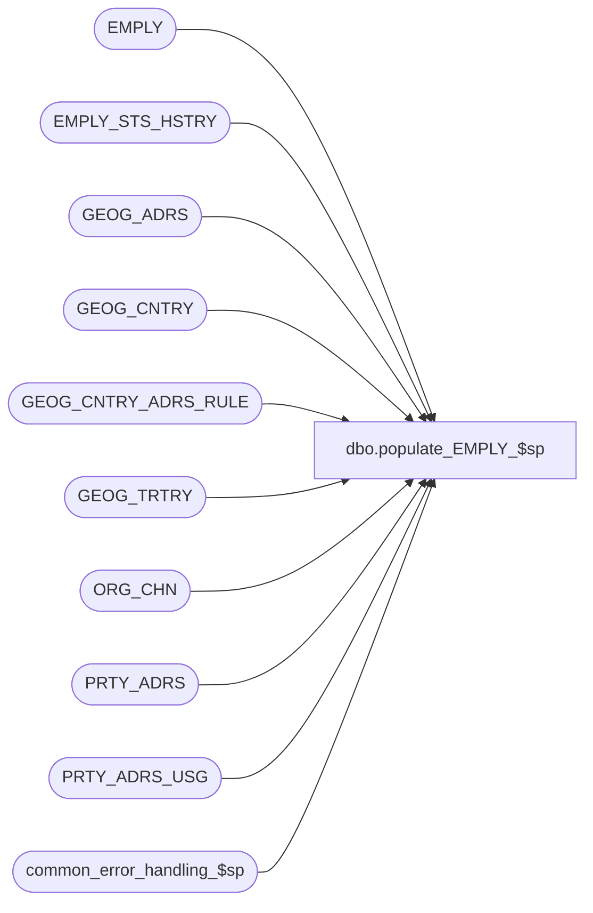

# dbo.populate_EMPLY_$sp

**Database:** auditworks  
**Server:** bedrockdb01  

## Architecture Diagram



## Table Dependencies

| Referenced Table |
|---|
| EMPLY |
| EMPLY_STS_HSTRY |
| GEOG_ADRS |
| GEOG_CNTRY |
| GEOG_CNTRY_ADRS_RULE |
| GEOG_TRTRY |
| ORG_CHN |
| PRTY_ADRS |
| PRTY_ADRS_USG |
| common_error_handling_$sp |

## Stored Procedure Code

```sql
create proc dbo.populate_EMPLY_$sp 
@EMPLY_NUM		 int,
@FRST_NAME		 nvarchar(50),
@LAST_NAME		 nvarchar(50),
@ACTV			 numeric(1,0),
@HS_ACNT_NUM		 nvarchar(80),
@PRMY_ORG_CHN_NUM		 int,            
@ADRS_LINE_1		 nvarchar(50),
@ADRS_LINE_2		 nvarchar(50),
@CITY			 nvarchar(50),
@POST_CODE		 nvarchar(15),
@CNTRY_CODE_ISO3	 	nchar(3),
@TRTRY_CODE		 nchar(3),
@HIRE_DATE		 datetime = NULL

AS

/* 

PROC NAME: populate_EMPLY_$sp
       DESC: Create/Modify an employee in table EMPLY.
       	     Home store and employee address are non-mandatory in NSB Merchandising. 
             Called by Merchandising pipeline segment.

HISTORY:
Date     Name        Def# Desc
Aug07,13 Paul S.   122423 log warning message 201698 when home store has been defaulted, use try .. catch
Jan17,12 Paul S.   132439 Remove references to CRDM user-defined string datatypes from S/A since CRDM is not changing them to support unicode.
Apr01,11 Paul S.          Use try .. catch to better handle errors
May15,07 Paul S.    85471 lookup CNTRY_CODE_ISO3 if a 2 character country code is passed in, validate TRTRY, add hire date
Feb12,07 Paul S.    83000 author

*/

DECLARE
        @abort_flag		tinyint,
        @action			nvarchar(1),
        @create_address		tinyint,
        @errmsg                 nvarchar(255),
        @default_home_store_no	int,
	@errno			int,
	@home_store_exists	tinyint,
        @log_flag               tinyint,
        @memo1			nvarchar(50),
        @message_id             int,
        @msg			nvarchar(120),
        @object_name            nvarchar(255),
        @operation_name         nvarchar(100),
        @process_name           nvarchar(100),
        @process_no             smallint,
        @ret_code			smallint,
        @rows			int,
        @ADRS_RULE_ID		binary(16),
        @existing_CNTRY_CODE_ISO3 nchar(3),
        @PRTY_ID			binary(16),
        @ADRS_ID			binary(16),
        @DFLT_ADRS_SEQ          numeric(10,0),
        @CNTRY_CODE_LOOKUP		nchar(3),
        @TRTRY_valid		tinyint
        
SELECT  @process_name = 'populate_EMPLY_$sp',
        @message_id   = 201068,
        @log_flag     = 0,
        @process_no   = 0,
        @action       = 'A',
        @errno        = 0,
        @abort_flag   = 0,
        @memo1	      = null,
        @ret_code     = 1,
        @home_store_exists = 0,
        @create_address = 1,
        @DFLT_ADRS_SEQ = NULL,
        @TRTRY_valid  = 0,
        @ADRS_RULE_ID = NULL

BEGIN TRY
     SELECT @errmsg        = 'Failed to find employee',
           @object_name    = 'EMPLY',
           @operation_name = 'SELECT'

SELECT @PRTY_ID = PRTY_ID,
	@default_home_store_no = PRMY_ORG_CHN_NUM
  FROM EMPLY
 WHERE EMPLY_NUM = @EMPLY_NUM

SELECT @rows = @@rowcount

IF @rows > 0
  BEGIN
   SELECT @action = 'M' -- modify existing employee

   IF @PRMY_ORG_CHN_NUM IS NULL -- if not specified then retain store that was originally set on insert
     SELECT @PRMY_ORG_CHN_NUM = @default_home_store_no

   SELECT @errmsg        = 'Failed to find PRTY_ADRS/GEOG_ADRS',
           @object_name    = 'PRTY_ADRS/GEOG_ADRS'

   SELECT @ADRS_RULE_ID = ga.ADRS_RULE_ID,
	@existing_CNTRY_CODE_ISO3 = ga.CNTRY_CODE_ISO3
   FROM PRTY_ADRS pa, GEOG_ADRS ga
   WHERE  pa.PRTY_ID = @PRTY_ID
     AND  pa.ADRS_ID = ga.ADRS_ID

   SELECT @rows = @@rowcount
   IF @rows > 0
     BEGIN
	SELECT @create_address = 0 -- already exists

	IF @CNTRY_CODE_ISO3 IS NULL -- retain if already set
	  SELECT @CNTRY_CODE_ISO3 = @existing_CNTRY_CODE_ISO3
     END
  END

IF LEN(@CNTRY_CODE_ISO3) = 2 -- lookup CNTRY_CODE_ISO3 using CNTRY_CODE_ISO2
BEGIN
   SELECT @errmsg        = 'Failed to find country code',
           @object_name    = 'GEOG_CNTRY'

  SELECT @CNTRY_CODE_LOOKUP = CNTRY_CODE_ISO3
  FROM GEOG_CNTRY
  WHERE CNTRY_CODE_ISO2 = @CNTRY_CODE_ISO3
  
  SELECT @rows = @@rowcount
  IF @rows > 0
    SELECT @CNTRY_CODE_ISO3 = @CNTRY_CODE_LOOKUP
END

IF @TRTRY_CODE IS NOT NULL
BEGIN
   SELECT @errmsg        = 'Failed to find GEOG_TRTRY',
           @object_name    = 'GEOG_TRTRY'
  IF EXISTS(SELECT 1 FROM GEOG_TRTRY
     WHERE TRTRY_CODE = @TRTRY_CODE AND CNTRY_CODE_ISO3 = @CNTRY_CODE_ISO3)
    SELECT @TRTRY_valid = 1

  IF @TRTRY_valid = 0
    SELECT @TRTRY_CODE = '  ' -- set to default territory code if territory is not valid
END

-- Look up ADRS_RULE_ID using CNTRY_CODE_ISO3
   SELECT @errmsg        = 'Failed to find GEOG_CNTRY_ADRS_RULE',
           @object_name    = 'GEOG_CNTRY_ADRS_RULE'

SELECT @ADRS_RULE_ID = ADRS_RULE_ID
  FROM GEOG_CNTRY_ADRS_RULE
 WHERE CNTRY_CODE_ISO3 = @CNTRY_CODE_ISO3


-- Check whether home store exists. If not then default to first store.

IF @PRMY_ORG_CHN_NUM IS NOT NULL
  BEGIN
   SELECT @errmsg        = 'Failed to find employee home store',
           @object_name    = 'ORG_CHN'

    SELECT @home_store_exists = 1
    FROM ORG_CHN
    WHERE ORG_CHN_NUM = @PRMY_ORG_CHN_NUM

  END -- If @PRMY_ORG_CHN_NUM is not null


IF @home_store_exists = 0 -- can happen on initial insert since home store is not mandatory in Merch
    BEGIN
     SELECT @default_home_store_no = 0,
           @errmsg        = 'Failed to find default home store',
           @object_name    = 'ORG_CHN'

     SELECT @default_home_store_no = ISNULL(MIN(ORG_CHN_NUM),0)
     FROM ORG_CHN
     WHERE ACTV = 1

     SELECT @rows = @@rowcount, @errno = 201068
     IF @rows = 0
	  GOTO error

     SELECT @PRMY_ORG_CHN_NUM = @default_home_store_no

    END -- If @home_store_exists = 0

IF @action = 'A'
  SELECT @PRTY_ID = NEWID()

BEGIN TRAN

IF @create_address = 1 AND @CNTRY_CODE_ISO3 IS NOT NULL -- create address info when available
BEGIN
  SELECT @DFLT_ADRS_SEQ = 1,
    @ADRS_ID = NEWID()
  SELECT @errmsg        = 'Failed to insert PRTY_ADRS_USG',
		@object_name    = 'PRTY_ADRS_USG',
		@operation_name = 'INSERT'

  INSERT PRTY_ADRS_USG
	     (PRTY_ID, PRTY_ADRS_SEQ, PRTY_ADRS_DESC, ADRS_FNCTN_CODE)
  VALUES
	     (@PRTY_ID, @DFLT_ADRS_SEQ, @EMPLY_NUM, 'PRMY')

  SELECT @errmsg        = 'Failed to insert GEOG_ADRS',
		@object_name    = 'GEOG_ADRS'

  INSERT GEOG_ADRS
     (ADRS_ID, ADRS_LINE_1, ADRS_LINE_2, ADRS_LINE_3, ADRS_LINE_4, CITY,
      POST_CODE, ADRS_MTCH_KEY, CNTRY_CODE_ISO3, TRTRY_CODE, ADRS_RULE_ID)
  VALUES
	     (@ADRS_ID, @ADRS_LINE_1, @ADRS_LINE_2, NULL, NULL, @CITY,
	      @POST_CODE, NULL, @CNTRY_CODE_ISO3, @TRTRY_CODE, @ADRS_RULE_ID)

  SELECT @errmsg        = 'Failed to insert PRTY_ADRS',
		@object_name    = 'PRTY_ADRS'
	   
  INSERT PRTY_ADRS
	         (PRTY_ADRS_ID, PRTY_ID, ADRS_ID, PRTY_ADRS_SEQ, EFCTV_STRT_DATE, 
	          PRTY_ADRS_DESC, ADRS_FNCTN_CODE)
  SELECT NEWID(), @PRTY_ID, @ADRS_ID, PRTY_ADRS_SEQ, GETDATE(),
	          PRTY_ADRS_DESC, ADRS_FNCTN_CODE
	  FROM PRTY_ADRS_USG
	 WHERE PRTY_ID = @PRTY_ID

END -- If @create_address = 1


IF @action = 'A' -- add a new employee
BEGIN   
   SELECT @errmsg        = 'Failed to insert EMPLY',
		@object_name    = 'EMPLY',
		@operation_name = 'INSERT'

   IF @HIRE_DATE IS NULL
     SELECT @HIRE_DATE = DATEADD(dd,-1,getdate()) -- default to yesterday

   INSERT EMPLY
     (EMPLY_NUM, FRST_NAME, LAST_NAME, ACTV, SHRT_NAME, HS_ACNT_NUM, SNRTY_DATE,
      EMPLY_STS_CODE, PRMY_ORG_CHN_NUM, PRTY_ID, DFLT_ADRS_SEQ)
   VALUES
     (@EMPLY_NUM, @FRST_NAME, @LAST_NAME, @ACTV, @FRST_NAME, @HS_ACNT_NUM, @HIRE_DATE,
      'HIRE', @PRMY_ORG_CHN_NUM, @PRTY_ID, @DFLT_ADRS_SEQ)

   SELECT @errmsg        = 'Failed to insert EMPLY_STS_HSTRY',
		@object_name    = 'EMPLY_STS_HSTRY'

   INSERT EMPLY_STS_HSTRY (EMPLY_NUM, EFCTV_DATE, EMPLY_STS_CODE, EXPRTN_DATE)
   VALUES (@EMPLY_NUM,@HIRE_DATE,'HIRE',null)

END -- add a new employee


IF @action = 'M' -- modify an employee
BEGIN
   SELECT @errmsg        = 'Failed to update EMPLY',
		@object_name    = 'EMPLY',
		@operation_name = 'UPDATE'

   UPDATE EMPLY
   SET    FRST_NAME = @FRST_NAME,
          LAST_NAME = ISNULL(@LAST_NAME, LAST_NAME), 
          ACTV = @ACTV, 
          SHRT_NAME = ISNULL(@FRST_NAME, SHRT_NAME), 
          HS_ACNT_NUM = @HS_ACNT_NUM,
          PRMY_ORG_CHN_NUM = @PRMY_ORG_CHN_NUM
   WHERE  EMPLY_NUM = @EMPLY_NUM

   SELECT @errmsg        = 'Failed to update GEOG_ADRS',
		@object_name    = 'GEOG_ADRS'
   
   UPDATE GEOG_ADRS
   SET ADRS_LINE_1 = @ADRS_LINE_1,
          ADRS_LINE_2 = @ADRS_LINE_2,
          CITY = @CITY,
          POST_CODE = @POST_CODE,
          CNTRY_CODE_ISO3 = @CNTRY_CODE_ISO3,
          TRTRY_CODE = @TRTRY_CODE,
          ADRS_RULE_ID = @ADRS_RULE_ID
    FROM PRTY_ADRS pa, GEOG_ADRS ga
   WHERE  pa.PRTY_ID = @PRTY_ID
     AND  pa.ADRS_ID = ga.ADRS_ID

END -- modify an employee

COMMIT

IF @home_store_exists = 0 -- log a warning
    BEGIN
     SELECT @errmsg = 'WARNING: Employee home store has been defaulted for employee |1',
      @memo1 = CONVERT(nvarchar,@EMPLY_NUM),
      @errno = 201698,
      @ret_code = 0,
      @abort_flag = 3, -- log warning but don't raise error
      @object_name    = null,
      @operation_name = null

     GOTO error
    END

RETURN 0

error: -- used by business rule errors

  EXEC common_error_handling_$sp @process_no, @errno, @errmsg, @abort_flag, @message_id,
                                 @process_name, @object_name, @operation_name, @log_flag, 1, 0, null, 0, @memo1
  RETURN @ret_code

END TRY

BEGIN CATCH -- general error trap
   SELECT @errno = ERROR_NUMBER(),
		@errmsg = COALESCE(@errmsg, ' ') + ERROR_MESSAGE()

  EXEC common_error_handling_$sp @process_no, @errno, @errmsg, @abort_flag, @message_id,
                                 @process_name, @object_name, @operation_name, @log_flag, 1, 0, null, 0, @memo1
  RETURN @ret_code
END CATCH
```

