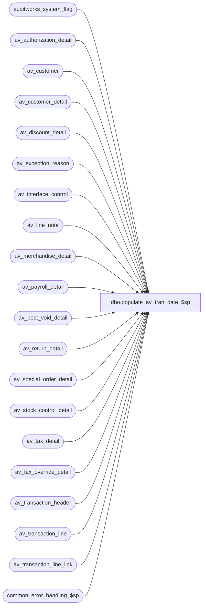

# dbo.populate_av_tran_date_$sp

**Database:** auditworks  
**Server:** bedrockdb01  

## Architecture Diagram



## Table Dependencies

| Referenced Table |
|---|
| auditworks_system_flag |
| av_authorization_detail |
| av_customer |
| av_customer_detail |
| av_discount_detail |
| av_exception_reason |
| av_interface_control |
| av_line_note |
| av_merchandise_detail |
| av_payroll_detail |
| av_post_void_detail |
| av_return_detail |
| av_special_order_detail |
| av_stock_control_detail |
| av_tax_detail |
| av_tax_override_detail |
| av_transaction_header |
| av_transaction_line |
| av_transaction_line_link |
| common_error_handling_$sp |

## Stored Procedure Code

```sql
CREATE proc [dbo].[populate_av_tran_date_$sp] 
 @request_type          smallint = 1 /* 1= all rows, 2= limit rows updated */

AS

/* Proc name: populate_av_tran_date_$sp
   Desc: This procedure will set the transaction_date column in the av detail tables if it is null.
         It is presumed that tran date must be populated in all archive table rows before running SA5.1 reports.
         This handles the initial population after upgrading to SA5.1 by allowing spreading the
          updating of the archive over multiple executions of this proc.
         The upgrade from SA 5.0 to SA5.1 calls this proc using request_type = 2 in order to limit upgrade duration by
          populating only the first 1000000 transactions or so.
         The intent of request_type = 1 is to allow a tpl to run this proc in parallel to the main upgrade (or afterwards)
          using request_type 1 in order to complete the population of tran date  of any remaining rows in archive (with rdbms 
          logging set to simple) that were not processed by the main ugrade due to trans volumes exceeding 1000000.
         For small databases, all rows will be updated when the upgrade to 5.1 calls this proc.
         In case of errors, this proc is restartable by simply executing it again.
         Called by the upgrade to SA5.1 (zzzz_populate_av_tran_date_$upgr in SA 5.00t511); can also be run manually without harm.

   WARNINGS: If partitioning will be used/installed on the av* tables, then it is recommended that the population of 
         transaction_date in the archive tables should be complete before installing SA_PART because updating the
         transaction_date column when the indices on the av tables already include transaction_date as a key could be slow.
         The reason is that updating the columns that are the partitioned key when an index exists (containing the partition key) 
         will cause SQL to shift the data between partitions. This partition split can be slow in Mssql and it is best
         to minimize the number of splits in order to avoid performance degradation.
   
   RECOMMENDATIONS:
       1) The transaction volume in av_transaction_header should be quantified as part of planning an upgrade for existing clients.

       2) If that volume is very large (> 20 million transactions), then verify that the Mssql transaction log space will be sufficient 
       for the upgrade. Normally the recovery model db property should be changed to simple before the upgrade, in order to minimize
        disk space used due to dumping transaction logs. Then after the upgrade, the db can be backed up and then modified back to the
        previous setting for recovery model.\brettc
        
       3) If that volume is very large (> 20 million transactions), then it may be necessary to plan how to install partitioning on
          each large av table. One method would be to update the transaction_date in the source av table, then bulk copy out data 
           (bcp -c) to a file, then create a table that is a copy of the av table, install partitioning index on the table copy, 
           and then bcp the file into the copy. If the SA application is not in use, then it may be easier to rename the original av
           table, bcp out, and create the new copy of the table using the real av* table name, install the partitioning index,
            then bcp in the data. Repeat for each av table. Check that each bcp did not fail in order to minimize the chance of
            data loss.
          TIP: When an av* table contains a small volume (< 1 million rows), simply installing the partitioned index
            (nomally the clustered x0 index) will be sufficient to install partitioning on that table, presuming that transaction_date
            has already been populated in that table.

           
History: 
Date     Name         Def Desc
Apr09,15 Paul      140452 improved warning message re running proc manually
Jul11,13 Paul      140452 return when av_transaction_header is empty, added try .. catch, handle initialize scenario
Jul30,12 Paul      128524 added @request_type options
Nov29,11 Paul      128524 author

*/

DECLARE
	@end_tran_id			numeric(14,0),
	@errno				int,
	@errmsg				nvarchar(2000),
	@instance_id			int,
	@last_updated_av_tranid		numeric(14,0),
	@max_tran_id			numeric(14,0),
	@message_id		        int,	
	@object_name			nvarchar(255),
	@operation_name			nvarchar(100),
	@process_name		        nvarchar(100),
	@rows				int,
	@rows_found			int,
	@start_tran_id			numeric(14,0),
	@tran_batch_size		numeric(14,0),
	@tran_daily_limit		int,
	@process_id			binary(16),
	@user_id			int;

SELECT @process_name = 'populate_av_tran_date_$sp',
       @message_id = 201068,
       @user_id = NULL, -- system
       @process_id = newid(),
       @tran_batch_size = 50000,
       @end_tran_id = 0,
       @rows_found = 0,
       @tran_daily_limit = 1000000; /* max trans to update when using request_type 2 */

BEGIN TRY
    SELECT @errmsg = 'Failed to select instance_id from auditworks_system_flag',
           @object_name = 'auditworks_system_flag',
           @operation_name = 'SELECT';

SELECT @instance_id = CONVERT(int,flag_numeric_value)
  FROM auditworks_system_flag
 WHERE flag_name = 'instance_id';

SELECT @rows = @@rowcount;
IF @rows = 0
  BEGIN
    GOTO error;
  END;

IF @instance_id > 0  /* do not run on scaleout peripheral */
  RETURN;

SET NOCOUNT ON

/* retrieve last processed av_transaction_id from flag_alpha_value since the flag_numeric_value column is too small to store 14 digits */

SELECT @last_updated_av_tranid = NULL
    SELECT @errmsg = 'Failed to select last_updated_av_tranid from auditworks_system_flag';

SELECT @last_updated_av_tranid = CONVERT(numeric(14,0), flag_alpha_value)
  FROM auditworks_system_flag
 WHERE flag_name = 'last_updated_av_tranid';

SELECT @rows = @@rowcount;

IF @rows = 0
  BEGIN
	INSERT INTO auditworks_system_flag (flag_name, flag_alpha_value, flag_comment, flag_alpha_initialize_value)
	VALUES( 'last_updated_av_tranid',
		NULL,
		'Used to populate av tran dates during upgrade to SA 5.1',
		'-1');
  END;

/* If tran date population has already been competed then do nothing */

IF @last_updated_av_tranid = -1
  BEGIN
   PRINT ' :LOG Data population of tran date in archive is already complete.';
   RETURN;
  END;

SELECT @max_tran_id = MAX(av_transaction_id)
  FROM av_transaction_header;

/* Check for an initialized db and reset last_updated_av_tranid */
IF @max_tran_id IS NULL -- THEN
BEGIN
	UPDATE auditworks_system_flag
	  SET flag_alpha_value = NULL, flag_alpha_initialize_value = NULL
	 WHERE flag_name = 'last_updated_av_tranid';
	RETURN;
END;

IF @last_updated_av_tranid IS NULL /* population was not started yet */
BEGIN  
  SELECT @last_updated_av_tranid = MIN(av_transaction_id) - 1
    FROM av_transaction_header;

  IF @max_tran_id IS NULL OR @last_updated_av_tranid IS NULL -- no rows exist in table
	SELECT @last_updated_av_tranid = -1;
END;

    SELECT @errmsg = 'Failed to create table #work_av_list',
           @object_name = '#work_av_list',
           @operation_name = 'CREATE';
CREATE TABLE #work_av_list (
	transaction_id     numeric(14,0),
	transaction_date   smalldatetime not null);

/* create index on temp table for performance */

CREATE UNIQUE INDEX t_work_av_list_x0 
  ON #work_av_list (transaction_id) INCLUDE (transaction_date);

SELECT @start_tran_id = @last_updated_av_tranid + 1;
SELECT @end_tran_id = @start_tran_id + @tran_batch_size;

IF @end_tran_id > @max_tran_id
  SELECT @end_tran_id = COALESCE(@max_tran_id,0);

-- loop until max per day or end of table has been reached
-- will always loop at least once in order to update auditworks_system_flag


WHILE @end_tran_id >= 0
BEGIN

	    SELECT @errmsg = 'Failed to insert #work_av_list',
	 @object_name = '#work_av_list',
	           @operation_name = 'INSERT';
	INSERT INTO #work_av_list (
		transaction_id, transaction_date )
	SELECT av_transaction_id, transaction_date
	  FROM av_transaction_header
	 WHERE av_transaction_id >= @start_tran_id
	   AND av_transaction_id <= @end_tran_id;

	SELECT @rows = @@rowcount;

	IF @rows > 0
	BEGIN
	  IF @rows_found = 0 -- first pass
		BEGIN
		  PRINT ':LOG Populating transaction_date in archive tables.';
		END;

	  SELECT @rows_found = @rows_found + @rows;

	  /* Update transaction_date in the archive tables.
	     Using a range of transaction_id to improve performance for large archives */

		SELECT @errmsg = 'Failed to update tran date in archive table',
		          @operation_name = 'UPDATE';

		  SELECT @object_name = 'av_interface_control';
		UPDATE av_interface_control
		  SET transaction_date = w.transaction_date
		 FROM #work_av_list w, av_interface_control ic
		WHERE w.transaction_id = ic.av_transaction_id
		  AND ic.transaction_date IS NULL
		  AND ic.av_transaction_id >= @start_tran_id
		  AND ic.av_transaction_id <= @end_tran_id;

		  /* this smaller table should not need a clause with @start_tran_id */ 
		  SELECT @object_name = 'av_exception_reason';
		UPDATE av_exception_reason
		  SET transaction_date = w.transaction_date
		 FROM #work_av_list w, av_exception_reason er
		WHERE w.transaction_id = er.av_transaction_id
		  AND er.transaction_date IS NULL;

		/* tran date in av_if_rejection_reason was already populated in SA5 */

		  SELECT @object_name = 'av_authorization_detail';
		UPDATE av_authorization_detail
		  SET transaction_date = w.transaction_date
		 FROM #work_av_list w, av_authorization_detail ad
		WHERE w.transaction_id = ad.av_transaction_id
		  AND ad.transaction_date IS NULL
		  AND ad.av_transaction_id >= @start_tran_id
		  AND ad.av_transaction_id <= @end_tran_id;

		  SELECT @object_name = 'av_customer';
		UPDATE av_customer
		  SET transaction_date = w.transaction_date
		 FROM #work_av_list w, av_customer ac
		WHERE w.transaction_id = ac.av_transaction_id
		  AND ac.transaction_date IS NULL
		  AND ac.av_transaction_id >= @start_tran_id
		  AND ac.av_transaction_id <= @end_tran_id;

		  SELECT @object_name = 'av_customer_detail';
		UPDATE av_customer_detail
		  SET transaction_date = w.transaction_date
		 FROM #work_av_list w, av_customer_detail ac
		WHERE w.transaction_id = ac.av_transaction_id
		  AND ac.transaction_date IS NULL
		  AND ac.av_transaction_id >= @start_tran_id
		  AND ac.av_transaction_id <= @end_tran_id;

		  SELECT @object_name = 'av_discount_detail';
		UPDATE av_discount_detail
		  SET transaction_date = w.transaction_date
		 FROM #work_av_list w, av_discount_detail dd
		WHERE w.transaction_id = dd.av_transaction_id
		  AND dd.transaction_date IS NULL
		  AND dd.av_transaction_id >= @start_tran_id
		  AND dd.av_transaction_id <= @end_tran_id;

		  SELECT @object_name = 'av_line_note';
		UPDATE av_line_note
		  SET transaction_date = w.transaction_date
		 FROM #work_av_list w, av_line_note ln
		WHERE w.transaction_id = ln.av_transaction_id
		  AND ln.transaction_date IS NULL
		  AND ln.av_transaction_id >= @start_tran_id
		  AND ln.av_transaction_id <= @end_tran_id;

		  SELECT @object_name = 'av_merchandise_detail';
		UPDATE av_merchandise_detail
		  SET transaction_date = w.transaction_date
		 FROM #work_av_list w, av_merchandise_detail md
		WHERE w.transaction_id = md.av_transaction_id
		  AND md.transaction_date IS NULL
		  AND md.av_transaction_id >= @start_tran_id
		  AND md.av_transaction_id <= @end_tran_id;

		  SELECT @object_name = 'av_payroll_detail';
		UPDATE av_payroll_detail
		  SET transaction_date = w.transaction_date
		 FROM #work_av_list w, av_payroll_detail pd
		WHERE w.transaction_id = pd.av_transaction_id
		  AND pd.transaction_date IS NULL
		  AND pd.av_transaction_id >= @start_tran_id
		  AND pd.av_transaction_id <= @end_tran_id;

		  SELECT @object_name = 'av_post_void_detail';
		UPDATE av_post_void_detail
		  SET transaction_date = w.transaction_date
		 FROM #work_av_list w, av_post_void_detail pv
		WHERE w.transaction_id = pv.av_transaction_id
		  AND pv.transaction_date IS NULL
		  AND pv.av_transaction_id >= @start_tran_id
		  AND pv.av_transaction_id <= @end_tran_id;

		  SELECT @object_name = 'av_return_detail';
		UPDATE av_return_detail
		  SET transaction_date = w.transaction_date
		 FROM #work_av_list w, av_return_detail rd
		WHERE w.transaction_id = rd.av_transaction_id
		  AND rd.transaction_date IS NULL
		  AND rd.av_transaction_id >= @start_tran_id
		  AND rd.av_transaction_id <= @end_tran_id;

		  SELECT @object_name = 'av_special_order_detail';
		UPDATE av_special_order_detail
		  SET transaction_date = w.transaction_date
		 FROM #work_av_list w, av_special_order_detail sd
		WHERE w.transaction_id = sd.av_transaction_id
		  AND sd.transaction_date IS NULL
		  AND sd.av_transaction_id >= @start_tran_id
		  AND sd.av_transaction_id <= @end_tran_id;

		  SELECT @object_name = 'av_stock_control_detail';
		UPDATE av_stock_control_detail
		  SET transaction_date = w.transaction_date
		 FROM #work_av_list w, av_stock_control_detail sd
		WHERE w.transaction_id = sd.av_transaction_id
		  AND sd.transaction_date IS NULL
		  AND sd.av_transaction_id >= @start_tran_id
		  AND sd.av_transaction_id <= @end_tran_id;

		  SELECT @object_name = 'av_tax_override_detail';
		UPDATE av_tax_override_detail
		  SET transaction_date = w.transaction_date
		 FROM #work_av_list w, av_tax_override_detail td
		WHERE w.transaction_id = td.av_transaction_id
		  AND td.transaction_date IS NULL
		  AND td.av_transaction_id >= @start_tran_id
		  AND td.av_transaction_id <= @end_tran_id;

		  SELECT @object_name = 'av_tax_detail';
		UPDATE av_tax_detail
		  SET transaction_date = w.transaction_date
		 FROM #work_av_list w, av_tax_detail td
		WHERE w.transaction_id = td.av_transaction_id
		  AND td.transaction_date IS NULL
		  AND td.av_transaction_id >= @start_tran_id
		  AND td.av_transaction_id <= @end_tran_id;

		  SELECT @object_name = 'av_transaction_line_link';
		UPDATE av_transaction_line_link
		  SET transaction_date = w.transaction_date
		 FROM #work_av_list w, av_transaction_line_link ll
		WHERE w.transaction_id = ll.av_transaction_id
		  AND ll.transaction_date IS NULL
		  AND ll.av_transaction_id >= @start_tran_id
		  AND ll.av_transaction_id <= @end_tran_id;

		/* update tran line last */
		  SELECT @object_name = 'av_transaction_line';
		UPDATE av_transaction_line
		  SET transaction_date = w.transaction_date
		 FROM #work_av_list w, av_transaction_line tl
		WHERE w.transaction_id = tl.av_transaction_id
		  AND tl.transaction_date IS NULL
		  AND tl.av_transaction_id >= @start_tran_id
		  AND tl.av_transaction_id <= @end_tran_id;

		SELECT @errmsg = 'Failed to truncate #work_av_list',
		       @object_name = '#work_av_list',
		       @operation_name = 'TRUNCATE';
	  TRUNCATE TABLE #work_av_list;

	END  -- If @rows > 0

	IF @end_tran_id >= @max_tran_id
	  BEGIN
	   SELECT @end_tran_id = @max_tran_id; /* population is likely now complete */

	   /* However, check whether max has increased during execution to handle
	     possible simultaneous inserts to av_transaction_line by dayend streams */
	   SELECT @max_tran_id = MAX(av_transaction_id)
	     FROM av_transaction_header;
	  END;
	
	  /* set completion flag only when no rows have been found on this last pass. Otherwise loop again. */
	IF @rows = 0 AND (@end_tran_id >= @max_tran_id OR @max_tran_id IS NULL)
	BEGIN
	  SELECT @end_tran_id = -1, /* population is now complete */
		@errmsg = ':LOG Population of av tran date is now complete. trans updated = ' + CONVERT(nvarchar,@rows_found);
	  PRINT @errmsg;
	END;

		SELECT @errmsg = 'Failed to set flag_alpha_value',
		       @object_name = 'auditworks_system_flag';
	UPDATE auditworks_system_flag
	  SET flag_alpha_value = CONVERT(nvarchar,@end_tran_id)
	 WHERE flag_name = 'last_updated_av_tranid';
	
	IF @end_tran_id > 0
	BEGIN
	  SELECT @start_tran_id = @end_tran_id + 1;
	  SELECT @end_tran_id = @start_tran_id + @tran_batch_size;
	END;

	IF @rows_found > @tran_daily_limit AND @end_tran_id > 0 AND @request_type > 1
	  BEGIN
	   SELECT @end_tran_id = -2, /* finished for today but more work remains to be done later when next executed */
		@errmsg = ':LOG *** WARNING! Population of transaction_date is incomplete (row limit reached). trans updated = ' + CONVERT(nvarchar,@rows_found);
	   PRINT @errmsg;
	   SELECT @errmsg = ':LOG *** ACTION IS REQUIRED !!! EXEC proc populate_av_tran_date_$sp again manually after upgrade to complete the population.';
	   PRINT @errmsg;
	  END;

END; -- while @end_tran_id >= 0

DROP TABLE #work_av_list;

SET NOCOUNT OFF;

RETURN;  

error: -- business rules
   EXEC common_error_handling_$sp 36, @errno, @errmsg, 0, @message_id, 
	@process_name, @object_name, @operation_name, 0, 1, 0, null, 0, null, null, null,
	  null, null, null, 0, @process_id, @user_id

RETURN;

END TRY

BEGIN CATCH; /* global error handler */
   SELECT @errno = ERROR_NUMBER(),
		@errmsg = COALESCE(@errmsg, ' ') + ERROR_MESSAGE();

   EXEC common_error_handling_$sp 36, @errno, @errmsg, 0, @message_id, 
	@process_name, @object_name, @operation_name, 0, 1, 0, null, 0, null, null, null,
	  null, null, null, 0, @process_id, @user_id;

RETURN;

END CATCH;
```

