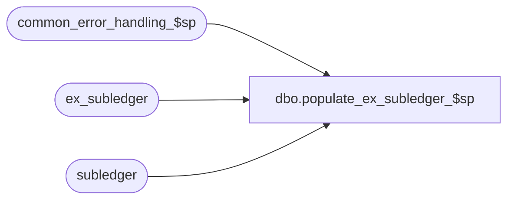

# dbo.populate_ex_subledger_$sp

**Database:** auditworks  
**Server:** bedrockdb01  

## Architecture Diagram



## Table Dependencies

| Referenced Table |
|---|
| common_error_handling_$sp |
| ex_subledger |
| subledger |

## Stored Procedure Code

```sql
create proc dbo.populate_ex_subledger_$sp 
  @before_delete_date smalldatetime

AS

  /*
             Name : populate_ex_subledger_$sp
      Description : Copy pending purge subledger items to external archive database prior to purge.
                    Called from subledger_rollup_$sp.

  HISTORY :
Date     Name         Defect#  Description
Feb02,15 Paul S         94760  use try catch to match calling proc
Jun01,14 Ian K          63833  Initial Creation
  */

DECLARE

  @message_id        int,
  @object_name       nvarchar(255),
  @operation_name    nvarchar(100),
  @process_name      nvarchar(100),
  @errline           int,
  @errno             int,
  @errmsg            nvarchar(2000),
  @errmsg2           nvarchar(2000),
  @process_no        int,
  @transaction_date  smalldatetime,
  @store_no          int,
  @cursor_open       int; 
  
  
  SELECT @message_id   = 201068,
  	@process_name = 'populate_ex_subledger_$sp',
  	@cursor_open  = 0;

BEGIN TRY  

    SELECT @errmsg = 'Unable to open cursor c_subledger_copy',
           @object_name = 'c_subledger_copy',
           @operation_name = 'OPEN';  
  DECLARE c_subledger_copy CURSOR FAST_FORWARD
  FOR
      SELECT DISTINCT transaction_date, store_no
      FROM subledger
     WHERE transaction_date <= @before_delete_date;

  SET XACT_ABORT ON;
    
  /* 
     This procedure also takes care of the pruning of old subledger records as we need to keep the
     copy and delete in sync in case of failure
     
     We have to cursor through them in batches as there is no unique key to determine if they already
     exist in the external database. The worst case is that one insert rolls back in the event of an error.
  
  */

  
  OPEN c_subledger_copy;
  SELECT @cursor_open = 1;
  
  WHILE 1=1
  BEGIN
  
    FETCH c_subledger_copy INTO
      @transaction_date, @store_no;
      
    IF @@fetch_status <> 0
      BREAK;

      SELECT @errmsg = 'Unable to copy subledger to external archive',
             @object_name = 'ex_subledger',
             @operation_name = 'INSERT';
    BEGIN TRANSACTION;
    
    INSERT INTO ex_subledger
      SELECT *
        FROM subledger
       WHERE transaction_date = @transaction_date
         AND store_no         = @store_no;

      SELECT @errmsg = 'Unable to delete subledger',
             @object_name = 'subledger',
             @operation_name = 'DELETE';
    DELETE subledger
      WHERE transaction_date = @transaction_date
        AND store_no         = @store_no;

    COMMIT;           

  END; -- While 1=1
  
  CLOSE c_subledger_copy;
  DEALLOCATE c_subledger_copy;
    
  RETURN;
  

business_error:   /* Business Rule handler. */

  SELECT @errmsg2 = @errmsg;

	/* Could include similar cleanup code to system error trap when needed (example is from move_store_$sp).
	   However, could also exclude the cleanup code here since the outer system error catch should fire again after the exec below. */

  EXEC common_error_handling_$sp @process_no, @errno, @errmsg, 0, @message_id,
                @process_name, @object_name, @operation_name, 1;
	  /* Note: when the exec above raises an error, that action also fires the system error trap (below) */
  RETURN;
END TRY

BEGIN CATCH; -- trap system errors
    /* common error handling. Appending proc name here because a rollback could occur if called within a transaction. */

  SELECT @errno = ERROR_NUMBER(),
		@errline = ERROR_LINE();

  SELECT @errmsg = CONVERT(nvarchar, @errno) + ':' + @process_name + ':' + CONVERT(nvarchar, @errline) + ':'
               + COALESCE(@errmsg, ' ') + ':' + ERROR_MESSAGE();

	 /* this condition will only be true when raise error in traps above fire this general catch */
  IF @errmsg2 IS NOT NULL
	  SELECT @errmsg = @errmsg2;

  IF @cursor_open = 1
  BEGIN
        CLOSE c_subledger_copy;
        DEALLOCATE c_subledger_copy;
  END;
  
  EXEC common_error_handling_$sp @process_no, @errno, @errmsg, 0, @message_id,
                @process_name, @object_name, @operation_name, 1;

  RETURN;
END CATCH;
```

