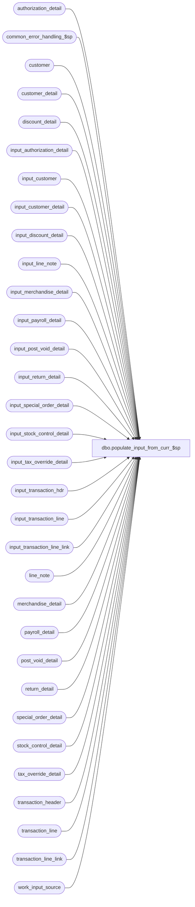

# dbo.populate_input_from_curr_$sp

**Database:** auditworks  
**Server:** bedrockdb01  

## Architecture Diagram



## Table Dependencies

| Referenced Table |
|---|
| authorization_detail |
| common_error_handling_$sp |
| customer |
| customer_detail |
| discount_detail |
| input_authorization_detail |
| input_customer |
| input_customer_detail |
| input_discount_detail |
| input_line_note |
| input_merchandise_detail |
| input_payroll_detail |
| input_post_void_detail |
| input_return_detail |
| input_special_order_detail |
| input_stock_control_detail |
| input_tax_override_detail |
| input_transaction_hdr |
| input_transaction_line |
| input_transaction_line_link |
| line_note |
| merchandise_detail |
| payroll_detail |
| post_void_detail |
| return_detail |
| special_order_detail |
| stock_control_detail |
| tax_override_detail |
| transaction_header |
| transaction_line |
| transaction_line_link |
| work_input_source |

## Stored Procedure Code

```sql
create proc dbo.populate_input_from_curr_$sp    @input_id int,
   @errmsg nvarchar(255) OUTPUT   
AS

/* 
PROC NAME: populate_input_from_curr_$sp
     DESC: Populate input tables for current transaction tables. 
HISTORY:
Date     Name         Def# Desc
Oct22,14 Vicci   TFS-81700 Copy merchandise attachment cost field.
Mar22,05 Maryam    DV-1202 Rename from_line_id to line_id.
Mar18,05 David     DV-1202 Add display_def_id input_stock_control_detail.
Mar16,05 Maryam    DV-1202 insert into input_transaction_line_link.
Jan19,05 Paul      DV-1200 populate offline_flag
Jun28,05 ShuZ      DV-1071 Add without_receipt_flag when populating return_detail tables.
Apr24,03 Paul      1-KO2HY populate till_no
Aug28,02 Winnie    1-F0UWT Insert 0 as the line_object_adjustment when inserting to input_transaction_line.
Dec27,01 ShuZ      1-9VYFH make errmsg as OUTPUT
Nov15,01 DavidM       8885 input_transaction_line.pos_discount_amount should be set to 0 as default.
                            specify the colume name when populating input tables
Sept,04  ShuZ         8673 Author, port from Oracle
*/


DECLARE

	@errno 				int,
	@object_name			nvarchar(255),
	@process_name			nvarchar(100),
	@operation_name			nvarchar(100),
	@message_id			int	
	
SELECT @process_name = 'populate_input_from_curr_$sp',
       @message_id = 201068	


  INSERT INTO input_authorization_detail(
	input_id,
	store_no,
	register_no,
	entry_date_time,
	transaction_series,
	transaction_no,
	line_id,
	customer_signature_obtained,
	authorization_no,
	expiry_date,
	swipe_indicator,
	approval_message,
	license_no,
	pos_state_code,
	other_id_type,
	other_id,
	card_type,
	deferred_billing_date,
	deferred_billing_plan,
	offline_flag)
    SELECT  @input_id,
	u.store_no, --store_no,
	u.register_no, --register_no,
    	u.entry_date_time,
	u.transaction_series,--transaction_series,
	u.transaction_no, --transaction_no,
	a.line_id,
	a.customer_signature_obtained,
	a.authorization_no,
	a.expiry_date,
	a.swipe_indicator,
	a.approval_message,
	a.license_no,
	a.pos_state_code,
	a.other_id_type,
	a.other_id,
	a.card_type,
	a.deferred_billing_date,
	a.deferred_billing_plan,
	a.offline_flag
      FROM authorization_detail a, 
           work_input_source u 
        WHERE u.transaction_id = a.transaction_id
        AND u.input_id = @input_id	

  SELECT @errno = @@error
  IF @errno <> 0
    BEGIN
	SELECT @errmsg = 'Failed to insert input_authorization_detail',
               @object_name = 'input_authorization_detail',
               @operation_name = 'INSERT'	
	GOTO error
    END
	
  INSERT INTO input_customer(
	input_id,
	store_no,
	register_no,
	entry_date_time,
	transaction_series,
	transaction_no,
	line_id,
	customer_role,
	title,
	first_name,
	last_name,
	address_1,
	address_2,
	city,
	county,
	state,
	country,
	post_code,
	telephone_no1,
	telephone_no2,
	customer_no,
	--row_sequence_no,
	pos_tax_jurisdiction_code,
	fax,
	email_address)  
    SELECT  @input_id,
	u.store_no, --store_no,
	u.register_no, --register_no,
	u.entry_date_time,
	u.transaction_series,--transaction_series,
	u.transaction_no, --transaction_no,
	c.line_id,
	c.customer_role,
	c.title,
	c.first_name,
	c.last_name,
	c.address_1,
	c.address_2,
	c.city,
	c.county,
	c.state,
	c.country,
	c.post_code,
	c.telephone_no1,
	c.telephone_no2,
	c.customer_no,
	c.pos_tax_jurisdiction_code,
	c.fax,
	c.email_address
  FROM customer c, 
       work_input_source u 
    WHERE u.transaction_id = c.transaction_id
    AND u.input_id = @input_id

  SELECT @errno = @@error
  IF @errno <> 0
    BEGIN
	SELECT @errmsg = 'Failed to insert input_customer',
               @object_name = 'input_customer',
               @operation_name = 'INSERT'	
	GOTO error
    END
    
  INSERT INTO input_customer_detail(
	input_id,
	store_no,
	register_no,
	entry_date_time,
	transaction_series,
	transaction_no,
	line_id,
	customer_role,
	customer_info_type,
	customer_info)  
    SELECT  @input_id,
	u.store_no, --store_no,
	u.register_no, --register_no,
	u.entry_date_time,
	u.transaction_series,--transaction_series,
	u.transaction_no, --transaction_no,
	c.line_id,
	c.customer_role,
	c.customer_info_type,
	c.customer_info
  FROM customer_detail c, 
           work_input_source u 
    WHERE u.transaction_id = c.transaction_id
    AND u.input_id = @input_id    
    
  SELECT @errno = @@error
  IF @errno <> 0
    BEGIN
	SELECT @errmsg = 'Failed to insert input_customer_detail',
               @object_name = 'input_customer_detail',
               @operation_name = 'INSERT'	
	GOTO error
    END   

  INSERT INTO input_discount_detail(
	input_id,
	store_no,
	register_no,
	entry_date_time,
	transaction_series,
	transaction_no,
	line_id,
	line_id_adj,
	pos_discount_level,
	pos_discount_type,
	pos_discount_amount,
	pos_discount_amount_adj,
	discount_amount_sign,
	discount_applied_flag,
	applied_by_line_id,
	pos_discount_serial_no)  
      SELECT  @input_id,
	u.store_no, --store_no,
	u.register_no, --register_no,
	u.entry_date_time,
	u.transaction_series,--transaction_series,
	u.transaction_no, --transaction_no,
	d.line_id,
	0,--d.line_id_adj,
	1, --d.pos_discount_level,
	d.pos_discount_type,
	d.pos_discount_amount,
	0, --d.pos_discount_amount_adj,
	SIGN(SIGN(l.db_cr_none) + SIGN(1 + l.db_cr_none)), --d.discount_amount_sign,
	1, --d.discount_applied_flag,
	d.applied_by_line_id,
	d.pos_discount_serial_no
  FROM discount_detail d, 
       work_input_source u,
       transaction_line l
    WHERE u.transaction_id = d.transaction_id
    AND l.transaction_id = d.transaction_id
    AND l.line_id = d.line_id
    AND u.input_id = @input_id

  SELECT @errno = @@error
  IF @errno <> 0
    BEGIN
	SELECT @errmsg = 'Failed to insert input_discount_detail',
               @object_name = 'input_discount_detail',
               @operation_name = 'INSERT'
	GOTO error
    END       

  INSERT INTO input_line_note(
	input_id,
	store_no,
	register_no,
	entry_date_time,
	transaction_series,
	transaction_no,
	line_id,
	note_type,
	line_note)
    SELECT  @input_id,
	u.store_no, --store_no,
	u.register_no, --register_no,
	u.entry_date_time,
	u.transaction_series,--transaction_series,
	u.transaction_no, --transaction_no,
	l.line_id,
	l.note_type,
	l.line_note
  FROM line_note l, 
       work_input_source u 
    WHERE u.transaction_id = l.transaction_id
    AND u.input_id = @input_id

  SELECT @errno = @@error
  IF @errno <> 0
    BEGIN
	SELECT @errmsg = 'Failed to insert input_line_note',
               @object_name = 'input_line_note',
               @operation_name = 'INSERT'
	GOTO error
    END 

  INSERT INTO input_merchandise_detail(
	input_id,
	store_no,
	register_no,
	entry_date_time,
	transaction_series,
	transaction_no,
	line_id,
	merchandise_category,
	upc_lookup_division,
	upc_no,
	units,
	units_sign,
	salesperson,
	salesperson2,
	price_override,
	pos_iplu_missing,
	pos_deptclass,
	pos_no_hit_deptclass,
	ticket_price,
	sold_at_price,
	pos_identifier,
	scanned,
	pos_identifier_type,
	originating_store_no,
	source_store_no,
	fulfillment_store_no,
	cost)
    SELECT  @input_id,
	u.store_no, --store_no,
	u.register_no, --register_no,
	u.entry_date_time,
	u.transaction_series,--transaction_series,
	u.transaction_no, --transaction_no,
	m.line_id,
	m.merchandise_category,
	m.upc_lookup_division,
	m.upc_no,
	m.units,
	1,--units_sign,
	m.salesperson,
	m.salesperson2,
	m.price_override,
	m.pos_iplu_missing,
	m.pos_deptclass,
	0,--pos_no_hit_deptclass,
	m.ticket_price,
	m.sold_at_price,
	ISNULL(m.pos_identifier,'0'),
	m.scanned,
	ISNULL(m.pos_identifier_type,0),
	m.originating_store_no,
	source_store_no,
	fulfillment_store_no,
	cost
  FROM  work_input_source u,merchandise_detail m
  WHERE m.transaction_id = u.transaction_id
  AND u.input_id = @input_id

  SELECT @errno = @@error
  IF @errno <> 0
    BEGIN
	SELECT @errmsg = 'Failed to insert input_merchandise_detail',
               @object_name = 'input_merchandise_detail',
               @operation_name = 'INSERT'
	GOTO error
    END           

  INSERT INTO input_payroll_detail(
	input_id,
	store_no,
	register_no,
	entry_date_time,
	transaction_series,
	transaction_no,
	line_id,
	employee_no,
	payroll_date,
	employee_payroll_id,
	employee_type,
	payroll_entry_type)
    SELECT  @input_id,
	u.store_no, --store_no,
	u.register_no, --register_no,
	u.entry_date_time,
	u.transaction_series,--transaction_series,
	u.transaction_no, --transaction_no,
	p.line_id,
	ISNULL(p.employee_no,0),
	p.payroll_date,
	p.employee_payroll_id,
	ISNULL(p.employee_type,'0'),
	ISNULL(p.payroll_entry_type,0)
  FROM  work_input_source u,payroll_detail p
  WHERE p.transaction_id = u.transaction_id
  AND u.input_id = @input_id

  SELECT @errno = @@error
  IF @errno <> 0
    BEGIN
	SELECT @errmsg = 'Failed to insert input_payroll_detail',
               @object_name = 'input_payroll_detail',
               @operation_name = 'INSERT'
	GOTO error
    END 
    
  INSERT INTO input_post_void_detail(
	input_id,
	store_no,
	register_no,
	entry_date_time,
	transaction_series,
	transaction_no,
	line_id,
	post_voided_register,
	post_voided_trans_no,
	post_void_successful,
	post_void_reason_code)
    SELECT  @input_id,
	u.store_no, --store_no,
	u.register_no, --register_no,
	u.entry_date_time,
	u.transaction_series,--transaction_series,
	u.transaction_no, --transaction_no,
	p.line_id,
	p.post_voided_register,
	p.post_voided_trans_no,
	p.post_void_successful,
	ISNULL(p.post_void_reason_code,9999)
  FROM  work_input_source u,post_void_detail p
  WHERE p.transaction_id = u.transaction_id
  AND u.input_id = @input_id

  SELECT @errno = @@error
  IF @errno <> 0
    BEGIN
	SELECT @errmsg = 'Failed to insert input_post_void_detail',
               @object_name = 'input_post_void_detail',
               @operation_name = 'INSERT'
	GOTO error
    END      

  INSERT INTO input_return_detail(
	input_id,
	store_no,
	register_no,
	entry_date_time,
	transaction_series,
	transaction_no,
	line_id,
	via_warehouse_flag,
	return_reason_message,
	return_reason_code,
	mdse_disposition_code,
	return_from_store,
	return_from_reg,
	return_from_date,
	return_from_transno,
	original_salesperson,
	original_salesperson2,
	without_receipt_flag)  
    SELECT  @input_id,
	u.store_no, --store_no,
	u.register_no, --register_no,
	u.entry_date_time,
	u.transaction_series,--transaction_series,
	u.transaction_no, --transaction_no,
	r.line_id,
	r.via_warehouse_flag,
	r.return_reason_message,
	r.return_reason_code,
	r.mdse_disposition_code,
	r.return_from_store,
	r.return_from_reg,
	r.return_from_date,
	r.return_from_transno,
	r.original_salesperson,
	r.original_salesperson2,
	without_receipt_flag
  FROM  work_input_source u,return_detail r
  WHERE r.transaction_id = u.transaction_id
  AND u.input_id = @input_id

  SELECT @errno = @@error
  IF @errno <> 0
    BEGIN
	SELECT @errmsg = 'Failed to insert input_return_detail',
               @object_name = 'input_return_detail',
               @operation_name = 'INSERT'
	GOTO error
    END        
    
  INSERT INTO input_special_order_detail(
	input_id,
	store_no,
	register_no,
	entry_date_time,
	transaction_series,
	transaction_no,
	line_id,
	units,
	units_sign,
	salesperson,
	merchandise_description,
	expecting_delivery_on,
	color_description,
	size_description,
	width_description,
	vendor_name,
	vendor_style_description,
	spo_class_description,
	vendor_no)  
    SELECT  @input_id,
	u.store_no, --store_no,
	u.register_no, --register_no,
	u.entry_date_time,
	u.transaction_series,--transaction_series,
	u.transaction_no, --transaction_no,
	s.line_id,
	s.units,
	1, --s.units_sign,
	ISNULL(s.salesperson,0),
	s.merchandise_description,
        s.expecting_delivery_on,		
	s.color_description,
	s.size_description,
	s.width_description,
	s.vendor_name,
	s.vendor_style_description,
	s.spo_class_description,
	s.vendor_no
  FROM  work_input_source u,special_order_detail s
  WHERE s.transaction_id = u.transaction_id
  AND u.input_id = @input_id

  SELECT @errno = @@error
  IF @errno <> 0
    BEGIN
	SELECT @errmsg = 'Failed to insert input_special_order_detail',
               @object_name = 'input_special_order_detail',
               @operation_name = 'INSERT'
	GOTO error
    END        

  INSERT INTO input_stock_control_detail(
	input_id,
	store_no,
	register_no,
	entry_date_time,
	transaction_series,
	transaction_no,
	line_id,
	upc_no,
	merchandise_key,
	initiated_by_host,
	units,
	other_store_no,
	location_no,
	vendor_no,
	count_date,
	pos_deptclass,
	pos_identifier,
	pos_identifier_type,
	display_def_id,
	originating_store_no)
    SELECT  @input_id,
	u.store_no, --store_no,
	u.register_no, --register_no,
	u.entry_date_time,
	u.transaction_series,--transaction_series,
	u.transaction_no, --transaction_no,
	s.line_id,
	s.upc_no,
	s.merchandise_key,
	s.initiated_by_host,
	s.units,
	s.other_store_no,
	s.location_no,
	s.vendor_no,
	s.count_date,
	ISNULL(s.pos_deptclass,0),
	ISNULL(s.pos_identifier,'0'),
	s.pos_identifier_type,
	s.display_def_id,
	s.originating_store_no
  FROM  work_input_source u,stock_control_detail s
  WHERE s.transaction_id = u.transaction_id
  AND u.input_id = @input_id

  SELECT @errno = @@error
  IF @errno <> 0
    BEGIN
	SELECT @errmsg = 'Failed to insert input_stock_control_detail',
               @object_name = 'input_stock_control_detail',
               @operation_name = 'INSERT'
	GOTO error
    END     
    
  INSERT INTO input_tax_override_detail(
	input_id,
	store_no,
	register_no,
	entry_date_time,
	transaction_series,
	transaction_no,
	line_id,
	tax_level,
	tax_category,
	taxable,
	exception_tax_jurisdiction,
	tax_exempt_no)
    SELECT  @input_id,
	u.store_no, --store_no,
	u.register_no, --register_no,
	u.entry_date_time,
	u.transaction_series,--transaction_series,
	u.transaction_no, --transaction_no,
	t.line_id,
	t.tax_level,
	t.tax_category,
	t.taxable,
	t.exception_tax_jurisdiction,
	t.tax_exempt_no
  FROM  work_input_source u,tax_override_detail t
  WHERE t.transaction_id = u.transaction_id
  AND u.input_id = @input_id

  SELECT @errno = @@error
  IF @errno <> 0
    BEGIN
	SELECT @errmsg = 'Failed to insert input_tax_override_detail',
               @object_name = 'input_tax_override_detail',
               @operation_name = 'INSERT'
	GOTO error
    END       
         
  INSERT INTO input_transaction_line_link(
	input_id,
	store_no,
	register_no,
	entry_date_time,
	transaction_series,
	transaction_no,
	line_id,
	linked_line_id)
    SELECT  @input_id,
	u.store_no, --store_no,
	u.register_no, --register_no,
	u.entry_date_time,
	u.transaction_series,--transaction_series,
	u.transaction_no, --transaction_no,
	k.line_id,
	k.linked_line_id
  FROM  work_input_source u,transaction_line_link k
  WHERE k.transaction_id = u.transaction_id
  AND u.input_id = @input_id

  SELECT @errno = @@error
  IF @errno <> 0
    BEGIN
	SELECT @errmsg = 'Failed to insert input_transaction_line_link',
               @object_name = 'input_transaction_line_link',
               @operation_name = 'INSERT'
	GOTO error
    END 

  INSERT INTO input_transaction_hdr(
        input_id,
	store_no,
	register_no,
	entry_date_time,
	transaction_series,
	transaction_no,
	cashier_no,
	transaction_category,
	deposit_declaration_flag,
	tax_jurisdiction_store,
	pos_tax_jurisdiction,
	trans_void_flag,
	pos_tender_total,
	pos_tender_total_sign,
	employee_no,
	closeout_flag,
	tax_override_flag,
	transaction_remark,
	till_no)
    SELECT  @input_id,
        u.store_no,
        u.register_no,
	u.entry_date_time,
	u.transaction_series,--transaction_series,
	u.transaction_no,
        h.cashier_no,
        h.transaction_category,
        h.deposit_declaration_flag,
        NULL,--h.tax_jurisdiction_store,
        h.pos_tax_jurisdiction,
        h.transaction_void_flag,
        0,--h.pos_tender_total,
        0,--h.pos_tender_total_sign,
        h.employee_no,
        h.closeout_flag,
        h.tax_override_flag,
        CONVERT(datetime, h.transaction_date), --transaction_remark
        h.till_no
  FROM transaction_header h, 
       work_input_source u 
    WHERE u.transaction_id IS NOT NULL  
      AND u.transaction_id = h.transaction_id
      AND u.input_id = @input_id

  SELECT @errno = @@error
  IF @errno <> 0
    BEGIN
	SELECT @errmsg = 'Failed to insert input_transaction_hdr',
               @object_name = 'input_transaction_hdr',
               @operation_name = 'INSERT'
	GOTO error
    END     

  INSERT INTO input_transaction_line(
	input_id,
	store_no,
	register_no,
	entry_date_time,
	transaction_series,
	transaction_no,
	line_id,
	line_object,
	line_action,
	gross_line_amount,
	line_object_lookup_flag,
	line_amount_divider,
	pos_discount_amount,
	gross_line_amount_sign,
	line_void_flag,
	voiding_reversal_flag,
	attachment_qty,
	line_object_adjustment,
	reference_no,
	lookup_pos_code)
    SELECT  @input_id,
	u.store_no, --store_no,
	u.register_no, --register_no,
	u.entry_date_time,
	u.transaction_series,--transaction_series,
	u.transaction_no, --transaction_no,
	l.line_id,
	l.line_object,
	l.line_action,
	l.gross_line_amount,
	1,--line_object_lookup_flag,
	1,--line_amount_divider,
	0,--pos_discount_amount,
	1,--gross_line_amount_sign,
	l.line_void_flag,
	l.voiding_reversal_flag,
	l.attachment_qty,
	0,--line_object_adjustment,
	l.reference_no,
	u.lookup_pos_code --lookup_pos_code,

  FROM transaction_line l,work_input_source u
  WHERE u.transaction_id = l.transaction_id
  AND u.input_id = @input_id

  SELECT @errno = @@error
  IF @errno <> 0
    BEGIN
	SELECT @errmsg = 'Failed to insert input_transaction_line',
               @object_name = 'input_transaction_line',
               @operation_name = 'INSERT'
	GOTO error
    END            
         
RETURN


error:
        /* Common error handler */
        
        
	EXEC common_error_handling_$sp 19, @errno, @errmsg, 0, @message_id, 
	@process_name, @object_name, @operation_name, 1
	
	RETURN
```

