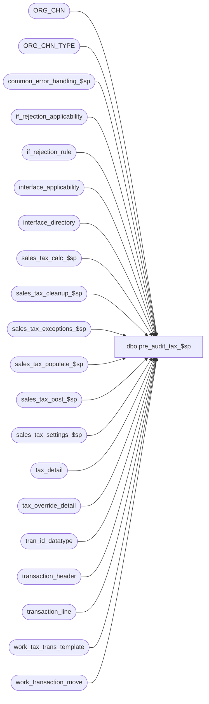

# dbo.pre_audit_tax_$sp

**Database:** auditworks  
**Server:** bedrockdb01  

## Architecture Diagram



## Table Dependencies

| Referenced Table |
|---|
| ORG_CHN |
| ORG_CHN_TYPE |
| common_error_handling_$sp |
| if_rejection_applicability |
| if_rejection_rule |
| interface_applicability |
| interface_directory |
| sales_tax_calc_$sp |
| sales_tax_cleanup_$sp |
| sales_tax_exceptions_$sp |
| sales_tax_populate_$sp |
| sales_tax_post_$sp |
| sales_tax_settings_$sp |
| tax_detail |
| tax_override_detail |
| tran_id_datatype |
| transaction_header |
| transaction_line |
| work_tax_trans_template |
| work_transaction_move |

## Stored Procedure Code

```sql
create proc dbo.pre_audit_tax_$sp 
( @process_id                    binary(16),           
  @user_id                       int,
  @source_function_no            smallint,
  @transaction_id                tran_id_datatype, -- mandatory if called from modify_interface_$sp
  @errmsg                        nvarchar(255) OUTPUT
)

AS

/*
PROC NAME: pre_audit_tax_$sp
     DESC: To verify, calculate sales taxes
           Called by move_merchandise_$sp, modify_interface_$sp

  HISTORY:
Date     Name		Def#  Desc
Mar11,11 Vicci         64852  Treat function 89 (mass correct tax) the same as function 9 (move).
Mar11,11 Vicci        125554  Return  @execret (i.e. the status returned by the call made by sales_tax_populate_$sp to verify_tax_jurisdiction_$sp) 
                              so that it can be passed back to transaction modify.  
Jul22,09 Vicci        109078  Call exception logging.
Jan22,09 Phu          104453  Port 1-3Z9SZL to SA5. To delete tax detail when trans is modified/moved from fed to non-fed the interface.
Aug15,08 Paul         104042  fix ambiguous column name error
Apr18,08 Phu           96766  Remove references to interface directory lookup table.
         Paul                 uplift 81962 to SA5.
Apr28,05 Paul        DV-1234  expand transaction_id to use tran_id_datatype
Dec20,04 David       DV-1191  Use aliases to avoid ambiguous column name error.
Sep24,04 Maryam      DV-1146  use user_id.
May19,04 David       DV-1071  Use ORG_CHN table instead of store_salesaudit
Apr28,04 Maryam      DV-1071  Changed @process_id from int to binary(16) and pass @process_id to the sub procs.
Feb04,08 Paul/Daphna   81962  add data population changes from defect 74673, added nolock hints
Sep15,03 ShuZ        1-G7A5F  Remove all references to the interface_directory '... _check' 
                              fields from stored procedures/triggers and replace with usage 
                              of if_rejection_applicability table.
Dec19,02 Phu            5327  To call sales_tax_cleanup_$sp
Dec07,02 Phu         1-GCX2X  Remove begin tran
Nov12,02 Phu         1-FOMGT  Populate tax detail when correcting SA rejects of Invalid Store/Register or adding trans
Apr25,02 Phu         1-C9P5S  Pre Audit tax

*/

DECLARE
	@applicability_method		tinyint,
	@class_exception_flag		tinyint,
	@errno				int,
	@exception_rows			int,
	@exception_jurisdiction_check	tinyint,
	@function_no 			smallint,
	@item_group_exception_flag      tinyint,
	@include_expense		tinyint,
	@include_pickup			tinyint,
	@lookup_segment_flag            tinyint,
	@log_flag			tinyint,
	@log_tax_detail                 tinyint,
	@log_tax_override		tinyint,
	@message_id			int,
	@object_name			nvarchar(255),
	@operation_name			nvarchar(100),
	@process_log_entry 		tinyint,
	@process_name			nvarchar(100),
	@process_timestamp 		float,
	@rows				int,
	@sales_date			smalldatetime,
	@sku_exception_flag		tinyint,
	@store_no			int,
	@stream_no			tinyint,
	@style_exception_flag		tinyint,
	@tax_default_check		tinyint,
	@tax_jurisdiction		nchar(5),
	@tax_rounding_method		tinyint,
	@tax_strip_flag                 tinyint,
	@trans_count 			int,
	@unapplied_discounts_exist	tinyint,
	@update_timing 			smallint,
	@validation_check		nchar(2),
	@base				numeric(2,0),
	@execret			int 


SELECT @message_id = 201068,
       @process_name = 'pre_audit_tax_$sp',
       @log_flag = 0,
       @stream_no = 1,
       @function_no = 37,
       @base = 10,
       @execret = 0 

SELECT transaction_id, store_no, transaction_date, transaction_category,
       log_tax_override, store_tax_jurisdiction,
       tod_tax_jurisdiction,
       header_override_flag,
       all_tax_override_flag
INTO #tax_transactions
FROM work_tax_trans_template

SELECT @errno = @@error
IF @errno != 0
BEGIN
  SELECT @errmsg = 'Unable to create temp table #tax_transactions.',
         @object_name = '#tax_transactions',
         @operation_name = 'CREATE'
    GOTO error
END

EXEC sales_tax_settings_$sp @process_id, @user_id, @applicability_method OUTPUT, @update_timing OUTPUT,
     @class_exception_flag OUTPUT, @sku_exception_flag OUTPUT,
     @style_exception_flag OUTPUT, @item_group_exception_flag OUTPUT,
     @lookup_segment_flag OUTPUT, @include_expense OUTPUT, @include_pickup OUTPUT, 
     @unapplied_discounts_exist OUTPUT, @tax_rounding_method OUTPUT,
     @log_tax_detail OUTPUT, @errmsg OUTPUT, @function_no

SELECT @errno = @@error
IF @errno <> 0
  BEGIN
    SELECT @errmsg = ISNULL(@errmsg, 'Unable to execute stored proc sales_tax_settings_$sp'),
           @object_name = 'sales_tax_settings_$sp',
           @operation_name = 'EXECUTE'
    GOTO error
  END

/* get list of tax transaction to be posted */

IF @source_function_no in (9, 89) -- from move_merchandise_$sp or mass_correct_tax_$sp
BEGIN
  IF @applicability_method = 0
  BEGIN
    INSERT #tax_transactions(
           transaction_id,
           store_no,
           transaction_date,
           transaction_category,
           log_tax_override,
           store_tax_jurisdiction,
           tod_tax_jurisdiction,
           header_override_flag,
           all_tax_override_flag)
    SELECT th.transaction_id,
           th.store_no,
           th.transaction_date,
           th.transaction_category,
           (ABS (SIGN (CHARINDEX (T.SYS_CODE, 'WEBCTLG')) - 1)) + 1,

           ss.TAX_JRSDCTN_CODE,
           MAX(tod.exception_tax_jurisdiction),   
           1 - SIGN(MIN(tod.line_id)),
           1 - SIGN(MIN(tod.tax_level))
     FROM work_transaction_move wt WITH (NOLOCK)
     INNER JOIN transaction_header th WITH (NOLOCK)
       ON wt.transaction_id = th.transaction_id
       AND th.transaction_void_flag IN (0,8)
       AND th.date_reject_id = 0
     INNER JOIN transaction_line tl WITH (NOLOCK)
       ON th.transaction_id = tl.transaction_id
       AND tl.line_void_flag = 0
     INNER JOIN interface_applicability ia WITH (NOLOCK)
       ON tl.line_object = ia.line_object
       AND tl.line_action = ia.line_action
       AND th.transaction_category = ia.transaction_category
       AND ia.interface_id = 12
     INNER JOIN ORG_CHN ss WITH (NOLOCK)
       ON th.store_no = ss.ORG_CHN_NUM
     INNER JOIN ORG_CHN_TYPE T
       ON ss.ORG_CHN_TYPE_CODE = T.ORG_CHN_TYPE_CODE
     LEFT OUTER JOIN  tax_override_detail tod  WITH (NOLOCK)  
       ON th.transaction_id = tod.transaction_id
       AND tod.line_id = 0   	   
    WHERE wt.process_id = @process_id
    GROUP BY th.transaction_id, th.store_no, th.transaction_date, th.transaction_category,
              (ABS (SIGN (CHARINDEX (T.SYS_CODE, 'WEBCTLG')) - 1)) + 1, ss.TAX_JRSDCTN_CODE

    SELECT @errno = @@error, @rows = @@rowcount
    IF @errno <> 0
    BEGIN
      SELECT @errmsg = 'Unable to insert when function = 9, appmeth = 0',
           @object_name = '#tax_transactions',
           @operation_name = 'INSERT'
      GOTO error
    END
  END
  ELSE   -- APP METH <> 0 
  BEGIN
    INSERT #tax_transactions(
           transaction_id,
           store_no,
           transaction_date,
           transaction_category,
           log_tax_override,
           store_tax_jurisdiction,
           tod_tax_jurisdiction,
           header_override_flag,
           all_tax_override_flag)
    SELECT th.transaction_id,
           th.store_no,
           th.transaction_date,
           th.transaction_category,
           (ABS (SIGN (CHARINDEX (T.SYS_CODE, 'WEBCTLG')) - 1)) + 1,

           ss.TAX_JRSDCTN_CODE,
           MAX(tod.exception_tax_jurisdiction),   
           1 - SIGN(MIN(tod.line_id)),   
           1 - SIGN(MIN(tod.tax_level))
    FROM work_transaction_move wt WITH (NOLOCK)
    INNER JOIN transaction_header th WITH (NOLOCK)
      ON wt.transaction_id = th.transaction_id
      AND th.transaction_void_flag IN (0,8)
      AND th.date_reject_id = 0
     INNER JOIN ORG_CHN ss WITH (NOLOCK)
       ON th.store_no = ss.ORG_CHN_NUM
     INNER JOIN ORG_CHN_TYPE T
       ON ss.ORG_CHN_TYPE_CODE = T.ORG_CHN_TYPE_CODE
    LEFT OUTER JOIN  tax_override_detail tod WITH (NOLOCK)  
      ON th.transaction_id = tod.transaction_id
      AND tod.line_id = 0   
    WHERE wt.process_id = @process_id
    GROUP BY th.transaction_id, th.store_no, th.transaction_date, th.transaction_category,
             (ABS (SIGN (CHARINDEX (T.SYS_CODE, 'WEBCTLG')) - 1)) + 1, ss.TAX_JRSDCTN_CODE

    SELECT @errno = @@error, @rows = @@rowcount
    IF @errno <> 0
    BEGIN
      SELECT @errmsg = 'Unable to insert when function = 9, appmeth <> 0',
           @object_name = '#tax_transactions',
           @operation_name = 'INSERT'
      GOTO error
    END
  END  -- APP METH <> 0

  -- Delete the tax_detail in advance in case of the transaction is not fed to the interface.
  IF @update_timing = 6
  BEGIN
    DELETE tax_detail
    FROM tax_detail td, work_transaction_move wt WITH (NOLOCK)
    WHERE wt.process_id = @process_id
    AND wt.transaction_id = td.transaction_id

    SELECT @errno = @@error
    IF @errno <> 0
    BEGIN
      SELECT @errmsg = 'Unable to delete tax_detail when function = 9',
             @object_name = 'tax_detail',
             @operation_name = 'DELETE'
      GOTO error
    END
  END
END -- FUNCTION no IN (9, 89)  
ELSE 
BEGIN
  IF @applicability_method = 0
  BEGIN
    INSERT #tax_transactions(
           transaction_id,
           store_no,
           transaction_date,
           transaction_category,
           log_tax_override,
           store_tax_jurisdiction,
           tod_tax_jurisdiction,
           header_override_flag,
           all_tax_override_flag)
    SELECT th.transaction_id,
           th.store_no,
           th.transaction_date,
           th.transaction_category,
           (ABS (SIGN (CHARINDEX (T.SYS_CODE, 'WEBCTLG')) - 1)) + 1,

           ss.TAX_JRSDCTN_CODE,
           MAX(tod.exception_tax_jurisdiction),   
           1 - SIGN(MIN(tod.line_id)),
           1 - SIGN(MIN(tod.tax_level))
     FROM transaction_header th WITH (NOLOCK)
     INNER JOIN transaction_line tl WITH (NOLOCK)
       ON th.transaction_id = tl.transaction_id
       AND tl.line_void_flag = 0
     INNER JOIN interface_applicability ia WITH (NOLOCK)
       ON tl.line_object = ia.line_object
       AND tl.line_action = ia.line_action
       AND th.transaction_category = ia.transaction_category
       AND ia.interface_id = 12
     INNER JOIN ORG_CHN ss WITH (NOLOCK)
       ON th.store_no = ss.ORG_CHN_NUM
     INNER JOIN ORG_CHN_TYPE T
       ON ss.ORG_CHN_TYPE_CODE = T.ORG_CHN_TYPE_CODE
     LEFT OUTER JOIN  tax_override_detail tod WITH (NOLOCK) 
       ON th.transaction_id = tod.transaction_id
       AND tod.line_id = 0         
     WHERE th.transaction_id = @transaction_id
     AND th.transaction_void_flag IN (0,8)
     AND th.date_reject_id = 0
     GROUP BY th.transaction_id, th.store_no, th.transaction_date, th.transaction_category,
             (ABS (SIGN (CHARINDEX (T.SYS_CODE, 'WEBCTLG')) - 1)) + 1, ss.TAX_JRSDCTN_CODE

    SELECT @errno = @@error, @rows = @@rowcount
    IF @errno <> 0
    BEGIN
      SELECT @errmsg = 'Unable to insert when function <> 9, appmeth =0',
           @object_name = '#tax_transactions',
           @operation_name = 'INSERT'
      GOTO error
    END
  END
  ELSE   -- APP METH <> 0
  BEGIN
    INSERT #tax_transactions(
           transaction_id,
           store_no,
           transaction_date,
           transaction_category,
           log_tax_override,
           store_tax_jurisdiction,
           tod_tax_jurisdiction,
           header_override_flag,
           all_tax_override_flag)
    SELECT th.transaction_id,
           th.store_no,
           th.transaction_date,
           th.transaction_category,
           (ABS (SIGN (CHARINDEX (T.SYS_CODE, 'WEBCTLG')) - 1)) + 1,
           ss.TAX_JRSDCTN_CODE, 
           MAX(tod.exception_tax_jurisdiction),   
           1 - SIGN(MIN(tod.line_id)),
           1 - SIGN(MIN(tod.tax_level))
    FROM transaction_header th WITH (NOLOCK)
     INNER JOIN ORG_CHN ss WITH (NOLOCK)
       ON th.store_no = ss.ORG_CHN_NUM
     INNER JOIN ORG_CHN_TYPE T
       ON ss.ORG_CHN_TYPE_CODE = T.ORG_CHN_TYPE_CODE
    LEFT OUTER JOIN  tax_override_detail tod WITH (NOLOCK) 
      ON th.transaction_id = tod.transaction_id
      AND tod.line_id = 0          
    WHERE th.transaction_id = @transaction_id
    AND th.transaction_void_flag IN (0,8)
    AND th.date_reject_id = 0
    GROUP BY th.transaction_id, th.store_no, th.transaction_date, th.transaction_category,
             (ABS (SIGN (CHARINDEX (T.SYS_CODE, 'WEBCTLG')) - 1)) + 1, ss.TAX_JRSDCTN_CODE
    
    SELECT @errno = @@error, @rows = @@rowcount
    IF @errno <> 0
    BEGIN
      SELECT @errmsg = 'Unable to insert when function <> 9, appmeth <> 0',
           @object_name = '#tax_transactions',
           @operation_name = 'INSERT'
      GOTO error
    END
  END --APPMETH <> 0

  -- Delete the tax_detail in advance in case of the transaction is not fed to the interface.
  IF @update_timing = 6
  BEGIN
    DELETE tax_detail
    WHERE transaction_id = @transaction_id

    SELECT @errno = @@error
    IF @errno <> 0
    BEGIN
      SELECT @errmsg = 'Unable to delete tax_detail when function <> 9',
             @object_name = 'tax_detail',
             @operation_name = 'DELETE'
      GOTO error
    END
  END
END -- ELSE of IF function_no IN (9, 89)

IF @rows = 0
BEGIN
  DROP TABLE #tax_transactions
  RETURN
END

SELECT @validation_check = REVERSE(RIGHT('00' + LTRIM(STR(SUM(POWER(@base, CONVERT(numeric(2,0), COALESCE(ir.if_rejection_reason - 6, 0)) - 1)), 2, 0)), 2))
FROM if_rejection_rule ir
WHERE ir.if_rejection_reason IN (7, 8)
AND COALESCE(ir.active_rejection_rule,1) = 1
AND EXISTS (SELECT 1 FROM if_rejection_applicability ia, interface_directory id
            WHERE ir.if_rejection_reason = ia.if_reject_reason
            AND ia.interface_id = id.interface_id
   AND id.update_timing > 0)

SELECT @errno = @@error
IF @errno <> 0
BEGIN
  SELECT @errmsg = 'Unable to retrieve from if_rejection_rule, if_rejection_applicability, interface_directory for if_rejection_reason = 7, 8',
         @object_name = 'if_rejection_rule',
         @operation_name ='SELECT'
  GOTO error
END

SELECT @exception_jurisdiction_check = CONVERT(tinyint, SUBSTRING(@validation_check, 1, 1)),
       @tax_default_check = CONVERT(tinyint, SUBSTRING(@validation_check, 2, 1))

EXEC @execret = sales_tax_populate_$sp @process_id, @user_id, @source_function_no, @applicability_method,
     @class_exception_flag, @sku_exception_flag, @style_exception_flag,
     @item_group_exception_flag, @include_expense, @include_pickup,
     @unapplied_discounts_exist, @tax_default_check, @exception_jurisdiction_check,
     @errmsg OUTPUT
SELECT @errno = @@error
IF @errno <> 0
BEGIN
  SELECT @errmsg = ISNULL(@errmsg, 'Unable to execute stored proc sales_tax_populate_$sp'),
         @object_name = 'sales_tax_populate_$sp',
         @operation_name = 'EXECUTE'
  GOTO error
END

EXEC sales_tax_calc_$sp @process_id, @user_id, @function_no, @class_exception_flag,
     @sku_exception_flag, @style_exception_flag, @item_group_exception_flag,
     @tax_rounding_method, @log_flag, 1, @errmsg OUTPUT

SELECT @errno = @@error
IF @errno <> 0
BEGIN
  SELECT @errmsg = ISNULL(@errmsg, 'Unable to execute stored proc sales_tax_calc_$sp'),
         @object_name = 'sales_tax_calc_$sp',
         @operation_name = 'EXECUTE'
  GOTO error
END

SELECT @trans_count = 0, @tax_strip_flag = 0  -- unused in this proc

EXEC sales_tax_post_$sp @process_id, @user_id, @function_no, @update_timing,
     @tax_rounding_method, @log_tax_detail, @lookup_segment_flag,
     @store_no, @sales_date, 1, @tax_strip_flag OUTPUT,
     @trans_count OUTPUT, @errmsg OUTPUT

SELECT @errno = @@error
IF @errno <> 0
BEGIN
  SELECT @errmsg = ISNULL(@errmsg, 'Unable to execute stored proc sales_tax_post_$sp'),
         @object_name = 'sales_tax_post_$sp',
         @operation_name = 'EXECUTE'
  GOTO error
END

EXEC sales_tax_exceptions_$sp @process_id, @function_no, @update_timing, @tax_rounding_method,
                              @log_tax_override, @store_no , @sales_date, @errmsg OUTPUT
SELECT @errno = @@error
IF @errno <> 0
BEGIN
  SELECT @errmsg = ISNULL(@errmsg, 'Unable to execute stored proc sales_tax_exceptions_$sp'),
         @object_name = 'sales_tax_exceptions_$sp',
         @operation_name = 'EXECUTE'
  GOTO error
END
EXEC sales_tax_cleanup_$sp @process_id, @user_id, @function_no, @tax_rounding_method,
     @stream_no, @errmsg OUTPUT

SELECT @errno = @@error
IF @errno <> 0
BEGIN
  SELECT @errmsg = ISNULL(@errmsg, 'Unable to execute stored proc sales_tax_cleanup_$sp'),
         @object_name = 'sales_tax_cleanup_$sp',
         @operation_name = 'EXECUTE'
  GOTO error
END

RETURN @execret

error:
	EXEC common_error_handling_$sp @function_no, @errno, @errmsg, 0, @message_id, 
	@process_name, @object_name, @operation_name, @log_flag, @stream_no, 0, null, 0,
	null, null, null, null, null, null, 0, @process_id, @user_id
	RETURN
```

