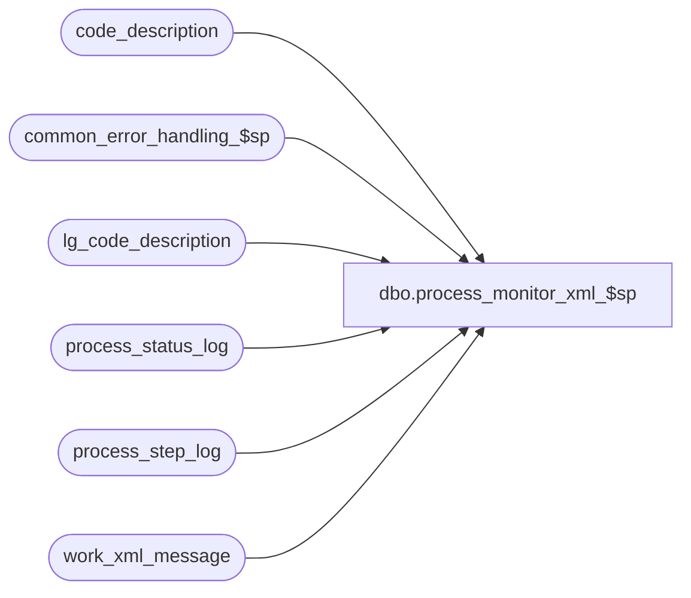

# dbo.process_monitor_xml_$sp

**Database:** auditworks  
**Server:** bedrockdb01  

## Architecture Diagram



## Table Dependencies

| Referenced Table |
|---|
| code_description |
| common_error_handling_$sp |
| lg_code_description |
| process_status_log |
| process_step_log |
| work_xml_message |

## Stored Procedure Code

```sql
create proc dbo.process_monitor_xml_$sp 

  
@process_status smallint = 3, -- 0 = in progress only, 1 = completed only, 3 = all
@process_no smallint = null,
@start_since_date_time datetime = null,
@count_only smallint = 0

AS

/*
  Proc Name: process_monitor_xml_$sp
  Desc: Build xml statements from the process_status_log and process_step_log.


HISTORY :
 Date    Name           Def  Desc
May13,11 Paul        127064  replaced double quotes with nchar(34) to avoid dependency on quoted_identifier setting
Sep01,06 Phu          76719  Want a non-null string when it's concatenated with null string.
May11,04 Maryam     DV-1071  Modified @process_id to binary(16)
Feb07,03 Winnie        6041  Correct logic to retrieve code description if language_id is not set.  
Apr12,01 Winnie     1-CBKTT  Correctly generate XML file for process_monitor.  
Nov14,01 Winnie        8932  Author

*/

DECLARE @completed_flag			smallint,
	@completed_workload		int,
	@expected_workload		int,
	@process_name			nvarchar(100),
	@object_name			nvarchar(255),
	@operation_name			nvarchar(100),
	@cursor_open			tinyint,
	@max_process_start_time		datetime,
	@message_id			int,
	@errno				int,
	@database			nvarchar(50),
	@errmsg				nvarchar(255),
	@process_id			binary(16),
	@process_no1			smallint,
	@process_start_time		datetime,
	@process_count			int,
	@process_descr			nvarchar(255)

SET CONCAT_NULL_YIELDS_NULL OFF
	
    SELECT  @process_name = 'process_monitor_xml_$sp',
            @message_id = 201068,
            @database = db_name(),
            @process_id = @@spid,
            @process_count = 0

    DELETE 
      FROM work_xml_message
     WHERE process_id = @process_id

    SELECT @errno = @@error
      IF @errno != 0
        BEGIN
          SELECT @errmsg = 'Failed to delete from work_xml_message',
                 @object_name = 'work_xml_message',
                 @operation_name = 'DELETE'
          GOTO error
        END

    INSERT INTO work_xml_message
           (process_id, process_no, process_stream, xml_message)
    SELECT @process_id,0,-1,'<?xml version=' + nchar(34) + '1.0' + nchar(34) + '?>'

    SELECT @errno = @@error
    IF @errno != 0
      BEGIN
        SELECT @errmsg = 'Failed to insert into work_xml_message for heading',
               @object_name = 'work_xml_message',
               @operation_name = 'INSERT'
        GOTO error
      END

    SELECT @process_count = COUNT(process_no)
      FROM process_status_log
     WHERE (process_no = @process_no OR @process_no IS NULL)
       AND (completed_flag = @process_status OR @process_status = 3)
       AND (process_start_time >= @start_since_date_time OR @start_since_date_time IS NULL)
     
    IF @errno != 0
      BEGIN
        SELECT @errmsg = 'Failed to select count process_no',
               @object_name = 'process_status_log',
               @operation_name = 'SELECT'
        GOTO error
      END

    INSERT INTO work_xml_message
           (process_id, process_no, process_stream, xml_message)
    SELECT @process_id,0,0,'<processlist db=' + nchar(34) + @database + nchar(34) + ' count=' + nchar(34)
      + CONVERT(nvarchar, @process_count) + nchar(34) + '>'

    SELECT @errno = @@error
    IF @errno != 0
      BEGIN
        SELECT @errmsg = 'Failed to insert into work_xml_message for processlist',
               @object_name = 'work_xml_message',
               @operation_name = 'INSERT'
        GOTO error
      END

    IF @process_count > 0 AND @count_only = 0 
    BEGIN

      DECLARE process_monitor_crsr CURSOR
      FOR
      SELECT process_no, process_start_time, completed_flag, completed_workload, expected_workload
        FROM process_status_log
       WHERE (process_no = @process_no OR @process_no IS NULL)
         AND (completed_flag = @process_status OR @process_status = 3)
         AND (process_start_time >= @start_since_date_time OR @start_since_date_time IS NULL)
  
   ORDER BY process_no
      FOR READ ONLY  

      OPEN process_monitor_crsr
 
      SELECT @errno = @@error
      IF @errno != 0
        BEGIN
 SELECT @errmsg = 'Failed to open cursor process_monitor_crsr',
                 @object_name = 'process_monitor_crsr',
         @operation_name = 'OPEN'
          GOTO error
        END

      SELECT @cursor_open = 1

      WHILE 1=1
        BEGIN

          FETCH process_monitor_crsr INTO
                @process_no1, @process_start_time, @completed_flag, @completed_workload, @expected_workload
           IF @@fetch_status <> 0
           BREAK

           SELECT @max_process_start_time = ISNULL(MAX(process_step_start_time), @process_start_time)
             FROM process_step_log
            WHERE process_no = @process_no1

           SELECT @errno = @@error
           IF @errno != 0
             BEGIN
               SELECT @errmsg = 'Failed to select from process_step_log',
                      @object_name = 'process_step_log',
                      @operation_name = 'SELECT'
               GOTO error
             END

           SELECT @process_descr = NULL --

           SELECT @process_descr = ISNULL(code_display_descr, CONVERT(nvarchar,@process_no1))
             FROM lg_code_description
            WHERE code_type = 31
              AND code = @process_no1

           SELECT @errno = @@error
           IF @errno != 0
             BEGIN
               SELECT @errmsg = 'Failed to select code_display_descr from lg_code_description',
                      @object_name = 'lg_code_description',
                      @operation_name = 'SELECT'
               GOTO error
             END
         
           IF @process_descr IS NULL /* if user's language_id is not set nothing will be retrieve above */
           BEGIN
             SELECT @process_descr = ISNULL(code_display_descr, CONVERT(nvarchar,@process_no1))
               FROM code_description
              WHERE code_type = 31
                AND code = @process_no1

             SELECT @errno = @@error
             IF @errno != 0
               BEGIN
                 SELECT @errmsg = 'Failed to select code_display_descr from code_description',
                        @object_name = 'code_description',
                        @operation_name = 'SELECT'
                 GOTO error
               END
           END        

           INSERT work_xml_message
                (process_id, process_no, process_stream, xml_message)  
           SELECT @process_id, @process_no1, 0,
           	'<process  id=' + nchar(34) + ISNULL(@process_descr,CONVERT(nvarchar,@process_no1)) + nchar(34) + ' start=' + nchar(34)
                + CONVERT(nvarchar,@process_start_time) + nchar(34)
                + ' last-activity-start=' + nchar(34) + CONVERT(nvarchar,@max_process_start_time) + nchar(34) + ' completed=' + nchar(34)
                + CONVERT(nvarchar,@completed_flag) + nchar(34) + ' percent=' + nchar(34)
                + CONVERT(nvarchar, (CONVERT(NUMERIC(6,0),ROUND((CONVERT(FLOAT,@completed_workload) / @expected_workload * 100),0))))
                + nchar(34) + '>'
           SELECT @errno = @@error
           IF @errno != 0
             BEGIN
               SELECT @errmsg = 'Failed to insert into work_xml_message (1)',
                      @object_name = 'work_xml_message',
                      @operation_name = 'INSERT'
               GOTO error
             END

           INSERT work_xml_message
                  (process_id, process_no, process_stream, xml_message)  
           SELECT @process_id, @process_no1, stream_no,
           	'<step stream=' + nchar(34) + CONVERT(nvarchar,stream_no) + nchar(34) + ' step-name=' + nchar(34)
           	+ ISNULL(code_display_descr, CONVERT(nvarchar,process_step_no)) + nchar(34)
           	+ ' step-start=' + nchar(34) + CONVERT(nvarchar,process_step_start_time) + nchar(34) + ' step-percent=' + nchar(34)
                  + CONVERT(nvarchar,(CONVERT(NUMERIC(6,0),ROUND((CONVERT(FLOAT,completed_workload) / expected_workload * 100),0))))
                  + nchar(34) + '></step>'
             FROM process_step_log p, lg_code_description c
            WHERE process_no = @process_no1
              AND process_step_no = code
              AND 216 = code_type 

           SELECT @errno = @@error
           IF @errno != 0
             BEGIN
               SELECT @errmsg = 'Failed to insert into work_xml_message (2)',
                      @object_name = 'work_xml_message',
                      @operation_name = 'INSERT'
               GOTO error
             END

           INSERT work_xml_message
                  (process_id, process_no, process_stream, xml_message)  
           VALUES (@process_id, @process_no1,9999,'</process>')
  
           SELECT @errno = @@error
           IF @errno != 0
             BEGIN
               SELECT @errmsg = 'Failed to insert into work_xml_message (3)',
                      @object_name = 'work_xml_message',
                      @operation_name = 'INSERT'
               GOTO error
             END

        END -- While 1 = 1

      CLOSE process_monitor_crsr
      DEALLOCATE process_monitor_crsr
      SELECT @cursor_open = 0

    END -- IF @process_count > 0 AND @count_only = 0 

INSERT INTO work_xml_message
           (process_id, process_no, process_stream, xml_message)   
    VALUES (@process_id,9999, 9999,'</processlist>')

    SELECT @errno = @@error
      IF @errno != 0
        BEGIN
          SELECT @errmsg = 'Failed to insert into work_xml_message for processlist end',
                 @object_name = 'work_xml_message',
                 @operation_name = 'INSERT'
          GOTO error
        END

    SET nocount ON
    SELECT xml_message
      FROM work_xml_message
     WHERE process_id = @process_id
    ORDER BY process_no, process_stream

    SELECT @errno = @@error
      IF @errno != 0
        BEGIN
          SELECT @errmsg = 'Failed to select from work_xml_message',
                 @object_name = 'work_xml_message',
                 @operation_name = 'SELECT'
          GOTO error
        END
    SET nocount OFF

    DELETE 
      FROM work_xml_message
     WHERE process_id = @process_id

    SELECT @errno = @@error
      IF @errno != 0
        BEGIN
          SELECT @errmsg = 'Failed to delete from work_xml_message',
                 @object_name = 'work_xml_message',
                 @operation_name = 'DELETE'
          GOTO error
        END

    RETURN

error:
	IF @cursor_open = 1
	  BEGIN
	  CLOSE process_monitor_crsr
	  DEALLOCATE process_monitor_crsr
	  END

	EXEC common_error_handling_$sp 0, @errno, @errmsg, 0, @message_id, 
	@process_name, @object_name, @operation_name, 0

	RETURN
```

