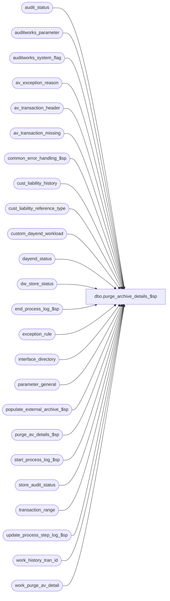

# dbo.purge_archive_details_$sp

**Database:** auditworks  
**Server:** bedrockdb01  

## Architecture Diagram



## Table Dependencies

| Referenced Table |
|---|
| audit_status |
| auditworks_parameter |
| auditworks_system_flag |
| av_exception_reason |
| av_transaction_header |
| av_transaction_missing |
| common_error_handling_$sp |
| cust_liability_history |
| cust_liability_reference_type |
| custom_dayend_workload |
| dayend_status |
| dw_store_status |
| end_process_log_$sp |
| exception_rule |
| interface_directory |
| parameter_general |
| populate_external_archive_$sp |
| purge_av_details_$sp |
| start_process_log_$sp |
| store_audit_status |
| transaction_range |
| update_process_step_log_$sp |
| work_history_tran_id |
| work_purge_av_detail |

## Stored Procedure Code

```sql
create proc dbo.purge_archive_details_$sp AS

/*
PROC NAME: purge_archive_details_$sp
     DESC: Deletes details in archive prior to oldest date
            (current date minus @extend_archive_days_retained) to be retained.
           Deletes transaction details and store_audit_status.
           Called by day_end_housekeeping_$sp.

   *** Script with ansi_nulls and ansi_warnings on to support scaleout ***

  HISTORY:
Date     Name        Def# Desc
Sep15,15 Vicci TFS-127977 Purge transaction_range table too.
Apr16,15 Phu     115270 Avoid duplicate key insert error in work_history_tran_id if previous run encounters error in populate_external_archive_$sp.

Jan28,15 Paul       94760 use @ext_archive_days_retained from auditworks_parameter for retention period of external archive,
                          use try catch, use top command for compatability with SQL 2014, pass dates to populate_external_archive_$sp.
Nov06,14 Paul       63833 corrected external archive change to also inlude 1-49QN29 and 134811
Jul03,14 Ian K      63833 If external archive is in use then copy transactions to remote database before purging
Nov08,12 Vicci   1-49QN29 Have each peripheral clean up its own stores from dw_store_status, because a given store date
                        may be marked with a store_status of 2 or 3 in dw_store_status but still have entries in
                        store_audit_status under a date_reject_id > 0 with a status of edited that require dw_store_status
                        to be retained to support the UI, but consolidated does not know what store_audit_status
                        entries exist on the peripherals.
Oct31,12 Vicci   139398 Refix 134811. 
                        Audit status days should be limited to being no older than the older of archive days or 61 days before last date closed, so that extended arch days can be 7 years without audit status being 7 years!
May14,12 Vicci   134811 Audit status days should be limited to being no older than 61 days before last date closed, so that extended arch days can be 7 years without audit status being 7 years!
Dec01,11 Vicci   131496 Keep transactions supporting Loss Prevention cases and other such exceptions with user-defined retention periods on file;  
                        don't keep C/L transactions for extended archive days just because they were not cleaned up when their date was
                        first examined as a cleanup candidate (remove use of @last_date_purged, i.e. dayend_status.sales_date);  ensure that employee
                        purchase transactions are not kept for a longer period than the summary they support;  ensure that tax overrides are not kept 
                        for a longer period than the summary they support;  since missing transactions only support audit status, use the audit status
                        retention period for their history cleanup.  Clean up Custom DayEnd Workload based on the history days for the user-defined interface 
                        in question (should not have had anything to do with extended archive days).
                        Add check for whether partitionning in use or not to match oracle.
Aug06,10 Vicci   119571 Support new C/L cleanup option allowing transactions to be cleaned up even if the 
                        reference# to which they are associated still has an outstanding balance (house-account
                        tracking support)
Dec09,09 Paul    114682 purge archive only when running on consolidated or when non-scaleout,
                        expanded process_key in temp table to support scaleout.
Jul04,05 Paul   DV-1239 Handle scaleout_flag = 2 as archive db
Apr15,05 Sab    DV-1218 Scaleout, delete rows from dw_store_status
Dec13,04 David  DV-1191 Improve performance by adding hints.
Feb18,02 David C   8415 R3 customer liability
Nov30,01 Phu       8931 Error handling
Sep14,01 Shapoor   8290 Use table work_purge_av_detail instead of work_purge_detail and use
                        the 'transactions_per_batch' parameter to determine the batch size.     
Mar09,01 David M   7559 Added dayend_process_id column to dayend_status table so that the
      			recovery is correctly done in a multi-stream environment.   
Nov08,00 Paul	   6938 Retain audit_status for dates > last_period_closed
May25,00 Paul	   6169 Improve performance of select on av_transaction_header (avoid scan)
Mar14,00 Paul/Sab  6078 Add separate delete of audit_status, change batch to 2000 trans.
Aug13,99 Daphna F  5043 Added error trapping on truncate work_purge_detail	 	
Aug11,99 Paul	   4522 Avoid = null
Jul29,99 Daphna F  5026 Add call to purge_av_details_$sp instead of deleting all av details 
                        using delete trigger on av_transaction_header
Nov12,98 Paul S	   ??   last modified
Jun30,97 Phu		Author
*/

DECLARE
	@archive_days_retained		int,
	@dayend_process_id		smallint,
	@extend_archive_days_retained	int,
	@errmsg				nvarchar(2000),
	@errmsg2                            nvarchar(2000),
	@errline                            int,
	@errno				int,
	@ext_archive_days_retained		smallint,
	@external_archive_flag		int,
	@external_archive_in_use		numeric,
	@gl_ascii_export_type		tinyint,
	@instance_id			int,
	@last_date_closed			smalldatetime,
	@last_date_purged			smalldatetime,
	@min_open_expired_date		smalldatetime,
	@min_transaction_date		smalldatetime,
         @max_transaction_date		smalldatetime,
	@oldest_date			smalldatetime,
	@oldest_date_audit_status	smalldatetime,
	@oldest_date_extended		smalldatetime,
	@partitioning_in_use		tinyint,
	@phase_counter			tinyint,
	@process_log_entry		tinyint,
	@process_no 			smallint,
	@process_start_time		datetime,
	@process_timestamp 		float,
	@rows				int,
	@transactions_to_be_deleted	int,
	@sales_date			smalldatetime,
	@scaleout_flag			int,
	@status				smallint,
	@transactions_deleted		numeric(12,0),
        @transactions_per_batch		int, --defect 8290
	@message_id			int,
	@object_name			nvarchar(255),
	@operation_name			nvarchar(100),
	@process_name			nvarchar(100),
	@empl_purch_days_retained		smallint,
	@tax_days_retained		smallint,
	@oldest_date_empl_purch		smalldatetime,
	@oldest_date_tax		smalldatetime;

SELECT 	@errmsg = NULL,
        @errno = 0,
        @external_archive_flag = NULL,
	@process_log_entry = 0,
	@process_no = 29,
	@process_timestamp = 0,
	@transactions_deleted = 0,
	@process_start_time = getdate(),
	@gl_ascii_export_type = 0,
	@dayend_process_id = 1, -- cleanup done by stream 1
	@transactions_to_be_deleted =0,
	@message_id = 201068,
	@process_name = 'purge_archive_details_$sp';

BEGIN TRY

  SELECT @errmsg = 'Failed to execute stored proc update_process_step_log_$sp for step 62',
	 @object_name = 'update_process_step_log_$sp',
	 @operation_name = 'EXECUTE';
EXEC update_process_step_log_$sp 18, 1, 62, 1, 0, @process_start_time;

  SELECT @errmsg = 'Unable to select from parameter_general',
	 @object_name = 'parameter_general',
	 @operation_name = 'SELECT';
SELECT @archive_days_retained = archive_days_retained,
       @extend_archive_days_retained = extended_archive_days_retained,  --This allows the user to shorten the period for which supporting transactions are retained to be less than the summary period available, but watch out:  it also controls audit_status at present.
       @last_date_closed = last_date_closed,
       @empl_purch_days_retained = employee_purchase_days,
       @tax_days_retained = tax_days
  FROM parameter_general;

  SELECT @errmsg = 'Unable to select from auditworks_system_flag',
	 @object_name = 'auditworks_system_flag',
	 @operation_name = 'SELECT';
SELECT @partitioning_in_use = flag_numeric_value
  FROM auditworks_system_flag
 WHERE flag_name = 'partitioning_in_use';

IF @partitioning_in_use IS NULL
  SELECT @partitioning_in_use = 0;

/* Check to see if external database is in use */
  SELECT @errmsg = 'Unable to select external_archive_in_use';
SELECT @external_archive_in_use = flag_numeric_value
  FROM auditworks_system_flag
 WHERE flag_name = 'external_archive_in_use';

IF @external_archive_in_use IS NULL
  SELECT @external_archive_in_use = 0;

  SELECT @errmsg = 'Unable to select external_archive_flag';
SELECT @external_archive_flag = flag_numeric_value
  FROM auditworks_system_flag
 WHERE flag_name = 'external_archive_flag';
 
IF @external_archive_flag IS NULL
  SELECT @external_archive_flag = 0;

  SELECT @errmsg = 'Failed to select scaleout_flag from auditworks_system_flag';
SELECT @scaleout_flag = CONVERT(int,flag_numeric_value)
  FROM auditworks_system_flag
 WHERE flag_name = 'scaleout_flag';

SELECT @rows = @@rowcount;
IF @rows = 0
  GOTO business_error;

  SELECT @errmsg = 'Failed to select instance_id from auditworks_system_flag';
SELECT @instance_id = CONVERT(int,flag_numeric_value)
  FROM auditworks_system_flag
 WHERE flag_name = 'instance_id';

SELECT @rows = @@rowcount;
IF @rows = 0
BEGIN
  SELECT @errmsg = 'Invalid setup. Missing instance_id.';
  GOTO business_error;
END;

  SELECT @errmsg = 'Unable to select ext_archive_days_retained',
	 @object_name = 'auditworks_parameter',
	 @operation_name = 'SELECT';
SELECT @ext_archive_days_retained = CONVERT(smallint,par_value)
  FROM auditworks_parameter
  WHERE par_name = 'ext_archive_days_retained';

IF @ext_archive_days_retained IS NULL
  SELECT @ext_archive_days_retained = @archive_days_retained;

IF @extend_archive_days_retained < @archive_days_retained
  SELECT @extend_archive_days_retained = @archive_days_retained;

IF @tax_days_retained > @extend_archive_days_retained
  SELECT @tax_days_retained = @extend_archive_days_retained;  --This allows the user to shorten the period for which supporting transactions are retained to be less than the summary period available.
ELSE
BEGIN
  IF @tax_days_retained < @archive_days_retained
    SELECT @tax_days_retained = @archive_days_retained;  
END;

IF @empl_purch_days_retained > @extend_archive_days_retained
  SELECT @empl_purch_days_retained = @extend_archive_days_retained;  --This allows the user to shorten the period for which supporting transactions are retained to be less than the summary period available.
ELSE
BEGIN
  IF @empl_purch_days_retained < @archive_days_retained
    SELECT @empl_purch_days_retained = @archive_days_retained;
END;

/* If running in external archive db, then use @ext_archive_days_retained for all retention conditions */
IF @external_archive_flag = 1
  SELECT @archive_days_retained = @ext_archive_days_retained,
	@extend_archive_days_retained = @ext_archive_days_retained,
	@tax_days_retained = @ext_archive_days_retained,
	@empl_purch_days_retained = @ext_archive_days_retained;

SELECT 	@archive_days_retained = @archive_days_retained * -1,
	@extend_archive_days_retained = @extend_archive_days_retained * -1,
	@tax_days_retained = @tax_days_retained * -1,
	@empl_purch_days_retained = @empl_purch_days_retained * -1;

SELECT @oldest_date = DATEADD (dd, @archive_days_retained, getdate()),
       @oldest_date_extended = DATEADD (dd, @extend_archive_days_retained, getdate()),
       @oldest_date_tax = DATEADD (dd, @tax_days_retained, getdate()),
       @oldest_date_empl_purch = DATEADD (dd, @empl_purch_days_retained, getdate());

SELECT @oldest_date_audit_status = @oldest_date_extended;
IF @oldest_date_audit_status > @last_date_closed	-- Do not delete any dates in audit_status which are not in closed periods
  SELECT @oldest_date_audit_status = @last_date_closed;
ELSE
BEGIN
  --134811 Audit status days should instead be arbitrarily set to 61 days before last date closed if this would be more recent, so that extended arch days can be 7 years without audit status being 7 years!
  IF DATEADD(dd, -61, @last_date_closed) > @oldest_date_audit_status
    SELECT @oldest_date_audit_status = DATEADD(dd, -61, @last_date_closed);
END;

IF @oldest_date_audit_status > @oldest_date
  SELECT @oldest_date_audit_status = @oldest_date;

 SELECT @errmsg = 'Unable to determine if subledger export to G/L is active.',
	 @object_name = 'interface_directory',
	 @operation_name = 'SELECT';
SELECT @gl_ascii_export_type = ascii_export
  FROM interface_directory
 WHERE interface_id = 19;

  SELECT @errmsg = 'Unable to determine last extended archive date system evaluated for cleanup',
	 @object_name = 'dayend_status',
	 @operation_name = 'SELECT';
SELECT @last_date_purged = sales_date
  FROM dayend_status
 WHERE process_no = @process_no;

IF @last_date_purged IS NULL 
BEGIN -- first time only, insert row when not already there
  SELECT @last_date_purged = DATEADD(yy,-10,getdate()), -- start search at oldest date in archive
          @errmsg = 'Unable to insert dayend_status',
          @object_name = 'dayend_status',
          @operation_name = 'INSERT';
  INSERT dayend_status (
   	dayend_process_id,
	process_no,
	store_no,
	sales_date,
	date_reject_id,
	dayend_status )
  VALUES (
   	@dayend_process_id,
	@process_no,
	0,
	@last_date_purged,
	0,
	0 );

END; -- if @last_date_purged IS NULL
ELSE
  IF @last_date_purged > getdate() -- recover from bad system date scenario
    SELECT @last_date_purged = DATEADD(yy,-10,getdate());

  SELECT @errmsg = 'Unable to select from auditworks_parameter (transactions_per_batch)',
	 @object_name = 'auditworks_parameter',
	 @operation_name = 'SELECT';
SELECT @transactions_per_batch = CONVERT(integer,ISNULL(par_value,'2000'))
  FROM auditworks_parameter
 WHERE par_name = 'transactions_per_batch';


IF @scaleout_flag IN (0,2) AND @partitioning_in_use = 0 
BEGIN
  /***** PURGE ARCHIVE DETAILS *****/
  --NOTE:  copy of this code also exists in partition_purge_archive_$sp (used for cleaning extended archive partitions).
  --TRUNCATE TABLE work_history_tran_id moved to after details are purged since in partition_purge_archive_$sp, the av_transaction_header is
  --deleted first and therefore we cannot remove entries from work_history_tran_id unless after all line/attachment tables are done.

    SELECT @errmsg = 'Unable to build list of transactions older than the extended archive retention period or older than the archive retention period and not an extended archive candidate.',
           @object_name = 'work_history_tran_id',
           @operation_name = 'INSERT';
  BEGIN TRY
    INSERT INTO work_history_tran_id(transaction_id, transaction_date)  --list of transactions to be deleted
    SELECT av_transaction_id, transaction_date 
      FROM av_transaction_header WITH (NOLOCK)
     WHERE transaction_date <= @oldest_date
           AND ((tax_override_flag = 0) OR transaction_date <= @oldest_date_tax)
           AND ((employee_no IS NULL) OR transaction_date <= @oldest_date_empl_purch);
    SELECT @transactions_to_be_deleted = @@rowcount;
  END TRY
  BEGIN CATCH
    SELECT @errno = ERROR_NUMBER();
    IF @errno = 2601
    BEGIN
      INSERT INTO work_history_tran_id(transaction_id, transaction_date)  --list of transactions to be deleted
      SELECT h.av_transaction_id, h.transaction_date 
        FROM av_transaction_header h WITH (NOLOCK)
       WHERE h.transaction_date <= @oldest_date
             AND ((h.tax_override_flag = 0) OR h.transaction_date <= @oldest_date_tax)
             AND ((h.employee_no IS NULL) OR h.transaction_date <= @oldest_date_empl_purch)
         AND NOT EXISTS (SELECT 1 FROM work_history_tran_id w
                          WHERE h.av_transaction_id = w.transaction_id);
      SELECT @transactions_to_be_deleted = count(1)
        FROM work_history_tran_id;
    END;
    ELSE
    BEGIN
      SELECT @errline = ERROR_LINE();
      SELECT @errmsg = CONVERT(nvarchar, @errno) + ':' + @process_name + ':' + CONVERT(nvarchar, @errline) + ':'
               + COALESCE(@errmsg, ' ') + ':' + ERROR_MESSAGE();
      GOTO business_error;
    END;
  END CATCH;
  

  IF @transactions_to_be_deleted > 0 AND @external_archive_flag = 0
  BEGIN --Retain transactions referenced by C/L
      SELECT @errmsg = 'Unable to remove transactions still referenced by C/L from list of those to be deleted',
             @object_name = 'work_history_tran_id',
             @operation_name = 'DELETE';
    DELETE work_history_tran_id
      FROM cust_liability_history h WITH (NOLOCK)
           LEFT OUTER JOIN cust_liability_reference_type r
             ON h.reference_type = r.reference_type
     WHERE work_history_tran_id.transaction_id = h.process_key
       AND (COALESCE(r.history_cleanup_criteria, 1) <> 5  --5: do not retain transactions beyond history days even if still referenced by C/L
            OR h.transaction_date > dateadd(dd, -1 * r.history_days, getdate()) );  --always keep those within C/L history days 

    SELECT @transactions_to_be_deleted = @transactions_to_be_deleted - @@rowcount;
  END;  --IF @transactions_to_be_deleted > 0
  
  IF @transactions_to_be_deleted > 0 AND @external_archive_flag = 0
  BEGIN
    SELECT @oldest_date_extended = NULL,
             @errmsg = 'Unable to determine if any exception rules are configured to be retained in the extended archive',
             @object_name = 'exception_rule',
   @operation_name = 'SELECT';
  
    SELECT @oldest_date_extended = dateadd(dd, -1 * MAX(extended_archive_days), getdate())
   FROM exception_rule
     WHERE extended_archive_days <> 0
       AND (exception_rule <> -1 OR ACTV = 1);  --Loss Prevention will force the ACTV flag to 1 if it wants any CASE supporting transactions to be kept;  User does not have access to rules < 1
  
    IF @oldest_date_extended IS NOT NULL
    BEGIN 
        SELECT @errmsg = 'Unable to remove exception transactions configured to be retained in the extended archive such as LP (rule -1) from the list of those to be deleted',
               @object_name = 'work_history_tran_id',
               @operation_name = 'DELETE';
      DELETE work_history_tran_id
        FROM av_exception_reason x WITH (NOLOCK)
          INNER JOIN exception_rule r WITH (NOLOCK)
                ON x.violated_exception_rule = r.exception_rule
               AND r.extended_archive_days <> 0 --do not look at active flag, if the exception exists in the archive then it is active for the purpose of purging           
       WHERE work_history_tran_id.transaction_date > @oldest_date_extended
         AND work_history_tran_id.transaction_id = x.av_transaction_id
         AND work_history_tran_id.transaction_date > dateadd(dd, -1 * r.extended_archive_days, getdate());

      SELECT @transactions_to_be_deleted = @transactions_to_be_deleted - @@rowcount;
    END;
  END; --IF @transactions_to_be_deleted > 0
  
  SELECT @rows = @transactions_per_batch;

  IF @transactions_to_be_deleted > 0
  BEGIN
    WHILE @rows = @transactions_per_batch 
    BEGIN
        SELECT @errmsg = 'Unable to truncate table work_purge_av_detail',
   	       @object_name = 'work_purge_av_detail',
	       @operation_name = 'TRUNCATE';      
      TRUNCATE TABLE work_purge_av_detail;

        SELECT @errmsg = 'Failed to insert batch into work_purge_av_detail',
	       @object_name = 'work_purge_av_detail',
	       @operation_name = 'INSERT'; 
       /* Insert a batch of transactions */
      INSERT work_purge_av_detail (av_transaction_id)
      SELECT TOP (@transactions_per_batch) transaction_id
        FROM work_history_tran_id WITH (NOLOCK);

      SELECT @rows = @@rowcount;
        
      IF @process_log_entry = 0 -- first loop
      BEGIN
	 SELECT @object_name = 'start_process_log_$sp',
	        @operation_name = 'EXECUTE',
	        @errmsg = 'Unable to execute start_process_log_$sp';
        EXEC start_process_log_$sp @process_no, @process_timestamp OUTPUT, @errmsg OUTPUT, 1, @process_start_time;

        SELECT @process_log_entry = 1;
      END; --IF @process_log_entry = 0

      /* If external archive in use then copy transactions to remote db before purging */
      IF @external_archive_in_use = 1 AND @external_archive_flag = 0
        BEGIN
          SELECT @errmsg = 'Unable to execute populate_external_archive_$sp',
	         @object_name = 'populate_external_archive_$sp',
	         @operation_name = 'SELECT'; 
         SELECT @min_transaction_date = MIN(transaction_date),
                @max_transaction_date = MAX(transaction_date)
           FROM work_history_tran_id;

          SELECT @errmsg = 'Unable to execute populate_external_archive_$sp',
	         @object_name = 'populate_external_archive_$sp',
	         @operation_name = 'EXECUTE'; 
          EXEC populate_external_archive_$sp @min_transaction_date, @max_transaction_date;
        END;

        SELECT @errmsg = 'Unable to execute purge_av_details_$sp',
	      @object_name = 'purge_av_details_$sp',
	      @operation_name = 'EXECUTE';
      EXEC purge_av_details_$sp;  

        SELECT @errmsg = 'Failed to remove batch of transaction which have been deleted from list of those outstanding',
	       @object_name = 'work_history_tran_id',
	       @operation_name = 'DELETE';
      DELETE work_history_tran_id
        FROM work_purge_av_detail b
       WHERE work_history_tran_id.transaction_id = b.av_transaction_id;

    END; --WHILE @rows = @transactions_per_batch
  END; --IF @transactions_to_be_deleted > 0

    SELECT @errmsg = 'Unable to truncate table work_history_tran_id',
	   @object_name = 'work_history_tran_id',
	   @operation_name = 'TRUNCATE';
  TRUNCATE TABLE work_history_tran_id;

    SELECT @errmsg = 'Failed to update dayend_status to indicate the oldest date in the full archive',
  	   @object_name = 'dayend_status',
	   @operation_name = 'UPDATE';
  UPDATE dayend_status
     SET sales_date = @oldest_date
   WHERE process_no = @process_no;

    SELECT @errmsg = 'Failed to delete av_transaction_missing',
  	   @object_name = 'av_transaction_missing',
	   @operation_name = 'DELETE';
  DELETE av_transaction_missing
   WHERE sales_date <= @oldest_date_audit_status;

END; -- If @scaleout_flag IN (0,2) AND @partitioning_in_use = 0  purge archive details


IF @external_archive_flag = 1 -- running in external archive db
  BEGIN
    IF @process_log_entry = 1
      EXEC end_process_log_$sp @process_no, @process_timestamp, @transactions_deleted;
    RETURN;
  END;

IF @gl_ascii_export_type = 0
  SELECT @status = 400;
ELSE
  SELECT @status = 500;

  SELECT @errmsg = 'Unable to delete custom_dayend_workload',
	 @object_name = 'custom_dayend_workload',
	 @operation_name = 'DELETE';
DELETE custom_dayend_workload
  FROM custom_dayend_workload w
       LEFT OUTER JOIN interface_directory i
         ON w.interface_id = i.interface_id
 WHERE w.dayend_date <= dateadd(dd, history_days * -1, getdate())  --i.e. posted more that X days ago
    OR i.interface_id IS NULL;  --i.e. interface has since been deleted and is now obsolete.

  SELECT @errmsg = 'Unable to delete audit_status',
         @object_name = 'audit_status';
DELETE audit_status
 WHERE sales_date <= @oldest_date_audit_status
   AND audit_status >= @status;

  SELECT @errmsg = 'Unable to delete store_audit_status',
         @object_name = 'store_audit_status';
DELETE store_audit_status
 WHERE sales_date <= @oldest_date_audit_status
   AND store_audit_status >= @status;

  SELECT @errmsg = 'Unable to determine earliest expired store_audit_status left behind because its audit is not yet complete',
         @object_name = 'store_audit_status',
         @operation_name = 'SELECT';
SELECT @min_open_expired_date = MIN(sales_date)
  FROM store_audit_status
 WHERE sales_date <= @oldest_date_audit_status;
 
IF @min_open_expired_date IS NULL
BEGIN
  SELECT @min_open_expired_date = dateadd(dd, 1, @oldest_date_audit_status);

  SELECT @errmsg = 'Unable to delete transaction_range',
         @object_name = 'transaction_range';
  DELETE transaction_range
   WHERE transaction_date <= @oldest_date_audit_status;
END;
ELSE
BEGIN
  SELECT @errmsg = 'Unable to delete transaction_range',
         @object_name = 'transaction_range';
  DELETE transaction_range
   WHERE transaction_date < @min_open_expired_date;
  DELETE transaction_range
   WHERE transaction_date <= @oldest_date_audit_status
     AND NOT EXISTS (SELECT 1 FROM store_audit_status s 
                      WHERE s.sales_date <= @oldest_date_audit_status 
                        AND s.store_no = transaction_range.store_no
                        AND s.sales_date <= transaction_range.transaction_date);
END;


  --Note:  although scaleout_populate_dw_tb_$sp assumes a date is either in dw_store_status or not (it does 
  --       not handle some stores being there and others not, but only populates with all valid stores if date
  --       is missing altogether), edit_header_$sp populates straggler rows (new stores, invalid stores, 
  --       new date-rejects for old partially cleaned up dates, etc).
  --Note:  There can be dayended entries in store_audit_status for a given store/date and date-rejected entries 
  --       for the same store/date with a status of edited.  Since consolidated-dw cannot see store_audit_status
  --       it does not know if the date must be retained in dw_store_status.  Therefore, each peripheral must
  --       clean up its own stores.
  SELECT @errmsg = 'Unable to delete dw_store_status',
	 @object_name = 'dw_store_status',
	 @operation_name = 'DELETE';
DELETE dw_store_status
 WHERE sales_date < @min_open_expired_date
   AND instance_id = @instance_id 
   AND store_status <> 1 ;

  SELECT @errmsg = 'Unable to set update store_audit_status',
         @object_name = 'store_audit_status',
         @operation_name = 'UPDATE';
UPDATE store_audit_status
  SET archived_flag = 0
 WHERE archived_flag = 1
   AND @sales_date <= @oldest_date;

  SELECT @errmsg = 'Unable to update audit_status',
         @object_name = 'audit_status';
UPDATE audit_status
  SET archived_flag = 0
 WHERE archived_flag = 1
   AND @sales_date <= @oldest_date;

IF @process_log_entry = 1
  EXEC end_process_log_$sp @process_no, @process_timestamp, @transactions_deleted;

RETURN;


business_error:   /* Business Rule handler. */

	SELECT @errmsg2 = @errmsg;

	/* Could include similar cleanup code to system error trap when needed (example is from move_store_$sp).
	   However, could also exclude the cleanup code here since the outer system error catch should fire again after the exec below. */

	EXEC common_error_handling_$sp @process_no, @errno, @errmsg, 0, @message_id, 
	   @process_name, @object_name, @operation_name, 1;
	  /* Note: when the exec above raises an error, that action also fires the system error trap (below) */
	RETURN;
END TRY

BEGIN CATCH; -- trap system errors
    /* common error handling. Appending proc name here because a rollback could occur if called within a transaction. */

        SELECT @errno = ERROR_NUMBER(),
		@errline = ERROR_LINE();

        SELECT @errmsg = CONVERT(nvarchar, @errno) + ':' + @process_name + ':' + CONVERT(nvarchar, @errline) + ':'
               + COALESCE(@errmsg, ' ') + ':' + ERROR_MESSAGE();

	 /* this condition will only be true when raise error in traps above fire this general catch */
	IF @errmsg2 IS NOT NULL
	  SELECT @errmsg = @errmsg2;

	EXEC common_error_handling_$sp @process_no, @errno, @errmsg, 0, @message_id, 
	   @process_name, @object_name, @operation_name, 1;

	RETURN;
END CATCH;
```

