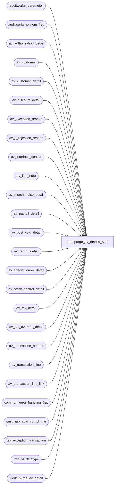

# dbo.purge_av_details_$sp

**Database:** auditworks  
**Server:** bedrockdb01  

## Architecture Diagram



## Table Dependencies

| Referenced Table |
|---|
| auditworks_parameter |
| auditworks_system_flag |
| av_authorization_detail |
| av_customer |
| av_customer_detail |
| av_discount_detail |
| av_exception_reason |
| av_if_rejection_reason |
| av_interface_control |
| av_line_note |
| av_merchandise_detail |
| av_payroll_detail |
| av_post_void_detail |
| av_return_detail |
| av_special_order_detail |
| av_stock_control_detail |
| av_tax_detail |
| av_tax_override_detail |
| av_transaction_header |
| av_transaction_line |
| av_transaction_line_link |
| common_error_handling_$sp |
| cust_liab_auto_compl_line |
| tax_exception_transaction |
| tran_id_datatype |
| work_purge_av_detail |

## Stored Procedure Code

```sql
create proc dbo.purge_av_details_$sp AS

/* 
PROC NAME: purge_av_details_$sp 
     DESC: Deletes from all archive detail tables where tran-id in work_purge_detail
	   Called by purge_archive_details_$sp;  also called by partition_purge_archive_$sp, but only if in a recovery-of-incomplete-archive-deletion scenario
  HISTORY:
Date       Name      Def# Desc
Jan23,15   Paul     94760 use try catch, use top command for SQL 2014 compatability
Jul22,09   Vicci   109078 Clean up cust_liab_auto_compl_line too.
Jul18,08   PaulS    87777 Uplift 1-3XJMCT to SA5
May03,05   Maryam DV-1202 DELETE av_transaction_line_link.
	   Sab	  	  For scaleout, only allow the consolidated server to execute this procedure
Dec13,04   David  DV-1191 Improve performance by adding hints.
18-Jul-08  Paul  1-3XJMCT add a range clause to improve performance when tables are large
23-Apr-02  Phu    1-CKO55 Set message_id = 201068
30-Nov-01  Phu       8931 Error handling
14-Sep-01  Shapoor   8290 Use table work_purge_av_detail instead of work_purge_detail and use
                           the 'transactions_per_batch' parameter to determine the batch size.     
13-Dec-00  Maryam S  7115 Delete av_tax_detail table.
20-Nov-00  Maryam S  6795 Delete tax_exception_transaction table.
13-Aug-99  Daphna F  5043 Move truncate work_purge_detail to purge_archive_details_$sp
29-Jul-99  Daphna F  5026 Author

*/

DECLARE	@errmsg 			nvarchar(2000),
	@errmsg2			nvarchar(2000),
	@errline			int,
	@errno 				integer,
	@instance_id			int,
	@max_tran_id			tran_id_datatype,
	@message_id			int,
	@min_tran_id			tran_id_datatype,
	@object_name			nvarchar(255),
	@operation_name			nvarchar(100),
	@process_name			nvarchar(100),
	@process_no			smallint,
	@rows				int,
        @rows_per_batch                 integer,
        @rows_deleted                   integer,
	@scaleout_flag			int;

  SELECT @process_name = 'purge_av_details_$sp',
	@process_no = 29,
	@message_id = 201068;

BEGIN TRY

    SELECT @errmsg = 'Failed to select scaleout_flag from auditworks_system_flag',
           @object_name = 'auditworks_system_flag',
          @operation_name = 'SELECT';
  SELECT @scaleout_flag = CONVERT(int,flag_numeric_value)
    FROM auditworks_system_flag
   WHERE flag_name = 'scaleout_flag';

  SELECT @rows = @@rowcount;
  IF @rows = 0
    GOTO business_error;

    SELECT @errmsg = 'Failed to select instance_id from auditworks_system_flag';
  SELECT @instance_id = CONVERT(int,flag_numeric_value)
    FROM auditworks_system_flag
   WHERE flag_name = 'instance_id';

  SELECT @rows = @@rowcount;
  IF @rows = 0
    GOTO business_error;

  IF @scaleout_flag = 1 AND @instance_id <> 0  -- on a peripheral in a scaleout environment.
    RETURN;

      SELECT @errmsg = 'Unable to select from auditworks_parameter (rows_per_batch)',
	     @object_name = 'auditworks_parameter';
  SELECT @rows_per_batch = CONVERT(integer,ISNULL(par_value,'10000'))
    FROM auditworks_parameter
   WHERE par_name = 'rows_per_batch';

  -- determine range of av transaction_id in the batch
      SELECT @errmsg = 'Unable to select min_tran_id',
	     @object_name = 'work_purge_av_detail';
  SELECT @min_tran_id = MIN(av_transaction_id),
  	@max_tran_id = MAX(av_transaction_id)
   FROM work_purge_av_detail WITH (NOLOCK);


  /* Batch all deletes by @rows_per_batch, using top syntax */

  SELECT @rows_deleted = @rows_per_batch,
         @errmsg = 'Unable to delete av_authorization_detail',
	@object_name = 'av_authorization_detail',
	@operation_name = 'DELETE';

  WHILE @rows_deleted = @rows_per_batch
    BEGIN

      DELETE TOP (@rows_per_batch) FROM av_authorization_detail
        FROM av_authorization_detail d, work_purge_av_detail w WITH (NOLOCK)
       WHERE d.av_transaction_id = w.av_transaction_id
         AND d.av_transaction_id >= @min_tran_id -- use range query to improve query plan
         AND d.av_transaction_id <= @max_tran_id;

      SELECT @rows_deleted = @@rowcount;
    END;

  SELECT @rows_deleted = @rows_per_batch,
         @errmsg = 'Unable to delete av_customer',
         @object_name = 'av_customer';

  WHILE @rows_deleted = @rows_per_batch
    BEGIN

      DELETE TOP (@rows_per_batch) FROM av_customer
        FROM av_customer d, work_purge_av_detail w WITH (NOLOCK)
       WHERE d.av_transaction_id = w.av_transaction_id
         AND d.av_transaction_id >= @min_tran_id -- use range query to improve query plan
         AND d.av_transaction_id <= @max_tran_id;

      SELECT @rows_deleted = @@rowcount;
    END;

  SELECT @rows_deleted = @rows_per_batch,
         @errmsg = 'Unable to delete av_customer_detail',
	@object_name = 'av_customer_detail';

  WHILE @rows_deleted = @rows_per_batch
    BEGIN
      DELETE TOP (@rows_per_batch) FROM av_customer_detail
        FROM av_customer_detail d, work_purge_av_detail w WITH (NOLOCK)
       WHERE d.av_transaction_id = w.av_transaction_id
         AND d.av_transaction_id >= @min_tran_id -- use range query to improve query plan
         AND d.av_transaction_id <= @max_tran_id;

      SELECT @rows_deleted = @@rowcount;
    END;

  SELECT @rows_deleted = @rows_per_batch,
         @errmsg = 'Unable to delete av_discount_detail',
	@object_name = 'av_discount_detail';

  WHILE @rows_deleted = @rows_per_batch
    BEGIN
      DELETE TOP (@rows_per_batch) FROM av_discount_detail
        FROM av_discount_detail d, work_purge_av_detail w WITH (NOLOCK)
       WHERE d.av_transaction_id = w.av_transaction_id
         AND d.av_transaction_id >= @min_tran_id -- use range query to improve query plan
         AND d.av_transaction_id <= @max_tran_id;

      SELECT @rows_deleted = @@rowcount;
    END;

  SELECT @rows_deleted = @rows_per_batch,
         @errmsg = 'Unable to delete av_line_note',
         @object_name = 'av_line_note';

  WHILE @rows_deleted = @rows_per_batch
    BEGIN
      DELETE TOP (@rows_per_batch) FROM av_line_note
        FROM av_line_note d, work_purge_av_detail w WITH (NOLOCK)
       WHERE d.av_transaction_id = w.av_transaction_id
         AND d.av_transaction_id >= @min_tran_id -- use range query to improve query plan
         AND d.av_transaction_id <= @max_tran_id;

      SELECT @rows_deleted = @@rowcount;
    END;

  SELECT @rows_deleted = @rows_per_batch,
         @errmsg = 'Unable to delete av_merchandise_detail',
         @object_name = 'av_merchandise_detail';

  WHILE @rows_deleted = @rows_per_batch
    BEGIN
      DELETE TOP (@rows_per_batch) FROM av_merchandise_detail
        FROM av_merchandise_detail d, work_purge_av_detail w WITH (NOLOCK)
       WHERE d.av_transaction_id = w.av_transaction_id
         AND d.av_transaction_id >= @min_tran_id -- use range query to improve query plan
         AND d.av_transaction_id <= @max_tran_id;

      SELECT @rows_deleted = @@rowcount;
    END;

  SELECT @rows_deleted = @rows_per_batch,
         @errmsg = 'Unable to delete av_payroll_detail',
         @object_name = 'av_payroll_detail';

  WHILE @rows_deleted = @rows_per_batch
    BEGIN
      DELETE TOP (@rows_per_batch) FROM av_payroll_detail
        FROM av_payroll_detail d, work_purge_av_detail w WITH (NOLOCK)
       WHERE d.av_transaction_id = w.av_transaction_id
         AND d.av_transaction_id >= @min_tran_id -- use range query to improve query plan
         AND d.av_transaction_id <= @max_tran_id;

      SELECT @rows_deleted = @@rowcount;
    END;

  SELECT @rows_deleted = @rows_per_batch,
         @errmsg = 'Unable to delete av_post_void_detail',
         @object_name = 'av_post_void_detail';

  WHILE @rows_deleted = @rows_per_batch
    BEGIN
      DELETE TOP (@rows_per_batch) FROM av_post_void_detail
        FROM av_post_void_detail d, work_purge_av_detail w WITH (NOLOCK)
       WHERE d.av_transaction_id = w.av_transaction_id
         AND d.av_transaction_id >= @min_tran_id -- use range query to improve query plan
         AND d.av_transaction_id <= @max_tran_id;

      SELECT @rows_deleted = @@rowcount;
    END;

  SELECT @rows_deleted = @rows_per_batch,
         @errmsg = 'Unable to delete av_return_detail',
         @object_name = 'av_return_detail'; 

  WHILE @rows_deleted = @rows_per_batch
    BEGIN
      DELETE TOP (@rows_per_batch) FROM av_return_detail
        FROM av_return_detail d, work_purge_av_detail w WITH (NOLOCK)
        WHERE d.av_transaction_id = w.av_transaction_id
         AND d.av_transaction_id >= @min_tran_id -- use range query to improve query plan
         AND d.av_transaction_id <= @max_tran_id;

      SELECT @rows_deleted = @@rowcount;
    END;

  SELECT @rows_deleted = @rows_per_batch,
         @errmsg = 'Unable to delete av_special_order_detail',
         @object_name = 'av_special_order_detail';

  WHILE @rows_deleted = @rows_per_batch
    BEGIN
      DELETE TOP (@rows_per_batch) FROM av_special_order_detail
        FROM av_special_order_detail d, work_purge_av_detail w WITH (NOLOCK)
       WHERE d.av_transaction_id = w.av_transaction_id
         AND d.av_transaction_id >= @min_tran_id -- use range query to improve query plan
         AND d.av_transaction_id <= @max_tran_id;

      SELECT @rows_deleted = @@rowcount;
    END;

  SELECT @rows_deleted = @rows_per_batch,
         @errmsg = 'Unable to delete av_stock_control_detail',
         @object_name = 'av_stock_control_detail';

  WHILE @rows_deleted = @rows_per_batch
    BEGIN
      DELETE TOP (@rows_per_batch) FROM av_stock_control_detail
        FROM av_stock_control_detail d, work_purge_av_detail w WITH (NOLOCK)
       WHERE d.av_transaction_id = w.av_transaction_id
         AND d.av_transaction_id >= @min_tran_id -- use range query to improve query plan
         AND d.av_transaction_id <= @max_tran_id;

      SELECT @rows_deleted = @@rowcount;
    END;

  SELECT @rows_deleted = @rows_per_batch,
         @errmsg = 'Unable to delete av_tax_override_detail',
         @object_name = 'av_tax_override_detail';

  WHILE @rows_deleted = @rows_per_batch
    BEGIN
      DELETE TOP (@rows_per_batch) FROM av_tax_override_detail
        FROM av_tax_override_detail d, work_purge_av_detail w WITH (NOLOCK)
       WHERE d.av_transaction_id = w.av_transaction_id
         AND d.av_transaction_id >= @min_tran_id -- use range query to improve query plan
         AND d.av_transaction_id <= @max_tran_id;

      SELECT @rows_deleted = @@rowcount;
    END;

  SELECT @rows_deleted = @rows_per_batch,
         @errmsg = 'Unable to delete tax_exception_transaction',
         @object_name = 'tax_exception_transaction';

  WHILE @rows_deleted = @rows_per_batch
    BEGIN
      DELETE TOP (@rows_per_batch) FROM tax_exception_transaction
        FROM tax_exception_transaction d, work_purge_av_detail w WITH (NOLOCK)
       WHERE d.av_transaction_id = w.av_transaction_id
         AND d.av_transaction_id >= @min_tran_id -- use range query to improve query plan
         AND d.av_transaction_id <= @max_tran_id;

      SELECT @rows_deleted = @@rowcount;
    END;

  SELECT @rows_deleted = @rows_per_batch,
         @errmsg = 'Unable to delete av_tax_detail',
         @object_name = 'av_tax_detail';

  WHILE @rows_deleted = @rows_per_batch
    BEGIN
      DELETE TOP (@rows_per_batch) FROM av_tax_detail
        FROM av_tax_detail d, work_purge_av_detail w WITH (NOLOCK)
       WHERE d.av_transaction_id = w.av_transaction_id
         AND d.av_transaction_id >= @min_tran_id -- use range query to improve query plan
         AND d.av_transaction_id <= @max_tran_id;

      SELECT @rows_deleted = @@rowcount;
    END;


  SELECT @rows_deleted = @rows_per_batch,
         @errmsg = 'Unable to delete av_transaction_line_link',
         @object_name = 'av_transaction_line_link';

  WHILE @rows_deleted = @rows_per_batch
    BEGIN
      DELETE TOP (@rows_per_batch) FROM av_transaction_line_link
        FROM av_transaction_line_link k, work_purge_av_detail w WITH (NOLOCK)
       WHERE k.av_transaction_id = w.av_transaction_id
         AND k.av_transaction_id >= @min_tran_id -- use range query to improve query plan
         AND k.av_transaction_id <= @max_tran_id;

      SELECT @rows_deleted = @@rowcount;
    END;

  SELECT @rows_deleted = @rows_per_batch,
         @errmsg = 'Unable to delete av_transaction_line',
         @object_name = 'av_transaction_line';

  WHILE @rows_deleted = @rows_per_batch
    BEGIN
      DELETE TOP (@rows_per_batch) FROM av_transaction_line
        FROM av_transaction_line d, work_purge_av_detail w WITH (NOLOCK)
       WHERE d.av_transaction_id = w.av_transaction_id
         AND d.av_transaction_id >= @min_tran_id -- use range query to improve query plan
         AND d.av_transaction_id <= @max_tran_id;

      SELECT @rows_deleted = @@rowcount;
    END;

  SELECT @rows_deleted = @rows_per_batch,
         @errmsg = 'Unable to delete av_interface_control',
         @object_name = 'av_interface_control';

  WHILE @rows_deleted = @rows_per_batch
    BEGIN
      DELETE TOP (@rows_per_batch) FROM av_interface_control
        FROM av_interface_control d, work_purge_av_detail w WITH (NOLOCK)
       WHERE d.av_transaction_id = w.av_transaction_id
         AND d.av_transaction_id >= @min_tran_id -- use range query to improve query plan
         AND d.av_transaction_id <= @max_tran_id;

      SELECT @rows_deleted = @@rowcount;
    END;

  SELECT @rows_deleted = @rows_per_batch,
         @errmsg = 'Unable to delete av_exception_reason',
         @object_name = 'av_exception_reason';

  WHILE @rows_deleted = @rows_per_batch
    BEGIN
      DELETE TOP (@rows_per_batch) FROM av_exception_reason
        FROM av_exception_reason d, work_purge_av_detail w WITH (NOLOCK)
       WHERE d.av_transaction_id = w.av_transaction_id
         AND d.av_transaction_id >= @min_tran_id -- use range query to improve query plan
         AND d.av_transaction_id <= @max_tran_id;

      SELECT @rows_deleted = @@rowcount;
    END;

  SELECT @rows_deleted = @rows_per_batch,
         @errmsg = 'Unable to delete av_if_rejection_reason',
         @object_name = 'av_if_rejection_reason';

  WHILE @rows_deleted = @rows_per_batch
    BEGIN
      DELETE TOP (@rows_per_batch) FROM av_if_rejection_reason
        FROM av_if_rejection_reason d, work_purge_av_detail w WITH (NOLOCK)
       WHERE d.av_transaction_id = w.av_transaction_id
         AND d.av_transaction_id >= @min_tran_id -- use range query to improve query plan
         AND d.av_transaction_id <= @max_tran_id;

      SELECT @rows_deleted = @@rowcount;
    END;

  SELECT @rows_deleted = @rows_per_batch,
         @errmsg = 'Unable to delete cust_liab_auto_compl_line',
         @object_name = 'cust_liab_auto_compl_line';
  
  WHILE @rows_deleted = @rows_per_batch
    BEGIN
      DELETE TOP (@rows_per_batch) FROM cust_liab_auto_compl_line
        FROM cust_liab_auto_compl_line d, work_purge_av_detail w
       WHERE d.transaction_id = w.av_transaction_id
         AND d.transaction_id >= @min_tran_id -- use range query to improve query plan
         AND d.transaction_id <= @max_tran_id;

      SELECT @rows_deleted = @@rowcount;
    END;

  SELECT @rows_deleted = @rows_per_batch,
         @errmsg = 'Unable to delete av_transaction_header',
         @object_name = 'av_transaction_header';

  WHILE @rows_deleted = @rows_per_batch
    BEGIN
      DELETE TOP (@rows_per_batch) FROM av_transaction_header
        FROM av_transaction_header d, work_purge_av_detail w WITH (NOLOCK)
       WHERE d.av_transaction_id = w.av_transaction_id
         AND d.av_transaction_id >= @min_tran_id -- use range query to improve query plan
         AND d.av_transaction_id <= @max_tran_id;

      SELECT @rows_deleted = @@rowcount;
    END;


  RETURN;


business_error:   /* Business Rule handler. */

	SELECT @errmsg2 = @errmsg;

	/* Could include similar cleanup code to system error trap when needed (example is from move_store_$sp).
	   However, could also exclude the cleanup code here since the outer system error catch should fire again after the exec below. */

	EXEC common_error_handling_$sp @process_no, @errno, @errmsg, 0, @message_id, 
	    @process_name, @object_name, @operation_name, 1;
	  /* Note: when the exec above raises an error, that action also fires the system error trap (below) */
	RETURN;
END TRY

BEGIN CATCH; -- trap system errors
    /* common error handling. Appending proc name here because a rollback could occur if called within a transaction. */

        SELECT @errno = ERROR_NUMBER(),
		@errline = ERROR_LINE();

        SELECT @errmsg = CONVERT(nvarchar, @errno) + ':' + @process_name + ':' + CONVERT(nvarchar, @errline) + ':'
               + COALESCE(@errmsg, ' ') + ':' + ERROR_MESSAGE();

	 /* this condition will only be true when raise error in traps above fire this general catch */
	IF @errmsg2 IS NOT NULL
	  SELECT @errmsg = @errmsg2;

	EXEC common_error_handling_$sp @process_no, @errno, @errmsg, 0, @message_id, 
	    @process_name, @object_name, @operation_name, 1;

	RETURN;
END CATCH;
```

