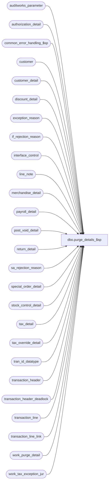

# dbo.purge_details_$sp

**Database:** auditworks  
**Server:** bedrockdb01  

## Architecture Diagram



## Table Dependencies

| Referenced Table |
|---|
| auditworks_parameter |
| authorization_detail |
| common_error_handling_$sp |
| customer |
| customer_detail |
| discount_detail |
| exception_reason |
| if_rejection_reason |
| interface_control |
| line_note |
| merchandise_detail |
| payroll_detail |
| post_void_detail |
| return_detail |
| sa_rejection_reason |
| special_order_detail |
| stock_control_detail |
| tax_detail |
| tax_override_detail |
| tran_id_datatype |
| transaction_header |
| transaction_header_deadlock |
| transaction_line |
| transaction_line_link |
| work_purge_detail |
| work_tax_exception_jur |

## Stored Procedure Code

```sql
create proc dbo.purge_details_$sp 

AS

/* 
PROC NAME: purge_details_$sp 
     DESC: Deletes from all current detail tables where tran-id in work_purge_detail
	   Called by day_end_purge_$sp	

  NOTE:  This unicode version is suitable for both SA5.0 and SA5.1

  HISTORY:
Date        Name        Def#  Desc
Apr20,11    Paul      126275  Removed delete of translate_error since it is handled by day_end_purge_$sp
Jan04,11    Paul      105313  Use unicode datatypes for error trap
Apr29,08    Paul       87777  Uplift 1-3XJMCT to SA5
Mar16,05    Maryam   DV-1202  Delete transaction_line_link.
Dec13,04    David    DV-1191  Improve performance by adding hints.
Apr29,08    Paul    1-3XJMCT  add a range clause to improve performance when tables are large
25-Apr-2002 Phu      1-C9P5S  Remove entry in work_tax_exception_jur and tax_detail
30-Nov-2001 Phu         8931  Error handling
10-Aug-2001 Shapoor     8481  Use the 'transactions_per_batch' parameter to determine the batch size.         
13-Aug-1999 Daphna F    5043  Moved truncate work_purge_detail to day_end_purge_$sp
23-Jul-1999 Daphna F    5026  Author

*/

DECLARE	@errmsg 			nvarchar(255),
	@errno 				int,
	@max_tran_id			tran_id_datatype,
	@message_id			int,
	@min_tran_id			tran_id_datatype,
	@object_name			nvarchar(255),
	@operation_name			nvarchar(100),
	@process_name			nvarchar(100),
	@process_no			int,
        @rows_per_batch                 integer,
        @rows_deleted                   integer

SELECT @message_id = 201068,
	@process_name = 'purge_details_$sp',
	@process_no = 16

  SELECT @rows_per_batch = CONVERT(integer,ISNULL(par_value,'10000'))
    FROM auditworks_parameter
   WHERE par_name = 'rows_per_batch'

  SELECT @errno = @@error
   IF @errno <> 0
     BEGIN
      SELECT @errmsg = 'Unable to select from auditworks_parameter (rows_per_batch)',
	     @object_name = 'auditworks_parameter',
	     @operation_name = 'SELECT'
      GOTO error
     END

  -- determine range of transaction_id in the batch
  SELECT @min_tran_id = MIN(transaction_id),
  	@max_tran_id = MAX(transaction_id)
   FROM work_purge_detail

  SET ROWCOUNT @rows_per_batch

  SELECT @rows_deleted = @rows_per_batch
  WHILE @rows_deleted = @rows_per_batch
    BEGIN
      DELETE authorization_detail
        FROM authorization_detail d, work_purge_detail w WITH (NOLOCK)
       WHERE d.transaction_id = w. transaction_id
         AND d.transaction_id >= @min_tran_id -- use range query to improve query plan
         AND d.transaction_id <= @max_tran_id

      SELECT @errno = @@error, @rows_deleted = @@rowcount
        IF @errno <> 0
         BEGIN
           SELECT @errmsg = 'Unable to delete authorization_detail',
		  @object_name = 'authorization_detail',
		  @operation_name = 'DELETE'
           GOTO error
        END
    END

  SELECT @rows_deleted = @rows_per_batch
  WHILE @rows_deleted = @rows_per_batch
    BEGIN
      DELETE customer
        FROM customer d, work_purge_detail w WITH (NOLOCK)
       WHERE d.transaction_id = w. transaction_id
         AND d.transaction_id >= @min_tran_id -- use range query to improve query plan
         AND d.transaction_id <= @max_tran_id

      SELECT @errno = @@error, @rows_deleted = @@rowcount
        IF @errno <> 0
         BEGIN
           SELECT @errmsg = 'Unable to delete customer',
		  @object_name = 'customer',
		  @operation_name = 'DELETE'
           GOTO error
        END
    END

  SELECT @rows_deleted = @rows_per_batch
  WHILE @rows_deleted = @rows_per_batch
    BEGIN
      DELETE customer_detail
        FROM customer_detail d, work_purge_detail w WITH (NOLOCK)
       WHERE d.transaction_id = w. transaction_id
         AND d.transaction_id >= @min_tran_id -- use range query to improve query plan
         AND d.transaction_id <= @max_tran_id

      SELECT @errno = @@error, @rows_deleted = @@rowcount
        IF @errno <> 0
         BEGIN
    SELECT @errmsg = 'Unable to delete customer_detail',
		  @object_name = 'customer_detail',
		  @operation_name = 'DELETE'
           GOTO error
        END
    END

  SELECT @rows_deleted = @rows_per_batch
  WHILE @rows_deleted = @rows_per_batch
    BEGIN
      DELETE discount_detail
        FROM discount_detail d, work_purge_detail w WITH (NOLOCK)
       WHERE d.transaction_id = w. transaction_id
         AND d.transaction_id >= @min_tran_id -- use range query to improve query plan
         AND d.transaction_id <= @max_tran_id

      SELECT @errno = @@error, @rows_deleted = @@rowcount
        IF @errno <> 0
         BEGIN
           SELECT @errmsg = 'Unable to delete discount_detail',
		  @object_name = 'discount_detail',
		  @operation_name = 'DELETE'
           GOTO error
        END
    END

  SELECT @rows_deleted = @rows_per_batch
  WHILE @rows_deleted = @rows_per_batch
    BEGIN
      DELETE exception_reason
        FROM exception_reason d, work_purge_detail w WITH (NOLOCK)
       WHERE d.transaction_id = w. transaction_id

      SELECT @errno = @@error, @rows_deleted = @@rowcount
        IF @errno <> 0
         BEGIN
          SELECT @errmsg = 'Unable to delete exception_reason',
		  @object_name = 'exception_reason',
		  @operation_name = 'DELETE'
           GOTO error
        END
    END

  SELECT @rows_deleted = @rows_per_batch
  WHILE @rows_deleted = @rows_per_batch
    BEGIN
      DELETE if_rejection_reason
        FROM if_rejection_reason d, work_purge_detail w WITH (NOLOCK)
       WHERE d.transaction_id = w. transaction_id

      SELECT @errno = @@error, @rows_deleted = @@rowcount
        IF @errno <> 0
         BEGIN
           SELECT @errmsg = 'Unable to delete if_rejection_reason',
		  @object_name = 'if_rejection_reason',
		  @operation_name = 'DELETE'
           GOTO error
        END
    END

  SELECT @rows_deleted = @rows_per_batch
  WHILE @rows_deleted = @rows_per_batch
    BEGIN
      DELETE line_note
        FROM line_note d, work_purge_detail w WITH (NOLOCK)
       WHERE d.transaction_id = w. transaction_id
         AND d.transaction_id >= @min_tran_id -- use range query to improve query plan
         AND d.transaction_id <= @max_tran_id


      SELECT @errno = @@error, @rows_deleted = @@rowcount
        IF @errno <> 0
         BEGIN
           SELECT @errmsg = 'Unable to delete line_note',
		  @object_name = 'line_note',
		  @operation_name = 'DELETE'
           GOTO error
        END
    END

  SELECT @rows_deleted = @rows_per_batch
  WHILE @rows_deleted = @rows_per_batch
    BEGIN
      DELETE merchandise_detail
        FROM merchandise_detail d, work_purge_detail w WITH (NOLOCK)
       WHERE d.transaction_id = w. transaction_id
         AND d.transaction_id >= @min_tran_id -- use range query to improve query plan
         AND d.transaction_id <= @max_tran_id

      SELECT @errno = @@error, @rows_deleted = @@rowcount
        IF @errno <> 0
         BEGIN
           SELECT @errmsg = 'Unable to delete merchandise_detail',
		  @object_name = 'merchandise_detail',
		  @operation_name = 'DELETE'
           GOTO error
        END
    END

  SELECT @rows_deleted = @rows_per_batch
  WHILE @rows_deleted = @rows_per_batch
    BEGIN
      DELETE payroll_detail
        FROM payroll_detail d, work_purge_detail w WITH (NOLOCK)
       WHERE d.transaction_id = w. transaction_id
         AND d.transaction_id >= @min_tran_id -- use range query to improve query plan
         AND d.transaction_id <= @max_tran_id

      SELECT @errno = @@error, @rows_deleted = @@rowcount
        IF @errno <> 0
         BEGIN
           SELECT @errmsg = 'Unable to delete payroll_detail',
		  @object_name = 'payroll_detail',
		  @operation_name = 'DELETE'
           GOTO error
        END
    END

  SELECT @rows_deleted = @rows_per_batch
  WHILE @rows_deleted = @rows_per_batch
    BEGIN
      DELETE post_void_detail
        FROM post_void_detail d, work_purge_detail w WITH (NOLOCK)
       WHERE d.transaction_id = w. transaction_id

      SELECT @errno = @@error, @rows_deleted = @@rowcount
        IF @errno <> 0
         BEGIN
           SELECT @errmsg = 'Unable to delete post_void_detail',
		  @object_name = 'post_void_detail',
		  @operation_name = 'DELETE'
           GOTO error
END
    END

  SELECT @rows_deleted = @rows_per_batch
  WHILE @rows_deleted = @rows_per_batch
    BEGIN
      DELETE return_detail
        FROM return_detail d, work_purge_detail w WITH (NOLOCK)
       WHERE d.transaction_id = w. transaction_id
         AND d.transaction_id >= @min_tran_id -- use range query to improve query plan
         AND d.transaction_id <= @max_tran_id

      SELECT @errno = @@error, @rows_deleted = @@rowcount
        IF @errno <> 0
         BEGIN
           SELECT @errmsg = 'Unable to delete return_detail',
		  @object_name = 'return_detail',
		  @operation_name = 'DELETE'
           GOTO error
        END
    END

  SELECT @rows_deleted = @rows_per_batch
  WHILE @rows_deleted = @rows_per_batch
    BEGIN
      DELETE sa_rejection_reason
        FROM sa_rejection_reason d, work_purge_detail w WITH (NOLOCK)
       WHERE d.transaction_id = w. transaction_id

      SELECT @errno = @@error, @rows_deleted = @@rowcount
        IF @errno <> 0
         BEGIN
           SELECT @errmsg = 'Unable to delete sa_rejection_reason',
		  @object_name = 'sa_rejection_reason',
		  @operation_name = 'DELETE'
           GOTO error
        END
    END

  SELECT @rows_deleted = @rows_per_batch
  WHILE @rows_deleted = @rows_per_batch
    BEGIN
      DELETE special_order_detail
        FROM special_order_detail d, work_purge_detail w WITH (NOLOCK)
       WHERE d.transaction_id = w. transaction_id
         AND d.transaction_id >= @min_tran_id -- use range query to improve query plan
         AND d.transaction_id <= @max_tran_id

      SELECT @errno = @@error, @rows_deleted = @@rowcount
        IF @errno <> 0
         BEGIN
           SELECT @errmsg = 'Unable to delete special_order_detail',
		  @object_name = 'special_order_detail',
		  @operation_name = 'DELETE'
           GOTO error
        END
    END

  SELECT @rows_deleted = @rows_per_batch
  WHILE @rows_deleted = @rows_per_batch
    BEGIN
      DELETE stock_control_detail
        FROM stock_control_detail d, work_purge_detail w WITH (NOLOCK)
       WHERE d.transaction_id = w. transaction_id
         AND d.transaction_id >= @min_tran_id -- use range query to improve query plan
         AND d.transaction_id <= @max_tran_id

      SELECT @errno = @@error, @rows_deleted = @@rowcount
        IF @errno <> 0
         BEGIN
           SELECT @errmsg = 'Unable to delete stock_control_detail',
		  @object_name = 'stock_control_detail',
		  @operation_name = 'DELETE'
           GOTO error
        END
    END

  SELECT @rows_deleted = @rows_per_batch
  WHILE @rows_deleted = @rows_per_batch
    BEGIN
      DELETE tax_override_detail
        FROM tax_override_detail d, work_purge_detail w WITH (NOLOCK)
       WHERE d.transaction_id = w. transaction_id
         AND d.transaction_id >= @min_tran_id -- use range query to improve query plan
         AND d.transaction_id <= @max_tran_id

      SELECT @errno = @@error, @rows_deleted = @@rowcount
        IF @errno <> 0
         BEGIN
           SELECT @errmsg = 'Unable to delete tax_override_detail',
		  @object_name = 'tax_override_detail',
		  @operation_name = 'DELETE'
           GOTO error
        END
    END

  SELECT @rows_deleted = @rows_per_batch
  WHILE @rows_deleted = @rows_per_batch
    BEGIN
      DELETE transaction_line_link
        FROM transaction_line_link k, work_purge_detail w WITH (NOLOCK)
       WHERE k.transaction_id = w. transaction_id
         AND k.transaction_id >= @min_tran_id -- use range query to improve query plan
         AND k.transaction_id <= @max_tran_id

      SELECT @errno = @@error, @rows_deleted = @@rowcount
        IF @errno <> 0
         BEGIN
           SELECT @errmsg = 'Unable to delete transaction_line_link',
		  @object_name = 'transaction_line_link',
		  @operation_name = 'DELETE'
           GOTO error
        END
    END    

  SELECT @rows_deleted = @rows_per_batch
  WHILE @rows_deleted = @rows_per_batch
    BEGIN
      DELETE interface_control
        FROM interface_control d, work_purge_detail w WITH (NOLOCK)
       WHERE d.transaction_id = w. transaction_id
         AND d.transaction_id >= @min_tran_id -- use range query to improve query plan
         AND d.transaction_id <= @max_tran_id

      SELECT @errno = @@error, @rows_deleted = @@rowcount
        IF @errno <> 0
         BEGIN
           SELECT @errmsg = 'Unable to delete interface_control',
		  @object_name = 'interface_control',
		  @operation_name = 'DELETE'
           GOTO error
        END
    END

  /* translate_error is purged by day_end_purge_$sp */

  SELECT @rows_deleted = @rows_per_batch
  WHILE @rows_deleted = @rows_per_batch
    BEGIN
      DELETE tax_detail
        FROM tax_detail td, work_purge_detail w WITH (NOLOCK)
       WHERE td.transaction_id = w.transaction_id
         AND td.transaction_id >= @min_tran_id -- use range query to improve query plan
         AND td.transaction_id <= @max_tran_id

      SELECT @errno = @@error, @rows_deleted = @@rowcount
        IF @errno <> 0
         BEGIN
           SELECT @errmsg = 'Unable to delete tax_detail',
		  @object_name = 'tax_detail',
		  @operation_name = 'DELETE'
           GOTO error
        END
    END

  SELECT @rows_deleted = @rows_per_batch
  WHILE @rows_deleted = @rows_per_batch
    BEGIN
      DELETE work_tax_exception_jur
        FROM work_tax_exception_jur wt, work_purge_detail w WITH (NOLOCK)
       WHERE wt.transaction_id = w.transaction_id

      SELECT @errno = @@error, @rows_deleted = @@rowcount
        IF @errno <> 0
         BEGIN
	  SELECT @errmsg = 'Unable to delete work_tax_exception_jur',
		  @object_name = 'work_tax_exception_jur',
		  @operation_name = 'DELETE'
           GOTO error
        END
    END


       
  SELECT @rows_deleted = @rows_per_batch
  WHILE @rows_deleted = @rows_per_batch
    BEGIN
      DELETE transaction_line
        FROM transaction_line d, work_purge_detail w WITH (NOLOCK)
       WHERE d.transaction_id = w. transaction_id
         AND d.transaction_id >= @min_tran_id -- use range query to improve query plan
         AND d.transaction_id <= @max_tran_id

      SELECT @errno = @@error, @rows_deleted = @@rowcount
        IF @errno <> 0
         BEGIN
           SELECT @errmsg = 'Unable to delete transaction_line',
		  @object_name = 'transaction_line',
		  @operation_name = 'DELETE'
           GOTO error
        END

    END -- while line

  BEGIN TRAN  -- simulate table lock to avoid deadlocks on header 

  UPDATE transaction_header_deadlock
  SET function_no = 15,
	status_date = getdate()

  SELECT @rows_deleted = @rows_per_batch
  WHILE @rows_deleted = @rows_per_batch
    BEGIN
      DELETE transaction_header
        FROM transaction_header d, work_purge_detail w WITH (NOLOCK)
       WHERE d.transaction_id = w. transaction_id
         AND d.transaction_id >= @min_tran_id -- use range query to improve query plan
         AND d.transaction_id <= @max_tran_id

      SELECT @errno = @@error, @rows_deleted = @@rowcount
        IF @errno <> 0
         BEGIN
           SELECT @errmsg = 'Unable to delete transaction_header',
		  @object_name = 'transaction_header',
		  @operation_name = 'DELETE'
           GOTO error
        END

    END -- while header

  COMMIT TRAN

SET ROWCOUNT 0
RETURN


error:
	SET ROWCOUNT 0

	EXEC common_error_handling_$sp @process_no, @errno, @errmsg, 0, @message_id, 
	@process_name, @object_name, @operation_name, 1

	RETURN
```

