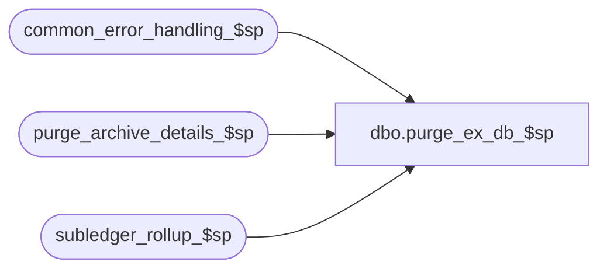

# dbo.purge_ex_db_$sp

**Database:** auditworks  
**Server:** bedrockdb01  

## Architecture Diagram



## Table Dependencies

| Referenced Table |
|---|
| common_error_handling_$sp |
| purge_archive_details_$sp |
| subledger_rollup_$sp |

## Stored Procedure Code

```sql
create proc dbo.purge_ex_db_$sp 
AS

/* Proc Name: purge_ex_db_$sp
** Desc: wrapper proc to allow scheduled susm call to purge external archive db.
** 	 Avoids need to run full dayend in external archive db.


HISTORY
Date       Name               Def#  Desc
Feb20,15   Paul S            94760  original version

*/

DECLARE
	@errline				int,
	@errmsg 				nvarchar(2000),
	@errmsg2 				nvarchar(2000),
	@errno 					int,
	@message_id				int,
	@object_name				nvarchar(255),
	@operation_name				nvarchar(100),
	@process_name				nvarchar(100),
	@process_no 				smallint;

SELECT 	@process_no = 29,
	@message_id = 201068,
	@process_name = 'purge_ex_db_$sp';

BEGIN TRY

  /* Purge av tables in external db */

  SELECT @errmsg = 'Unable to execute purge_archive_details_$sp',
	 @object_name = 'purge_archive_details_$sp',
	 @operation_name = 'EXEC';
  EXEC purge_archive_details_$sp;

  /* Purge subledger tables in external db */

  SELECT @errmsg = 'Unable to execute subledger_rollup_$sp',
	 @object_name = 'subledger_rollup_$sp',
	 @operation_name = 'EXEC';
  EXEC subledger_rollup_$sp;

  RETURN;


business_error:   /* Business Rule handler. */

  SELECT @errmsg2 = @errmsg;

	/* Could include similar cleanup code to system error trap when needed (example is from move_store_$sp).
	   However, could also exclude the cleanup code here since the outer system error catch should fire again after the exec below. */

  EXEC common_error_handling_$sp @process_no, @errno, @errmsg, 0, @message_id, 
	  @process_name, @object_name, @operation_name, 1;
	  /* Note: when the exec above raises an error, that action also fires the system error trap (below) */
	RETURN;
END TRY

BEGIN CATCH; -- trap system errors
    /* common error handling. Appending proc name here because a rollback could occur if called within a transaction. */

  SELECT @errno = ERROR_NUMBER(),
		@errline = ERROR_LINE();

  SELECT @errmsg = CONVERT(nvarchar, @errno) + ':' + @process_name + ':' + CONVERT(nvarchar, @errline) + ':'
               + COALESCE(@errmsg, ' ') + ':' + ERROR_MESSAGE();

	 /* this condition will only be true when raise error in traps above fire this general catch */
  IF @errmsg2 IS NOT NULL
	  SELECT @errmsg = @errmsg2;

  EXEC common_error_handling_$sp @process_no, @errno, @errmsg, 0, @message_id, 
	  @process_name, @object_name, @operation_name, 1;

  RETURN;
END CATCH;
```

